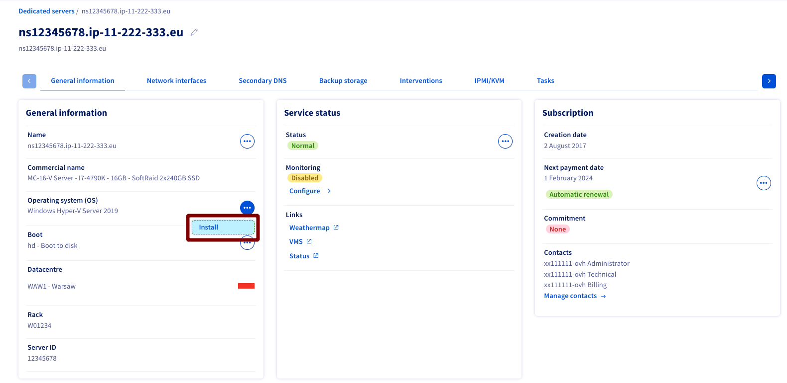
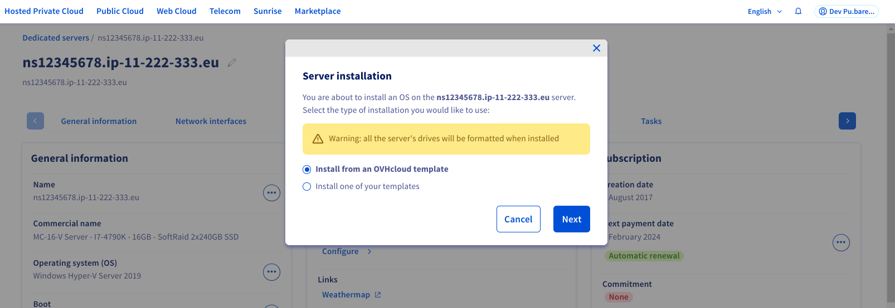
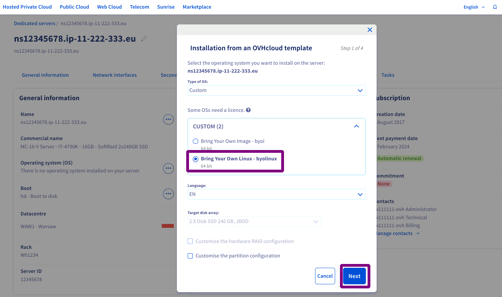
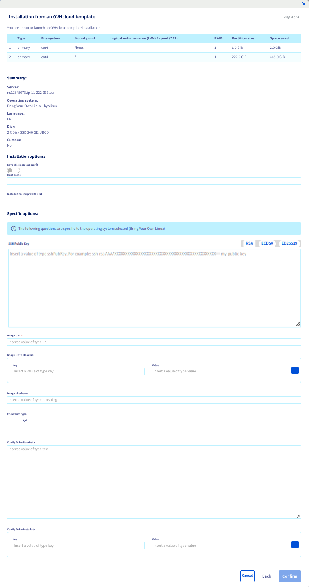

## Objectif

La fonctionnalité Bring Your Own Linux (BYOLinux) vous permet de déployer des images Linux *cloudready* directement sur votre serveur dédié. Vous pouvez ainsi utiliser le service bare metal comme ressource pour vos déploiements.

**Que signifie *cloudready* ?**

La norme *cloudready* signifie généralement être agnostique de l’infrastructure sur laquelle l’image est déployée.
En plus des prérequis et limitations mentionnés ci-dessous, vous devez vous assurer que l'image (téléchargée ou générée) répond correctement à la définition des attentes techniques d'une image cloudready.

**Ce guide vous explique comment utiliser Bring Your Own Linux (BYOLinux) sur votre serveur dédié OVHcloud.**

## Prérequis

- Un [serveur dédié](/links/bare-metal/bare-metal) dans votre compte OVHcloud
- Être connecté à l'[espace client OVHcloud](/links/manager) (pour la méthode de [déploiement via l'espace client](#viacontrolpanel) de ce guide)
- Avoir accès à l'[API OVHcloud](/pages/manage_and_operate/api/first-steps) (pour la méthode de [déploiement via l'API](#viaapi) de ce guide)
- Votre image doit être inférieure à la RAM du serveur moins 3 Gio
- Un script `/root/.ovh/make_image_bootable.sh` exécutable, qui installera ou configurera le bootloader, [par exemple GRUB](https://github.com/ovh/bringyourownlinux/blob/main/example_build/files/make_image_bootable.sh)

> [!warning]
>
> Tout comme une installation OS classique, une nouvelle installation par BYOLinux effacera l'intégralité des données présentes sur le serveur.
>

## En pratique

**Limites techniques :**

Certaines limites techniques sont liées à l’utilisation de produits physiques comme les serveurs dédiés. Voici une liste non exhaustive à garder à l'esprit lors de la préparation de votre déploiement :

- Type de démarrage : **uefi** ou **legacy**
- Type de partition : **MBR** ou **GPT**
- Format de l'image : **qcow2**
- Une seule partition dans l'image qcow2

**Méthodes de déploiement :**

- [Déploiement via l'espace client](#viacontrolpanel) : vous permet de déployer simplement votre image depuis l'espace client OVHcloud.
- [Déploiement via API](#viaapi) : vous pouvez utiliser l’API OVHcloud pour intégrer des images dans vos propres scripts afin d’automatiser les déploiements.

### Déploiement de votre image via l’espace client <a name="viacontrolpanel"></a>

Connectez-vous à l'[espace client OVHcloud](/links/manager) et rendez-vous dans la section `Bare Metal Cloud`{.action} puis sélectionnez votre serveur sous `Serveurs dédiés`{.action}.

Dans l'onglet `Informations générales`{.action}, cliquez sur le bouton `...`{.action} à côté de « Système (OS) » puis cliquez sur `Installer`{.action}.

{.thumbnail}

Dans la fenêtre qui apparaît, sélectionnez `Installer à partir d'un template OVHcloud`{.action} et cliquez sur `Suivant`{.action}.

{.thumbnail}

A l'étape suivante, sélectionnez `Personnalisé` dans le menu puis `Bring Your Own Linux - byolinux` et cliquez sur `Suivant`{.action}.

{.thumbnail}

Vous allez être redirigé vers la page de configuration. Assurez-vous que l'URL de votre image est au bon format. Remplissez le reste des champs obligatoires de cette page. Une fois que vous avez confirmé que les informations sont correctes, cliquez sur `Confirmer`{.action}.

Vous trouverez plus de détails sur les options dans la section « [options de déploiement](#options) » ci-dessous.

Pour plus d'informations et des exemples sur ConfigDrive de Cloud-Init, consultez la documentation officielle sur [cette page](https://cloudinit.readthedocs.io/en/22.1_a/topics/examples.html).

{.thumbnail}

### Déploiement de votre image via les API <a name="viaapi"></a>

Connectez-vous sur [https://api.ovh.com/](https://api.ovh.com/){.external} puis rendez-vous dans la section `/dedicated/server`{.action}.

> [!api]
>
> @api {v1} /dedicated/server POST /dedicated/server/{serviceName}/install/start
>

Le contenu de la requête API de Bring Your Own Linux (BYOLinux) doit être similaire au fichier JSON suivant :

> [!warning]
>
> Dans la section `userMetadata`, seul le champ `imageURL` est obligatoire.
>

```json
{
  "details": {
    "customHostname": "myCustomBYOLinux"
  },
  "partitionSchemeName": "default",
  "templateName": "byolinux_64",
  "userMetadata": [
    {
      "key": "imageURL",
      "value": "https://github.com/ashmonger/akution_test/releases/download/0.5-compress/deb11k6.qcow2"
    },
    {
      "key": "httpHeaders0Key",
      "value": "Authorization"
    },
    {
      "key": "httpHeaders0Value",
      "value": "Basic bG9naW46cGFzc3dvcmQ="
    },
    {
      "key": "imageCheckSum",
      "value": "367f26c915f39314dde155db3a2b0326803e06975d1f4be04256f8b591e38fd4062d36eb7d50e99da7a50b7f4cd69640e56a4ab93e8e0274e4e478e0f84b5d29"
    },
    {
      "key": "imageCheckSumType",
      "value": "sha512"
    },
    {
      "key": "configDriveUserData",
      "value": "I2Nsb3VkLWNvbmZpZwpzc2hfYXV0aG9yaXplZF9rZXlzOgogIC0gc3NoLXJzYSBBQUFBQjhkallpdz09IG15c2VsZkBteWRvbWFpbi5uZXQKCnVzZXJzOgogIC0gbmFtZTogcGF0aWVudDAKICAgIHN1ZG86IEFMTD0oQUxMKSBOT1BBU1NXRDpBTEwKICAgIGdyb3VwczogdXNlcnMsIHN1ZG8KICAgIHNoZWxsOiAvYmluL2Jhc2gKICAgIGxvY2tfcGFzc3dkOiBmYWxzZQogICAgc3NoX2F1dGhvcml6ZWRfa2V5czoKICAgICAgLSBzc2gtcnNhIEFBQUFCOGRqWWl3PT0gbXlzZWxmQG15ZG9tYWluLm5ldApkaXNhYmxlX3Jvb3Q6IGZhbHNlCnBhY2thZ2VzOgogIC0gdmltCiAgLSB0cmVlCmZpbmFsX21lc3NhZ2U6IFRoZSBzeXN0ZW0gaXMgZmluYWxseSB1cCwgYWZ0ZXIgJFVQVElNRSBzZWNvbmRzCg=="
    }
  ]
}
```

Même si le configDrive user data peut être envoyé à l'API en clair directement en échappant les bons caractères, il est recommandé d'envoyer à l'API le script encodé en base64 en utilisant par exemple la commande UNIX/Linux suivante :

```bash
cat my-data.yaml | base64 -w0
```

Voici le configDrive user data en clair avec l'exemple ci-dessus :

```yaml
#cloud-config
ssh_authorized_keys:
  - ssh-rsa AAAAB8djYiw== myself@mydomain.net

users:
  - name: patient0
    sudo: ALL=(ALL) NOPASSWD:ALL
    groups: users, sudo
    shell: /bin/bash
    lock_passwd: false
    ssh_authorized_keys:
      - ssh-rsa AAAAB8djYiw== myself@mydomain.net
disable_root: false
packages:
  - vim
  - tree
final_message: The system is finally up, after $UPTIME seconds
```

Une fois les champs complétés, démarrez le déploiement en cliquant sur `Execute`{.action}.

#### Options de déploiement <a name="options"></a>

| Champ | Description | Obligatoire |
|-|-|-|
| userMetadata/sshKey | La clé publique SSH | ❌ |
| userMetadata/imageURL | L'URL de votre image Linux | ✅ |
| userMetadata/imageCheckSum | Checksum de votre image | ❌ |
| userMetadata/imageCheckSumType | Type de checksum de votre image. (md5, sha1, sha256, sha512) | ❌ (sauf si checksum fourni) |
| userMetadata/configDriveUserData | Contenu de votre fichier configDrive¹ | ❌ |
| userMetadata/configDriveMetadata | Métadonnées Cloud-Init personnalisées | ❌ |
| userMetadata/httpHeaders?Key | Clé des en-têtes HTTP | ❌² |
| userMetadata/httpHeaders?Value | Valeur des en-têtes HTTP | ❌² |

¹ Il peut s'agir d'un `#cloud-config` ou d'un script. Il doit être sur une ligne et avoir `\n` pour la ligne-retour.<br />
² À utiliser uniquement si vous avez besoin d'en-têtes HTTP, tels que `Basic Auth`<br />

> [!primary]
>
> La partition ConfigDrive est utilisée par cloud-init lors du premier démarrage du serveur afin d'appliquer vos configurations. Vous pouvez choisir d'utiliser la partition par défaut ou une partition personnalisée (en utilisant `configDriveUserData`).
>

#### Les erreurs clients fréquentes <a name="errors"></a>

Le tableau suivant donne un aperçu des erreurs clients les plus connues et de la manière de les corriger.

|Message d'erreur|Détails|Solution(s)|
|---|---|---|
|Please provide checkSum AND checkSumType or none of them|Vous avez précisé l'un des 2 champs parmi : `imageCheckSum` et `imageCheckSumType`.|Précisez les 2 valeurs ou aucune d'entre elle.|
|image provided format is `x` which does not match expected qcow2 format|Peu importe l'extension du fichier, son format réel doit être qcow2.|- Changer la valeur de `imageType` à `raw`.<br />- Convertissez votre image au format qcow2.|
|image provided has a size of `n` bytes which is larger than `device` of `m` bytes|L'image spécifiée a une taille supérieure à celle du disque choisi pour l'installation.|- Si votre serveur possède plusieurs grappes de disques, vous pouvez réessayez une installation sur une autre grappe de disques à l'aide de l'argument `diskgroupid`.<br />- Vous devez réduire la taille de votre image.|
|Can't write qcow2 on disk|Impossible d'écrire l'image qcow2 sur le disque.|Modifier votre image de telle sorte que la commande `qemu-img convert -f "$imageType" -O raw $pathToImageFile "$device"` fonctionne.|
|Could not download, qcow2 image is too big to download in memory.|Il n'y a pas assez d'espace en RAM pour télécharger l'image.|Réduisez la taille de votre image.|
|Could not download image located : `url`|Impossible de télécharger l'image située : `imageURL`.|Vérifiez qu'un téléchargement avec `curl` depuis votre serveur en rescue fonctionne. Si des en-têtes HTTP sont requises, vous devez les spécifier à l'aide des paramètres `httpHeaders`.|
|Bad `checkSumType` for downloaded file, got : `n` while expecting `m`.|Le checksum est incorrect.|- Assurez-vous de spécifier le bon checksum<br />- Vérifiez qu'un téléchargement avec `curl` depuis votre serveur en rescue fonctionne.|

Voir section [erreurs clients fréquentes](/pages/bare_metal_cloud/dedicated_servers/partitioning_ovh#errors) de la page API OVHcloud & Partitionnement pour les erreurs spécifiques au partitionnement.

## Aller plus loin

[Bring Your Own Linux (BYOLinux) - Version détaillée](https://github.com/ovh/BringYourOwnLinux)

[API OVHcloud et installation d'un OS](/pages/bare_metal_cloud/dedicated_servers/api-os-installation)

[API OVHcloud & Partitionnement](/pages/bare_metal_cloud/dedicated_servers/partitioning_ovh)

[Bring Your Own Image (BYOI)](/pages/bare_metal_cloud/dedicated_servers/bring-your-own-image)

[Comparaison entre Bring Your Own Image (BYOI) et Bring Your Own Linux (BYOLinux)](/pages/bare_metal_cloud/dedicated_servers/bring-your-own-image-versus-bring-your-own-linux)

Échangez avec notre [communauté d'utilisateurs](/links/community).
