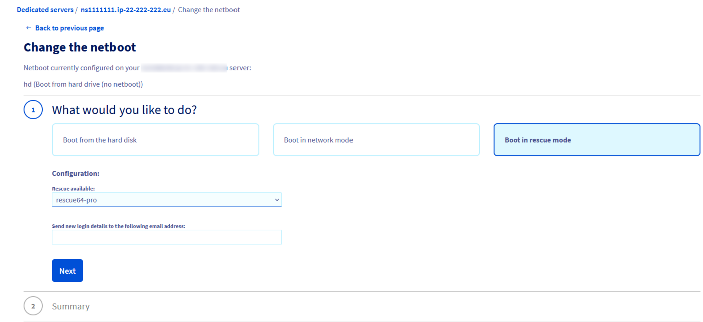
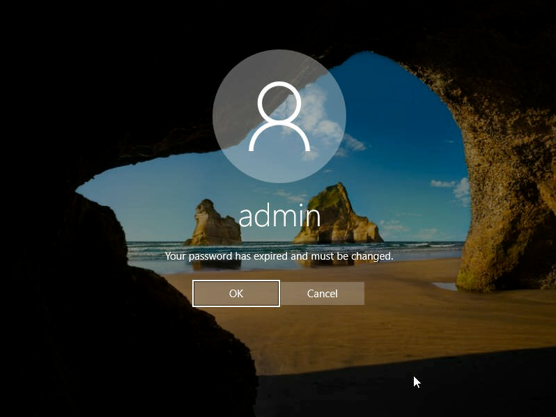
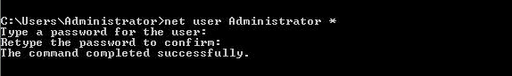
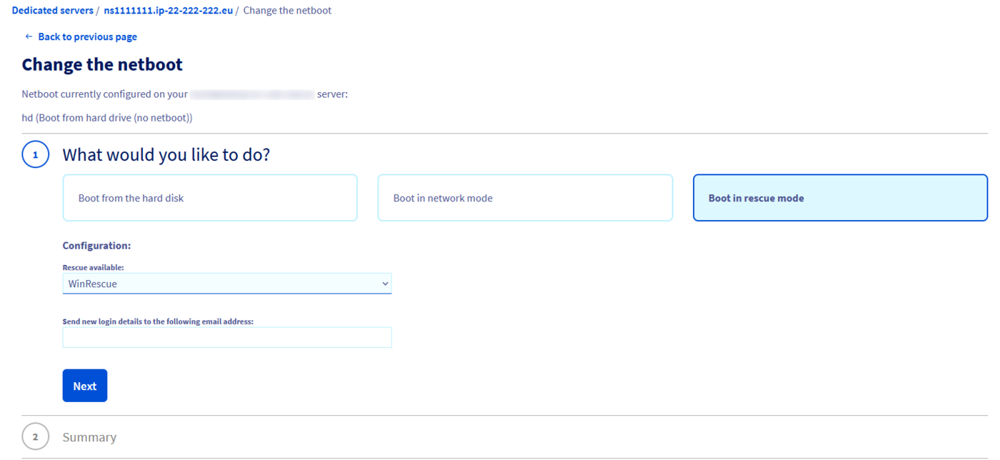
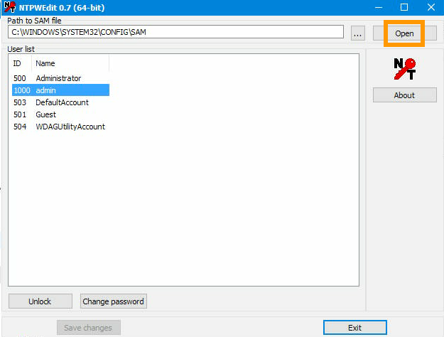
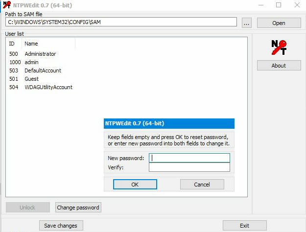

**Last updated 12th January 2021**

## Objective

When you install or reinstall a Windows operating system, you are provided with a password for administrative access. We strongly recommend that you change this initial password, as detailed in our guide about [securing a dedicated server](/pages/bare_metal_cloud/dedicated_servers/securing-a-dedicated-server). In case you have lost your admin password, it needs to be reset using rescue mode.

**This guide will take you through the process of changing your server's admin password via the available rescue mode configurations for a Windows OS.**

## Requirements

- A [dedicated server](https://www.ovhcloud.com/en-gb/bare-metal/) with Windows installed in your OVHcloud account
- Access to the [OVHcloud Control Panel](https://www.ovh.com/auth/?action=gotomanager&from=https://www.ovh.co.uk/&ovhSubsidiary=GB)


## Instructions

The following steps describe the process of changing the local admin password by using the always available OVHcloud rescue mode (Linux-based). If you would like to use Windows PE (WinRescue) instead, skip to the pertinent section [at the end of this guide](./#resetting-the-admin-password-using-winrescue). 

### Step 1: Rebooting the server into rescue mode

The system has to be started in rescue mode before the admin password can be changed. Log in to the [OVHcloud Control Panel](https://www.ovh.com/auth/?action=gotomanager&from=https://www.ovh.co.uk/&ovhSubsidiary=GB), go to the `Bare Metal Cloud`{.action} section and select your server from `Dedicated Servers`{.action}.

The netboot needs to be switched to "rescue64-pro (Customer rescue system (Linux))". Look for "Boot" in the **General information** box and click on `...`{.action}, then on `Edit`{.action}.<br>
In the next page, select **Boot in rescue mode** and select "rescue64-pro" from the menu. Specify an alternative email address below if you do *not* want the login credentials sent to your customer account's primary address.
<br>Click on `Next`{.action} and `Confirm`{.action}.

{.thumbnail}

Once the change is completed, click on `...`{.action} next to "Status" in the box labelled **Service status**. Select `Restart`{.action} and the server will restart into rescue mode.<br>This might take a few minutes; you can check the status on the `Tasks`{.action} tab. An email will be sent which contains some information and the login password for the rescue mode's "root" user.

{.thumbnail}

For more information about rescue mode, please refer to [this guide](/pages/bare_metal_cloud/dedicated_servers/rescue_mode).

### Step 2: Mounting the system partition

Connect to your server via SSH. (Consult the [SSH introduction guide](/pages/bare_metal_cloud/dedicated_servers/ssh_introduction) if necessary.) Since it is a Windows server, you will see partitions labelled "Microsoft LDM data".

```
# fdisk -l
Disk /dev/sda: 1.8 TiB, 2000398934016 bytes, 3907029168 sectors
Units: sectors of 1 * 512 = 512 bytes
Sector size (logical/physical): 512 bytes / 512 bytes
I/O size (minimum/optimal): 512 bytes / 512 bytes
Disklabel type: gpt
Disk identifier: 54A5B25A-75B9-4355-9185-8CD958DCF32A
 
Device          Start        End    Sectors  Size Type
/dev/sda1        2048     718847     716800  350M EFI System
/dev/sda2      718848     720895       2048    1M Microsoft LDM metadata
/dev/sda3      720896     980991     260096  127M Microsoft reserved
/dev/sda4      980992 3907028991 3906048000  1.8T Microsoft LDM data
/dev/sda5  3907028992 3907029134        143 71.5K Microsoft LDM data
```

In the example output, "sda4" must be the (file) system partition, as determined by its size. Usually, there is a mirrored second output which in this case would be "/dev/sdb**X**". That is because in most cases, the server will have multiple disks with identical partition schemes. For the password reset process, only the first one is important. Next, mount this partition:

```
# mount /dev/sda4 /mnt
```
Verify the mountpoint:

```
# lsblk
NAME   MAJ:MIN RM  SIZE RO TYPE MOUNTPOINT
sdb      8:16   0  1.8T  0 disk
├─sdb4   8:20   0  1.8T  0 part
├─sdb2   8:18   0    1M  0 part
├─sdb5   8:21   0 71.5K  0 part
├─sdb3   8:19   0  127M  0 part
└─sdb1   8:17   0  350M  0 part
sda      8:0    0  1.8T  0 disk
├─sda4   8:4    0  1.8T  0 part /mnt
├─sda2   8:2    0    1M  0 part
├─sda5   8:5    0 71.5K  0 part
├─sda3   8:3    0  127M  0 part
└─sda1   8:1    0  350M  0 part
```

In the example above, the operation succeeded. If the mounting failed, you might receive an error message like this: 

```
The disk contains an unclean file system (0, 0).
Metadata kept in Windows cache, refused to mount.
Failed to mount '/dev/sda4': Operation not permitted
The NTFS partition is in an unsafe state. Please resume and shutdown
Windows fully (no hibernation or fast restarting), or mount the volume
read-only with the 'ro' mount option.
```

In this case, use the following command and then try to mount again.

```
# ntfsfix /dev/sda4
# mount /dev/sda4 /mnt
```

### Step 3: Clearing the current password

This step involves manipulating the *SAM* file with a tool to clear the admin user's password. Change to the appropriate directory and list the Windows users:

```
# cd /mnt/Windows/System32/config
/mnt/Windows/System32/config# chntpw -l SAM

chntpw version 1.00 140201, (c) Petter N Hagen
Hive <SAM> name (from header): <\SystemRoot\System32\Config\SAM>
ROOT KEY at offset: 0x001020 * Subkey indexing type is: 686c <lh>
File size 65536 [10000] bytes, containing 8 pages (+ 1 headerpage)
Used for data: 359/39024 blocks/bytes, unused: 33/18064 blocks/bytes.

| RID -|---------- Username ------------| Admin? |- Lock? --|
| 03e8 | admin                          | ADMIN  | dis/lock |
| 01f4 | Administrator                  | ADMIN  | dis/lock |
| 01f7 | DefaultAccount                 |        | dis/lock |
| 01f5 | Guest                          |        | dis/lock |
| 01f8 | WDAGUtilityAccount             |        | dis/lock |
```

If the command does not work, install the tool first: `apt get install chntpw`.

Clear the password for the admin user with the following command. (Choose "Administrator" if "admin" does not exist.)

```
# chntpw -u admin SAM
chntpw version 1.00 140201, (c) Petter N Hagen
Hive <SAM> name (from header): <\SystemRoot\System32\Config\SAM>
ROOT KEY at offset: 0x001020 * Subkey indexing type is: 686c <lh>
File size 65536 [10000] bytes, containing 8 pages (+ 1 headerpage)
Used for data: 361/39344 blocks/bytes, unused: 35/13648 blocks/bytes.
 
================= USER EDIT ====================
 
RID     : 1000 [03e8]a
Username: admin
fullname:
comment :
homedir :
 
00000221 = Users (which has 3 members)
00000220 = Administrators (which has 2 members)
 
Account bits: 0x0010 =
[ ] Disabled        | [ ] Homedir req.    | [ ] Passwd not req. |
[ ] Temp. duplicate | [X] Normal account  | [ ] NMS account     |
[ ] Domain trust ac | [ ] Wks trust act.  | [ ] Srv trust act   |
[ ] Pwd don't expir | [ ] Auto lockout    | [ ] (unknown 0x08)  |
[ ] (unknown 0x10)  | [ ] (unknown 0x20)  | [ ] (unknown 0x40)  |
 
Failed login count: 0, while max tries is: 0
Total  login count: 5
 
- - - - User Edit Menu:
 1 - Clear (blank) user password
(2 - Unlock and enable user account) [seems unlocked already]
 3 - Promote user (make user an administrator)
 4 - Add user to a group
 5 - Remove user from a group
 q - Quit editing user, back to user select
Select: [q] >
```
Type "1" and press Enter ("↩"). (Make use of option 2 first if there is an "X" next to "Disabled".)

```
Select: [q] > 1
Password cleared!
================= USER EDIT ====================
 
RID     : 1000 [03e8]
Username: admin
fullname:
comment :
homedir :
 
00000221 = Users (which has 3 members)
00000220 = Administrators (which has 2 members)
 
Account bits: 0x0010 =
[ ] Disabled        | [ ] Homedir req.    | [ ] Passwd not req. |
[ ] Temp. duplicate | [X] Normal account  | [ ] NMS account     |
[ ] Domain trust ac | [ ] Wks trust act.  | [ ] Srv trust act   |
[ ] Pwd don't expir | [ ] Auto lockout    | [ ] (unknown 0x08)  |
[ ] (unknown 0x10)  | [ ] (unknown 0x20)  | [ ] (unknown 0x40)  |
 
Failed login count: 0, while max tries is: 0
Total  login count: 5
** No NT MD4 hash found. This user probably has a BLANK password!
** No LANMAN hash found either. Try login with no password!
 
- - - - User Edit Menu:
 1 - Clear (blank) user password
(2 - Unlock and enable user account) [seems unlocked already]
 3 - Promote user (make user an administrator)
 4 - Add user to a group
 5 - Remove user from a group
 q - Quit editing user, back to user select
Select: [q] >
```
Type "q" and press Enter to quit the tool. Type "y" when prompted and press Enter.

```
Select: [q] > q
 
Hives that have changed:
 #  Name
 0  <SAM>
Write hive files? (y/n) [n] : y
 0  <SAM> - OK
```

### Step 4: Rebooting the server 

First, change the netboot back to **Boot from the hard disk** in your [OVHcloud Control Panel](https://www.ovh.com/auth/?action=gotomanager&from=https://www.ovh.co.uk/&ovhSubsidiary=GB) (see [step 1](./#step-1-rebooting-the-server-into-rescue-mode)).

Back in the CLI, unmount the partition and restart the server with these commands:

```
# cd
# umount /mnt
# reboot

Broadcast message from root@rescue.ovh.net on pts/0 (Wed 2020-05-27 11:28:53 CEST):

The system is going down for reboot NOW!
```

### Step 5: Setting a new password (IPMI)

In your [OVHcloud Control Panel](https://www.ovh.com/auth/?action=gotomanager&from=https://www.ovh.co.uk/&ovhSubsidiary=GB), navigate to the `IPMI`{.action} tab to open a KVM session.

{.thumbnail}

#### Step 5.1: For a newer version of Windows

There should be a password expiration message in the login interface.

{.thumbnail}

The new password for the admin user must now be entered twice. However, the confirmation field is not yet visible, meaning you need to leave the first field blank, type your new password into the second field, then use the tabulator key ("↹") on the (virtual) keyboard to switch to the third field ("Confirm password"). Type the password again and click on the arrow to save it.

{.thumbnail}

Click on `OK`{.action} and you will be logged in.

{.thumbnail}

#### Step 5.2: For an older version of Windows

A command line window (cmd) should open when the KVM session is established.

Set the password for the current user ("Administrator"):

```
net user Administrator *
```


{.thumbnail}

> [!primary]
>
It is advisable to use the virtual keyboard when typing passwords in this interface.
>


### Resetting the admin password using WinRescue

#### Step 1: Rebooting the server into rescue mode

The system has to be started in rescue mode before the admin password can be changed. Log in to the [OVHcloud Control Panel](https://www.ovh.com/auth/?action=gotomanager&from=https://www.ovh.co.uk/&ovhSubsidiary=GB), go to the `Bare Metal Cloud`{.action} section and select your server from `Dedicated Servers`{.action}.

The netboot needs to be switched to "WinRescue (Rescue System for Windows)". Look for "Boot" in the **General information** box and click on `...`{.action}, then on `Edit`{.action}. In the next page, select **Boot in rescue mode** and select "WinRescue" from the menu. Specify an email address below if the login credentials should *not* be sent to your customer account's primary address. Click on `Next`{.action} and `Confirm`{.action}.

{.thumbnail}

Once the change is completed, click on `...`{.action} next to "Status" in the box labelled **Service status**. Select `Restart`{.action} and the server will restart into rescue mode. This might take a few minutes; you can check the status on the `Tasks`{.action} tab. An email will be sent which contains some information and the login password for the rescue mode's "root" user.

{.thumbnail}

For more information about rescue mode, please refer to [this guide](/pages/bare_metal_cloud/dedicated_servers/rescue_mode).

#### Step 2: Clearing the current password

In your [OVHcloud Control Panel](https://www.ovh.com/auth/?action=gotomanager&from=https://www.ovh.co.uk/&ovhSubsidiary=GB), navigate to the `IPMI`{.action} tab to open a KVM session.

{.thumbnail}

To reset passwords, the tool NTPWEdit is required. Once you are connected via KVM, open the browser and download it from the [official website](http://www.cdslow.org.ru/en/ntpwedit/). Navigate to the folder where the downloaded ZIP file is located and extract the contents. Next, open the *ntpwedit64* executable to start the application.

{.thumbnail}

In this interface, you can manipulate the *SAM* file in order to clear the admin user's password. The default file path in the *WINDOWS* directory is pre-filled. Open the file to display the list of users by clicking on `Open`{.action}.

The relevant user will either be "admin" or "Administrator", depending on the Windows version. If both are present, choose "admin". Then click on `Change password`{.action}.

{.thumbnail}

In the popup window, leave the fields blank and click `OK`{.action}. Finish by clicking on `Save changes`{.action}  and `Exit`{.action}.

After this, the server needs to be rebooted again.

#### Step 3: Rebooting the server 

First, change the netboot back to **Boot from the hard disk** in your [OVHcloud Control Panel](https://www.ovh.com/auth/?action=gotomanager&from=https://www.ovh.co.uk/&ovhSubsidiary=GB) (see [step 1](./#step-1-rebooting-the-server-into-rescue-mode)).

Back in the KVM window, select the shutdown option `Restart`{.action} via the Windows "Start" button on the bottom left.

Continue with [Step 5: Setting a new password (IPMI)](./#step-5-setting-a-new-password-ipmi).


## Go further

[Activating and using rescue mode](/pages/bare_metal_cloud/dedicated_servers/rescue_mode)

[Using the IPMI with dedicated servers](/pages/bare_metal_cloud/dedicated_servers/using_ipmi_on_dedicated_servers)

Join our community of users on <https://community.ovh.com/en/>.
