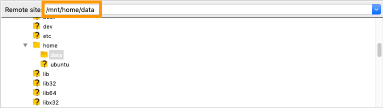
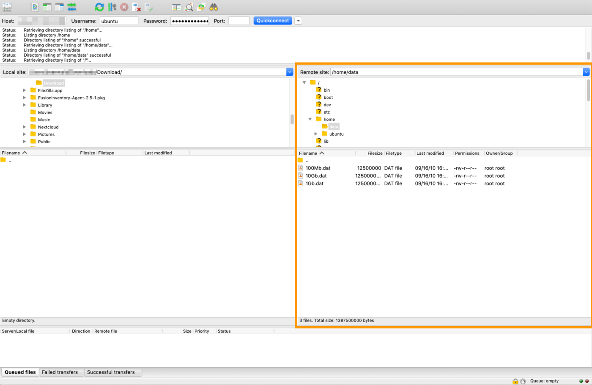
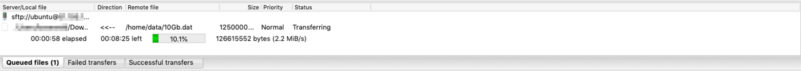

## Objectif

Différentes options existent pour transférer des fichiers entre un périphérique local et un hôte distant. Pour garantir la sécurité du transfert, il est recommandé d’utiliser un logiciel client compatible avec le protocole SFTP (Secure File Transfer Protocol) dans la plupart des cas d’utilisation.

**Ce tutoriel explique comment utiliser FileZilla pour transférer des fichiers via SFTP.**

> [!warning]
> OVHcloud fournit des services dont la configuration et la gestion relèvent de votre responsabilité. Ce tutoriel va illustrer comment utiliser les solutions OVHcloud avec des outils externes. Vous devrez peut-être adapter certaines instructions spécifiques au système d'exploitation de votre périphérique local ou de votre serveur.
>
> Nous vous recommandons de contacter un [prestataire de services spécialisé](/links/partner) ou de contacter [notre communauté](/links/community) si vous rencontrez des difficultés.
>

## Prérequis

- Un [serveur dédié](/links/bare-metal/bare-metal) ou un [VPS](/links/bare-metal/vps) dans votre compte OVHcloud, avec une distribution GNU/Linux installée
- Un client FTP qui supporte les connexions SFTP (par exemple [FileZilla](https://filezilla-project.org/)) installé sur votre poste de travail local
- Un accès administrateur en SSH à votre serveur

<!-- CP-NAV-START:baremetal-dedicated-servers -->
---

### Accès à l'espace client OVHcloud

- **Lien direct :** [Serveurs dédiés](/links/control-panel/baremetal-dedicated-servers)
- **Pour accéder à vos services :** `Bare Metal Cloud`{.action} > `Serveurs dédiés`{.action} > Sélectionnez votre serveur

---
<!-- CP-NAV-END:baremetal-dedicated-servers -->

## En pratique

Vous aurez besoin de l'adresse IP de votre serveur que vous pouvez retrouver dans votre [espace client OVHcloud](/links/manager) ainsi que du nom du compte d'utilisateur à utiliser pour la connexion SSH. N’hésitez pas à consulter nos guides « Premiers pas » si vous souhaitez obtenir plus de détails sur ce sujet :

- [Serveur dédié](/pages/bare_metal_cloud/dedicated_servers/getting-started-with-dedicated-server)
- [Serveur dédié de la gamme **Eco**](/pages/bare_metal_cloud/dedicated_servers/getting-started-with-dedicated-server-eco)
- [VPS](/pages/bare_metal_cloud/virtual_private_servers/starting_with_a_vps)

Les exemples suivants sont basés sur [FileZilla](https://filezilla-project.org/). Reportez-vous au guide d'utilisation de votre application si vous utilisez un client FTP différent.

Le processus peut nécessiter des étapes supplémentaires si votre serveur est démarré en **mode rescue**. Ouvrez la section correspondante ci-dessous en fonction de l'état de votre serveur.

### Comment se connecter à un serveur via un client SFTP

/// details | Dépliez cette section

Dans l'interface du client FileZilla, renseignez l'adresse IP de votre serveur dans le champ `Host` et vos nom d'utilisateur et mot de passe dans leurs champs respectifs. Entrez « 22 » dans le champ `Port`, sauf si vous avez modifié le port de connexion sur lequel le service SSH de votre serveur est à l'écoute.

Cliquez sur le bouton `Quickconnect`{.action}.

> [!warning]
> Afin d'accéder aux dossiers appartenant au compte utilisateur `root` de votre OS, vous devez utiliser les identifiants de l'utilisateur `root` pour établir la connexion SFTP. Ce compte n'a pas de mot de passe par défaut.
> Si vous êtes certain de devoir accéder aux fichiers de l'utilisateur `root` via SFTP, découvrez comment activer cette connexion dans notre [guide du compte utilisateur](/pages/bare_metal_cloud/dedicated_servers/changing_root_password_linux_ds).
>

///

### Comment se connecter à un serveur en mode rescue via un client SFTP

/// details | Dépliez cette section

Si vous n'avez pas déjà effectué les actions nécessaires pour accéder à vos fichiers en mode rescue, aidez-vous du guide correspondant pour vous connecter à votre serveur et monter vos partitions :

- [Mode rescue pour serveur dédié](/pages/bare_metal_cloud/dedicated_servers/rescue_mode)
- [Mode rescue pour VPS](/pages/bare_metal_cloud/virtual_private_servers/rescue)

Dans l'interface du client FileZilla, renseignez l'adresse IP de votre serveur dans le champ `Host` et « 22 » dans le champ `Port`. Entrez « root » dans le champ `Username` et le mot de passe qui vous a été envoyé par e-mail pour l'accès en mode rescue dans le champ `Password`.

Cliquez sur le bouton `Quickconnect`{.action}.

Le système de fichiers du serveur sera situé dans le répertoire que vous avez défini comme point de montage en mode rescue (« /mnt » dans cet exemple).

{.thumbnail}

///

### Utilisation de l'interface FileZilla pour télécharger vos fichiers

Une fois la connexion à distance établie, une arborescence des fichiers du serveur sera affichée dans la section `Remote Site`.

{.thumbnail}

La partie centrale de l'interface FileZilla agit comme un explorateur de fichiers. Vous pouvez sélectionner plusieurs fichiers ou dossiers, les supprimer, les glisser-déposer d'un côté à l'autre, etc. Les détails d'utilisation pouvant être différents en fonction de la version du logiciel et de votre système d'exploitation local, reportez-vous au guide de l'utilisateur [FileZilla](https://filezilla-project.org/) pour plus de détails.

Par exemple, pour récupérer des fichiers situés dans le dossier « /home/data » du serveur, ouvrez ce dossier dans le volet droit (`Remote Site`). Sélectionnez les fichiers ou dossiers à télécharger et faites-les glisser vers le volet de gauche (`Local Site`) dans un dossier de votre périphérique local.

La progression du transfert de données sera alors affichée dans la file d'attente en bas.

{.thumbnail}

## Aller plus loin

[Introduction au SSH](/pages/bare_metal_cloud/dedicated_servers/ssh_introduction)

[Configuration des comptes utilisateurs et de l'accès root sur un serveur](/pages/bare_metal_cloud/dedicated_servers/changing_root_password_linux_ds)

Pour des prestations spécialisées (référencement, développement, etc), contactez les [partenaires OVHcloud](/links/partner).

Si vous souhaitez bénéficier d'une assistance à l'usage et à la configuration de vos solutions OVHcloud, consultez nos différentes [offres de support](/links/support).

Échangez avec notre [communauté d'utilisateurs](/links/community).