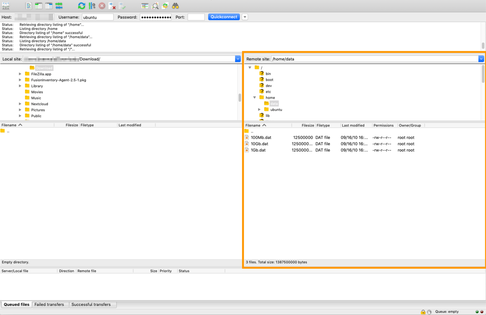
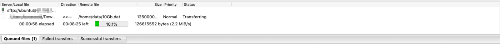
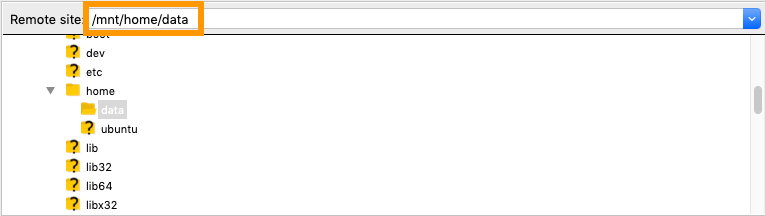

> [!primary]
> Esta tradução foi automaticamente gerada pelo nosso parceiro SYSTRAN. Em certos casos, poderão ocorrer formulações imprecisas, como por exemplo nomes de botões ou detalhes técnicos. Recomendamos que consulte a versão inglesa ou francesa do manual, caso tenha alguma dúvida. Se nos quiser ajudar a melhorar esta tradução, clique em "Contribuir" nesta página.
>

## Objetivo

Se precisar de migrar os seus dados, é possível que tenha de os descarregar do seu servidor dedicado para os guardar noutra máquina. Existem diferentes formas de realizar esta operação, nomeadamente o protocolo SFTP (Secure File Transfert Protocol) que permite transferir de forma fácil e rápida ficheiros através de uma ligação segura por SSH.

**Este tutorial explica como carregar e descarregar dados num servidor dedicado através de SFTP.**

> [!warning]
>
Este tutorial explica a utilização de uma ou várias soluções da OVHcloud através de ferramentas externas e descreve as operações realizadas num contexto preciso. Deverá adaptá-las consoante a sua situação. Se necessitar de ajuda, recomendamos que entre em contacto com um fornecedor especializado ou que partilhe as suas dúvidas com o resto da nossa comunidade: <https://community.ovh.com/en/>. A OVHcloud não lhe poderá fornecer assistência.
>

## Requisitos

- Um [servidor dedicado](https://www.ovhcloud.com/pt/bare-metal/){.external} no qual é instalada uma distribuição GNU/Linux.
- Um cliente FTP que gere as ligações SFTP (este guia documenta a utilização do [FileZilla](https://filezilla-project.org/){.external}).
- Um acesso administrativo via SSH ao seu servidor.

## Instruções

### Utilizar o FileZilla para recuperar e registar os seus dados

O protocolo SFTP pode ser utilizado para transferir ficheiros através de uma ligação segura (SSH). Existem duas possibilidades para este cenário: tem um acesso normal ao servidor ou liga-se em [modo rescue](/pages/bare_metal_cloud/dedicated_servers/rescue_mode).

Por predefinição, um servidor que utilize um sistema operativo GNU/Linux terá acesso SSH através da porta 22. No entanto, poderá já ter alterado esta porta (por exemplo, seguindo o [nosso guia para proteger um servidor dedicado](/pages/bare_metal_cloud/dedicated_servers/securing-a-dedicated-server)).

#### **Se tem acesso ao seu servidor**

Na interface gráfica do FileZilla, introduza o endereço IP do seu servidor no campo `Host`, assim como o seu nome de utilizador e a sua palavra-passe nos respetivos campos. No que diz respeito ao campo `Port`, introduza "22" ou a porta que o seu serviço SSH escuta se a alterou.

Uma vez estabelecida a ligação, aparecerá uma arborescência dos seus ficheiros na parte `Site remota`.

{.thumbnail}

No nosso exemplo, os dados a recuperar encontram-se na pasta "/home/data". Pode arrastar e largar ficheiros para a esquerda (`Local` Site) a partir da parte direita (`Remote` Site) para os registar no seu dispositivo local.

Para colocar ficheiros no servidor, deslize-largue dos seus ficheiros a partir da pasta local para a pasta de destino remota situada na parte direita.

O progresso da transferência de dados aparece na parte inferior da interface do FileZilla.

{.thumbnail}

#### **Se o servidor estiver em modo rescue**

Em modo rescue, primeiro deve montar a sua partição. Para isso, siga as instruções indicadas [neste manual](/pages/bare_metal_cloud/dedicated_servers/rescue_mode).

Depois de montar a partição, utilize o cliente FileZilla da forma descrita acima, utilizando a porta 22 para a ligação ao seu servidor.

> [!primary]
>
> As informações de identificação que deve utilizar são enviadas por e-mail quando ativar o modo rescue no seu servidor.
>

Se criou corretamente o ponto de montagem, os dados encontram-se no diretório "/mnt" ("/mnt/home/data" neste exemplo).

{.thumbnail}

## Saiba mais

[Ativar e utilizar o modo rescue](/pages/bare_metal_cloud/dedicated_servers/rescue_mode)

[Proteger um servidor dedicado](/pages/bare_metal_cloud/dedicated_servers/securing-a-dedicated-server)

Junte-se à nossa comunidade de utilizadores <https://community.ovh.com/en/>.
