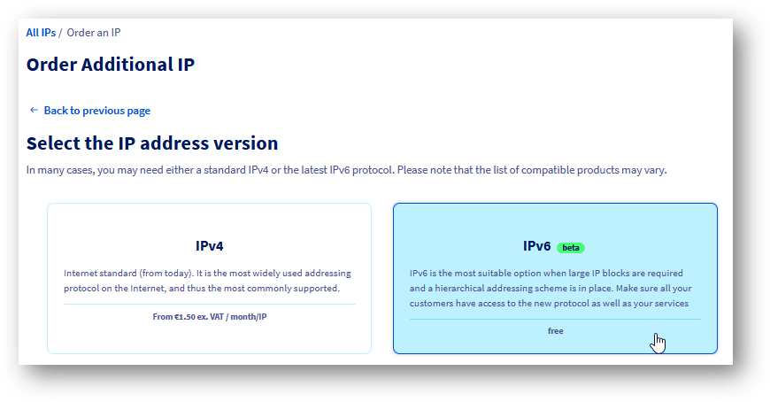

<style>
details>summary {
    color:rgb(33, 153, 232) !important;
    cursor: pointer;
}
details>summary::before {
    content:'\25B6';
    padding-right:1ch;
}
details[open]>summary::before {
    content:'\25BC';
}
</style>

> [!warning]
> Usage of this feature is currently in Beta phase.
> This guide may be incomplete and will be extended during this Beta phase. Our team remains available on our dedicated Discord Channel, do not hesitate to join and reach us: <https://discord.gg/ovhcloud>. Ask questions, provide feedback and interact directly with the team that builds our Network services.

## Objective

The vRack network serves as a global private network bridging various OVHcloud products, enabling the creation of sophisticated network solutions. Beyond facilitating private connections, it also supports routing public IP addresses.

**This guide focuses on Additional IPv6 address block configuration within a vRack network.**


## Introduction

IPv6 revolutionizes networking within OVHcloud's vRack by addressing IPv4's limitations and introducing features for the modern internet. Its rollout is a direct response to the need for more extensive, secure, and sophisticated internet architectures. Here are the key benefits of integrating IPv6 with vRack:

- **Flexibility for Advanced Networking**: IPv6 significantly increases the address space, providing the flexibility needed to scale infrastructure, manage failover scenarios and support larger solutions. This ensures that networks can grow and adapt without the space constraints of IPv4.

- **Hierarchical Routing and Segmentation**: IPv6 enables efficient hierarchical routing and logical infrastructure segmentation. This improves network manageability and security, ideal for reselling VMs with dedicated subnets or organising infrastructure into distinct segments.

- **Low latency**: Native, end-to-end IPv6 connectivity can be an enabler for latency-sensitive services like media streaming, as many recent provider networks are built IPv6-native. In such networks, using IPv4 services brings additional latency (and costs).

By leveraging IPv6 within vRack, OVHcloud users can enjoy a more secure, efficient, and scalable network environment, ready to meet the demands of modern internet usage.


## Requirements

- A [vRack](https://www.ovhcloud.com/fr/network/vrack/){.external} service activated in your account
- A [vRack compatible server](https://www.ovhcloud.com/fr/network/vrack/){.external} attached to your vRack network
- Access to the [OVHcloud Control Panel](/links/manager)

> [!warning]
> This feature might be unavailable or limited on servers of the [**Eco** product line](https://eco.ovhcloud.com/en-gb/about/).
>
> Please visit our [comparison page](https://eco.ovhcloud.com/en-gb/compare/) for more information.

## Instructions

### Obtaining a new Additional IPv6 block

While requesting a new Additional IPv6 block, it's important to note that the allocation is regional. This means the IPv6 block you receive will be tied to a specific region, defining where public traffic enters your vRack network (thus, where the gateway is located). 

/// details | Request a new Additional IPv6 block

You can order your new addtional IPv6 block [here](https://www.ovh.com/manager/#/dedicated/ip/agoraOrder/ipv6?catalogName=ip).

{.thumbnail}

Next you need to follow the step-by-step instructions.

Your new Additional IPv6 will then be available on your vRack configuration page.

///

### Configuring IPv6 in a vRack (basic mode)

In this section we will present basic IPv6 setup for your vRack connected hosts.

{.thumbnail}

The example above shows two hosts with their vRack-side interfaces configured with IPv6 public addresses. One host is configured manually, while the other has an IP address assigned automatically using SLAAC. All IP addresses belong to the first /64 subnet from a given public /56 Additional IPv6 block. Both leverage the vRack interface for public IPv6 connectivity.

/// details | Via the OVHcloud Control Panel

Go to `Network`{.action} and click the `vRack private network`{.action} section. Then select the vRack you want to manage:

{.thumbnail}

On the left side, the possible options (eligible services to be configured) are listed.

On the right you see what is already configured with your vRack.

Select your new Addtional IPv6 and add it to your vRack.

{.thumbnail}

You now have your new Addtional IPv6 added to your vRack.

### Static IP configuration

Once the Additional IPv6 /56 block is attributed to a vRack network, there is still the first /64 subnet that is bridged with it.

This means you can easily use such IPs on your hosts with static IP configuration on vRack interfaces (see the next section for a host-side configuration example).

### Automatic IP configuration (SLAAC)

To simplify IP addressing inside your network, you may want to use SLAAC. It can be enabled per-bridged-subnet only and can be enabled for the first /64 of your block (this one is always bridged) at any time using this slider button:

{.thumbnail}

Don't forget to configure SLAAC on your host machine.

///


/// details | Via the APIv6 (alternative way)

### Attributing an Additional IPv6 to a vRack

When you request an additional IPv6, it is automatically assigned to your vRack.

If you removed this new Addtional IPv6 from your vRack, you can assign it again using this POST method:

> [!api]
>
> @api {v1} /vrack POST /vrack/{serviceName}/ipv6
>

As in the example below:

{.thumbnail}

Use the following call to verify the IPv6 has been assigned:

> [!api]
>
> @api {v1} /vrack GET /vrack/{serviceName}/ipv6/{ipv6}
>

As in the example below:

{.thumbnail}

Now, we see our block configured with a vRack. The next step is to configure the host or VMs.

### Static IP configuration

Once the Additional IPv6 /56 block is attributed to a vRack network, there is still the first /64 subnet that is bridged with it. This means you can easily use such IPs on your hosts.

Let's check exactly which subnet is bridged:

> [!api]
>
> @api {v1} /vrack GET /vrack/{serviceName}/ipv6/{ipv6}/bridgedSubrange
>

As in the example below:

{.thumbnail}

To get more details, use this call:

> [!api]
>
> @api {v1} /vrack GET /vrack/{serviceName}/ipv6/{ipv6}/bridgedSubrange/{bridgedSubrange}
>

As in the example below:

{.thumbnail}

Notice that IP autoconfiguration (SLAAC) is turned off by default.

### Automatic IP configuration (SLAAC)

To simplify IP addressing inside your network, you may want to use SLAAC. It can be enabled per-bridged-subnet only and can be enabled with this PUT method:

> [!api]
>
> @api {v1} /vrack PUT /vrack/{serviceName}/ipv6/{ipv6}/bridgedSubrange/{bridgedSubrange}
>

As in the example below:

{.thumbnail}

Don't forget to configure SLAAC on your host machine.

///

#### Host-side commands

/// details | Static IP configuration

In a basic configuration, you may want to setup an IP address and routing manually. This is also the suggested way when your machine acts as a router (see the [configuring routed subnet](#routedmode) section) and has ipv6.forwarding mode enabled.

First, let's add an IP address on the vrack interface (in our example "eth1"):

```bash
$ sudo ip address add 2001:41d0:abcd:ef00::2/64 dev eth1
```

(Please note that the first IP address in a block, 2001:41d0:abcd:ef00::1/64 is gateway IP address and must not be used for host addressing).

Optionally, if you want to use the vRack interface as the main one for IPv6 traffic, the default route can be configured the following way:

```bash
$ sudo ip -6 route add default via 2001:41d0:abcd:ef00::1/64 dev eth1
```

Finally, bring up the interface (and verify the configured IP on it):

```bash
$ sudo ip link set up dev eth1
$ ip -6 addr list dev eth1
4: eth1: <BROADCAST,MULTICAST,UP,LOWER_UP> mtu 1500 qdisc mq state UP group default qlen 1000
    inet6 2001:41d0:abcd:ef00::2/64 scope global static
```

///

/// details | Automatic IP configuration (SLAAC)

To use automatic configuration, please ensure you have configured your interface as follows:

First, let's allow our host to accept Router Advertisements (for autoconfiguration) on the vRack interface (in our example "eth1"):

``` bash
$ sudo sysctl -w net.ipv6.conf.eth1.accept_ra=1
```

Important to note is that this setting will not work if ipv6.forwarding is enabled in your system. In such case please refer to <a href="#host-side-configuration">[Automatic IP configuration for routed subnet](#host-side) for more details.

Then, simply bring up the interface:

``` bash
$ sudo ip link set up dev eth1
$ ip -6 addr list dev eth1
4: eth1: <BROADCAST,MULTICAST,UP,LOWER_UP> mtu 1500 qdisc mq state UP group default qlen 1000
    inet6 2001:41d0:abcd:ef00:fe34:97ff:feb0:c166/64 scope global dynamic mngtmpaddr
       valid_lft 2322122sec preferred_lft 334922sec
```

After a moment (the configuration must propagate), specific IPv6 address (with the flags <i>global</i> and <i>dynamic</i>) should be visible on the interface.

///

#### Setup verification

/// details | Local

The most basic test is to ping a local IP address on a host:

``` bash
debian@host:~$ ping 2001:41d0:900:2100:fe34:97ff:feb0:c166
PING 2001:41d0:900:2100:fe34:97ff:feb0:c166(2001:41d0:900:2100:fe34:97ff:feb0:c166) 56 data bytes
64 bytes from 2001:41d0:900:2100:fe34:97ff:feb0:c166: icmp_seq=1 ttl=64 time=0.043 ms
64 bytes from 2001:41d0:900:2100:fe34:97ff:feb0:c166: icmp_seq=2 ttl=64 time=0.034 ms
```

///

/// details | Remote

Next, let's verify the connectivity from remote:

``` bash
ubuntu@remote-test:~$ ping 2001:41d0:900:2100:fe34:97ff:feb0:c166
PING 2001:41d0:900:2100:fe34:97ff:feb0:c166(2001:41d0:900:2100:fe34:97ff:feb0:c166) 56 data bytes
64 bytes from 2001:41d0:900:2100:fe34:97ff:feb0:c166: icmp_seq=1 ttl=55 time=7.23 ms
64 bytes from 2001:41d0:900:2100:fe34:97ff:feb0:c166: icmp_seq=2 ttl=55 time=6.90 ms
64 bytes from 2001:41d0:900:2100:fe34:97ff:feb0:c166: icmp_seq=3 ttl=55 time=6.92 ms
```

///

### Configuring an IPv6 in a vRack for routed mode <a name="routedmode"></a>

In this section we will present a more advanced IPv6 setup, where your vRack connected hosts are acting as a routers for hosted Virtual Machines. Such VMs have delegated subnets from the main IPv6 block (presented with an orange color in the schema below).

{.thumbnail}

The traffic path is as follows: Inbound traffic to a given VM (with specified subnet) is routed through the customer's vRack, first to a specified host (with a next-hop address), then using a local link (or vSwitch - black link fd00::/64 on a diagram) to the particular VM.
Traffic coming back from such a VM should use the default route via the first part of the local link (black one, fd00::1), then (possibly default) route from a host to its gateway.

For routed subnet definition any prefix size can be used between /57 and /64.

#### Define routed subnet

/// details | OVHcloud Control Panel actions

After adding Additional IP to your vRack you can manage routed subnet by clicking `Add subnet`{.action} button.

{.thumbnail}

To create a routed subnet, we must first define:

- **subnet in CIDR notation** (size between /57 and /64)
- **next-hop address** (so the host's IPv6 address)

Please note that a given subnet can not overlap with any other subnet defined and next-hop address must belong to the first part (bridged /64 subnet) of your Additional IPv6 prefix.

{.thumbnail}

This created routed subnet `2001:41d0:abcd::ef10::/60` reachable via next hop `2001:41d0:abcd::ef00::2`. 

{.thumbnail}

///

/// details | APIv6 commands

To create a routed subnet, we must first define:

- **subnet in CIDR notation** (size between /57 and /64)
- **next-hop address** (so the host's IPv6 address)

Please note that a given subnet can not overlap with any other subnet defined and next-hop address must belong to the first part (bridged /64 subnet) of your Additional IPv6 prefix.

The example below shows how to define such a subnet:

{.thumbnail}

Here, we defined a routed subnet `2001:41d0:abcd:ef10::/60 `which will be delegated to the VM hosted on: `2001:41d0:abcd:ef00::2`.

///

#### Host-side configuration <a name="host-side"></a>

/// details | Static IP configuration for a host (recommended)

When hosting Virtual Machines, we strongly recommend to use static configuration on your host.

Set up an IPv6 address, bring up the interface and (optionally) add the default route over the vRack interface:

```bash
$ sudo ip addr add 2001:41d0:abcd:ef00::2/64 dev eth1
$ sudo ip link set dev eth1 up
$ sudo ip -6 route add default via 2001:41d0:abcd:ef00::1 dev eth1
```

///

/// details | Automatic IP configuration (SLAAC) for a host

In some cases, you may want to configure your interfaces with SLAAC and IP forwarding together. 

Please note that this brings additional risks (such as losing access not only to the host but also to all VMs) and is not recommended.

Ensuring IPv6 forwarding is enabled:

```bash
$ sudo sysctl -w net.ipv6.conf.all.forwarding=1
```

Configuring Router Advertisements to be accepted (on vRack eth1 interface in our example):

```bash
$ sudo sysctl -w net.ipv6.conf.eth1.accept_ra=2
```

///

/// details | Routed subnet configuration on a host and inside a VM

To ensure that our host knows what to do with packets addressed to the new routed subnet (that will be on a VM), we must add a specific route for it.

In our example this is the veth link with the address fd00::2/64 inside a VM we will use for routing.

Please note that this is very specific to the hypervisor installed (it can be vSwitch or veth interfaces). Please refer to the specific hypervisor networking guide for this setup.

```bash
$ sudo ip -6 route add 2001:41d0:abcd:ef10::/60 via fd00::2
```

///


/// details | Routed subnet configuration inside a VM

Again, please note that the link used between host and VMs is very specific to the hypervisor installed (it can be vSwitch or veth interfaces). Please refer to the specific hypervisor networking guide for this setup.

Add our routed IP block inside a VM to ensure it can accept packets:

```bash
debian@vm-1:~$ sudo ip address add 2001:41d0:abcd:ef10::1/60 dev lo
```

Add the default route on a VM to ensure traffic can get back out of it:

```bash
debian@vm-1:~$ sudo ip -6 route add default via fd00::1
```

///


#### Setup verification

/// details | Local, on a host

Ping from the host into the container (using local link):

```bash
debian@host:~$ ping fd00::2
PING fd00::2(fd00::2) 56 data bytes
64 bytes from fd00::2: icmp_seq=1 ttl=64 time=0.053 ms
64 bytes from fd00::2: icmp_seq=2 ttl=64 time=0.071 ms
```

Ping from the host into the container (using routed subnet):

```bash
debian@host:~$ ping 2001:41d0:abcd:ef10::1
PING 2001:41d0:abcd:ef10::1(2001:41d0:abcd:ef10::1) 56 data bytes
64 bytes from 2001:41d0:abcd:ef10::1: icmp_seq=1 ttl=64 time=0.054 ms
64 bytes from 2001:41d0:abcd:ef10::1: icmp_seq=2 ttl=64 time=0.073 ms
```

Check the route to our /60 subnet on a host:

``` bash
debian@host:~$ ip -6 route get 2001:41d0:abcd:ef10::1
2001:41d0:abcd:ef10::1 from :: via fd00::2 dev veth1a src fd00::1 metric 1024 pref medium
```

///

/// details | Local, on a VM

First, check the routing table:

```bash
debian@vm-1:~$ ip -6 route show
2001:41d0:abcd:ef10::/60 dev lo proto kernel metric 256 pref medium
fd00::/64 dev veth1b proto kernel metric 256 pref medium
default via fd00::1 dev veth1b src 2001:41d0:abcd:ef10::1 metric 1024 pref medium
```

Ping host link local interface:

```bash
debian@vm-1:~$ ping fd00::1
PING fd00::1(fd00::1) 56 data bytes
64 bytes from fd00::1: icmp_seq=1 ttl=64 time=0.051 ms
64 bytes from fd00::1: icmp_seq=2 ttl=64 time=0.070 ms
```

Ping host global interface:

```bash
debian@vm-1:~$ ping 2001:41d0:abcd:ef00::2
PING 2001:41d0:abcd:ef00::2(2001:41d0:abcd:ef00::2) 56 data bytes
64 bytes from 2001:41d0:abcd:ef00::2: icmp_seq=1 ttl=64 time=0.050 ms
64 bytes from 2001:41d0:abcd:ef00::2: icmp_seq=2 ttl=64 time=0.080 ms
```

Finally, let's ping an external IPv6 from a VM:

```bash
debian@vm-1:~$ ping 2001:41d0:242:d300::
PING 2001:41d0:242:d300::(2001:41d0:242:d300::) 56 data bytes
64 bytes from 2001:41d0:242:d300::: icmp_seq=1 ttl=57 time=0.388 ms
64 bytes from 2001:41d0:242:d300::: icmp_seq=2 ttl=57 time=0.417 ms
```

Or, using a domain name:

```bash
debian@vm-1:~$ ping -6 proof.ovh.net
PING proof.ovh.net(2001:41d0:242:d300:: (2001:41d0:242:d300::)) 56 data bytes
64 bytes from 2001:41d0:242:d300:: (2001:41d0:242:d300::): icmp_seq=1 ttl=57 time=0.411 ms
64 bytes from 2001:41d0:242:d300:: (2001:41d0:242:d300::): icmp_seq=2 ttl=57 time=0.415 ms
```

///

/// details | From remote host

Let's check connectivity to our VM from outside the OVHcloud network:

```bash
ubuntu@remote-test:~$ ping 2001:41d0:abcd:ef10::1
PING 2001:41d0:abcd:ef10::1(2001:41d0:abcd:ef10::1) 56 data bytes
64 bytes from 2001:41d0:abcd:ef10::1: icmp_seq=1 ttl=55 time=5.84 ms
64 bytes from 2001:41d0:abcd:ef10::1: icmp_seq=2 ttl=55 time=2.98 ms
```

And traceroute from a remote host (somewhere in the internet):

```bash
ubuntu@remote-test:~$ mtr -rc1 2001:41d0:abcd:ef10::1
Start: 2024-03-26T09:26:45+0000
HOST: remote-test                  				Loss%   Snt   Last   Avg  Best  Wrst StDev
...
...
  9.|-- 2001:41d0:abcd::2:5d        				0.0%     1    1.9   1.9   1.9   1.9   0.0
 10.|-- 2001:41d0:abcd:ef00::2      				0.0%     1    2.2   2.2   2.2   2.2   0.0
 11.|-- 2001:41d0:abcd:ef10::1      				0.0%     1    2.2   2.2   2.2   2.2   0.0
```

In this example: 

- hop 10 - our host's IP address
- hop 11 - our VM's IP address

///

## Multiple region locations vs. global vRack

OVHcloud's vRack technology enables organizations to connect servers across different locations as if they were located within the same data center. 
On the other hand, services like Additional IPv6 are regional, which means their functionality is linked to a particular location. 

Below, an architecture is presented for learning purposes with two different regions and different Additional IPv6 blocks announced from each. Also, there is a host presented with IP addresses from both networks as well as a suboptimal route example - a host in one region addressed with IPv6 address announced in another region:


Please note that in such setups (with Additional IPv6 from more than single region) SLAAC **must be turned off in the whole vRack** (as this may lead to unpredictable results and losing connectivity randomly).

### Benefits

- **Enhanced Connectivity:** By leveraging a vRack network together with public IP blocks routed in multiple locations, businesses can ensure seamless communication around the globe, regardless of backend server's physical locations.
- **Move to cloud:** vRack technology can be a great enabler of early steps toward a "move-to-cloud" organizational strategy, unblocking some legacy applications that still require local network communication.

### Risks and Considerations

- **No SLAAC support in multi-location setups:** When there is more than one location acting in routing public IP traffic (both IPv4 and IPv6) into the same vRack, Stateless Address Autoconfiguration (SLAAC) **should not be used**. As an example of such situation, let's consider existing hosts using IPv4 addresses. Such hosts are becoming reconfigured automatically by SLAAC with IPv6 gateway set up from other region. Together with IPv6 prioritization over IPv4 by some Operating Systems this situation can lead to suboptimal routing or even total loss of connectivity for such hosts.


## Known Limitations

Understanding the constraints of using **Additional IPv6** within the **vRack** environment is crucial for effective network planning. Here are the key limitations to consider:

- **Additional IPv6 goes only with vRack**: Please note that Additional IPv6 addresses can only be configured with vRack-connected backends.
- **SLAAC limitations in multi-location setups**: Stateless Address Autoconfiguration (SLAAC) is not supported when there is public IP traffic (both IPv6 and IPv4) routed into vRack in multiple region locations.
- **Up to 128 hosts inside bridged subnet**: You can use up to 128 IP addresses directly on the vRack.
- **Up to 128 next-hop routes**: You can use up to 128 routes for routed subnets inside a vRack.
- **Public bandwidth cap**: Outbound traffic from OVHcloud to the internet is capped at 5Gbps per region location.
- **IPv6 block allocation limits**: Single Additional IPv6 block per vRack in a region location. Maximum of 3 blocks (/56) per region location.
- **Mobility of Additional IPv6 blocks**: Due to the hierarchical design of the IPv6 address space, Additional IPv6 blocks are region-specific. This means blocks cannot be transferred between regions, although they can be reassigned within any vRack-connected backend.
- **No direct VLAN 802.1Q support in vRack by Additional IPv6**: Configuration can only be done with native vlan of your vRack network. For packet forwarding inside specific vlan (of a vRack) a dedicated host on customer side will be needed.
- **APAC, TOR and 3AZ regions are not supported for the moment.**

## Go further

Join our [community of users](/links/community).
