<style>
details>summary {
    color:rgb(33, 153, 232) !important;
    cursor: pointer;
}
details>summary::before {
    content:'\25B6';
    padding-right:1ch;
}
details[open]>summary::before {
    content:'\25BC';
}
</style>

## Objetivo

A rede vRack é uma rede privada global que interliga diferentes produtos OVHcloud e permite a criação de soluções de rede sofisticadas. Para além de facilitar as ligações privadas, suporta também o roteamento de endereços IP públicos.

**Este guia centra-se na configuração de blocos de endereços Additional IPv6 numa rede vRack.**

> [!primary]
>
> O vRack suporta o roteamento público IPv4 e IPv6 com blocos de endereços Additional IP. Pode encontrar as instruções sobre a configuração de blocos IPv4 neste guia: [Configurar um bloco IP no vRack](/pages/bare_metal_cloud/dedicated_servers/configuring-an-ip-block-in-a-vrack).
>

> [!primary]
>
> Este artigo detalha a configuração de endereços Additional IP numa rede vRack. Se procura instruções sobre a configuração de endereços Additional IP com um endereço IP principal (na interface de rede pública), consulte os seguintes artigos:
>
> - IPv4:
>     - [Configurar um endereço IP em alias num servidor dedicado](/pages/bare_metal_cloud/dedicated_servers/network_ipaliasing).
>     - [Configurar um endereço IP em alias num VPS](/pages/bare_metal_cloud/virtual_private_servers/configuring-ip-aliasing).
>
> - IPv6:
>     - [Configurar IPv6 num servidor dedicado](/pages/bare_metal_cloud/dedicated_servers/network_ipv6).
>     - [Configurar IPv6 num VPS](/pages/bare_metal_cloud/virtual_private_servers/configure-ipv6).
>     - [Configurar IPv6 numa instância Public Cloud](/pages/public_cloud/public_cloud_network_services/configuration-02-how-to-configure-ipv6).
>

## Introdução

O IPv6 revoluciona as redes dentro do vRack da OVHcloud, oferecendo uma solução às limitações do IPv4 e funcionalidades adaptadas à Internet moderna. A sua implementação é uma resposta direta à necessidade de arquiteturas de Internet mais extensas, seguras e sofisticadas. Eis as principais vantagens da integração do IPv6 no vRack:

- **Flexibilidade para redes avançadas**: o IPv6 aumenta consideravelmente o espaço de endereçamento, proporcionando a flexibilidade necessária para escalar a infraestrutura, gerir cenários de failover e suportar soluções de maior dimensão. Isto permite que as redes cresçam e se adaptem sem as restrições de endereçamento do IPv4.

- **Roteamento hierárquico e segmentação**: o IPv6 permite um roteamento hierárquico eficiente e uma segmentação lógica da infraestrutura. Isto melhora a gestão e a segurança da rede, ideal para a revenda de máquinas virtuais com sub-redes dedicadas ou para a segmentação da infraestrutura de rede.

- **Baixa latência**: a conectividade IPv6 nativa de ponta a ponta pode facilitar a implementação de serviços sensíveis à latência, como o streaming multimédia, uma vez que muitas redes de fornecedores recentes são construídas com IPv6 nativo. Nessas redes, a utilização de serviços IPv4 cria latência (e custos) adicionais.

Ao tirar partido do IPv6 dentro do vRack, os utilizadores da OVHcloud podem usufruir de um ambiente de rede mais seguro, eficiente e escalável, pronto para responder às exigências das utilizações modernas da Internet.

## Requisitos

- Um serviço [vRack](/links/network/vrack) ativo na sua conta
- Um [servidor compatível com vRack](/links/network/vrack) ligado à sua rede vRack

<!-- CP-NAV-START:network-vrack -->
---

### Acesso à Área de Cliente OVHcloud

- **Ligação direta:** [vRack](/links/control-panel/network-vrack)
- **Caminho de navegação:** `Network`{.action} > `Rede privada vRack`{.action}

---
<!-- CP-NAV-END:network-vrack -->

> [!warning]
> Esta funcionalidade pode estar limitada ou indisponível nos servidores da [gama **Eco**](/links/bare-metal/eco-about).
>
> Consulte a nossa [página de comparação dos servidores Eco](/links/bare-metal/eco-compare) para obter mais informações.

## Instruções

### Obter um novo bloco Additional IPv6

Ao solicitar um novo bloco Additional IPv6, é importante notar que a alocação é regional. Isto significa que o bloco IPv6 que recebe estará associado a uma região específica, definindo o ponto de entrada do tráfego público na sua rede vRack (ou seja, a localização do gateway).

/// details | Solicitar um novo bloco Additional IPv6

Pode encomendar o seu novo bloco IPv6 adicional [aqui](https://www.ovh.com/manager/#/dedicated/ip/agoraOrder/ipv6?catalogName=ip).

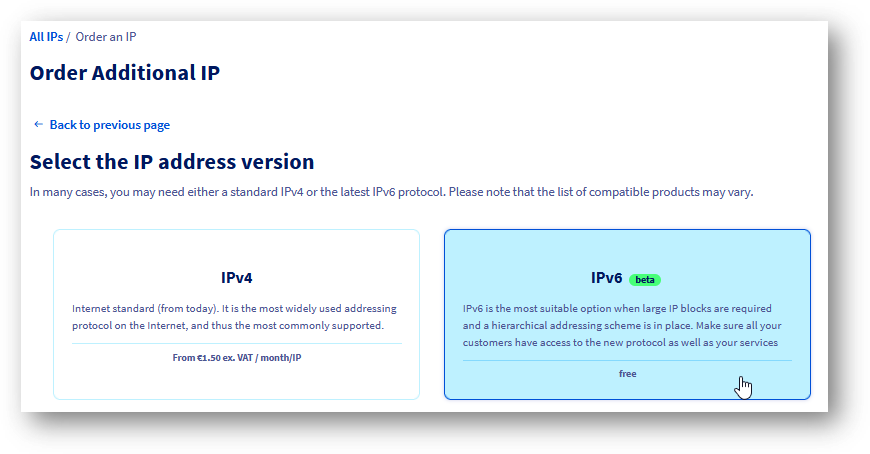{.thumbnail}

De seguida, siga as instruções passo a passo.

O seu Additional IPv6 estará então disponível na página de configuração do seu vRack.

///

### Configurar o IPv6 num vRack (modo simples)

Nesta secção apresentamos a configuração básica de IPv6 para os seus hosts ligados ao vRack.

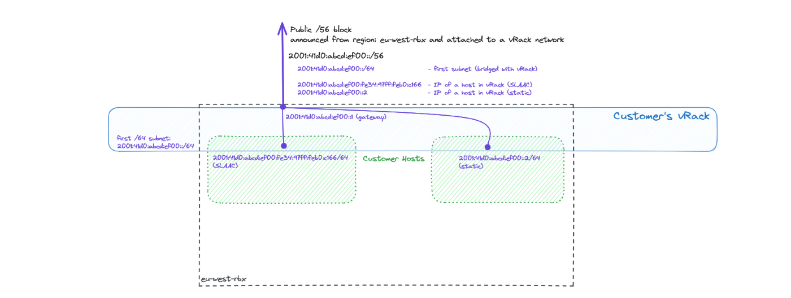{.thumbnail}

O exemplo acima mostra dois hosts com as suas interfaces do lado do vRack configuradas com endereços IPv6 públicos. Um host tem uma configuração manual, enquanto o outro tem um endereço IP atribuído automaticamente via SLAAC. Todos os endereços IP pertencem à primeira sub-rede /64 de um dado bloco /56 de Additional IPv6 públicas. Ambos utilizam a interface vRack para a conectividade IPv6 pública.

O gateway predefinido para a primeira sub-rede /64 (a que está em bridge) é o primeiro endereço do bloco /56. Neste exemplo, o gateway é `2001:41d0:abcd:ef00::1`. Este é distribuído via SLAAC, mas deve ser configurado manualmente (como rota predefinida) se o SLAAC estiver desativado (consulte a secção **Configuração IP estática** abaixo).

/// details | Através da área de cliente OVHcloud

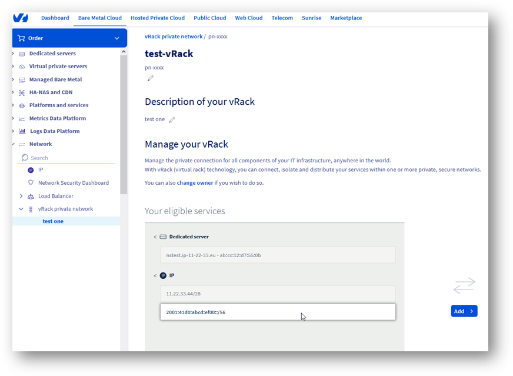{.thumbnail}

Do lado esquerdo, estão listadas as opções disponíveis (serviços elegíveis para configurar).

Do lado direito, pode ver o que já está configurado no seu vRack.

Selecione o seu novo Additional IPv6 e adicione-o ao seu vRack.

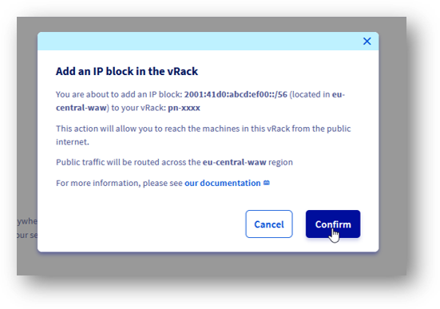{.thumbnail}

O seu novo Additional IPv6 foi adicionado ao seu vRack.

### Configuração IP estática

Após o bloco Additional IPv6 /56 ser atribuído a uma rede vRack, a primeira sub-rede /64 fica em bridge com o mesmo.

Isto significa que pode facilmente utilizar esses IPs nos seus hosts com uma configuração IP estática nas interfaces vRack (consulte a secção seguinte para um exemplo de configuração do lado do host).

### Configuração IP automática (SLAAC)

Para simplificar o endereçamento IP dentro da sua rede, pode utilizar o SLAAC. Pode ser ativado apenas por sub-rede em bridge e pode ser ativado para a primeira sub-rede /64 do seu bloco (esta está sempre em bridge) a qualquer momento usando este botão de cursor:

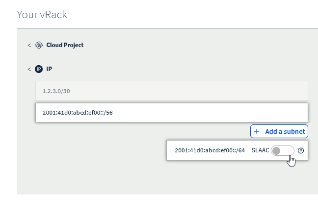{.thumbnail}

Não se esqueça de configurar o SLAAC na sua máquina host.

///


/// details | Através da APIv6 (método alternativo)

Quando solicita um IPv6 adicional, este é automaticamente atribuído ao seu vRack.

Se removeu este novo Additional IPv6 do seu vRack, pode reatribuí-lo usando este método POST:

> [!api]
>
> @api {v1} /vrack POST /vrack/{serviceName}/ipv6
>

Como no exemplo abaixo:

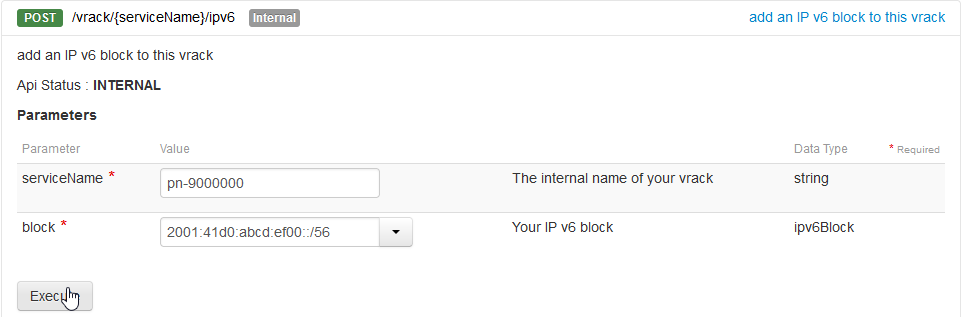{.thumbnail}

Use a seguinte chamada para verificar que o IPv6 foi atribuído:

> [!api]
>
> @api {v1} /vrack GET /vrack/{serviceName}/ipv6/{ipv6}
>

Como no exemplo abaixo:

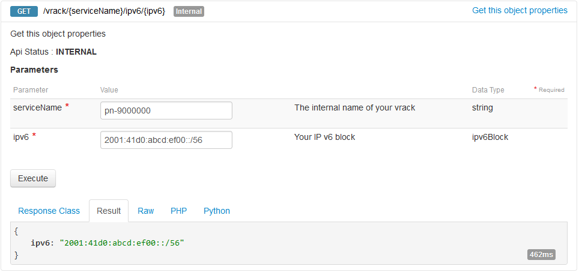{.thumbnail}

Agora vemos o nosso bloco configurado com um vRack. O passo seguinte é configurar o host ou os hosts virtuais.

### Configuração IP estática

Após o bloco Additional IPv6 /56 ser atribuído a uma rede vRack, a primeira sub-rede /64 fica em bridge com o mesmo. Isto significa que pode facilmente utilizar esses IPs nos seus hosts.

Vamos verificar quais são as sub-redes em bridge:

> [!api]
>
> @api {v1} /vrack GET /vrack/{serviceName}/ipv6/{ipv6}/bridgedSubrange
>

Como no exemplo abaixo:

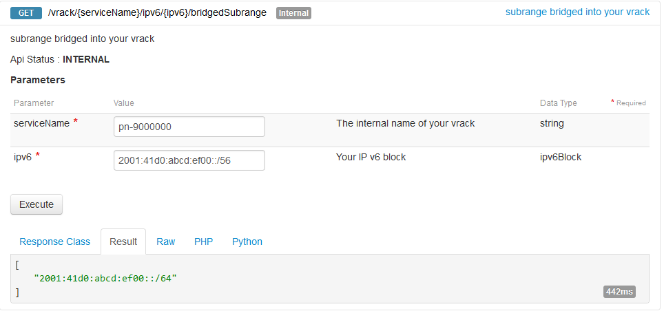{.thumbnail}

Para obter mais detalhes, use a seguinte chamada:

> [!api]
>
> @api {v1} /vrack GET /vrack/{serviceName}/ipv6/{ipv6}/bridgedSubrange/{bridgedSubrange}
>

Como no exemplo abaixo:

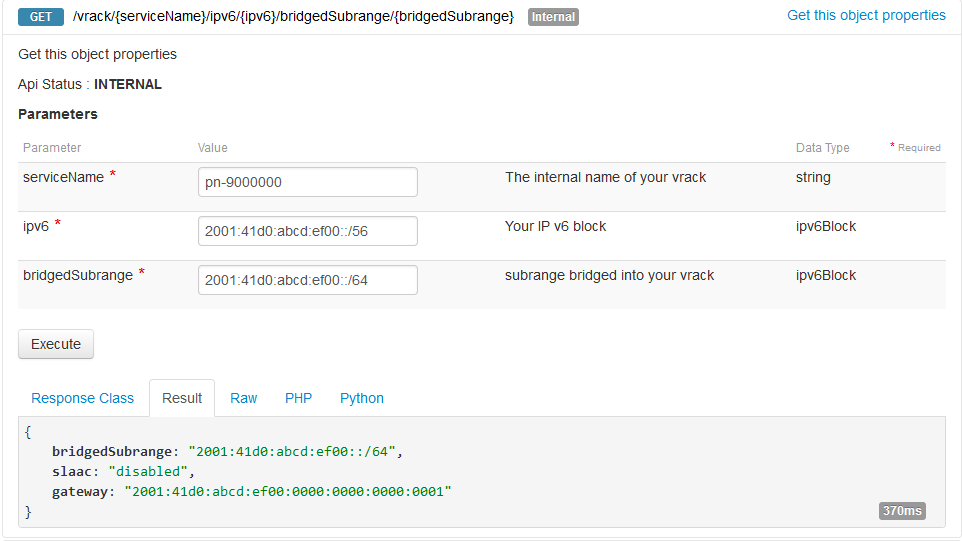{.thumbnail}

Note que a configuração IP automática (SLAAC) está desativada por predefinição.

### Configuração IP automática (SLAAC)

Para simplificar o endereçamento IP dentro da sua rede, pode utilizar o SLAAC. Pode ser ativado apenas por sub-rede em bridge e pode ser ativado com este método PUT:

> [!api]
>
> @api {v1} /vrack PUT /vrack/{serviceName}/ipv6/{ipv6}/bridgedSubrange/{bridgedSubrange}
>

Como no exemplo abaixo:

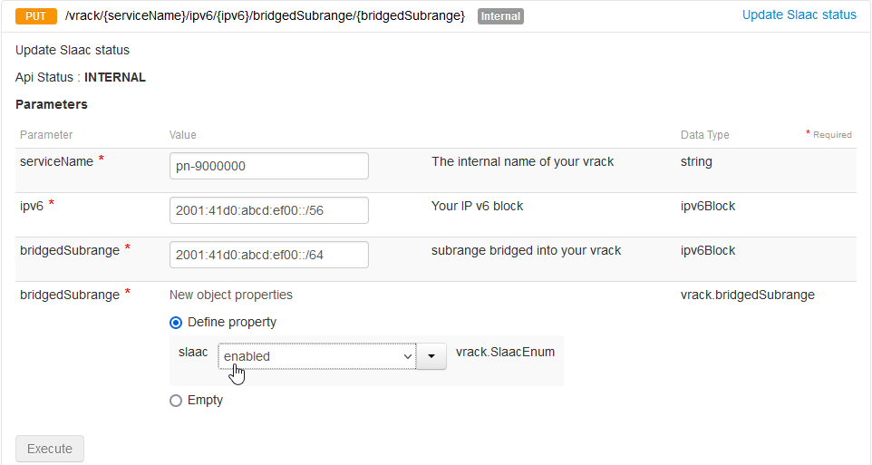{.thumbnail}

Não se esqueça de configurar o SLAAC na sua máquina host.

///

### Gerir a largura de banda dos IPs públicos no vRack

Por predefinição, os blocos de Additional IP encaminhados através de um vRack beneficiam de uma largura de banda pública padrão de 5 Gbps na Europa e América do Norte, ou de 100 Mbps nas regiões APAC. Para mais detalhes sobre as opções disponíveis, consulte as opções de roteamento público na nossa [página do produto vRack](/links/network/vrack).

Para responder ao crescimento das infraestruturas e às necessidades dos serviços com tráfego elevado, a OVHcloud disponibiliza opções de largura de banda pagas. Note que estas opções se aplicam **por vRack e por região**. Uma vez que os Additional IP estão associados a uma região específica, qualquer alteração da largura de banda afetará todos os endereços (IPv4 e IPv6) encaminhados para esse vRack na região em causa.

/// details | Durante a encomenda de um Additional IP

#### Escolher a largura de banda pública durante a encomenda

Pode modificar a largura de banda predefinida ao encomendar um novo bloco de Additional IP, desde que uma rede vRack seja selecionada como serviço backend.

Para encomendar um novo bloco de Additional IPv6:

- Ligue-se à [área de cliente OVHcloud](/links/manager).
- Na barra lateral esquerda, aceda à secção `Network`{.action}.
- Selecione `Endereços IP Públicos`{.action}.
- Clique no botão `Encomendar IPs`{.action} no topo da página.
- Escolha a versão do IP e, de seguida, o vRack ao qual o Additional IP será associado.
- Selecione a região do seu Additional IP.
- Escolha a largura de banda pública a aplicar ao seu vRack para essa região.
- Configure as outras opções conforme necessário e finalize a encomenda.

///

/// details | A partir da página de gestão do vRack

#### Modificar a largura de banda pública a partir da página de gestão

Para os blocos de Additional IP já associados a um vRack, a largura de banda é gerida diretamente a partir da página de configuração do serviço.

Para aceder à interface de gestão:

- Na barra lateral esquerda da área de cliente, abra `Network`{.action}.
- Selecione `Rede privada vRack`{.action}.
- Na coluna "IP público e largura de banda", clique no botão `Gerir`{.action} correspondente ao vRack pretendido.

A interface de gestão divide-se em dois separadores:

- **Todos os serviços associados**: De momento, redireciona para a página de gestão clássica do vRack. Em breve, este separador listará de forma otimizada todos os produtos (servidores, projetos Cloud, etc.) ligados ao vRack.
- **Conectividade IP pública**: Permite gerir as opções de roteamento público do seu vRack, incluindo a largura de banda.

Para modificar a largura de banda:

- Aceda ao separador `Conectividade IP pública`{.action}.
- A interface apresenta janelas de gestão por região (ex.: `eu-west-par`) associadas ao vRack, com a lista de IPs associados.
- No quadro da região em causa, clique em `Modificar a largura de banda`{.action}.
- Selecione a opção pretendida no painel da direita e clique em `Encomendar`{.action} para validar.
- Após o pagamento, a nova largura de banda ficará ativa no seu vRack na região escolhida após alguns minutos.

> [!primary]
>
> O primeiro mês subscrito é faturado pro rata dos dias restantes. A tarifa completa será aplicada no ciclo de faturação seguinte.
>

O aumento da largura de banda aplicar-se-á a todos os endereços IP dessa região para o vRack selecionado.

///

#### Comandos no host

/// details | Configuração IP estática

Numa configuração básica, pode querer configurar um endereço IP e o roteamento manualmente. Este é também o método recomendado quando a sua máquina está configurada como router (consulte a secção [configurar a sub-rede encaminhada](#routedmode)) e o modo ipv6.forwarding está ativado.

Em primeiro lugar, vamos adicionar um endereço IP na interface vRack (no nosso exemplo "eth1"):

```bash
$ sudo ip address add 2001:41d0:abcd:ef00::2/64 dev eth1
```

(Note que o primeiro endereço IP de um bloco, neste caso `2001:41d0:abcd:ef00::1/64`, é o endereço do gateway e não deve ser utilizado para o endereçamento dos hosts).

Se pretender utilizar a interface vRack como interface principal para o tráfego IPv6, a rota predefinida pode ser configurada da seguinte forma:

```bash
$ sudo ip -6 route add default via 2001:41d0:abcd:ef00::1/64 dev eth1
```

Por fim, inicie a interface (e verifique o IP configurado na mesma):

```bash
$ sudo ip link set up dev eth1
$ ip -6 addr list dev eth1
4: eth1: <BROADCAST,MULTICAST,UP,LOWER_UP> mtu 1500 qdisc mq state UP group default qlen 1000
    inet6 2001:41d0:abcd:ef00::2/64 scope global static
```

///

/// details | Configuração IP automática (SLAAC)

Para utilizar a configuração automática, certifique-se de que configurou a sua interface da seguinte forma:

Em primeiro lugar, vamos permitir que o nosso host aceite os anúncios de roteamento (para a configuração automática) na interface vRack (no nosso exemplo "eth1"):

```bash
$ sudo sysctl -w net.ipv6.conf.eth1.accept_ra=1
```

É importante notar que esta configuração não funcionará se o modo ipv6.forwarding estiver ativado no seu sistema. Nesse caso, consulte a [Configuração IP automática para uma sub-rede encaminhada](#host-side) para mais detalhes.


De seguida, inicie a interface:

```bash
$ sudo ip link set up dev eth1
$ ip -6 addr list dev eth1
4: eth1: <BROADCAST,MULTICAST,UP,LOWER_UP> mtu 1500 qdisc mq state UP group default qlen 1000
    inet6 2001:41d0:abcd:ef00:fe34:97ff:feb0:c166/64 scope global dynamic mngtmpaddr
       valid_lft 2322122sec preferred_lft 334922sec
```

Após um curto período de tempo (o tempo de propagação da configuração), um endereço IPv6 específico (com os flags *global* e *dynamic*) deverá aparecer na interface.

///

#### Verificação da instalação

/// details | Local

O teste mais simples consiste em efetuar um ping para um endereço IP local a partir de um host:

```bash
debian@host:~$ ping 2001:41d0:900:2100:fe34:97ff:feb0:c166
PING 2001:41d0:900:2100:fe34:97ff:feb0:c166(2001:41d0:900:2100:fe34:97ff:feb0:c166) 56 data bytes
64 bytes from 2001:41d0:900:2100:fe34:97ff:feb0:c166: icmp_seq=1 ttl=64 time=0.043 ms
64 bytes from 2001:41d0:900:2100:fe34:97ff:feb0:c166: icmp_seq=2 ttl=64 time=0.034 ms
```

///

/// details | Remoto

De seguida, vamos verificar a conectividade a partir de um endereço remoto:

```bash
ubuntu@remote-test:~$ ping 2001:41d0:900:2100:fe34:97ff:feb0:c166
PING 2001:41d0:900:2100:fe34:97ff:feb0:c166(2001:41d0:900:2100:fe34:97ff:feb0:c166) 56 data bytes
64 bytes from 2001:41d0:900:2100:fe34:97ff:feb0:c166: icmp_seq=1 ttl=55 time=7.23 ms
64 bytes from 2001:41d0:900:2100:fe34:97ff:feb0:c166: icmp_seq=2 ttl=55 time=6.90 ms
64 bytes from 2001:41d0:900:2100:fe34:97ff:feb0:c166: icmp_seq=3 ttl=55 time=6.92 ms
```

///

### Configurar um IPv6 num vRack para o modo encaminhado <a name="routedmode"></a>

Nesta secção apresentamos uma configuração IPv6 mais avançada, em que os seus hosts ligados ao vRack atuam como routers para as máquinas virtuais alojadas. Essas VMs dispõem de sub-redes delegadas provenientes do bloco IPv6 principal (representadas a cor de laranja no esquema abaixo).

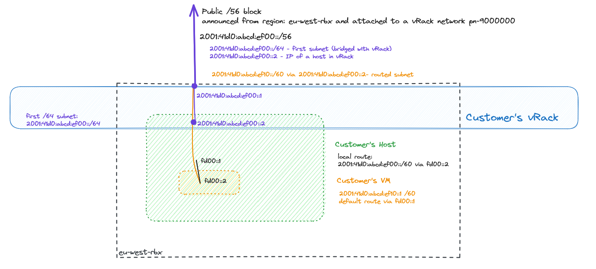{.thumbnail}

O percurso do tráfego é o seguinte: o tráfego de entrada para uma determinada VM (com a sub-rede especificada) é encaminhado através do vRack do cliente, primeiro para um host específico (com um endereço next-hop) e depois através de uma ligação local (ou vSwitch - ligação preta fd00::/64 no diagrama) até à máquina virtual específica.
O tráfego proveniente de uma VM dessas deve utilizar a rota predefinida através da primeira parte da ligação local (a preta, fd00::1) e depois a rota (eventualmente predefinida) de um host para o seu gateway.

Para a definição de uma sub-rede encaminhada, pode ser utilizado qualquer tamanho de prefixo entre /57 e /64.

O gateway predefinido do host é o primeiro endereço do bloco /56, que neste exemplo é: `2001:41d0:abcd:ef00::1`. Os gateways predefinidos utilizados pelas VMs são os endereços configurados do host (aqui fd00::1).

#### Definir uma sub-rede encaminhada

/// details | Área de cliente OVHcloud

Após adicionar o Additional IP ao seu vRack, pode gerir a sub-rede encaminhada clicando no botão `Adicionar uma sub-rede`{.action}.

{.thumbnail}

Para criar uma sub-rede encaminhada, devemos primeiro definir:

- **sub-rede em notação CIDR** (tamanho entre /57 e /64)
- **endereço next-hop** (endereço IPv6 do host)

Note que uma determinada sub-rede não pode sobrepor-se a outra sub-rede definida e que o endereço next-hop deve pertencer à primeira parte (sub-rede /64 em bridge) do seu prefixo Additional IPv6.

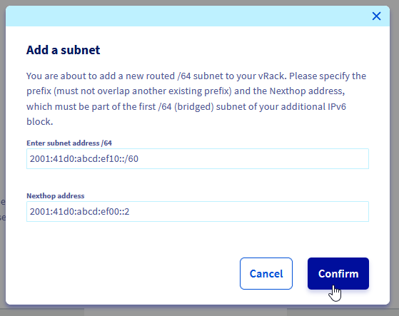{.thumbnail}

A sub-rede encaminhada `2001:41d0:abcd::ef10::/60` é acessível através do next hop `2001:41d0:abcd::ef00::2`.

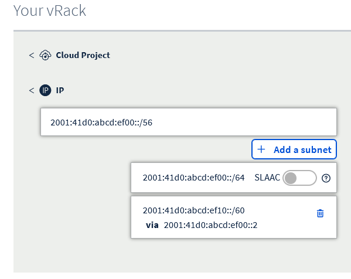{.thumbnail}

///

/// details | Comandos APIv6

Para criar uma sub-rede encaminhada, devemos primeiro definir:

- **sub-rede em notação CIDR** (tamanho entre /57 e /64)
- **endereço next-hop** (portanto, o endereço IPv6 do host)

Note que uma determinada sub-rede não pode sobrepor-se a outra sub-rede definida e que o endereço next-hop deve pertencer à primeira parte (sub-rede /64 em bridge) do seu prefixo Additional IPv6.

O exemplo abaixo mostra como definir uma sub-rede deste tipo:

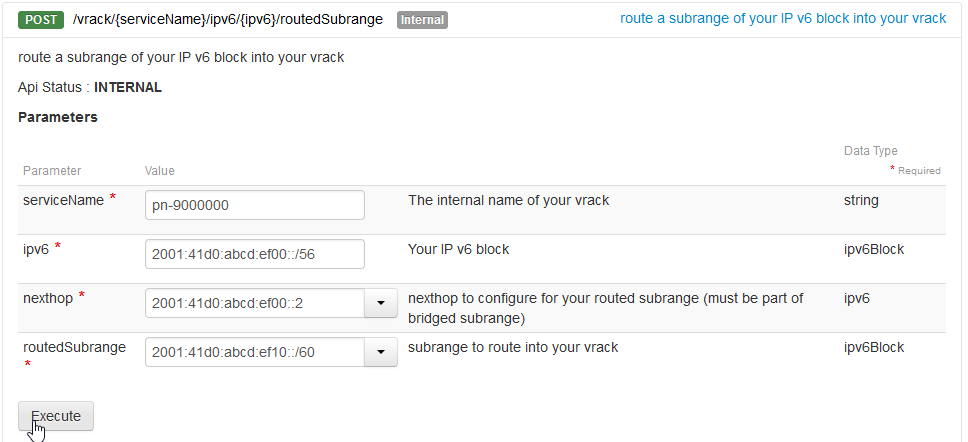{.thumbnail}

Aqui definimos a sub-rede encaminhada `2001:41d0:abcd:ef10::/60`, que será delegada à VM alojada no endereço `2001:41d0:abcd:ef00::2`.

///

#### Configuração do host <a name="host-side"></a>

/// details | Configuração IP estática de um host (recomendado)

Quando aloja VMs, recomendamos vivamente a utilização de uma configuração estática no seu host.

Configure um endereço IPv6, inicie a interface e (opcionalmente) adicione a rota predefinida na interface vRack:

```bash
$ sudo ip addr add 2001:41d0:abcd:ef00::2/64 dev eth1
$ sudo ip link set dev eth1 up
$ sudo ip -6 route add default via 2001:41d0:abcd:ef00::1 dev eth1
```

///

/// details | Configuração IP automática (SLAAC) para um host

Em alguns casos, pode querer configurar as suas interfaces com SLAAC e o reencaminhamento de IP em conjunto.

Note que isto apresenta riscos adicionais (como a perda de acesso não só ao host mas também a todas as VMs) e não é recomendado.

Verificação da ativação do reencaminhamento IPv6:

```bash
$ sudo sysctl -w net.ipv6.conf.all.forwarding=1
```

Configuração dos anúncios de roteamento para serem aceites (na interface vRack eth1 no nosso exemplo):

```bash
$ sudo sysctl -w net.ipv6.conf.eth1.accept_ra=2
```

///

/// details | Configuração da sub-rede encaminhada num host e dentro de uma máquina virtual

Para garantir que o nosso host sabe como gerir os pacotes endereçados à nova sub-rede encaminhada (que estará numa VM), devemos adicionar uma rota específica para ela.

No nosso exemplo, trata-se da ligação vEth com o endereço fd00::2/64, dentro de uma VM que utilizaremos para o encaminhamento.

Note que isto é muito específico para o hipervisor instalado (pode ser vSwitch ou interfaces vEth). Consulte o guia de configuração de rede específico do hipervisor para esta configuração.

```bash
$ sudo ip -6 route add 2001:41d0:abcd:ef10::/60 via fd00::2
```

///


/// details | Configuração de uma sub-rede encaminhada dentro de uma VM

Mais uma vez, note que a ligação utilizada entre o host e as VMs é muito específica para o hipervisor instalado (pode ser vSwitch ou interfaces vEth). Consulte os guias de configuração de rede do seu hipervisor para esta configuração.

Adicione o bloco de IPs encaminhados dentro de uma VM para garantir que pode aceitar pacotes:

```bash
debian@vm-1:~$ sudo ip address add 2001:41d0:abcd:ef10::1/60 dev lo
```

Adicione a rota predefinida numa VM para garantir que o tráfego pode sair da mesma:

```bash
debian@vm-1:~$ sudo ip -6 route add default via fd00::1
```

///


#### Verificação da configuração

/// details | Local, num host

Efetue um ping do host para o container (usando a ligação local):

```bash
debian@host:~$ ping fd00::2
PING fd00::2(fd00::2) 56 data bytes
64 bytes from fd00::2: icmp_seq=1 ttl=64 time=0.053 ms
64 bytes from fd00::2: icmp_seq=2 ttl=64 time=0.071 ms
```

Efetue um ping do host para o container (usando a sub-rede encaminhada):

```bash
debian@host:~$ ping 2001:41d0:abcd:ef10::1
PING 2001:41d0:abcd:ef10::1(2001:41d0:abcd:ef10::1) 56 data bytes
64 bytes from 2001:41d0:abcd:ef10::1: icmp_seq=1 ttl=64 time=0.054 ms
64 bytes from 2001:41d0:abcd:ef10::1: icmp_seq=2 ttl=64 time=0.073 ms
```

Verifique a rota para a nossa sub-rede /60 num host:

```bash
debian@host:~$ ip -6 route get 2001:41d0:abcd:ef10::1
2001:41d0:abcd:ef10::1 from :: via fd00::2 dev veth1a src fd00::1 metric 1024 pref medium
```

///

/// details | Local, numa VM

Em primeiro lugar, verifique a tabela de roteamento:

```bash
debian@vm-1:~$ ip -6 route show
2001:41d0:abcd:ef10::/60 dev lo proto kernel metric 256 pref medium
fd00::/64 dev veth1b proto kernel metric 256 pref medium
default via fd00::1 dev veth1b src 2001:41d0:abcd:ef10::1 metric 1024 pref medium
```

Efetue um ping para a interface de ligação local do host:

```bash
debian@vm-1:~$ ping fd00::1
PING fd00::1(fd00::1) 56 data bytes
64 bytes from fd00::1: icmp_seq=1 ttl=64 time=0.051 ms
64 bytes from fd00::1: icmp_seq=2 ttl=64 time=0.070 ms
```

Efetue um ping para a interface global do host:

```bash
debian@vm-1:~$ ping 2001:41d0:abcd:ef00::2
PING 2001:41d0:abcd:ef00::2(2001:41d0:abcd:ef00::2) 56 data bytes
64 bytes from 2001:41d0:abcd:ef00::2: icmp_seq=1 ttl=64 time=0.050 ms
64 bytes from 2001:41d0:abcd:ef00::2: icmp_seq=2 ttl=64 time=0.080 ms
```

Por fim, efetue um ping para um endereço IPv6 externo a partir de uma VM:

```bash
debian@vm-1:~$ ping 2001:41d0:242:d300::
PING 2001:41d0:242:d300::(2001:41d0:242:d300::) 56 data bytes
64 bytes from 2001:41d0:242:d300::: icmp_seq=1 ttl=57 time=0.388 ms
64 bytes from 2001:41d0:242:d300::: icmp_seq=2 ttl=57 time=0.417 ms
```

Ou, utilizando um nome de domínio:

```bash
debian@vm-1:~$ ping -6 proof.ovh.net
PING proof.ovh.net(2001:41d0:242:d300:: (2001:41d0:242:d300::)) 56 data bytes
64 bytes from 2001:41d0:242:d300:: (2001:41d0:242:d300::): icmp_seq=1 ttl=57 time=0.411 ms
64 bytes from 2001:41d0:242:d300:: (2001:41d0:242:d300::): icmp_seq=2 ttl=57 time=0.415 ms
```

///

/// details | A partir de um host remoto

Vamos verificar a conectividade com a nossa VM a partir do exterior da rede OVHcloud:

```bash
ubuntu@remote-test:~$ ping 2001:41d0:abcd:ef10::1
PING 2001:41d0:abcd:ef10::1(2001:41d0:abcd:ef10::1) 56 data bytes
64 bytes from 2001:41d0:abcd:ef10::1: icmp_seq=1 ttl=55 time=5.84 ms
64 bytes from 2001:41d0:abcd:ef10::1: icmp_seq=2 ttl=55 time=2.98 ms
```

E um traceroute a partir de um host remoto (na Internet):

```bash
ubuntu@remote-test:~$ mtr -rc1 2001:41d0:abcd:ef10::1
Start: 2024-03-26T09:26:45+0000
HOST: remote-test                  				Loss%   Snt   Last   Avg  Best  Wrst StDev
...
...
  9.|-- 2001:41d0:abcd::2:5d        				0.0%     1    1.9   1.9   1.9   1.9   0.0
 10.|-- 2001:41d0:abcd:ef00::2      				0.0%     1    2.2   2.2   2.2   2.2   0.0
 11.|-- 2001:41d0:abcd:ef10::1      				0.0%     1    2.2   2.2   2.2   2.2   0.0
```

Neste exemplo:

- hop 10 - Endereço IP do host
- hop 11 - Endereço IP da VM

///

## Localizações multi-região vs. vRack global

A tecnologia vRack da OVHcloud permite às empresas ligar servidores em diferentes localizações como se estivessem situados no mesmo datacenter.
Por outro lado, os serviços como o Additional IPv6 são regionais, o que significa que o seu funcionamento está ligado a uma localização específica.

Abaixo é apresentada uma arquitetura para fins pedagógicos com duas regiões diferentes e blocos Additional IPv6 diferentes anunciados a partir de cada uma delas. Além disso, é apresentado um host configurado com endereços IP de ambas as redes e um exemplo de rota não otimizada: um host numa região com um endereço IPv6 anunciado noutra região:

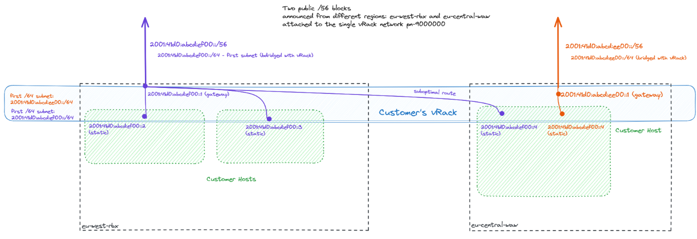{.thumbnail}

Note que em tais configurações (com Additional IPv6 provenientes de mais de uma região), o SLAAC **deve estar desativado em todo o vRack** (pois isso pode conduzir a resultados imprevisíveis e perda aleatória de conectividade).

### Vantagens

- **Conectividade melhorada:** Ao tirar partido de uma rede vRack com blocos de IP públicos encaminhados em múltiplas localizações, as empresas podem garantir uma comunicação fluida em todo o mundo, independentemente das localizações físicas dos servidores backend.
- **Migração para a cloud:** A tecnologia vRack pode ser um grande facilitador dos primeiros passos para uma estratégia organizacional de "migração para a cloud", desbloqueando algumas aplicações legadas que ainda requerem comunicação de rede local.

### Riscos e considerações

- **Sem suporte SLAAC em configurações com múltiplas localizações:** Quando há mais de uma localização envolvida no encaminhamento de tráfego IP público (IPv4 e IPv6) no mesmo vRack, a configuração automática de endereços sem estado (SLAAC) **não deve ser utilizada**. Como exemplo dessa situação, consideremos hosts existentes que utilizam endereços IPv4. Esses hosts são reconfigurados automaticamente pelo SLAAC com um gateway IPv6 configurado a partir de outra região. Associada à priorização do IPv6 sobre o IPv4 por parte de alguns sistemas operativos, esta situação pode conduzir a um encaminhamento não otimizado ou mesmo à perda total de conectividade para esses hosts.

## Limitações conhecidas

Compreender as restrições relacionadas com a utilização de **Additional IPv6** no ambiente **vRack** é essencial para um planeamento eficaz da rede. Seguem-se as principais limitações a ter em conta:

- **Additional IPv6 disponível apenas com vRack**: Note que os endereços Additional IPv6 só podem ser configurados com backends ligados ao vRack.
- **Limitações do SLAAC em configurações com múltiplas localizações**: A configuração automática de endereços sem estado (SLAAC) não é suportada quando há tráfego IP público (IPv6 e IPv4) encaminhado no vRack em múltiplas regiões.
- **Até 128 hosts dentro da sub-rede em bridge**: Pode utilizar até 128 endereços IP diretamente no vRack.
- **Até 128 rotas next-hop**: Pode utilizar até 128 rotas para sub-redes encaminhadas dentro de um vRack.
- **Limite da largura de banda pública**: O tráfego de saída da OVHcloud para a Internet está limitado a 5 Gbps por região.
- **Limites de alocação de blocos IPv6**: Um único bloco Additional IPv6 por vRack numa região. Máximo de 3 blocos (/56) por localização de região.
- **Mobilidade dos blocos Additional IPv6**: Devido ao design hierárquico do espaço de endereçamento IPv6, os blocos Additional IPv6 são específicos de cada região. Isto significa que os blocos não podem ser transferidos entre regiões, embora possam ser reatribuídos a qualquer backend ligado ao vRack.
- **Sem suporte direto de VLAN 802.1Q no vRack com Additional IPv6**: A configuração só pode ser efetuada com a VLAN nativa da sua rede vRack. Para o encaminhamento de pacotes dentro de uma VLAN específica (num vRack), será necessário um host dedicado do lado do cliente.
- **De momento, o encaminhamento de Additional IPv6 no vRack não é suportado nas regiões APAC.**

## Quer saber mais?

Fale com a nossa [comunidade de utilizadores](/links/community).
