## Objective

Internet Protocol version 6 (IPv6) is the successor to Internet Protocol version 4 (IPv4). Set up to resolve IPv4 address exhaustion, IPv6 uses 128-bit addresses instead of 32-bit addresses. High Grade, Scale and Advance range servers (since July 2024) are delivered with a /56 IPv6 block. Older servers come with an IPv6/64 block. A server delivered with a /56 IPv6 block can have up to 18 quintillion IP addresses.

Our infrastructure also allows you to configure IPv6 on your virtual machines.

**This guide explains how to configure an IPv6 address on a virtual machine for Proxmox VE or Microsoft Hyper-V Server on an OVHcloud Dedicated Server.**

> [!warning]
> OVHcloud provides services that you are responsible for. Since we have no access to these machines, we are not their administrators and cannot provide you with assistance. You are responsible for your own software and security management.
>
> We have provided you with this guide in order to help you with common tasks. However, we recommend contacting a [specialist provider](/links/partner) if you experience any difficulties or doubts when it comes to managing, using or securing your server. You can find more information in the “Go further” section of this guide.
>

## Requirements

- A [dedicated server](/links/bare-metal/bare-metal) with an IPv6 block (/64) or (/56) in your OVHcloud account.
- An operating system with virtualization capabilities (Proxmox VE, Hyper-V Server, etc.).
- You must have all the information related to your IPv6 (prefix, gateway, etc.).
- Basic knowledge of SSH and networking.

> [!warning]
> Please note that [we no longer offer VMware EXSi as an operating system](/pages/bare_metal_cloud/dedicated_servers/esxi-end-of-support). As a result, the configuration examples in this guide will focus on Proxmox VE and Windows Hyper-V.
>

## Instructions

The following sections contain the configurations of the distributions we currently offer and the most commonly used distributions/operating systems. The first step is always to connect to your server via SSH or via a GUI (RDP for a Windows server) connection session.

On dedicated servers, the first IPv6 is declared as 2607:5300:xxxx:xxxx::/64. For example, if we have assigned your server the IPv6 range: `2607:5300:xxxx:xxxx::/64`, the first IPv6 on your server is: `2607:5300:xxxx:xxxx::/64`.

Before you begin, and in order to use the same terminology during the changes, please read the table below. It references terms that we will use in this documentation:

|Term|Description|Example|
|---|---|---|
|YOUR_IPV6|This is an IPv6 address of the IPv6 block assigned to your server|2607:5300:xxxx:xxxx::1|
|IPv6_PREFIX|This is the prefix (or *netmask*) of your IPv6 block, usually /64 or /56|2607:5300:xxxx:xxxx::/64|
|IPv6_GATEWAY|This is the gateway (or *gateway*) of your IPv6 block|2607:5300:xxxx:xx:ff:ff:ff:ff:ff or fe80::1|

In our examples, we will use the `nano` text editor. You can of course use the text editor of your choice.

### Default Gateway

The first step is to retrieve the IPv6 gateway assigned to your server. Two methods are possible:

- Get network information via the OVHcloud Control Panel
- Get network information via the APIs

#### Via the OVHcloud Control Panel

Log in to your [OVHcloud Control Panel](/links/manager), go to the `Bare Metal Cloud`{.action} section, and select your server under the `Dedicated servers`{.action} section.

The IPv6 gateway assigned to your server is displayed in the `Network` section of the `General information`{.action} tab.

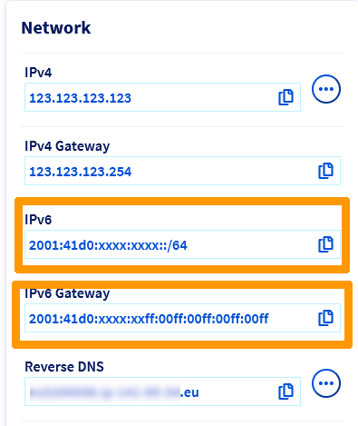{.thumbnail}

#### Via OVHcloud APIs

Another way to retrieve your server's network information is by [using the OVHcloud API](/pages/manage_and_operate/api/first-steps).

Execute the following API call, specifying the internal name of the server (example: `ns3956771.ip-169-254-10.eu`):

> [!api]
>
> @api {v1} /dedicated/server GET /dedicated/server/{serviceName}/specifications/network
>

> [!success]
> Please note that the preceeding "0s" can be deleted in an IPv6 gateway.
>
> Example: IPv6_GATEWAY : `2607:5300:60:62ff:00ff:00ff:00ff:00ff` can also be written as `2607:5300:60:62ff:ff:ff:ff:ff:ff`.

### Prepare the host

#### Proxmox VE

##### **For a virtual machine**

The first step is to create the virtual machine in Proxmox VE.

Once you have logged in to the Proxmox dashboard, click on your server name in the left-hand corner, then `Create VM`{.action}.

{.thumbnail}

**Create: Virtual Machine**

> [!tabs]
> **General**
>>
>> **Name:** Enter a name for your VM.
>>
>>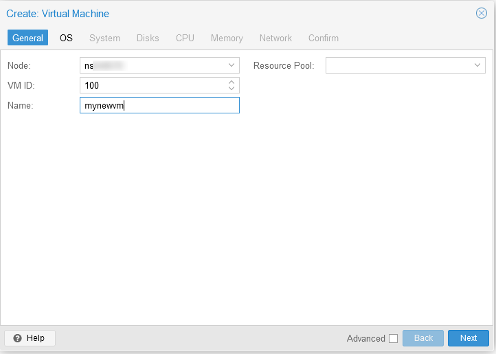{.thumbnail}
>>
> **OS**
>> Click the dropdown arrow next to `ISO image` to select the image of your choice. In our example, we use ubuntu 24.04 ISO.
>>
>>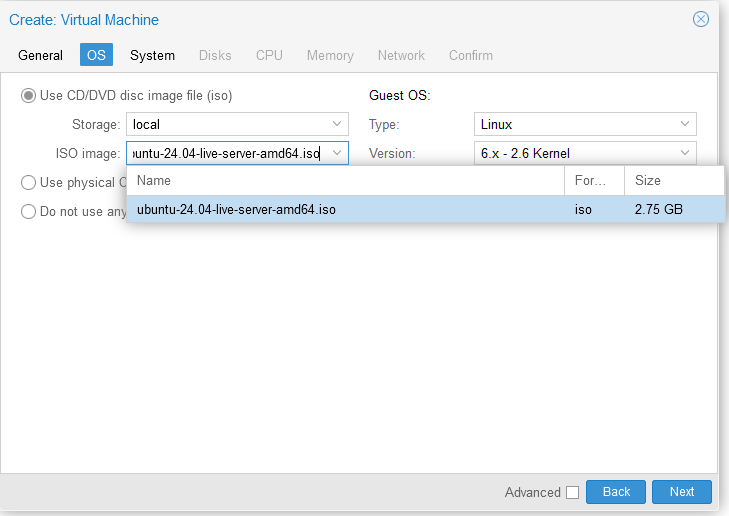{.thumbnail}
>>
> **Confirm**
>>
>> Once you have done this, click `Finish`{.action} to create the VM.
>>
>>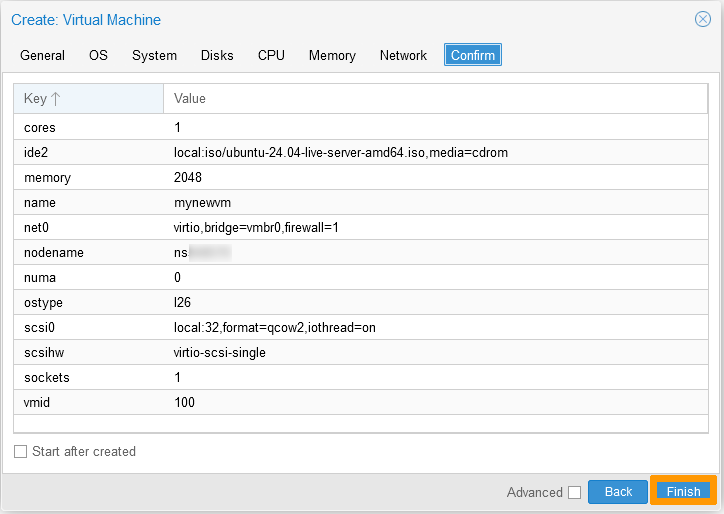{.thumbnail}
>>

Once the operating system has been installed on the virtual machine, you can [configure](#configurationsteps) the IPv6 address.

##### **For a container**

Once you have created your container, click on it in the left-hand menu. Then click `Network`{.action}.

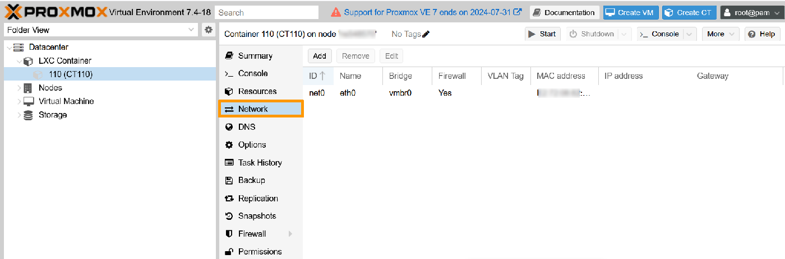{.thumbnail}

Select the existing network and click `Edit`{.action}.

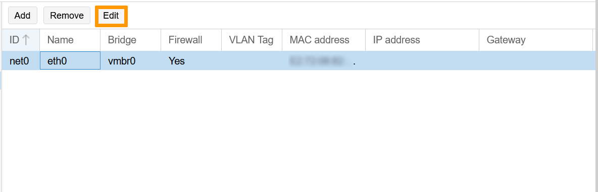{.thumbnail}

Fill in the IPV6 fields with the correct information.

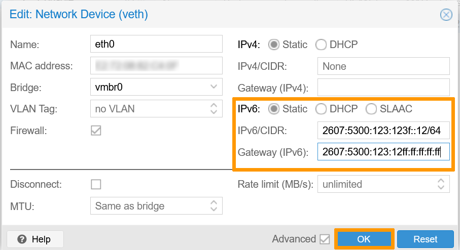{.thumbnail}

Once you have done this, click `OK`{.action} to save the changes.

Log in to your container to verify IPv6 connectivity with the `ping` command:

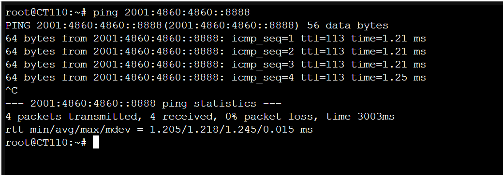{.thumbnail}

#### Windows Server / Hyper-V

The first step is to install the Hyper-V role on your Windows Server. For more information, consult the [official documentation](https://learn.microsoft.com/en-us/windows-server/virtualization/hyper-v/get-started/install-the-hyper-v-role-on-windows-server){.external}.

Before configuring your virtual machine, you need to create a virtual switch.

From the command line of your dedicated server, run the following command and note the name of the network adapter that contains the server's main IP address:

```powershell
ipconfig /all
```

> [!primary]
> 
> This step is only required once for a Hyper-V server. For all VMs, a **virtual switch** is required to connect the VM’s **virtual network adapters** to the server’s **physical adapter**.
> 

In the Hyper-V Manager, create a new virtual switch and set the connection type to `External`{.action}.

Select the adapter with the server’s IP, then tick the option `Allow management operating system to share this network adapter`{.action}.

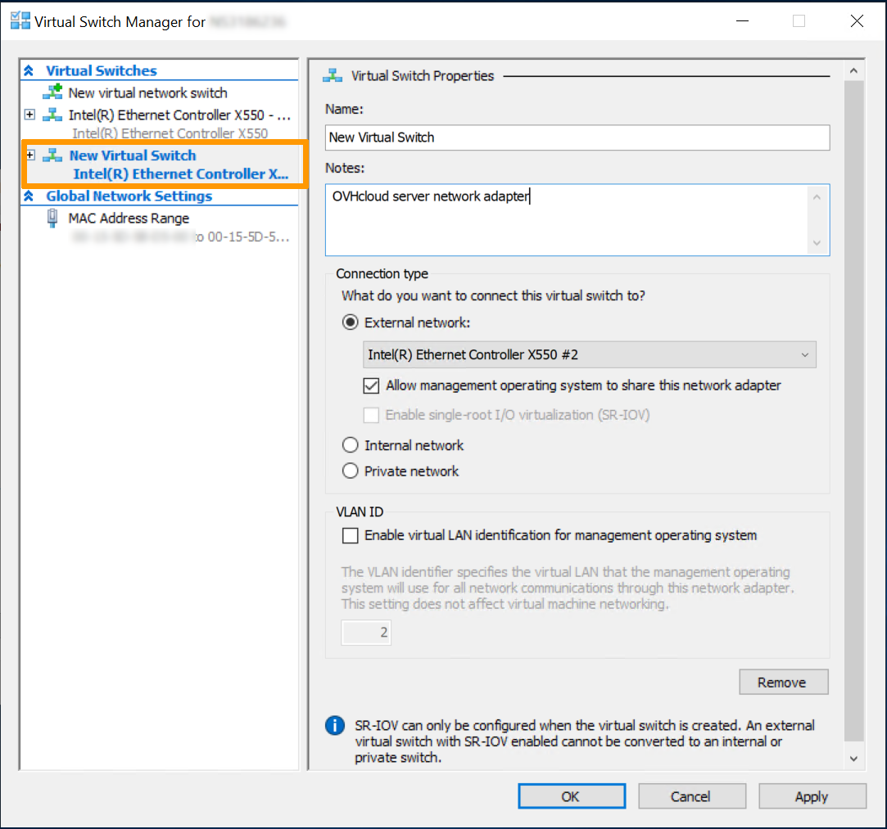{.thumbnail}

Next, go to the settings of the VM and click on `Network Adapter`{.action} in the left-hand tab. From the drop down list, select the virtual switch created earlier and click on `Apply`{.action}, then on `OK`{.action}.

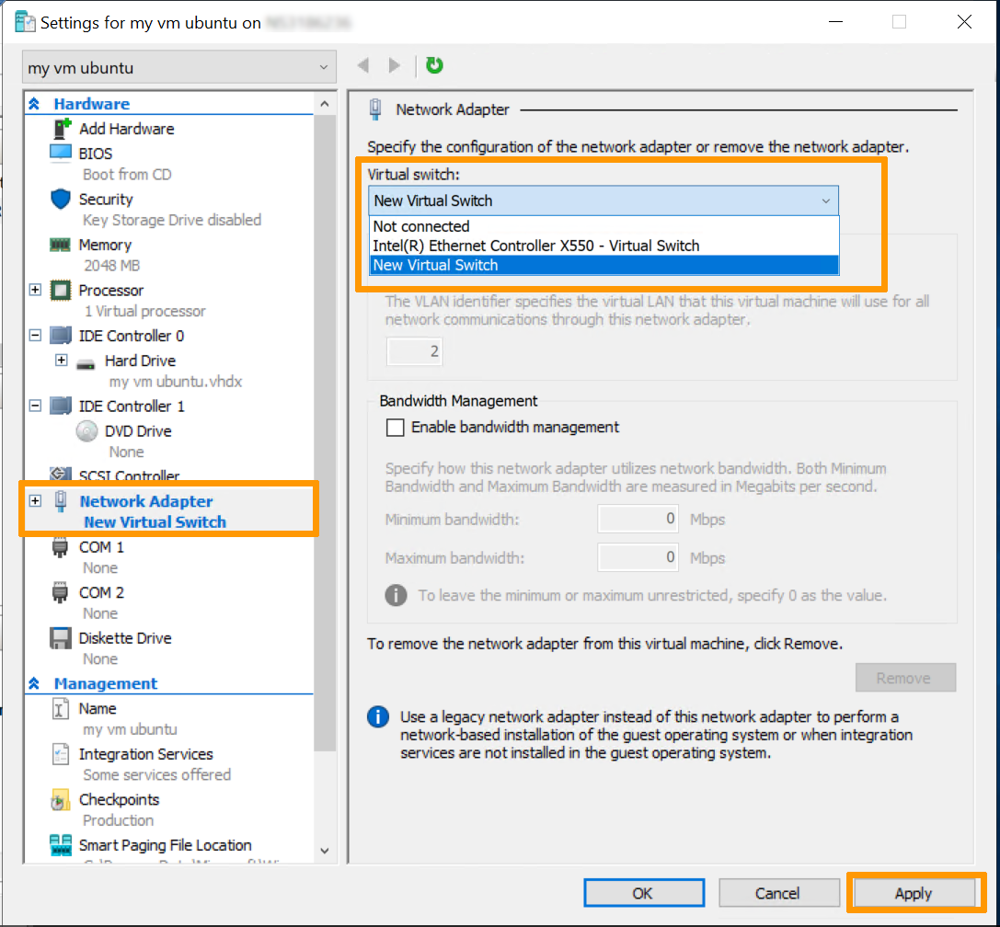{.thumbnail}

Once you have installed the operating system on the virtual machine, you can proceed with the [configuration](#configurationsteps) of the IPv6 IP address.

### Configure the IPv6 on virtual machines <a name="configurationsteps"></a>

#### Configuration based on Netplan

The configuration below is based on Ubuntu 24.04.

Once you are logged in to your virtual machine, the first step is to access the configuration file:

```bash
sudo nano /etc/netplan/50-cloud-init.yaml
```

Next, configure the IPv6 address of your choice by replacing *YOUR_IPV6*, *IPV6_PREFIX* and *IPV6_GATEWAY* with your own values.

```yaml
network:
    ethernets:
        ens18:
            dhcp4: true
            dhcp6: false
            addresses:
              - YOUR_IPV6/IPV6_PREFIX
            routes:
              - to: default
                via: IPV6_GATEWAY
                on-link: true
    version: 2
```

> [!warning]
>
> It is important to respect the alignment of each element in `yaml` files as represented in the example above. Do not use the tab key to create your spacing. Only the space key is needed. 
>

Save your changes to the config file and exit the editor.

Apply the configuration:

```bash
sudo nano netplan apply
```

To test your IPv6 connectivity, run the `ping` command at `2001:4860:4860::8888`:

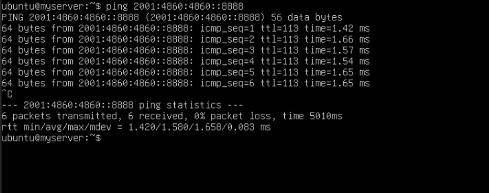{.thumbnail}

#### Configuration based on ENI

The configuration below is based on Debian 11.

Once you are logged in to your virtual machine, the first step is to access the configuration file:

```bash
sudo nano /etc/network/interfaces
```

Next, configure the IPv6 address of your choice by replacing *YOUR_IPV6*, *IPV6_PREFIX* and *IPV6_GATEWAY* with your own values. Replace `ens18` with your interface name.

```console
auto-lo
iface lo inet loopback

auto ens18
iface ens18 inet6 static
address YOUR_IPV6/IPV6_PREFIX
IPV6_GATEWAY gateway
```

Save your changes to the config file and exit the editor.

Next, reboot the network with the following command:

```bash
sudo systemctl restart networking.service
```

To test your IPv6 connectivity, run the `ping` command at `2001:4860:4860::8888`:

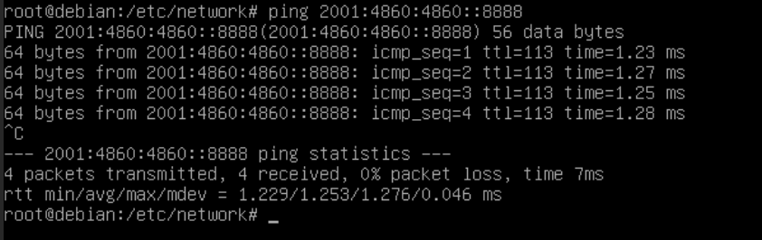{.thumbnail}

#### Configuration based on NetworkManager

The configuration below is based on Fedora 40.

NetworkManager has previously stored network profiles in ifcfg format in this directory: `/etc/sysconfig/network-scripts/`. However, the ifcfg format is now deprecated. By default, NetworkManager no longer creates profiles in this format. The configuration file is now located in `/etc/NetworkManager/system-connections/`.

Once you are logged in to your virtual machine, the first step is to access the configuration file:

```bash
sudo /etc/NetworkManager/system-connections
```

Use the `ls` command to display the network configuration file. In our example, our file is named `ens18.nmconnection`.

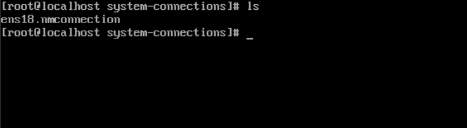{.thumbnail}

Next, configure the IPv6 address of your choice by replacing *YOUR_IPV6*, *IPV6_PREFIX* and *IPV6_GATEWAY* with your own values.

```bash
sudo nano /etc/NetworkManager/system-connections/ens18.nmconnection
```

```console
[ipv6]
method=manual # If the value is "auto", replace with "manual".
may-fail=true
address=YOUR_IPV6/IPv6_PREFIX
gateway=IPV6_GATEWAY
```

Save your changes to the config file and exit the editor.

Next, reboot the network with the following command:

```bash
sudo systemctl restart NetworkManager
```

To test your IPv6 connectivity, run the `ping` command at `2001:4860:4860::8888`:

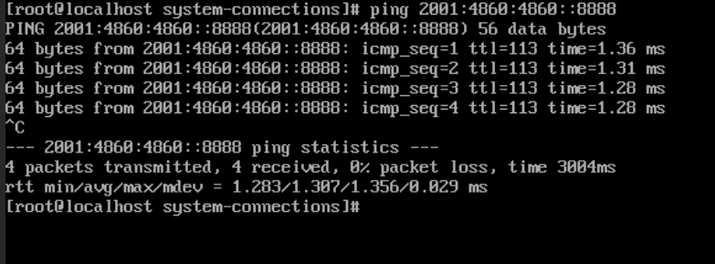{.thumbnail}

## Go further

Join our [community of users](/links/community).
