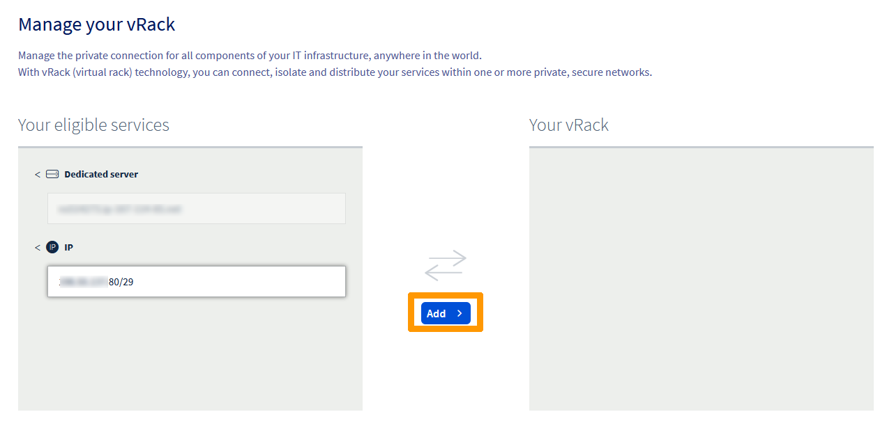
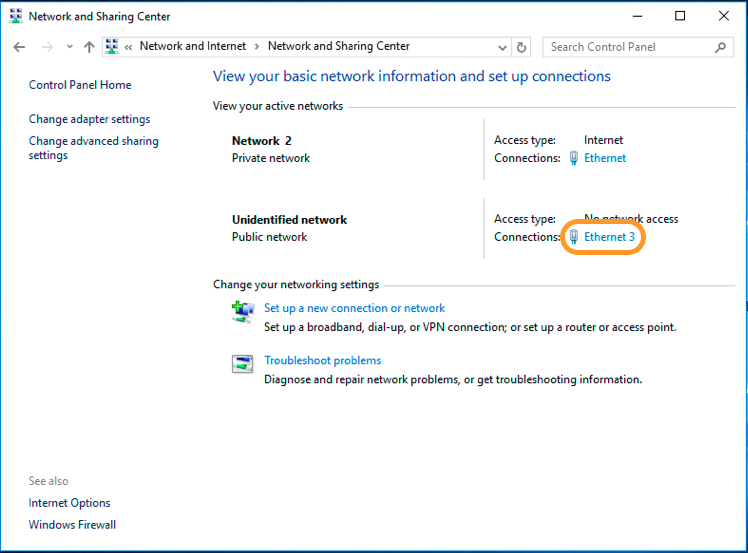
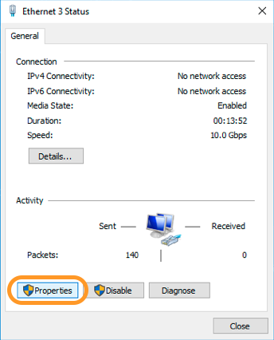
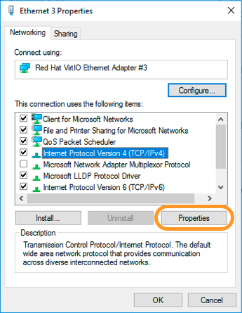
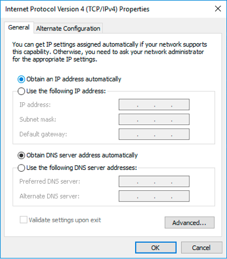
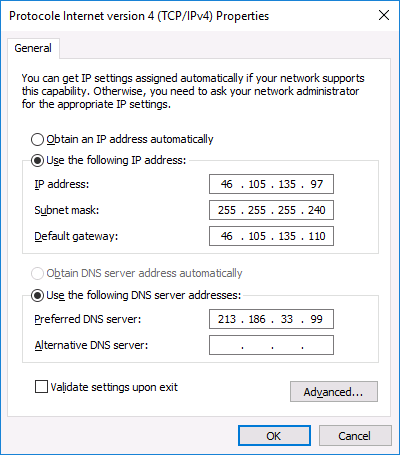
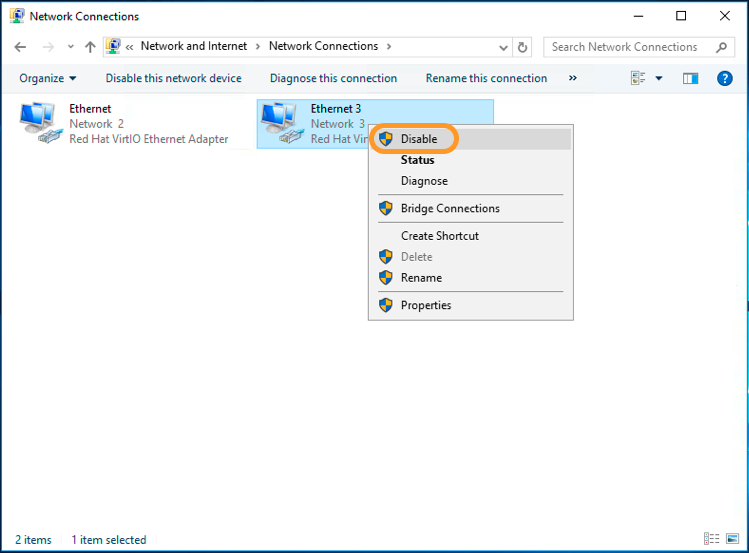
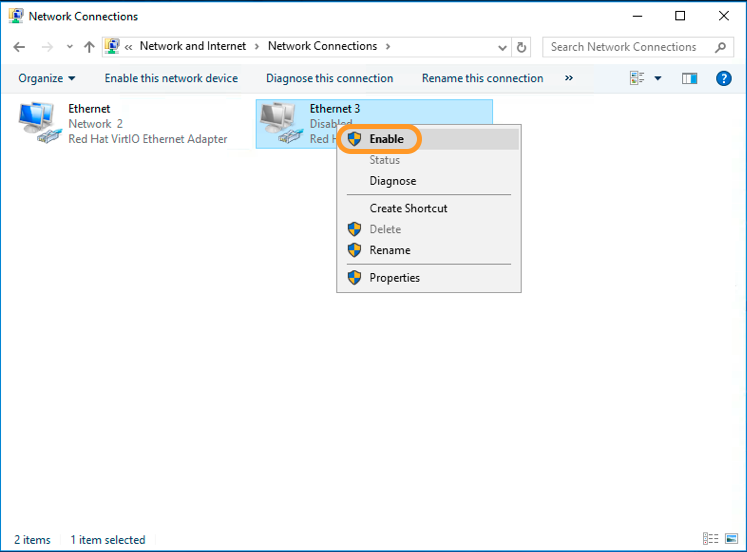

<style>
details>summary {
    color:rgb(33, 153, 232) !important;
    cursor: pointer;
}
details>summary::before {
    content:'\25B6';
    padding-right:1ch;
}
details[open]>summary::before {
    content:'\25BC';
}
</style>

## Objectif

En plus de l'adressage IP privé, le [vRack](/links/network/vrack) vous permet de diriger le trafic IP public via le port vRack de votre serveur à l'aide d'un bloc d'adresses IP publiques.

**Ce guide vous explique comment configurer un bloc d'adresses IP publiques à utiliser avec le vRack.**

> [!primary]
>
> Le vRack prend en charge le routage public IPv4 et IPv6 avec des blocs d'adresses Additional IP. Retrouvez les instructions sur la configuration de blocs IPv6 dans ce guide : « [Configurer un bloc Additional IPv6 dans un vRack](/pages/bare_metal_cloud/dedicated_servers/configure-an-ipv6-in-a-vrack) ».
>

> [!primary]
>
> Cet article détaille la configuration d'adresses Additional IP sur un réseau vRack. Si vous cherchez des instructions sur la configuration d'adresses Additional IP avec une adresse IP principale (sur l'interface réseau publique), consultez les articles suivants :
>
> - IPv4:
>     - [Configurer une adresse IP en alias sur un serveur dédié](/pages/bare_metal_cloud/dedicated_servers/network_ipaliasing).
>     - [Configurer une adresse IP en alias sur un serveur VPS](/pages/bare_metal_cloud/virtual_private_servers/configuring-ip-aliasing).
>
> - IPv6:
>     - [Configurer IPv6 sur un serveur dédié](/pages/bare_metal_cloud/dedicated_servers/network_ipv6).
>     - [Configurer IPv6 sur un serveur VPS](/pages/bare_metal_cloud/virtual_private_servers/configure-ipv6).
>     - [Configurer IPv6 sur une instance Public Cloud](/pages/public_cloud/public_cloud_network_services/configuration-02-how-to-configure-ipv6).
>

## Prérequis

- Avoir réservé un bloc public d'adresses IP dans votre compte, avec un minimum de quatre adresses.
- Préparer votre plage d'adresses IP privées choisies.
- Posséder un [serveur compatible vRack](/links/bare-metal/bare-metal).
- Activer un service [vRack](/links/network/vrack).

<!-- CP-NAV-START:network-vrack -->
---

### Accès à l'espace client OVHcloud

- **Lien direct :** [vRack](/links/control-panel/network-vrack)
- **Pour accéder à vos services :** `Network`{.action} > `Réseau Privé vRack`{.action}

---
<!-- CP-NAV-END:network-vrack -->

> [!warning]
> Cette fonctionnalité peut être indisponible ou limitée sur les [serveurs dédiés **Eco**](/links/bare-metal/eco-about).
>
> Consultez notre [comparatif](/links/bare-metal/eco-compare) pour plus d'informations.

## En pratique

> [!primary]
>
> À titre d'exemple, nous utiliserons un bloc IP de 46.105.135.96/28 et `eth1` pour l'interface réseau secondaire, qui est dédiée au vRack.
>
> À titre d'exemple également, le fichier de configuration réseau auquel nous faisons référence se trouve dans `/etc/network/interfaces`. En fonction du système d'exploitation utilisé, le fichier équivalent peut être situé ailleurs. Le contenu du fichier peut également être différent. En cas de difficultés, n'hésitez pas à vous référer à la documentation officielle de votre distribution.

### Ajouter le bloc IP au vRack

> [!warning]
>
> Lorsqu'un bloc IP est ajouté au vRack, il n'est plus rattaché à un serveur physique.
>
> Cette configuration permet de configurer des IP d'un même bloc sur plusieurs serveurs, à condition que ces serveurs soient tous dans le même vRack que le bloc IP. Le bloc IP doit avoir au moins 2 adresses IPs utilisables ou plus pour que cela soit possible.
>

Sélectionnez votre vRack dans la liste pour afficher la liste des services éligibles. Cliquez sur le bloc IP que vous souhaitez ajouter au vRack et cliquez sur le bouton `Ajouter`{.action}.

{.thumbnail}

### Gérer la bande passante des IP publiques sur le vRack

Par défaut, les blocs d'Additional IP routés via un vRack bénéficient d'une bande passante publique standard de 5 Gbps en Europe et en Amérique du Nord, ou de 100 Mbps dans les régions APAC. Pour plus de détails sur les offres disponibles, consultez les options de routage public sur notre [page produit vRack](/links/network/vrack).

Pour répondre à la montée en charge des infrastructures et aux besoins des services à fort trafic, OVHcloud propose maintenant à ses clients des options de bande passante payantes. Notez que ces options s'appliquent **par vRack et par région**. Comme les Additional IP sont liées à une région précise, toute modification de la bande passante impactera l'ensemble des adresses (IPv4 et IPv6) routées vers ce vRack dans la région concernée.

/// details | Lors de la commande d'une Additional IP

#### Choisir la bande passante publique lors de la commande

Vous pouvez modifier la bande passante par défaut au moment de commander un nouveau bloc d'Additional IP, dès lors qu'un réseau vRack est sélectionné comme service backend.

Pour commander un nouveau bloc d'Additional IP :

- Dans la barre latérale gauche, accédez à la section `Network`{.action}.
- Sélectionnez `Adresses IP Publiques`{.action}.
- Cliquez sur le bouton `Commander des IPs`{.action} en haut de la page.
- Choisissez la version de l'IP, puis le vRack auquel l'Additional IP sera rattachée.
- Sélectionnez la région de votre Additional IP.
- Choisissez la bande passante publique à appliquer à votre vRack pour cette région.
- Configurez les autres options selon vos besoins, puis finalisez la commande.

///

/// details | Depuis la page de gestion du vRack

#### Modifier la bande passante publique depuis la page de gestion

Pour les blocs d'Additional IP déjà rattachés à un vRack, la bande passante se gère directement depuis la page de configuration du service.

Pour accéder à l'interface de gestion :

- Dans la colonne « Adresse IP publique et bande passante », cliquez sur le bouton `Gérer`{.action} correspondant au vRack souhaité.

L'interface de gestion se divise en deux onglets :

- **Tous les services attachés** : Redirige actuellement vers la page de gestion classique du vRack. Prochainement, cet onglet listera de façon optimisée tous les produits (serveurs, projets Cloud, etc.) liés au vRack.
- **Connectivité IP publique** : Permet de gérer les options de routage public de votre vRack, y compris la bande passante.

Pour modifier la bande passante :

- Allez dans l'onglet `Connectivité IP publique`{.action}.
- L'interface affiche des fenêtres de gestion par région (ex : `eu-west-par`) associées au vRack, avec la liste des IP rattachées.
- Dans l'encadré de la région concernée, cliquez sur `Modifier la bande passante`{.action}.
- Sélectionnez l'option souhaitée dans le panneau de droite, puis cliquez sur `Commander`{.action} pour valider.
- Une fois le paiement effectué, la nouvelle bande passante sera effective sur votre vRack dans la région choisie après quelques minutes.

> [!primary]
>
> Le premier mois souscrit est facturé au prorata des jours restants. Le tarif complet s'appliquera lors du cycle de facturation suivant.
>

L'augmentation de bande passante s'appliquera à toutes les adresses IP de cette région pour le vRack sélectionné.

///

### Gérer les priorités de basculement 3-AZ

Certaines régions OVHcloud s'étendent sur trois zones de disponibilité (AZ) hébergées dans des emplacements physiquement indépendants au sein d'une même région. Lorsqu'une telle région intervient dans le routage des IP publiques de votre vRack, elle est identifiée dans l'espace client OVHcloud par un badge **3-AZ** affiché à côté du nom de la région dans l'onglet `Connectivité IP publique`{.action}.

> [!primary]
>
> Pour activer le mode 3-AZ pour les blocs d'adresses IP routés via le vRack dans les régions où cette fonctionnalité était auparavant indisponible, vous devez retirer le bloc IP du vRack, puis le réajouter.
>

#### Avantages

- **Résilience intégrée** : le trafic IP public routé via le vRack reste disponible si une zone de disponibilité devient indisponible, le routage basculant automatiquement vers l'AZ suivante dans l'ordre de priorité.
- **Comportement de basculement prévisible** : chaque région 3-AZ expose pour votre vRack une zone de disponibilité primaire et deux positions de basculement ordonnées, ce qui rend la séquence de basculement déterministe.
- **Alignement avec la charge de travail** : lorsque d'autres services OVHcloud sont déployés dans la même région 3-AZ, les priorités peuvent être alignées pour que l'AZ active du vRack corresponde à l'AZ qui héberge vos services. Votre trafic public reste ainsi dans la même AZ que votre charge de travail en fonctionnement normal.

#### Mécanique et gestion des priorités

Lorsqu'un vRack est rattaché pour la première fois à une région 3-AZ, OVHcloud lui attribue aléatoirement une **zone de disponibilité primaire**. La zone primaire est affichée dans la tuile correspondante de l'onglet `Connectivité IP publique`{.action}, à côté d'un lien `Configurer les priorités de basculement 3-AZ`{.action}. Les deux AZ restantes sont attribuées comme **Zone de disponibilité secondaire** et **Zone de dernier recours**.

Vous pouvez modifier cette attribution aléatoire à tout moment, par exemple pour aligner les priorités de basculement sur la disposition AZ d'autres composants attachés à votre infrastructure.

/// details | Modifier les priorités des zones de disponibilité

Pour ajuster les priorités de basculement d'une région 3-AZ :

- Dans la barre latérale gauche du Tableau de bord, ouvrez `Network`{.action}.
- Sélectionnez `Réseau Privé vRack`{.action}.
- Dans la colonne « Adresse IP publique et bande passante », cliquez sur le bouton `Gérer`{.action} correspondant au vRack souhaité.
- Ouvrez l'onglet `Connectivité IP publique`{.action}.
- Dans la tuile de la région 3-AZ à configurer, cliquez sur `Configurer les priorités de basculement 3-AZ`{.action}.
- Dans le panneau qui s'ouvre à droite, attribuez chaque zone de disponibilité à l'un des trois emplacements : **Zone primaire**, **Zone secondaire** et **Zone de dernier recours**.
- Validez votre sélection.

> [!primary]
>
> Les modifications de priorité s'appliquent à tous les blocs d'Additional IP routés vers la région 3-AZ correspondante pour le vRack sélectionné, quelle que soit leur version d'IP.
>

///

### Configurer une adresse IP utilisable

Dans le cas du vRack, la première, l'avant-dernière et la dernière adresse d'un bloc d'IP donné sont toujours réservées respectivement à l'adresse réseau, la passerelle réseau et au *broadcast* du réseau. Cela signifie que la première adresse utilisable est la deuxième adresse du bloc, comme indiqué ci-dessous :

```sh
46.105.135.96   # Réservée : adresse réseau
46.105.135.97   # Première IP utilisable
46.105.135.98
46.105.135.99
46.105.135.100
46.105.135.101
46.105.135.102
46.105.135.103
46.105.135.104
46.105.135.105
46.105.135.106
46.105.135.107
46.105.135.108
46.105.135.109   # Dernière IP utilisable
46.105.135.110   # Réservée : passerelle réseau
46.105.135.111   # Réservée : broadcast réseau
```

Pour configurer la première adresse IP utilisable, vous devez éditer le fichier de configuration réseau comme indiqué ci-dessous. Dans cet exemple, utilisez un masque de sous-réseau de **255.255.255.240**.

> [!primary]
>
> Le masque de sous-réseau utilisé dans cet exemple est approprié pour notre bloc IP. Votre masque de sous-réseau peut différer en fonction de la taille de votre bloc. Lorsque vous achetez votre bloc d'IP, vous recevez un e-mail vous indiquant le masque de sous-réseau à utiliser.
>

### Télécharger le paquet `iproute2`

Avant de commencer, téléchargez et installez **iproute2**, un paquet permettant de configurer manuellement le routage IP. Ce paquet est peut-être déjà disponible sur votre serveur — si c'est le cas, passez à l'étape suivante.

Établissez une connexion SSH à votre serveur et exécutez la commande suivante pour télécharger et installer iproute2 :

```sh
sudo apt-get install iproute2
```

**Fedora**

```sh
sudo dnf install iproute
```

#### Configurations GNU/Linux

> [!tabs]
> **Debian 11**
>>
>> **Configurer l'Additional IP**
>>
>> Ouvrez le fichier de configuration réseau situé dans `/etc/network/interfaces.d` avec un éditeur de texte de votre choix. Ici, le fichier s'appelle `50-cloud-init`.
>>
>> ```sh
>> /etc/network/interfaces.d/50-cloud-init
>>
>> auto eth1
>> iface eth1 inet static
>> address 46.105.135.97
>> netmask 255.255.255.240
>> broadcast 46.105.135.111
>> ```
>>
>> **Créer une nouvelle table de routage IP**
>>
>> Ensuite, créez une nouvelle route IP pour le vRack. Ajoutez une nouvelle règle de trafic en modifiant le fichier comme indiqué ci-dessous :
>>
>> ```sh
>> sudo nano /etc/iproute2/rt_tables
>> #
>> # reserved values
>> #
>> 255	local
>> 254	main
>> 253	default
>> 0	unspec
>> #
>> # local
>> #
>> #1	inr.ruhep
>> 1 vrack
>> ```
>>
>> **Modifier le fichier de configuration réseau**
>>
>> > [!primary]
>> >
>> > À titre d'exemple, le fichier de configuration réseau auquel nous faisons référence se trouve dans /etc/network/interfaces. En fonction du système d'exploitation utilisé, le fichier équivalent peut être situé ailleurs.
>> >
>>
>> Pour finir, modifiez le fichier de configuration réseau pour prendre en compte la nouvelle règle de trafic et acheminer le trafic vRack via l'adresse de passerelle réseau **46.105.135.110**.
>>
>> ```sh
>> sudo nano /etc/network/interfaces.d/50-cloud-init
>>
>> auto eth1
>> iface eth1 inet static
>> address 46.105.135.97
>> netmask 255.255.255.240
>> broadcast 46.105.135.111
>> post-up ip route add 46.105.135.96/28 dev eth1 table vrack
>> post-up ip route add default via 46.105.135.110 dev eth1 table vrack
>> post-up ip rule add from 46.105.135.96/28 table vrack
>> post-up ip rule add to 46.105.135.96/28 table vrack
>> ```
>>
>> Redémarrez le serveur pour appliquer les modifications ou activez simplement la nouvelle interface réseau :
>>
>> ```sh
>> ip link set eth1 up
>> ```
>>
> **CentOS, AlmaLinux et Rocky Linux (8/9)**
>>
>> **Créer le fichier pour l'interface réseau secondaire**
>>
>> Copiez la configuration de l'interface réseau principale et adaptez-la selon vos besoins :
>>
>> ```sh
>> sudo cp /etc/sysconfig/network-scripts/ifcfg-eth0 /etc/sysconfig/network-scripts/ifcfg-eth1
>> ```
>>
>> Ouvrez ensuite le nouveau fichier :
>>
>> ```sh
>> sudo nano /etc/sysconfig/network-scripts/ifcfg-eth1
>> ```
>>
>> - Définissez les paramètres IP :
>>
>> ```sh
>> # Created by cloud-init on instance boot automatically, do not edit.
>> #
>> DEVICE=eth1
>> BOOTPROTO=static
>> ONBOOT=yes
>> USERCTL=no
>> IPV6INIT=no
>> PEERDNS=yes
>> TYPE=Ethernet
>> NETMASK=255.255.255.240
>> IPADDR=46.105.135.97
>> ARP=yes
>> ```
>>
>> **Créer une nouvelle table de routage IP**
>>
>> Ensuite, créez une nouvelle route IP pour le vRack. Ajoutez une nouvelle règle de trafic en modifiant le fichier comme indiqué ci-dessous :
>>
>> ```sh
>> sudo nano /etc/iproute2/rt_tables
>> #
>> # reserved values
>> #
>> 255	local
>> 254	main
>> 253	default
>> 0	unspec
>> #
>> # local
>> #
>> #1	inr.ruhep
>> 1 vrack
>> ```
>>
>> Créez ensuite le fichier nécessaire pour appliquer les nouvelles règles :
>>
>> ```sh
>> nano /etc/sysconfig/network-scripts/rule-eth1
>> ```
>>
>> Collez le contenu suivant (pensez à remplacer les variables par vos propres valeurs) :
>>
>> ```sh
>> from 46.105.135.96/28 table vrack
>> to 46.105.135.96/28 table vrack
>> ```
>>
>> **Modifier le fichier de configuration réseau**
>>
>> Pour finir, modifiez le fichier de configuration réseau pour prendre en compte la nouvelle règle de trafic et acheminer le trafic vRack via l'adresse de passerelle réseau **46.105.135.110**.
>>
>> Modifiez le fichier suivant afin d'ajouter des routes persistantes et statiques :
>>
>> ```sh
>> nano /etc/sysconfig/network-scripts/route-eth1
>> ```
>>
>> Collez le contenu suivant (pensez à remplacer les variables par vos propres valeurs) :
>>
>> ```sh
>> 46.105.135.96/28 dev eth1 table vrack
>> default via 46.105.135.110 dev eth1 table vrack
>> ```
>>
>> Redémarrez le serveur pour appliquer les modifications ou activez simplement la nouvelle interface réseau :
>>
>> ```sh
>> ip link set eth1 up
>> ```
>>
> **Ubuntu et Debian 12+**
>>
>> - Configurer l'Additional IP
>>
>> Ouvrez le fichier de configuration réseau situé dans `/etc/netplan` avec un éditeur de texte de votre choix. Ici, le fichier s'appelle `50-cloud-init.yaml`.
>>
>>
>> ```sh
>> sudo nano /etc/netplan/50-cloud-init.yaml
>> ```
>>
>> - Définissez les paramètres IP avec les variables suivantes :
>>
>> ```sh
>> NETWORK_INTERFACE:
>> dhcp4: false
>> addresses:
>> - ADDITIONAL_IP/PREFIX
>> routes:
>> - to: NETWORK_IP/PREFIX
>>   via: GATEWAY_IP
>> ```
>>
>> **Exemple**
>>
>> ```sh
>> eno2:
>> dhcp4: false
>> addresses:
>> - 46.105.135.97/28
>> routes:
>> - to: 46.105.135.96/28
>>   via: 46.105.135.110
>> ```
>>
>> Appliquez la configuration avec la commande suivante :
>>
>> ```bash
>> sudo netplan apply
>> ```
>> 
> **Fedora, AlmaLinux et Rocky Linux (10)**
>>
>> Vérifiez d'abord que votre interface vRack est à l'état `connected` ou `connecting`. Dans notre exemple, l'interface s'appelle `eno2`.
>>
>> ```sh
>> nmcli device status
>>
>> DEVICE           TYPE      STATE                   CONNECTION
>> eno1             ethernet  connected               cloud-init eno1
>> lo               loopback  connected (externally)  lo
>> eno2             ethernet   connecting (getting IP configuration)               vRack
>> ```
>>
>> Récupérez ensuite le nom du fichier de configuration situé dans `/etc/NetworkManager/system-connections`. Ici, le fichier s'appelle `vRack.nmconnection`.
>>
>> ```sh
>> [user@server ~]$ cd /etc/NetworkManager/system-connections
>> cloud-init-eno1.nmconnection vRack.nmconnection
>> ```
>>
>> Configurez votre Additional IP à l'aide du gestionnaire `nmcli`. Remplacez `vRack` et les autres paramètres par vos propres valeurs.
>>
>> - Ajouter l'IP
>>
>> ```sh
>> sudo nmcli connection modify vRack IPv4.address 46.105.135.96/28
>> ```
>>
>> - Ajouter la passerelle
>>
>> ```sh
>> sudo nmcli connection modify vRack IPv4.gateway 46.105.135.110
>> ```
>>
>> - Changer la configuration de **auto** à **manual** :
>>
>> ```sh
>> sudo nmcli connection modify vRack IPv4.method manual
>> ```
>>
>> - Rendre la configuration persistante
>>
>> ```sh
>> sudo nmcli con mod 'vRack' connection.autoconnect true
>> ```
>>
>> **Créer une nouvelle table de routage IP**
>>
>> Ensuite, créez une nouvelle route IP pour le vRack. Ajoutez une nouvelle règle de trafic (`1 vrack`) en modifiant le fichier comme indiqué ci-dessous :
>>
>>
>> ```sh
>> sudo nano /usr/share/iproute2/rt_tables
>> #
>> # reserved values
>> #
>> 255	local
>> 254	main
>> 253	default
>> 0	unspec
>> #
>> # local
>> #
>> #1	inr.ruhep
>> 1 vrack
>> ```
>>
>> - Ajouter la route
>>
>> ```sh
>> sudo ip route add <network_ip>/<prefix> via <gateway> dev <interface>
>> ```
>>
>> Dans notre exemple
>>
>> ```sh
>> sudo ip route add 46.105.135.96/28 via 46.105.135.110 dev eno2
>> ```
>>
>> Redémarrez votre réseau avec la commande suivante :
>>
>> ```bash
>> sudo systemctl restart NetworkManager
>> ```
>>


### Windows Server

#### Étape 1 : Vérifier et configurer l'interface réseau secondaire

Vérifiez les informations de la nouvelle interface réseau :

{.thumbnail}

Vérifiez ensuite les propriétés :

{.thumbnail}

{.thumbnail}

#### Étape 2 : Configuration IP

Sélectionnez l'option `Utiliser l'adresse IP suivante` :

{.thumbnail}

Définissez les informations IP :

{.thumbnail}

#### Étape 3 : Redémarrage de l'interface réseau

Commencez par désactiver l'interface.

{.thumbnail}

Puis activez-la.

{.thumbnail}

### Résolution des problèmes

Si vous ne parvenez pas à établir une connexion depuis votre VM ou serveur vers le réseau privé, ouvrez un ticket d'assistance depuis votre espace client en fournissant les informations suivantes :

- IP source et IP de destination
- Résultat de la commande `ifconfig -a` ou `ipconfig /all` sur les deux serveurs ou VMs (configuration de l'interface réseau)
- Résultat du ping dans les deux sens
- Résultat de la commande `arp -a`
- Table de routage

Joignez les résultats des commandes ci-dessus à votre ticket.

## Aller plus loin

[Configurer plusieurs serveurs dédiés dans le vRack](/pages/bare_metal_cloud/dedicated_servers/vrack_configuring_on_dedicated_server)

[Créer plusieurs réseaux locaux virtuels dans un vRack](/pages/bare_metal_cloud/dedicated_servers/creating-multiple-vlans-in-a-vrack)

[Configurer un vRack entre une instance Public Cloud et un serveur dédié](/pages/bare_metal_cloud/dedicated_servers/configuring-the-vrack-between-the-public-cloud-and-a-dedicated-server)

[Modifier l'annonce d'un bloc IP dans le vRack](/pages/bare_metal_cloud/dedicated_servers/vrack_change_zone_announce)

Échangez avec notre [communauté d'utilisateurs](/links/community).
