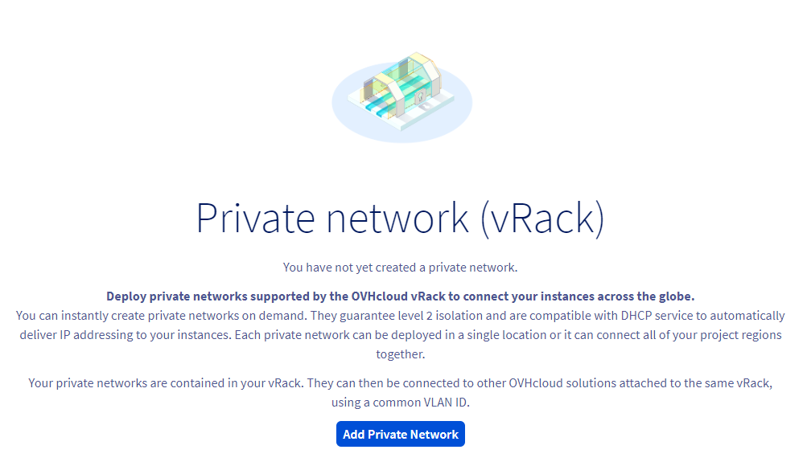
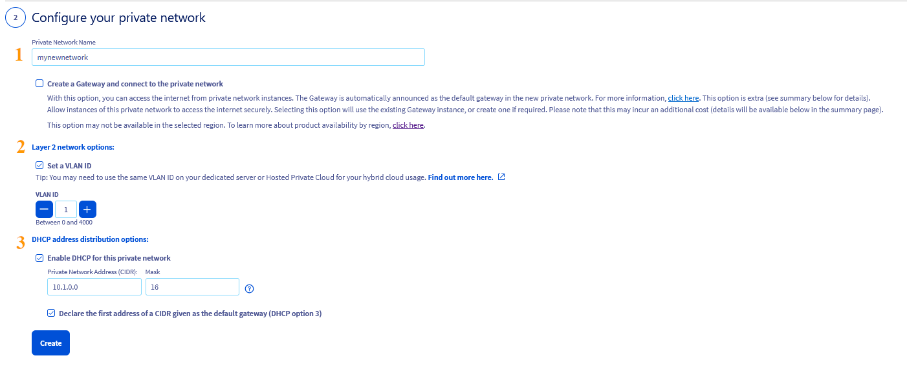
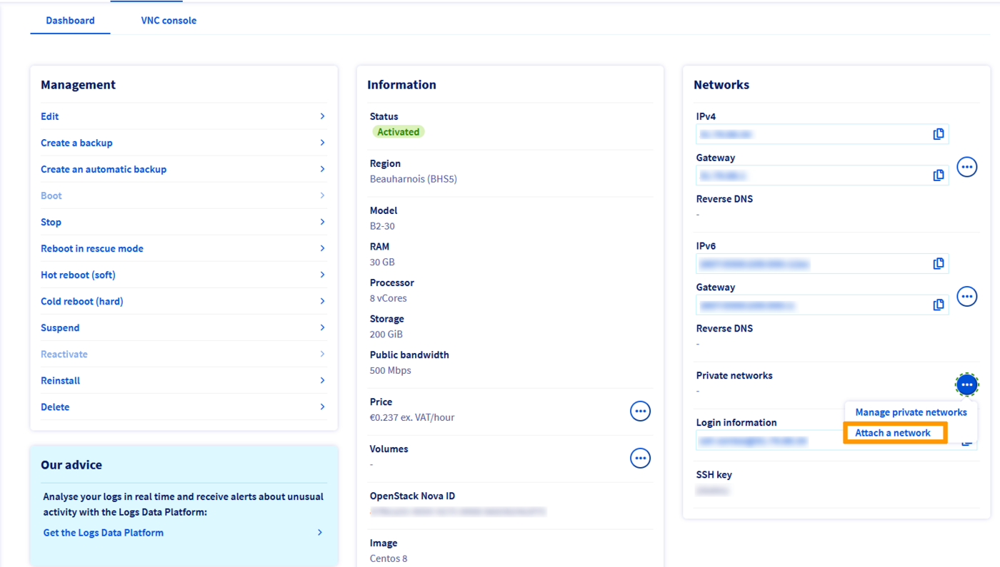
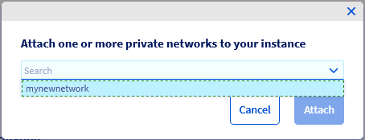

## Objective

The OVHcloud [vRack](https://www.ovh.com/asia/solutions/vrack) allows you to configure private network addressing between two or more OVHcloud [Dedicated Servers](/links/bare-metal/bare-metal). But it also allows you to add [Public Cloud instances](https://www.ovh.com/asia/public-cloud/instances/) to your private network so that you can create an infrastructure of both physical and virtual resources.

**This guide will show you how to configure private networking between a [Public Cloud instance](/pages/public_cloud/compute/public-cloud-first-steps) and a [Dedicated Server](/links/bare-metal/bare-metal).**

## Requirements

- An [OVHcloud Public Cloud instance](/pages/public_cloud/compute/public-cloud-first-steps)
- A [vRack](https://www.ovh.com/asia/solutions/vrack) service activated in your account
- A [Dedicated Server](/links/bare-metal/bare-metal){.external} compatible with the vRack
- Access to the [OVHcloud Control Panel](/links/manager)
- A private IP address range of your choice

> [!warning]
> This feature might be unavailable or limited on servers of the [**Eco** product line](https://eco.ovhcloud.com/asia/about/).
>
> Please visit our [comparison page](https://eco.ovhcloud.com/asia/compare/) for more information.

## Instructions

### Add a Public Cloud project to the vRack

> [!warning]
> If you do not have a vRack in your account, you need to [order one](/links/network/vrack) before proceeding. This service is free of charge.
>

Once your [Public Cloud project](/pages/public_cloud/compute/create_a_public_cloud_project) is set up, you will need to add it to the vRack.

Go to the `Bare Metal Cloud`{.action} menu, click on `Network`{.action} in the left tab, then on `vRack private network`{.action}. Select your vRack from the list.

From the list of eligible services, select the project you want to add to the vRack and then click on the `Add`{.action} button.

{.thumbnail}

### Integrating an instance into vRack

Two situations may arise:

- The instance does not exist yet.
- The instance already exists and you must attach a private network to it.

#### **In case of a new instance**

If you need assistance, follow this guide first: [Creating your first Public Cloud instance](/pages/public_cloud/compute/public-cloud-first-steps#create-instance). When creating an instance, you can choose, in Step 5, a network mode, followed by a private network to integrate your instance into.

#### **In case of an existing instance**

You can attach a private network to an existing instance.

Once your project is added to the vRack, you are ready to create private networks.

In the Public cloud tab, click on `Private Network`{.action} in the left-hand menu under **Network**.

{.thumbnail}

Click on the button `Add Private Network`{.action}. The following page allows you to customise multiple settings.

In step 1, select the region in which you want the private network to be located.

{.thumbnail}

For both services to communicate with each other, they have to be tagged with the same **VLAN ID**.

This can be configured in step 2.

{.thumbnail}

This step offers several configuration options. For the purpose of this guide, we will focus on the necessary ones. Click on the tabs below to view the details:

> [!tabs]
> **Private Network Name**
>>
>> Enter a name for your private network. 
>>
> **Layer 2 network options**
>>
>> By default, the VLAN ID for dedicated servers is **0**. To use this VLAN ID for an instance, it will be necessary to tag the private network with VLAN **0** as well.
>> Tick the **Set a VLAN ID** box and select VLAN ID **0**.
>>
>> If you do not tick the box, the system will assign a random VLAN ID number to your private network.
>>
>> If you already have an existing private network with VLAN ID 0, this box will be ticked by default and greyed out.
>> 
> **Using a different VLAN ID**
>>
>> If you do not intend use the VLAN ID **0**, you can select a different ID between 1 to 4000. The following rules apply:
>>
>> - The private network linked to the Public Cloud instance must be tagged with this VLAN ID.
>> - When configuring the vRack on the dedicated server, this VLAN ID should be included in the network configuration file.
>> 
>> [!primary]
>> For Public Cloud, you set a unique VLAN ID per private network. It is not possible to set the same VLAN ID on two different private networks.
>>
>> [!primary] 
>> Unlike dedicated servers (when using a VLAN ID other than 0), there is no need to include the VLAN ID directly in the network configuration file of the Public Cloud instance once it is set in the OVHcloud Control Panel.
>>
>> An example: If your instance private network is tagged with VLAN 2, this VLAN ID should be included in the network configuration of the dedicated server only. For more information consult the following guide: [Create multiple VLANs in the vRack](/pages/bare_metal_cloud/dedicated_servers/creating-multiple-vlans-in-a-vrack). 
>>
> **DHCP address distribution options**
>>
>> You can keep the default private IP range or use a different one.
>>

Once done, click on `Create`{.action}

In the corresponding instance dashboard, click on the `...`{.action} button in the box "Networks", next to "Private networks", and select `Attach a network`{.action}.

{.thumbnail}

In the popup window that appears, select the private network(s) to attach to your instance and click `Attach`{.action}.

{.thumbnail} 

### Configure your network interfaces

Next, configure the network interfaces on your new [Public Cloud instance](https://www.ovh.com/asia/public-cloud/instances/) and [Dedicated Server](/links/bare-metal/bare-metal) using this guide: [Configuring the vRack on your Dedicated Servers](/pages/bare_metal_cloud/dedicated_servers/vrack_configuring_on_dedicated_server).

## Go further

Join our [community of users](/links/community).