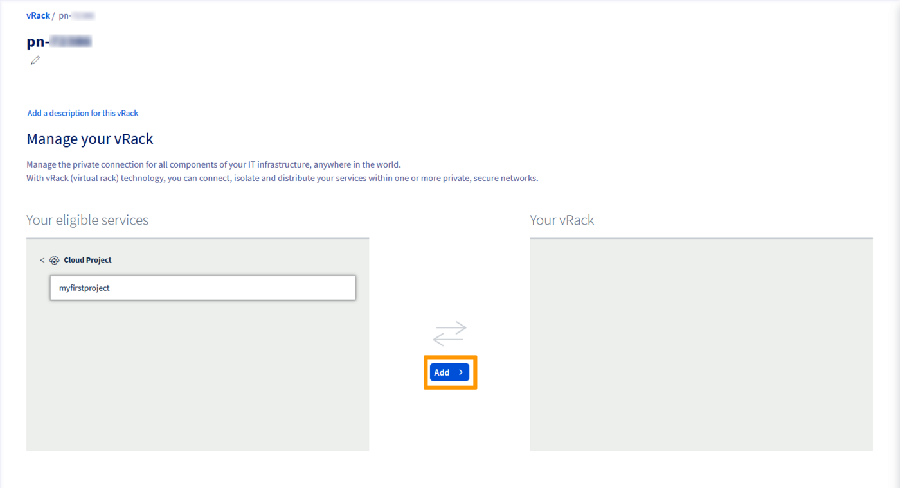

**Last updated 14th February 2023**

## Objective

The OVHcloud [vRack](https://www.ovh.com/world/solutions/vrack/) allows you to configure private network addressing between two or more OVHcloud [Dedicated Servers](https://www.ovhcloud.com/en/bare-metal/). But it also allows you to add [Public Cloud instances](https://www.ovhcloud.com/en/public-cloud/) to your private network so that you can create an infrastructure of both physical and virtual resources.

**This guide will show you how to configure private networking between a [Public Cloud instance](/pages/public_cloud/compute/public-cloud-first-steps#create-instance) and a [Dedicated Server](https://www.ovhcloud.com/en/bare-metal/).**

## Requirements

- An [OVHcloud Public Cloud instance](/pages/public_cloud/compute/public-cloud-first-steps)
- A [vRack](https://www.ovh.com/world/solutions/vrack/) service activated in your account
- A [Dedicated Server](https://www.ovhcloud.com/en/bare-metal/){.external} compatible with the vRack
- Access to the [OVHcloud Control Panel](https://ca.ovh.com/auth/?action=gotomanager&from=https://www.ovh.com/world/&ovhSubsidiary=we)
- A private IP address range of your choice

> [!warning]
> This feature might be unavailable or limited on servers of the [**Eco** product line](https://eco.ovhcloud.com/en/about/).
>
> Please visit our [comparison page](https://eco.ovhcloud.com/en/compare/) for more information.

## Instructions

### Add a Public Cloud project to the vRack

Once your [Public Cloud project](/pages/public_cloud/compute/create_a_public_cloud_project) is set up, you will need to add it to the vRack. This can be done in two ways:

1. By ordering a vRack service if you do not have one yet, this service is free of charge. 

Go to the `Bare Metal Cloud`{.action} menu and click on the `Order`{.action} button. Under this menu, click on `vRack`{.action}.

{.thumbnail}

You will be redirected to another page to validate the order, it will take a few minutes for the vRack to be setup in your account.

Once the vRack service is delivered to your account, you can now add your project to it.

Go to the `Bare Metal Cloud`{.action} menu, click on `Network`{.action}, then on `vRack`{.action}. Select your vRack from the list.

From the list of eligible services, select the project you want to add to the vRack and then click on the `Add`{.action} button.

{.thumbnail}

<ol start="2">
  <li>By <a href="/pages/public_cloud/public_cloud_network_services/getting-started-07-creating-vrack#instructions_1">creating or adding an existing vRack service</a> in the Public Cloud section.</li>
</ol>

### Add an Instance to the vRack 

Two situations may arise:

- The instance does not exist yet.
- The instance already exists and you must add it to the vRack.

#### In case of a new instance

If you need assistance, follow this guide first: [Creating your first Public Cloud instance](/pages/public_cloud/compute/public-cloud-first-steps#create-instance). When creating an instance, you can specify, in Step 4, a private network to integrate your instance into. Choose your previously created vRack from the drop-down menu.

#### In case of an existing instance

You can attach an existing instance to a private network. For more information, please refer to [this section](/pages/public_cloud/public_cloud_network_services/getting-started-07-creating-vrack#cases-of-an-already-existing-instance) of the corresponding guide.

### Create a VLAN ID

For both services to communicate with each other, they have to be tagged with the same **VLAN ID**. 

#### Using the default VLAN ID

By default, the VLAN ID for dedicated servers is **0**. To use this VLAN ID, it will be necessary to tag the private network linked to your instance with VLAN **0**. To do this, you will need to go through the [OVHcloud APIv6](/pages/public_cloud/public_cloud_network_services/getting-started-08-creating-vrack-with-api#step-3-creating-a-vlan-in-the-vrack).

> [!primary]
> For Public Cloud, you set a unique VLAN ID per private network.
> 
> It is not possbile to set the same VLAN ID on two different private networks.

#### Using a different VLAN ID

To use a different VLAN ID:

- The private network linked to the Public Cloud instance must be tagged with this VLAN ID.
- In the network configuration file on the dedicated server, the private network interface should be tagged with this VLAN ID.

In this case, if you tick the `Set a VLAN ID` box, you will need to choose a VLAN ID number between 2 and 4,000.

If you do not tick the box, the system will assign a random VLAN ID number to your private network.

> [!primary]
> 
> Unlike dedicated servers, there is no need to tag a VLAN directly in the network configuration file of the Public Cloud instance, once the VLAN ID is set in the OVHcloud Control Panel.
>

An example: If your instance private network is tagged with VLAN 2, the private network interface on your dedicated server should be tagged with VLAN 2. For more information consult the following guide: [Create multiple VLANs in the vRack](/pages/bare_metal_cloud/dedicated_servers/creating-multiple-vlans-in-a-vrack).

### Configure your network interfaces

Next, configure the network interfaces on your new [Public Cloud instance](/pages/public_cloud/compute/public-cloud-first-steps#create-instance) and [Dedicated Server](https://www.ovhcloud.com/en/bare-metal/) using this guide: [Configuring the vRack on your Dedicated Servers](/pages/bare_metal_cloud/dedicated_servers/vrack_configuring_on_dedicated_server).

## Go further

Join our community of users on <https://community.ovh.com/en/>.
