<style>
details>summary {
	color:rgb(33, 153, 232) !important;
	cursor: pointer;
}
details>summary::before {
	content:'\25B6';
	padding-right:1ch;
}
details[open]>summary::before {
	content:'\25BC';
}
</style>

## Wprowadzenie

[vRack](/links/network/vrack) OVHcloud to prywatna sieć, która umożliwia konfigurację adresowania między dwoma lub kilkoma [Serwerami dedykowanymi](/links/bare-metal/bare-metal) OVHcloud. Umożliwia ponadto dodawanie [instancji Public Cloud](/links/public-cloud/compute) do Twojej prywatnej sieci w celu utworzenia infrastruktury z zasobów fizycznych i wirtualnych.

**Niniejszy przewodnik wyjaśnia, jak skonfigurować sieć prywatną między [instancją Public Cloud](/pages/public_cloud/compute/public-cloud-first-steps) a [serwerem dedykowanym](/links/bare-metal/bare-metal).**

## Wymagania początkowe

* Utworzenie [instancji Public Cloud](/pages/public_cloud/compute/public-cloud-first-steps)
* Aktywowanie usługi [vRack](/links/network/vrack)
* Posiadanie [serwera dedykowanego](/links/bare-metal/bare-metal) kompatybilnego z usługą vRack
* Wybrany zakres prywatnych adresów IP
* Obie usługi muszą znajdować się w tym samym vRack.

<!-- CP-NAV-START:publiccloud-projects -->
---

### Dostęp do Panelu klienta OVHcloud

- **Link bezpośredni:** [Public Cloud Projects](/links/control-panel/publiccloud-projects)
- **Ścieżka nawigacji:** `Public Cloud`{.action} > Wybierz projekt

---
<!-- CP-NAV-END:publiccloud-projects -->

> [!warning]
> Funkcja ta może być niedostępna lub ograniczona na [serwerach dedykowanych **Eco**](/links/bare-metal/eco-about).
>
> Aby uzyskać więcej informacji, zapoznaj się z naszym [porównaniem](/links/bare-metal/eco-compare).


## W praktyce

### Dodaj projekt Public Cloud do sieci vRack

> [!primary]
> Nie dotyczy to nowo utworzonych projektów, które są automatycznie dostarczane z siecią vRack. Aby wyświetlić usługę vRack po utworzeniu projektu, otwórz menu `Sieć`{.action} na lewym pasku bocznym i kliknij na `Prywatna sieć vRack`{.action}.
>
> Możesz również usunąć przypisany projekt z sieci vRack i przypisać go do innej sieci vRack, jeśli chcesz, zwłaszcza jeśli posiadasz już istniejący vRack na swoim (swoich) serwerze(ach) dedykowanym(ych).

Na liście dostępnych usług zaznacz projekt, który chcesz dodać do szafy vRack, następnie kliknij przycisk `Dodaj`{.action}.

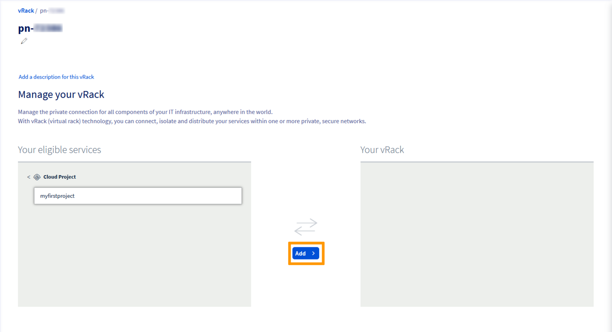{.thumbnail}

### Zintegruj instancję z usługą vRack

> [!primary]
> Ten przewodnik opisuje prosty sposób konfiguracji sieci vRack między instancją Public Cloud a serwerem dedykowanym.
> Jeśli wdrożyłeś swoje instancje z trybem wdrażania takim jak strefy lokalne lub multi AZ, pamiętaj, że strefy lokalne nie obsługują jeszcze vRack.
> Ponadto **vRack** to globalna sieć L2 i nie obsługuje odporności na poziomie "strefy" lub "regionu".
>

Mogą wystąpić dwie sytuacje:

- Instancja jeszcze nie istnieje.
- Instancja już istnieje i należy ją dodać do sieci vRack.

#### Przypadki nowej instancji

Jeśli potrzebujesz pomocy, zapoznaj się z przewodnikiem [Tworzenie instancji Public Cloud](/pages/public_cloud/compute/public-cloud-first-steps). Podczas tworzenia instancji możesz w etapie 5 określić sieć prywatną, do której chcesz zintegrować Twoją instancję.

#### Przypadki istniejącej instancji

Po połączeniu projektu z vRack możesz utworzyć sieć prywatną i przypisać ją do istniejących instancji.

W karcie `Public Cloud`{.action} kliknij `Private Network`{.action} w menu po lewej stronie, pod **Network**.

Kliknij przycisk `Utwórz prywatną sieć`{.action}.

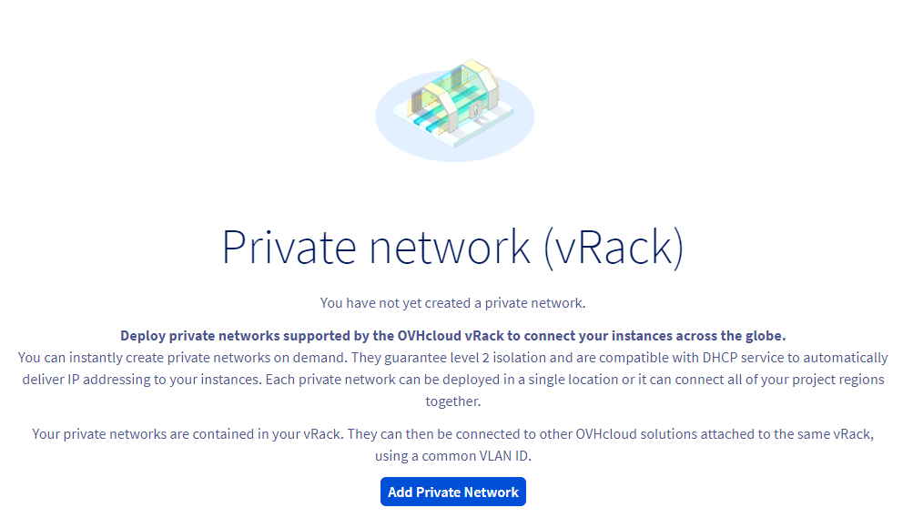{.thumbnail}

Na następnej stronie możesz spersonalizować wiele ustawień.

W etapie 1 wybierz regiony, w którym chcesz umieścić sieć prywatną. Upewnij się, że znajduje się ona w tym samym regionie co istniejąca instancja.

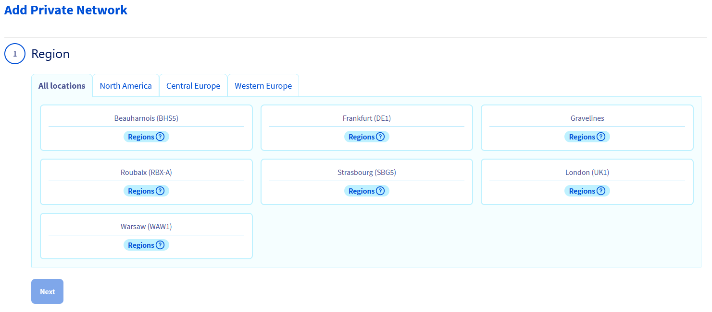{.thumbnail}

Aby obie usługi mogły się ze sobą komunikować, muszą mieć "tagi" tego samego **VLAN ID**.

Można go skonfigurować w etapie 2.

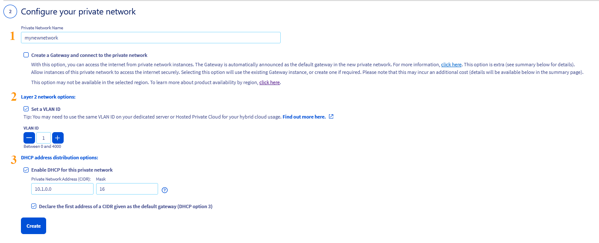{.thumbnail}

Ten etap oferuje kilka opcji konfiguracji. Na potrzeby tego przewodnika skupimy się na niezbędnych elementach. Kliknij poniższe zakładki, aby wyświetlić szczegółowe informacje:

> [!tabs]
> **Nazwa sieci prywatnej**
>>
>> Wprowadź nazwę sieci prywatnej.<br>
>>
> **Opcje sieciowe warstwy 2**
>>
>> Domyślnie VLAN ID dla serwerów dedykowanych to **0**. Aby użyć tego identyfikatora VLAN dla instancji, konieczne będzie oznaczenie prywatnej sieci VLAN **0** również.
>> Zaznacz pole wyboru **Set a VLAN ID** i wybierz VLAN ID **0**.
>>
>> Jeśli nie zaznaczysz tego pola, system przypisze losowy numer identyfikacyjny VLAN do Twojej prywatnej sieci.
>>
> **Korzystanie z innego identyfikatora VLAN**
>>
>> Jeśli nie zamierzasz korzystać z VLAN ID **0**, możesz wybrać inny identyfikator z zakresu od 1 do 4000. W takim przypadku:
>>
>> - Podczas konfigurowania sieci vRack na serwerze dedykowanym, ten identyfikator sieci VLAN musi być zawarty w pliku konfiguracji sieci.
>>
>> > [!primary]
>> > Możliwe jest użycie tego samego VLAN ID dla wielu sieci prywatnych, jednak wymaga to starannego zarządzania prywatnymi adresami IP. Użycie niekolidujących alokacji puli DHCP to jeden ze sposobów rozwiązania tego problemu.
>> >
>>
>> > [!primary]
>> > W przeciwieństwie do serwerów dedykowanych (gdy używany jest VLAN ID inny niż 0), nie jest konieczne bezpośrednie uwzględnianie VLAN ID w pliku konfiguracji sieci instancji Public Cloud po jego skonfigurowaniu w Panelu klienta OVHcloud.
>> >
>>
>> Przykład: jeśli prywatna sieć instancji jest "oznaczona" VLAN 2, ten VLAN ID musi być zawarty w konfiguracji sieci tylko serwera dedykowanego. Więcej informacji znajdziesz w przewodniku: [Tworzenie wielu sieci VLAN w sieci vRack](/pages/bare_metal_cloud/dedicated_servers/creating-multiple-vlans-in-a-vrack).
>>
> **Opcje dystrybucji adresów DHCP**
>>
>> Możesz zachować domyślny zakres prywatnych adresów IP lub użyć innego zakresu.
>>
>> Wybierz opcję "Włącz DHCP dla tej prywatnej sieci", aby automatycznie przypisać i skonfigurować prywatny adres IP na instancji. Będzie wtedy potrzebne jedynie skonfigurowanie interfejsów sieciowych serwera dedykowanego.
>>
>> Gdy ta opcja nie jest zaznaczona, wymagana jest ręczna konfiguracja zarówno instancji Public Cloud, jak i serwera dedykowanego.
>>
>> **Opcje bramy sieciowej**
>>
>> Upewnij się, że obie opcje są odznaczone.
>>

Po zakończeniu konfiguracji kliknij przycisk `Skonfiguruj prywatną sieć`{.action}. Może to potrwać kilka minut.

W dashboardzie odpowiedniej instancji znajdź sekcję "Sieć" i kliknij przycisk `...`{.action} obok "Sieci prywatne". Wybierz `Przypisz sieć`{.action}.

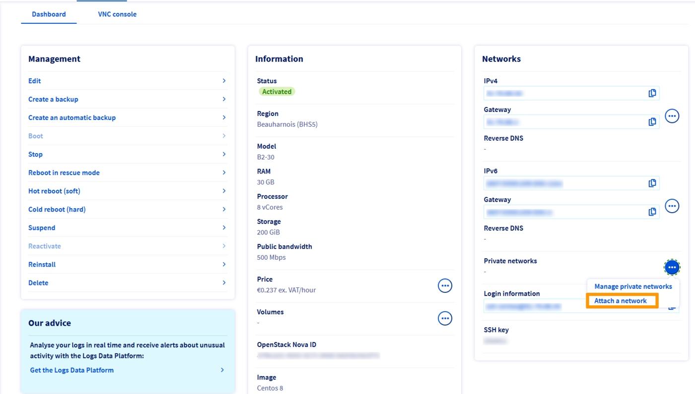{.thumbnail}

W oknie, które się pojawi, wybierz prywatną sieć lub sieci, które chcesz przypisać do swojej instancji i kliknij przycisk `Przypisz`{.action}.

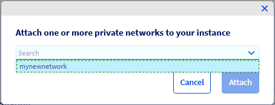{.thumbnail}

### Konfiguracja interfejsów sieciowych

> [!primary]
> Jeśli wybrałeś opcję konfiguracji sieci prywatnej na instancji przy użyciu DHCP, musisz skonfigurować tylko interfejsy sieciowe na serwerze dedykowanym.
>

#### Konfiguracja w przypadku używania domyślnego VLAN ID 0

Przed rozpoczęciem połącz się z serwerem przez SSH i wyświetl swoje interfejsy sieciowe za pomocą następującego polecenia:

```bash
ip a
```

W przypadku serwerów dedykowanych znajdź linię rozpoczynającą się od ```link ether``` i sprawdź, czy ten interfejs odpowiada interfejsowi **Prywatny** wymienionemu w zakładce `Interfejsy sieciowe`{.action} w panelu zarządzania serwerem.

Użyj tej nazwy interfejsu, aby zastąpić `NETWORK_INTERFACE` w poniższych konfiguracjach (przykład: `eth1`).

Na przykład użyjemy zakresu adresów IP `192.168.0.0/16` (**Maska podsieci**: `255.255.0.0`).

> [!tabs]
> **Debian 11**
>>
>> Za pomocą wybranego edytora tekstu otwórz plik konfiguracyjny sieci znajdujący się w `/etc/network/interfaces.d`, aby go edytować. Tutaj plik nazywa się `50-cloud-init`.
>>
>> ```bash
>> sudo nano /etc/network/interfaces.d/50-cloud-init
>> ```
>>
>> Dodaj następujące wiersze do istniejącej konfiguracji, zastępując `NETWORK_INTERFACE`, `IP_ADDRESS` i `NETMASK` swoimi wartościami:
>>
>> ```console
>> auto NETWORK_INTERFACE
>> iface NETWORK_INTERFACE inet static
>>    address IP_ADDRESS
>>    netmask NETMASK
>>```
>>
>> **Przykład:**
>>
>> 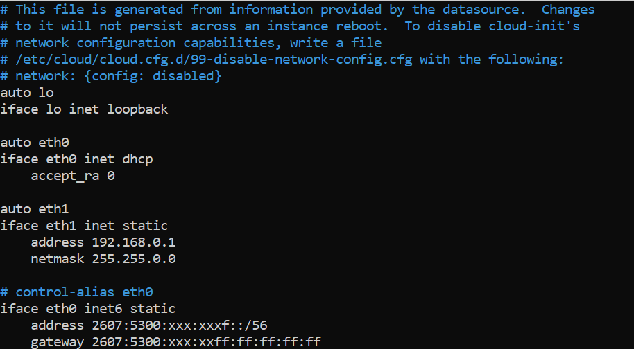{.thumbnail}
>>
>> Zapisz zmiany w pliku konfiguracyjnym i zamknij edytor.
>>
>> Uruchom ponownie usługę sieciową, aby zastosować konfigurację:
>>
>> ```bash
>> sudo systemctl restart networking
>> ```
>>
> **Ubuntu i Debian 12+**
>>
>> Za pomocą wybranego edytora tekstu otwórz plik konfiguracyjny sieci znajdujący się w `/etc/netplan/`, aby go edytować. Tutaj plik nazywa się `50-cloud-init.yaml`.
>>
>> ```bash
>> sudo nano /etc/netplan/50-cloud-init.yaml
>> ```
>>
>> Dodaj następujące wiersze do istniejącej konfiguracji po linii `version: 2`. Zastąp `NETWORK_INTERFACE` i `IP_ADDRESS/PREFIX` swoimi wartościami.
>>
>> ```yaml
>>    ethernets:
>>        NETWORK_INTERFACE:
>>            dhcp4: false
>>            addresses:
>>              - IP_ADDRESS/PREFIX
>> ```
>>
>> **Przykład:**
>>
>> 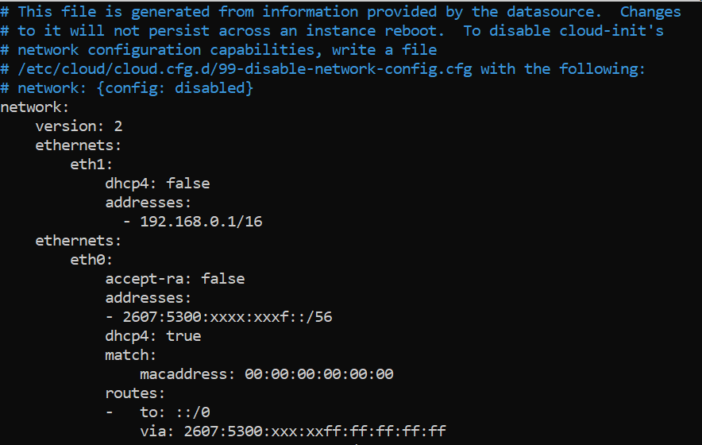{.thumbnail}
>>
>> > [!warning]
>> >
>> > Ważne jest przestrzeganie wyrównania każdego elementu w plikach `yaml`, jak pokazano w powyższym przykładzie. Nie używaj klawisza Tab do tworzenia odstępów. Używaj tylko klawisza spacji.
>> >
>>
>> Zapisz zmiany w pliku konfiguracyjnym i zamknij edytor.
>>
>> Zastosuj konfigurację:
>>
>> ```bash
>> sudo netplan apply
>> ```
>>
> **AlmaLinux i Rocky Linux (8/9)**
>>
>> Po zidentyfikowaniu interfejsu sieci prywatnej użyj następującego polecenia, aby utworzyć plik konfiguracyjny sieci.
>>
>> Zastąp `NETWORK_INTERFACE` nazwą interfejsu prywatnego.
>>
>> ```bash
>> sudo touch /etc/sysconfig/network-scripts/ifcfg-NETWORK_INTERFACE
>> ```
>>
>> Na przykład, jeśli interfejs prywatny nazywa się `eth1`, mamy następujące:
>>
>> ```bash
>> sudo touch /etc/sysconfig/network-scripts/ifcfg-eth1
>> ```
>>
>> Następnie użyj wybranego edytora tekstu, aby edytować ten plik.
>>
>> ```bash
>> sudo nano /etc/sysconfig/network-scripts/ifcfg-eth1
>> ```
>>
>> Dodaj te wiersze, zastępując `NETWORK_INTERFACE`, `IP_ADDRESS` i `NETMASK` swoimi wartościami:
>>
>> ```console
>> DEVICE=NETWORK_INTERFACE
>> BOOTPROTO=static
>> IPADDR=IP_ADDRESS
>> NETMASK=NETMASK
>> ONBOOT=yes
>> TYPE=Ethernet
>> ```
>>
>> **Przykład:**
>>
>> 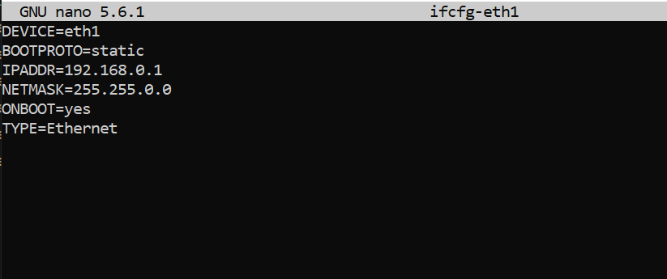{.thumbnail}
>>
>> Zapisz zmiany w pliku konfiguracyjnym i zamknij edytor.
>>
>> Uruchom ponownie usługę sieciową, aby zastosować zmiany:
>>
>> ```bash
>> sudo systemctl restart NetworkManager
>> ```
>>
> **Fedora 42+, AlmaLinux i Rocky Linux (10)**
>>
>> Po zidentyfikowaniu nazwy interfejsu prywatnego uruchom następujące polecenie, aby sprawdzić, czy jest on podłączony. W naszym przykładzie nasz interfejs nazywa się `eno2`:
>>
>> ```bash
>> $ nmcli device status
>>
>> DEVICE           TYPE      STATE                   CONNECTION
>> eno1             ethernet  connected               cloud-init eno1
>> lo               loopback  connected (externally)  lo
>> eno2             ethernet  disconnected            --
>> ```
>>
>> Jeśli `STATE` urządzenia `DEVICE` wyświetla się jako `disconnected`, należy je podłączyć przed skonfigurowaniem adresu IP.
>>
>> Podczas dodawania połączenia **ethernet** musimy utworzyć profil konfiguracyjny, który następnie przypisujemy do urządzenia.
>>
>> Uruchom następujące polecenie, zastępując `INTERFACE_NAME` i `CONNECTION_NAME` swoimi wartościami.
>>
>> W naszym przykładzie nazwaliśmy nasz profil konfiguracyjny `private-interface`.
>>
>> ```bash
>> nmcli connection add type ethernet con-name CONNECTION_NAME ifname INTERFACE_NAME
>> ```
>>
>> **Przykład:**
>>
>> ```bash
>> nmcli connection add type ethernet con-name private-interface ifname eno2
>> ```
>>
>> Sprawdź, czy interfejs został poprawnie podłączony:
>>
>> ```bash
>> $ nmcli device status
>>
>> DEVICE           TYPE      STATE                   CONNECTION
>> eno1             ethernet  connected               cloud-init eno1
>> eno2             ethernet  connected               private-interface
>> lo               loopback  connected (externally)  lo
>> ```
>>
>> Po wykonaniu tej czynności zostanie utworzony nowy plik konfiguracyjny o nazwie *xxxxxxxxxx.nmconnection* w folderze `/etc/NetworkManager/system-connections`.
>>
>> ```bash
>> [user@server ~]$ cd /etc/NetworkManager/system-connections
>> [user@server system-connections]$ ls
>> cloud-init-eno1.nmconnection  private-interface.nmconnection
>> ```
>>
>> Następnie możesz edytować ten plik za pomocą narzędzia `nmcli`, zastępując `IP_ADDRESS`, `PREFIX` i `CONNECTION_NAME` swoimi wartościami.
>>
>> - Dodaj swój adres IP:
>>
>> ```bash
>> nmcli connection modify CONNECTION_NAME IPv4.address IP_ADDRESS/PREFIX
>> ```
>>
>> **Przykład:**
>>
>> ```bash
>> nmcli connection modify private-interface IPv4.address 192.168.0.1/16
>> ```
>>
>> - Zmień konfigurację z **auto** na **manual**:
>>
>> ```bash
>> sudo nmcli connection modify CONNECTION_NAME IPv4.method manual
>> ```
>>
>> **Przykład:**
>>
>> ```bash
>> sudo nmcli connection modify private-interface IPv4.method manual
>> ```
>>
>> - Ustaw konfigurację jako trwałą:
>>
>> ```bash
>> sudo nmcli con mod CONNECTION_NAME connection.autoconnect true
>> ```
>>
>> **Przykład:**
>>
>> ```bash
>> sudo nmcli con mod private-interface connection.autoconnect true
>> ```
>>
>> Uruchom ponownie sieć za pomocą następującego polecenia:
>>
>> ```bash
>> sudo systemctl restart NetworkManager
>> ```
>>
> **Konfiguracja Windows**
>>
>> Zaloguj się do serwera Windows przez zdalny pulpit i przejdź do **Panelu sterowania**.
>>
>> {.thumbnail}
>>
>> Kliknij na `Network and Internet`{.action}.
>>
>> {.thumbnail}
>>
>> Otwórz `Network and Sharing Center`{.action}.
>>
>> {.thumbnail}
>>
>> Kliknij na `Change Adapter Settings`{.action}.
>>
>> {.thumbnail}
>>
>> Kliknij prawym przyciskiem myszy na pomocniczy interfejs sieciowy, a następnie kliknij `Properties`{.action}.
>>
>> Zauważ, że w naszym przykładzie `Ethernet 2` jest interfejsem używanym do vRack. Możliwe jest jednak, że karta sieciowa vRack używa innego interfejsu w Twojej konfiguracji. Wybierz interfejs, który nie ma głównego adresu IP serwera lub który ma automatycznie przypisany adres IP.
>>
>> {.thumbnail}
>>
>> Kliknij dwukrotnie na `Internet Protocol Version 4 (TCP/IPv4)`{.action}.
>>
>> {.thumbnail}
>>
>> Kliknij na **Use the following IP address**. Wprowadź dowolny **adres IP** z Twojego zakresu prywatnego i odpowiednią **maskę podsieci** (`255.255.0.0` w tym przykładzie) w odpowiednie pola.
>>
>> {.thumbnail}
>>
>> Kliknij na `OK`{.action}, aby zapisać zmiany i uruchom ponownie serwer, aby je zastosować.

/// details | **Konfiguracja w przypadku używania innego identyfikatora VLAN**

W tym przykładzie użyjemy **10** jako identyfikatora VLAN (tag) oraz **192.168.0.0/16** jako zakresu prywatnych adresów IP.

> [!tabs]
> **Debian 11**
>>
>> Poniższa konfiguracja jest oparta na Debian 11 (Bullseye).
>>
>> - Przed rozpoczęciem nawiąż połączenie SSH z serwerem i uruchom następujące polecenia, aby zainstalować pakiet VLAN:
>>
>> ```sh
>> sudo apt update
>> sudo apt install vlan
>> ```
>>
>> - Następnie załaduj moduł jądra 8021q:
>>
>> ```sh
>> sudo modprobe 8021q
>> ```
>>
>> - Aby sprawdzić, czy moduł jest załadowany:
>>
>> ```sh
>> user@server:~$ lsmod | grep 8021q
>> 8021q                  40960  0
>> garp                   16384  1 8021q
>> mrp                    20480  1 8021q
>> ```
>>
>> - Uruchom następujące polecenie, aby zapewnić trwałe ładowanie modułów podczas rozruchu:
>>
>> ```sh
>> sudo su -c 'echo "8021q" >> /etc/modules'
>> ```
>>
>> - Pobierz nazwy interfejsów i zidentyfikuj interfejs prywatny:
>>
>> ```sh
>> ip a
>> ```
>>
>> W tym przykładzie interfejs sieci prywatnej jest identyfikowany jako `eno2`.
>>
>> - Następnie utwórz podinterfejs VLAN dla interfejsu sieciowego (konfiguracja nietrwała) i przypisz (oznacz) mu identyfikator VLAN. W tym przykładzie identyfikator VLAN to 10.
>>
>> Zastąp wartości swoimi własnymi.
>>
>> ```sh
>> sudo ip link add link eno2 name eno2.10 type vlan id 10
>> ```
>>
>> - Następnie przypisz prywatny adres IP do nowo utworzonego podinterfejsu VLAN:
>>
>> ```sh
>> sudo ip addr add 192.168.0.14/16 dev eno2.10
>> ```
>>
>> - Następnie aktywuj interfejs prywatny i podinterfejs VLAN:
>>
>> ```sh
>> sudo ip link set dev eno2 up
>> sudo ip link set dev eno2.10 up
>> ```
>>
>> - Aby konfiguracja była trwała, dodaj następujące wpisy do pliku konfiguracyjnego:
>>
>> ```sh
>> sudo nano /etc/network/interfaces.d/50-cloud-init
>> ```
>>
>> ```console
>> auto eno2.10
>> iface eno2.10 inet static
>>    address 192.168.0.14
>>    netmask 255.255.0.0
>>    broadcast 192.168.255.255
>>    vlan-raw-device eno2
>> ```
>>
>> - Przegląd:
>>
>> 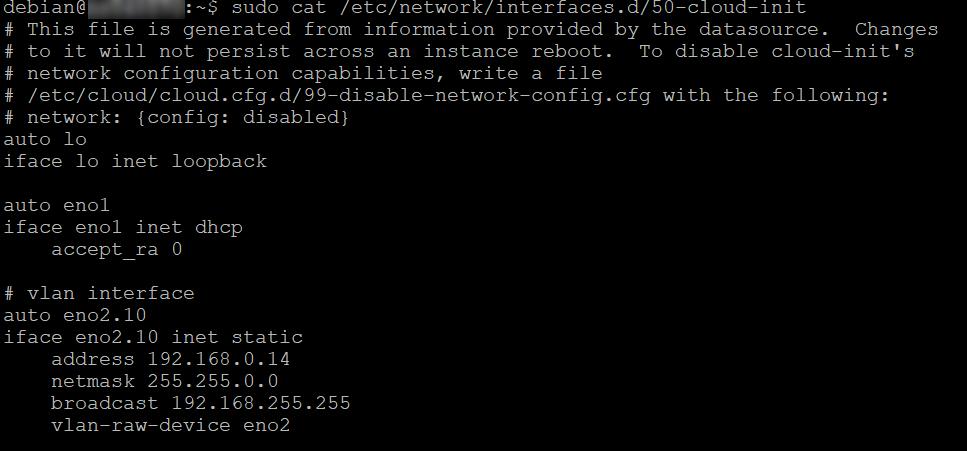{.thumbnail}
>>
>> - Uruchom ponownie sieć, aby zastosować zmiany:
>>
>> ```sh
>> sudo systemctl restart networking
>> ```
>>
> **Ubuntu i Debian 12+**
>>
>> Poniższa konfiguracja jest oparta na Ubuntu 24.04 (Noble Numbat).
>>
>> - Przed rozpoczęciem nawiąż połączenie SSH z serwerem i uruchom następujące polecenie, aby zainstalować pakiet VLAN:
>>
>> ```sh
>> sudo apt update
>> sudo apt install vlan
>> ```
>>
>> - Następnie załaduj moduł jądra 8021q:
>>
>> ```sh
>> sudo modprobe 8021q
>> ```
>>
>> - Aby sprawdzić, czy moduł jest załadowany:
>>
>> ```sh
>> user@server:~$ lsmod | grep 8021q
>> 8021q                  40960  0
>> garp                   16384  1 8021q
>> mrp                    20480  1 8021q
>> ```
>>
>> - Uruchom następujące polecenie, aby zapewnić trwałe ładowanie modułów podczas rozruchu:
>>
>> ```sh
>> sudo su -c 'echo "8021q" >> /etc/modules'
>> ```
>>
>> - Utwórz lub edytuj plik konfiguracyjny `cloud.cfg`, aby zapobiec automatycznym zmianom w konfiguracji sieci:
>>
>> ```sh
>> sudo nano /etc/cloud/cloud.cfg.d/99-disable-network-config.cfg
>> ```
>>
>> - Dodaj tę linię:
>>
>> ```sh
>> network: {config: disabled}
>> ```
>>
>> Zapisz i zamknij plik.
>>
>> - Aby uzyskać nazwę interfejsu sieciowego i jego adres MAC:
>>
>> ```sh
>> ip a
>> ```
>>
>> - Tutaj interfejs, który chcemy skonfigurować, to `eno2` z adresem MAC: `d0:50:99:d6:6b:14`.
>>
>> 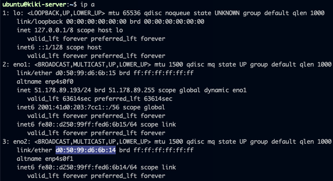{.thumbnail}
>>
>> - Dodaj konfigurację sieci dla tego interfejsu i deklarację VLAN do pliku konfiguracyjnego, upewniając się, że jest umieszczona bezpośrednio pod linią `version: 2`. Zastąp wartości swoimi własnymi:
>>
>> ```sh
>> sudo nano /etc/netplan/50-cloud-init.yaml
>> ```
>>
>> ```yaml
>> network:
>>     version: 2
>>     ethernets:
>>         eno2:
>>              match:
>>                macaddress: d0:50:99:d6:6b:14
>>     vlans:
>>         vlan10:
>>             id: 10                          # VLAN ID
>>             link: eno2                  # Nazwa interfejsu
>>             addresses:
>>             - 192.168.0.14/16
>> ```
>>
>> - Przegląd:
>>
>> 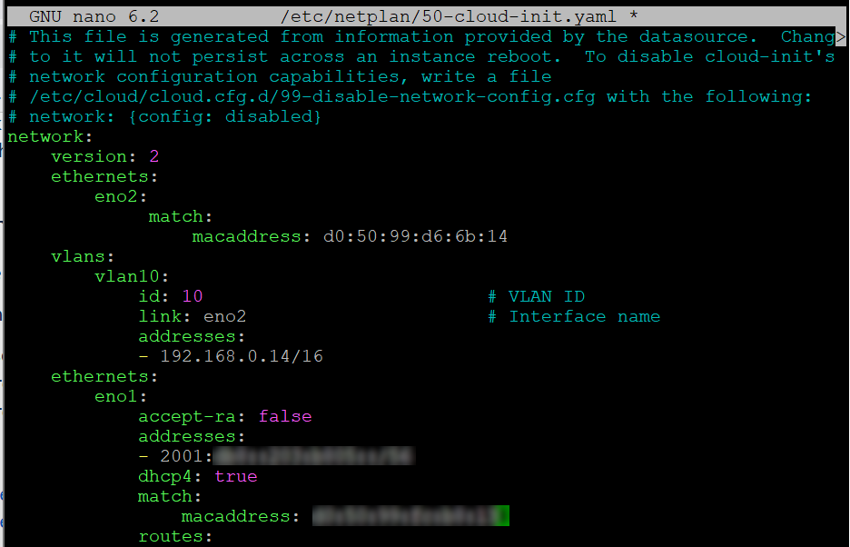{.thumbnail}
>>
>> - Zapisz i zamknij plik, a następnie uruchom następujące polecenie:
>>
>>
>> ```sh
>> sudo netplan apply
>> ```
>>
>> - Jeśli otrzymasz następujący komunikat:
>>
>> ```console
>> WARNING:root:Cannot call Open vSwitch: ovsdb-server.service is not running.
>> ```
>>
>> - Możesz rozwiązać ten problem, instalując następujący pakiet:
>>
>> ```sh
>> sudo apt install openvswitch-switch
>> ```
>>
>> - Sprawdź, czy konfiguracja została prawidłowo zastosowana:
>>
>> ```sh
>> ip a
>> ```
>>
> **AlmaLinux i Rocky Linux (8/9)**
>>
>> Poniższa konfiguracja jest oparta na Almalinux 9.
>>
>> - Przed rozpoczęciem nawiąż połączenie SSH z serwerem i uruchom następujące polecenie, aby załadować moduł jądra 8021q:
>>
>> ```sh
>> sudo modprobe 8021q
>> ```
>>
>> - Aby sprawdzić, czy moduł jest załadowany:
>>
>> ```sh
>> user@server:~$ lsmod | grep 8021q
>> 8021q                  40960  0
>> garp                   16384  1 8021q
>> mrp                    20480  1 8021q
>> ```
>>
>> - Uruchom następujące polecenie, aby zapewnić trwałe ładowanie modułów podczas rozruchu:
>>
>> ```sh
>> sudo su -c 'echo "8021q" >> /etc/modules'
>> ```
>>
>> - Pobierz nazwy interfejsów i zidentyfikuj interfejs prywatny:
>>
>> ```sh
>> ip a
>> ```
>>
>> W tym przykładzie interfejs prywatny to `eno2`.
>>
>> - Następnie utwórz plik konfiguracyjny podinterfejsu dla VLAN w głównym pliku konfiguracyjnym sieci. W tym przykładzie plik nosi nazwę `ifcfg-eno2.10`, gdzie eno2 odnosi się do interfejsu sieci prywatnej, a `10` do identyfikatora VLAN.
>>
>> ```sh
>> sudo nano /etc/sysconfig/network-scripts-ifcfg-eno2.10
>> ```
>>
>> - Dodaj następujące wpisy do pliku konfiguracyjnego. Zastąp wartości swoimi własnymi.
>>
>> ```console
>> TYPE=Vlan
>> PHYSDEV=eno2
>> VLAN_ID=10
>> BOOTPROTO=none
>> IPADDR=192.168.0.14
>> PREFIX=16
>> NAME=eno2.10
>> DEVICE=eno2.10
>> ONBOOT=yes
>> VLAN=yes
>> ```
>>
>> - Zapisz i zamknij plik.
>>
>> - Przegląd:
>>
>> 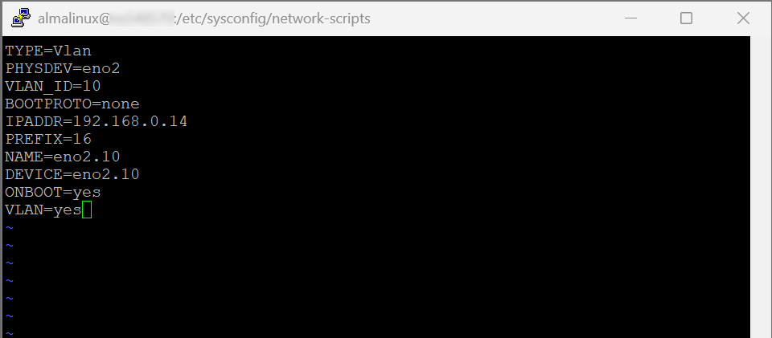{.thumbnail}
>>
>> - Uruchom ponownie interfejs sieciowy:
>>
>> ```sh
>> sudo systemctl restart NetworkManager
>> ```
>>
> **Fedora 42+, AlmaLinux i Rocky Linux (10)**
>>
>> Poniższa konfiguracja jest oparta na Fedora 43.
>>
>> - Przed rozpoczęciem nawiąż połączenie SSH z serwerem i uruchom następujące polecenie, aby załadować moduł jądra 8021q:
>>
>> ```sh
>> sudo modprobe 8021q
>> ```
>>
>> - Aby sprawdzić, czy moduł jest załadowany:
>>
>> ```sh
>> user@server:~$ lsmod | grep 8021q
>> 8021q                  40960  0
>> garp                   16384  1 8021q
>> mrp                    20480  1 8021q
>> ```
>>
>> - Uruchom następujące polecenie, aby zapewnić trwałe ładowanie modułów podczas rozruchu:
>>
>> ```sh
>> sudo su -c 'echo "8021q" >> /etc/modules'
>> ```
>>
>> - Aby uzyskać nazwę interfejsu sieciowego:
>>
>> ```sh
>> ip a
>> ```
>>
>> W tym przykładzie interfejs nazywa się `eno2`. Musimy utworzyć podinterfejs VLAN przed przypisaniem mu prywatnego adresu IP.
>>
>> - Użyj następującego polecenia, aby utworzyć interfejs VLAN:
>>
>> ```sh
>> sudo nmcli con add type vlan con-name <vlan-name> dev <parent-interface> id <vlan-id>.
>> ```
>>
>> Zastąp `vlan-name` nazwą podinterfejsu VLAN, `parent-interface` nazwą interfejsu prywatnego, a `vlan-id` identyfikatorem VLAN.
>>
>> **W tym przykładzie:**
>>
>> ```sh
>> sudo nmcli con add type vlan con-name eno2.10 dev eno2 id 10
>> Connection 'eno2.10' successfully added.
>> ```
>>
>> - Przypisz prywatny adres IP do podinterfejsu VLAN:
>>
>> ```sh
>> sudo nmcli con mod <vlan-name> ipv4.addresses <ip/prefix> ipv4.method manual
>> ```
>>
>> **W tym przykładzie:**
>>
>> ```sh
>> sudo nmcli con mod eno2.10 ipv4.addresses 192.168.0.14/16 ipv4.method manual
>> ```
>>
>> - Następnie aktywuj podinterfejs VLAN:
>>
>> ```sh
>> sudo nmcli con up <vlan-name>.
>> ```
>>
>> **W tym przykładzie:**
>>
>> ```sh
>> sudo nmcli con up eno2.10
>> # Connection successfully activated
>> ```
>>
>> Powyższe kroki tworzą plik konfiguracyjny dla interfejsu VLAN. Ten plik znajduje się w `/etc/NetworkManager/system-connections/` i ma format nazewnictwa `vlan-name.nmconnection`.
>>
>> W tym przykładzie plik nazywa się `eno2.10.nmconnection`.
>>
>> - Przegląd:
>>
>> 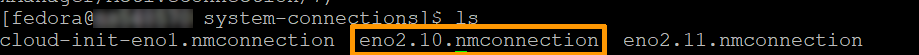{.thumbnail}
>>
>> 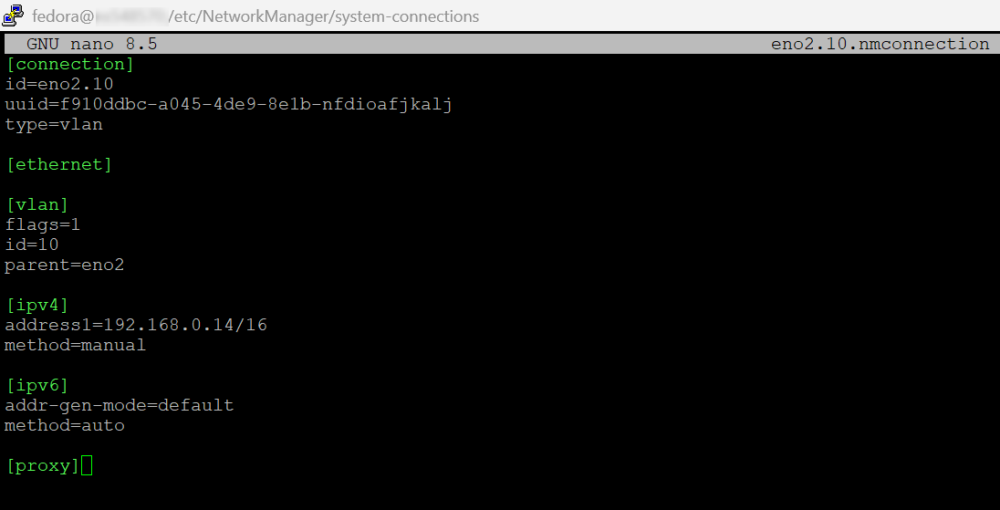{.thumbnail}
>>
> **Windows**
>>
>> Połącz się z serwerem przez zdalny pulpit i otwórz aplikację "Server Manager". Wybierz następnie `Server lokalny`{.action}, po czym kliknij link `Wyłączone`{.action} obok **Tworzenie zespołu kart interfejsu sieciowego**.
>>
>> 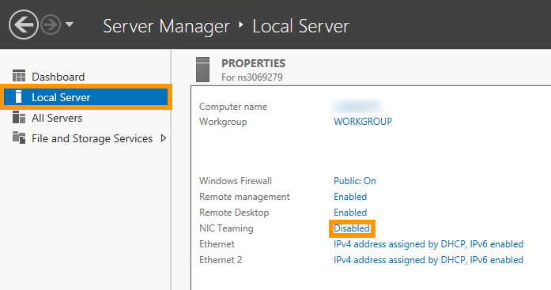{.thumbnail}
>>
>> Następnie kliknij prawym przyciskiem myszy interfejs sieciowy i wybierz `Dodaj do nowego zespołu`{.action}.
>>
>> 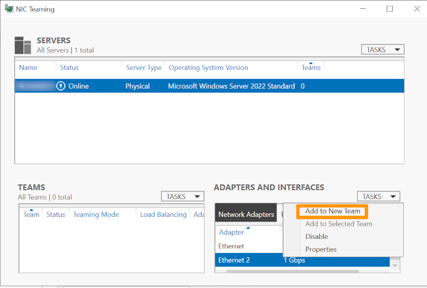{.thumbnail}
>>
>> W oknie, które się wyświetli, utwórz nowy zespół, wpisując nazwę zespołu w polu **Nazwa zespołu**. Po zakończeniu zatwierdź przyciskiem `OK`{.action}.
>>
>> {.thumbnail}
>>
>> Następnie podaj tag VLAN. W panelu **KARTY I INTERFEJSY** na ekranie **Tworzenie zespołu kart interfejsu sieciowego**, przejdź do zakładki `Interfejsy zespołów`{.action} i kliknij prawym przyciskiem myszy interfejs, który właśnie dodałeś do nowego zespołu kart sieciowych, po czym kliknij `Właściwości`{.action}. Następnie kliknij `Określona sieć VLAN`{.action} i podaj tag.
>>
>> 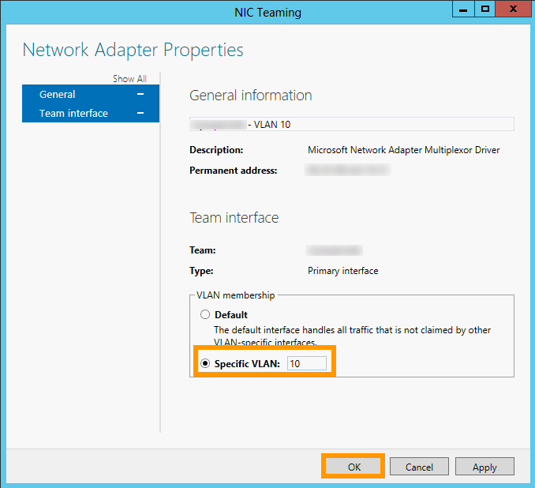{.thumbnail}
>>
>> Teraz skonfiguruj adres IP VLAN: Kliknij przycisk `Start`{.action} w menu startowym, a następnie kliknij `Panel sterowania`{.action}.
>>
>> {.thumbnail}
>>
>> Kliknij `Sieć i Internet`{.action}.
>>
>> {.thumbnail}
>>
>> Kliknij `Centrum sieci i udostępniania`{.action}.
>>
>> 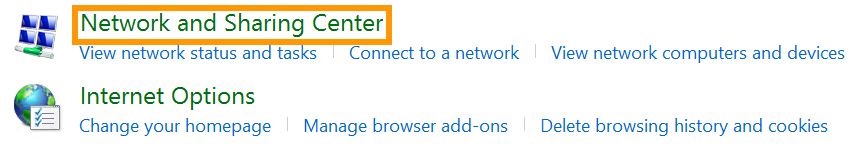{.thumbnail}
>>
>> Kliknij `Zmień ustawienia karty sieciowej`{.action}.
>>
>> {.thumbnail}
>>
>> Następnie kliknij prawym przyciskiem myszy interfejs VLAN, po czym kliknij `Właściwości`{.action}.
>>
>> {.thumbnail}
>>
>> W naszym przykładzie `Ethernet 2` to interfejs używany w sieci vRack. Możliwe jest jednak, że karta sieciowa vRack używa innego interfejsu. Korzystaj z interfejsu, który nie posiada głównego adresu IP serwera lub który używa przypisanego do siebie adresu IP.
>>
>> Kliknij dwa razy `Internet Protocol Version 4 (TCP/IPv4)`{.action}.
>>
>> {.thumbnail}
>>
>> W kolejnym kroku kliknij `Uźyj następującego adresu IP`{.action}. **Adres IP**: wprowadź adres IP z Twojego zakresu adresów prywatnych. **Maska podsieci**, wprowadź "255.255.0.0".
>>
>> 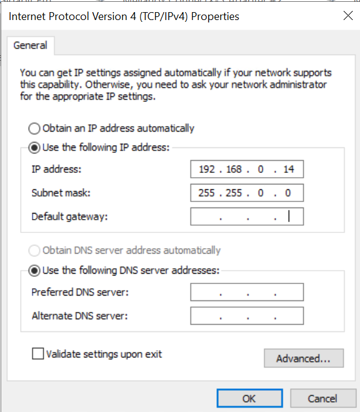{.thumbnail}
>>
>> Na koniec kliknij przycisk `OK`{.action}, aby zapisać modyfikacje, po czym zrestartuj serwer.
>>

///

## Sprawdź również

[Tworzenie kilku sieci VLAN w prywatnej sieci vRack](/pages/bare_metal_cloud/dedicated_servers/creating-multiple-vlans-in-a-vrack)

- [Konfiguracja vRack na serwerach dedykowanych](/pages/bare_metal_cloud/dedicated_servers/vrack_configuring_on_dedicated_server)
Dołącz do [grona naszych użytkowników](/links/community).
