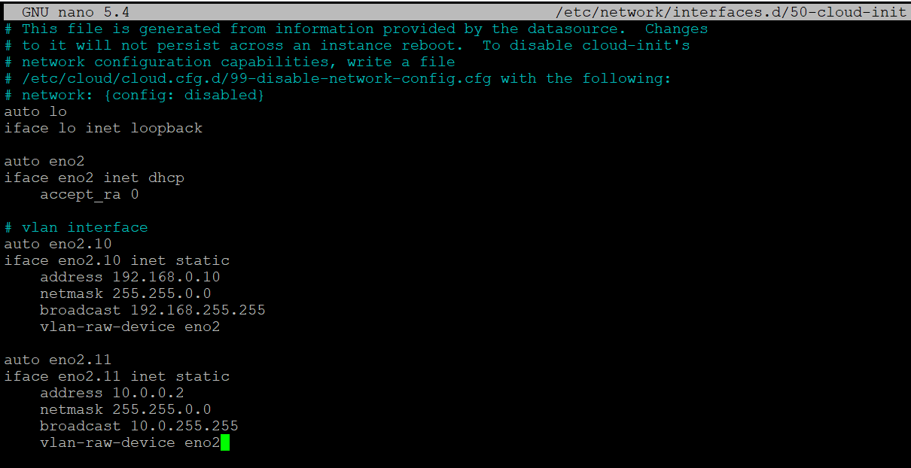
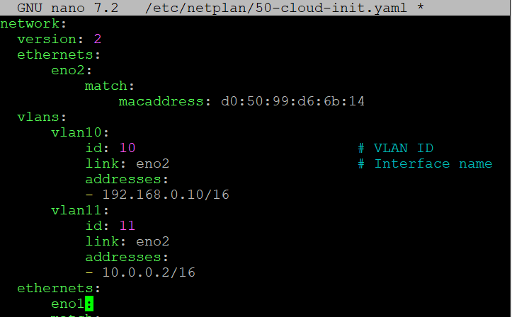
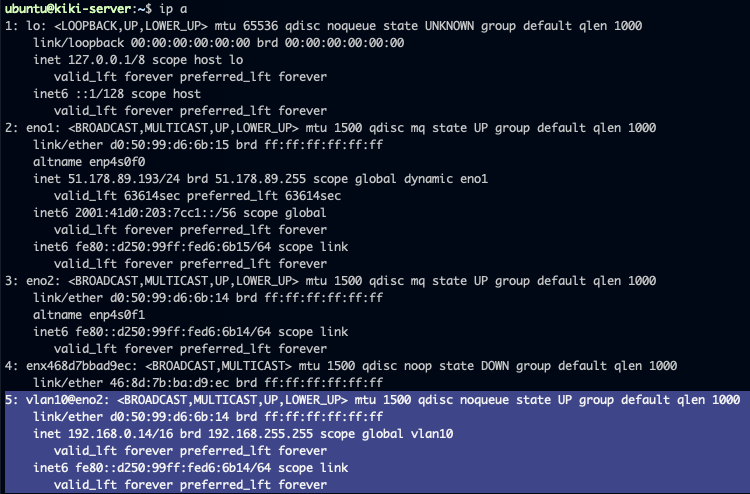
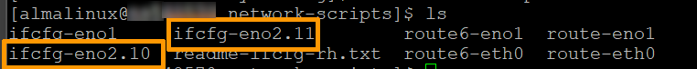
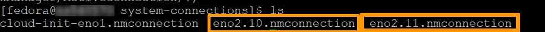
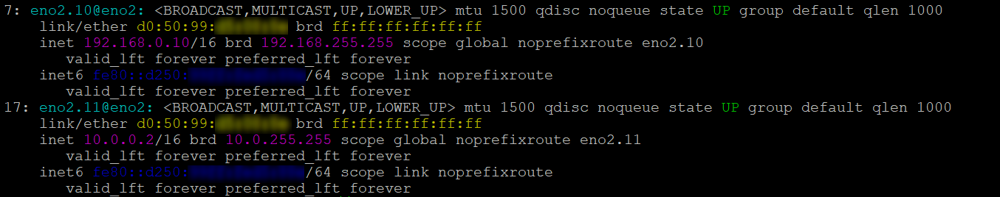
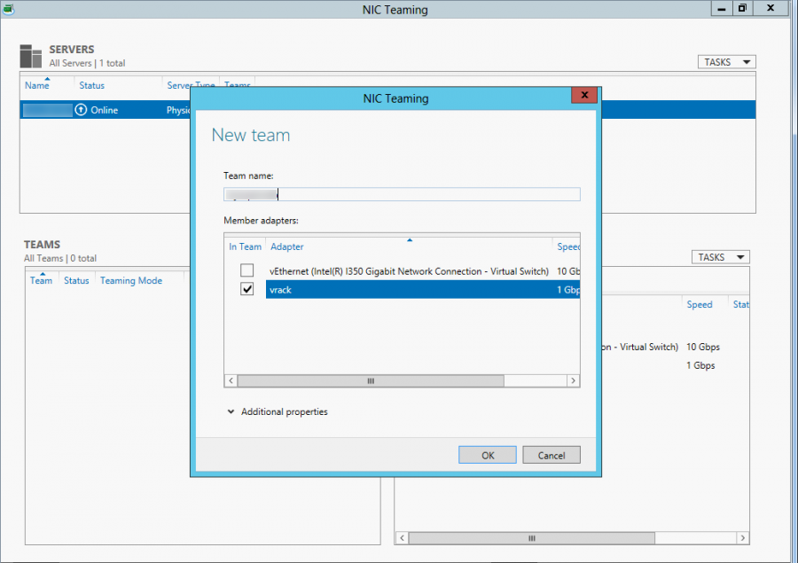
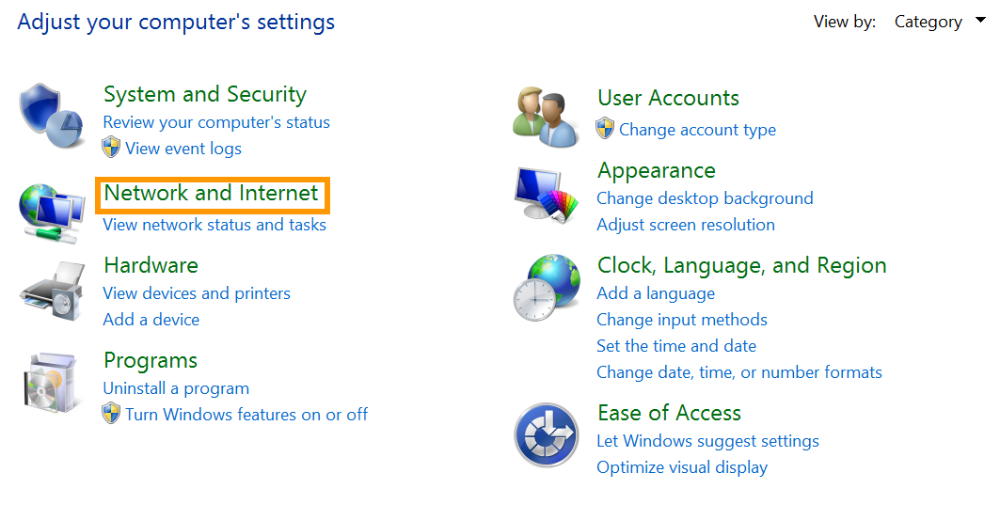
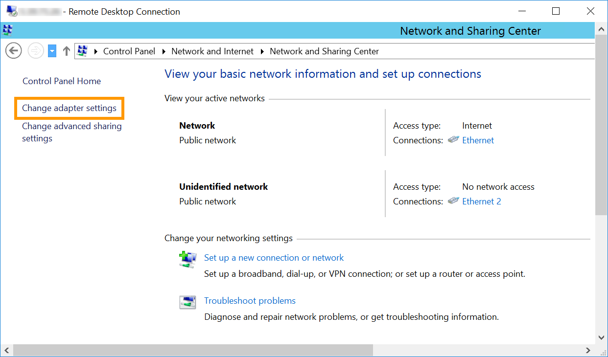
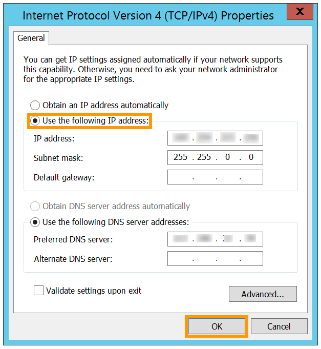

## Ziel

Bei der [Standardkonfiguration des vRack](/pages/bare_metal_cloud/dedicated_servers/vrack_configuring_on_dedicated_server) können Sie nur ein VLAN erstellen. Das bedeutet, Sie können jede IP-Adresse nur einmal verwenden. Seit Version 2.0 der vRack Konfiguration ist es jedoch möglich, bis zu 4000 lokale virtuelle Netzwerke in nur einem vRack einzurichten. Das bedeutet, Sie können jede IP-Adresse bis zu 4000 mal verwenden.

**Diese Anleitung erklärt, wie Sie mehrere VLANs im vRack erstellen.**

## Voraussetzungen

- Sie haben ein [vRack](/links/network/vrack) in Ihrem Kunden-Account aktiviert.
- Sie verfügen über einen oder mehrere mit dem vRack kompatible [Dedicated Server](/links/bare-metal/bare-metal).
- Sie haben administrativen Zugriff auf Ihre Server über SSH (Linux) oder RDP (Windows).
- Sie haben Zugriff auf Ihr [OVHcloud Kundencenter](/links/manager).
- Sie haben einen privaten IP-Adressbereich für das vRack festgelegt.
- Sie haben die [Konfiguration des vRack](/pages/bare_metal_cloud/dedicated_servers/vrack_configuring_on_dedicated_server) abgeschlossen.

> [!warning]
> Diese Funktion kann nur eingeschränkt oder nicht verfügbar sein, falls ein Dedicated Server der [**Eco** Produktlinie](/links/bare-metal/eco-about) eingesetzt wird.
>
> Weitere Informationen finden Sie auf der [Vergleichsseite](/links/bare-metal/eco-compare).

## In der praktischen Anwendung

### Linux

> [!primary]
>
> In diesem Beispiel verwenden wir **eno2** als Netzwerkinterface, **10** und **11** als VLAN-Tags und **192.168.0.0/16** und **10.0.0.0/16** als private IP-Adressbereiche.
>
> Alle Befehle müssen an die jeweils verwendete Distribution angepasst werden. Bei Fragen dazu folgen Sie der offiziellen Dokumentation Ihrer Distribution.
>

> [!tabs]
> **Debian 11**
>>
>> Stellen Sie zunächst eine SSH-Verbindung zu Ihrem Server her und führen Sie die folgenden Befehle über die Kommandozeile aus, um das VLAN-Paket auf Ihrem Server zu installieren:
>>
>> ```sh
>> sudo apt update
>> sudo apt install vlan
>> ```
>>
>> Laden Sie als Nächstes das 8021q Kernel-Modul:
>>
>> ```sh
>> sudo modprobe 8021q
>> ```
>>
>> Um zu überprüfen, ob das Modul geladen ist:
>>
>> ```sh
>> user@server:~$ lsmod | grep 8021q
>> 8021q                  40960  0
>> garp                   16384  1 8021q
>> mrp                    20480  1 8021q
>> ```
>>
>> Führen Sie den folgenden Befehl aus, um sicherzustellen, dass die Module beim Booten dauerhaft geladen werden:
>>
>> ```sh
>> sudo su -c 'echo "8021q" >> /etc/modules'
>> ```
>>
>> Rufen Sie als Nächstes Ihre Schnittstellennamen ab und identifizieren Sie die private Schnittstelle:
>>
>> ```sh
>> ip a
>> ```
>>
>> Erstellen Sie als Nächstes ein VLAN-Tag. Das Tag dient als Kennung, mit der Sie verschiedene VLANs voneinander unterscheiden können:
>>
>> ```sh
>> sudo ip link add link <parent-interface> name <vlan-identifier> type vlan id <ID>
>> ```
>>
>> **In diesem Beispiel:**
>>
>> ```sh
>> sudo ip link add link eno2 name eno2.10 type vlan id 10
>> ```
>>
>> Verwenden Sie denselben Befehl für jedes VLAN-Tag, das Sie hinzufügen möchten.
>>
>> Geben Sie als Nächstes den privaten IP-Adressbereich im vRack an und taggen Sie ihn mit der Kennung. Verwenden Sie hierzu den folgenden Befehl:
>>
>> ```sh
>> sudo ip addr add 192.168.0.10/16 dev eno2.10
>> ```
>>
>> Ändern Sie die Konfiguration Ihrer Netzwerkschnittstelle, um das VLAN-Tag zu integrieren. Öffnen Sie Ihre Konfigurationsdatei für Netzwerkschnittstellen und fügen Sie die folgenden Einträge hinzu:
>>
>> ```sh
>> sudo nano /etc/network/interfaces.d/50-cloud-init
>>
>> auto eno2.10
>> iface eno2.10 inet static
>> address 192.168.0.10
>> netmask 255.255.0.0
>> broadcast 192.168.255.255
>> vlan-raw-device eno2
>> ```
>>
>> Für mehrere konfigurierte VLANs sollte Ihre Netzwerkkonfiguration so aussehen:
>>
>> {.thumbnail}
>>
> **Ubuntu und Debian 12+**
>>
>> Diese Befehle wurden unter Ubuntu 24.04 (Noble Numbat) ausgeführt.
>>
>> Stellen Sie zunächst eine SSH-Verbindung zu Ihrem Server her und führen Sie die folgenden Befehle über die Kommandozeile aus, um das VLAN-Paket auf Ihrem Server zu installieren:
>>
>> ```sh
>> sudo apt update
>> sudo apt install vlan
>> ```
>>
>> Laden Sie als Nächstes das 8021q Kernel-Modul:
>>
>> ```sh
>> sudo modprobe 8021q
>> ```
>>
>> Um zu überprüfen, ob das Modul geladen ist:
>>
>> ```sh
>> user@server:~$ lsmod | grep 8021q
>> 8021q                  40960  0
>> garp                   16384  1 8021q
>> mrp                    20480  1 8021q
>> ```
>>
>> Führen Sie den folgenden Befehl aus, um sicherzustellen, dass die Module beim Booten dauerhaft geladen werden:
>>
>> ```sh
>> sudo su -c 'echo "8021q" >> /etc/modules'
>> ```
>>
>> Erstellen oder bearbeiten Sie die Konfigurationsdatei `cloud.cfg`, um zu verhindern, dass automatische Änderungen an Ihrer Netzwerkkonfiguration vorgenommen werden:
>>
>> ```sh
>> sudo nano /etc/cloud/cloud.cfg.d/99-disable-network-config.cfg
>> ```
>>
>> Fügen Sie die folgende Zeile hinzu:
>>
>> ```sh
>> network: {config: disabled}
>> ```
>>
>> Rufen Sie den Namen der Netzwerkschnittstelle und die MAC-Adresse ab:
>>
>> ```sh
>> ip a
>> ```
>>
>> Das zu konfigurierende Interface ist hier `eno2` mit der MAC-Adresse: `d0:50:99:d6:6b:14`.
>>
>> {.thumbnail}
>>
>> Fügen Sie die Netzwerkkonfiguration für diese Netzwerkschnittstelle und die VLAN-Informationen in der folgenden Datei hinzu und stellen Sie sicher, dass sie direkt unter der Zeile `version: 2` platziert werden. Ersetzen Sie die Werte durch Ihre eigenen:
>>
>> ```sh
>> sudo nano /etc/netplan/50-cloud-init.yaml
>> ```
>>
>> ```yaml
>> network:
>>     version: 2
>>     ethernets:
>>         eno2:
>>             match:
>>                 macaddress: d0:50:99:d6:6b:14
>>     vlans:
>>         vlan10:
>>             id: 10                      # VLAN ID
>>             link: eno2                  # Schnittstellenname
>>             addresses:
>>             - 192.168.0.10/16
>>     ethernets:
>>         eno1:
>>             ...
>>             ...
>> ```
>>
>> Für mehrere konfigurierte VLANs sollte Ihre Netzwerkkonfiguration so aussehen:
>>
>> {.thumbnail}
>>
>> Speichern und schließen Sie die Datei und führen Sie dann den folgenden Befehl aus:
>>
>> ```sh
>> sudo netplan apply
>> ```
>>
>> Verwenden Sie den folgenden Befehl, um sicherzustellen, dass die Konfiguration korrekt angewendet wurde:
>>
>> ```sh
>> ip a
>> ```
>>
>> {.thumbnail}
>>
> **AlmaLinux und Rocky Linux (8/9)**
>>
>> Bevor Sie beginnen, stellen Sie eine SSH-Verbindung zu Ihrem Server her und führen Sie den folgenden Befehl aus, um das 8021q Kernel-Modul zu laden:
>>
>> ```sh
>> sudo modprobe 8021q
>> ```
>>
>> Um zu überprüfen, ob das Modul geladen ist:
>>
>> ```sh
>> user@server:~$ lsmod | grep 8021q
>> 8021q                  40960  0
>> garp                   16384  1 8021q
>> mrp                    20480  1 8021q
>> ```
>>
>> Führen Sie als Nächstes den folgenden Befehl aus, um sicherzustellen, dass die Module beim Booten dauerhaft geladen werden:
>>
>> ```sh
>> sudo su -c 'echo "8021q" >> /etc/modules'
>> ```
>>
>> Rufen Sie die Schnittstellennamen ab und identifizieren Sie die private Schnittstelle:
>>
>> ```sh
>> ip a
>> ```
>>
>> Erstellen Sie als Nächstes eine Subinterface-Konfigurationsdatei für das VLAN in der Haupt-Netzwerkkonfigurationsdatei.
>>
>> In diesem Beispiel heißt die Datei `ifcfg-eno2.10`, wobei eno2 sich auf die private Netzwerkschnittstelle und `10` auf die VLAN-ID bezieht.
>>
>> ```sh
>> sudo nano /etc/sysconfig/network-scripts/ifcfg-eno2.10
>> ```
>>
>> Fügen Sie der Konfigurationsdatei die folgenden Einträge hinzu und ersetzen Sie die Werte durch Ihre eigenen:
>>
>> ```console
>> TYPE=Vlan
>> PHYSDEV=eno2
>> VLAN_ID=10
>> BOOTPROTO=none
>> IPADDR=192.168.0.10
>> PREFIX=16
>> NAME=eno2.10
>> DEVICE=eno2.10
>> ONBOOT=yes
>> VLAN=yes
>> ```
>>
>> Speichern und schließen Sie die Datei.
>>
>> Für mehrere konfigurierte VLANs sollten Sie eine neue Datei für jede VLAN-Kennung erstellen:
>>
>> {.thumbnail}
>>
>> Starten Sie die Netzwerkschnittstelle neu:
>>
>> ```sh
>> sudo systemctl restart NetworkManager
>> ```
>>
> **Fedora 42+, AlmaLinux und Rocky Linux (10)**
>>
>> Die folgende Konfiguration basiert auf Fedora 43.
>>
>> Bevor Sie beginnen, stellen Sie eine SSH-Verbindung zu Ihrem Server her und führen Sie den folgenden Befehl aus, um das 8021q Kernel-Modul zu laden:
>>
>> ```sh
>> sudo modprobe 8021q
>> ```
>>
>> Um zu überprüfen, ob das Modul geladen ist:
>>
>> ```sh
>> user@server:~$ lsmod | grep 8021q
>> 8021q                  40960  0
>> garp                   16384  1 8021q
>> mrp                    20480  1 8021q
>> ```
>>
>> Führen Sie den folgenden Befehl aus, um sicherzustellen, dass die Module beim Booten dauerhaft geladen werden:
>>
>> ```sh
>> sudo su -c 'echo "8021q" >> /etc/modules'
>> ```
>>
>> Um den Namen der privaten Netzwerkschnittstelle zu erhalten:
>>
>> ```sh
>> ip a
>> ```
>>
>> In diesem Beispiel heißt die Schnittstelle `eno2`. Wir müssen eine VLAN-Subschnittstelle erstellen, bevor wir ihr eine private IP-Adresse zuweisen.
>>
>> Verwenden Sie den folgenden Befehl, um die VLAN-Schnittstelle zu erstellen:
>>
>> ```sh
>> sudo nmcli con add type vlan con-name <vlan-name> dev <parent-interface> id <vlan-id>.
>> ```
>>
>> Ersetzen Sie `vlan-name` durch den Namen der VLAN-Subschnittstelle, `parent-interface` durch den Namen der privaten Schnittstelle und `vlan-id` durch die VLAN-ID.
>>
>> **In diesem Beispiel:**
>>
>> ```sh
>> sudo nmcli con add type vlan con-name eno2.10 dev eno2 id 10
>> Connection 'eno2.10' successfully added.
>> ```
>>
>> Weisen Sie der VLAN-Subschnittstelle eine private IP-Adresse zu:
>>
>> ```sh
>> sudo nmcli con mod <vlan-name> ipv4.addresses <ip/prefix> ipv4.method manual
>> ```
>>
>> **In diesem Beispiel:**
>>
>> ```sh
>> sudo nmcli con mod eno2.10 ipv4.addresses 192.168.0.10/16 ipv4.method manual
>> ```
>>
>> Als Nächstes aktivieren Sie die VLAN-Subschnittstelle:
>>
>> ```sh
>> sudo nmcli con up <vlan-name>.
>> ```
>>
>> **In diesem Beispiel:**
>>
>> ```sh
>> sudo nmcli con up eno2.10
>> # Connection successfully activated
>> ```
>>
>> Verwenden Sie dieselben Befehle für jede VLAN-Schnittstelle, die Sie hinzufügen möchten.
>>
>> Sobald dies abgeschlossen ist, wird eine Konfigurationsdatei für die VLAN-Schnittstelle erstellt. Diese Datei befindet sich unter `/etc/NetworkManager/system-connections/` und folgt dem Namensformat `vlan-name.nmconnection`.
>>
>> Für mehrere VLANs werden mehrere Konfigurationsdateien erstellt:
>>
>> - Übersicht:
>>
>> {.thumbnail}
>>
>> {.thumbnail}
>>

### Windows

Verbinden Sie sich über Remote-Desktop mit Ihrem Server und öffnen Sie die Anwendung "Server-Manager". Wählen Sie dann `Lokaler Server`{.action} aus und klicken Sie neben "**NIC Teamvorgang**" auf den Link `Deaktiviert`{.action}:

{.thumbnail}

Klicken Sie dann mit der rechten Maustaste auf das Netzwerkinterface und wählen Sie `Zum neuen Team hinzufügen`{.action}.

{.thumbnail}

Erstellen Sie anschließend ein neues Team, indem Sie ein Netzwerkinterface auswählen und im Feld "**Teamname**" einen Teamnamen eingeben. Wenn Sie damit fertig sind, bestätigen Sie mit `OK`{.action}.

{.thumbnail}

Geben Sie nun das VLAN-Tag an. Klicken Sie im "**NIC-Teamvorgang**"-Fenster im Panel "**ADAPTER UND SCHNITTSTELLEN**", Gehen Sie zur Registerkarte `Teamschnittstellen`{.action} und mit der rechten Maustaste auf das Interface, das Sie gerade zum neuen Team hinzugefügt haben, und klicken Sie dann auf `Eigenschaften`{.action}. Klicken Sie jetzt auf `Spezifisches VLAN`{.action} und geben Sie den Tag ein:

{.thumbnail}

Konfigurieren Sie nun die IP-Adresse des VLANs. Öffnen Sie hierzu über das Startmenü die `Systemsteuerung`{.action}.

{.thumbnail}

Klicken Sie auf `Netzwerk und Internet`{.action}:

{.thumbnail}

Klicken Sie dann auf `Netzwerk- und Freigabecenter`{.action}:

{.thumbnail}

Klicken Sie anschließend auf `Adaptereinstellugen ändern`{.action}:

{.thumbnail}

Klicken Sie nun mit der rechten Maustaste auf das VLAN-Interface und klicken Sie dann auf `Eigenschaften`{.action}.

{.thumbnail}

In unserem Beispiel ist `Ethernet 2` das für vRack verwendete Interface. Es ist jedoch möglich, dass das vRack-Interface in Ihrer Konfiguration ein anderes ist. Das hier auszuwählende Interface verwendet nicht die Haupt-IP-Adresse des Servers oder eine selbst zugewiesene IP-Adresse.

Doppelklicken Sie auf `Internet Protocol Version 4 (TCP/IPv4)`{.action}.

{.thumbnail}

Klicken Sie auf `Folgende IP-Adresse verwenden`{.action}. Geben Sie in das Feld "**IP-Adresse**" eine IP-Adresse aus Ihrem internen IP-Bereich ein. Geben Sie in das Feld "**Subnetzmaske**" die Subnetzmaske "255.255.0.0" ein.

{.thumbnail}

Klicken Sie abschließend auf den Button `OK`{.action}, um die Änderungen zu speichern, und starten Sie den Server neu.

## Weiterführende Informationen

[Mehrere dedizierte Server im vRack konfigurieren](/pages/bare_metal_cloud/dedicated_servers/vrack_configuring_on_dedicated_server)

- [vRack zwischen Public Cloud und Dedicated Server konfigurieren](/pages/bare_metal_cloud/dedicated_servers/configuring-the-vrack-between-the-public-cloud-and-a-dedicated-server)

Treten Sie unserer [User Community](/links/community) bei.
