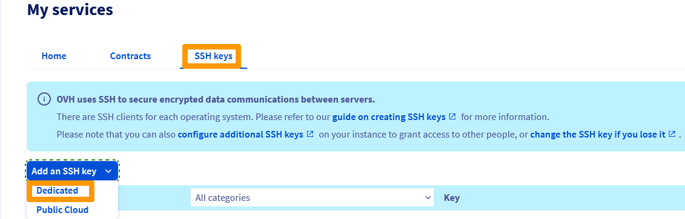

## Objective

Using the SSH protocol enables a secure channel over an unsecured network in a client-server architecture, connecting an SSH client with an SSH server. Creating an SSH key set provides you with a public and a private key. You can place the public key on a server, and then connect to it with a client that has the corresponding private key. If the public and private SSH keys match up, you will be logged in without needing a password.

This is generally the most secure and convenient connection method.

**This guide explains how to configure SSH keys on your local device for secure connections to remote servers.**

## Requirements

- Access to the [OVHcloud Control Panel](https://www.ovh.com/auth/?action=gotomanager&from=https://www.ovh.co.uk/&ovhSubsidiary=GB)
- A [dedicated server](https://www.ovhcloud.com/en-gb/bare-metal/) or a [VPS](https://www.ovhcloud.com/en-gb/vps/) in your OVHcloud account
- An SSH client application (command line or GUI)
- Administrative access (root) via SSH to your server

> [!primary]
> This guide is not applicable for standard **Windows Server** installations since they rely on the `Remote Desktop Protocol` (RDP) for connections. SSH connections are used for the OVHcloud rescue mode however. You can find more information in the [Go further](#gofurther) section of this guide.
>

## Instructions

Be sure to consult our "Getting started" guides: <a name="getstarted"></a>

- For a [dedicated server](/pages/bare_metal_cloud/dedicated_servers/getting-started-with-dedicated-server)
- For a [dedicated server of the **Eco** product line](/pages/bare_metal_cloud/dedicated_servers/getting-started-with-dedicated-server-eco)
- For a [VPS](/pages/bare_metal_cloud/virtual_private_servers/starting_with_a_vps)

We recommend reading the [SSH introduction guide](/pages/bare_metal_cloud/dedicated_servers/ssh_introduction) as well.

The following instructions cover two methods of using SSH keys:

- [Creating an **Open SSH** key pair and connecting to a server from the command line SSH client](#openssh)
- [Creating a `PuTTY` key pair and connecting to a server from the `PuTTY` SSH client](#useputty)

You can use both methods side by side but keep in mind that `PuTTY` stores key files in a specific format which makes them incompatible with SSH key files created with the **Open SSH** client. This means that a private key created with the command line SSH client will have to be [converted to the `PuTTY` format](https://www.chiark.greenend.org.uk/~sgtatham/putty/faq.html#faq-ssh2-keyfmt) first and vice versa.

### Creating an SSH key pair from the command line <a name="openssh"></a>

From a **Mac** computer or a device with a **Linux OS** installed, open the command line application (`Terminal`).

Verify that you have a folder named `.ssh` in your `$HOME` directory. If the folder does not exist, create it:

```bash
mkdir ~/.ssh
```

On a current **Windows OS**, open the `Command Prompt` by typing "cmd" into the search bar (or open `PowerShell` from the menu).

Go to the directory `.ssh` for your active **Windows** user (by default: `C:\Users\WindowsUsername\.ssh`):

```powershell
cd .ssh
```

<a name="createnewkey"></a>
Use the following command to create a 4096 bit RSA key:

```bash
ssh-keygen -b 4096
```

Using the option `-t` with this command allows you to specify a different encryption method, for example:

```bash
ssh-keygen -t ed25519 -a 256
```

The command line will prompt you to save the newly created key in the standard file:

```console
Generating public/private rsa key pair.
Enter file in which to save the key (/home/user/.ssh/id_rsa):
```

You can confirm with `Enter` to accept the proposed file name or enter an individual name. This is relevant if more than one key pair is placed in the `.ssh` directory. You can find more information about this in the section [Managing multiple SSH keys](#multiplekeys).<br>
This example uses the standard file names `id_rsa` and `id_rsa.pub`.

You can protect your SSH key with a passphrase at the next prompt. This is recommended for added security.

> [!warning]
>
> Remote access to your server is only as secure as the client device storing the private key. Protecting your device and files from unauthorised access is therefore crucial when using SSH keys.
> 
> For convenience and security purposes, consider using a password manager on your device, such as the open source solution `KeePass`.
> 

All SSH keys should be stored in the `.ssh` directory. The public key files will have `.pub` added to the filename.

```console
Your identification has been saved in /home/user/.ssh/id_rsa.
Your public key has been saved in /home/user/.ssh/id_rsa.pub.
The key fingerprint is:
SHA256:MRk+Y0zCOoOkferhkTvMpcMsYspj212lK7sEauNap user@hostname
The key's randomart image is:
+---[RSA 4096]----+
|     .. o        |
|    . .= o       |
|   o o  X        |
|. . . .          |
|. .=.o .S.       |
| =o.o.  .   .    |
|o +   .  . o ..  |
|.. .  .   oEoo . |
|o.        .o+oo  |
+----[SHA256]-----+
```

<a name="publickey"></a>

In order to view and export your public key, use the command `cat` on your `.pub` key file. Copy the full key string to the clipboard in order to [add it to your server](#addserverkey) next.

```bash
cat ~/.ssh/id_rsa.pub
ssh-rsa AAAAB3NzaC1yc2EAAAADAQABAAABAQC8teh2NJ42qYZV98gTNhumO1b6rMYIkAfRVazl
k6dSS3xf2MXJ4YHsDacdjtJ+evXCFBy/IWgdkFtcvsGAMZ2N1RdvhDyQYcy6NDaJCBYw1K6Gv5fJ
SHCiFXvMF0MRRUSMneYlidxUJg9eDvdygny4xOdC6c1JrPrSgOc2nQuKeMpOoOWLINIswg1IIFVk
kFMPrFivP8Z6tidzVpAtbr1sXmJGZazYWrU3FoK2a1sF1zEWrmlMOzX81zEWrmlMOzX8CpZW8Rae
i4ANmLy7NULWK36yU0Rp9bFJ4o0/4PTkZiDCsK0QyHhAJXdLN7ZHpfJtHIPCnexmwIMLfIhCWhO5
 user@hostname
```

> [!primary]
>
> In a **MacOS** Terminal you can use the commands `pbcopy` and `pbpaste` to handle key strings faster. For example, use this command to copy the key from the file `id_rsa.pub` to the clipboard:
>
> `pbcopy < ~/.ssh/id_rsa.pub`
>

On a **Windows OS**, you can open the file with the `Notepad` application from the `File Explorer` (`right-click` on the file and select `Open with`) or use one of the following commands (in `\Users\WindowsUsername\.ssh`):

- `cmd`

```powershell
more id_rsa.pub
```

- `powershell`

```powershell
cat id_rsa.pub
```

Copy the full key string to the clipboard in order to [add it to your server](#addserverkey) next.

> [!primary]
>
> **Clipboard usage**
>
> When working from a **Windows** command line, use a `right-click` to **paste** the content of your clipboard into the command line window. To **copy** a string from the command line window, highlight it, then press `Enter`. You can also find these functions via a `right-click` on the menu bar.
>

### Creating an SSH key pair with PuTTY <a name="useputty"></a>

[PuTTY](https://putty.org/){.external} is an open source SSH client software with a graphical user interface, available for **Windows** and other operating systems. It provides a companion software to create SSH keys: `PuTTY Key Generator` (`PuTTYgen`).

> [!primary]
>
> The main purpose of `PuTTY` is managing SSH connections from a **Windows** client device to a **GNU/Linux** server. `PuTTY` stores key files in a specific format which makes them incompatible with SSH key files created with the **Open SSH** client natively included in most modern operating systems.
>
> If necessary, keys generated from the command line as explained above can be [converted into the `PPK` format](https://www.chiark.greenend.org.uk/~sgtatham/putty/faq.html#faq-ssh2-keyfmt) in order to use them with the `PuTTY` client. For the most convenient use of SSH keys, decide on an option and stick to it (**Open SSH** private keys or `PuTTY` private keys).
>

If it is not already installed (check your applications list or use the search function), download `PuTTY` from [the official website](https://www.chiark.greenend.org.uk/~sgtatham/putty/latest.html). The recommended standard installation package contains `PuTTYgen` but it is available as a standalone file on the website as well.

Open `PuTTYgen` and select a supported encryption algorithm. This example uses RSA. Enter 4096 as the number of bits in the bottom right corner, then click on the button `Generate`{.action}.

{.thumbnail}

Move your mouse cursor freely about the area below the progress bar:

{.thumbnail}

The key is ready when the progress bar is full.

{.thumbnail}

Copy the full key string to the clipboard in order to [add it to your server](#addserverkey) and optionally [import it into the OVHcloud Control Panel](#importkey). Save both keys as files by clicking the corresponding buttons and also enter a passphrase to protect them.

> [!warning]
>
> Remote access to your server is only as secure as the client device storing the private key. Protecting your device and files from unauthorised access is therefore crucial when using SSH keys.
> 
> For convenience and security purposes, consider using a password manager on your device, such as the open source solution `KeePass`.
>

One advantage of using `PuTTY` is the ability to save different connections as `Sessions`. Find further information below in the section [Managing multiple SSH keys on your local device](#puttykeys).

You can learn more about SSH connections in the ["Getting started" guides](#getstarted) and in our [SSH introduction](/pages/bare_metal_cloud/dedicated_servers/ssh_introduction).

### Adding SSH keys to your server <a name="addserverkey"></a>

[Connect](/pages/bare_metal_cloud/dedicated_servers/ssh_introduction) to your server and make sure you are in your user's `$HOME` directory. Create the folder `.ssh` (if it does not exist):

```bash
mkdir ~/.ssh
```

To store the key for the current user, open (or create) the file `authorized_keys` with your preferred text editor (`nano` is used in this example):

```bash
nano ~/.ssh/authorized_keys
```

Paste your [**public key**](#publickey) into this file. Save the file and exit the editor. Reboot your server or only restart the OpenSSH service with one of the following commands (the appropriate command may vary depending on your OS):

```bash
sudo systemctl restart ssh
```

```bash
sudo systemctl restart sshd
```

To verify that your key has been set up properly, connect to your server with the following command. Replace "user" with the username for which the keys were created and "IP_ADDRESS" with the IP address (or hostname) of the server you want to access:

```bash
ssh user@IP_ADDRESS
```

Example:
    
```bash
ssh ubuntu@169.254.10.250
```

#### Adding additional public keys to your server

To add SSH keys for other users accessing your server, repeat the key creation steps but use the appropriate `$HOME` folder or **Windows** `Users` directory of the user in question to create and store the SSH keys (or execute the commands on this person's dedicated device). Then add the new public key to the server in `authorized_keys` as described above.

#### Removing public keys from your server

Open the file `authorized_keys` as [described above](#addserverkey) and remove the key string that corresponds to the user having their access revoked.

Save the file and exit the editor.

### Managing multiple SSH keys on your local device <a name="multiplekeys"></a>

You might want to use multiple SSH key pairs to connect to different remote hosts. (If you are using `PuTTY`, skip to [the corresponding section](#puttykeys) below.) 

Since all keys should be placed in the folder `.ssh` on your local device, the file names have to be different. When you [create a new key pair](#createnewkey) and you are asked to provide a file name, enter a name of your choice. Match it to your the name of your server for example.

```console
Generating public/private rsa key pair.
Enter file in which to save the key (/home/user/.ssh/id_rsa): KeyFileName_rsa

Your identification has been saved in /home/user/.ssh/KeyFileName_rsa.
Your public key has been saved in /home/user/.ssh/KeyFileName_rsa.pub.
```

When connecting to the corresponding server, specify the name of the key file in addition to the user and server details:

```bash
ssh -i ~/.ssh/KeyFileName user@IP_ADDRESS
```

Example:
    
```bash
ssh -i ~/.ssh/myVPS_rsa ubuntu@169.254.10.250
```

As noted in previous sections, the same instructions will work on a **Windows** client. Only replace `~/` with the file path of your **Windows** user folder, by default `C:\Users\WindowsUsername\`. (Example: `ssh -i C:\Users\Username\.ssh/myVPS_rsa ubuntu@169.254.10.250`)

#### Using the "config" file

The alternative to adding the option `-i` each time is to edit a file named `config` inside the folder `~/.ssh` (`\Users\Username\.ssh` for **Windows**). You can use it to configure details for different connections (username, port, key file, optional parameters, etc.)

If this file exists inside `.ssh`, it probably contains some information already. Depending on your working environment, consider creating a backup copy of the original first.

Example of `.ssh` folder content:
    
```bash
ls ~/.ssh/
config	id_rsa	id_rsa.pub	known_hosts	 known_hosts.old
```

With the `config` file, multiple SSH connections can be stored along with their individual parameters, in addition to standard values. Using the full potential of this file can become complex, since it is most useful for experienced users managing multiple servers on a regular basis.

Following is a simple example to explain how to configure an SSH connection to a VPS.<br>
Open the file and add the following lines at the top:

```console
Host vps
    HostName 169.254.10.250
    IdentityFile ~/.ssh/myVPS_rsa
```

You can then connect to the VPS with the alias name you have defined as `Host`:

```bash
ssh ubuntu@vps
```

Only the server IP and the key file were specified in the previous example but more details can be added. To configure an SSH connection to a second server with the username "rocky", the [modified SSH port](/pages/bare_metal_cloud/virtual_private_servers/secure_your_vps#changesshport) "49160" and the private key in the file "myserver_rsa", extend the file content as shown in this example:

```console
Host vps
    HostName 169.254.10.250
    IdentityFile ~/.ssh/myVPS_rsa

Host dedicated_server
    HostName 169.254.10.251
    User rocky
    Port 49160
    IdentityFile ~/.ssh/myserver_rsa
```

You can then connect to this server by entering:

```bash
ssh dedicated_server
```

You can read the [corresponding `man` page](https://manpages.org/ssh_config/5) for more information.

#### Using PuTTY <a name="puttykeys"></a>

If you have followed the instructions in the sections [Creating an SSH key pair with `PuTTY`](#useputty) and [Adding SSH keys to your server](#addserverkey), you have a key pair you can use to connect to your server. 

`PuTTY` can save credentials and parameters of an SSH connection as a `Session`. This also enables you to connect to different servers using individual keys.

Open `PuTTY` and expand the subsection `SSH` in the left-hand menu, then click on `Auth` and `Credentials`.

{.thumbnail}

Click on the `Browse`{.action} button and select the `PuTTY` private key file (`keyfile.ppk`) from the folder in which you have saved it.

The key file is now associated with the current SSH session. Switch to `Session` in the left-hand menu and enter your [login credentials for the server](#getstarted) (`username@IPv4_address`).

Enter a name for this connection under `Saved Sessions` and click on `Save`{.action} to add it to the list.

{.thumbnail}

From now on, you can click on this `Session` item and open a connection to your server. To test it, click on `Open`{.action}. If you have protected the key file with a passphrase, you have to enter it at this point.

To configure another server connection, repeat the steps:

- [Create the key pair](#useputty).
- [Add the public key to your server](#addserverkey.)
- [Enter the server details and add the key file in `PuTTY`](#puttykeys).


### Importing your SSH key into the OVHcloud Control Panel <a name="importkey"></a>

The OVHcloud Control Panel allows you to store public keys, if they were created with one of the supported encryption types. This feature can save you some time when you configure a new server or reinstall one because you do not have to [add the public key to your server](#addserverkey) manually. 

Open the sidebar navigation by clicking on your name in the top right corner and use the shortcut `Products and services`{.action}.

{.thumbnail}

In `My services`, switch to the `SSH keys`{.action} tab and click on `Add an SSH key`{.action}.

{.thumbnail}

Select `Dedicated` from the drop-down menu.

In the new window, enter an ID (a name of your choice) for the key. Paste the key string (copied from [your `.pub` file](#publickey) or [the `PuTTYgen` window](#useputty)) into the `Key` field.

{.thumbnail}

If you have copied the full output, the identifier after the key should already be appended. Note that in order to store your key, you will need to specify your local identifier after the pasted key. (See the example format above.) This is a requirement of the OVHcloud Control Panel. Click `Confirm`{.action} to store your public key.

> [!primary]
>
> All keys saved in the `Dedicated` section are available to preinstall on a dedicated server or a VPS. Regarding SSH keys for Public Cloud services, please refer to [this guide](/pages/public_cloud/compute/public-cloud-first-steps).
>

### Setting a default SSH key (only for the section "Dedicated") <a name="cpsshkey"></a>

If you have added multiple SSH keys in your Control Panel, it is possible to set one key to be used as the default key on the account. 

> [!warning]
> Please note that once a default key is set, it will also be used as the means of connection once a server is rebooted in rescue mode. To receive a password instead, the default key must be [disabled](#disablesshkey) before rebooting the server in rescue mode. You can find more information in the [Go further](#gofurther) section of this guide.
> 

Open the sidebar navigation by clicking on your account name in the top right corner and use the shortcut `Products and services`{.action} to arrive at the `SSH keys`{.action} section.

{.thumbnail}

In the list of keys, click on the `Key` icon next to the SSH key of your choice to set it as the default key.

{.thumbnail}

Once done, a popup message will appear confirming the key has been set as default and the `Key` icon will be highlighted.

{.thumbnail}

### Disabling the default SSH key <a name="disablesshkey"></a>

To disable the current **default SSH key**, access the `SSH keys`{.action} section as described above. Click on the blue `Key` icon next to the corresponding SSH key to disable the default option.

## Go further <a name="gofurther"></a>

[Getting started with SSH](/pages/bare_metal_cloud/dedicated_servers/ssh_introduction)

[Dedicated server rescue mode](/pages/bare_metal_cloud/dedicated_servers/rescue_mode)

[VPS rescue mode](/pages/bare_metal_cloud/virtual_private_servers/rescue)

If you need training or technical assistance to implement our solutions, contact your sales representative or click on [this link](https://www.ovhcloud.com/en-gb/professional-services/) to get a quote and ask our Professional Services experts for a custom analysis of your project.

Join our user community on <https://community.ovh.com/en/>.