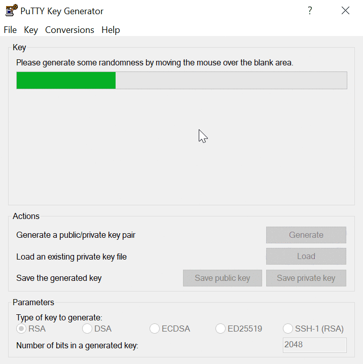
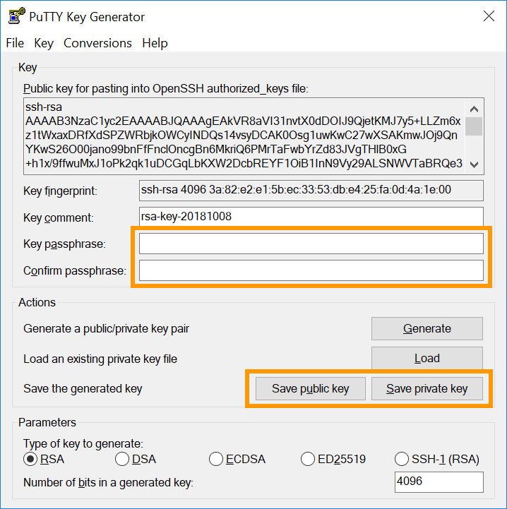

## Objectif

L'utilisation du protocole SSH ouvre un canal sécurisé sur un réseau non sécurisé dans une architecture client-serveur, en connectant un client SSH à un serveur SSH. La création d'un jeu de clés SSH vous permet d'obtenir une clé publique et une clé privée. Vous pouvez placer la clé publique sur un serveur puis vous y connecter avec un client qui possède la clé privée correspondante. Si les clés SSH publique et privée correspondent, vous serez connecté sans avoir besoin d'un mot de passe.

Il s’agit généralement de la méthode de connexion la plus sûre et la plus pratique.

**Ce guide explique comment configurer des clés SSH sur votre appareil local pour sécuriser les connexions a des serveurs distants.**

## Prérequis

- Être connecté à votre [espace client OVHcloud](https://www.ovh.com/auth/?action=gotomanager&from=https://www.ovh.com/fr/&ovhSubsidiary=fr)
- Disposer d'un [serveur dédié](https://www.ovhcloud.com/fr/bare-metal/) ou d'un [VPS](https://www.ovhcloud.com/fr/vps/) dans votre compte OVHcloud
- Installer au préalable une application client SSH (ligne de commande ou GUI)
- Disposer d'un accès administrateur (root) via SSH

> [!primary]
> Ce guide ne s'applique pas aux installations **Windows Server** standard car elles reposent sur le `Remote Desktop Protocol` (RDP) pour les connexions. Les connexions SSH sont cependant utilisées pour le mode rescue d’OVHcloud. Plus d'informations dans la section [Aller plus loin](#gofurther) de ce guide.
>

## En pratique

N’oubliez pas de consulter nos guides « Premiers pas » : <a name="getstarted"></a>

- pour un [serveur dédié](/pages/bare_metal_cloud/dedicated_servers/getting-started-with-dedicated-server) ;
- pour un [serveur dédié de la gamme **Eco**](/pages/bare_metal_cloud/dedicated_servers/getting-started-with-dedicated-server-eco) ;
- pour un [VPS](/pages/bare_metal_cloud/virtual_private_servers/starting_with_a_vps).

Nous vous invitons à consulter également le guide de présentation du [protocole SSH](/pages/bare_metal_cloud/dedicated_servers/ssh_introduction).

Les instructions suivantes couvrent deux méthodes d'utilisation des clés SSH :

- [La création d'une paire de clés **Open SSH** et la connexion à un serveur à partir du client SSH en ligne de commande](#openssh)
- [La création d'une paire de clés `PuTTY` et la connexion à un serveur à partir du client SSH `PuTTY`](#useputty)

Vous pouvez utiliser les deux méthodes simultanément, mais gardez à l'esprit que `PuTTY` garde les fichiers de clé dans un format spécifique, ce qui les rend incompatibles avec les fichiers de clé SSH créés avec le client **Open SSH**.

Cela signifie qu'une clé privée créée avec le client SSH en ligne de commande devra d'abord être [convertie au format `PuTTY` et inversement](https://www.chiark.greenend.org.uk/~sgtatham/putty/faq.html#faq-ssh2-keyfmt){.external}.

### Création d'une paire de clés SSH en ligne de commande <a name="openssh"></a>

À partir d'un ordinateur **Mac** ou d'un périphérique sur lequel un système d'exploitation **Linux** est installé, ouvrez l'application en ligne de commande (`Terminal`).

Vérifiez que vous avez un dossier nommé `.ssh` dans votre répertoire `$HOME`. Si le dossier n'existe pas, créez-le :

```bash
mkdir ~/.ssh
```

Sur un système d'exploitation **Windows** actuel, ouvrez l'`invite de commandes` en tapant « cmd » dans la barre de recherche (ou ouvrez `PowerShell` à partir du menu).

Rendez-vous dans le répertoire `.ssh` de votre utilisateur **Windows** actif (par défaut : `C:\Users\WindowsUsername.ssh`):

```powershell
cd .ssh
```

<a name="createnewkey"></a>
Utilisez ensuite la commande suivante pour créer une clé RSA de 4096 bits :

```bash
ssh-keygen -b 4096
```

L'utilisation de l'option `-t` avec cette commande permet de spécifier une autre méthode de chiffrement, par exemple :

```bash
ssh-keygen -t ed25519 -a 256
```

La ligne de commande vous invite à enregistrer la clé nouvellement créée dans le fichier standard :

```console
Generating public/private rsa key pair.
Enter file in which to save the key (/home/user/.ssh/id_rsa):
```

Confirmez avec la touche `Entrée` pour accepter le nom de fichier proposé ou entrer un nom individuel. Ceci est pertinent si plusieurs paires de clés sont placées dans le répertoire `.ssh`. Retrouvez plus d'informations à ce sujet dans la section « [Gestion de plusieurs clés SSH sur votre équipement local](#multiplekeys) » de ce guide.<br>
Cet exemple utilise les noms de fichiers standard `id_rsa` et `id_rsa.pub`.

Vous pouvez protéger votre clé SSH avec une phrase secrète (*passphrase*) à l'opération suivante. C’est une étape recommandée pour plus de sécurité.

> [!warning]
>
> L'accès à distance à votre serveur doit être aussi sécurisé que le périphérique client stockant la clé privée. La protection de votre appareil et de vos fichiers contre les accès non autorisés est donc cruciale lors de l'utilisation de clés SSH.
> 
> Pour des raisons de commodité d'usage et de sécurité, pensez à utiliser un gestionnaire de mots de passe sur votre appareil, comme la solution open source `KeePass`.
> 

Toutes les clés SSH doivent être stockées dans le répertoire `.ssh`. L'extension `.pub` sera ajoutée aux noms des fichiers de clés publiques.

```console
Your identification has been saved in /home/user/.ssh/id_rsa.
Your public key has been saved in /home/user/.ssh/id_rsa.pub.
The key fingerprint is:
SHA256:MRk+Y0zCOoOkferhkTvMpcMsYspj212lK7sEauNap user@hostname
The key's randomart image is:
+---[RSA 4096]----+
|     .. o        |
|    . .= o       |
|   o o  X        |
|. . . .          |
|. .=.o .S.       |
| =o.o.  .   .    |
|o +   .  . o ..  |
|.. .  .   oEoo . |
|o.        .o+oo  |
+----[SHA256]-----+
```

<a name="publickey"></a>

Pour afficher et exporter votre clé publique, utilisez la commande `cat` sur votre fichier de clés `.pub`. Copiez la chaîne de clé complète dans le Presse-papiers afin de l'[ajouter à votre serveur](#addserverkey).

```bash
cat ~/.ssh/id_rsa.pub
ssh-rsa AAAAB3NzaC1yc2EAAAADAQABAAABAQC8teh2NJ42qYZV98gTNhumO1b6rMYIkAfRVazl
k6dSS3xf2MXJ4YHsDacdjtJ+evXCFBy/IWgdkFtcvsGAMZ2N1RdvhDyQYcy6NDaJCBYw1K6Gv5fJ
SHCiFXvMF0MRRUSMneYlidxUJg9eDvdygny4xOdC6c1JrPrSgOc2nQuKeMpOoOWLINIswg1IIFVk
kFMPrFivP8Z6tidzVpAtbr1sXmJGZazYWrU3FoK2a1sF1zEWrmlMOzX81zEWrmlMOzX8CpZW8Rae
i4ANmLy7NULWK36yU0Rp9bFJ4o0/4PTkZiDCsK0QyHhAJXdLN7ZHpfJtHIPCnexmwIMLfIhCWhO5
 user@hostname
```

> [!primary]
>
> Dans un terminal **MacOS**, vous pouvez utiliser les commandes `pbcopy` et `pbpaste` pour gérer des chaînes de touches plus rapidement. Par exemple, utilisez cette commande pour copier la clé du fichier `id_rsa.pub` dans le Presse-papiers :
>
> `pbcopy < ~/.ssh/id_rsa.pub`
>

Sur un système d'exploitation **Windows**, ouvrez le fichier à l'aide de l'application `Bloc-notes` à partir de l'`Explorateur de fichiers` (faites `un clic droit` sur le fichier et sélectionnez `Ouvrir avec`) ou utilisez l'une des commandes suivantes (dans `\Users\WindowsUsername\.ssh`) :

- `cmd`

```powershell
more id_rsa.pub
```

- `powershell`

```powershell
cat id_rsa.pub
```

Copiez la chaîne de clé complète dans le Presse-papiers afin de l'[ajouter à votre serveur](#addserverkey).

> [!primary]
>
> **Utilisation du Presse-papiers**
>
> Lorsque vous travaillez en ligne de commande sous **Windows**, faites un `clic droit` pour **coller** le contenu du Presse-papiers dans la fenêtre de ligne de commande. Pour **copier** une chaîne à partir de la fenêtre de ligne de commande, mettez-la en surbrillance avec votre souris puis appuyez sur la touche `Entrée`. Vous pouvez également retrouver ces fonctions via un `clic droit` sur la barre de menu.
>

### Créer une paire de clés SSH avec PuTTY <a name="useputty"></a>

[PuTTY](https://putty.org/){.external} est un logiciel client SSH open source avec une interface utilisateur graphique, disponible pour **Windows** et d'autres systèmes d'exploitation. Il fournit un logiciel complémentaire pour créer des clés SSH : `PuTTY Key Generator` (`PuTTYgen`).

> [!primary]
>
> L'objectif principal de `PuTTY` est de gérer les connexions SSH d'un périphérique client **Windows** vers un serveur **GNU/Linux**. `PuTTY` stocke les fichiers de clé dans un format spécifique, ce qui les rend incompatibles avec les fichiers de clés SSH créés avec le client **Open SSH** inclus nativement dans la plupart des systèmes d'exploitation modernes.
>
> Si nécessaire et comme expliqué plus haut dans ce guide, les clés générées en *ligne de commande* peuvent être [converties au format `PPK`](https://www.chiark.greenend.org.uk/~sgtatham/putty/faq.html#faq-ssh2-keyfmt) afin de les utiliser avec le client `PuTTY`. Pour une utilisation plus pratique des clés SSH, choisissez une option et respectez-la (clés privées **Open SSH** ou clés privées `PuTTY`).
>

S'il n'est pas déjà installé (consultez votre liste d'applications ou utilisez la fonction de recherche), téléchargez `PuTTY` depuis [le site officiel](https://www.chiark.greenend.org.uk/~sgtatham/putty/latest.html){.external}. Le package d'installation standard recommandé contient déjà `PuTTYgen` mais il est également disponible en tant que fichier autonome sur le site Web.

Ouvrez `PuTTYgen` et sélectionnez l'un des algorithmes de chiffrement pris en charge. Cet exemple utilise RSA. Entrez 4096 comme nombre de bits dans le coin inférieur droit, puis cliquez sur le bouton `Generate`{.action}.

{.thumbnail}

Déplacez librement le curseur de la souris dans la zone située sous la barre de progression :

{.thumbnail}

La clé est prête lorsque la barre de progression est pleine.

{.thumbnail}

Copiez la chaîne de clé complète dans le Presse-papiers afin de l'[ajouter à votre serveur](#addserverkey) et éventuellement de l'[importer dans votre espace client](#importkey). Enregistrez les deux clés en tant que fichiers en cliquant sur les boutons correspondants et entrez également une phrase secrète (*passphrase*) pour les protéger.

> [!warning]
>
> L'accès à distance à votre serveur doit être aussi sécurisé que le périphérique client stockant la clé privée. La protection de votre appareil et de vos fichiers contre les accès non autorisés est donc cruciale lors de l'utilisation de clés SSH.
> 
> Pour des raisons de commodité d'usage et de sécurité, pensez à utiliser un gestionnaire de mots de passe sur votre appareil, comme la solution open source `KeePass`.
>

L'un des avantages d'utiliser `PuTTY` est la possibilité d'enregistrer différentes connexions sous forme de « sessions ». Retrouvez plus d'informations ci-dessous dans la section « [Gestion de plusieurs clés SSH sur votre appareil local](#puttykeys) ».

Pour en savoir plus sur les connexions SSH, consultez les guides de [premiers pas](#getstarted) » et notre introduction au [protocole SSH](/pages/bare_metal_cloud/dedicated_servers/ssh_introduction).

### Ajouter des clés SSH à votre serveur <a name="addserverkey"></a>

[Connectez-vous](/pages/bare_metal_cloud/dedicated_servers/ssh_introduction) à votre serveur et assurez-vous que vous vous trouvez dans le répertoire `$HOME` de votre utilisateur. S'il n'existe pas déjà, créez le dossier `.ssh` :

```bash
mkdir ~/.ssh
```

Pour stocker la clé pour l'utilisateur actuel, ouvrez (ou créez) le fichier `authorized_keys` avec votre éditeur de texte préféré (`nano` est utilisé dans cet exemple) :

```bash
nano ~/.ssh/authorized_keys
```

Collez votre [**clé publique**](#publickey) dans ce fichier. Enregistrez le fichier et quittez l’éditeur. Redémarrez votre serveur ou redémarrez uniquement le service OpenSSH avec l'une des commandes suivantes (la commande appropriée peut varier en fonction de votre système d'exploitation) :

```bash
sudo systemctl restart ssh
```

```bash
sudo systemctl restart sshd
```

Pour vérifier que votre clé a été correctement configurée, connectez-vous à votre serveur avec la commande suivante. Remplacez « user » par le nom d'utilisateur pour lequel les clés ont été créées et « IP_ADDRESS » par l'adresse IP (ou le nom d'hôte) du serveur auquel vous souhaitez accéder :

```bash
ssh user@IP_ADDRESS
```

Par exemple :
    
```bash
ssh ubuntu@169.254.10.250
```

#### Cas classiques d'erreurs et solutions

|Message| Explication | Causes possibles | Solutions |
|:----|:----|:----|:----|
| Connection Timed Out | Survient lorsqu'une tentative de connexion à un serveur via SSH prend trop de temps sans obtenir de réponse. Cela signifie que le client SSH a envoyé une demande de connexion, mais n'a pas reçu de réponse du serveur dans un délai déterminé. | &bull; **Serveur Hors Ligne :**  Le serveur auquel vous essayez de vous connecter n'est peut-être pas en ligne ou n'est pas accessible. <br>&bull;  **Problèmes de Réseau :** Il peut y avoir des problèmes de réseau entre votre ordinateur et le serveur, comme une connexion Internet instable.<br>&bull;  **Pare-feu ou Sécurité Réseau :** Un pare-feu sur votre ordinateur, sur le réseau, ou sur le serveur peut bloquer la connexion SSH. <br>&bull;  **Configuration du Serveur :** Le serveur peut ne pas être configuré7 pour accepter les connexions sur le port SSH standard (port 22). | <br>&bull;  **Vérifiez l'État du Serveur :** Assurez-vous que le serveur est en ligne et fonctionne correctement. Vous pouvez essayer de le pinguer ou d'utiliser d'autres services pour vérifier son état. <br>&bull;  **Testez votre Connexion Internet :** Assurez-vous que votre connexion Internet est stable et fonctionne correctement.<br>&bull;  **Vérifiez les Paramètres de Pare-feu :** Assurez-vous que votre pare-feu local ou celui du réseau n'interfère pas avec la connexion SSH. Vérifiez également les paramètres de pare-feu du serveur.<br>&bull;  **Utilisez le Bon Port :** Assurez-vous que vous vous connectez au bon port SSH. Si le serveur utilise un port non standard pour SSH, vous devrez spécifier ce port dans votre commande SSH.<br>&bull;  **Contactez l'Administrateur du Serveur :** Si vous ne pouvez pas résoudre le problème vous-même, contactez l'administrateur du serveur pour obtenir de l'aide.<br>&bull;  **Testez avec un Autre Réseau ou Appareil :** Essayez de vous connecter au serveur depuis un autre réseau ou un autre appareil pour déterminer si le problème est lié à votre configuration locale. | 
| Connection Refused | Se produit lorsqu'une tentative de connexion SSH est explicitement refusée par le serveur. Cela signifie que le serveur est atteignable sur le réseau, mais qu'il rejette la tentative de connexion sur le port SSH.  |  &bull;  **Service SSH Non Actif :** Le service SSH sur le serveur n'est peut-être pas en cours d'exécution.<br>&bull;  **Pare-feu ou Règles de Sécurité :** Un pare-feu sur le serveur bloque les connexions entrantes sur le port SSH (par défaut, le port 22).<br>&bull;  **Configuration du Serveur SSH :** Le serveur peut être configuré pour n'accepter les connexions que de certaines adresses IP ou pour utiliser un port non standard.<br>&bull;  **Problèmes de Réseau :** Bien que moins courant, des problèmes de réseau spécifiques pourraient également causer cette erreur.  |  &bull;  **Vérifiez le Service SSH :** Assurez-vous que le service SSH est actif et en cours d'exécution sur le serveur.<br>&bull;  **Vérifiez les Paramètres de Pare-feu :** Assurez-vous que le pare-feu du serveur autorise les connexions sur le port SSH. Si vous utilisez un port non standard pour SSH, assurez-vous que ce port est ouvert.<br>&bull;  **Vérifiez la Configuration SSH :** Vérifiez la configuration du serveur SSH pour vous assurer qu'il n'y a pas de restrictions d'accès basées sur l'adresse IP ou d'autres paramètres.<br>&bull;  **Testez la Connectivité Réseau :** Utilisez des outils comme ping ou telnet pour tester la connectivité au port SSH du serveur.<br>&bull;  **Redémarrez le Service SSH :** Parfois, redémarrer le service SSH sur le serveur peut résoudre des problèmes temporaires.<br>&bull;  **Contactez l'Administrateur du Serveur :** Si vous ne pouvez pas résoudre le problème, contactez l'administrateur du serveur pour obtenir de l'aide.  |
| Host Key Verification Failed | Se produit lors de la connexion SSH lorsque le client SSH ne peut pas vérifier l'authenticité de la clé du serveur. Cela se produit généralement lors de la première connexion à un serveur ou si la clé du serveur a été modifiée depuis la dernière connexion.    | &bull;  **Première Connexion :** Lors de la première connexion à un serveur, le client SSH ne reconnaît pas la clé du serveur et demande une vérification.<br>&bull;  **Changement de Clé du Serveur :** Si la clé du serveur a changé depuis votre dernière connexion (par exemple, après une réinstallation du serveur), votre client SSH détectera une incohérence.<br>&bull;  **Attaque de l'Homme du Milieu :** Bien que moins courant, cette erreur peut indiquer une tentative d'interception de la connexion. <br>&bull;  **Corruption du Fichier Known_hosts :** Le fichier *known_hosts* sur votre client SSH, qui stocke les clés des serveurs connus, peut être corrompu ou contenir des entrées obsolètes.     | &bull;  **Vérifiez la Clé du Serveur :** Si c'est votre première connexion au serveur, vérifiez auprès de l'administrateur du serveur que la clé que vous recevez est correcte.<br>&bull;  **Mettez à Jour le Fichier Known_hosts :** Si la clé du serveur a changé, mettez à jour le fichier *known_hosts* sur votre client en supprimant l'ancienne entrée pour ce serveur.<br>&bull;  **Sécurité :** Soyez prudent avant d'accepter une nouvelle clé de serveur, surtout si vous n'étiez pas au courant d'un changement. Vérifiez toujours auprès de l'administrateur du serveur.<br>&bull;  **Réparez le Fichier Known_hosts :** Si vous suspectez une corruption du fichier *known_hosts*, essayez de le réparer ou de supprimer les entrées corrompues.<br>&bull;  **Utilisez des Commandes de Diagnostic :** Des commandes comme *ssh-keygen -R hostname* peuvent être utilisées pour supprimer une clé de serveur spécifique du fichier *known_hosts*.<br>&bull;  **Vérifiez la Sécurité du Réseau :** Assurez-vous que votre connexion réseau est sécurisée et que vous n'êtes pas victime d'une attaque de l'homme du milieu.     |
| Permission Denied | Se produit lors d'une tentative de connexion SSH lorsque l'authentification échoue. Cela signifie que le serveur a été atteint et a répondu, mais les informations d'identification fournies (comme le nom d'utilisateur et le mot de passe ou la clé SSH) ne sont pas acceptées. | &bull;  **Informations d'Identification Incorrectes :** Le nom d'utilisateur ou le mot de passe est incorrect.<br>&bull;  **Problèmes de Clé SSH :** Si vous utilisez l'authentification par clé SSH, la clé peut être incorrecte, manquante ou ne pas avoir les permissions appropriées.<br>&bull;  **Restrictions du Serveur :** Le serveur peut être configuré pour refuser certaines méthodes d'authentification ou certains utilisateurs.<br>&bull;  **Configuration de Sécurité :** Des configurations de sécurité comme SELinux ou des restrictions de PAM (Pluggable Authentication Modules) peuvent bloquer l'accès.    | &bull;  **Vérifiez les Informations d'Identification :** Assurez-vous que le nom d'utilisateur et le mot de passe sont corrects. Si vous utilisez une clé SSH, assurez-vous qu'elle est correcte et qu'elle a été ajoutée au *ssh-agent*.<br>&bull;  **Permissions de Clé SSH :** Vérifiez que votre clé privée a les bonnes permissions (généralement *600* ou *400*).<br>&bull;  **Vérifiez la Configuration du Serveur :** Assurez-vous que le serveur autorise votre méthode d'authentification et que votre utilisateur a le droit de se connecter via SSH.<br>&bull;  **Vérifiez les Logs du Serveur :** Les logs SSH du serveur peuvent fournir des informations supplémentaires sur la raison du refus.<br>&bull;  **Vérifiez les Configurations de Sécurité :** Assurez-vous que des configurations comme *SELinux* ou *PAM* ne bloquent pas votre connexion.<br>&bull;  **Essayez une Autre Méthode d'Authentification :** Si possible, essayez une autre méthode d'authentification pour déterminer si le problème est spécifique à une méthode.     |
| No Route to Host    | Se produit lorsqu'une tentative de connexion SSH échoue parce que le système client ne peut pas trouver de chemin réseau pour atteindre l'adresse IP du serveur. Cela indique un problème de routage ou de connectivité réseau entre le client et le serveur. | &bull;  **Problèmes de Réseau :** Il peut y avoir un problème avec votre connexion Internet ou le réseau local qui empêche l'accès au serveur.<br>&bull;  **Configuration de Réseau Incorrecte :** Votre ordinateur ou votre réseau peut avoir une configuration incorrecte qui empêche le routage correct des paquets vers l'adresse du serveur.<br>&bull;  **Problème sur le Serveur ou le Réseau du Serveur :** Le serveur lui-même, ou son réseau, peut être hors ligne ou avoir des problèmes de connectivité.<br>&bull;  **Pare-feu ou Sécurité Réseau :** Un pare-feu sur votre réseau ou sur le réseau du serveur peut bloquer le trafic, empêchant ainsi la connexion.     | &bull;  **Vérifiez votre Connexion Réseau :** Assurez-vous que votre ordinateur est connecté à Internet et que le réseau fonctionne correctement.<br>&bull;  **Testez la Connectivité :** Utilisez des outils comme ping ou traceroute pour tester la connectivité au serveur.<br>&bull;  **Vérifiez la Configuration de Réseau :** Assurez-vous que la configuration réseau de votre ordinateur est correcte, y compris les paramètres de passerelle et de DNS.<br>&bull;  **Vérifiez les Paramètres de Pare-feu :** Assurez-vous qu'aucun pare-feu n'empêche la connexion entre votre ordinateur et le serveur.<br>&bull;  **Contactez l'Administrateur du Réseau :** Si vous ne pouvez pas résoudre le problème, contactez l'administrateur de votre réseau ou celui du serveur pour obtenir de l'aide.<br>&bull;  **Testez avec un Autre Appareil ou Réseau :** Essayez de vous connecter au serveur depuis un autre ordinateur ou un autre réseau pour déterminer si le problème est spécifique à votre configuration locale.    |
| Network is Unreachable | Se produit lorsqu'une tentative de connexion SSH échoue parce que le système client ne peut pas établir une route réseau vers l'adresse IP du serveur. Cela indique généralement un problème de connectivité réseau plus grave que celui impliqué par "No Route to Host".    | &bull;  **Problèmes de Connectivité Internet :** Votre ordinateur n'a peut-être pas de connexion Internet active ou fonctionnelle.<br>&bull;  **Configuration de Réseau Incorrecte :** La configuration réseau de votre ordinateur peut être incorrecte, empêchant la communication avec des réseaux externes.<br>&bull;  **Problème de Routeur ou de Modem :** Votre routeur ou modem peut avoir un problème, empêchant l'accès à Internet.<br>&bull;  **Panne de Réseau :** Il peut y avoir une panne de réseau généralisée entre vous et le serveur.    | &bull;  **Vérifiez votre Connexion Internet :** Assurez-vous que vous avez une connexion Internet active et fonctionnelle.<br>&bull;  **Redémarrez le Routeur/Modem :** Parfois, redémarrer votre équipement réseau peut résoudre des problèmes de connectivité.<br>&bull;  **Vérifiez la Configuration de Réseau :** Assurez-vous que la configuration réseau de votre ordinateur est correcte, y compris les paramètres de passerelle par défaut et de DNS.<br>&bull;  **Contactez votre Fournisseur d'Accès Internet :** Si vous suspectez une panne de réseau ou un problème avec votre connexion Internet, contactez votre fournisseur d'accès.<br>&bull;  **Testez avec un Autre Réseau :** Essayez de vous connecter au serveur depuis un autre réseau pour déterminer si le problème est lié à votre réseau local.<br>&bull;  **Utilisez des Outils de Diagnostic :** Utilisez des outils comme *ping*, *traceroute* ou *mtr* pour diagnostiquer où la connexion échoue.    |
| Could not resolve hostname | Se produit lorsqu'une tentative de connexion SSH échoue parce que le système client ne peut pas résoudre le nom d'hôte du serveur en une adresse IP. Cela signifie que le système DNS ne peut pas traduire le nom d'hôte en une adresse IP utilisable pour établir une connexion.    | &bull;  **Faute de Frappe :** Vous avez peut-être mal tapé le nom d'hôte ou l'adresse IP.<br>&bull;  **Problème de DNS :** Le serveur DNS de votre réseau ne peut pas trouver l'adresse IP correspondant au nom d'hôte que vous avez fourni.<br>&bull;  **Entrée de Cache DNS Obsolète :** Si le nom d'hôte a récemment changé d'adresse IP, votre système peut avoir une ancienne adresse en cache.<br>&bull;  **Configuration Réseau :** Votre ordinateur n'est peut-être pas correctement configuré pour accéder au réseau ou au serveur DNS.     |  &bull;  **Vérifiez le Nom d'Hôte :** Assurez-vous que le nom d'hôte ou l'adresse IP est correctement écrit.<br>&bull;  **Utilisez l'Adresse IP :** Essayez d'utiliser l'adresse IP directe du serveur si vous la connaissez.<br>&bull;  **Vérifiez votre Connexion Réseau :** Assurez-vous que votre ordinateur est bien connecté à Internet.<br>&bull;  **Vérifiez les Paramètres DNS :** Assurez-vous que votre ordinateur utilise les bonnes adresses de serveur DNS.<br>&bull;  **Videz le Cache DNS :** Sur certains systèmes, vous pouvez vider le cache DNS pour forcer une nouvelle résolution.<br>&bull;  **Testez avec un Autre Appareil :** Essayez de vous connecter au même serveur depuis un autre ordinateur ou réseau pour voir si le problème persiste.    |
| SSH Protocol Version Mismatch | Se produit lorsqu'une tentative de connexion SSH échoue en raison d'une incompatibilité entre les versions du protocole SSH utilisées par le client et le serveur. Cela signifie que le client et le serveur ne peuvent pas communiquer efficacement car ils utilisent des versions différentes ou incompatibles du protocole SSH.    | &bull;  **Versions de Protocole Différentes :** Le client SSH et le serveur SSH peuvent utiliser des versions différentes du protocole (par exemple, SSH-1.x contre SSH-2.x).<br>&bull;  **Configuration Incorrecte :** Le client ou le serveur peut être mal configuré pour utiliser une version spécifique du protocole SSH.<br>&bull;  **Mise à jour du Logiciel :** Une mise à jour récente du logiciel client ou serveur SSH peut avoir modifié la version du protocole par défaut.<br>&bull;  **Problèmes de Compatibilité :** Certains serveurs ou clients SSH plus anciens peuvent ne pas être compatibles avec les versions plus récentes du protocole.     | &bull;  **Vérifiez les Versions de Protocole :** Assurez-vous que votre client SSH et le serveur SSH sont configurés pour utiliser une version compatible du protocole SSH. SSH-2 est la version la plus courante et la plus sécurisée.<br>&bull;  **Mettez à Jour le Logiciel SSH :** Assurez-vous que votre client SSH et le serveur SSH sont à jour avec les dernières versions disponibles.<br>&bull;  **Vérifiez la Configuration :** Vérifiez les fichiers de configuration SSH (comme sshd_config sur le serveur et ssh_config sur le client) pour s'assurer qu'ils sont configurés correctement.<br>&bull;  **Utilisez des Commandes de Débogage :** Utilisez des commandes SSH avec des options de débogage (comme *ssh -vvv*) pour obtenir plus d'informations sur l'erreur.<br>&bull;  **Consultez la Documentation :** Consultez la documentation de votre logiciel SSH pour des conseils sur la gestion des versions de protocole.<br>&bull;  **Contactez l'Administrateur du Serveur :** Si vous ne gérez pas le serveur, contactez l'administrateur pour discuter de la mise à niveau ou de la configuration du protocole SSH.     |
| SSH Connection Reset | Se produit lorsqu'une tentative de connexion SSH est interrompue brusquement. Cela peut arriver si la connexion TCP/IP sous-jacente est fermée de manière inattendue par l'un des deux hôtes (client ou serveur), souvent en raison de problèmes de réseau ou de configurations de sécurité.     | &bull;  **Problèmes de Réseau :** Des interruptions ou des instabilités dans le réseau peuvent causer cette erreur.<br>&bull;  **Configuration de Sécurité :** Des pare-feu ou des systèmes de détection d'intrusion peuvent interrompre la connexion s'ils détectent des activités suspectes.<br>&bull;  **Problème sur le Serveur SSH :** Le serveur SSH peut rencontrer des problèmes internes, comme un crash ou un redémarrage.<br>&bull;  **Timeouts de Connexion :** Des timeouts de connexion trop courts configurés sur le client ou le serveur peuvent provoquer une réinitialisation prématurée de la connexion.     | &bull;  **Vérifiez votre Connexion Réseau :** Assurez-vous que votre réseau est stable et que vous n'avez pas de problèmes de connectivité.<br>&bull;  **Inspectez les Configurations de Sécurité :** Vérifiez les configurations de votre pare-feu et des systèmes de détection d'intrusion pour vous assurer qu'ils ne bloquent pas ou ne réinitialisent pas les connexions SSH.<br>&bull;  **Vérifiez l'État du Serveur SSH :** Assurez-vous que le serveur SSH fonctionne correctement et qu'il n'y a pas de problèmes de serveur internes.<br>&bull;  **Ajustez les Timeouts de Connexion :** Vérifiez et ajustez les paramètres de timeout sur le client SSH et le serveur pour éviter des déconnexions prématurées.<br>&bull;  **Utilisez des Commandes de Débogage :** Utilisez des commandes SSH avec des options de débogage (comme ssh -vvv) pour obtenir plus d'informations sur la cause de la réinitialisation.<br>&bull;  **Redémarrez le Client et le Serveur SSH :** Parfois, redémarrer les services SSH sur le client et le serveur peut résoudre des problèmes temporaires.    |
| Too Many Authentication Failures | Se produit lors d'une tentative de connexion SSH lorsque le client SSH échoue à s'authentifier auprès du serveur après plusieurs tentatives. Cela est souvent dû à un échec répété de l'authentification, que ce soit en raison de mots de passe incorrects, de clés SSH non reconnues, ou d'autres méthodes d'authentification.    | &bull;  **Mots de Passe Incorrects :** Saisie répétée d'un mot de passe incorrect lors de la tentative de connexion.<br>&bull;  **Clés SSH Non Reconnues :** Le serveur ne reconnaît pas les clés SSH fournies par le client.<br>&bull;  **Trop de Clés SSH Présentées :** Le client SSH peut essayer de présenter plusieurs clés SSH, et le serveur peut rejeter la connexion après un certain nombre d'échecs.<br>&bull;  **Restrictions du Serveur :** Le serveur SSH peut avoir des politiques strictes concernant les tentatives d'authentification échouées.    | &bull;  **Vérifiez le Mot de Passe :** Assurez-vous que vous utilisez le bon mot de passe pour le compte utilisateur sur le serveur SSH.<br>&bull;  **Vérifiez les Clés SSH :** Assurez-vous que les clés SSH que vous utilisez sont correctement configurées et reconnues par le serveur.<br>&bull;  **Réduisez le Nombre de Clés SSH :** Si vous utilisez un agent SSH, limitez le nombre de clés SSH qu'il présente au serveur.<br>&bull;  **Vérifiez les Restrictions du Serveur :** Informez-vous sur les politiques du serveur concernant les tentatives d'authentification et ajustez vos tentatives en conséquence.<br>&bull;  **Utilisez l'Authentification par Clé :** Si possible, utilisez l'authentification par clé SSH plutôt que les mots de passe, car elle est généralement plus sûre et fiable.<br>&bull;  **Vérifiez les Logs du Serveur :** Si vous avez accès aux logs du serveur SSH, vérifiez-les pour comprendre pourquoi vos tentatives d'authentification échouent.    |
| Port 22: Connection refused | Indique que votre tentative de connexion SSH sur le port 22 (le port par défaut pour SSH) a été refusée par le serveur. Cela signifie que le serveur est atteignable sur le réseau, mais qu'il n'accepte pas les connexions sur ce port spécifique.    | &bull;  **Serveur SSH Non Actif :** Le serveur SSH n'est pas en cours d'exécution sur le serveur cible.<br>&bull;  **Port SSH Incorrect :** Le serveur SSH pourrait être configuré pour écouter sur un port différent de 22.<br>&bull;  **Pare-feu ou Règles de Sécurité :** Des règles de pare-feu ou de sécurité réseau peuvent bloquer l'accès au port 22.<br>&bull;  **Problèmes de Configuration du Serveur :** Le serveur SSH peut être mal configuré ou avoir des restrictions d'accès.    | <br>&bull;  **Vérifiez l'État du Serveur SSH :** Assurez-vous que le service SSH est actif et en cours d'exécution sur le serveur.<br>&bull;  **Vérifiez le Port SSH :** Confirmez que le serveur SSH est configuré pour écouter sur le port 22, ou utilisez le bon port si différent.<br>&bull;  **Inspectez les Règles de Pare-feu :** Vérifiez les règles de pare-feu sur le client et le serveur pour s'assurer qu'elles autorisent le trafic sur le port 22.<br>&bull;  **Vérifiez les Configurations de Sécurité :** Assurez-vous que les configurations de sécurité du serveur n'empêchent pas les connexions entrantes sur le port 22.<br>&bull;  **Redémarrez le Service SSH :** Parfois, redémarrer le service SSH sur le serveur peut résoudre des problèmes temporaires.<br>&bull;  **Vérifiez les Logs du Serveur :** Consultez les logs du serveur SSH pour des indices sur la raison pour laquelle la connexion est refusée.    |

#### Ajouter des clés publiques supplémentaires à votre serveur

Pour ajouter des clés SSH pour d'autres utilisateurs accédant à votre serveur, répétez les étapes de création de clé mais utilisez le dossier `$HOME` approprié ou le répertoire de **Windows** `Users` de l'utilisateur en question pour créer et stocker les clés SSH (ou exécuter les commandes sur le périphérique dédié de cette personne). Ajoutez ensuite la nouvelle clé publique au serveur dans `authorized_keys`, comme décrit ci-dessus.

#### Suppression des clés publiques de votre serveur

Ouvrez le fichier `authorized_keys` (comme [décrit ci-dessus](#addserverkey)) et supprimez la chaîne de clé correspondant à l'utilisateur dont l'accès doit être révoqué.

Enregistrez le fichier et quittez l’éditeur.

### Gestion de plusieurs clés SSH sur votre équipement local <a name="multiplekeys"></a>

Vous pouvez utiliser plusieurs paires de clés SSH pour vous connecter à différents hôtes distants. Si vous utilisez `PuTTY`, passez à [la section correspondante](#puttykeys) ci-dessous.

Comme toutes les clés doivent être placées dans le dossier `.ssh` sur votre périphérique local, les noms de fichiers doivent être différents. Lorsque vous [créez une nouvelle paire de clés](#createnewkey) et qu'un nom de fichier vous est demandé, entrez le nom de votre choix. Faites-le correspondre à votre nom de serveur par exemple.

```console
Generating public/private rsa key pair.
Enter file in which to save the key (/home/user/.ssh/id_rsa): KeyFileName_rsa

Your identification has been saved in /home/user/.ssh/KeyFileName_rsa.
Your public key has been saved in /home/user/.ssh/KeyFileName_rsa.pub.
```

Lors de la connexion au serveur correspondant, spécifiez le nom du fichier de clé en plus des détails de l'utilisateur et du serveur :

```bash
ssh -i ~/.ssh/KeyFileName user@IP_ADDRESS
```

Par exemple :

```bash
ssh -i ~/.ssh/myVPS_rsa ubuntu@169.254.10.250
```

Comme indiqué dans les sections précédentes, les mêmes instructions fonctionneront sur un client **Windows**. Remplacez uniquement `~/` par le chemin d'accès de votre dossier utilisateur **Windows**, par défaut `C:\Users\WindowsUsername\`. Par exemple : `ssh -i C:\Users\Username\.ssh/myVPS_rsa ubuntu@169.254.10.250`.

#### Utilisation du fichier « config »

L'alternative à l'ajout de l'option `-i` à chaque fois consiste à modifier un fichier nommé `config` dans le dossier `~/.ssh` (`\Users\Username\.ssh` pour **Windows**). Il permet de configurer les détails des différentes connexions (nom d'utilisateur, port, fichier de clé, paramètres optionnels, etc.)

Si ce fichier existe dans `.ssh`, il contient probablement déjà des informations. En fonction de votre environnement de travail, envisagez d'abord de créer une copie de sauvegarde de l'original.

Exemple de contenu de dossier `.ssh` :

```bash
ls ~/.ssh/
config  id_rsa  id_rsa.pub  known_hosts  known_hosts.old
```

Le fichier de `config` permet de stocker plusieurs connexions SSH ainsi que leurs paramètres individuels en plus des valeurs standard. L’exploitation de tout le potentiel de ce fichier peut devenir complexe, car il est particulièrement utile pour les utilisateurs expérimentés qui gèrent plusieurs serveurs de manière régulière.

Voici un exemple simple pour vous expliquer comment configurer une connexion SSH à un VPS.<br>
Ouvrez le fichier et ajoutez les lignes suivantes en haut :

```console
Host vps
    HostName 169.254.10.250
    IdentityFile ~/.ssh/myVPS_rsa
```

Vous pourrez ensuite vous connecter au VPS avec le nom d'alias que vous avez défini comme `Host` :

```bash
ssh ubuntu@vps
```

Seuls l'IP du serveur et le fichier de clé ont été spécifiés dans l'exemple précédent mais des détails supplémentaires peuvent être ajoutés. Pour configurer une connexion SSH à un second serveur avec le nom d'utilisateur « rocky », le [port SSH modifié](/pages/bare_metal_cloud/virtual_private_servers/secure_your_vps#changesshport) « 49160 » et la clé privée dans le fichier « myserver_rsa », étendez le contenu du fichier comme indiqué dans cet exemple :

```console
Host vps
    HostName 169.254.10.250
    IdentityFile ~/.ssh/myVPS_rsa

Host dedicated_server
    HostName 169.254.10.251
    User rocky
    Port 49160
    IdentityFile ~/.ssh/myserver_rsa
```

Vous pourrez ensuite vous connecter à ce serveur en renseignant :

```bash
ssh dedicated_server
```

Vous pouvez consulter [la page `man` correspondante](https://manpages.org/ssh_config/5){.external} pour plus d'informations.

#### Utilisation de PuTTY <a name="puttykeys"></a>

Si vous avez suivi les instructions des sections « [Création d'une paire de clés SSH avec `PuTTY`](#useputty) » et « [Ajout de clés SSH à votre serveur](#addserverkey) », vous disposez d'une paire de clés permettant de vous connecter à votre serveur. 

`PuTTY` peut enregistrer les informations d'identification et les paramètres d'une connexion SSH en tant que `Session`. Cela vous permet également de vous connecter à différents serveurs à l'aide de clés individuelles.

Ouvrez `PuTTY` et dépliez la sous-section `SSH` dans le menu de gauche puis cliquez sur `Auth` et `Credentials`.

{.thumbnail}

Cliquez sur le bouton `Browse`{.action} et sélectionnez le fichier de clé privée `PuTTY` (`keyfile.ppk`) dans le dossier où vous l'avez enregistré.

Le fichier de clé est maintenant associé à la session SSH en cours. Basculez sur `Session` dans le menu de gauche et renseignez vos identifiants de [connexion au serveur](#getstarted) (`username@IPv4_address`).

Entrez un nom pour cette connexion sous `Saved Sessions` et cliquez sur `Save`{.action} pour l'ajouter à la liste.

{.thumbnail}

Dès à présent, vous pouvez cliquer sur cet élément de `Session` et ouvrir une connexion à votre serveur. Pour le tester, cliquez sur `Open`{.action}. Si vous avez protégé le fichier de clé avec une phrase secrète, saisissez-la à ce stade.

Pour configurer une autre connexion au serveur, répétez les étapes suivantes :

- [Créez la paire de clés](#useputty).
- [Ajoutez la clé publique à votre serveur](#addserverkey).
- [Renseignez les détails du serveur et ajoutez le fichier de clé dans `PuTTY`](#puttykeys).

### Importer sa clé SSH dans l'espace client <a name="importkey"></a>

L'espace client OVHcloud vous permet de stocker des clés publiques si elles ont été créées avec l'un des types de chiffrement pris en charge. Cette fonctionnalité peut vous faire gagner du temps lors de la configuration ou de la réinstallation d'un nouveau serveur car vous n'avez pas besoin d'[ajouter manuellement la clé publique à votre serveur](#addserverkey). 

Ouvrez la barre de navigation latérale en cliquant sur votre nom dans le coin supérieur droit et utilisez le raccourci `Produits et services`{.action}.

{.thumbnail}

Dans `Mes services`, positionnez-vous sur l'onglet `Clés SSH`{.action} et cliquez sur `Ajouter une clé SSH`{.action}.

{.thumbnail}

Sélectionnez `Dédié` dans le menu déroulant.

Dans la nouvelle fenêtre, entrez un identifiant (un nom de votre choix) pour la clé. Collez la chaîne de clé (copiée depuis [votre fichier `.pub`](#publickey) ou depuis [la fenêtre `PuTTYgen`](#useputty) dans le champ `Key`).

{.thumbnail}

Si vous avez copié la sortie complète, l'identifiant après la clé doit déjà être ajouté. Notez que pour stocker votre clé, vous devrez spécifier votre identifiant local après la clé *collée*. (Voir l'exemple de format ci-dessus). C'est une exigence de l’espace client OVHcloud. Cliquez sur `Confirmer`{.action} pour stocker votre clé publique.

> [!primary]
>
> Toutes les clés enregistrées dans la section `Dédié` sont disponibles en pré-installation sur un serveur dédié ou un VPS. En ce qui concerne les clés SSH pour les services Public Cloud, veuillez vous référer à [ce guide](/pages/public_cloud/compute/public-cloud-first-steps).
>

### Définir une clé SSH par défaut (uniquement pour la section « Dédié ») <a name="cpsshkey"></a>

Si vous avez ajouté plusieurs clés SSH dans votre espace client OVHcloud, il est possible de définir une clé à utiliser comme clé par défaut sur le compte. 

> [!warning]
> À noter qu’une fois la clé par défaut paramétrée, elle sera également utilisée comme moyen de connexion au redémarrage d’un serveur en mode rescue. Pour recevoir un mot de passe à la place, la clé par défaut doit être [désactivée](#disablesshkey) avant de redémarrer le serveur en mode rescue. Retrouvez plus d'informations à ce sujet dans la section [Aller plus loin](#gofurther) de ce guide.
> 

Ouvrez la barre de navigation latérale en cliquant sur le nom de votre compte dans le coin supérieur droit et utilisez le raccourci `Produits et services`{.action} pour accéder à la section `Clés SSH`{.action}.

{.thumbnail}

Dans la liste des clés, cliquez sur l'icône `Clé` à côté de la clé SSH de votre choix pour la définir comme clé par défaut.

{.thumbnail}

Une fois ceci fait, un message confirmant que la clé a été définie par défaut apparaît et l'icône `Clé` est mise en surbrillance.

{.thumbnail}

### Désactiver la clé SSH par défaut <a name="disablesshkey"></a>

Pour désactiver la clé SSH par **défaut** actuelle, accédez à la section `Clés SSH`{.action} comme décrit ci-dessus. Cliquez sur l'icône `Clé` bleue à côté de la clé SSH correspondante pour désactiver l'option par défaut.

## Aller plus loin <a name="gofurther"></a>

[Introduction au protocole SSH](/pages/bare_metal_cloud/dedicated_servers/ssh_introduction)

[Mode rescue sur serveur dédié](/pages/bare_metal_cloud/dedicated_servers/rescue_mode)

[Mode Rescue sur VPS](/pages/bare_metal_cloud/virtual_private_servers/rescue)

Si vous avez besoin d'une formation ou d'une assistance technique pour la mise en oeuvre de nos solutions, contactez votre commercial ou cliquez sur [ce lien](https://www.ovhcloud.com/fr/professional-services/) pour obtenir un devis et demander une analyse personnalisée de votre projet à nos experts de l’équipe Professional Services.

Échangez avec notre communauté d’utilisateurs sur <https://community.ovh.com/>.
