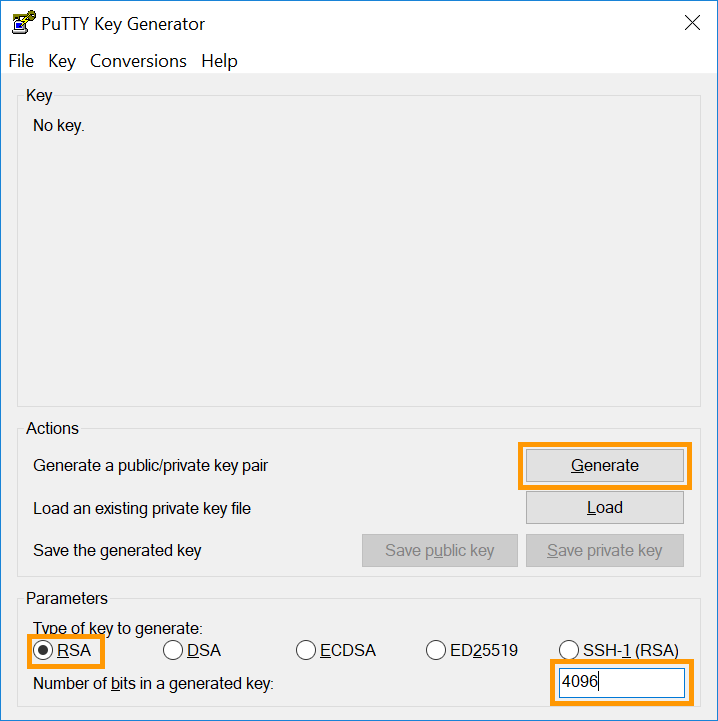
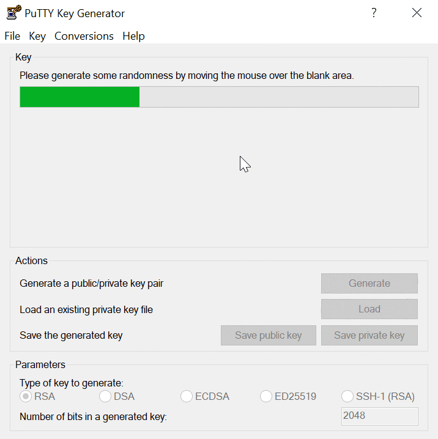
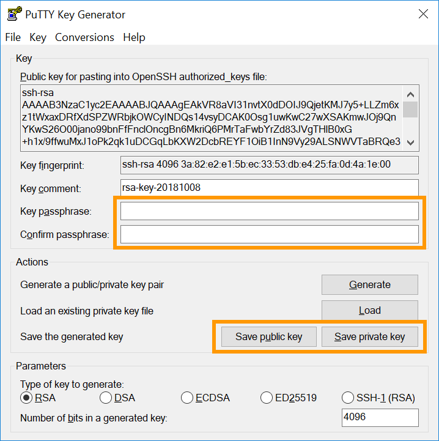
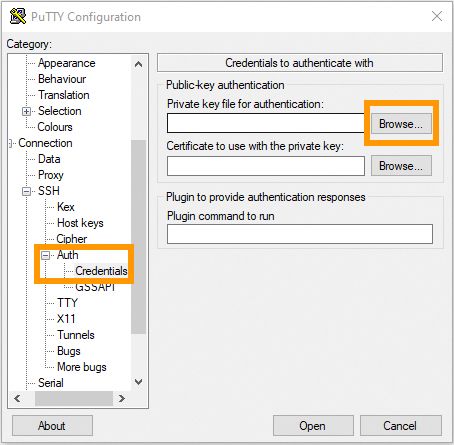
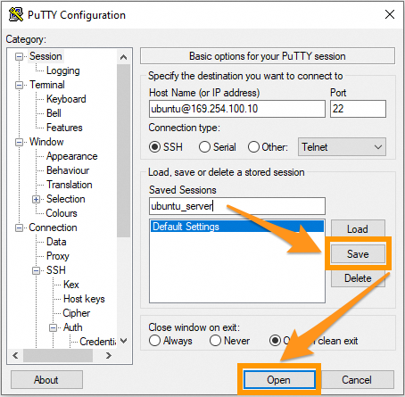
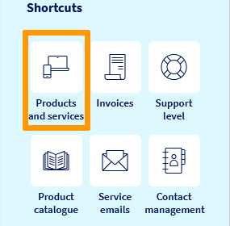
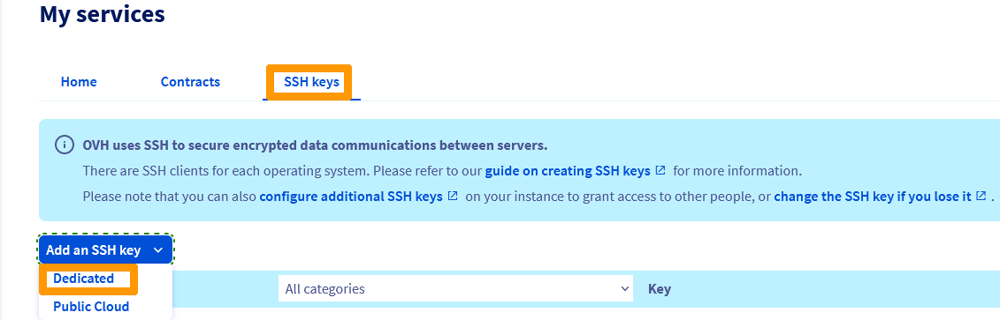
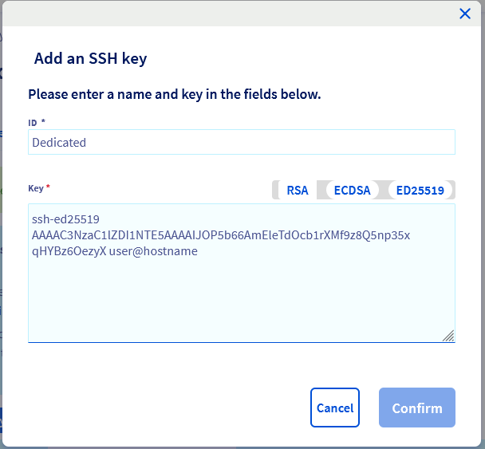

> [!primary]
> Questa traduzione è stata generata automaticamente dal nostro partner SYSTRAN. I contenuti potrebbero presentare imprecisioni, ad esempio la nomenclatura dei pulsanti o alcuni dettagli tecnici. In caso di dubbi consigliamo di fare riferimento alla versione inglese o francese della guida. Per aiutarci a migliorare questa traduzione, utilizza il pulsante "Contribuisci" di questa pagina.
>


## Obiettivo

L’utilizzo del protocollo SSH apre un canale sicuro su una rete non protetta in un’architettura client-server, collegando un client SSH a un server SSH. La creazione di un key pack SSH permette di ottenere una chiave pubblica e una privata. È possibile inserire la chiave pubblica su un server e quindi connettersi ad esso con un client che dispone della chiave privata corrispondente. Se le chiavi SSH pubblica e privata corrispondono, sarai connesso senza bisogno di una password.

Questo è in genere il metodo di connessione più sicuro e pratico.

**Questa guida ti mostra come configurare le chiavi SSH sul tuo dispositivo locale per rendere sicure le connessioni ai server remoti.**

## Prerequisiti

- Avere accesso allo [Spazio Cliente OVHcloud](https://www.ovh.com/auth/?action=gotomanager&from=https://www.ovh.it/&ovhSubsidiary=it)
- Disporre di un [server dedicato](https://www.ovhcloud.com/it/bare-metal/) o di un [VPS](https://www.ovhcloud.com/it/vps/) nel proprio account OVHcloud
- Installare preventivamente un'applicazione client SSH (riga di comando o GUI)
- Avere accesso in SSH (root)

> [!primary]
> Questa guida non si applica alle installazioni Windows Server standard in quanto basate sul `Remote Desktop Protocol` (RDP) per le connessioni. Le connessioni SSH vengono tuttavia utilizzate per la modalità Rescue di OVHcloud. Per maggiori informazioni consulta la sezione [Per saperne di più](#gofurther) di questa guida.
>

## Procedura

Per maggiori informazioni, consulta le nostre guide "Iniziare a muovere i primi passi": <a name="getstarted"></a>

- per un [server dedicato](/pages/bare_metal_cloud/dedicated_servers/getting-started-with-dedicated-server);
- per un [server dedicato della gamma Eco](/pages/bare_metal_cloud/dedicated_servers/getting-started-with-dedicated-server-eco);
- per un [VPS](/pages/bare_metal_cloud/virtual_private_servers/starting_with_a_vps).

Per maggiori informazioni, consulta la guida introduttiva del [protocollo SSH](/pages/bare_metal_cloud/dedicated_servers/ssh_introduction).

Le istruzioni seguenti riguardano due metodi di utilizzo delle chiavi SSH:

- [Creazione di una coppia di chiavi Open SSH e connessione a un server dal client SSH da riga di comando](#openssh)
- [Creazione di una coppia di chiavi `PuTTY` e connessione a un server dal client SSH `PuTTY`](#useputty)

È possibile utilizzare entrambi i metodi contemporaneamente, ma tieni presente che `PuTTY` mantiene i file di chiave in un formato specifico, rendendoli incompatibili con i file di chiave SSH creati con il client Open SSH.

Una chiave privata creata con il client SSH da riga di comando dovrà essere prima [convertita in formato `PuTTY` e viceversa](https://www.chiark.greenend.org.uk/~sgtatham/putty/faq.html#faq-ssh2-keyfmt){.external}.

### Creazione di una coppia di chiavi SSH da riga di comando <a name="openssh"></a>

Da un computer Mac o da una periferica su cui è installato un sistema operativo Linux*, aprire l'applicazione da riga di comando (`Terminal`).

Verificare che nella directory `$HOME` sia presente una cartella denominata `.ssh`. Se la cartella non esiste, crearla:

```bash
mkdir ~/.ssh
```

In un sistema operativo Windows* corrente, aprire il prompt dei comandi digitando "cmd" nella barra di ricerca (o aprire `PowerShell` dal menu).

Accedi alla directory `.ssh` dell’utente Windows attivo (di default: `C:\Users\WindowsUsername.ssh`):

```powershell
cd .ssh
```

<a name="createnewkey"></a>
Per creare una chiave RSA a 4096 bit, utilizzare il comando seguente:

```bash
ssh-keygen -b 4096
```

L'utilizzo dell'opzione `-t` con questo comando consente di specificare un metodo di crittografia alternativo, ad esempio:


```bash
ssh-keygen -t ed25519 -a 256
```

La riga di comando richiede di salvare la chiave appena creata nel file standard:

```console
Generating public/private rsa key pair.
Enter file in which to save the key (/home/user/.ssh/id_rsa):
```

Confermare con il tasto `Invio` per accettare il nome di file proposto o immettere un nome individuale. Ciò è rilevante se nella directory `.ssh` sono presenti più coppie di chiavi. Per maggiori informazioni, consulta la sezione "[Gestione di più chiavi SSH sul tuo dispositivo locale](#multiplekeys)" di questa guida.<br>
In questo esempio vengono utilizzati i nomi file standard `id_rsa` e `id_rsa.pub`.

Potete proteggere la vostra chiave SSH con una frase segreta (*passphrase*) all'operazione seguente. Questo è uno step consigliato per una maggiore sicurezza.

> [!warning]
>
> L'accesso remoto al server deve essere sicuro quanto il dispositivo client che memorizza la chiave privata. La protezione del tuo dispositivo e dei tuoi file contro gli accessi non autorizzati è fondamentale durante l'utilizzo delle chiavi SSH.
>
> Per motivi di praticità e sicurezza, ti consigliamo di utilizzare un gestore di password sul tuo dispositivo, come la soluzione open source `KeePass`.
>

Tutte le chiavi SSH devono essere archiviate nella directory `.ssh`. L'estensione `.pub` verrà aggiunta ai nomi dei file di chiave pubblica.

```console
Your identification has been saved in /home/user/.ssh/id_rsa.
Your public key has been saved in /home/user/.ssh/id_rsa.pub.
The key fingerprint is:
SHA256:MRk+Y0zCOoOkferhkTvMpcMsYspj212lK7sEauNap user@hostname
The key's randomart image is:
+---[RSA 4096]----+
|     .. o        |
|    . .= o       |
|   o o  X        |
|. . . .          |
|. .=.o .S.       |
| =o.o.  .   .    |
|o +   .  . o ..  |
|.. .  .   oEoo . |
|o.        .o+oo  |
+----[SHA256]-----+
```

<a name="publickey"></a>

Per visualizzare ed esportare la chiave pubblica, utilizzare il comando `cat` nel file di chiave `.pub`. Copiare la stringa di chiave completa negli Appunti per [aggiungerla al server](#addserverkey).

```bash
cat ~/.ssh/id_rsa.pub
ssh-rsa AAAAB3NzaC1yc2EAAAADAQABAAABAQC8teh2NJ42qYZV98gTNhumO1b6rMYIkAfRVazl
k6dSS3xf2MXJ4YHsDacdjtJ+evXCFBy/IWgdkFtcvsGAMZ2N1RdvhDyQYcy6NDaJCBYw1K6Gv5fJ
SHCiFXvMF0MRRUSMneYlidxUJg9eDvdygny4xOdC6c1JrPrSgOc2nQuKeMpOoOWLINIswg1IIFVk
kFMPrFivP8Z6tidzVpAtbr1sXmJGZazYWrU3FoK2a1sF1zEWrmlMOzX81zEWrmlMOzX8CpZW8Rae
i4ANmLy7NULWK36yU0Rp9bFJ4o0/4PTkZiDCsK0QyHhAJXdLN7ZHpfJtHIPCnexmwIMLfIhCWhO5
 user@hostname
```


> [!primary]
>
> In un terminale MacOS, potete utilizzare i comandi `pbcopy` e `pbpaste` per gestire le stringhe di tasti più velocemente. Ad esempio, utilizzare questo comando per copiare la chiave del file `id_rsa.pub` negli Appunti:
>
> `pbcopy < ~/.ssh/id_rsa.pub`
>

In un sistema operativo Windows, aprire il file utilizzando `Blocco note` da Esplora file (fare `clic con il tasto destro` sul file e selezionare `Apri con`) o utilizzare uno dei comandi seguenti (in `\Users\WindowsUsername\.ssh`):

- `cmd`

```powershell
more id_rsa.pub
```

- `powershell`

```powershell
cat id_rsa.pub
```

Copiare la stringa di chiave completa negli Appunti per [aggiungerla al server](#addserverkey).

> [!primary]
>
> Utilizzo degli Appunti
>
> Quando si lavora da riga di comando in Windows, fare un `clic destro` per incollare il contenuto degli Appunti nella finestra della riga di comando. Per copiare una stringa dalla finestra della riga di comando, evidenziarla con il mouse e premere il tasto `Invio`. Queste funzioni sono disponibili anche con un `click destro` sulla barra dei menu.
>

### Creare una coppia di chiavi SSH con PuTTY <a name="useputty"></a>

[PuTTY](https://putty.org/){.external} è un client SSH open source con interfaccia grafica utente, disponibile per Windows e altri sistemi operativi. che fornisce software aggiuntivo per creare chiavi SSH: `PuTTY Key Generator` (`PuTTYgen`).

> [!primary]
>
> L’obiettivo principale di `PuTTY` è quello di gestire le connessioni SSH di un dispositivo client Windows verso un server GNU/Linux. `PuTTY` archivia i file di chiave in un formato specifico, rendendoli incompatibili con i file di chiave SSH creati con il client Open SSH inclusi nativamente nella maggior parte dei sistemi operativi moderni.
>
> Se necessario e come spiegato in precedenza in questa guida, le chiavi generate in *riga di comando* possono essere [convertite nel formato `PPK`](https://www.chiark.greenend.org.uk/~sgtatham/putty/faq.html#faq-ssh2-keyfmt) per utilizzarle con il client `PuTTY`. Per un utilizzo più pratico delle chiavi SSH, scegli un’opzione e rispettala (chiavi private Open SSH o chiavi private `PuTTY`).
>

Se non è già installato (consulta la tua lista delle applicazioni o utilizza la funzione di ricerca), scarica `PuTTY` dal [sito ufficiale](https://www.greenend.org.uk/~sgtatham/putty/latest.html){.external}. Il pacchetto di installazione standard consigliato contiene già `PuTTYgen`, ma è disponibile anche come file autonomo sul sito Web.

Aprire `PuTTYgen` e selezionare uno degli algoritmi di crittografia supportati. In questo esempio viene utilizzato RSA. Inserisci 4096 come numero di bit nell’angolo inferiore destro e clicca sul pulsante `Generate`{.action}.

{.thumbnail}

Spostare liberamente il cursore del mouse nell'area sotto la barra di avanzamento:

{.thumbnail}

La chiave è pronta quando la barra di avanzamento è piena.

{.thumbnail}

Copiare la stringa di chiave completa negli Appunti per [aggiungerla al server](#addserverkey) ed eventualmente [importarla nello Spazio Cliente](#importkey). Salvare entrambe le chiavi come file facendo clic sui pulsanti corrispondenti e immettere anche una frase segreta (*passphrase*) per proteggerle.

> [!warning]
>
> L'accesso remoto al server deve essere sicuro quanto il dispositivo client che memorizza la chiave privata. La protezione del tuo dispositivo e dei tuoi file contro gli accessi non autorizzati è fondamentale durante l'utilizzo delle chiavi SSH.
>
> Per motivi di praticità e sicurezza, ti consigliamo di utilizzare un gestore di password sul tuo dispositivo, come la soluzione open source `KeePass`.
>

Uno dei vantaggi di utilizzare `PuTTY` è la possibilità di salvare diverse connessioni come "sessioni". Per maggiori informazioni, consulta la sezione "[Gestione di più chiavi SSH sul tuo dispositivo locale](#puttykeys)".

Per saperne di più sulle connessioni SSH, consulta le guide di [primi passi](#getstarted)" e la nostra introduzione al [protocollo SSH](/pages/bare_metal_cloud/dedicated_servers/ssh_introduction).

### Aggiungere chiavi SSH al tuo server <a name="addserverkey"></a>

[Accedi](/pages/bare_metal_cloud/dedicated_servers/ssh_introduction) al server e assicurati di trovarti nella directory `$HOME` dell’utente. Se non esiste già, crea la cartella `.ssh`:

```bash
mkdir ~/.ssh
```

Per archiviare la chiave per l’utente corrente, aprire (o creare) il file `authorized_keys` con l’editor di testo preferito (`nano` è utilizzato in questo esempio):

```bash
nano ~/.ssh/authorized_keys
```

Incolla la tua [chiave pubblica](#publickey) in questo file. Salvare il file e uscire dall'editor. Riavvia il server o riavvia il servizio OpenSSH utilizzando uno dei comandi seguenti (il comando appropriato può variare in base al sistema operativo):

```bash
sudo systemctl restart ssh
```

```bash
sudo systemctl restart sshd
```

Per verificare che la chiave sia stata configurata correttamente, accedi al server utilizzando questo comando. Sostituire "user" con il nome utente per il quale sono state create le chiavi e "IP_ADDRESS" con l'indirizzo IP (o il nome host) del server a cui si desidera accedere:

```bash
ssh user@IP_ADDRESS
```

Ad esempio:

```bash
ssh ubuntu@169.254.10.250
```

#### Aggiungere chiavi pubbliche supplementari al tuo server

Per aggiungere chiavi SSH ad altri utenti che accedono al tuo server, ripeti i passaggi di creazione della chiave ma utilizzi la cartella `$HOME` appropriata o la directory di Windows `Users` dell’utente in questione per creare e archiviare le chiavi SSH (o eseguire i comandi sul dispositivo dedicato di questa persona). Aggiungere quindi la nuova chiave pubblica al server in `authorized_keys`, come descritto in precedenza.

#### Elimina le chiavi pubbliche del tuo server

Aprire il file `authorized_keys` (come [descritto in precedenza](#addserverkey)) ed eliminare la stringa di chiave corrispondente all’utente il cui accesso deve essere revocato.

Salvare il file e uscire dall'editor.

### Gestione di più chiavi SSH sul tuo dispositivo locale <a name="multiplekeys"></a>

È possibile utilizzare più coppie di chiavi SSH per connettersi a diversi host remoti. Se utilizzi `PuTTY`, vai alla sezione [corrispondente](#puttykeys) qui sotto.

Poiché tutte le chiavi devono trovarsi nella cartella `.ssh` del dispositivo locale, i nomi dei file devono essere diversi. Quando [si crea una nuova coppia di chiavi](#createnewkey) e viene richiesto un nome di file, immettere il nome desiderato. Associalo al tuo nome di server ad esempio.

```console
Generating public/private rsa key pair.
Enter file in which to save the key (/home/user/.ssh/id_rsa): KeyFileName_rsa

Your identification has been saved in /home/user/.ssh/KeyFileName_rsa.
Your public key has been saved in /home/user/.ssh/KeyFileName_rsa.pub.
```

Quando ci si connette al server corrispondente, specificare il nome del file di chiave oltre ai dettagli dell'utente e del server:

```bash
ssh -i ~/.ssh/KeyFileName user@IP_ADDRESS
```

Ad esempio:

```bash
ssh -i ~/.ssh/myVPS_rsa ubuntu@169.254.10.250
```

Come indicato nelle sezioni precedenti, le stesse istruzioni funzioneranno su un client Windows. Sostituire solo `~/` con il percorso della cartella utente Windows, predefinito `C:\Users\WindowsUsername\`. Ad esempio: `ssh -i C:\Users\Username\.ssh/myVPS_rsa ubuntu@169.254.10.250`.

#### Utilizzo del file "config"

L'alternativa all'aggiunta dell'opzione `-i` ogni volta consiste nel modificare un file denominato `config` nella cartella `~/.ssh` (`\Users\Username\.ssh` per Windows). Permette di configurare i dettagli delle diverse connessioni (nome utente, porta, file di chiave, impostazioni opzionali, ecc...)

Se il file esiste in `.ssh`, probabilmente contiene già alcune informazioni. A seconda dell'ambiente di lavoro, valutare innanzitutto la possibilità di creare una copia di backup dell'originale.

Esempio di contenuto della cartella `.ssh`:

```bash
ls ~/.ssh/
config    id_rsa    id_rsa.pub    known_hosts     known_hosts.old
```

Il file di `config` permette di archiviare più connessioni SSH e i loro parametri individuali oltre ai valori standard. Sfruttare appieno il potenziale di questo file può diventare complesso, in quanto è particolarmente utile per gli utenti esperti che gestiscono regolarmente più server.

Ecco un semplice esempio per configurare una connessione SSH a un VPS.<br>
Aprire il file e aggiungere le righe seguenti nella parte superiore:

```console
Host vps
    HostName 169.254.10.250
    IdentityFile ~/.ssh/myVPS_rsa
```

Dopodiché potrai accedere al VPS con il nome di alias che hai definito come `Host`:

```bash
ssh ubuntu@vps
```

Nell'esempio precedente sono stati specificati solo l'IP del server e il file chiave, ma è possibile aggiungere ulteriori dettagli. Per configurare una connessione SSH a un secondo server con il nome utente "rocky", la [porta SSH modificata](/pages/bare_metal_cloud/virtual_private_servers/secure_your_vps#changesshport) "49160" e la chiave privata nel file "myserver_rsa", estendete il contenuto del file come indicato in questo esempio:


```console
Host vps
    HostName 169.254.10.250
    IdentityFile ~/.ssh/myVPS_rsa

Host dedicated_server
    HostName 169.254.10.251
    User rocky
    Port 49160
    IdentityFile ~/.ssh/myserver_rsa
```

Dopodiché potrai accedere a questo server inserendo:

```bash
ssh dedicated_server
```

Per maggiori informazioni, consulta la [pagina `man` corrispondente](https://manpages.org/ssh_config/5){.external}.

#### Utilizzo di PuTTY <a name="puttykeys"></a>

Se hai seguito le istruzioni delle sezioni "[Creazione di una coppia di chiavi SSH con `PuTTY`](#useputty)" e "[Aggiunta di chiavi SSH al tuo server](#addserverkey)", disponi di una coppia di chiavi che permettono di connetterti al tuo server.

`PuTTY` può salvare le credenziali e le impostazioni di una connessione SSH come `Session`. Inoltre, consente di connettersi a diversi server utilizzando chiavi singole.

Apri `PuTTY` e apri la sottosezione `SSH` nel menu a sinistra, poi clicca su `Auth` e `Credentials`.

{.thumbnail}

Clicca sul pulsante `Browse`{.action} e seleziona il file della chiave privata `PuTTY` (`keyfile.ppk`) nella cartella in cui è stato salvato.

Il file di chiave è associato alla sessione SSH in corso. Seleziona `Session` nel menu a sinistra e inserisci le credenziali di [connessione al server](#getstarted) (`username@IPv4_address`).

Immettere un nome per la connessione in `Saved Sessions` e fare clic su `Save`{.action} per aggiungerla alla lista.

{.thumbnail}

Da questo momento è possibile cliccare su questo elemento di `Session` e aprire una connessione al server. Per testarlo, clicca su `Open`{.action}. Se il file di chiave è stato protetto con una frase segreta, immetterla in questa fase.

Per configurare un'altra connessione al server, ripetere i passaggi seguenti:

- [Create la coppia di chiavi](#useputty).
- [Aggiungi la chiave pubblica al tuo server](#addserverkey).
- [Inserisci i dettagli del server e aggiungi il file di chiave in `PuTTY`](#puttykeys).


### Importa la chiave SSH nello Spazio Cliente <a name="importkey"></a>

Lo Spazio Cliente OVHcloud permette di archiviare chiavi pubbliche se sono state create con uno dei tipi di cifratura supportati. Questa funzionalità consente di risparmiare tempo durante la configurazione o la reinstallazione di un nuovo server in quanto non è necessario [aggiungere manualmente la chiave pubblica al server](#addserverkey).

Apri la barra di navigazione laterale cliccando sul tuo nome nell’angolo in alto a destra e utilizza il tasto di scelta rapida `Prodotti e servizi`{.action}.

{.thumbnail}

In `I miei servizi`, seleziona la scheda `Chiavi SSH`{.action} e clicca su `Aggiungi una chiave SSH`{.action}.

{.thumbnail}

Seleziona `Dedicato` nel menu a tendina.

Nella nuova finestra, inserisci un identificativo (un nome a tua scelta) per la chiave. Incollare la stringa di chiave (copiata dal [tuo file `.pub`](#publickey) o dal [finestra `PuTTYgen`](#useputty) nel campo `Key`).

{.thumbnail}

Se è stato copiato l'output completo, l'identificativo dopo la chiave deve essere già aggiunto. Per memorizzare la chiave, è necessario specificare l'identificativo locale dopo la chiave *incollata*. (Vedere il formato di esempio sopra). Questo è un requisito dello Spazio Cliente OVHcloud. Clicca su `Conferma`{.action} per salvare la chiave pubblica.

> [!primary]
>
> Tutte le chiavi registrate nella sezione `Dedicato` sono disponibili in preinstallazione su un server dedicato o un VPS. Per le chiavi SSH dei servizi Public Cloud, consulta la [presente guida](/pages/public_cloud/compute/public-cloud-first-steps).
>

### Definisci una chiave SSH di default (solo per la sezione "Dedicato") <a name="cpsshkey"></a>

Se nello Spazio Cliente OVHcloud sono state aggiunte più chiavi SSH, è possibile definire una chiave da utilizzare come chiave predefinita sull’account.

> [!warning]
> Ti ricordiamo che, una volta configurata la chiave predefinita, questa verrà utilizzata anche come modalità di connessione al riavvio di un server in modalità Rescue. Per ricevere una password, la chiave predefinita deve essere [disattivata](#disablesshkey) prima di riavviare il server in modalità Rescue. Per maggiori informazioni, consulta la sezione [Per saperne di più](#gofurther) di questa guida.
>

Apri la barra di navigazione laterale cliccando sul nome del tuo account nell’angolo in alto a destra e utilizza il tasto di scelta rapida `Prodotti e servizi`{.action} per accedere alla sezione `Chiavi SSH`{.action}.

{.thumbnail}

Nell’elenco delle chiavi, clicca sull’icona `Chiave` accanto alla chiave SSH di tua scelta per impostarla come chiave predefinita.

{.thumbnail}

Una volta effettuata questa operazione, compare un messaggio che conferma che la chiave è stata impostata come predefinita e l’icona `Chiave` viene evidenziata.

{.thumbnail}

### Disattiva la chiave SSH di default <a name="disablesshkey"></a>

Per disattivare la chiave SSH per predefinita corrente, accedi alla sezione `Chiavi SSH`{.action} come descritto sopra. Clicca sull’icona `Chiave` blu accanto alla chiave SSH corrispondente per disattivare l’opzione predefinita.

## Per saperne di più  <a name="gofurther"></a>

[Introduzione al protocollo SSH](/pages/bare_metal_cloud/dedicated_servers/ssh_introduction)

[Modalità Rescue su server dedicato](/pages/bare_metal_cloud/dedicated_servers/rescue_mode)

[Modalità Rescue su VPS](/pages/bare_metal_cloud/virtual_private_servers/rescue)

Se avete bisogno di formazione o di assistenza tecnica per implementare le nostre soluzioni, contattate il vostro rappresentante o cliccate su [questo link](https://www.ovhcloud.com/it/professional-services/) per ottenere un preventivo e richiedere un'analisi personalizzata del vostro progetto da parte dei nostri esperti del team Professional Services.

Contatta la nostra Community di utenti all’indirizzo <https://community.ovh.com/en/>.