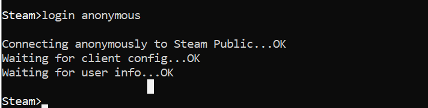
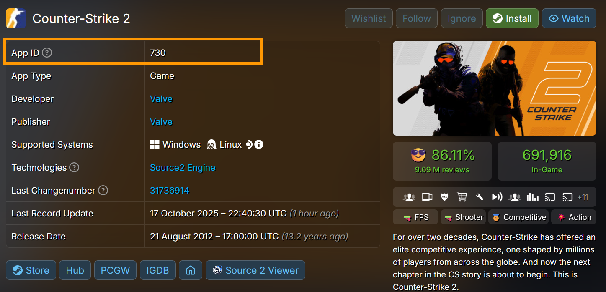
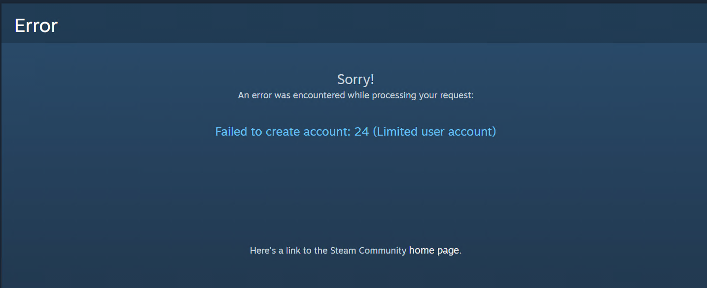

## Objective

Counter-Strike 2 (CS2) is an updated version of Counter-Strike: Global Offensive, developed by Valve.

This version offers new graphics, better contents and technical improvement. It has completely replaced Counter-Strike: Global Offensive.

You can set it up yourself on a Game [VPS](/links/bare-metal/vps) or on a Game [dedicated server](/links/bare-metal/bare-metal). This will reduce the cost and give you full control over your game instance.

**This tutorial explains how install a CS:GO server an OVHcloud Dedicated game server or VPS game server**

> [!warning]
> This guide will show you how to use one or more OVHcloud solutions with external tools, and will describe the actions to be carried out in a specific context. ou may need to adapt the instructions according to your situation.
>
> If you encounter any difficulties performing these actions, please contact a [specialist service provider](/links/partner) and/or discuss the issue with our community. You can find more information in the [Go further](#gofurther) section of this guide.
>

## Requirements

- A game [dedicated server](/links/bare-metal/game) or a game [VPS]() in your OVHcloud account
- A GNU/Linux or Windows distribution installed on the server
- Administrative access via SSH or remote desktop (Windows) to your server
- A basic understanding of GNU/Linux administration or Windows


## Instructions

> [!primary]
> All our Game dedicated servers have the Game Anti-DDoS intergrated. This is an additional network attack protection specifically designed to secure gaming applications against targeted attacks, ensuring stability and accessibility for gamers.
>
> You can find the list of protected games [here](/links/security/ddos)
>
> If you chose to host your game on a VPS (game or not) or any other solution, note that you will not benefit from this protection.


### Server configuration

When you order your server, you choose the operating system you want to use. Windows Server and Linux distributions are compatible with Rust. It is worth keeping in mind that you can always reinstall another operating system after your server has been delivered. For more information, consult the following guidesif necessary:

- [Getting started guide for a Dedicated server](pages/bare_metal_cloud/dedicated_servers/getting-started-with-dedicated-server#install)
- [Getting started guide for VPS](/pages/bare_metal_cloud/virtual_private_servers/starting_with_a_vps#reinstallvps) 

### Installing Counter-Strike 2 (CS2) on a Windows server

#### Minimum configuration requirements

**For a game Dedicated server**

  - Processor (CPU): 4 CPU (3 GHz)
  - Memory (RAM): 8 GB for 10-12 players, 16 GB for 24 players, 32 GB for 64 players 
  - Network: 1 Gbps bandwidth
  - Storage: 85 GB

If you have Windows server 2022 installed as your operating system, the following additional resources must be reserved for the OS:

  - Processor: 1.4 GHz (64-bit)
  - RAM: 2 GB (with GUI)
  - Hard Disk Space: 32 GB free space

**For a game VPS server**

  - 8 vCores (virtual processors)
  - 24 GB of RAM
  - 1.5 Gbps of bandwidth
  - Approximately 200 GB SSD NVMe of disk space

If you plan to host more than 10 players, you may experience slowdowns or bugs with 24 GB of RAM. In this case, it is recommended you upgrade your RAM.

We recommend opting for 200 GB SSD NVMe of storage space or more, depending on the mods you want to install. It will also be useful to create additional space to back up your data.


#### Step 1: Prepare the server and install SteamCMD

Since Counter-Strike 2 (CS2) is a free game, you can log into steam anonymously after installing the server via SteamCMD. However, this will only allow you to lauch the server as a private server over LAN (Local Area Network), if you have plans to launch your server as public one, you will need to create a [steam](https://store.steampowered.com/join/) account to link the server via a token.

1. Log on to your server via a remote desktop connection.
2. Create a folder on your disk (for example, C:\steamcmd).
3. Download [SteamCMD](https://steamcdn-a.akamaihd.net/client/installer/steamcmd.zip) for Windows.
4. Move the content of the file to your new folder, then double click on the execution file to launch the installation of SteamCMD.

This file, when executed, will download, install and update to the lastest version of SteamCMD.

Once the process is complete, you should have the following in your command prompt:

```powershell
Steam>
```

When next you want to start steam, you can run the following. Replace the values with your own:

```powershell
cd C:\steamcmd
steamcmd
```

#### Step 2: Install Counter-Strike 2 (CS2)

Run the following command to create a folder were you want to install Counter-Strike 2 (CS2). Replace `path` with the location and name of the folder:

```powershell
Steam>force_install_dir <path>
```

Example:

```powershell
Steam>force_install_dir C:\cs2-server
```

Where "C:" is the letter of the local Disk and "cs2-server" is the name of the folder to create.

Next, log into steam anonymously:

```powershell
Steam>login anonymous
```



Next, run the following command to install the latest version of the game.


```powershell
app_update 730 validate
```

You can retrieve the "Steam Application ID" for any game [here](https://steamdb.info/).



Once the installation is done, run the following command:

```powershell
quit
```

#### Step 3: Generate a token to connect to the game server (Game Server Login Token (GSLT))

After creating a CS:GO server (anonymously), you will only be able to deploy the game on a local network. If you want to deploy the game as a public server, you need to link the game to a steam account.

Access the game server management of your steam account [here](https://steamcommunity.com/dev/managegameservers). Under `Create a new game server account`, enter the necessary information:

 - App ID of the base game: 730
 - Memo (brief description of the server): Token for cs2 server

Click on `Create`{.action} to generate the token. Save the token.

If you receive the following message:



Please consult the steam [faq](https://help.steampowered.com/en/faqs/view/71D3-35C2-AD96-AA3A) and contact their support for additional instructions.

#### Step 4: Opening the ports

For your players to connect to the cs:go game from your server, you will need to open certain ports on your machine:

   - TCP: 27015/27016
   - UDP: 27015/27016
   

If you have a firewall configured, you will need to open these ports through it. Consult the following guides for additional information:

- [Configuring the firewall on Windows ](/pages/bare_metal_cloud/dedicated_servers/activate-port-firewall-soft-win).
- [Configuring the firewall on Linux with iptables](/pages/bare_metal_cloud/dedicated_servers/firewall-Linux-iptable/).


> [!primary]
> For dedicated Game servers, these ports also need to be configured in the Game firewall with a rule to allow UDP traffic. For more information, consult this guide [How to protect a Game server with the application firewall](/pages/bare_metal_cloud/dedicated_servers/firewall_game_ddos).
>

#### Step 5: Configuring the game mode

> [!primary]
> Checkout the contents of the `gamemodes.txt` file for all the modes and game types. This file will be available in the directory in which the Counter-Strike 2 (CS2) server is installed.
>

Counter strike offers a variety of gamemodes, the commands to run depends on the game mode you want to launch, the most popular Counter-Strike 2 (CS2) game modes are:


  - **Competitive**: This is a primary matchmaking mode. In this mode, players (5 players per team) compete in a bomb defusal match.
  - **Premier mode**: This is a primary matchmaking mode. In this mode, players participate in a map veto to select the active maps before the match begins.
  - **Wingman**: This is a two vs two mode (only two players per team) the maps are smaller, contains less players and there is only one bomb defusal site. The first to win nine rounds wins the match.
  - **Casual**: This is another bomb defusal mode, with no ranking system  and an increase of the player count substantially. It is less intense than competitive mode.
  - **Arms Race**. In this mode, players progress through a series of predefined weapons by eliminating enemies. The goal is to be the first to obtain the last weapon and get a kill with it to win the game.
  - **Deathmatch**. In this mode, participants compete for the largest number of kills within a defined time frame, with instant respawns.
  - **Demolition**. In this mode, people fight in fast rounds where each elimination gives you a new weapon. The goal is to win rounds by eliminating all members of the opposing team or by planting a bomb.
  - Classic Casual:
  

Connect to your server via remote desktop and access the directory where cs:go server was installed and search for the `csgo\cfg` folder.


#### Step 5: Launch the CS:GO server

Connect to your server via remote desktop and open the command prompt. 

Next, access the folder where the game was installed, in our example:

```powershell
cd C:\csgo-server
```

Next, you can start the CS:GO server in the directory. 

Depending on how you have decided to launch your server (over local network or public network) you will need to adjust the commands.

For example, if we want to launch the deathmatch game mode over local network (LAN) only, we run the following command:

```powershell
C:\csgo-server> 


srcds -game csgo -console -usercon +game_type 1 +game_mode 2 +mapgroup mg_allclassic +map de_dust
srcds -game csgo -console -usercon +game_type 0 +game_mode 0 +mapgroup mg_active +map de_dust2 +sv_setsteamaccount INDIVIDUAL GAME SERVER LOGIN TOKEN
```