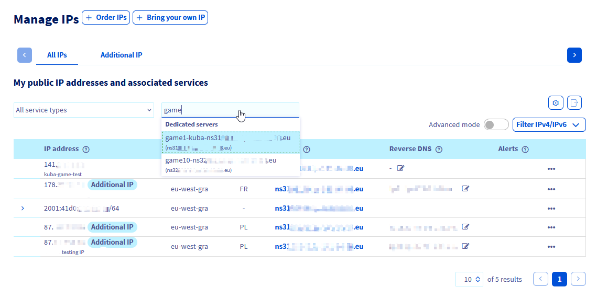

--- 
title: Game Server mit der Application Firewall schützen
excerpt: Erfahren Sie hier, wie Sie die OVHcloud Game DDoS Protection Firewall konfigurieren
updated: 2024-10-24
---

<style>
details>summary {
    color:rgb(33, 153, 232) !important;
    cursor: pointer;
}
details>summary::before {
    content:'\25B6';
    padding-right:1ch;
}
details[open]>summary::before {
    content:'\25BC';
}
</style>

> [!primary]
> Diese Übersetzung wurde durch unseren Partner SYSTRAN automatisch erstellt. In manchen Fällen können ungenaue Formulierungen verwendet worden sein, z.B. bei der Beschriftung von Schaltflächen oder technischen Details. Bitte ziehen Sie im Zweifelsfall die englische oder französische Fassung der Anleitung zu Rate. Möchten Sie mithelfen, diese Übersetzung zu verbessern? Dann nutzen Sie dazu bitte den Button "Beitragen" auf dieser Seite.
>

## Ziel

In dieser Anleitung wird die Funktionsweise der Game DDoS Protection (auch bezeichnet als *Game Firewall*) erläutert und Anweisungen zur Konfiguration eines effektiven Schutzes erklärt.

> [!primary]
> Weitere Informationen zur [Game DDoS Protection finden Sie auf unserer Website](/links/security/ddos).
>

Unsere Bare Metal Game Dedicated Server sind mit einem zusätzlichen Schutz vor Netzwerkangriffen ausgestattet, der speziell entwickelt wurde, um Gaming-Anwendungen vor gezielten Angriffen zu schützen und Stabilität und Zugänglichkeit für Gamer zu gewährleisten. Diese Lösung für dedizierten Schutz ist sowohl robust als auch einfach zu bedienen. So können Sie sich auf die Entwicklung Ihres Unternehmens konzentrieren, ohne von Maßnahmen gegen Cyberkriminalität abgelenkt zu sein.

|  |
|:--:|
|DDoS-Schutz & Infrastruktur bei OVHcloud |

## Voraussetzungen

- Sie haben einen [OVHcloud **Game** Dedicated Server](/links/bare-metal/bare-metal/game).
- Sie haben Zugriff auf Ihr [OVHcloud Kundencenter](/links/manager).

> [!warning]
> Diese Funktion kann nur eingeschränkt oder nicht verfügbar sein, falls ein Dedicated Server der [**Eco** Produktlinie](/links/bare-metal/eco-about) eingesetzt wird.
>
> Weitere Informationen finden Sie auf der [Vergleichsseite](/links/bare-metal/eco-compare).

## In der praktischen Anwendung

### Einführung

Die Anti-DDoS-Infrastruktur sorgt zusammen mit der Edge Network Firewall dafür, dass das Netzwerk vor gängigen Bedrohungen geschützt ist (hauptsächlich durch ISO OSI Ebenen 3 und 4). Gaming-Anwendungen zu hosten, kann jedoch eine Herausforderung für die Netzwerksicherheit darstellen. OVHcloud **Game DDoS Protection** setzt hier als spezielle Lösung an: Es handelt es sich um eine Layer 7 Application Firewall, die auf den Schutz bestimmter Gaming-Protokolle fokussiert ist.  
Die Hauptvorteile:

- **Sehr niedrige Latenzzeiten**: Latenz und ihre Stabilität sind für Online-Gaming entscheidend. Die Lösungen befinden sich so nahe wie möglich an den Servern und arbeiten mit leistungsstarker Hardware zusammen.
- **2-Wege**: Die Plattform analysiert den ein- und ausgehenden Traffic, um die Situation von Spielern besser zu verstehen.
- **Instant**: Legitimer Traffic kann von schädlichen Angriffen auf einen Server von den ersten Netzwerkpaketen an unterschieden werden.
- **Always-On**: Die Fähigkeit, Angriffe zu erkennen und abzuwehren, sorgt für ein reibungsloses Spielerlebnis für sensible Spieleanwendungen ohne Unterbrechungen und Latenzschwankungen.

### Aktivieren und Konfigurieren der Game DDoS Protection

> [!primary]
> Die *Game Firewall* schützt die einem Server zugeordnete IP-Adresse. Wenn Sie einen Server mit mehreren IP-Adressen ([Additional IPs](/links/network/additional-ip)) einsetzen, müssen diese separat konfiguriert werden.
>

Melden Sie sich im OVHcloud Kundencenter an und befolgen Sie die folgenden Schritte, um die Spielschutzregeln für Ihren Game Dedicated Server zu konfigurieren:

- Öffnen Sie den Bereich `Bare Metal Cloud`{.action}.
- Gehen Sie zu `Netzwerk`{.action} in der linken Seitenleiste.
- Öffnen Sie `IP`{.action}.

Sie können IP-Adressen mit dem Dropdown-Menü `Alle Dienste`{.action} filtern. Geben Sie den Namen oder die Kategorie des Servers ein:
|  |
|:--:|
| IP-Liste: Finden Sie Ihre IP-Adresse durch den entsprechenden Dienst. |

Navigieren Sie zur *Game Firewall* Konfiguration:
|  |
|:--:|
| Klicken Sie auf `...`{.action} neben der IP-Adresse Ihres Game Dedicated Servers. |

|  |
|:--:|
| Klicken Sie auf `GAME Firewall konfigurieren`{.action}. |

Nun können Sie die Spielschutzregeln für die ausgewählte IP-Adresse konfigurieren.

> [!primary]
> Beachten Sie, dass Game DDoS Protection keine Aktion ausführt, solange keine Spielschutzregeln konfiguriert sind.
>

Um Game DDoS Protection zu aktivieren, definieren Sie die Spieleanwendungen und die zugehörigen Netzwerk-Ports:

|  |
|:--:|
| Klicken Sie auf die Schaltfläche `Regel hinzufügen`{.action}, um eine Regel zur *Game Firewall* hinzuzufügen. |


Mit der Game DDoS Protection können Sie bis zu **100 Regeln pro IP-Adresse** konfigurieren, die auf einen Game Dedicated Server der dritten Generation verweisen (Servermodelle ab 2024), oder bis zu **30 Regeln pro IP-Adresse** für die älteren Bare Metal Reihen (üblicherweise als RISE-GAME oder SYS-GAME bezeichnet).

Beachten Sie, dass sich die unterstützten Spielprotokolle (Spieltitel und -versionen, die geschützt werden können) im Laufe der Zeit ändern. Darüber hinaus können sie sich zwischen älteren Bare Metal Game Serverreihen und neueren Modellen unterscheiden. Die aktuellste Liste der unterstützten Spielprofile finden Sie [hier](/links/security/ddos).

|  |
|:--:|
| Konfigurieren Sie den Schutz, indem Sie ein **Protokoll** aus der Liste auswählen und den **Portbereich** definieren, über den Ihre Spielanwendung Verbindungen empfängt (weitere Informationen finden Sie in der Einrichtungsdokumentation des Spiels). Klicken Sie dann auf die Schaltfläche `Bestätigen`{.action}, um zu speichern. Sie haben damit erfolgreich *Game Firewall* Regeln konfiguriert. |

Die Schutzregeln der *Game Firewall* dürfen sich hinsichtlich der definierten Ports nicht überschneiden.

Die Option **Andere** kann für Anwendungen auf nicht gelisteten Ports ausgewählt werden (für die kein Schutz verfügbar ist), um den Client-Datenverkehr passieren zu lassen. Beachten Sie, dass der mit der Regel **Andere** empfangene Traffic nicht besonders sicher ist und diese Option mit Vorsicht verwendet werden sollte.

Außerdem empfehlen wir dringend, die Regel **"Default policy = DROP"** für jede IP, die auf Ihren Game Dedicated Server verweist, einzurichten. Mit dieser Option kann Game DDoS Protection jeglichen Traffic löschen, der nicht den festgelegten Regeln entspricht. Das heißt, alle aufgeführten Spielanwendungen werden geschützt und keine anderen Verbindungen können Ihren Server erreichen.

> [!warning]
> Game DDoS Protection wird erst hinter den Regeln der [Edge Network Firewall](/pages/bare_metal_cloud/dedicated_servers/firewall_network) wirksam. Damit beide ordnungsgemäß funktionieren, darf die Edge Network Firewall nicht zu strikt eingestellt sein und muss Traffic an die Game DDoS Protection weiterleiten.
>

### Spielspezifische Hinweise

#### Ark Survival Evolved

- **Ark Survival Evolved**: Basis-Schutz-Engine
- **Ark Survival Evolved v.311.78**: Aktualisierte Schutz-Engine, hinzugefügt in der 3. Generation Bare Metal Game Server (Version 2024)

#### Counter Strike 2

- **Counter Strike 2**: Neue Schutz-Engine der 3. Generation Bare Metal Game Server (Version 2024)

#### FiveM

- **FiveM** ist ein Grand Theft Auto V Multiplayer Mod von *Cfx.re*, der mittlerweile vom Herausgeber Rockstar anerkannt wird. Unterstützung für FiveM wurde in der dritten Generation Bare Metal Game-Server (Version 2024) hinzugefügt.

#### Rust

- **Rust** wird von einem dedizierten Schutzprofil auf allen Generationen von Bare Metal Game Servern unterstützt. Beachten Sie, dass wir dieses Schutzprofil (d. h. Unterstützung von *RakNet* Cookies) für die dritte Generation von Game Dedicated Servern (Version 2024) aktualisiert haben.  
Weitere Informationen zum Hosting von Rust auf OVHcloud Servern finden Sie [hier](/links/bare-metal/bare-metal/game-rust).

#### Minecraft

Minecraft wird von folgenden Profilen unterstützt:

- **Minecraft Java**: Es sollte für alle Versionen von Minecraft Java am besten geeignet sein; schützt das Minecraft Query Protokoll und ist für TCP-Datenverkehr optimiert. Es wurde 2024 hinzugefügt aber ist auch für frühere Generationen von Game Dedicated Servern verfügbar. Seien Sie vorsichtig, wenn andere UDP-relevante Spiele auf derselben IP gehostet werden.
- **Minecraft Query**: Es bietet allgemeinen Minecraft Query Protokollschutz.
- **Minecraft Bedrock**: Minecraft Bedrock Schutz (mit *RakNet* Cookies-Unterstützung), hinzugefügt in der 3. Generation von Bare Metal Game Servern (Version 2024).
- **Minecraft Pocket Edition**: Minecraft PE/Bedrock Schutz.

#### Valheim

- **Valheim**: Neue Schutzengine in der 3. Generation der Bare Metal Game Server hinzugefügt (Version 2024).

> [!primary]
> Wenn Sie einen größeren Dienst mit einem der unterstützten Spiele hosten, aber dennoch Fehlalarme seitens der Anti-DDoS-Infrastruktursysteme feststellen, wenden Sie sich an unseren Support mit allen Details, um das Anwendungsprofil zu optimieren. Verwenden Sie dazu das [Help Center](https://help.ovhcloud.com/csm?id=csm_get_help).

### Additional IPs mit Game Dedicated Servern verwenden

Additional IPs bieten eine flexible Möglichkeit, Anwendungen über mehrere Server oder gehostete Dienste hinweg zu verwalten. Sie bieten einen Mehrwert für Ihre Hosting-Infrastruktur, da Skalierbarkeit und Failover-Maßnahmen ohne Auswirkungen auf öffentliche IP-Adressen verwaltet werden können. Mit Additional IPs können Sie auch verschiedene geografische IP-Standorte definieren oder sogar Ihren eigenen IP-Block (über den BYOIP-Dienst) für OVHcloud Game Server nutzen.

Additional IPs ermöglichen Flexibilität, doch gibt es hierbei Situationen, die zusätzliche Aufmerksamkeit erfordern.

#### Pro-IP-Konfiguration für eine Game Server-Generation

Um eine möglichst flexible Konfiguration zu gewährleisten, können für verschiedene Additional IPs, die auf den gleichen Game Dedicated Server verweisen, verschiedene Spieleschutzregeln festgelegt werden.  
Die maximale Anzahl von Regeln und verfügbaren Schutzeinstellungen gilt pro IP-Adresse, ist jedoch spezifisch für die betreffende Generation von Game Dedicated Servern hinter der Firewall.

Zwischen den neueren Game Servern (ab 2024 veröffentlichte Game Bare Metal Server) und den älteren Game Servern (frühere Generationen, üblicherweise RISE-GAME oder SYS-GAME) können Unterschiede zu beobachten sein.

##### Überprüfen des unterstützten Spielschutzes

Alle unterstützten Protokolle der Game DDoS Protection für einen bestimmten Server sind auf der Konfigurationsseite `GAME Firewall`{.action} für jede IP-Adresse, die auf diesen Server verweist, im Dropdown-Menü `Game Protocol`{.action} zu sehen:

|  |
|:--:|
| Liste der unterstützten Schutzprotokolle |

Wenn Sie Automatisierung einsetzen, können Sie Protokolldetails über die OVHcloud APIv6 abrufen:

> [!api]
>
> @api {v1} /ip GET /ip/{ip}/game/{ipOnGame}
>

Beispiel für eine API-Antwort:

```python
{
    ipOnGame: "1.2.3.4"
    maxRules: 30
    state: "ok"
    firewallModeEnabled: true
  - supportedProtocols: [
        "arkSurvivalEvolved"
        "arma"
        "gtaMultiTheftAutoSanAndreas"
        "gtaSanAndreasMultiplayerMod"
        "hl2Source"
        "minecraftPocketEdition"
        "minecraftQuery"
        "mumble"
        "other"
        "rust"
        "teamspeak2"
        "teamspeak3"
        "trackmaniaShootmania"
    ]
}
```


#### Verschieben einer Additional IP zwischen Servern

Eine statische Regelsatzkonfiguration ist zwar selbsterklärend, aber für IP-Verschiebungsaktionen können einige zusätzliche Anmerkungen hilfreich sein.

- **IP von einer alten auf eine neue Generation von Game Dedicated Servern übertragen:**
    - Der Prozess ist transparent und alle Schutzregeln und IP-Einstellungen werden beibehalten.

- **IP von einer neuen Generation auf eine alte Generation von Game Dedicated Servern übertragen:**
    - Wenn der Zielserver weniger Schutzregeln als die Quelle unterstützt, wird ein Fehler angezeigt und die Aktion beendet.
    - Andernfalls:
        - Abwärtskompatible Regeln werden beibehalten (der Name des Schutzprofils muss übereinstimmen).
        - Regeln, die auf dem Zielserver nicht unterstützt werden, werden entfernt.

- **IP von einem Game Dedicated Server auf andere Server oder Dienste übertragen:**
    - Alle auf die IP angewendeten Regeln der Game DDoS Protection werden gelöscht, da sie außerhalb der Bare Metal Game Server nicht unterstützt werden.


## FAQ

/// details | **Kann ich Game DDoS Protection auch für andere Reihen als Game Dedicated Server verwenden?**

Nein, Game DDoS Protection ist nur für unsere Bare Metal Game Server verfügbar.

///

/// details | **Wie kann sichergestellt werden, dass die Automatisierung für eine Additional IP zwischen einer neuen und einer alten Generation von Game Dedicated Servern funktioniert?**

Sie können die Schutzregeln entweder auf 30 pro IP beschränken oder die Automatisierungsskripte so konfigurieren, dass sie Regeln vor und nach dem Verschieben einer IP auf einen anderen Server entfernen und hinzufügen können. Wir empfehlen, die neueste Generation von Game Dedicated Servern zu verwenden, da sie viele Verbesserungen enthalten.

///

/// details | **Kann ich Game DDoS Protection deaktivieren?**

Dies ist möglich, wird aber nicht empfohlen. Sie können dies tun, indem Sie alle Spielprotokollregeln aus der Konfiguration entfernen und den Eintrag `Default policy: DROP` deaktivieren.

///

/// details | **Mein Spiel ist nicht in der Liste der unterstützten Protokolle. Was kann ich tun?**

Sie können Ihre Anforderungen in unserer [Roadmap für Infrastrukturlösungen auf GitHub](https://github.com/orgs/ovh/projects/16/views/14) vorschlagen. Dies wird uns helfen, Prioritäten für die nächsten zu entwickelnden Funktionen zu setzen.

///

/// details | **Obwohl ich mein Spiel mit den entsprechenden Ports und der Standardrichtlinie "DROP" konfiguriert habe, erhalte ich immer noch Angriffe, die meinen Game Dedicated Server betreffen. Was ist zu tun?**

Sichern Sie relevante Traffic Dumps (*.pcap*-Datei) die beispielhaft für solche Angriffe sind, um eine Schutzoptimierung Ihres Profils anzufordern und loggen Sie sich im [Help Center](https://help.ovhcloud.com/csm?id=csm_get_help) ein, um diese an den Support zu übermitteln.

///

## Weiterführende Informationen

Wenn Sie Schulungen oder technische Unterstützung bei der Implementierung unserer Lösungen benötigen, wenden Sie sich an Ihren Vertriebsmitarbeiter oder klicken Sie auf [diesen Link](/links/professional-services), um einen Kostenvoranschlag zu erhalten und eine persönliche Analyse Ihres Projekts durch unsere Experten des Professional Services Teams anzufordern.

Treten Sie unserer [User Community](/links/community) bei.