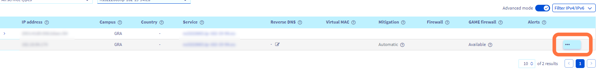
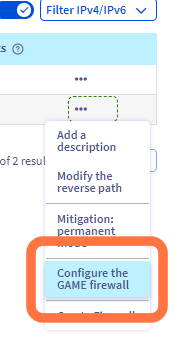
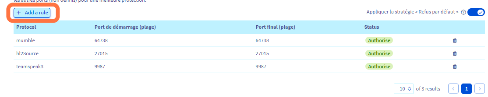
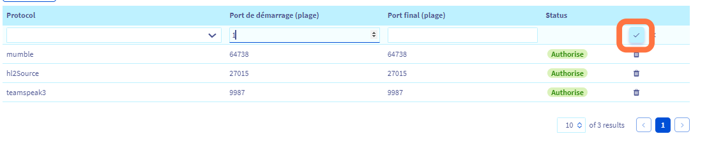

## Objective

This guide's objective is to help you better understand our GAME DDoS protection (GAME firewall) and to provide instructions on how to configure effective protection for servers that support it.

> [!primary]
> Find more information on our GAME DDoS protection on our website: <https://www.ovhcloud.com/en-ca/security/game-ddos-protection/>.
> 

Our dedicated Bare Metal gaming servers include a DDoS protection specifically designed to secure gaming applications against targeted attacks, ensuring stability and accessibility for gamers. This dedicated protection solution is both robust and easy to use, allowing you to focus on developing your business without the distraction of defending against cybercrime.

|  |
|:--:|
| Anti-DDoS infrastructure & game protection services diagram at OVHcloud |

## Requirements

- An [OVHcloud **Game** dedicated server](https://www.ovhcloud.com/en-ca/bare-metal/prices/#filterType=range_element&filterValue=game)
- Access to the [OVHcloud Control Panel](/links/manager)

> [!warning]
> This feature might be unavailable or limited on servers of the [**Eco** product line](https://eco.ovhcloud.com/en-ca/about/).
>
> Please visit our [comparison page](https://eco.ovhcloud.com/en-ca/compare/) for more information.

## Instructions

### Introduction

The Anti-DDoS infrastructure, together with the Edge Network firewall, keeps the network safe from common threats (mostly focused on ISO OSI layers 3 and 4). On the other hand, hosting gaming applications can be a challenging experience in terms of network security. GAME DDoS Protection is here to help - this is a Layer 7 (application) firewall focused on protecting specific gaming protocols (usually using UDP). Its main advantages are:

- **Distance**: We know that latency and its stability is crucial for gaming. These solutions are put as close as possible to the servers and work together with dedicated hardware.
- **2-way**: The platform analyses incoming and outgoing traffic for best understanding of every player's situation.
- **Instant**: It can distinguish real players from harmful attacks on a server from the very first network packets.
- **Always-on**: The ability to detect and stop attacks ensures a smooth experience for sensitive gaming applications without any disruptions and latency changes.

### Enabling the GAME DDoS Protection

> [!primary]
> The GAME firewall protects the IP associated with a server. As a result, if you have a server with multiple IP addresses (i.e. Additional IP addresses), you need to configure each of them separately.
>

To configure gaming rules in the GAME firewall, log in to the OVHcloud Control Panel and follow these steps:

- Click the `Bare Metal Cloud`{.action} tab.
- Go to `Network`{.action} in the left-hand sidebar.
- Open `IP`{.action}.

|  |
|:--:|
| Click on the `...`{.action} button next to the IP address of your game server. |

|  |
|:--:|
| Click on `Configure the GAME firewall`{.action}. |

|  |
|:--:|
| On the following screen, click the `Add a rule`{.action} button to add a rule to the GAME firewall. |

You can set up to **30 rules per IP** to protect one or more games hosted on your server behind the GAME firewall. The list of supported game profiles can be seen [here](https://www.ovhcloud.com/en-ca/security/game-ddos-protection/).

> [!primary]
> By default, the GAME firewall is preconfigured with certain rules that OVHcloud has determined work with the most popular games. However, for customers with a GAME Dedicated Server, we allow to go one step further and configure rules for ports as well.
> 

|  |
|:--:|
| Enable the ports as needed on the following screen and click on the `Confirm`{.action} button when you are finished adding your rules. You have now successfully configured GAME firewall rules. |

> [!primary]
> It is important to note that GAME DDoS protection will not take any action unless rules are configured.
>
> In addition, for the best protection, we strongly recommend that you set "Default policy = DROP", which will drop any traffic that does not match the defined rules. This way the listed application will be protected and nothing else will be able to reach your server.
> 

> [!warning]
> GAME DDoS protection takes effect after the [Edge Network firewall](/pages/bare_metal_cloud/dedicated_servers/firewall_network). For it to work properly, the Edge Network protection cannot be too strict and needs to pass traffic to the GAME DDoS protection. It would be optimal to have a rule on the Edge Network firewall that allows all UDP traffic, and then let the GAME DDoS protection filter the specific UDP ports.
>

### Important notices

#### FiveM

FiveM is a mod of GTA V. Currently it is not fully recognized by Rockstar (game publisher).

Due to this, we do not plan to release a public FiveM GAME firewall profile for layer 7 protection.

#### Rust

GAME firewall supports Rust with a detailed profile. You can read more about hosting Rust on OVHcloud servers [here](https://www.ovhcloud.com/en-ca/bare-metal/game/rust-server/).

#### Minecraft

Minecraft is well supported in the following versions:

- Minecraft Java edition 
- Minecraft Pocket Edition
- Minecraft Query

> [!primary]
> For now Minecraft Java edition is protected in "default" mode and no additional setup is exposed. If you host bigger Minecraft servers, or with specific requirements, please reach our support using the [Help Centre](https://help.ovhcloud.com/csm?id=csm_get_help) with all the details to tune up the application profile.
>

## FAQ

### Can I use GAME firewall on other ranges than Bare Metal game servers?

No, GAME firewall is only available for our Bare Metal game dedicated servers.

### Can I disable GAME firewall protection?

This is possible, if not recommended. You can do it by removing all game protocol rules from the configuration and disabling `Default policy: Drop`.

### My game is not on the supported protocol list, what can I do?

You can propose your need on our [infrastructure solutions roadmap on GitHub](https://github.com/orgs/ovh/projects/16/views/14). This will help us to decide on prioritisation of the next features to be developed.

### While having configured my game with appropriate ports and default policy to drop, I still receive attacks that are impacting my game server. What to do?

For that you will need to share relevant network traffic dumps as examples for such attacks (*.pcap* file) and request protection tuning of your profile. This can be done using our [Help Centre](https://help.ovhcloud.com/csm?id=csm_get_help).

## Go further

If you need training or technical assistance to implement our solutions, contact your sales representative or click on [this link](https://www.ovhcloud.com/en-ca/professional-services/) to get a quote and ask our Professional Services experts for assisting you on your specific use case of your project.

Join our [community of users](/links/community).