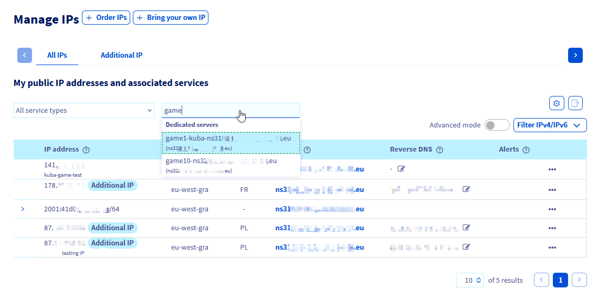
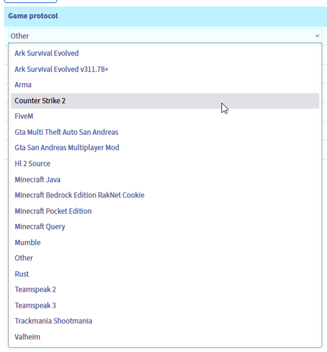

title: "Protecting a game server with the application firewall"
excerpt: "Learn how to configure the OVHcloud GAME DDoS firewall"
updated: 2024-09-24
---

## Objective

This guide's objective is to help you better understand our GAME DDoS Protection (also known as GAME firewall) and to provide instructions on how to configure effective protection.

> [!primary]
> Find more information on our GAME DDoS Protection on our website: <https://www.ovhcloud.com/en-gb/security/game-ddos-protection/>.
> 

Our dedicated Bare Metal gaming servers include an additional network attack protection specifically designed to secure gaming applications against targeted attacks, ensuring stability and accessibility for gamers. This dedicated protection solution is both robust and easy to use, allowing you to focus on developing your business without the distraction of defending against cybercrime.

|  |
|:--:|
| Anti-DDoS infrastructure & game protection services diagram at OVHcloud |

## Requirements

- An [OVHcloud **Game** dedicated server](https://www.ovhcloud.com/en-gb/bare-metal/prices/#filterType=range_element&filterValue=game#filterType=range_element&filterValue=game)
- Access to the [OVHcloud Control Panel](/links/manager)

> [!warning]
> This feature might be unavailable or limited on servers of the [**Eco** product line](https://eco.ovhcloud.com/en-gb/about/).
>
> Please visit our [comparison page](https://eco.ovhcloud.com/en-gb/compare/) for more information.

## Instructions

### Introduction

General Anti-DDoS Infrastructure, together with the Edge Network firewall, keeps the network safe from common threats (mostly focused on ISO OSI layers 3 and 4). On the other hand, hosting gaming applications can be a challenging experience in terms of network security. **GAME DDoS Protection** is here to help - this is a Layer 7 (application) firewall focused on protecting specific gaming protocols. Its main advantages are:

- **Very low latency**: We know that latency and its stability is crucial for online gaming. These solutions are put as close as possible to the servers and work together with a high-performance hardware.
- **2-way**: The platform analyses incoming and outgoing traffic for best understanding of every player's situation.
- **Instant**: It can distinguish real players from harmful attacks on a server from the very first network packets.
- **Always-on**: The ability to detect and stop attacks ensures a smooth experience for sensitive gaming applications without any disruptions and latency changes.

### Enabling and configuring GAME DDoS Protection

> [!primary]
> The GAME firewall protects the IP associated with a server. As a result, if you have a server with multiple IP addresses (i.e. Additional IP addresses), you need to configure each of them separately.
>

To configure game protection rules for your Bare Metal game server, log in to the OVHcloud Control Panel and follow these steps:

- Click the `Bare Metal Cloud`{.action} tab.
- Go to `Network`{.action} in the left-hand sidebar.
- Open `IP`{.action}.

You can filter IP listing by using `All services`{.action} drop-down field and type-in name/category of your corresponding server there:
|  |
|:--:|
| IP listing: find your IP address by corresponding service |

Then, for the selected IP, navigate to the GAME firewall configuration:
|  |
|:--:|
| Click on the `...`{.action} button next to the IP address of your game server. |

|  |
|:--:|
| Click on `Configure the GAME firewall`{.action}. |

Now, you can configure game protection rules for such IP address.

> [!primary]
> It is important to note that GAME DDoS Protection will not take any action unless game rules are configured.
> 

So, to enable GAME DDoS Protection, simply define game applications and network port range (or single port) on which such applications work:

|  |
|:--:|
| On the following screen, click the `Add a rule`{.action} button to add a rule to the GAME firewall. |


GAME DDoS Protection allows you to configure up to **100 rules per IP address** that points to the game server (the 3rd gen. of Bare Metal game servers released in 2024), or up to **30 rules per IP address** for the older Bare Metal game ranges (usually seen as RISE-GAME or SYS-GAME).

Please note that supported gaming protocols (game titles and versions that can be protected) may change over a time. Moreover, they can be different between older Bare Metal game server ranges and the newer ones. The most recent list of supported game profiles can be found [here](https://www.ovhcloud.com/en-gb/security/game-ddos-protection/).


|  |
|:--:|
| Configure game protections by selecting specific **Protocol** from the list and defining **port-range** on which your gaming application is receiving connections (please reffer to your game configuration manual) and click on the `Confirm`{.action} button to save. You have now successfully configured GAME firewall rules. |

Game protections must not overlap in terms of ports defined.

Option **other** may be selected if other applications are hosted on specific port(s) (for which there is no available protection) to let the customer traffic to pass-through. Please note that there is not much added security for the traffic matching rule "other" and it should be used with caution.

Also, we strongly recommend to set **"Default policy = DROP"** on every IP pointing to your game server. That option will let GAME DDoS Protection to drop traffic that doesn't match any of defined rules. Saying it differently: all listed game application will be protected and nothing else will be able to reach out to your server.

> [!warning]
> GAME DDoS Protection takes effect after the [Edge Network Firewall](/pages/bare_metal_cloud/dedicated_servers/firewall_network). For both to work properly, the Edge Network Firewall cannot be too strict and needs to pass traffic to the GAME DDoS Protection. 
>

### Game-specific notices

#### Ark Survival Evolved

- **Ark Survival Evolved** - basic protection engine
- **Ark Survival Evolved v.311.78** - updated protection engine, added in the 3rd gen. of Bare Metal game servers (2024 release).

#### Counter Strike 2

- **Counter Strike 2** - new protecion engine added in the 3rd gen. of Bare Metal game servers (2024 release).

#### FiveM

- **FiveM** is Grant Theft Auto V multiplayer mod by Cfx.re which is now recognized by Rockstar game publisher. We added FiveM support in the 3rd gen. of Bare Metal game servers (2024 release).

#### Rust

- **Rust** is supported with a dedicated protection profile on all generations of Bare Metal game servers. Please note that we refreshed this protection profile (i.e.: added RakNet cookies support) in the 3rd gen. of Bare Metal game servers (2024 release).
You can read more about hosting Rust on OVHcloud servers [here](https://www.ovhcloud.com/en-gb/bare-metal/game/rust-server/).

#### Minecraft

Minecraft is well supported by the following profiles:

- **Minecraft Java** - should be the best fit for all Minecraft Java versions. Protects Minecraft Query protocol, it's tuned for TCP traffic. Use with caution if other UDP games are hosted on the same IP. Added in 2024, available also for previous generations of Bare Metal game servers.
- **Minecraft Query** - general Minecraft Query protocol protection.
- **Minecraft Bedrock** - Minecraft Bedrock protection (with RakNet cookie support), added in the 3rd gen. of Bare Metal game servers (2024 release).
- **Minecraft Pocket Edition** - Minecraft PE/Bedrock protection.

#### Valheim

- **Valheim** - new protecion engine added in the 3rd gen. of Bare Metal game servers (2024 release). 

> [!primary]
> If you host bigger service with one of the supported games, but still observe false-positives from Anti-DDoS Infrastructure systems, please reach our support using the [Help Centre](https://help.ovhcloud.com/csm?id=csm_get_help) with all the details to tune up the application profile.
>

### Using Additional IPs with game dedicated servers

Additional IPs are offering a flexible way to manage your services across a variety of servers or services behind. They bring value also for your game-hosting infrastructure allowing to manage scalability or failover actions without an impact on public IP addresses. Also, with Additional IPs you can define different IP geolocation or even leverage your own IP block (using BYOIP service) with OVHcloud game range servers.

While Additional IPs are bringing flexibility, there are situations that require some additional attention.

#### Per-IP configuration but specific to game server generation

To provide the most flexibility of configuration, different gaming protection rules can be set on different Additional IPs pointing to the same Bare Metal game server.
Maximum number of such rules and available protection settings are defined on per-IP-address basis, but are specific to the particular Bare Metal game server generation behind. 

Differences may be observed between: the newer game servers (3rd gen. of game Bare Metal servers, released in 2024) and the older game servers (previous generations of Bare Metal game, usually seen as RISE-/SYS-GAME).

##### Veryfying supported game protections

List of all supported GAME DDoS Protection protocols for a specific server can be seen on `GAME firewall`{.action} configuration page for any IP address pointing to that server, in the `game protocols`{.action} drop-down menu:

|  |
|:--:|
| Reviewing list of supported protection protocols |

For those, who prefer automation, such details can be retrieved using APIv6:
> [!api]
>
> @api {v1} /ip GET /ip/{ip}/game/{ipOnGame}
>

Example API response:
```python
{
    ipOnGame: "1.2.3.4"
    maxRules: 30
    state: "ok"
    firewallModeEnabled: true
  - supportedProtocols: [
        "arkSurvivalEvolved"
        "arma"
        "gtaMultiTheftAutoSanAndreas"
        "gtaSanAndreasMultiplayerMod"
        "hl2Source"
        "minecraftPocketEdition"
        "minecraftQuery"
        "mumble"
        "other"
        "rust"
        "teamspeak2"
        "teamspeak3"
        "trackmaniaShootmania"
    ]
}
```


#### Moving an Additional IP between servers

While static configuration may be pretty clear, Additional IP moving actions may require few comments.


- **Moving an IP between Bare Metal game servers: from older to newer generation:**
    - will be transparent and result in keeping all protection rules and IP settings

- **Moving an IP between Bare Metal game servers: from newer to older generation:**
    - If destination server supports less protection rules than origin one, an error is displayed and action stopped.
    - Otherwise:
        - Backward compatible rules are kept (protection profile name must equal).
        - Rules that are not supported on the destination server will be removed.
    
- **Moving an IP from Bare Metal game server to other servers or services:**
    - All GAME DDoS Protection rules from such IP will be deleted, as they are not supported outside Bare Metal game servers.


## FAQ

### Can I use GAME firewall on other ranges than Bare Metal game servers?

No, GAME firewall is only available for our Bare Metal game dedicated servers.

### How can I ensure automation for Additional IP between new and old generation of Bare Metal game servers?

For that to work, please ensure you use maximum of 30 protection rules per IP or your automation scripts can manage removal & re-adding such rules before/after moving an IP to another server. Best idea is to use the latest generation of Bare Metal game servers as they came with many improvements.

### Can I disable GAME firewall protection?

This is possible, but not recommended. You can do it by removing all game protocol rules from the configuration and disabling `Default policy: Drop`.

### My game is not on the supported protocol list, what can I do?

You can propose your need on our [infrastructure solutions roadmap on GitHub](https://github.com/orgs/ovh/projects/16/views/14). This will help us to decide on prioritisation of the next features to be developed.

### While having configured my game with appropriate ports and default policy to drop, I still receive attacks that are impacting my game server. What to do?

For that you will need to share relevant network traffic dumps as examples for such attacks (*.pcap* file) and request protection tuning of your profile. This can be done using our [Help Centre](https://help.ovhcloud.com/csm?id=csm_get_help).

## Go further

If you need training or technical assistance to implement our solutions, contact your sales representative or click on [this link](/links/professional-services) to get a quote and ask our Professional Services experts for assisting you on your specific use case of your project.

Join our [community of users](/links/community).
