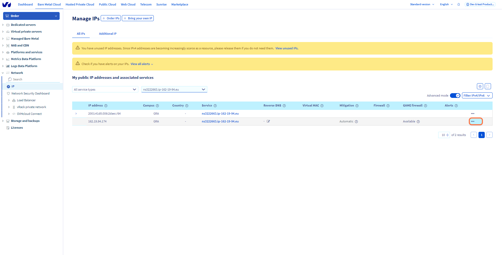
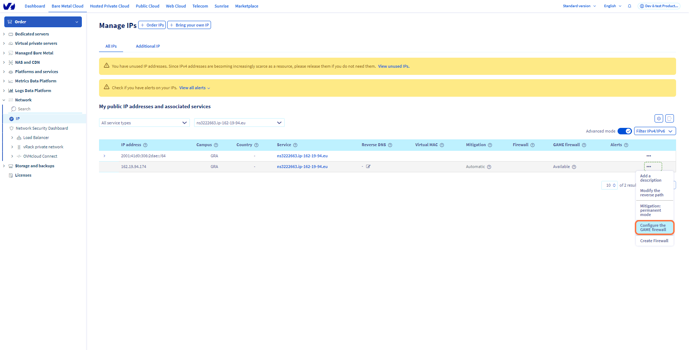
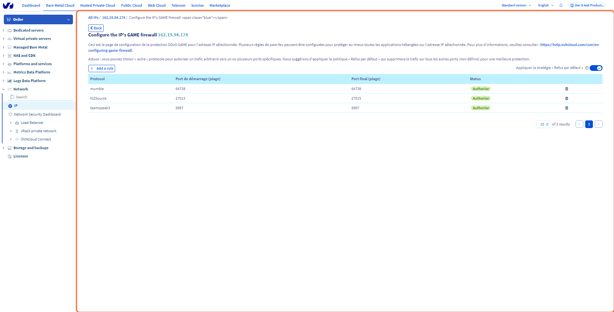
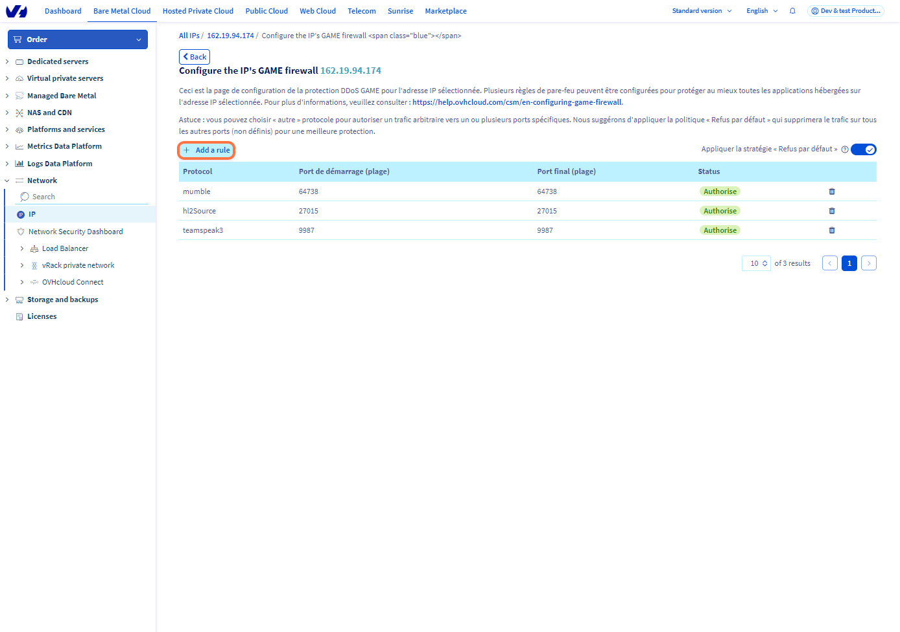
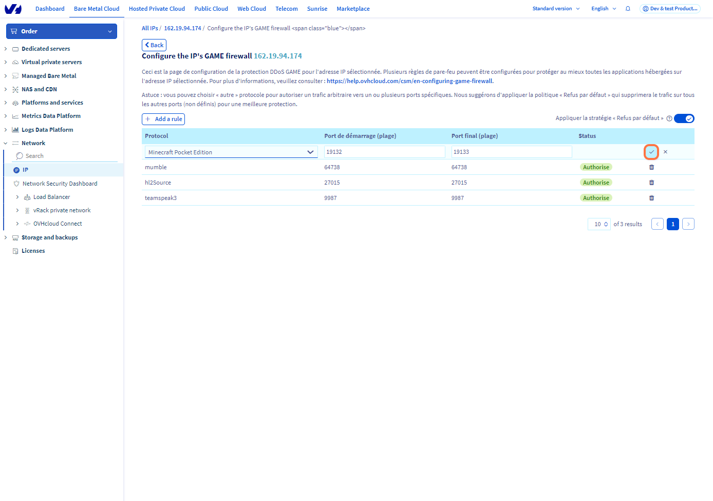

## Objective

This guide's objective is to help you better understand our Game DDoS Protection (Game Firewall) and to provide instructions on how to configure effective protection for servers that support it.

> [!primary]
> Find more information on our Game DDoS Protection on <https://www.ovhcloud.com/en/security/game-ddos-protection/>.
> 

###### **START v1**

At the heart of our range of Bare Metal servers dedicated to gaming is DDoS Game Protection, specifically designed to secure gaming applications against cyber-attacks that threaten the stability and accessibility of servers for gamers. This dedicated protection solution is both robust and easy to use, enabling our customers to concentrate fully on developing their business without being distracted by the fight against cybercrime.

We've recently enhanced the GAME firewall interface for simplified management and greater clarity. Enjoy a clean, user-friendly interface, reflecting our ongoing commitment to optimum security and unrivalled performance.

###### **END v1**

###### **START v2 (with more details)**

Our range of Bare Metal servers designed specifically for games includes a crucial feature: Game DDoS Protection. This protection is tailored to the unique needs of online gaming platforms, where speed and stability are key to the user experience. In the competitive world of online gaming, a cyber attack can have disastrous consequences, ranging from degraded performance to complete disruption of service, damaging players' reputation and loyalty.

Recognising the critical importance of service continuity, we have developed our DDoS Game Protection to provide seamless security against attacks, while maintaining optimal performance. Our solution allows game server operators to turn their attention away from security threats and focus on innovating and expanding their game offering.

As part of our commitment to providing not only state-of-the-art security but also an exceptional user experience, we have undertaken a complete redesign of the GAME Firewall interface. This latest update aims to simplify security management, reduce complexity for server administrators and provide greater visibility of the protection measures in place. With an intuitive user interface and simplified controls, users can now navigate security settings with ease and quickly adapt configurations in response to changing threats.

The refreshed interface is the result of careful listening to feedback from our customers and an in-depth analysis of security trends in the gaming industry. It is designed to be not only more pleasing to the eye but also more functional, enabling users to manage DDoS protection effectively, ensuring that servers remain operational and performing, even in the face of the most persistent and sophisticated attacks.

###### **END v2**

|  | 
|:--:| 
| How DDoS mitigation is performed at OVHcloud |

## Requirements

- An [OVHcloud **Game** Dedicated Server](https://www.ovhcloud.com/en-gb/bare-metal/prices/#filterType=range_element&filterValue=game))
- Access to the [OVHcloud Control Panel](https://www.ovh.com/auth/?action=gotomanager&from=https://www.ovh.co.uk/&ovhSubsidiary=GB)

> [!warning]
> This feature might be unavailable or limited on servers of the [**Eco** product line](https://eco.ovhcloud.com/en-gb/about/).
>
> Please visit our [comparison page](https://eco.ovhcloud.com/en-gb/compare/) for more information.

## Instructions

### Introduction 

The Anti-DDoS Infrastructure together with Edge Network Firewall are keeping network safe from common threats (mostly focusing on ISO OSI Layer 3 and 4). On the other hand, hosting game applications can be challenging experience in terms of network security. We understand that very well and for this usecase OVHcloud is offering Game DDoS Protection - a Layer-7 (application) firewall that focuses on protecting specific gaming protocols (usually using UDP). It's key benefits are:

- **Distance**: We know that latency and it's stability is crucial for gaming. These solutions are put as close as possible to the servers and work together with a dedicated hardware.
- **2-way**: The platform analyzes incoming and outgoing traffic for best understanding of every player's situation.
- **Instant**: It can distinguish real players from harmful attacks on a server from the very first network packets.
- **Always-on**: The ability to detect and stop attacks ensures a smooth experience for sensitive gaming applications without any disruptions and latency changes.

### Enabling the Game DDoS Protection

> [!primary]
> The Game Firewall protects the IP associated with a server. As a result, if you have a server with multiple IP addresses (i.e. Additional IP addresses), you need to configure each of them separately.
>

To configure gaming rules in the Gaming Firewall, you must first log in to the OVHcloud Control Panel and then follow these steps : 
 - Click the `Bare Metal Cloud`{.action} tab
 - Then go to `Network`{.action}
 - Open `IP`{.action}

|  | 
|:--:| 
| Click on the `...`{.action} button next to the IP address of your Game Server |

|  | 
|:--:| 
| Click on `Configure the GAME firewall`{.action} |

|  | 
|:--:| 
| On the following screen ... |

|  | 
|:--:| 
| ... click the `Add a rule`{.action} button to add a rule to the Game Firewall |

You can set up to **30 rules per IP** on more than **13 protocols** (all currently supported Game Firewall profiles can be seen [here](https://www.ovhcloud.com/en/security/game-ddos-protection/)):

| Protocols    |        |
| -------- |  -------- |
| Ark Survival Evolved  | Arma |
| Gta Multi Theft Auto San Andreas | Gta San Andreas Multiplayer Mod |
| Hl 2 Source | Minecraft Pocket Edition |
| Minecraft Query | Mumble |
| Other | Rust |
| Teamspeak 2 | Teamspeak 3 |
| Trackmania Shootmania |    |

   

> [!primary]
> By default, the Game Firewall is pre-configured with certain rules that OVHcloud has determined work with the most common games. However, for customers with a Game Dedicated Server, we allow you to go a step further and configure rules for ports as well.
> 

|  | 
|:--:| 
| Enable the ports as needed on the following screen and click on the `Confirm`{.action} button when you are finished adding your rules. You have now successfully configured Game Firewall rules |

> [!primary]
> It is important to note that Game DDoS Protection will not take any action unless rules are configured. 
> Moreover, for the best protection we highly recommend to set "Default policy = DROP" which will drop any traffic that is not matching defined rules. This way, listed application will be protected, and nothing else can reach your server.
> 

> [!warning]
> It's important to notice that Game DDoS protection applies after the Edge Network Firewall. For a proper functioning, the Edge Network protection can not be too strict and has to forward traffic to the Game DDoS protection. It would be optimal to have one rule on the Edge Network Firewall allowing all UDP traffic, then let the Game DDoS protection filter the specific UDP ports.
>

### Important Notices

#### FiveM

FiveM is a mod of GTA-V. Currently it is not fully recognized by Rockstar (game publisher).

Due to this, we do not plan to release a public FiveM Game firewall profile for layer 7 protection.

#### Rust

Game firewall supports Rust with a detiled profile. You can read more about hosting Rust on OVHcloud's servers [here](https://www.ovhcloud.com/en/bare-metal/game/rust-server/).

#### Minecraft

Minecraft is well supported in the following versions:

- Minecraft Java edition 
- Minecraft Pocket Edition
- Minecraft Query

> [!primary]
> For now Minecraft Java edition is protected in "default" mode and no additional setup is exposed. If you host bigger Minecraft servers, or with specific requirements - please reach our support using [Help Center](https://help.ovhcloud.com/csm/en-gb-home?id=csm_index) with all the details to tune-up the application profile.
>

## Go further

If you need training or technical assistance to implement our solutions, contact your sales representative or click on [this link](https://www.ovhcloud.com/en-gb/professional-services/) to get a quote and ask our Professional Services experts for assisting you on your specific use case of your project.

Join our community of users on <https://community.ovh.com/en/>.