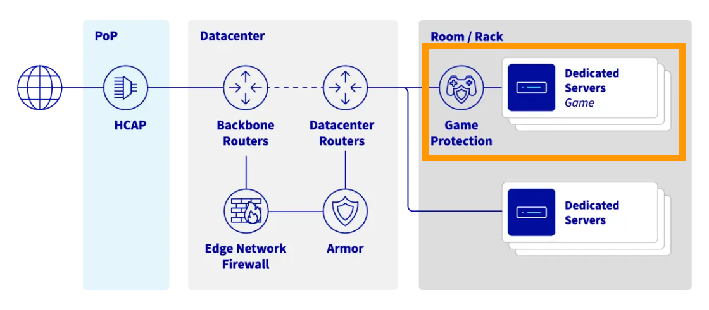
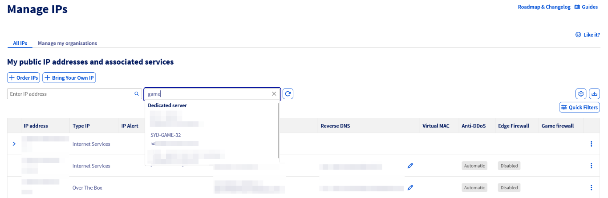
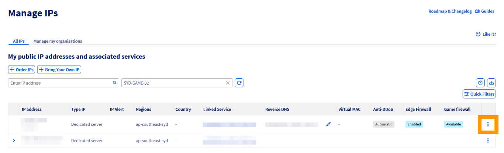
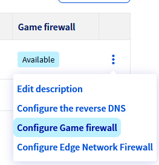
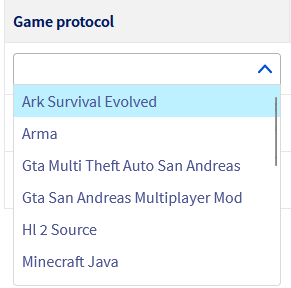

<style>
details>summary {
    color:rgb(33, 153, 232) !important;
    cursor: pointer;
}
details>summary::before {
    content:'\25B6';
    padding-right:1ch;
}
details[open]>summary::before {
    content:'\25BC';
}
</style>

## Objective

This guide's objective is to help you better understand our Game DDoS Protection (also known as *Game firewall*) and to provide instructions on how to configure effective protection.

> [!primary]
> Find more information on our [Game DDoS Protection on our website](/links/security/ddos).
> 

Our dedicated Bare Metal gaming servers include an additional network attack protection specifically designed to secure gaming applications against targeted attacks, ensuring stability and accessibility for gamers. This dedicated protection solution is both robust and easy to use, allowing you to focus on developing your business without the distraction of defending against cybercrime.

|  |
|:--:|
| Anti-DDoS infrastructure & game protection services diagram at OVHcloud |

## Requirements

- An [OVHcloud **Game** dedicated server](/links/bare-metal/game)

<!-- CP-NAV-START:network-public-ip -->
---

### OVHcloud Control Panel Access

- **Direct link:** [Public IP](/links/control-panel/network-public-ip)
- **Navigation path:** `Network`{.action} > `Public IP Addresses`{.action}

---
<!-- CP-NAV-END:network-public-ip -->

> [!warning]
> This feature might be unavailable or limited on servers of the [**Eco** product line](/links/bare-metal/eco-about).
>
> Please visit our [comparison page](/links/bare-metal/eco-compare) for more information.

## Instructions

### Introduction

The Anti-DDoS Infrastructure, together with the Edge Network firewall, keeps the network safe from common threats (mostly focused on ISO OSI layers 3 and 4). Hosting gaming applications however can be a challenging experience in terms of network security. **Game DDoS Protection** is here to help - this is a Layer 7 (application) firewall focused on protecting specific gaming protocols. Its main advantages are:

- **Very low latency**: We know that latency and its stability is crucial for online gaming. These solutions are put as close as possible to the servers and work together with a high-performance hardware.
- **2-way**: The platform analyses incoming and outgoing traffic for best understanding of every player's situation.
- **Instant**: It can distinguish real players from harmful attacks on a server from the very first network packets.
- **Always-on**: The ability to detect and stop attacks ensures a smooth experience for sensitive gaming applications without any disruptions and latency changes.

### Enabling and configuring Game DDoS Protection

> [!warning]
> The *Game firewall* protects the IP associated with a server. As a result, if you have a server with multiple IP addresses (i.e. [Additional IP addresses](/links/network/additional-ip)), you need to configure each of them separately.
>
> Each of the addresses you wish to protect with the Game Firewall **must have** their Game Firewall status set as `Configured` for the rules to apply.
>

To configure game protection rules for your Bare Metal Game server, follow these steps:

<!-- CP-STEPS-START:navigate-public-ip -->
- Open `Network`{.action} in the left-hand sidebar.
- Open `Public IP Addresses`{.action}.

You can filter IP addresses by using the `All service types`{.action} drop-down menu, or directly enter the desired IP address in the search bar. Enter the name or category of the corresponding server:

|  |
|:--:|
| IP listing: Find your IP address by corresponding service |
<!-- CP-STEPS-END:navigate-public-ip -->

Navigate to the *Game firewall* configuration:

<!-- CP-STEPS-START:open-game-firewall-config -->
|  |
|:--:|
| Click on the `⁝`{.action} button next to the IP address of your Game server. |

|  |
|:--:|
| Click on `Configure the GAME firewall`{.action}. |
<!-- CP-STEPS-END:open-game-firewall-config -->

Now you can configure game protection rules for the selected IP address.

<!-- CP-STEPS-START:access-game-firewall-tabs -->
> [!tabs]
> From the **Dedicated Servers** page
>> - Open the `Bare Metal Cloud`{.action} section in the left-hand sidebar.
>> - Select `Dedicated servers`{.action}.
>> - Click on the Game server you wish to configure.
>> - In the `Network` section of the `General information` tab, find the "Game DDoS protection" section.
>> - Click the `...`{.action} button and select `Configure Game Protection`{.action}. You will be taken to the list of IP addresses assigned to your server.
> From the **Public IP Addresses** page
>> - Open the `Network`{.action} section in the left-hand sidebar.
>> - Select `Public IP Addresses`{.action}.
>> - In the `All service types`{.action} drop-down menu, find and select the Bare Metal Game server you wish to configure.
>> - A list of IP addresses assigned to your server will appear.
<!-- CP-STEPS-END:access-game-firewall-tabs -->

#### Enable and configure the Game Firewall rules

<!-- CP-STEPS-START:configure-firewall-rules -->
For each address attached to your server that requires protection, verify that the *Game Firewall* status is set to `Available`{.action}. You will have to configure the *Game Firewall* rules separately for each.

- Click the `⁝`{.action} button to the right of the table and select `Configure Game firewall`{.action}.
- Add rules specifying the protocol and port range for each gaming application that will be accessible on the selected IP address. Please refer to the [Game-specific notices](#game_specific) section for additional information.
- For security reasons, we strongly recommend you enable the `Apply "Default Deny" policy`{.action} option, at the top right of the rule table. This option blocks all traffic that does not match the rules you set up for the Game Firewall, i.e. all listed game applications will be protected and no other connections will be able to reach your server. This option significantly reduces the attack surface exposed to potential malicious actors.
<!-- CP-STEPS-END:configure-firewall-rules -->

Game DDoS Protection allows you to configure up to **100 rules per IP address** that points to the recent GAME-1 and GAME-2 Bare Metal Game servers (2024 and later), or up to **30 rules per IP address** for the older Bare Metal game ranges (usually identified as RISE-GAME or SYS-GAME).

Please note that supported gaming protocols (game titles and versions that can be protected) may change over time. Moreover, they can be different between older Bare Metal Game server ranges and the newer ones. The most recent list of supported game profiles can be found on the [Game DDoS Protection page](/links/security/ddos).

*Game firewall* protection rules must not overlap in terms of ports defined.

The option **Other** may be selected for applications hosted on specific ports (for which there is no available protection) to let client traffic pass through. Please note that there is not much added security for the traffic matching the rule **Other** and it should be used with caution.

A few minutes after you are done configuring the Game Firewall for an IP address, all the newly created rules will apply, and the *Game Firewall* status of that IP address will switch from `Available` to `Configured`.

> [!warning]
> Game DDoS Protection takes effect after the rules defined in the [Edge Network Firewall](/pages/bare_metal_cloud/dedicated_servers/firewall_network). For both to work properly, the Edge Network Firewall cannot be too strict and needs to pass traffic to the Game DDoS Protection.
>

#### Verify your configuration

<!-- CP-STEPS-START:verify-configuration -->
Once configured, verify that your server is protected by the Game Firewall by checking:

- On the **Public IP Addresses** page, each IP address that is attached to your Bare Metal Game server and requires protection must have their Game Firewall status as `Configured`.
- On the management page of your Bare Metal Game server, in the `Network` section of the `General information` tab, the Game Anti-DDoS Protection status must be either `All IP addresses are protected` or `Some IP addresses are protected`. If it is the latter, please ensure that you configured all the relevant IP addresses.
<!-- CP-STEPS-END:verify-configuration -->

### Game-specific notices <a name="game_specific"></a>

#### Ark Survival Evolved

- **Ark Survival Evolved**: Basic protection engine.
- **Ark Survival Evolved v.311.78**: Updated protection engine, added to the recent GAME-1 and GAME-2 Bare Metal Game Servers (2024 and later).

#### Counter Strike 2

- **Counter Strike 2**: New protection engine added to the recent GAME-1 and GAME-2 Bare Metal Game Servers (2024 and later).

#### FiveM

- **FiveM** is a Grand Theft Auto V multiplayer mod by Cfx.re which is now recognized by the game publisher Rockstar. We added FiveM support to the recent GAME-1 and GAME-2 Bare Metal Game Servers (2024 and later).

#### Rust

- **Rust** is supported with a dedicated protection profile on all generations of Bare Metal Game servers. Please note that we updated this protection profile (i.e. added RakNet cookies support) for the 3rd gen. of Bare Metal Game servers (2024, EPYC based).  


#### Minecraft

Minecraft is well supported by the following profiles:

- **Minecraft Java**: Should be the best fit for all Minecraft Java versions. It protects the Minecraft Query protocol and is tuned for TCP traffic. It was added in 2024 but is also available for previous generations of Bare Metal Game servers. Use with caution if other UDP games are hosted on the same IP. 
- **Minecraft Query**: General Minecraft Query protocol protection.
- **Minecraft Bedrock**: Minecraft Bedrock protection (with RakNet cookies support), added to the recent GAME-1 and GAME-2 Bare Metal Game Servers (2024 and later).
- **Minecraft Pocket Edition**: Minecraft PE/Bedrock protection, the same as Bedrock, kept for compatibility reasons.

#### Valheim

- **Valheim**: New protecion engine, added to the recent GAME-1 and GAME-2 Bare Metal Game Servers (2024 and later). 

> [!primary]
> If you host a bigger service with one of the supported games, but still observe false positives from Anti-DDoS Infrastructure systems, please reach out to our support via the [Help Centre](https://help.ovhcloud.com/csm?id=csm_get_help) with all the details to be able to tune up the application profile. 
>

### Using Additional IPs with Game dedicated servers

Additional IPs are offering a flexible way to manage your applications across multiple servers or hosted services. They provide value for your game-hosting infrastructure by allowing to manage scalability or failover actions without an impact on public IP addresses. With Additional IPs you can also define different geographical IP locations or even leverage your own IP block (using the BYOIP service) for OVHcloud Game servers.

While Additional IPs are enabling flexibility, there are situations that require some additional attention.

#### Per-IP configuration specific to a Game server generation

To provide the most flexibility of configuration, different gaming protection rules can be set on different Additional IPs pointing to the same Bare Metal Game server.  
The maximum number of rules and available protection settings are defined on a per-IP address basis, but are specific to the particular Bare Metal Game server generation behind the firewall.

Differences may be observed between the newer Game servers (3rd gen. of Game Bare Metal servers - 2024, EPYC based) and the older Game servers (previous generations, usually identified as RISE-GAME or SYS-GAME).

##### Veryfying supported game protections

<!-- CP-STEPS-START:verify-supported-protocols -->
All supported Game DDoS Protection protocols for a specific server are visible on the `GAME firewall`{.action} configuration page for any IP address pointing to that server, in the `Game protocol`{.action} drop-down menu:

|  |
|:--:|
| List of supported protection protocols |
<!-- CP-STEPS-END:verify-supported-protocols -->

If you prefer automation, protocol details can be retrieved using the OVHcloud APIv6:

> [!api]
>
> @api {v1} /ip GET /ip/{ip}/game/{ipOnGame}
>

API response example:

```python
{
    ipOnGame: "1.2.3.4"
    maxRules: 30
    state: "ok"
    firewallModeEnabled: true
  - supportedProtocols: [
        "arkSurvivalEvolved"
        "arma"
        "gtaMultiTheftAutoSanAndreas"
        "gtaSanAndreasMultiplayerMod"
        "hl2Source"
        "minecraftPocketEdition"
        "minecraftQuery"
        "mumble"
        "other"
        "rust"
        "teamspeak2"
        "teamspeak3"
        "trackmaniaShootmania"
    ]
}
```


#### Moving an Additional IP between servers

While a static rule set configuration may be self-explanatory, Additional IP moving actions may require a few comments.

- **Moving an IP from an old generation to a new generation of Bare Metal Game servers:**
    - The process is transparent and all protection rules and IP settings will be kept.

- **Moving an IP from a new generation to an old generation of Bare Metal Game servers:**
    - If the destination server supports less protection rules than the origin one, an error will be displayed and the action will be stopped.
    - Otherwise:
        - Backward compatible rules are kept (protection profile name must equal).
        - Rules that are not supported on the destination server will be removed.
    
- **Moving an IP from a Bare Metal Game server to other servers or services:**
    - All Game DDoS Protection rules applied to the IP will be deleted, as they are not supported outside Bare Metal Game servers.


## FAQ

/// details | **Can I use Game DDoS Protection on other ranges than Bare Metal Game servers?**

No, Game DDoS Protection is only available for our Bare Metal Game dedicated servers.

///

/// details | **How can I ensure automation to work for an Additional IP between a new and an old generation of Bare Metal Game servers?**

You can either limit your protection rules to 30 per IP or configure your automation scripts so they can remove and add rules before and after moving an IP to another server. We recommend to use the latest generation of Bare Metal Game servers as they come with many improvements.

///

/// details | **Can I disable Game DDoS Protection?**

This is possible, but not recommended. You can do it by removing all game protocol rules from the configuration and disabling the entry `Default policy: DROP`.

///

/// details | **My game is not on the supported protocol list, what can I do?**

You can propose your need on our [infrastructure solutions roadmap on GitHub](https://github.com/orgs/ovh/projects/16/views/14). This will help us to decide on prioritization of the next features to be developed.

///

/// details | **While having configured my game with appropriate ports and default policy to drop, I still receive attacks that are impacting my Game server. What to do?**

You will need to share relevant network traffic dumps as examples for such attacks (*.pcap* file) in order to request protection tuning of your profile. To do this, please log in to our [Help Centre](https://help.ovhcloud.com/csm?id=csm_get_help).

///

## Go further

If you need training or technical assistance to implement our solutions, contact your sales representative or click on [this link](/links/professional-services) to get a quote and ask our Professional Services experts for assisting you on your specific use case of your project.

[Network Security Dashboard for Dedicated Servers](/pages/bare_metal_cloud/dedicated_servers/network_security_dashboard)

Join our [community of users](/links/community).
