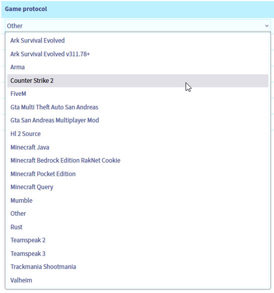

<style>
details>summary {
    color:rgb(33, 153, 232) !important;
    cursor: pointer;
}
details>summary::before {
    content:'\25B6';
    padding-right:1ch;
}
details[open]>summary::before {
    content:'\25BC';
}
</style>

> [!primary]
> Questa traduzione è stata generata automaticamente dal nostro partner SYSTRAN. I contenuti potrebbero presentare imprecisioni, ad esempio la nomenclatura dei pulsanti o alcuni dettagli tecnici. In caso di dubbi consigliamo di fare riferimento alla versione inglese o francese della guida. Per aiutarci a migliorare questa traduzione, utilizza il pulsante "Contribuisci" di questa pagina.
>

## Obiettivo

Lo scopo di questa guida è quello di aiutare i clienti a comprendere meglio la protezione anti-DDoS Game (nota anche come *Game firewall*) e di fornire istruzioni su come impostare una protezione efficace.

> [!primary]
> Per maggiori informazioni, consulta la nostra [protezione anti-DDoS Game sul nostro sito](/links/security/ddos).
>

I nostri server dedicati Bare Metal Gaming includono una protezione aggiuntiva contro gli attacchi di rete, progettata appositamente per proteggere le applicazioni di gioco dagli attacchi mirati, garantendo stabilità e accessibilità ai giocatori. Questa soluzione di protezione dedicata è solida e facile da utilizzare, consentendo di concentrarsi sullo sviluppo dell'azienda senza dover difendersi dalla criminalità informatica.

|  |
|:--:|
| Schema dei servizi per l'infrastruttura e la protezione dei giochi anti-DDoS in OVHcloud |

## Prerequisiti

- Un [server dedicato OVHcloud **Game**](/links/bare-metal/game)
- Accesso allo [Spazio Cliente OVHcloud](/links/manager)

> [!warning]
> Questa funzionalità potrebbe non essere disponibile o essere limitata sui server della [**gamma Eco**](/links/bare-metal/eco-about).
>
> Per ulteriori informazioni, consulta la nostra [pagina di confronto](/links/bare-metal/eco-compare).

## Procedura

### Introduzione

L'infrastruttura anti-DDoS, associata a Edge Network Firewall, protegge la rete dalle minacce più comuni (concentrate principalmente sui livelli ISO OSI 3 e 4). L’hosting di applicazioni di gioco può rivelarsi un’esperienza difficile in termini di sicurezza di rete. **Game DDoS Protection** è un firewall Layer 7 (applicazione) che si concentra sulla protezione di protocolli di gioco specifici. I principali vantaggi sono:

- **Latenza molto bassa**: Sappiamo che la latenza e la sua stabilità sono essenziali per i giochi online. Queste soluzioni sono poste il più vicino possibile ai server e funzionano insieme con hardware performante.
- **Bidirezionale**: La piattaforma analizza il traffico in entrata e in uscita per comprendere meglio la situazione di ogni giocatore.
- **Istantanea**: permette di distinguere i veri giocatori dagli attacchi nocivi su un server fin dai primi pacchetti della rete.
- **Sempre attivo**: la possibilità di rilevare e arrestare gli attacchi garantisce un'esperienza fluida per le applicazioni di gioco sensibili, senza interruzioni né modifiche della latenza.

### Attivazione e configurazione della protezione anti-DDoS Game

> [!primary]
> Il *Firewall Game* protegge l'IP associato a un server. Di conseguenza, se possiedi un server con diversi indirizzi IP (ad esempio [indirizzi Additional IPs](/links/network/additional-ip)), dovrai configurarli separatamente.
>

Per configurare le regole di protezione del gioco per il tuo server Bare Metal Game, accedi allo Spazio Cliente OVHcloud e segui questi step:

- Clicca sulla scheda `Bare Metal Cloud`{.action}.
- Accedi a `Network`{.action} nella barra laterale sinistra.
- Apri `IP`{.action}.

Per filtrare gli indirizzi IP, utilizza il menu a tendina `Tutti i servizi`{.action}. Inserisci il nome o la categoria del server corrispondente:

|  |
|:--:|
| Lista degli IP: trova il tuo indirizzo IP per ogni servizio corrispondente |

Accedi alla configurazione del *Firewall Game*:

|  |
|:--:|
| Clicca sul pulsante `...`{.action} accanto all'indirizzo IP del server Game. |

|  |
|:--:|
| Clicca su `Configura il firewall GAME`{.action}. |

A questo punto è possibile configurare le regole di protezione del gioco per l'indirizzo IP selezionato.

> [!primary]
> È importante notare che la protezione anti-DDoS Game non prenderà alcuna misura fino a quando non saranno configurate le regole di protezione del gioco.
>

Per attivare la protezione anti-DDoS Game, è sufficiente definire le applicazioni di gioco e l’intervallo di porte di rete (o porta unica) ad esse associato:

|  |
|:--:|
| Nella schermata successiva, clicca sul pulsante `Aggiungi una regola`{.action} per aggiungere una regola al *Firewall Game*. |


La protezione anti-DDoS Game ti permette di configurare fino a **100 regole per indirizzo IP** che puntano verso un server di gioco Bare Metal di 3a generazione (server commercializzati nel 2024 o versioni successive), o fino a **30 regole per indirizzo IP** per le gamme di giochi Bare Metal precedenti (generalmente identificate come RISE-GAME o SYS-GAME).

Ti ricordiamo che i protocolli di gioco supportati (titoli e versioni dei giochi che possono essere protetti) possono cambiare nel corso del tempo. e possono variare tra le gamme di server Bare Metal Game precedenti e quelle più recenti. È disponibile l'elenco più recente dei profili di gioco supportati [qui](/links/security/ddos).

|  |
|:--:|
| Configura le protezioni del gioco selezionando un **Protocollo** dalla lista e definendo l' **intervallo di porte** sul quale l'applicazione del gioco riceve le connessioni (consulta la documentazione di installazione del gioco). Clicca sul pulsante `Conferma`{.action} per registrare. Configurazione delle regole del *firewall game* completata. |

Le regole di protezione per *Firewall Game* non devono sovrapporsi in termini di porte definite.

L'opzione **Altro** può essere selezionata per le applicazioni ospitate su porte specifiche (per le quali non è disponibile alcuna protezione) per lasciare passare il traffico cliente. Si prega di notare che non c'è molta sicurezza aggiuntiva per il traffico corrispondente alla regola **Altro** e deve essere usato con cautela.

Consigliamo inoltre di definire la regola **"Default policy = DROP"** su ogni IP che punta verso il tuo server Game. Questa opzione permette alla protezione anti-DDoS Game di eliminare tutto il traffico che non corrisponde alle regole definite: tutte le applicazioni di gioco elencate saranno protette e nessun'altra connessione potrà raggiungere il tuo server.

> [!warning]
> La protezione anti-DDoS Game viene attivata dopo le regole definite nel [Edge Network Firewall](/pages/bare_metal_cloud/dedicated_servers/firewall_network). Per il corretto funzionamento di entrambi, l’Edge Firewall Network non può essere troppo rigido e deve passare il traffico alla protezione anti-DDoS Game.
>

### Informazioni specifiche per alcuni giochi

#### Ark Survival Evolved

- **Ark Survival Evolved**: Motore di protezione di base.
- **Ark Survival Evolved v.311.78**: Motore di protezione aggiornato, aggiunto alla terza generazione di server Bare Metal Game (versione 2024).

#### Counter Strike 2

- **Counter Strike 2**: Nuovo motore di protezione aggiunto alla terza generazione di server Bare Metal Game (versione 2024).

#### FiveM

- **FiveM** è una modalità multiplayer Grand Theft Auto V di Cfx.re riconosciuta dall'editor Rockstar. Abbiamo aggiunto il supporto di FiveM nella terza generazione di server Bare Metal Game (versione 2024).

#### Rust

- **Rust** è supportato con un profilo di protezione dedicato su tutte le generazioni di server Bare Metal Game. Ti ricordiamo che abbiamo aggiornato questo profilo di protezione (ovvero abbiamo aggiunto il supporto dei cookies RakNet) per la terza generazione di server Bare Metal Game (versione 2024).
Per saperne di più sull'hosting Rust sui server OVHcloud [qui](/links/bare-metal/bare-metal/game-rust).

#### Minecraft

Minecraft è ben supportato dai seguenti profili:

- **Java Minecraft**: dovrebbe essere la soluzione migliore per tutte le versioni di Java Minecraft. che protegge il protocollo Minecraft Query ed è impostato per il traffico TCP. È stato aggiunto nel 2024, ma è disponibile anche per le generazioni precedenti di server Bare Metal Game. Attenzione: altri giochi UDP sono ospitati sullo stesso IP.
- **Minecraft Query**: protezione generale del protocollo Minecraft Query.
- **Minecraft Bedrock**: protezione Minecraft Bedrock (con supporto dei cookies RakNet), aggiunta alla terza generazione di server Bare Metal Game (versione 2024).
- **Minecraft Pocket Edition**: Protezione PE/Bedrock Minecraft.

#### Valheim

- **Valheim**: nuovo motore di protezione, aggiunto alla terza generazione di server Bare Metal Game (versione 2024).

> [!primary]
> Se ospiti un servizio più grande con uno dei giochi supportati ma noti dei falsi positivi provenienti dai sistemi di infrastruttura anti-DDoS, contatta il nostro supporto tramite il [Help Center](https://help.ovhcloud.com/csm?id=csm_get_help) con tutti i dettagli necessari per migliorare il profilo dell’applicazione.
>

### Utilizzo di indirizzi Additional IP con Server Dedicati Game

Gli indirizzi Additional IP offrono una soluzione flessibile per gestire le applicazioni su più server o servizi ospitati. Apportano un valore aggiunto alla tua infrastruttura di hosting di giochi permettendo di gestire la scalabilità o le azioni di Failover senza impatto sugli indirizzi IP pubblici. Gli Additional IP permettono inoltre di definire diverse localizzazioni geografiche di IP o di utilizzare il proprio blocco di IP (utilizzando il servizio BYOIP) per i server Game di OVHcloud.

Anche se gli Additional IP permettono una certa flessibilità, alcune situazioni richiedono un'attenzione supplementare.

#### Configurazione tramite IP specifica per la generazione di un server Game

Per offrire la massima flessibilità di configurazione, è possibile definire diverse regole di protezione del gioco su indirizzi Additional IP diversi che puntano verso lo stesso server Bare Metal Game.  
Il numero massimo di regole e le impostazioni di protezione disponibili sono impostate su base per indirizzo IP, ma sono specifiche della generazione di server Bare Metal Game specifica dietro il firewall.

Si possono osservare differenze tra i server Game più recenti (terza generazione di server Game Bare Metal, uscita nel 2024) e i server Game più vecchi (generazioni precedenti, generalmente identificate come RISE-GAME o SYS-GAME).

##### Verifica delle protezioni di gioco supportate

Tutti i protocolli di protezione anti-DDoS Game supportati per un server specifico sono visibili nella pagina di configurazione `GAME firewall`{.action} per ogni indirizzo IP che punta a questo server, nel menu a tendina `Game protocol`{.action}:

|  |
|:--:|
| Elenco dei protocolli di protezione supportati |

Se preferisci l'automazione, puoi recuperare i dettagli del protocollo utilizzando [l'APIv6 OVHcloud](/pages/manage_and_operate/api/first-steps):

> [!api]
>
> @api {v1} /ip GET /ip/{ip}/game/{ipOnGame}
>

Esempio di risposta API:

```python
{
    ipOnGame: "1.2.3.4"
    maxRules: 30
    state: "ok"
    firewallModeEnabled: true
  - supportedProtocols: [
        "arkSurvivalEvolved"
        "arma"
        "gtaMultiTheftAutoSanAndreas"
        "gtaSanAndreasMultiplayerMod"
        "hl2Source"
        "minecraftPocketEdition"
        "minecraftQuery"
        "mumble"
        "other"
        "rust"
        "teamspeak2"
        "teamspeak3"
        "trackmaniaShootmania"
    ]
}
```


#### Trasferisci un Additional IP tra server

Sebbene una configurazione statica del set di regole possa essere esplicita, le azioni di spostamento degli indirizzi Additional IP potrebbero richiedere alcuni commenti.

- **Trasferimento di un IP di vecchia generazione verso una nuova generazione di server Bare Metal Game:**
    - Il processo è trasparente e tutte le regole di protezione e i parametri IP saranno mantenuti.

- **Trasferimento di un IP di nuova generazione verso una vecchia generazione di server Bare Metal Game:**
    - Se il server di destinazione supporta un numero di regole di protezione inferiore a quello del server di origine, verrà visualizzato un errore e l'azione verrà interrotta.
    - In caso contrario:
        - Le regole di compatibilità con le versioni precedenti vengono mantenute (il nome del profilo di protezione deve essere uguale).
        - Le regole non supportate nel server di destinazione verranno eliminate.

- **Trasferimento di un IP da un server Bare Metal Game ad altri server o servizi:**
    - Le regole di protezione anti-DDoS Game applicate all'IP verranno eliminate in quanto non supportate all'esterno dei server Bare Metal Game.


## FAQ

/// details | **È possibile utilizzare la protezione anti-DDoS Game su gamme diverse dai server Bare Metal Game?**

No, la protezione anti-DDoS Game è disponibile solo per i nostri server dedicati Bare Metal Game.

///

/// details | **In che modo l'automazione funziona per un Additional IP tra una nuova e una vecchia generazione di server Bare Metal Game?**

È possibile limitare le regole di protezione a 30 per IP oppure configurare gli script di automazione in modo che possano eliminare e aggiungere regole prima e dopo lo spostamento di un IP verso un altro server. Ti consigliamo di utilizzare i server Bare Metal Game di ultima generazione, in quanto dotati di numerosi miglioramenti.

///

/// details | **È possibile disattivare la protezione anti-DDoS Game?**

È possibile, ma non è consigliato. Per farlo, elimina tutte le regole di protocollo del gioco dalla configurazione e disattiva la voce `Default policy: DROP`.

///

/// details | **Il gioco non è presente nell'elenco dei protocolli supportati, cosa posso fare?**

Puoi proporre le tue necessità nella nostra [roadmap delle soluzioni di infrastruttura su GitHub](https://github.com/orgs/ovh/projects/16/views/14). Questo ci aiuterà a decidere la priorità delle prossime funzionalità da sviluppare.

///

/// details | **Dopo aver configurato il gioco con le porte appropriate e il criterio predefinito da eliminare, continuo a ricevere attacchi che colpiscono il mio server Game. Cosa fare?**

È necessario condividere i dump rilevanti del traffico di rete a titolo di esempio di tali attacchi (file *.pcap*) per richiedere l'impostazione della protezione del proprio profilo. Per farlo, accedi al nostro [Help Center](https://help.ovhcloud.com/csm?id=csm_get_help).

///

## Per saperne di più

Se avete bisogno di formazione o di assistenza tecnica per implementare le nostre soluzioni, contattate il vostro rappresentante o cliccate su [questo link](/links/professional-services) per ottenere un preventivo e richiedere un'analisi personalizzata del vostro progetto da parte dei nostri esperti del team Professional Services.

Contatta la nostra [Community di utenti](/links/community).