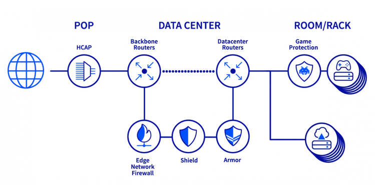
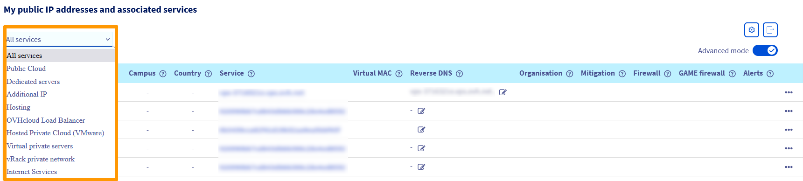
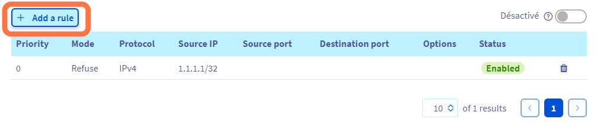
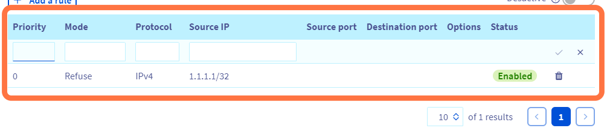
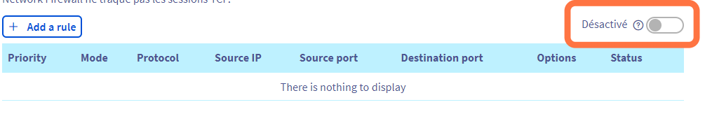
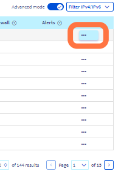

## Objective

To protect customer services exposed on public IP addresses, OVHcloud offers a stateless firewall that is configured and integrated into the **Anti-DDoS infrastructure**: the Edge Network Firewall. It allows to limit service exposure to DDoS attacks, by dropping specified network flows coming from outside of the OVHcloud network.

**This guide will show you how to configure the Edge Network Firewall for your services.**

> [!primary]
>
> You can find more information on our Anti-DDoS solution on our website: <https://www.ovhcloud.com/en-ca/security/anti-ddos/>.
> 

|  | 
|:--:| 
| Anti-DDoS infrastructure & game protection services diagram at OVHcloud |

## Requirements

- An OVHcloud service exposed on a dedicated public IP address ([Dedicated server](/links/bare-metal/bare-metal), [VPS](https://www.ovhcloud.com/en-ca/vps/), [Public Cloud instance](https://www.ovhcloud.com/en-ca/public-cloud/), [Hosted Private Cloud](https://www.ovhcloud.com/en-ca/enterprise/products/hosted-private-cloud/), [Additional IP](/links/network/additional-ip), etc.)
- Access to the [OVHcloud Control Panel](/links/manager)

> [!warning]
> This feature might be unavailable or limited on servers of the [**Eco** product line](https://eco.ovhcloud.com/en-gb/about/).
>
> Please visit our [comparison page](https://eco.ovhcloud.com/en-gb/compare/) for more information.

## Instructions

The Edge Network Firewall reduces exposure to network DDoS attacks by allowing users to copy some of the server's firewall rules to the edge of the OVHcloud network. This blocks incoming attacks as close to their source as possible, reducing the risk of saturating server resources or rack connections in the event of major attacks.

### Enabling Edge Network Firewall

> [!primary]
>
> The Edge Network Firewall protects a specific IP associated with a server (or service). Therefore, if you have a server with multiple IP addresses, you must configure each IP separately.
> 

In the OVHcloud Control Panel, click on the `Bare Metal Cloud`{.action} section, next click on the `Network`{.action} menu and open `Public IP Adresses`{.action}. You can use the drop-down menu underneath **"My public IP addresses and associated services"** to filter your services according to category.

{.thumbnail}

Next, click the `...`{.action} button to the right of the relevant IPv4 and first select `Create Firewall`{.action}.

{.thumbnail}

You will then be asked to confirm. The firewall will be created and you can configure the rules.

> [!primary]
> The `Create Firewall`{.action} button will only be available for IPs that have never configured a firewall. If it is not the first time you are configuring your firewall, you can skip this step. 
>

|  | 
|:--:| 
| Click on `Edge Network Firewall configuration`{.action} to start configuring it. |

On this page you can choose to **Enable** or **Disable** the firewall using the switch button.
It is also possible to do it another way explained just below.

You can set up to **20 rules per IP**.

> [!warning]
>
> The Edge Network Firewall is automatically enabled when a DDoS attack is detected and cannot be disabled until the attack has ended. As a result, all the rules configured in the firewall are applied during the duration of the attack. This logic allows our customers to offload the firewall rules of the server to the edge of the OVHcloud network for the duration of the attack.
>
> Please note that you should configure your own local firewalls even if the Edge Network Firewall has been configured, as its main role is to handle traffic from outside of the OVHcloud network.
>
> If you have configured some rules, we recommend that you check them regularly or when changing how your services are working. As previously mentioned, the Edge Network Firewall will be automatically enabled in case of a DDoS attack even when disabled in your IP settings.
>

> [!primary]
>
> - UDP fragmentation is blocked (DROP) by default. When enabling the Edge Network Firewall, if you are using a VPN, remember to configure your Maximum Transmission Unit (MTU) correctly. For example, with OpenVPN, you can check `MTU test`.
> - The Edge Network Firewall (ENF) integrated in the scrubbing centres (VAC) only handles network traffic coming from outside the OVHcloud network.
>

### Configure the Edge Network Firewall

> [!warning]
> Please note that the OVHcloud Edge Network Firewall cannot be used to open ports on a server. To open ports on a server, you must go through the firewall of the operating system installed on the server. 
>
> For more information, please refer to the following guides: [Configuring the firewall on Windows](/pages/bare_metal_cloud/dedicated_servers/activate-port-firewall-soft-win) and [Configuring the firewall on Linux with iptables](/pages/bare_metal_cloud/dedicated_servers/firewall-Linux-iptable).
>

**To add a rule:**

|  | 
|:--:| 
| Click on `Add a rule`{.action}. |

For each rule (excluding TCP), you must choose:

|  | 
|:--| 
| &bull; A priority (from 0 to 19, 0 being the first rule to be applied, followed by the others)  &bull; An action (`Accept`{.action} or `Deny`{.action})  &bull; The protocol  &bull; Source IP (optional) |

For each **TCP** rule, you must choose:

|  | 
|:--| 
| &bull; A priority (from 0 to 19, 0 being the first rule to be applied, followed by the others)  &bull; An action (`Accept`{.action} or `Deny`{.action})  &bull; The protocol  &bull; Source IP (optional)  &bull; The source port (optional)  &bull; The destination port (optional)  &bull; The TCP state (optional)  &bull; Fragments (optional)|

> [!primary]
> We advise authorising TCP protocol with an established option (for packets that are part of a previously opened/started session), ICMP packets (for ping and traceroute) and optionally UDP DNS responses from external servers (if you use external DNS servers).
>
> **Configuration example:**
>
> - Priority 0: Authorise TCP established
> - Priority 1: Authorise UDP source port 53
> - Priority 2: Authorise ICMP
> - Priority 19: Refuse IPv4

> [!warning]
> Firewall setups with only "Accept" mode rules are not effective at all. There must be an instruction as to which traffic should be dropped by the firewall. You will see a warning unless such a "Deny" rule is created.
> 

**Enable firewall:**

|  | 
|:--:| 
| `Switch on`{.action} to enable |

After confirmation, the firewall will be enabled.

**Disable firewall:**

|  | 
|:--:| 
| `Switch on`{.action} to enable |

After confirmation, the firewall will be disabled.

Note that rules are disabled until the moment an attack is detected - then they are activated. This logic can be used for rules that are only active when a known repeated attack is incoming.

### Configuration example

To make sure that only the standard ports for SSH (22), HTTP (80), HTTPS (443) and UDP (53) are left open when authorising the ICMP, follow the rules below:

{.thumbnail}

The rules are sorted from 0 (the first rule read) to 19 (the last). The rule chain stops as soon as a rule is applied to the packet.

For example, a packet for TCP port 80 will be intercepted by rule 2 and the rules that follow will not be applied. A packet for TCP port 25 will only be captured by the last rule (19), which will block it because the firewall does not allow communication on port 25 in the previous rules.

> [!warning]
> The above configuration is only an example and should only be used as a reference if the rules do not apply to the services hosted on your server. It is essential that you configure the rules in your firewall to match the services hosted on your server. Incorrect configuration of your firewall rules can result in legitimate traffic being blocked and server services being inaccessible.
> 

### Attack mitigation - scrubbing centre activity

Our Anti-DDoS infrastructure (VAC) has two modes of operation: **automatic** and **permanent**. The mitigation process is done via the automated scrubbing centre. This is where our advanced technology takes a deep look at the packets and attempts to remove DDoS traffic while allowing legitimate traffic to pass through.

- **Automatic mitigation** is the default: All OVHcloud IPs are under automatic mitigation. Usually this is the best choice for your services. In case any malicious traffic is detected, the scrubbing centre activates. This state is indicated by the "Forced" status for a given IP address. At this time the Edge Network Firewall is also active. The situation comes back to normal when the attack is mitigated and no more suspicious activity is observed.

- **Permanent mitigation** mode can be enabled or disabled via the OVHcloud Control Panel. With permanent mitigation, you permanently apply the first level of filtering so all traffic will always pass through the mitigation system before reaching the server. We do not recommend enabling this for longer periods of time unless you are experiencing latency jitter due to the scrubbing centre redirecting the traffic too frequently.

Please note that compared to automatic mode, there is **no** increase in the level of protection when this mode is enabled.

To enable it, follow these steps:

- Click on the `Bare Metal Cloud`{.action} menu.
- Go to `Network`{.action} in the left-hand sidebar.
- Go to the `IP`{.action} section.

|  | 
|:--:| 
|  Next, click the `...`{.action} button to the right of the relevant IPv4. |

|  | 
|:--:| 
|  Select `Mitigation: permanent mode`{.action}. |

> [!success]
> **Tips**
>
> You can create attack-only firewall rules that only apply after an attack has been detected. To do this, Edge Network Firewall rules must be created but disabled.
>

> [!warning]
> If our Anti-DDoS infrastructure mitigates an attack, your Edge Network Firewall rules will eventually be applied, even if you have disabled the firewall. If you have disabled your firewall, remember to delete your rules as well.
> 
> Please note that our Anti-DDoS infrastructure cannot be disabled on a service. All OVHcloud products are delivered within the scope of protection and this cannot be changed.
>

## Network Security Dashboard

For detailed insight into detected attacks and the results of scrubbing centre activities, we encourage you to explore our [Network Security Dashboard](/pages/bare_metal_cloud/dedicated_servers/network_security_dashboard).

## Conclusion

After reading this tutorial, you should be able to configure the Edge Network Firewall to improve the security of your OVHcloud services.

## Go further

- [Protecting a game server with the application firewall](/pages/bare_metal_cloud/dedicated_servers/firewall_game_ddos)

Join our [community of users](/links/community).
