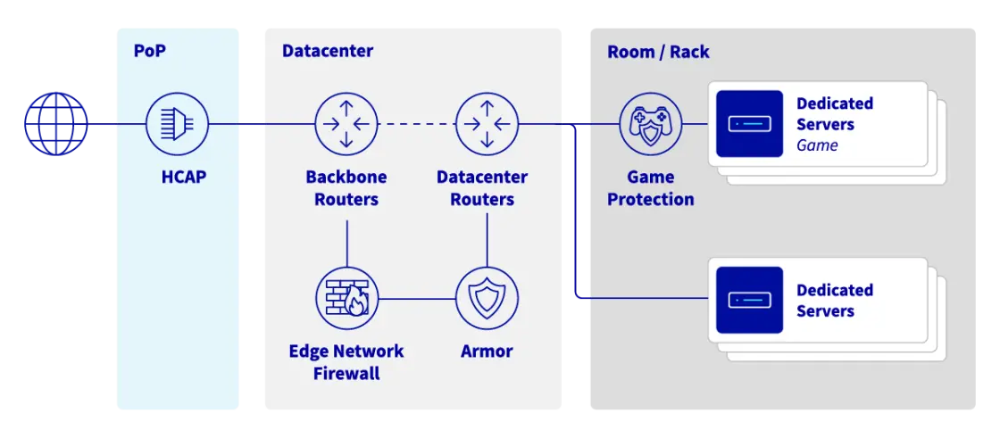
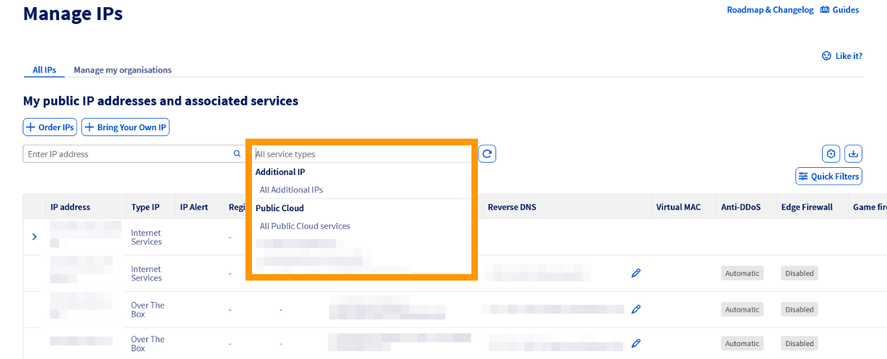
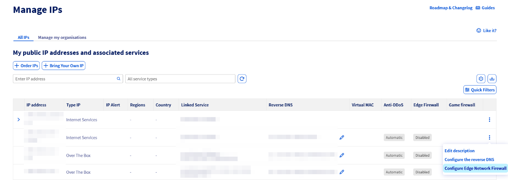
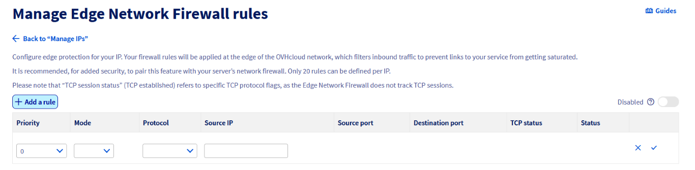
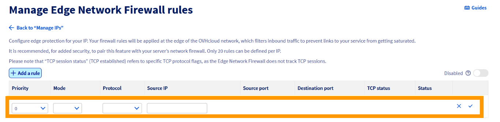
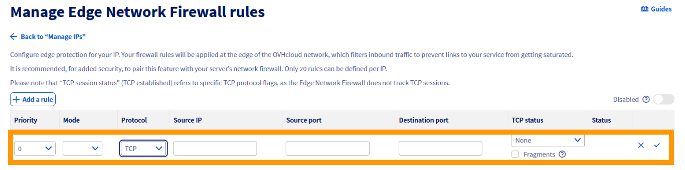
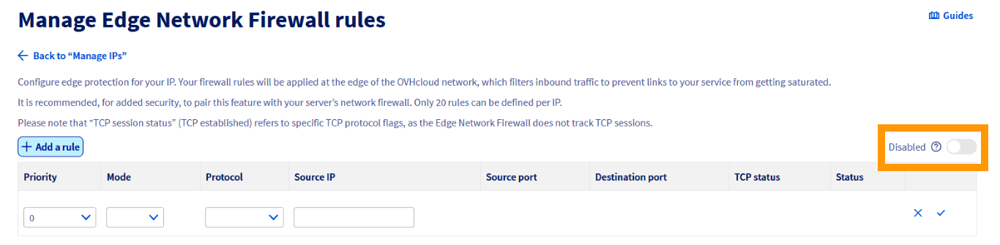
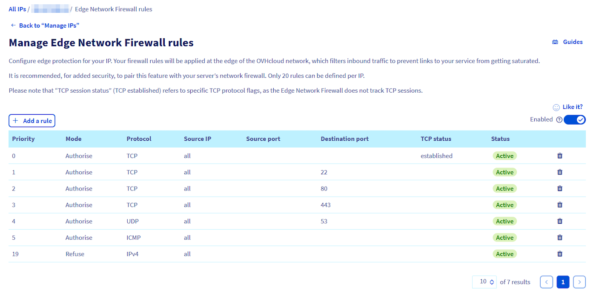

## Objetivo

Para proteger los servicios de los clientes expuestos en direcciones IP públicas, OVHcloud ofrece un firewall sin estado (*stateless*) que se configura e integra en la **Infraestructura anti-DDoS**: el Edge Network Firewall. Permite limitar la exposición de los servicios a los ataques DDoS, eliminando flujos de red específicos que puedan provenir del exterior de la red de OVHcloud.

**Esta guía explica cómo configurar el Edge Network Firewall para sus servicios.**

> [!primary]
>
> Para más información sobre nuestra solución anti-DDoS, [haga clic aquí](/links/security/antiddos).
>

| Infraestructura anti-DDoS y DDoS Protection en OVHcloud |
|:--:|
| {.thumbnail} |

## Requisitos

- Un servicio de OVHcloud expuesto y que utilice una dirección IP pública dedicada ([Servidor Dedicado](/links/bare-metal/bare-metal), [VPS](/links/bare-metal/vps), [instancia de Public Cloud](/links/public-cloud/public-cloud), [Hosted Private Cloud](/links/hosted-private-cloud/vmware), [Additional IP](/links/network/additional-ip), etc.)

<!-- CP-NAV-START:network-public-ip -->
---

### Acceso al área de cliente de OVHcloud

- **Enlace directo:** [Public IP](/links/control-panel/network-public-ip)
- **Ruta de navegación:** `Network`{.action} > `IP pública`{.action}

---
<!-- CP-NAV-END:network-public-ip -->

> [!warning]
> Esta funcionalidad puede no estar disponible o estar limitada en los [servidores dedicados **Eco**](/links/bare-metal/eco-about).
>
> Para más información, consulte nuestra [comparativa](/links/bare-metal/eco-compare).

> [!warning]
> El Edge Network Firewall no es compatible con el protocolo QUIC.

## Procedimiento

El Edge Network Firewall reduce la exposición a los ataques DDoS de red, permitiendo a los usuarios replicar determinadas reglas de firewall del servidor en el perímetro de la red de OVHcloud. De este modo, se bloquean los ataques entrantes lo más cerca posible de su origen, reduciendo así el riesgo de sobrecarga de los recursos del servidor en caso de un ataque importante.

### Configurar el Edge Network Firewall

El Edge Network Firewall puede ser activado o desactivado por el usuario en cualquier momento, con una excepción: se **activa automáticamente** cuando se detecta un ataque DDoS y **no puede desactivarse** hasta que el ataque haya finalizado. Por consiguiente, todas las reglas configuradas en el firewall se aplican durante la duración del ataque. Esta lógica permite a nuestros clientes trasladar las reglas de firewall del servidor al perímetro de la red de OVHcloud mientras dure el ataque.

#### Acceder a la página de configuración del Edge Network Firewall

> [!primary]
>
> Actualmente, esta funcionalidad solo está disponible para direcciones IPv4.

> [!primary]
>
> El Edge Network Firewall protege una IP específica asociada a un servidor (o servicio). Por lo tanto, si tiene un servidor con varias direcciones IP, debe configurar cada IP por separado.
>

Puede utilizar el menú desplegable situado debajo de **Mis direcciones IP públicas y servicios asociados** para filtrar sus servicios por categoría, o escribir directamente la dirección IP deseada en la barra de búsqueda.

{.thumbnail}

A continuación, haga clic en el botón `⁝`{.action} situado a la derecha de la IPv4 correspondiente y seleccione `Configurar el Edge Network Firewall`{.action} (o haga clic en el icono de estado en la columna **Edge Firewall**).

{.thumbnail}

Accederá a la página de configuración del firewall.

> [!primary]
>
> - La fragmentación UDP está bloqueada (*DROP*) por defecto. Al activar el Edge Network Firewall, si utiliza una VPN, recuerde configurar correctamente la unidad de transmisión máxima (MTU). Por ejemplo, con OpenVPN, puede comprobarlo mediante `MTU test`.
> - El Edge Network Firewall (ENF), integrado en los Scrubbing Centers (VAC), gestiona únicamente el tráfico de red procedente del exterior de la red de OVHcloud.
>

> [!warning]
> Tenga en cuenta que debe configurar sus propios firewalls locales aunque el Edge Network Firewall esté configurado, ya que su función principal es gestionar el tráfico procedente de fuera de la red de OVHcloud.
>
> Si ha configurado reglas, le recomendamos que las compruebe con regularidad o cuando cambie el funcionamiento de sus servicios. Como se ha mencionado anteriormente, el Edge Network Firewall se activará automáticamente en caso de ataque DDoS, incluso si está desactivado en la configuración IP.
>

### Configurar reglas de firewall

Puede configurar hasta **20 reglas por dirección IP**.

> [!primary]
> Desde marzo de 2026, el Edge Network Firewall admite reglas que se aplican a rangos de puertos, además de las reglas habituales de puerto único.
>
> El uso de rangos de puertos le permite proteger con una sola regla las aplicaciones que necesitan varios puertos en secuencia. Esto garantiza que su configuración respete el límite de 20 reglas, sin tener que crear una regla distinta para cada puerto utilizado.

> [!warning]
> Tenga en cuenta que el Edge Network Firewall de OVHcloud no puede utilizarse para abrir puertos en un servidor. Para abrir puertos en un servidor, debe utilizar el firewall del sistema operativo instalado en el servidor.
>
> Para más información, consulte las siguientes guías: [Configuración del firewall en Windows](/pages/bare_metal_cloud/dedicated_servers/activate-port-firewall-soft-win) y [Configuración del firewall en Linux con iptables](/pages/bare_metal_cloud/dedicated_servers/firewall-Linux-iptable).
>

**Para añadir una regla**, haga clic en el botón `+ Añadir una regla`{.action}, en la parte superior izquierda de la página.

|  |
|:--:|
| Haga clic en `+ Añadir una regla`{.action}. |

Para cada regla (excepto TCP), debe elegir:

| {.thumbnail} |
|:--|
| - Una prioridad (de 0 a 19, siendo 0 la primera regla que se aplica, seguida de las demás)   - Una acción (`Aceptar`{.action} o `Denegar`{.action})   - El protocolo   - La dirección IP de origen (opcional) |

Para cada regla **TCP**, debe elegir:

| {.thumbnail} |
|:--|
| - Una prioridad (de 0 a 19, siendo 0 la primera regla que se aplica, seguida de las demás)   - Una acción (`Aceptar`{.action} o `Denegar`{.action})   - El protocolo   - La dirección IP de origen (opcional)   - Puerto o rango de puertos de origen (opcional)   - Puerto o rango de puertos de destino (opcional)   - El estado TCP (opcional)   - Fragmentos (opcional) |

Cuando configure una regla TCP o UDP con un puerto o un rango de puertos, compruebe que los campos `puerto de origen` y `puerto de destino` contengan un número único comprendido entre 1 y 65535 (incluidos) o un rango de puertos (dos números separados por un guion, por ejemplo: 8887-8888).

> [!primary]
> Le recomendamos que autorice el protocolo TCP con la opción `established` (para los paquetes que forman parte de una sesión previamente abierta/iniciada), los paquetes ICMP (para ping y traceroute) y, opcionalmente, las respuestas DNS UDP de los servidores externos (si utiliza servidores DNS externos).
>
> **Ejemplo de configuración:**
>
> - Prioridad 0: Autorizar TCP `established`
> - Prioridad 1: Autorizar UDP, puerto de origen 53
> - Prioridad 2: Autorizar ICMP
> - Prioridad 19: Denegar IPv4

> [!warning]
> Las configuraciones de firewall con únicamente reglas en modo "Aceptar" no son efectivas en absoluto. Debe existir una instrucción que indique qué tráfico debe ser bloqueado por el firewall. Recibirá un aviso a menos que se cree una regla "Denegar".
>

**Activar/desactivar el firewall:**

|  |
|:--:|
| Utilice el botón de conmutación para activar o desactivar el firewall. |

Tras la validación, el firewall se activará o desactivará.

Tenga en cuenta que las reglas permanecen desactivadas hasta que se detecta un ataque, momento en el que se activan. Esta lógica puede utilizarse para reglas que solo están activas cuando se produce un ataque repetido conocido.

### Errores frecuentes y buenas prácticas

#### Definir simultáneamente los puertos de origen y destino en una misma regla

Al crear reglas de firewall, definir a la vez el puerto de origen y el puerto de destino es generalmente un error de configuración. En efecto, los puertos de origen suelen ser asignados de forma aleatoria por el sistema operativo del cliente (puertos efímeros).

Si establece una regla con un puerto de origen específico, es probable que el tráfico legítimo se bloquee en cuanto el puerto del cliente cambie en la sesión siguiente. Para garantizar la continuidad de la conexión, debe especificar únicamente el puerto de destino (el puerto de su servicio).

**Buena práctica:** Deje el puerto de origen vacío, salvo que esté filtrando tráfico procedente de un sistema especializado con una configuración de salida estática.

#### Rangos de puertos demasiado amplios

Crear reglas que autoricen el tráfico en rangos de puertos muy amplios puede suponer un riesgo de seguridad, ya que aumenta considerablemente la superficie de ataque de su servidor. Esto puede provocar varios problemas:

- Podría exponer inadvertidamente servicios en segundo plano que no están destinados a ser públicos, con el consiguiente riesgo de filtraciones de información sobre su sistema que permitan a actores maliciosos sondear su servidor en busca de vulnerabilidades.
- La auditoría y la resolución de problemas se vuelven mucho más complejas, ya que resulta más difícil verificar qué aplicaciones se están comunicando realmente, lo que puede ocultar errores de configuración o intrusiones.
- Los rangos UDP amplios abiertos son frecuentemente objeto de ataques de amplificación y reflexión, porque la probabilidad de encontrar servicios expuestos es mayor. Los atacantes pueden suplantar una dirección IP objetivo para enviar pequeñas peticiones a los servicios de ese rango, los cuales responden con paquetes mucho más voluminosos. De este modo, utilizan su servidor para lanzar ataques DDoS al tiempo que saturan potencialmente su propio ancho de banda.

**Buena práctica:** Utilice únicamente rangos restringidos para los puertos secuenciales requeridos por una aplicación específica (p. ej.: 5000-5100).

### Ejemplo de configuración

Para asegurarse de que solo los puertos SSH (22), HTTP (80), HTTPS (443) y UDP (53) permanecen abiertos al autorizar ICMP, siga las reglas que se indican a continuación:

{.thumbnail}

Las reglas se ordenan de 0 (la primera regla leída) a 19 (la última). La cadena deja de analizarse en cuanto se aplica una regla al paquete.

Por ejemplo, un paquete para el puerto TCP 80 será interceptado por la regla 2 y las reglas siguientes no se aplicarán. Un paquete para el puerto TCP 25 solo será capturado por la última regla (19), que lo bloqueará porque el firewall no autoriza la comunicación en el puerto 25 en las reglas anteriores.

> [!warning]
> La configuración anterior es solo un ejemplo y debe utilizarse como referencia únicamente si las reglas no se aplican a los servicios alojados en su servidor. Es imprescindible configurar las reglas de su firewall para que correspondan con los servicios alojados en su servidor. Una configuración incorrecta de las reglas de firewall puede provocar el bloqueo del tráfico legítimo y la imposibilidad de acceder a los servicios del servidor.
>

### Mitigación de ataques - Actividad del centro de limpieza (Scrubbing Center)

Nuestra Infraestructura anti-DDoS (VAC) funciona automáticamente. El proceso de mitigación se realiza a través de un centro de limpieza (**Scrubbing Center**) automatizado. Es aquí donde nuestra tecnología avanzada analiza en profundidad los paquetes e intenta eliminar el tráfico DDoS, permitiendo al mismo tiempo el paso del tráfico legítimo.

Todas las direcciones IP de OVHcloud están sujetas a mitigación automática. Si se detecta tráfico malicioso, se activa el **Scrubbing Center**. Este estado se indica mediante un estado "Forzado" para una dirección IP determinada. El Edge Network Firewall también está activo. La situación vuelve a la normalidad cuando el ataque es mitigado y no se observa más actividad sospechosa.

> [!success]
> **Sugerencias**
>
> Puede crear reglas de firewall dedicadas a los ataques y que solo se apliquen tras la detección de un ataque. Para ello, deben crearse reglas de Edge Network Firewall, pero desactivadas.
>

> [!warning]
> Si nuestra Infraestructura anti-DDoS mitiga un ataque, las reglas de su Edge Network Firewall terminarán por aplicarse, incluso si ha desactivado el firewall. Si ha desactivado su firewall, recuerde eliminar también sus reglas.
>
> Tenga en cuenta que la Infraestructura anti-DDoS no puede desactivarse en un servicio. Todos los productos de OVHcloud se entregan con este dispositivo y esto no puede modificarse.
>

## Network Security Dashboard

Para obtener información detallada sobre los ataques detectados y los resultados de las actividades del Scrubbing Center, le recomendamos que consulte nuestra guía sobre el [Network Security Dashboard](/pages/bare_metal_cloud/dedicated_servers/network_security_dashboard).

## Conclusión

Después de leer este tutorial, debería poder configurar el Edge Network Firewall para mejorar la seguridad de sus servicios de OVHcloud.

## Más información

- [Proteger un servidor GAME con el firewall de aplicación](/pages/bare_metal_cloud/dedicated_servers/firewall_game_ddos)

Interactúe con nuestra [comunidad de usuarios](/links/community).
