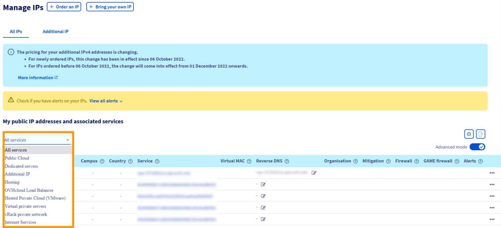
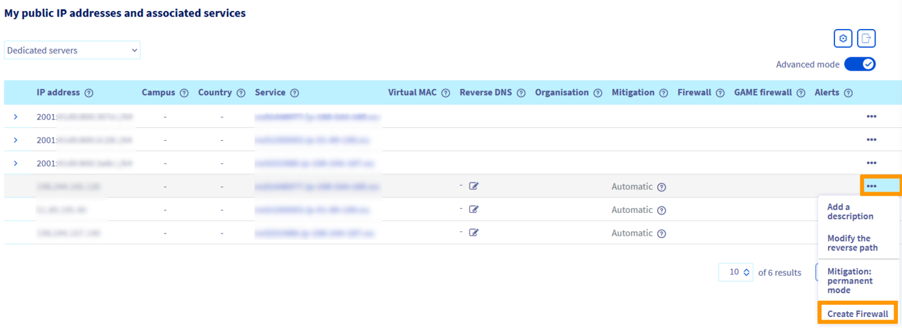
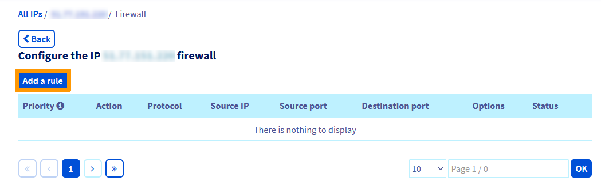
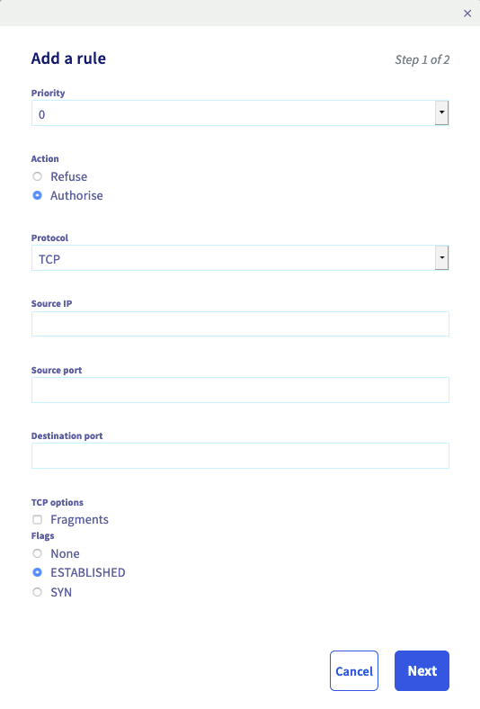
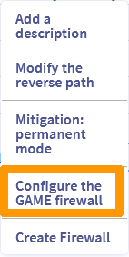
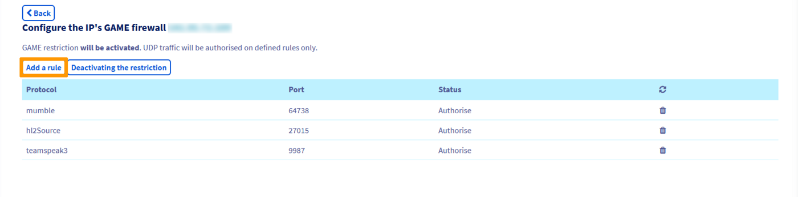

> [!primary]
> Questa traduzione è stata generata automaticamente dal nostro partner SYSTRAN. I contenuti potrebbero presentare imprecisioni, ad esempio la nomenclatura dei pulsanti o alcuni dettagli tecnici. In caso di dubbi consigliamo di fare riferimento alla versione inglese o francese della guida. Per aiutarci a migliorare questa traduzione, utilizza il pulsante "Contribuisci" di questa pagina.
>

## Obiettivo

Per proteggere la propria infrastruttura e i server dei propri clienti, OVHcloud propone il Network Firewall, un’opzione configurabile e integrata al sistema **anti-DDoS** (VAC) che permette di limitare l’esposizione di un servizio agli attacchi provenienti dalla rete pubblica.

**Questa guida ti mostra la procedura da seguire per configurare il servizio.**

> [!primary]
>
> Per maggiori informazioni sul VAC, la nostra tecnologia di protezione dagli attacchi DDoS, consulta questa pagina: <https://www.ovhcloud.com/it/security/anti-ddos/>.
> 

{.thumbnail}

## Prerequisiti

- Disporre di un servizio OVHcloud compatibile con il Network Firewall ([Server Dedicati](https://www.ovhcloud.com/it/bare-metal/){.external}, [VPS](https://www.ovhcloud.com/it/vps/){.external}, [istanze Public Cloud](https://www.ovhcloud.com/it/public-cloud/){.external}, [Hosted Private Cloud](https://www.ovhcloud.com/it/enterprise/products/hosted-private-cloud/){.external}, [Additional IP](https://www.ovhcloud.com/it/bare-metal/ip/){.external}, ecc.)
- Avere accesso allo [Spazio Cliente OVHcloud](https://www.ovh.com/auth/?action=gotomanager&from=https://www.ovh.it/&ovhSubsidiary=it){.external}

> [!warning]
> Questa funzionalità può non essere disponibile o limitata sui [server dedicati **Eco**](https://eco.ovhcloud.com/it/about/).
>
> Per maggiori informazioni, consulta la nostra [a confronto](https://eco.ovhcloud.com/it/compare/).

## Procedura

### Attiva il Network Firewall

> [!primary]
>
> Il Network Firewall protegge l'indirizzo IP associato a un server. Pertanto, se hai un server con più indirizzi IP, devi configurare ciascun IP separatamente. Una configurazione globale del server non è possibile.
> 

Dallo [Spazio Cliente OVHcloud](https://www.ovh.com/auth/?action=gotomanager&from=https://www.ovh.it/&ovhSubsidiary=it){.external}, accedi al menu `Bare Metal Cloud`{.action} e apri `IP`{.action}. 

Puoi utilizzare il menu a tendina "I tuoi indirizzi IP pubblici e servizi associati" per filtrare i tuoi servizi per categoria.

{.thumbnail}

In seguito, cliccare sul pulsante `...`{.action} a destra dell’IPv4 in questione e seleziona `Crea Firewall`{.action}.

{.thumbnail}

Si apre una nuova finestra per confermare l’operazione:

{.thumbnail}

A questo punto è possibile attivare e configurare il firewall cliccando di nuovo sul pulsante `...`{.action} e poi su `Attiva il Firewall`{.action}(1). Successivamente ripeti l’operazione e clicca su `Configura il Firewall`{.action} (2):

{.thumbnail}

È possibile definire fino a **20 regole per IP**.

> [!warning]
>
> Se il Network Firewall è configurato con regole, queste regole vengono applicate automaticamente a ogni attacco DDoS. Il Firewall non può essere disattivato prima della fine dell'attacco ed è quindi importante mantenere aggiornate le regole del firewall.
> Di default non sono presenti regole e tutte le connessioni sono autorizzate.
> Nel caso in cui siano già state configurate, ti consigliamo di controllarle regolarmente anche se le hai disattivate.
> 

> [!primary]
>
> - Di default, la frammentazione UDP è bloccata. Se utilizzi una VPN, ricorda di configurare correttamente il valore della tua Maximum Transmission Unit (MTU) in fase di attivazione del Network Firewall. Su OpenVPN, ad esempio, puoi selezionare `MTU test`{.action}.
> - Le regole del Network Firewall non vengono applicate all’interno della rete OVHcloud e non hanno quindi alcun impatto sulle connessioni di questa rete.
>

### Configura il Network Firewall

> [!warning]
> Ti ricordiamo che il Network Firewall di OVHcloud non può essere utilizzato per aprire porte a un server. Per aprire le porte a un server, devi passare attraverso il firewall del sistema operativo installato sul server. 
> Per maggiori informazioni, consulta queste guide: [Configurare il firewall su Windows](/pages/bare_metal_cloud/dedicated_servers/activate-port-firewall-soft-win) e [Configurare il firewall su Linux con Iptable](/pages/bare_metal_cloud/dedicated_servers/firewall-Linux-iptable).
>

Per aggiungere una regola, clicca sul pulsante `Aggiungi una regola`{.action}:

{.thumbnail}

Per ogni regola è necessario scegliere:

- una priorità (da 0 a 19, dove 0 è la prima regola applicata)
- un’azione (`Autorizza`{.action} o `Rifiuta`{.action})
- il protocollo
- un IP sorgente (facoltativo)
- la porta sorgente (solo TCP)
- la porta di destinazione (solo TCP)
- le opzioni TCP (solo TCP)

{.thumbnail}

> [!primary]
>
> - Priorità 0: è consigliato abilitare il protocollo TCP su tutti gli IP con l’opzione `established`{.action}, che permette di verificare l’appartenenza del pacchetto a una sessione aperta precedentemente. Se non viene autorizzato, il server non riceverà i risultati del protocollo TCP per le richieste SYN/ACK.
> - Priorità 19: i pacchetti del protocollo IPv4 che non rispettano nessuna regola prima della 19 (l’ultima disponibile), vengono rifiutati.
> 

### Esempio di configurazione

Per lasciare aperte solo le porte SSH (22), HTTP (80), HTTPS (443), UDP (sulla porta 10000) autorizzando l’ICMP, è necessario seguire queste regole:

{.thumbnail}

Le regole sono ordinate cronologicamente da 0 (prima regola letta) a 19 (ultima regola letta). La catena si interrompe a partire dal momento in cui una regola è applicabile al pacchetto ricevuto.

Un pacchetto destinato alla porta 80/TCP, ad esempio, verrà catturato dalla regola 2 e le regole successive non saranno verificate. Un pacchetto destinato alla porta 25/TCP, invece, verrà catturato solo dall’ultima regola (19) e sarà rifiutato in quanto le comunicazioni sulla porta 25 non sono autorizzate dalle regole precedenti.

> [!warning]
> Come indicato, la configurazione di cui sopra è solo un esempio e deve essere utilizzata come riferimento se le regole non si applicano ai servizi ospitati sul tuo server. È necessario configurare le regole del tuo firewall in base ai servizi ospitati sul tuo server. Una configurazione errata delle tue regole di firewall può comportare il blocco del traffico legittimo e l'inaccessibilità dei servizi del server.
>

### Mitigazione

La nostra soluzione anti-DDoS (VAC) comprende tre modalità di mitigazione: automatico, permanente o forzata.

**Mitigazione automatico**: di default, tutti gli IP OVHcloud sono sottoposti alla mitigazione automatica.  Con questa modalità, il traffico passa attraverso il sistema di mitigazione solo se viene rilevato come "insolito" rispetto al traffico normale normalmente ricevuto dal server.

**Mitigazione permanente**: questa modalità può essere attivata o disattivata dallo Spazio Cliente. Con la mitigazione permanente (se attivata), potrai applicare un primo livello di filtraggio costante attraverso il nostro Shield hardware. 
Tutto il traffico passa sempre attraverso il sistema di mitigazione prima di raggiungere il server. Consigliamo questa modalità per i servizi oggetto di attacchi frequenti. 
Ti ricordiamo che la mitigazione permanente è parte della nostra soluzione anti-DDoS (VAC) e che è possibile attivarla sul tuo IP senza attivare il Network Firewall.

Per attivarlo, clicca sul menu `Bare Metal Cloud`{.action} e apri `IP`{.action}. Poi clicca sui `...`{.action} a destra dell'IPv4 in questione e seleziona `Mitigation: modalità permanente`{.action}.

**Mitigazione forzata**: questa modalità viene attivata automaticamente non appena viene rilevato un attacco sul server. Una volta attivata sull'infrastruttura anti-DDoS, questa modalità non può essere disattivata. Per proteggere la nostra infrastruttura, la protezione sarà attivata per tutta la durata dell'attacco fino a quando non sarà completamente mitigata.

> [!warning]
>
> Se la nostra soluzione anti-DDoS limita un attacco, le regole configurate del tuo Network Firewall finiranno per essere applicate, anche se hai disattivato il Firewall. Per evitare l'applicazione di nessuna regola durante un attacco, è necessario eliminare tutte le regole precedentemente create.
> 
> La mitigazione è inclusa nella nostra soluzione anti-DDoS (VAC) e non può essere disattivata su un servizio. Tutti i prodotti OVHcloud sono consegnati con protezione anti-DDoS.

### Configura il Firewall Armor (Firewall Game)

> [!primary]
> Di default, il firewall Armor è preconfigurato con alcune regole che OVHcloud ha determinato di funzionare con i giochi più comuni. Tuttavia, per i clienti che dispongono di un server dedicato Game, ti permettiamo di andare oltre e configurare regole per le porte.
>

Per configurare le regole delle porte in Armor, accedi allo Spazio Cliente OVHcloud. 
In seguito accedi al menu `Bare Metal Cloud`{.action} e apri la sezione `IP`{.action}. Clicca sui `...`{.action} in corrispondenza dell'indirizzo IP del tuo server di gioco e poi su `Configura il Firewall Game`{.action}.

{.thumbnail}

Clicca sul pulsante `Aggiungi una regola`{.action} per aggiungere una regola ad Armor.

È possibile definire fino a **30 regole per IP**.

{.thumbnail}

Attiva le porte in base alle tue esigenze sullo schermo successivo e clicca sul pulsante `Conferma`{.action} quando hai finito di aggiungere le tue regole. Il firewall Armor è stato configurato correttamente.

## Per saperne di più

Contatta la nostra Community di utenti all’indirizzo <https://community.ovh.com/en/>.
