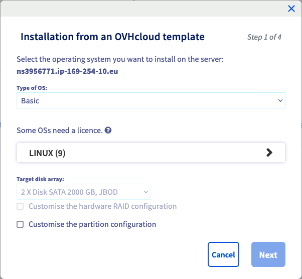
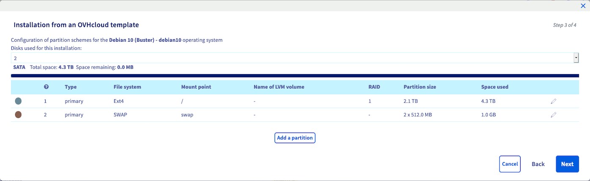

## Objective

A dedicated server is a physical server ("bare metal") located in one of our data centres. Unlike Web Hosting plans (also referred to as "shared hosting"), which are technically managed by OVHcloud, you are fully responsible for the administration of your dedicated server.

**This guide provides all the information required for your first steps with a Kimsufi, So You Start or Rise dedicated server.**

## Requirements

- Access to the [OVHcloud Control Panel](/links/manager)
- A [dedicated server](https://www.ovhcloud.com/asia/bare-metal/) of the ranges Kimsufi, So You Start or Rise in your OVHcloud account
- Administrative access via SSH or remote desktop (Windows) to your server

## Instructions

### Content overview

- [Installing or reinstalling an operating system](#install)
- [Logging on to your server](#connect)
- [Restarting your dedicated server](#reboot)
- [Securing your dedicated server](#secure)
- [OVHcloud Monitoring](#monitoring-server)
- [Network configuration](#network)
- [Rescue mode](#rescue)
- [Access using IPMI](#console)
- [Backup storage](#backup)

<a name="install"></a>

### Installing or reinstalling an operating system

> [!success]
>
> Find more information about server operating systems on [our web page](https://www.ovhcloud.com/en-gb/bare-metal/os/).
>

You can easily reinstall your server or choose a different OS image to install in your [OVHcloud Control Panel](/links/manager). From the `General information`{.action} tab, click on `...`{.action} next to the operating system and then click `Install`{.action}.

{.thumbnail}

In the popup window, select one of the installation options:

- `Install from an OVHcloud template`{.action}: You can select the OS and customise the server configuration.
- `Install one of your templates`{.action}: In order to apply a customised template, you need to have saved at least one server configuration. To do this, check the option `Save this installation` in step 4 of the installation process.
- `Install from custom image`{.action}: This allows you to install an external image on the server. Please refer to the [BYOI guide](/pages/bare_metal_cloud/dedicated_servers/bring-your-own-image) to learn about the settings of this functionality.

> [!primary]
>
> Some proprietary operating systems or platforms such as Plesk and Windows require licences which generate additional fees. You can buy licences [via OVHcloud](https://www.ovhcloud.com/asia/bare-metal/os/) or from an external reseller. You will then need to apply your licence, in the operating system itself or by using your [OVHcloud Control Panel](/links/manager).
>
You can manage all your licences in the `Bare Metal Cloud`{.action} section under `Licences`{.action}. In this section, you can also order licences or add existing ones via the `Actions`{.action} button.
>

Click `Next`{.action} to continue.

{.thumbnail}

After choosing `Install from an OVHcloud template`{.action} you can select the operating system from the drop-down menus.

{.thumbnail}

If you need to modify the partioning scheme of your operating system, check the box "Customise the partition configuration" before clicking on `Next`{.action}.

{.thumbnail}

In this step you are able to set up RAID and partitioning options within the limits of the server's hardware and operating system.

After you have finished your adjustments, click `Next`{.action} to arrive at the summary page.

You will find additional questions that are specific to the chosen operating system.

For example, if you are installing a GNU/Linux-based operating system, you can add your SSH key in the last step of the installation process.

For a detailed explanation on how to generate SSH keys, please refer to [this guide](/pages/bare_metal_cloud/dedicated_servers/creating-ssh-keys-dedicated).

{.thumbnail}

Finally, click `Confirm`{.action} to trigger the operating system installation on your dedicated server.

<a name="connect"></a>

### Logging on to your server

> [!warning]
> OVHcloud is providing you with services for which you are responsible, with regard to their configuration and management. You are therefore responsible for ensuring they function correctly.
>
> This guide is designed to assist you in common tasks as much as possible. Nevertheless, we recommend that you contact a [specialist service provider](/links/partner) if you have difficulties or doubts concerning the administration, usage or implementation of services on a server.
>

#### Linux

If you have installed an OVHcloud OS template on your server, a user with elevated permissions is created automatically. This user will be named according to the operating system, for example "ubuntu" or "rocky".

You will then receive an email containing the information needed to establish a first connection with SSH. SSH is a secure communication protocol, used to establish encrypted connections to a remote host. You can find more detailed information in our guide: [Getting started with SSH](/pages/bare_metal_cloud/dedicated_servers/ssh_introduction).

Most current desktop operating systems will have an **Open SSH** client natively installed. This means that your access credentials allow you to quickly establish a connection to your server in the appropriate command line application (`Terminal`, `Command prompt`, `Powershell`, etc.). Enter the following command:

```bash
ssh username@IPv4
```

**Example:**

```bash
ssh ubuntu@203.0.113.1
```

You can use any third-party application compatible with **Open SSH** as well.

Once connected, you can replace the predefined password for the current user with a better passphrase by using this command:

```bash
passwd
```

On a GNU/Linux distribution, **a password prompt will not display your keyboard inputs**.

Type your current password and press `Enter`{.action}. Enter the new passphrase and type it again at the next prompt to confirm it.

```console
Changing password for ubuntu.
Current password:
New password: 
Retype new password: 
passwd: password updated successfully
```

> [!warning]
> 
> **Activating the root user account**
>
> It is not necessary to use the "root" user account to get started with administrating your server. This account has to be enabled first in the server OS in order to use it. Moreover, SSH connections with the user "root" are **disabled** by default as a security measure.
> 
Unless stated otherwise, all administrative actions described in our documentation can be accomplished by the default user account, i.e. typing `sudo` followed by the respective command. Learn more about this topic in our guide on [How to configure user accounts and root access on a server](/pages/bare_metal_cloud/dedicated_servers/changing_root_password_linux_ds).
>

Depending on your requirements for security, mobility and convenience, SSH keys can serve as an additional connection method or replace logins with username and password. Find out how to use them in our guide: [Creating and using SSH keys](/pages/bare_metal_cloud/dedicated_servers/creating-ssh-keys-dedicated).

#### Windows

Once the installation is completed, you will receive an email with your Windows login credentials. You can then connect to your server via RDP (**R**emote **D**esktop **P**rotocol). On your local Windows device, open the `Remote Desktop Connection` client application.

{.thumbnail}

Enter the IPv4 address of your server, then your username and passphrase. Usually a warning message will appear, asking to confirm the connection because of an unknown certificate. Click on `Yes`{.action} to log in.

You can use also use any third-party application compatible with RDP. This is a requirement if your local device does not have Windows installed.

> [!primary]
>
If you experience any issues with this procedure, verify that remote (RDP) connections are allowed on your local device by checking your system settings, firewall rules and possible network restrictions. 
> 

As a fallback option, you can use the [IPMI console in your OVHcloud Control Panel](#console) to connect.

##### Enabling Windows boot logs (optional)

Windows boot logs can be helpful for server error diagnostics.

To activate them, follow the steps below by navigating through the tabs:

> [!tabs]
> 1. **Connect to the server**
>>
>> Connect to your server via RDP or [IPMI](#console).<br>
>>
> 2. **Open the "Run" utility**
>>
>> Open the Windows start menu and click on `Run`{.action}.<br><br>
>>{.thumbnail}<br>
>>
> 3. **Open "msconfig"**
>>
>> Enter "msconfig" and click on `OK`{.action}.<br><br>
>>{.thumbnail}<br>
>>
> 4. **Activate logs**
>>
>> In the new window, activate the logs option next to `Boot log`. Click on `OK`{.action}.<br><br>
>>{.thumbnail}<br>
>>

The next time your server boots, logs will be saved into a `.txt` file. The file path is: `C:\Windows\ntbtlog.txt`.

To access the log file in rescue mode, please follow the instructions in the [rescue mode guide](/pages/bare_metal_cloud/dedicated_servers/rescue_mode).


### Restarting your dedicated server

A reboot might become necessary in order to apply updated configurations or to fix an issue. Whenever feasible, perform a "soft reboot" via the command line:

```bash
reboot
```

However, you can carry out a "hard reboot" at any time in your [OVHcloud Control Panel](/links/manager). From the `General information`{.action} tab, click on `...`{.action} next to "Status" in the **Service status** box, then click `Restart`{.action} and `Confirm`{.action} the action in the popup window.

{.thumbnail}

<a name="secure"></a>

### Securing your dedicated server

As explained in the “Objective” section of this guide, you are the administrator of your dedicated server. As such, you are responsible for your data and its security. You can learn more about securing your server in [this guide](/pages/bare_metal_cloud/dedicated_servers/securing-a-dedicated-server).

If your server runs Windows, use [this guide](/pages/bare_metal_cloud/dedicated_servers/activate-port-firewall-soft-win) instead.

<a name="monitoring-server"></a>

### OVHcloud Monitoring

You can set the monitoring status for a dedicated server from the `General information`{.action} tab in your [OVHcloud Control Panel](/links/manager) (section **Service status**).

{.thumbnail}

Click on the button `Configure`{.action}. In the popup window, you have three options for the monitoring behaviour:

- **Disabled**: This option stops alert messages and interventions by OVHcloud. Choose this if you are executing pertinent administrative actions on the server which prevent an ICMP response.
- **Enabled with proactive intervention**: If the server stops responding, an alert email is sent to you and the server will be checked by a technician.
- **Enabled without proactive intervention**: You will receive an alert message by email in case the server stops responding. To initiate an intervention, you will need to create a support request.

{.thumbnail}

Click on `Confirm`{.action} to update your monitoring configuration.

You can find more information about OVHcloud Monitoring in [this guide](/pages/bare_metal_cloud/dedicated_servers/network_ip_monitoring).

<a name="network"></a>

### Network configuration

> [!primary]
>
> Please note that [Additional IP addresses](https://www.ovhcloud.com/asia/bare-metal/ip/) are not compatible with the **Kimsufi** range.
>

#### Network bridging

Network bridging is the action taken by network equipment to create an aggregate network from either two or more communication networks, or two or more network segments. Bridging is distinct from routing, which allows the networks to communicate independently while remaining separate.

The Network Bridge configuration is most commonly used in the context of virtualisation, to allow each Virtual Machine to have its own public IP address.

For more information on network bridging, please refer to our guide: [Network Bridging](/pages/bare_metal_cloud/dedicated_servers/network_bridging).

#### IP aliasing

IP aliasing is the process of associating two or more IP addresses to the same network interface. This allows your server to establish multiple connections to a network, each serving a different purpose.

For detailed instructions on how to configure IP aliasing, please refer to [this guide](/pages/bare_metal_cloud/dedicated_servers/network_ipaliasing).

#### IPv6 configuration

> [!primary]
>
> Please note that servers of the **Kimsufi** range only have one IPv4 address and one IPv6 address. Both will be configured automatically when installing the OS.
>

OVHcloud dedicated servers are delivered with a /64 IPv6 block. To use the addresses in this block, you will need to make some network configuration changes. Please refer to our guide: [IPv6 Configuration](/pages/bare_metal_cloud/dedicated_servers/network_ipv6).

<a name="rescue"></a>

### Rescue mode

For any kind of issue, the first general troubleshooting step to take is rebooting your server into rescue mode from your [OVHcloud Control Panel](/links/manager). It is important to identify server issues in this mode to exclude software-related problems before contacting our support teams.

Please refer to the [rescue mode guide](/pages/bare_metal_cloud/dedicated_servers/rescue_mode).

<a name="console"></a>

### Access using IPMI

> [!primary]
>
> Please note that this option is not available for the **Kimsufi** range.
>

OVHcloud deploys all dedicated servers with an IPMI (Intelligent Platform Management Interface) console which runs in your browser or from a Java applet, and enables you to connect directly to your server even if it has no network connection. This makes it a useful tool for troubleshooting issues that may have taken your server offline.

For more information, please refer to our guide: [Using the IPMI with dedicated servers](/pages/bare_metal_cloud/dedicated_servers/using_ipmi_on_dedicated_servers).

<a name="backup"></a>

### Backup storage

> [!primary]
>
> Please note that this option is not available for the **Kimsufi** range.
>

OVHcloud dedicated servers have an access-controlled storage space as a gratuitous service option. It is best used as a complementary backup option in case the server itself suffers data loss.

To activate and use the backup storage, please refer to [this guide](/pages/bare_metal_cloud/dedicated_servers/services_backup_storage).

## Go further

[How to configure user accounts and root access on a server](/pages/bare_metal_cloud/dedicated_servers/changing_root_password_linux_ds)

[Securing a dedicated server](/pages/bare_metal_cloud/dedicated_servers/securing-a-dedicated-server)

[Activating and using rescue mode](/pages/bare_metal_cloud/dedicated_servers/rescue_mode)

[OVHcloud API & OS installation](/pages/bare_metal_cloud/dedicated_servers/api-os-installation)

If you need training or technical assistance to implement our solutions, contact your sales representative or click on [this link](https://www.ovhcloud.com/asia/professional-services/) to get a quote and ask our Professional Services experts for a custom analysis of your project.

Join our [community of users](/links/community).