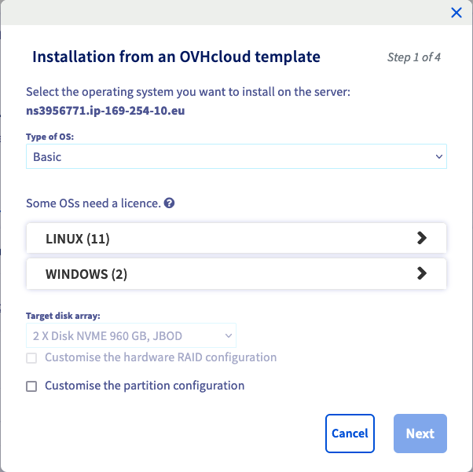
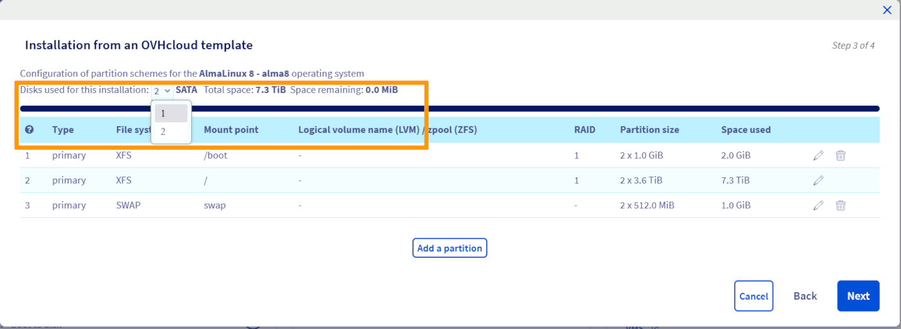
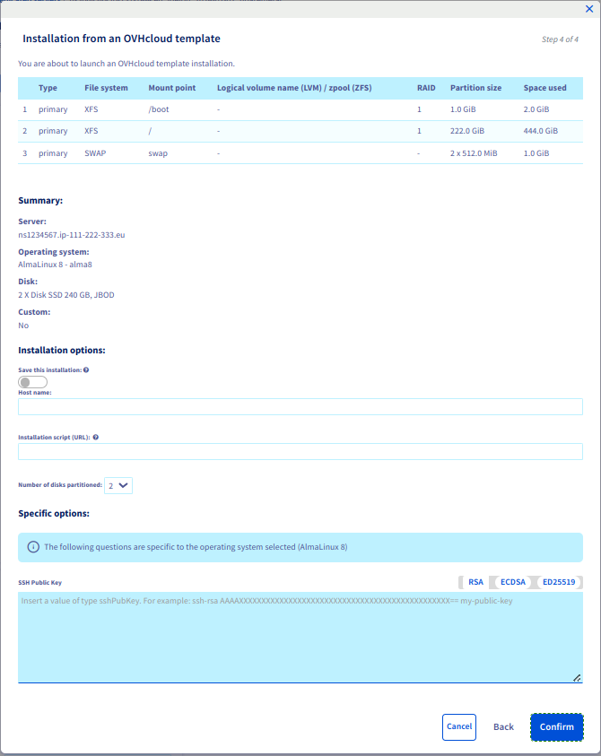
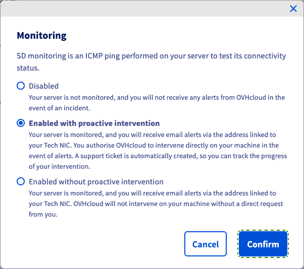

> [!primary]
> Tłumaczenie zostało wygenerowane automatycznie przez system naszego partnera SYSTRAN. W niektórych przypadkach mogą wystąpić nieprecyzyjne sformułowania, na przykład w tłumaczeniu nazw przycisków lub szczegółów technicznych. W przypadku jakichkolwiek wątpliwości zalecamy zapoznanie się z angielską/francuską wersją przewodnika. Jeśli chcesz przyczynić się do ulepszenia tłumaczenia, kliknij przycisk "Zgłóś propozycję modyfikacji" na tej stronie.
> 

## Wprowadzenie

Serwer dedykowany to fizyczny serwer ("bare metal") zlokalizowany w jednym z naszych centrów danych. W przeciwieństwie do rozwiązań hostingowych (zwanych również "shared hosting"), którymi zarządza OVHcloud, w przypadku serwera dedykowanego to Ty jesteś w pełni odpowiedzialny za administrowanie nim.

**Niniejszy przewodnik zawiera wszystkie informacje potrzebne do rozpoczęcia pracy z serwerem dedykowanym.**

## Wymagania początkowe

- Posiadanie [serwera dedykowanego](/links/bare-metal/bare-metal).
- Połączenie przez SSH z systemem Linux lub jako administrator z systemem Windows.
- Zalogowanie do [Panelu klienta OVHcloud](/links/manager).

> [!primary]
>
> Jeśli Twój serwer należy do linii produktów **Eco**, przejdź do [tego przewodnika](/pages/bare_metal_cloud/dedicated_servers/getting-started-with-dedicated-server-eco).

## W praktyce

### Podsumowanie

- [Instalacja lub reinstalacja systemu operacyjnego](#install)
- [Połączenie z serwerem](#connect)
- [Restart serwera dedykowanego](#reboot)
- [Bezpieczeństwo serwera dedykowanego](#secure)
- [Monitoring OVHcloud](#monitoring-server)
- [Konfiguracja sieci](#network)
- [Tryb Rescue](#rescue)
- [Dostęp za pomocą IPMI](#console)
- [Backup Storage](#backup)

<a name="install"></a>

### Instalacja lub reinstalacja systemu operacyjnego

> [!success]
>
> Więcej informacji na temat systemów operacyjnych serwerów znajdziesz na [naszej stronie internetowej](/links/bare-metal/bare-metal/os).
>

Możesz w prosty sposób przeprowadzić reinstalację serwera lub wybrać inny obraz systemu operacyjnego do zainstalowania w [Panelu klienta](/links/manager). W zakładce `Informacje ogólne`{.action} kliknij `...`{.action} naprzeciwko systemu operacyjnego, a następnie wybierz `Zainstaluj`{.action}.

{.thumbnail}

W oknie, które się pojawi wybierz jedną z opcji instalacji:

- `Instalacja z szablonu OVHcloud`{.action}: możesz wybrać system operacyjny i spersonalizować konfigurację serwera.
- `Zainstaluj jeden ze swoich szablonów`{.action}: aby móc zastosować spersonalizowany szablon, musisz wcześniej zarejestrować przynajmniej jedną konfigurację serwera. W tym celu należy zaznaczyć opcję "Zapisz tę instalację" w etapie 4 procesu instalacji.
- `Instalacja na podstawie spersonalizowanego obrazu`{.action}: ta opcja pozwala na zainstalowanie zewnętrznego obrazu na serwerze. Więcej informacji na temat tej opcji znajdziesz w [przewodniku Bring Your Own Image](/pages/bare_metal_cloud/dedicated_servers/bring-your-own-image).

> [!primary]
>
> Niektóre zastrzeżone systemy operacyjne lub platformy, takie jak Plesk lub Windows, wymagają licencji, które generują dodatkowe koszty. Licencje możesz kupić [u OVHcloud](/links/bare-metal/bare-metal/os) lub u zewnętrznego resellera. Następnie zastosuj Twoją licencję do systemu operacyjnego lub za pomocą Panelu [klienta](/links/manager).
>
> Wszystkie licencje możesz zarządzać w sekcji `Bare Metal Cloud`{.action} z `licencjami `{.action}. W tej sekcji możesz również zamawiać licencje lub dodawać istniejące licencje za pomocą przycisku `Operacje`{.action}.
>

Kliknij na `Dalej`{.action}, aby kontynuować.

{.thumbnail}

Po wybraniu `Instalacji z szablonu OVHcloud`{.action}, możesz wybrać system operacyjny z menu rozwijanego.

{.thumbnail}

Jeśli chcesz zmienić schemat partycjonowania Twojego systemu operacyjnego, zaznacz pole wyboru "Personalizuj konfigurację partycji", zanim klikniesz `Dalej`{.action}.

{.thumbnail}

W tym kroku skonfigurujesz typ macierzy RAID i partycjonowanie w ramach sprzętowych oraz systemu operacyjnego.

> [!warning]
>
> Jeśli Twój serwer jest wyposażony w Soft RAID, nasz system daje pierwszeństwo instalacji systemu operacyjnego przy użyciu wszystkich dysków. Technologia ta nosi nazwę RAID 1. RAID 1 (disk mirroring) to replikacja danych na dwóch lub więcej dyskach. W ten sposób wszystkie dyski są automatycznie montowane podczas procesu instalacji. Oznacza to również, że będziesz mieć dostęp do przestrzeni dyskowej tylko na jednym dysku, podczas gdy inny dysk będzie używany do replikacji danych, co zapewni redundancję w przypadku awarii dysku.
>

Jeśli nie chcesz używać wszystkich dysków do instalacji, możesz zaktualizować dysk po zaznaczeniu kratki "Personalizuj konfigurację partycji". W takim przypadku będziesz odpowiedzialny za zamontowanie innych dysków w systemie operacyjnym. Więcej informacji na ten temat można znaleźć w dokumentacji systemu operacyjnego.

{.thumbnail}

Po zakończeniu wprowadzania korekt kliknij przycisk `Dalej`{.action}, aby przejść do strony z podsumowaniem.

W dokumentacji tej znajdziesz pytania dodatkowe specyficzne dla wybranego systemu operacyjnego.          

Na przykład, jeśli instalujesz system operacyjny GNU/Linux, możesz dodać do niego klucz SSH.

Aby uzyskać szczegółowe informacje na temat generowania kluczy SSH, zapoznaj się z naszym [przewodnikiem](/pages/bare_metal_cloud/dedicated_servers/creating-ssh-keys-dedicated).     

{.thumbnail}

Kliknij przycisk `Potwierdź`{.action}, aby rozpocząć instalację systemu operacyjnego na Twoim serwerze dedykowanym.

<a name="connect"></a>

### Logowanie do serwera

> [!warning]
> OVHcloud udostępnia Ci usługi, ale to użytkownik ponosi odpowiedzialność za zarządzanie nimi oraz ich konfigurację. Ponosisz więc odpowiedzialność za ich prawidłowe funkcjonowanie.
>
> Ten przewodnik ułatwi Ci realizację bieżących zadań. Niemniej jednak w przypadku jakichkolwiek trudności lub wątpliwości związanych z administrowaniem, użytkowaniem lub wdrażaniem usług na serwerze, zalecamy skontaktowanie się z [wyspecjalizowanym dostawcą](/links/partner).
>

### Linux

Jeśli zainstalowałeś model systemu operacyjnego OVHcloud na Twoim serwerze, automatycznie utworzony zostanie użytkownik z wyższymi uprawnieniami. Ten użytkownik będzie nazwany w zależności od systemu operacyjnego, na przykład "ubuntu" lub "rocky".

Otrzymasz wówczas e-mail z informacjami niezbędnymi do ustanowienia pierwszego połączenia przez SSH. SSH to bezpieczny protokół komunikacyjny używany do ustanawiania szyfrowanych połączeń ze zdalnym hostem. Więcej informacji znajdziesz w naszym przewodniku: [Pierwsze kroki z SSH](/pages/bare_metal_cloud/dedicated_servers/ssh_introduction).

Większość aktualnych systemów operacyjnych posiada natywnie zainstalowanego klienta **Open SSH**. Oznacza to, że dane dostępowe umożliwiają szybkie nawiązanie połączenia z serwerem z poziomu stacji roboczej za pomocą odpowiedniej aplikacji wiersza poleceń (`Terminal`, `Command prompt`, `Powershell`, etc.). Wprowadź następujące polecenie:

```bash
ssh username@IPv4
```

**Przykład:**

```bash
ssh ubuntu@203.0.113.1
```

Możesz również korzystać z dowolnej aplikacji innej firmy kompatybilnej z **Open SSH**.

Po zalogowaniu możesz zmienić hasło ustawione wstępnie dla bieżącego użytkownika na lepsze hasło (*passphrase*), używając następującej komendy:

```bash
passwd
```

W dystrybucji GNU/Linux **wiersz poleceń nie będzie wyświetlał wpisów klawiaturowych**.

Wpisz aktualne hasło i naciśnij klawisz `Enter`{.action}. Wprowadź nowe hasło i wpisz je ponownie w następnym monicie, aby je potwierdzić.

```console
Changing password for ubuntu.
Current password:
New password: 
Retype new password: 
passwd: password updated successfully
```

> [!warning]
> 
> **Aktywacja konta użytkownika root**
>
> Nie musisz używać konta użytkownika "root", aby rozpocząć administrowanie serwerem. Aby można było używać tego konta, należy je najpierw włączyć w systemie operacyjnym serwera. Ponadto, ze względów bezpieczeństwa, połączenia SSH z użytkownikiem "root" są domyślnie **wyłączone**.
> 
> Jeśli nie określono inaczej, wszystkie działania administracyjne opisane w dokumentacji mogą być wykonywane przez domyślne konto użytkownika, po wpisaniu `sudo` po odpowiednim poleceniu. Więcej informacji na ten temat znajdziesz w przewodniku dotyczącym [konfiguracji kont użytkowników i dostępu root na serwerze](/pages/bare_metal_cloud/dedicated_servers/changing_root_password_linux_ds).
>

W zależności od Twoich potrzeb w zakresie bezpieczeństwa, mobilności i wygody, klucze SSH mogą służyć jako dodatkowa metoda logowania lub nawet zastąpić identyfikację za pomocą nazwy użytkownika i hasła. Dowiedz się, jak z nich korzystać w naszym przewodniku: [Tworzenie i używanie kluczy SSH](/pages/bare_metal_cloud/dedicated_servers/creating-ssh-keys-dedicated).

### Windows

Po zakończeniu instalacji otrzymasz wiadomość e-mail z danymi do logowania w systemie Windows. Połączenie z serwerem można kontynuować za pomocą protokołu RDP (**R**emote **D**esktop **P**rotocol). Na lokalnym urządzeniu z systemem Windows otwórz aplikację `Remote Desktop Connection`.

{.thumbnail}

Wprowadź adres IPv4 Twojego serwera, nazwę użytkownika oraz hasło. Zazwyczaj pojawia się komunikat ostrzegawczy z prośbą o potwierdzenie logowania z powodu nieznanego certyfikatu. Kliknij na `Tak`{.action}, aby się zalogować.

Możesz również używać dowolnych aplikacji innych firm kompatybilnych z RDP. Jest to wymagane, jeśli system Windows nie jest zainstalowany na urządzeniu lokalnym.

> [!primary]
>
> Jeśli występują problemy z tą metodą, sprawdź, czy połączenia zdalne (RDP) są dozwolone na stacji roboczej, sprawdzając ustawienia systemu, reguły zapory i możliwe ograniczenia sieciowe.
> 

Jako rozwiązanie zapasowe możesz się zalogować za pomocą [konsoli IPMI w Panelu klienta OVHcloud](#console).

#### Aktywacja logów systemu Windows (opcjonalnie)

Logi rozruchu systemu Windows mogą być przydatne w diagnostyce błędów serwera.

Aby je włączyć, na kartach wykonaj następujące kroki:

> [!tabs]
> 1. **Logowanie do serwera**
>>
>> Zaloguj się do serwera przez RDP lub [IPMI](#console).<br>
>>
> 2. **Otwórz narzędzi "Run"**
>>
>> Otwórz menu Start systemu Windows i kliknij polecenie `Uruchom`{.action}.<br><br>
>>{.thumbnail}<br>
>>
> 3. ***Otwórz "msconfig"**
>>
>> Wpisz "msconfig" i kliknij na `OK`{.action}.<br><br>
>>{.thumbnail}<br>
>>
> 4. **Włącz logi**
>>
>> W nowym oknie włącz opcję logi obok `Boot log`. Kliknij przycisk `OK`{.action}.<br><br>
>>{.thumbnail}<br>
>>

Po kolejnym uruchomieniu Twojego serwera logi będą zapisywane w pliku `.txt`. Droga do pliku to `C:\Windows\ntbtlog.txt`.

Aby uzyskać dostęp do pliku logów w trybie ratunkowym, należy postępować zgodnie z instrukcjami zawartymi w [przewodniku trybu ratunkowego](/pages/bare_metal_cloud/dedicated_servers/rescue_mode).

<a name="reboot"></a>

### Restart serwera dedykowanego

Restart może być niezbędny do aktualizacji konfiguracji lub rozwiązania problemu. Jeśli to możliwe, wykonaj "soft reboot" serwera za pomocą wiersza poleceń:

```bash
reboot
```

W każdej chwili możesz jednak wykonać "reboot hard" w [Panelu klienta OVHcloud](/links/manager). W zakładce `Informacje ogólne`{.action} kliknij `...`{.action} naprzeciwko "Status" w strefie **Stan usług**, następnie `Restart`{.action} ponownie i `Zatwierdź`{.action} w oknie kontekstowym.

{.thumbnail}

<a name="secure"></a>

### Bezpieczeństwo serwera dedykowanego

Zgodnie z informacją w części “Wprowadzenie” niniejszego przewodnika, jesteś administratorem Twojego serwera dedykowanego. Jesteś odpowiedzialny za Twoje dane i ich bezpieczeństwo. Aby uzyskać więcej informacji na temat bezpieczeństwa serwera, zapoznaj się z naszym przewodnikiem [Zabezpieczenie serwera dedykowanego](/pages/bare_metal_cloud/dedicated_servers/securing-a-dedicated-server).

Jeśli korzystasz z serwera Windows, zapoznaj się z [tym przewodnikiem](/pages/bare_metal_cloud/dedicated_servers/activate-port-firewall-soft-win).

<a name="monitoring-server"></a>

### Monitoring OVHcloud

Możesz włączyć lub wyłączyć monitoring serwera dedykowanego w zakładce `Informacje ogólne`{.action} w Twoim [Panelu klienta OVHcloud](/links/manager). Wariant ten znajduje się w sekcji `Status usług`.

{.thumbnail}

Kliknij przycisk `Skonfiguruj`{.action}. W oknie, które się pojawi, masz trzy opcje dotyczące zachowania inwigilacji:

- **Wyłączone**: Ta opcja wyłącza komunikaty ostrzegawcze i interwencje OVHcloud. Wybierz tę opcję, jeśli wykonasz odpowiednie operacje administracyjne na serwerze, które uniemożliwiają odpowiedź ICMP.
- **Aktywny z aktywną interwencją**: Jeśli serwer przestanie odpowiadać, otrzymasz wiadomość e-mail z alertem. Serwer zostanie zweryfikowany przez technika.
- **Aktywny bez aktywnej interwencji**: Otrzymasz e-mail z komunikatem ostrzegawczym, jeśli serwer przestanie odpowiadać. Aby rozpocząć interwencję, należy aktywować opcję aktywną interwencją.

{.thumbnail}

Kliknij na `Zatwierdź`{.action}, aby zaktualizować konfigurację monitorowania.

Więcej informacji na temat monitoringu OVHcloud znajdziesz w [tym przewodniku](/pages/bare_metal_cloud/dedicated_servers/network_ip_monitoring).

<a name="network"></a>

### Konfiguracja sieci

#### Network Bridging

Mostkowanie sieci to działanie podejmowane przez sprzęt sieciowy w celu utworzenia sieci łączonej z kilku sieci komunikacyjnych lub z kilku segmentów sieci. Tryb bridge jest odrębny od routingu, który pozwala sieciom na samodzielną komunikację przy jednoczesnym zachowaniu odrębności.

Jest to konfiguracja, która jest najczęściej wykorzystywana w wirtualizacji, aby umożliwić każdej maszynie wirtualnej posiadanie własnego publicznego adresu IP.

Więcej informacji na temat trybu bridge znajdziesz w naszym przewodniku: [Tryb bridge IP](/pages/bare_metal_cloud/dedicated_servers/network_bridging).

#### Alias IP

Alias IP to specjalna konfiguracja sieci serwera dedykowanego, która umożliwia przypisanie wielu adresów IP do jednego interfejsu sieciowego.  Dzięki temu serwer może ustanowić kilka połączeń z siecią, z których każde będzie służyło do innego celu. 

Szczegółowe instrukcje dotyczące konfiguracji aliasu IP znajdziesz w przewodniku "[Konfiguracja adresu IP jako aliasu](/pages/bare_metal_cloud/dedicated_servers/network_ipaliasing)".

#### Konfiguracja IPv6

Wszystkie serwery dedykowane OVHcloud są dostarczane z blokiem /64 IPv6. Aby korzystać z adresów tego bloku, należy wprowadzić zmiany w konfiguracji sieci. Zapoznaj się z naszym przewodnikiem "[Konfiguracja IPv6](/pages/bare_metal_cloud/dedicated_servers/network_ipv6)".

<a name="rescue"></a>

### Tryb Rescue

W przypadku każdego rodzaju problemu pierwszym krokiem do rozwiązania problemu jest uruchomienie serwera w trybie Rescue w Panelu [klienta OVHcloud](/links/manager). Przed skontaktowaniem się z zespołami pomocy ważne jest zidentyfikowanie problemów z serwerem w tym trybie.

Zapoznaj się z przewodnikiem "[Włącz i użyj trybu Rescue](/pages/bare_metal_cloud/dedicated_servers/rescue_mode)".

<a name="console"></a>

### Dostęp za pomocą IPMI

OVHcloud wdraża wszystkie serwery dedykowane za pomocą konsoli IPMI (Intelligent Platform Management Interface), która uruchamiana jest w przeglądarce lub z apletu Java. Konsola ta pozwala na połączenie bezpośrednio z serwerem, nawet jeśli nie ma on połączenia sieciowego. Jest to użyteczne narzędzie do rozwiązywania problemów, które mogły spowodować usunięcie serwera z sieci.

Aby uzyskać więcej informacji, zapoznaj się z naszym przewodnikiem "[Korzystanie z IPMI z serwerów dedykowanych](/pages/bare_metal_cloud/dedicated_servers/using_ipmi_on_dedicated_servers)".

<a name="backup"></a>

### Backup Storage

Serwery dedykowane OVHcloud dysponują przestrzenią dyskową z kontrolowanym dostępem i są dostępne jako darmowa opcja. W przypadku utraty danych na samym serwerze preferowaną opcją jest wykonanie dodatkowej kopii zapasowej.

Aby włączyć i korzystać z opcji Backup Storage, zapoznaj się [z tym przewodnikiem](/pages/bare_metal_cloud/dedicated_servers/services_backup_storage).

## Sprawdź również

[Konfiguracja kont użytkowników i dostępu root na serwerze](/pages/bare_metal_cloud/dedicated_servers/changing_root_password_linux_ds)

[Zabezpieczanie serwera dedykowanego](/pages/bare_metal_cloud/dedicated_servers/securing-a-dedicated-server)

[Uruchamianie i korzystanie z trybu Rescue](/pages/bare_metal_cloud/dedicated_servers/rescue_mode)

[OVHcloud API & OS installation](/pages/bare_metal_cloud/dedicated_servers/api-os-installation) (EN)

Jeśli potrzebujesz szkolenia lub pomocy technicznej w celu wdrożenia naszych rozwiązań, skontaktuj się z przedstawicielem handlowym lub kliknij [ten link](/links/professional-services), aby uzyskać wycenę i poprosić o spersonalizowaną analizę projektu od naszych ekspertów z zespołu Professional Services.

Przyłącz się do społeczności naszych użytkowników na stronie <https://community.ovh.com/en/>.
