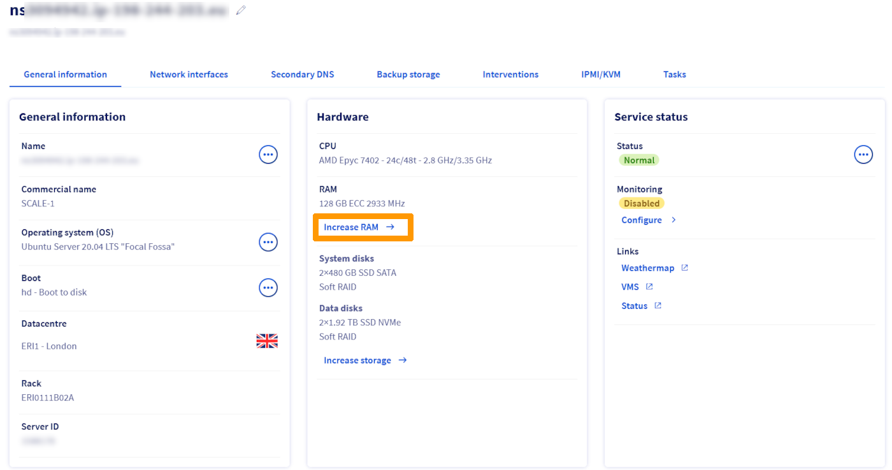
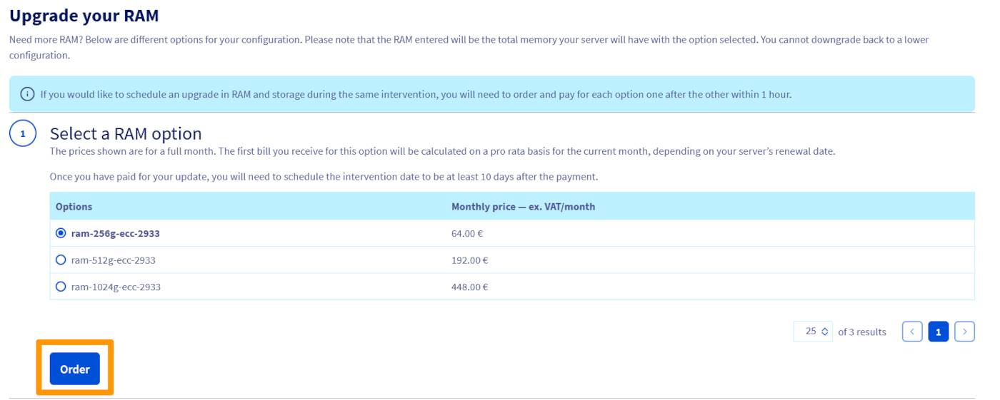
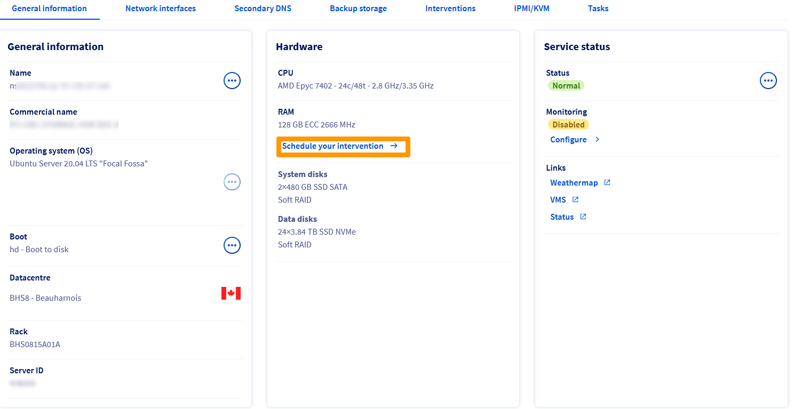
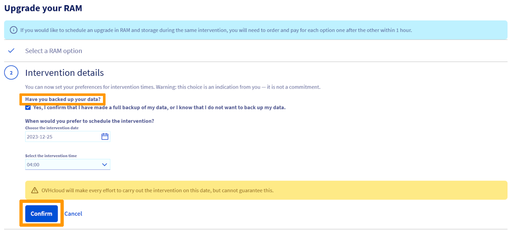
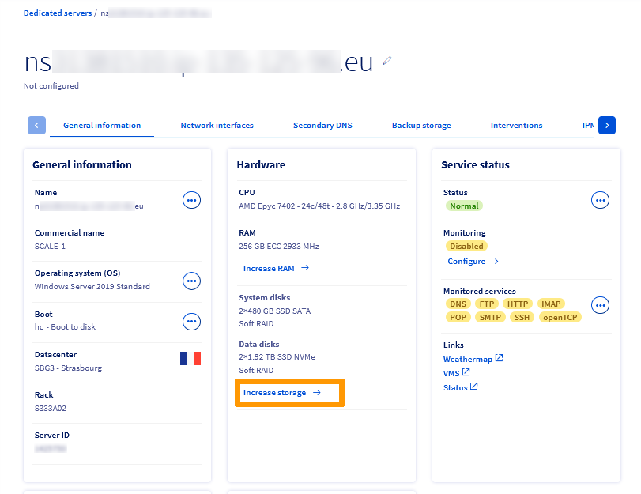
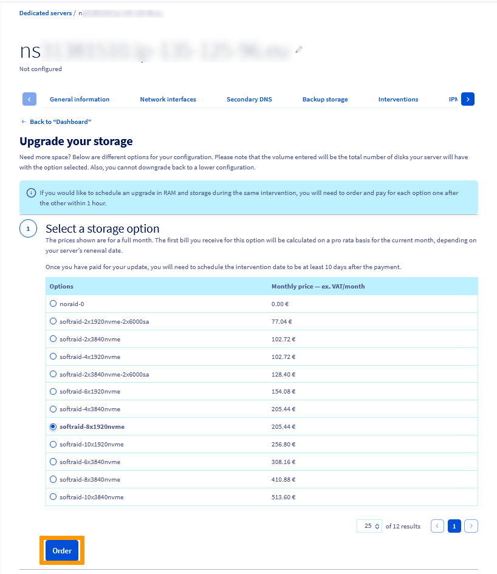
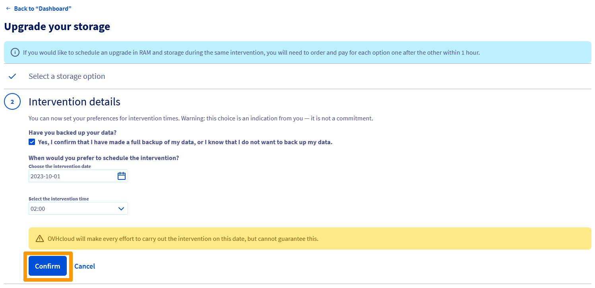

> [!primary]
> Esta traducción ha sido generada de forma automática por nuestro partner SYSTRAN. En algunos casos puede contener términos imprecisos, como en las etiquetas de los botones o los detalles técnicos. En caso de duda, le recomendamos que consulte la versión inglesa o francesa de la guía. Si quiere ayudarnos a mejorar esta traducción, por favor, utilice el botón «Contribuir» de esta página.

## Objetivo

Nuestros servidores High Grade y Scale le ofrecen una opción escalable que le permite aumentar su espacio en disco y la RAM.

**El objetivo de esta guía es guiarle en el proceso de solicitud de mejora del hardware en los servidores dedicados High Grade y SCALE de OVHcloud.**

> [!primary]
> Los pasos de esta guía solo se aplican a nuestras nuevas gamas (High Grade y Scale). En el caso de las gamas anteriores, la solicitud debe enviarse a través de un tíquet al servicio de atención al cliente.

## Requisitos

- Un servidor [High Grade](https://www.ovhcloud.com/es-es/bare-metal/high-grade/) o [SCALE](https://www.ovhcloud.com/es-es/bare-metal/scale/)
- Estar conectado a su [área de cliente de OVHcloud](/links/manager)

## En la práctica

Conéctese a su [área de cliente de OVHcloud](/links/manager).

En la sección `Bare Metal Cloud`{.action}, seleccione su servidor entre los **Servidores dedicados**.

### Aumentar la RAM

En la pestaña `Hardware`{.action}, haga clic en `Aumentar la RAM`{.action}.

{.thumbnail}

En la siguiente pestaña, seleccione la opción de RAM deseada y haga clic en `Contratar`{.action}.

{.thumbnail}

Una vez abonado el pedido, le enviaremos un mensaje de confirmación a su cuenta con un enlace para planificar la intervención para la actualización de la RAM.

Haga clic en el enlace que aparece en el mensaje de correo electrónico y será redirigido al panel de control del servidor dedicado. Esta vez, haga clic en `Programar la intervención`{.action}.

{.thumbnail}

Marque la casilla de verificación situada debajo de `¿Ha realizado una copia de seguridad de sus datos?`{.action} y seleccione la fecha y la hora entre las franjas horarias propuestas. Tenga en cuenta que la intervención de los técnicos de nuestros datacenters requiere un período de preparación. La primera fecha de disponibilidad se establece después de un período mínimo de 10 días.

A continuación, haga clic en `Confirmar`{.action}.

{.thumbnail}

Recibirá un mensaje de correo electrónico confirmando la fecha y la hora de la intervención.

### Aumentar el almacenamiento

En la pestaña `Hardware`{.action}, haga clic en `Ampliar el almacenamiento`{.action}.

{.thumbnail}

En la pestaña siguiente, seleccione la opción de almacenamiento deseada y haga clic en `Contratar`{.action}.

{.thumbnail}

Una vez abonado el pedido, le enviaremos un email de confirmación a su cuenta con un enlace para planificar la intervención para la actualización del almacenamiento.

Haga clic en el enlace que aparece en el mensaje de correo electrónico y será redirigido al panel de control del servidor dedicado. Esta vez, haga clic en `Programar la intervención`{.action}.

{.thumbnail}

Marque la casilla de verificación situada debajo de `¿Ha realizado una copia de seguridad de sus datos?`{.action} y seleccione la fecha y la hora entre las franjas horarias propuestas. Tenga en cuenta que la intervención de los técnicos de nuestros datacenters requiere un período de preparación. La primera fecha de disponibilidad se establece después de un período mínimo de 10 días.

A continuación, haga clic en `Confirmar`{.action}.

{.thumbnail}

Recibirá un mensaje de correo electrónico confirmando la fecha y la hora de la intervención.

Si desea programar la mejora de la memoria y el almacenamiento durante la misma intervención, deberá contratar y realizar el pago de las opciones, una a una, en un plazo de una hora.

## Más información 
 
Para servicios especializados (posicionamiento, desarrollo, etc.), contacte con [partners de OVHcloud](/links/partner).
 
Si quiere disfrutar de ayuda para utilizar y configurar sus soluciones de OVHcloud, puede consultar nuestras distintas soluciones [pestañas de soporte](https://www.ovhcloud.com/es-es/support-levels/).
 
Interactúe con nuestra comunidad de usuarios en <https://community.ovh.com/en/>.