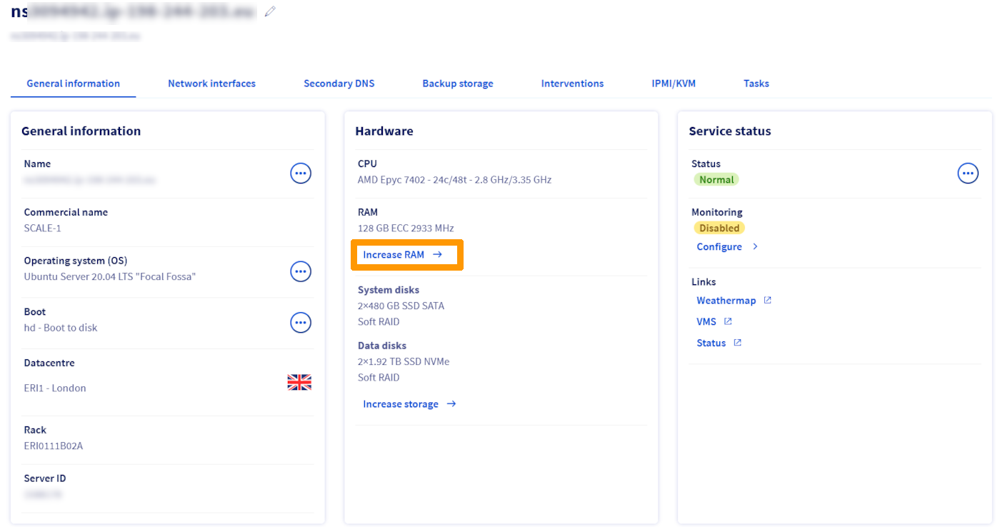
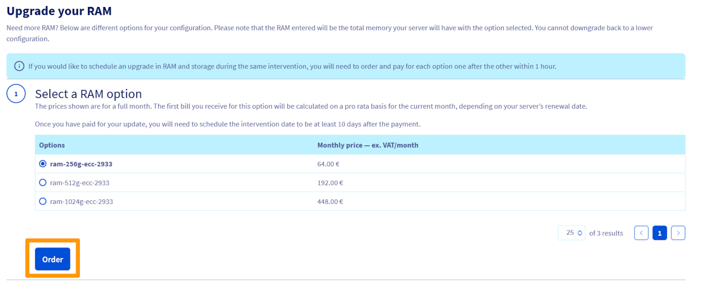
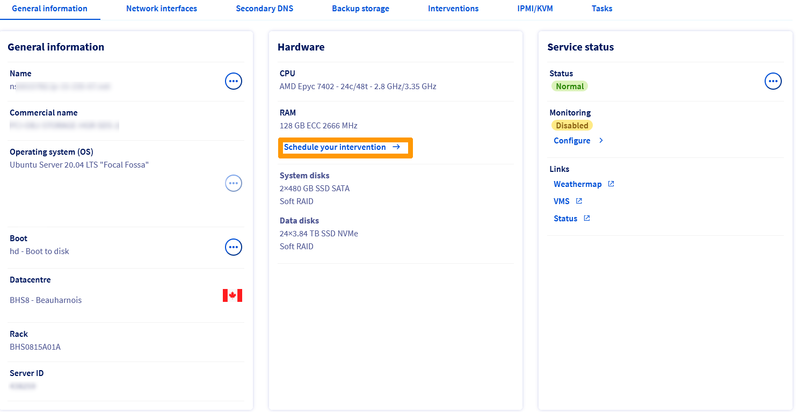
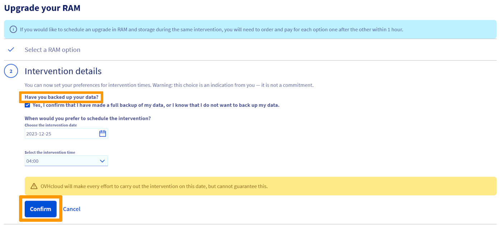
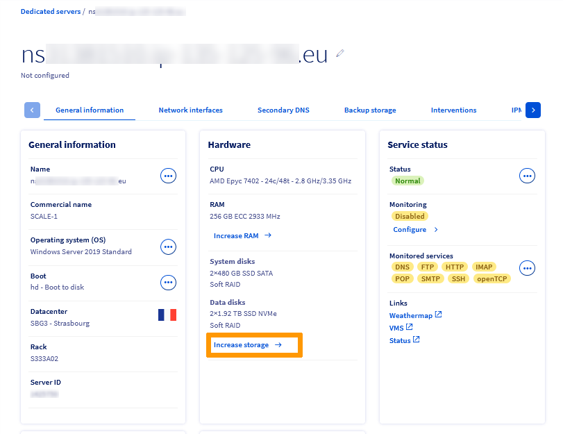
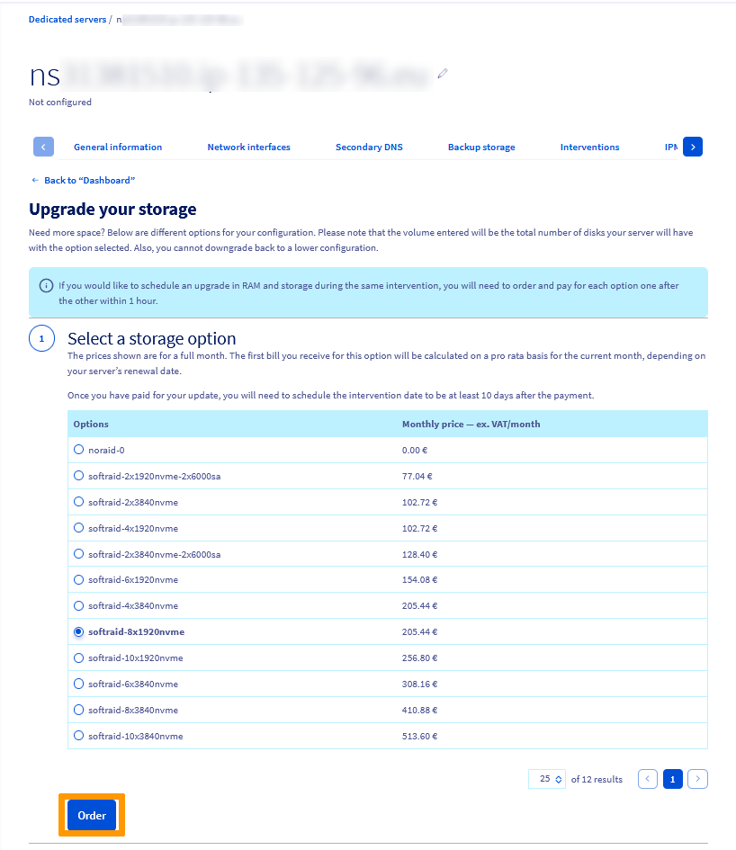
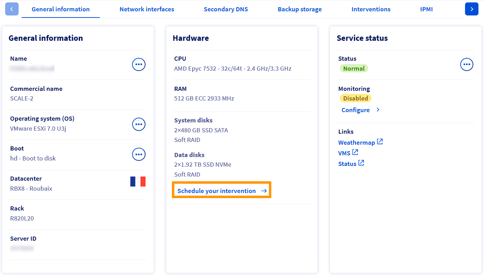
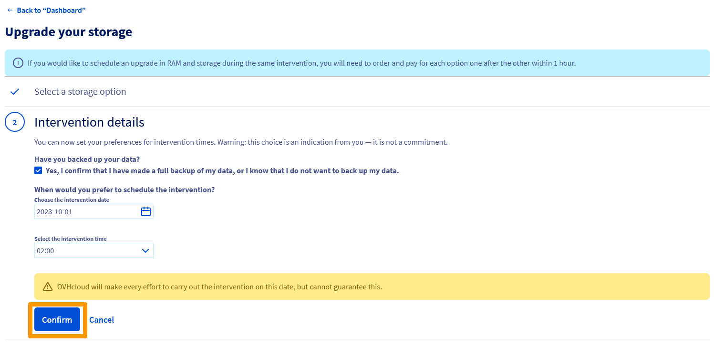

> [!primary]
> Esta tradução foi automaticamente gerada pelo nosso parceiro SYSTRAN. Em certos casos, poderão ocorrer formulações imprecisas, como por exemplo nomes de botões ou detalhes técnicos. Recomendamos que consulte a versão inglesa ou francesa do manual, caso tenha alguma dúvida. Se nos quiser ajudar a melhorar esta tradução, clique em "Contribuir" nesta página.
>

## Objetivo

Os nossos servidores High Grade e Scale propõem-lhe uma opção escalável que lhe permite aumentar o seu espaço em disco e a RAM.

**O objetivo deste guia é de o orientar no processo de pedido de upgrade do hardware nos servidores dedicados High Grade e SCALE OVHcloud.**

> [!primary]
> As etapas deste guia aplicam-se apenas às nossas novas gamas (High Grade e Scale). Para as gamas mais antigas, o pedido deve ser efetuado através de um ticket junto do suporte ao cliente.

## Requisitos

- Um servidor [High Grade](https://www.ovhcloud.com/pt/bare-metal/high-grade/) ou [SCALE](https://www.ovhcloud.com/pt/bare-metal/scale/)

<!-- CP-NAV-START:baremetal-dedicated-servers -->
---

### Acesso à Área de Cliente OVHcloud

- **Link direto:** [Servidores dedicados](/links/control-panel/baremetal-dedicated-servers)
- **Caminho de navegação:** `Bare Metal Cloud`{.action} > `Servidores dedicados`{.action} > Selecione o seu servidor

---
<!-- CP-NAV-END:baremetal-dedicated-servers -->

## Instruções

### Aumentar a RAM

No separador `Hardware`{.action}, clique em `Aumentar a RAM`{.action}.

{.thumbnail}

No próximo separador, selecione a opção de RAM desejada e clique em `Encomendar`{.action}.

{.thumbnail}

Uma vez a encomenda paga, será enviado um e-mail de confirmação à sua conta com uma ligação para planificar a intervenção para a atualização da RAM.

Clique no link presente no e-mail e será reencaminhado para o painel de controlo do servidor dedicado. Desta vez, clique em `Planear a sua intervenção`{.action}.

{.thumbnail}

Marque a caixa em `Efetuou um backup dos seus dados?`{.action} e selecione a data e a hora entre as faixas horárias propostas. Tenha em conta que a intervenção dos técnicos dos nossos datacenters requer um período de preparação. A primeira data de disponibilidade é definida após um período mínimo de 10 dias.

A seguir, clique em `Confirmar`{.action}.

{.thumbnail}

Receberá um e-mail a confirmar a data e a hora da intervenção.

### Aumentar o armazenamento

No separador `Hardware`{.action}, clique em `Aumentar o armazenamento`{.action}.

{.thumbnail}

No próximo separador, selecione a opção de armazenamento desejada e clique em `Encomendar`{.action}.

{.thumbnail}

Após o pagamento da encomenda, será enviado um e-mail de confirmação à sua conta com uma ligação para programar a intervenção para a atualização do armazenamento.

Clique no link presente no e-mail e será reencaminhado para o painel de controlo do servidor dedicado. Desta vez, clique em ‘Planear a intervenção`{.action}.

{.thumbnail}

Marque a caixa em `Efetuou um backup dos seus dados?`{.action} e selecione a data e a hora entre as faixas horárias propostas. Tenha em conta que a intervenção dos técnicos dos nossos datacenters requer um período de preparação. A primeira data de disponibilidade é definida após um período mínimo de 10 dias.

A seguir, clique em `Confirmar`{.action}.

{.thumbnail}

Receberá um e-mail a confirmar a data e a hora da intervenção.

Se pretender programar uma evolução de memória e de armazenamento durante a mesma intervenção, deverá encomendar e pagar cada opção uma após a outra no prazo de uma hora.

## Quer saber mais? 
 
Para serviços especializados (referenciamento, desenvolvimento, etc), contacte os [parceiros OVHcloud](/links/partner).
 
Se pretender usufruir de uma assistência na utilização e na configuração das suas soluções OVHcloud, consulte as nossas diferentes [ofertas de suporte](/links/support).
 
Fale com nossa comunidade de utilizadores: <https://community.ovh.com/en/>.