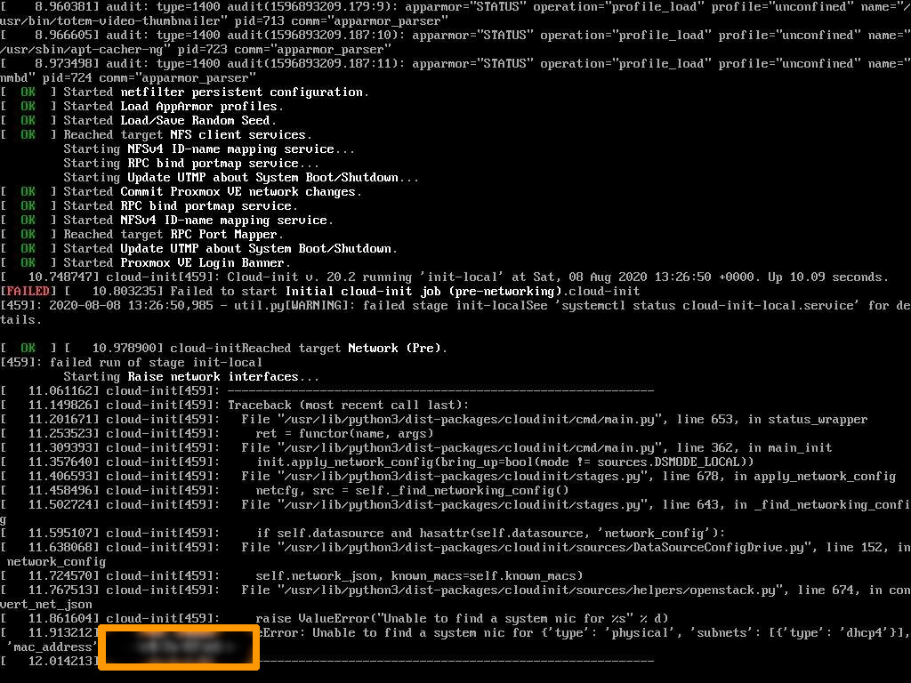
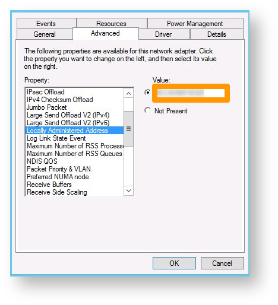
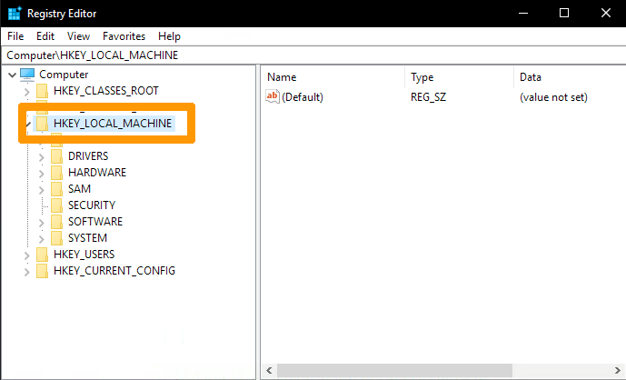
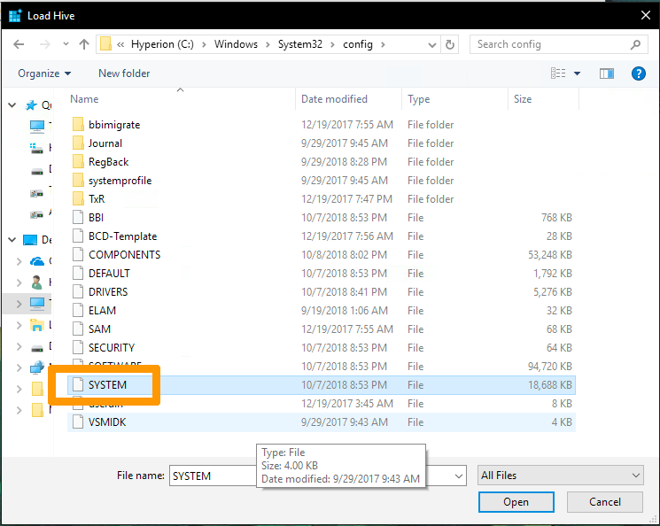
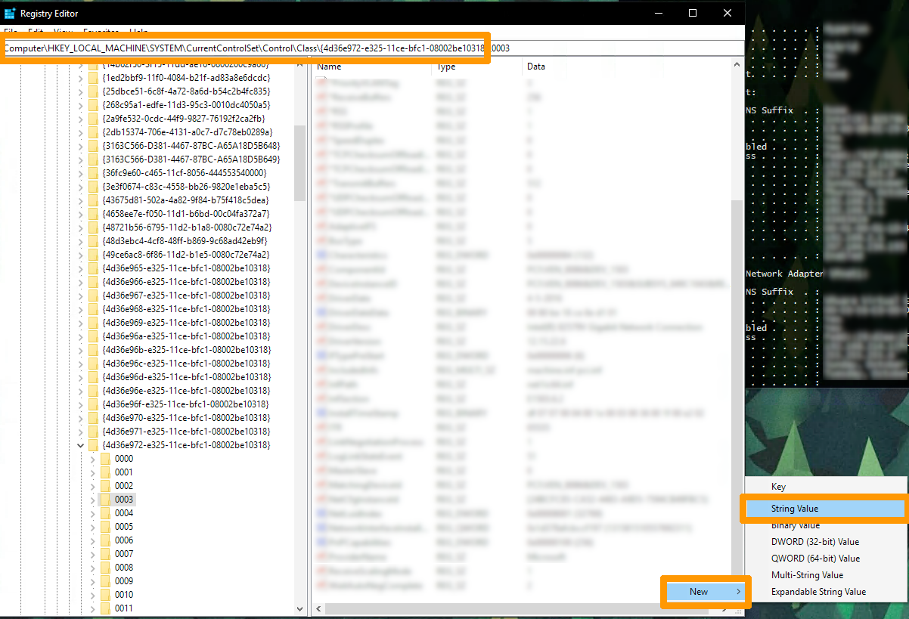
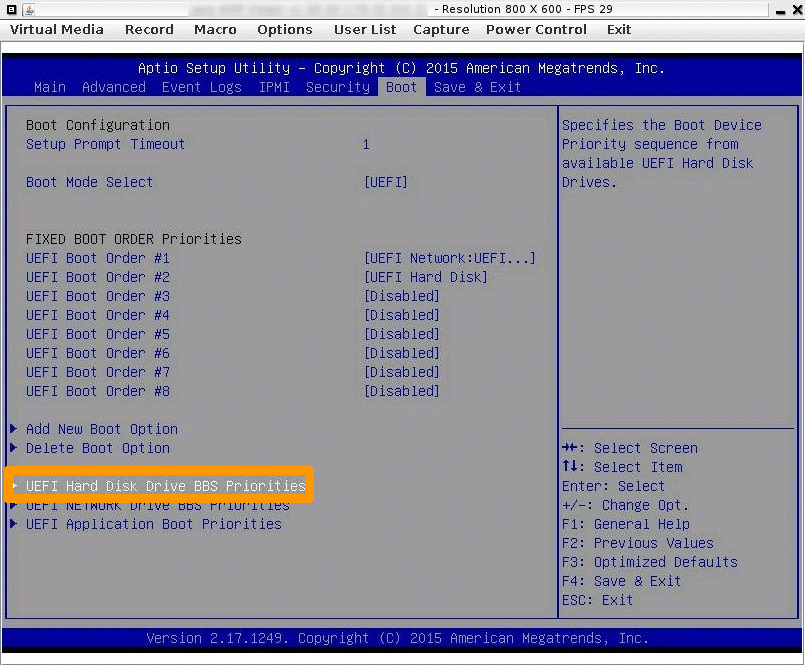

## Objective

Our maintenance interventions are limited to the hardware aspect of your server. Following a maintenance intervention, actions may be required on your server’s software section.

This guide, which is based on a number of feedback received from our teams and use cases, lists the actions that need to be taken, depending on your installation: operating systems, hypervisor, etc.

Its goal is to support you and ensure that there is as little impact as possible in the lifecycle of your environments.

## Requirements

- A [dedicated server](https://www.ovhcloud.com/es-es/bare-metal/) in your OVHcloud account

## Instructions

> [!primary]
>
> Find out how to identify the names of your network interfaces in [this subpart of this guide](#network-interface).
> 

Continue reading this guide by clicking on the link for your installation:

- Operating system
    - [Ubuntu](#ubuntu)
    - [CentOS/Alma Linux](#centos-almalinux)
    - [SmartOS](#smartos)
    - [FreeBSD](#freebsd)
    - [Gentoo](#gentoo)
- Virtualisation
    - [Proxmox](#proxmox)
    - [XenServer](#xenserver)
    - [ESXi](#esxi)
    - [Windows (hyper-V)](#windows)

> [!primary]
>
> If you experience an operating system boot problem that appears to be related to its EFI boot partition, go directly to this [section](#partition-efi).
>

<a name="ubuntu"></a>

### Ubuntu 
If you are experiencing network connectivity issues (for example, no ping after a motherboard replacement), perform the following steps:

1\. Reboot the server in [rescue mode](/pages/bare_metal_cloud/dedicated_servers/rescue_mode).
2\. Mount the partition `/`:

```bash
root@rescue:~# mount /dev/my_system_disk /mnt
```

If the `70-persistent-net.rules` file does not exist (refer to the section of this guide on [the names of your network interfaces](#network-interface)), check the following files in the `/etc/systemd/network/` tree:

- `50-default.network`
- `50-public-interface.link`

```bash
root@rescue:~# cat /mnt/etc/systemd/network/50-default.network
# This file sets the IP configuration of the primary (public) network device.
# You can also see this as "OSI Layer 3" config.
# It was created by the OVH installer, please be careful with modifications.
# Documentation: man systemd.network or https://www.freedesktop.org/software/systemd/man/systemd.network.html
 
[Match]
MACAddress=xx:xx:xx:xx:xx:xx
 
[Network]
Description=network interface on public network, with default route
DHCP=no
Address=1.2.3.4/24
Gateway=1.2.3.254
IPv6AcceptRA=no
NTP=ntp.ovh.net
DNS=127.0.0.1
DNS=213.186.33.99
DNS=2001:41d0:3:163::1
Gateway=2001:41d0:0203:4bff:ff:ff:ff:ff
 
[Address]
Address=2001:41d0:0203:1234::/64
 
[Route]
Destination=2001:41d0:0203:4bff:ff:ff:ff:ff:ff
Scope=link
root@rescue:~#
root@rescue:~# cat /mnt/etc/systemd/network/50-public-interface.link
# This file configures the relation between network device and device name.
# You can also see this as "OSI Layer 2" config.
# It was created by the OVH installer, please be careful with modifications.
# Documentation: man systemd.link or https://www.freedesktop.org/software/systemd/man/systemd.link.html
 
[Match]
MACAddress=xx:xx:xx:xx:xx:xx
 
[Link]
Description=network interface on public network, with default route
MACAddressPolicy=persistent
NamePolicy=kernel database onboard slot path mac
#Name=eth2    # name under which this interface is known under OVH rescue system
#Name=eno3    # name under which this interface is probably known by systemd
root@rescue:~#
```

3\. Save and edit the files to enter the new value for your MAC address:

```bash
root@rescue:~# cp /mnt/etc/systemd/network/50-default.network /mnt/etc/systemd/network/50-default.network.link.bak-`date +%s`
root@rescue:~# cp /mnt/etc/systemd/network/50-public-interface.link /mnt/etc/systemd/network/50-public-interface.link.bak-`date +%s`
root@rescue:~# nano /mnt/etc/systemd/network/50-default.network
root@rescue:~# cat /mnt/etc/systemd/network/50-default.network | grep MACAddress
MACAddress=xx:xx:xx:xx:xx:xx
root@rescue:~#
root@rescue:~# nano /mnt/etc/systemd/network/50-public-interface.link
root@rescue:~#
root@rescue:~# cat /mnt/etc/systemd/network/50-public-interface.link | grep MACAddress
MACAddress=xx:xx:xx:xx:xx:xx
root@rescue:~#
```

4\. Please remember to unmount the partition `/` before rebooting the server.


#### Special cases

In some cases, it is necessary to propagate the new MAC address to the following files:

- `/mnt/etc/netplan/01-netcfg.yaml`
- `/mnt/etc/netplan/50-cloud-init.yaml`
- `/mnt/etc/systemd/network/10-eno1.link`
- `/mnt/etc/systemd/network/10-eno1.network`

<a name="centos-almalinux"></a>

### CentOS/Alma Linux

If you are experiencing network connectivity issues (for example, no ping after a motherboard replacement), perform the following steps: 

1\. Reboot the server in [rescue mode](/pages/bare_metal_cloud/dedicated_servers/rescue_mode).
2\. Mount the partition `/`:

```bash
root@rescue:~# mount /dev/my_system_disk /mnt
```

3\. Check the configuration file `/mnt/etc/sysconfig/network-scripts/ifcfg-eth0`.
4\. Back up the files and edit them to correct the MAC address:

```bash
root@rescue:~# cp /mnt/etc/sysconfig/network-scripts/ifcfg-eth0 /mnt/etc/sysconfig/network-scripts/ifcfg-eth0.`date +%s`
```

5\. Enter the new MAC address in the line `HWADDR=xx.xx.xx.xx.xx.xx`.
6\. Please remember to unmount the partition `/` before rebooting the server.

<a name="smartos"></a>

### SmartOS

If you are experiencing network connectivity issues (for example, no ping after a motherboard replacement), perform the following steps:

1\. Reboot the server in [rescue mode](/pages/bare_metal_cloud/dedicated_servers/rescue_mode).

```bash 
modprobe zfs
root@rescue:~# zpool import -f zones (zpool import to list the pools)
root@rescue:~# zfs set mountpoint=/mnt zones/usbkey
root@rescue:~# zfs mount zones/usbkey
root@rescue:~# cp /mnt/config {,.bak-$(date +"%Y-%m-%d-%H_%M")}
```

2\. Enter the new MAC address in the `admin_nic` line:

```bash
root@rescue:~#  vim /mnt/config
```

3\. Do not forget to unmount the partitions before rebooting the server in `netboot` mode:

```bash
root@rescue:~# zfs umount -a
root@rescue:~# zfs set mountpoint=`/usbkey` zones/usbkey 
```

<a name="freebsd"></a>

### FreeBSD

If you are experiencing network connectivity issues (for example, no ping after a motherboard replacement), perform the following steps:

1\. Reboot the server in rescue-bsd mode.
2\. Run the `ifconfig` command from the rescue-bsd prompt.

This way, you can identify the name of your network interface:

```bash
root@rescue-bsd:~ # ifconfig
igb0: flags=8843<UP,BROADCAST,RUNNING,SIMPLEX,MULTICAST> metric 0 mtu 1500
options=403bb<RXCSUM,TXCSUM,VLAN_MTU,VLAN_HWTAGGING,JUMBO_MTU,VLAN_HWCSUM,TSO4,TSO6,VLAN_HWTSO>
ether xx:xx:xx:xx:xx:xx
```

3\. Run the `gpart show` command to locate and associate the partitions/names:

```bash
root@rescue-bsd:~ # gpart show
=> 63 3907029105 ada0 MBR (1.8T)
 63 3907029105 1 freebsd [active] (1.8T)
 
=> 0 3907029105 ada0s1 BSD (1.8T)
 0 40960000 1 freebsd-ufs (20G)
 40960000 3865020416 2 freebsd-ufs (1.8T)
 3905980416 1048689 4 freebsd-swap (512M)
 
=> 63 3907029105 diskid/DISK-PN1134P6K14W5W MBR (1.8T)
 63 3907029105 1 freebsd [active] (1.8T)
 
=> 0 3907029105 diskid/DISK-PN1134P6K14W5Ws1 BSD (1.8T)
 0 40960000 1 freebsd-ufs (20G)
 40960000 3865020416 2 freebsd-ufs (1.8T)
 3905980416 1048689 4 freebsd-swap (512M)
```

4\. Mount the partition you are interested in, you can modify the interface via the file `/etc/rc.conf`:

```bash
root@rescue-bsd:~ # zpool import
   pool: zroot
     id: 16525429322000118320
  state: ONLINE
 status: The pool was last accessed by another system.
 action: The pool can be imported using its name or numeric identifier and
    the '-f' flag.
   see: http://illumos.org/msg/ZFS-8000-EY
 config:
 
    zroot       ONLINE
      ada0p4    ONLINE
root@rescue-bsd:~ #
root@rescue-bsd:~ #
root@rescue-bsd:~ # zpool import -f zroot
cannot mount '/home': failed to create mountpoint
cannot mount '/zroot': failed to create mountpoint
root@rescue-bsd:~ #
 
root@rescue-bsd:~ # zfs list -t all
NAME                 USED  AVAIL  REFER  MOUNTPOINT
zroot               1.01G   673G    88K  /zroot
zroot/ROOT          1.00G   673G    88K  none
zroot/ROOT/default  1.00G  18.5G  1.00G  /
zroot/home            88K   673G    88K  /home
root@rescue-bsd:~ # mkdir /tmp/rootClient
root@rescue-bsd:~ # zfs set mountpoint=/tmp/roo
mountpoint=/tmp/ not found
 
root@rescue-bsd:~ # zfs set mountpoint=/tmp/rootClient zroot/ROOT/default
root@rescue-bsd:~ # zfs list -t all
NAME                 USED  AVAIL  REFER  MOUNTPOINT
zroot               1.01G   673G    88K  /zroot
zroot/ROOT          1.00G   673G    88K  none
zroot/ROOT/default  1.00G  18.5G  1.00G  /tmp/rootClient
zroot/home            88K   673G    88K  /home
root@rescue-bsd:~ #
 
root@rescue-bsd:~ # zfs mount zroot/ROOT/default
root@rescue-bsd:~ # ls /tmp/rootClient/
.cshrc          .rnd            bin             boot.config     entropy         home            libexec         mnt             opt             rescue          sbin            tmp             var
.profile        COPYRIGHT       boot            dev             etc             lib             media           net             proc            root            sys             usr             zroot
root@rescue-bsd:~ #
```

5\. Back up the files and edit them to correct the MAC address.

In this case, we need to modify the 3 instances of `em0` by `ibg0` from the associated configuration file:

```bash
root@rescue-bsd:~ # mount /dev/ada0s1 /mnt/
root@rescue-bsd:~ #
root@rescue-bsd:~ # cat /mnt/etc/rc.conf
sshd_enable="YES"
# Set dumpdev to "AUTO" to enable crash dumps, "NO" to disable
dumpdev="AUTO"
local_unbound_enable=yes
ifconfig_em0="inet xx.xxx.xxx.xxx netmask 255.255.255.0 broadcast xx.xxx.xxx.255"
defaultrouter="xx.xxx.xxx.254"
  
# IPv6 configuration
ipv6_enable="YES"
ipv6_network_interfaces="em0"
ifconfig_em0_ipv6="inet6 2001:xxxx:xxxx:xxx::1 prefixlen 128 accept_rtadv no_radr"
ipv6_static_routes="ovhgw"
ipv6_route_ovhgw="2001:41d0:0001:c1ff:ff:ff:ff:ff -prefixlen 128 -interface em0"
ipv6_defaultrouter="2001:41d0:0001:c1ff:ff:ff:ff:ff"
mysql_enable="YES"
root@rescue-bsd:~ #
root@rescue-bsd:~ # cp /mnt/etc/rc.conf /mnt/etc/rc.conf.`date +%s`
root@rescue-bsd:~ #
root@rescue-bsd:~ # vim /mnt/etc/rc.conf
root@rescue-bsd:~ #
root@rescue-bsd:~ # cat /mnt/etc/rc.conf
sshd_enable="YES"
# Set dumpdev to "AUTO" to enable crash dumps, "NO" to disable
dumpdev="AUTO"
local_unbound_enable=yes
ifconfig_ibg0="inet xx.xxx.xxx.xxx netmask 255.255.255.0 broadcast xx.xxx.xxx.255"
defaultrouter="xx.xxx.xxx.254"
  
# IPv6 configuration
ipv6_enable="YES"
ipv6_network_interfaces="em0"
ifconfig_ibg0_ipv6="inet6 2001:xxxx:xxxx:xxxx::1 prefixlen 128 accept_rtadv no_radr"
ipv6_static_routes="ovhgw"
ipv6_route_ovhgw="2001:41d0:0001:c1ff:ff:ff:ff:ff -prefixlen 128 -interface ibg0"
ipv6_defaultrouter="2001:41d0:0001:c1ff:ff:ff:ff:ff"
mysql_enable="YES"
root@rescue-bsd:~ #
```

6\. Unmount ZFS partitions:

```bash
root@rescue-bsd:~ # zfs unmount /tmp/rootClient/
root@rescue-bsd:~ # zfs get mountpoint zroot/ROOT/default
NAME                PROPERTY    VALUE            SOURCE
zroot/ROOT/default  mountpoint  /tmp/rootClient  local
root@rescue-bsd:~ # zfs setuntpoint zroot/ROOT/default
root@rescue-bsd:~ # zfs set mountpoint=/ zroot/ROOT/default
root@rescue-bsd:~ # zfs get mountpoint zroot/ROOT/default
NAME                PROPERTY    VALUE       SOURCE
zroot/ROOT/default  mountpoint  /           local
root@rescue-bsd:~ # zfs list -t all
NAME                 USED  AVAIL  REFER  MOUNTPOINT
zroot               1.01G   673G    88K  /zroot
zroot/ROOT          1.00G   673G    88K  none
zroot/ROOT/default  1.00G  18.5G  1.00G  /
zroot/home            88K   673G    88K  /home
root@rescue-bsd:~ # zpool export zroot
root@rescue-bsd:~ # zfs list -t all
no datasets available
root@rescue-bsd:~ #
```

<a name="gentoo"></a>

### Gentoo

After a motherboard has been replaced, it is not possible to modify the new MAC addresses through the OS via rescue mode.

1\. Reboot the server in [rescue mode](/pages/bare_metal_cloud/dedicated_servers/rescue_mode) and locate the partition `/`:

```bash
root@rescue:~# blkid
/dev/sda1: UUID="15D6-5706" TYPE="vfat" PARTLABEL="grub" PARTUUID="bf514348-6259-41a4-a73f-ba0c38d45de5"
/dev/sda2: UUID=`15D6-8A6F` TYPE=`vfat` PARTLABEL=`boot` PARTUUID=`7c0cbc80-c09a-4226-b7f2-91689a04250c`
/dev/sda3: UUID=`Q1r3UN-wfmY-QSPI-jIvA-9ybX-IWwk-YNNnUg` TYPE=`LVM2_member` PARTLABEL=`lvm` PARTUUID=`79581bf9-3eb3-4947 9-c51-856fb5d72ffa`
/dev/mapper/vg0-swap: UUID="337409d9-cdc5-4db8-a957-336631d3e7cb" TYPE="swap"
/dev/mapper/vg0-root: UUID="2b672f12-77be-40c2-a099-487565ffa933" TYPE="xfs"
root@rescue:~#
```

In our example, the system uses _LVM_:

```bash
root@rescue:~# lvdisplay
  --- Logical volume ---
  LV Path                /dev/vg0/swap
  LV Name                swap
  VG Name                vg0
  LV UUID                X9ttby-08vi-iJVW-aJGP-qnep-PDI9-ohJF6J
  LV Write Access        read/write
  LV Creation host, time rescue.ovh.net, 2019-06-03 16:21:38 -0400
  LV Status              available
  # open                 0
  LV Size                128.00 GiB
  Current LE             32768
  Segments               1
  Allocation             inherit
  Read ahead sectors     auto
  - currently set to     256
  Block device           252:0
 
  --- Logical volume ---
  LV Path                /dev/vg0/root
  LV Name                root
  VG Name                vg0
  LV UUID                822GLw-DELk-Q1ze-3NJD-1B3W-LT9H-CG8RTO
  LV Write Access        read/write
  LV Creation host, time rescue.ovh.net, 2019-06-03 16:21:44 -0400
  LV Status              available
  # open                 0
  LV Size                17.34 TiB
  Current LE             4545078
  Segments               1
  Allocation             inherit
  Read ahead sectors     auto
  - currently set to     256
  Block device           252:1
```

2\. Mount the `/` identified partition:

```bash
root@rescue:~# mount /dev/vg0/root /mnt
root@rescue:~# ls /mnt
backups  bin  boot  dev  etc  home  images  images-ear  images-ueba  lib  lib32
        media  mnt  opt  overlayimages  proc  root  run  sbin  srv  sys  tmp  uploads  usr  var
```

In Gentoo, MAC addresses are present in the following 4 files:

```bash
root@rescue:~# cat /mnt/etc/systemd/network/
10-external.link   11-internal.link   50-static.network  51-vrack.network
root@rescue:~#
```

3\. Back up files before editing them:

```bash
root@rescue:~# cp /mnt/etc/systemd/network/50-static.network /mnt/etc/systemd/network/50-static.network.`date +%s`
root@rescue:~# cp /mnt/etc/systemd/network/51-vrack.network /mnt/etc/systemd/network/51-vrack.network.`date +%s`
root@rescue:~# cp /mnt/etc/systemd/network/10-external.link /mnt/etc/systemd/network/10-external.link.`date +%s`
root@rescue:~# cp /mnt/etc/systemd/network/11-internal.link /mnt/etc/systemd/network/11-internal.link.`date +%s`
```

4\. Update the files with the new MAC addresses:

```bash
root@rescue:~# nano /mnt/etc/systemd/network/50-static.network
root@rescue:~# nano /mnt/etc/systemd/network/51-vrack.network
root@rescue:~# nano /mnt/etc/systemd/network/10-external.link
root@rescue:~# nano /mnt/etc/systemd/network/11-internal.lin
```

5\. Unmount the partitions, then *reboot*:

```bash
root@rescue:~# umount /mnt
root@rescue:~# reboot
```

#### Special cases

For some versions, only the file ` /mnt/etc/udev/rules.d/10-f2c-network.rules` needs to be modified:

```bash
root@rescue:~# cat /mnt/etc/gentoo-release
Gentoo Base System release 2.2
root@rescue:~#
root@rescue:~# ls /mnt/etc/udev/rules.d/
10-f2c-network.rules
root@rescue:~#
root@rescue:~# cat /mnt/etc/udev/rules.d/10-f2c-network.rules
SUBSYSTEM=="net", ACTION=="add", DRIVERS=="?*", ATTR{address}=="xx:xx:xx:xx:xx:xx", ATTR{type}=="1", KERNEL=="*", NAME="netpublic0"
SUBSYSTEM=="net", ACTION=="add", DRIVERS=="?*", ATTR{address}=="xx:xx:xx:xx:xx:xx", ATTR{type}=="1", KERNEL=="*", NAME="netprivate0"
root@rescue:~#
```

<a name="proxmox"></a>

### Proxmox

If you are experiencing network connectivity issues (for example, no ping after a motherboard replacement), this may be related to an error during system startup caused by the old MAC address value still present:

{.thumbnail}

Do the following:

1\. Reboot the server in [rescue mode](/pages/bare_metal_cloud/dedicated_servers/rescue_mode).

```bash
root@rescue:~# cat /mnt/etc/network/interfaces
# This file describes the network interfaces available on your system
# and how to activate them. For more information, see interfaces(5).
 
# The loopback network interface
auto lo
iface lo inet loopback
 
iface enp3s0f0 inet manual
 
auto vmbr0
iface vmbr0 inet dhcp
  bridge-ports enp3s0f0
  bridge-stp off
  bridge-fd 0
 
auto vmbr1
iface vmbr1 inet static
  address  192.168.22.254
  netmask  255.255.255.0
  bridge_ports none
  bridge_stp off
  bridge_fd 0
  post-up echo 1 > /proc/sys/net/ipv4/ip_forward
root@rescue:~#
root@rescue:~# cat /mnt/var/log/messages | grep renamed
Aug  8 14:27:20 s22 kernel: [    1.527563] igb 0000:04:00.0 eno1: renamed from eth0
Aug  8 14:27:20 s22 kernel: [    1.550622] igb 0000:04:00.1 eno2: renamed from eth1
Aug  8 14:27:34 s22 kernel: [   88.148303] eth0: renamed from vethGRELEP
Aug  8 14:27:36 s22 kernel: [   90.444727] eth0: renamed from vethVMV0MH
Aug  8 14:27:40 s22 kernel: [   94.116739] eth0: renamed from vethQWYCXT
Aug  8 14:27:43 s22 kernel: [   97.469199] eth0: renamed from vethAIWWWX
Aug  8 14:27:48 s22 kernel: [  102.101324] eth0: renamed from vethB2DGCS
Aug  8 14:27:48 s22 kernel: [  102.139437] eth1: renamed from vethRSNNKL
root@rescue:~#
```

2\. Create the `70-persistent-net.rules` file again with the new MAC address and the network interface name found in the `/mnt/etc/network/interfaces` file:

```bash
root@rescue:~# cat /mnt/etc/udev/rules.d/70-persistent-net.rules
SUBSYSTEM=="net", ACTION=="add", DRIVERS=="?*", ATTR{address}=="xx:xx:xx:xx:xx:xx", NAME="enp3s0f0"
root@rescue:~#
```

<a name="xenserver"></a>

### XenServer

If you are experiencing network connectivity issues (for example, no ping after a motherboard replacement), the MAC address is static configured and must be reset.

Do the following:

1\. Restart the server in [rescue mode](/pages/bare_metal_cloud/dedicated_servers/rescue_mode) and use the `chroot` command:

```bash
root@rescue:~# mount /dev/sda1 /mnt
root@rescue:~# mount -t proc /proc/ /mnt/proc/
root@rescue:~# mount -o bind /sys/ /mnt/sys/
root@rescue:~# mount -o bind /dev/ /mnt/dev/
root@rescue:~# mount -o bind /dev/pts/ /mnt/dev/pts/
root@rescue:~# chroot /mnt
```

2\. Change the current configuration to match the new settings:

```bash
[root@rescue /]# xe-reset-networking --device=eth0 --mode=static --ip=xx.xx.xx.xx --netmask=255.255.255.0 --gateway=xx.xx.xx.xxx
```

3\. You will be asked to answer the question with `yes`, then press Enter:

```bash
----------------------------------------------------------------------
!! WARNING !!
  
This command will reboot the host and reset its network configuration.
Any running VMs will be forcefully shutdown.
  
Before completing this command:
- Where possible, cleanly shutdown all VMs running on this host.
- Disable HA if this host is part of a resource pool with HA enabled.
----------------------------------------------------------------------
  
Your network will be re-configured as follows:
  
Management interface:   eth0
IP configuration mode:  static
IP address:             xx.xx.xx.xx
Netmask:                255.255.255.0
Gateway:                xx.xx.xx.xx
Pool master's address:  xx.xx.xx.xx
  
If you want to change any of the above settings, type 'no' and re-run
the command with appropriate arguments (use --help for a list of options).
  
Type 'yes' to continue.
Type 'no' to cancel.
yes
Stopping xapi...
Reconfiguring eth0...
Updating inventory file...
Running in chroot, ignoring request.
```

4\. Type "exit" to leave `chroot` mode, then unmount all partitions:

```bash
root@rescue:~# umount /mnt/sys
root@rescue:~# umount /mnt/proc
root@rescue:~# umount /mnt/dev/pts
root@rescue:~# umount /mnt/dev
root@rescue:~# umount /mnt
```

#### Special cases

You need to check and adapt the following files:  

- `/mnt/etc/sysconfig/network-scripts/interface-rename-data/static-rules.conf`  
- `/mnt/etc/sysconfig/network-scripts/interface-rename-data/dynamic-rules.json`

<a name="esxi"></a>

### ESXi

After a motherboard has been replaced, it is not possible to modify the new MAC addresses through the `esxi.conf` file via the tools integrated in rescue mode.
This will require manual intervention.

#### Version 7.0 or newer

The following procedure applies only to **versions 7.0 and later**. From this release on, the state.tgz file is encrypted.
You will need to reboot the network from the Direct Console menu via your KVM or IPMI.

Please refer to the screenshot below:

{.thumbnail}

#### Version 6.7 or older

The procedure described below applies only to **versions 6.7 and earlier**.

1\. Restart the server in [rescue mode](/pages/bare_metal_cloud/dedicated_servers/rescue_mode) in order to mount the partition `/`:

```bash
root@rescue:~# mount /dev/sdaX /mnt/
```

2\. Save the `state.tgz file`

```bash
root@rescue:~# ls /mnt/state.tgz
root@rescue:~# cp /mnt/state.tgz /mnt/state.tgz.`date +%s`
```

3\. Create a working environment:

```bash
root@rescue:~# mkdir /home/ovh/esxi
root@rescue:~# WORKINGDIR=/home/ovh/esxi
root@rescue:~# cd $WORKINGDIR
```

4\. Extract the contents of `state.tgz` to `$WORKINGDIR`, and then extract the contents of `local.tgz`.
5\. Edit the resulting `esx.conf` file:

```bash
root@rescue:/home/ovh/esxi# tar xf /mnt/state.tgz -C $WORKINGDIR
root@rescue:/home/ovh/esxi# tar xf /home/ovh/esxi/local.tgz -C $WORKINGDIR
root@rescue:/home/ovh/esxi# vim etc/vmware/esx.conf
```
6\. Locate and modify the MAC address for `vmkernelnic`:

```bash
/net/vmkernelnic/child[0000]/mac = "XX:XX:XX:XX:XX:XX"
```

7\. Identify on which interface the primary IP address is used:

```bash
/net/vswitch/child[0000]/uplinks/child[0000]/pnic = "vmnicX"
```

8\. Update the MAC address of the main interface:

> [!warning]
> Do not change the virtual MAC address.
>

```bash
/net/pnic/child[0001]/mac = "XX:XX:XX:XX:XX:XX"         <== Primary Interface Mac address
/net/pnic/child[0001]/virtualMac = "00:50:56:XX:XX:XX"  <== Virtual Mac
/net/pnic/child[0001]/name = "vmnic1"
```

> [!warning]
> If there is a vRack interface, remember to also change its MAC address.
>

9\. Perform a backup, then unmount the partition `/`:

```bash
root@rescue:/home/ovh/esxi# tar -czf $WORKINGDIR/local.tgz etc/
root@rescue:/home/ovh/esxi# tar -czf /mnt/state.tgz local.tgz
root@rescue:/home/ovh/esxi# umount /mnt
```

#### Special cases

Check the order of your vmnicX declarations. Here is a functional example:

```bash
root@rescue:/home/ovh/esxi# cat etc/vmware/esx.conf | grep "/vmkdevmgr/pci"
/vmkdevmgr/pci/m00008901/alias = "vmhba0"
/vmkdevmgr/pci/m00008501/alias = "vmnic0"
/vmkdevmgr/pci/m00008502/alias = "vmnic1"
```

<a name="windows"></a>

### Windows (Hyper-V)

After the motherboard is replaced, the server cannot be reached until you manually change the MAC addresses through **Device Manager**.

There are 2 methods:

#### Via IPMI/KVM

1\. Log in as an administrator from the [IPMI/KVM](/pages/bare_metal_cloud/dedicated_servers/using_ipmi_on_dedicated_servers) interface.
2\. Open the `Run`{.action} utility (Windows logo key + `R`{.action}), and through the `run` prompt, run the `devmgmt.msc` command:

{.thumbnail}

3\. Open `Network adapters`{.action} and select the adapter corresponding to `eth0`.
4\. Right-click on `Properties`{.action} > `Advanced`{.action}.
5\. Locate `Locally Administered Address`.
6\. Enter the new value for the MAC address (numbers only, no spaces).

{.thumbnail}


#### Via WinPE

1\. Restart the server in `WinPE` mode.
2\. Issue the `regedit` command at the `run` command prompt.
3\. Load the local registry through the one available in `WinPE`, then click `HKEY_LOCAL_MACHINE`{.action}:

{.thumbnail}

4\. Then click `Load Hive...`{.action}.

{.thumbnail}

> [!primary]
>
> By default, you will be in the WinPE tree.
> Don't forget to browse to `C:\`.
>

5\. Locate the `SYSTEM` registry.

{.thumbnail}

6\. You will be asked to enter a name. For example, you can choose `OVH_TEST`.

7\. Locate the following registry value:

```bash
"HKEY_LOCAL_MACHINE\SYSTEM\CurrentControlSet\Control\Class\{4D36E972-E325-11CE-BFC1-08002BE10318}"
```

> [!warning]
> As long as we are on WinPE, the value `CurrentControlSet` should be equal to `CurrentSet001`.
>

You should see several subkeys named like this: 0000, 0001, etc.

8\. Click each subkey to check the `DriverDesc` value that should match your network interface.
You can check the name of your interface from a terminal using the following command:

```bash
ipconfig /all
```

9\. Look in the `NetworkAddress` registry entries on the right pane and change the value to your new MAC address. If this entry does not exist, right-click in an empty box to create a `String` with the name `NetworkAddress`.

{.thumbnail}


10\. You will need to unload the registry to apply the recent changes. Click OVH_TEST (created earlier) then click `File`{.action} (in the top left-hand corner) and select `Unload hive...`{.action}.


<a name="network-interface"></a>

### Locate the name of your network interfaces

After the motherboard is replaced, the server cannot be reached because the network interface controller has been renamed by the operating system.

1\. Restart the server in [rescue mode](/pages/bare_metal_cloud/dedicated_servers/rescue_mode), mount the partition `/` and then use the `chroot` command:

```bash
root@rescue:~# mount /dev/my_disk /mnt
root@rescue:~# for i in /dev /dev/pts /proc /sys; do mount -B $i /mnt$i; done
root@rescue:~# chroot /mnt
```

2\. Check if the interfaces have been modified. Check the `var/log/messages` logs or `var/log/kern.log` if the interface has been renamed:

```bash
Oct  9 22:25:49 node1 kernel: [    5.479916] ixgbe 0000:03:00.1 eno4: renamed from eth1
Oct  9 22:25:49 node1 kernel: [    5.504285] ixgbe 0000:03:00.0 eno3: renamed from eth0
```

3\. Check your configuration file `/mnt/etc/udev/rules.d/70-persistent.-net.rules` and replace the new values (MAC addresses) if necessary:

```bash
root@rescue:~# cat /mnt/etc/udev/rules.d/70-persistent-net.rules
SUBSYSTEM=="net", ACTION=="add", DRIVERS=="?*", ATTR{address}=="xx:xx:xx:xx:xx:xx", ATTR{dev_id}=="0x0", ATTR{type}=="1", KERNEL=="eth*", NAME="public"
SUBSYSTEM=="net", ACTION=="add", DRIVERS=="?*", ATTR{address}=="xx:xx:xx:xx:xx:xx", ATTR{dev_id}=="0x0", ATTR{type}=="1", KERNEL=="eth*", NAME="private"
```

4\. Go to the directory `/boot/grub/` and create a backup of the file `grub.cfg`.
5\. Edit the `/etc/default/grub` file and edit the line beginning with `GRUB_CMDLINE_LINUX` to get this:

```bash
GRUB_CMDLINE_LINUX="net.ifnames=0 biosdevname=0"
```

6\. Run the command:

```bash
root@rescue:~# grub-mkconfig -o /boot/grub/grub.cfg
```

7\. Exit the `chroot` environment using the `exit` command and unmount all partitions:

```bash
root@rescue:~# umount /mnt/sys
root@rescue:~# umount /mnt/proc
root@rescue:~# umount /mnt/dev/pts
root@rescue:~# umount /mnt/dev
root@rescue:~# umount /mnt
```

<a name="partition-efi"></a>

### Problems with your EFI partition

The following steps are indicated if you experience a boot problem related to the partitions present on your disks.<br>
There are 2 methods, via rescue mode or via BIOS.


#### Via rescue mode

- Use case: The installed system (in this case Proxmox) is no longer bootable after the disk has been replaced (no EFI input is visible through the BIOS).

1\. Reboot the server in [rescue mode](/pages/bare_metal_cloud/dedicated_servers/rescue_mode).
2\. Locate the disk with the original EFI partition:

```bash
Disk /dev/nvme1n1: 894.3 GiB, 960197124096 bytes, 1875385008 sectors
Units: sectors of 1 * 512 = 512 bytes
Sector size (logical/physical): 512 bytes / 512 bytes
I/O size (minimum/optimal): 512 bytes / 512 bytes
Disk /dev/nvme0n1: 894.3 GiB, 960197124096 bytes, 1875385008 sectors
Units: sectors of 1 * 512 = 512 bytes
Sector size (logical/physical): 512 bytes / 512 bytes
I/O size (minimum/optimal): 512 bytes / 512 bytes
Disklabel type: gpt
Disk identifier: A28EAF07-248B-4CEB-86D4-92F75A36F1B0

Device              Start        End    Sectors   Size Type
/dev/nvme0n1p1         34    1048609    1048576   512M EFI System
/dev/nvme0n1p2    1050624 1875368589 1874317966 893.8G Solaris /usr & Apple ZFS
/dev/nvme0n1p9 1875368590 1875384974      16385     8M Solaris reserved 1
```

3\. Mount the partition concerned.

```bash
root@rescue:~# ls /mnt/EFI/proxmox/grubx64.efi
/mnt/EFI/proxmox/grubx64.efi
root@rescue:~#
root@rescue:~# umount /mnt
```

4\. Use the following command to make this partition functional again:

```bash
root@rescue:~# efibootmgr -v --create --disk /dev/nvme0n1 --part 1 --label "proxmox2" --loader '\EFI\proxmox\grubx64.efi'
BootCurrent: 0005
Timeout: 1 seconds
BootOrder: 0000,0005,0007,0006,0008,0001
Boot0001* proxmox    Vendor(99e275e7-75a0-4b37-a2e6-c5385e6c00cb,)
Boot0005* UEFI: PXE IP4 P0 Intel(R) Ethernet Controller X550    ACPI(a0341d0,0)PCI(1b,4)PCI(0,0)MAC(MAC(d05099d5e395,1)..BO
Boot0006  UEFI: PXE IP4 P1 Intel(R) Ethernet Controller X550    ACPI(a0341d0,0)PCI(1b,4)PCI(0,1)MAC(MAC(d05099d5e394,1)..BO
Boot0007  UEFI: Built-in EFI Shell    Vendor(5023b95c-db26-429b-a648-bd47664c8012,)..BO
Boot0008* UEFI: PXE IP4 P0 American Megatrends Inc.    ACPI(a0341d0,0)PCI(14,0)USB(7,0)USB(2,1)MAC(MAC(2ab925859a66,0)..BO
Boot0000* proxmox2    HD(1,22,100000,0df658ff-5461-470a-9d92-5d95208d5c0f)File(\EFI\proxmox\grubx64.efi)
```

#### Via BIOS

- Use case: the installed system (in this case CentOS 6) is no longer bootable after replacing the disk (no EFI input is visible through the BIOS).

1\. Reboot the server to enter the BIOS menu.

The *first step* involves regenerating the files you need to restore your partition to full operation:

- Go to the BIOS `boot` menu:
    - Select `Add New Boot Option`{.action}.
    - Choose the path to your `Path for boot partition option`{.action} and select the file system that contains your boot partition.
    - Select the `EFI\centos6\bootx64.efi` file and choose `Create`{.action}.

The image below is a summary of the actions mentioned above:

{.thumbnail}

The *second sequence* is to make the selected partition active in the previous sequence.

- In the BIOS `boot` menu: 
    - Choose `UEFI Hard Disk BBS Priorities`{.action}.
    - Choose `UEFI Boot Order #1`{.action} then select `CENTOS6`{.action} to position it as the first start choice in the current list.

The image below is a summary of the actions mentioned above:

{.thumbnail}

## Go further <a name="go-further"></a>
  
Join our community of users on <https://community.ovh.com/en/>.
