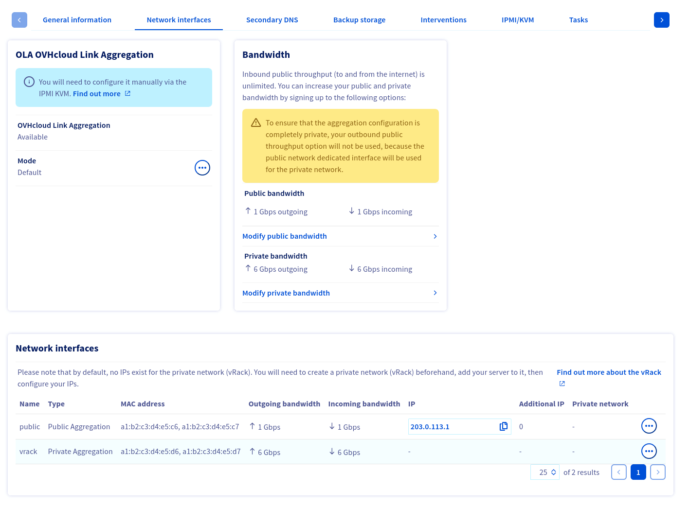

<style>
details>summary {
    color:rgb(33, 153, 232) !important;
    cursor: pointer;
}
details>summary::before {
    content:'\25B6';
    padding-right:1ch;
}
details[open]>summary::before {
    content:'\25BC';
}
</style>

## Objectif

La technologie LACP (Link Aggregation Control Protocol) est conçue pour augmenter la disponibilité de votre serveur et améliorer l’efficacité de vos connexions réseau. Vous pouvez agréger vos cartes réseau et rendre vos liens réseau redondants. Cela signifie que si un lien tombe en panne, le trafic est automatiquement redirigé vers un autre lien disponible. La bande passante disponible est également doublée grâce à l’agrégation.

**Ce guide explique comment lier vos interfaces pour les utiliser pour l'agrégation de liens dans Debian 12 / Ubuntu 24.04 (configuration Netplan).**

## Prérequis

- Ëtre connecté à l’[espace client OVHcloud](/links/manager)

## En pratique

> [!primary]
> Les valeurs (adresses MAC, adresses IP, etc) indiquées dans les configurations et exemples ci-dessous le sont à titre d'exemples. Vous devez bien entendu remplacer ces valeurs par les vôtres.
>

### Récupération des adresses MAC

Connectez-vous à l'[espace client OVHcloud](/links/manager), rendez-vous dans la section `Bare Metal Cloud`{.action} et sélectionnez votre serveur parmi les **Serveurs dédiés**.

Cliquez sur l'onglet `Interfaces réseau`{.action} et prenez note des adresses MAC de chaque interface (publique/privée) qui s'affichent en bas du menu.

{.thumbnail}

Maintenant que vous savez quelles adresses MAC sont associées à chaque type (public/privé) d'interface, vous devez récupérer les noms des interfaces.

### Récupération des noms d'interfaces

> [!primary]
>
> Si vous perdez la connexion réseau à votre serveur, suivez les étapes intitulées « **Ouvrir un KVM** » de [ce guide](/pages/bare_metal_cloud/dedicated_servers/using_ipmi_on_dedicated_servers).
>

Pour récupérer les noms des interfaces, lancez la commande suivante :

```bash
ip a
```

> [!primary]
>
> Cette commande va afficher de nombreuses interfaces. Si vous avez des difficultés à déterminer quelles sont vos interfaces physiques, l'adresse IP publique du serveur reste attachée par défaut à la première interface.
>

Voici un exemple de sortie :

```text
1: lo: <LOOPBACK,UP,LOWER_UP> mtu 65536 qdisc noqueue state UNKNOWN group default qlen 1000
    link/loopback 00:00:00:00:00:00 brd 00:00:00:00:00:00
    inet 127.0.0.1/8 scope host lo
       valid_lft forever preferred_lft forever
    inet6 ::1/128 scope host noprefixroute
       valid_lft forever preferred_lft forever
2: ens22f0np0: <BROADCAST,MULTICAST,UP,LOWER_UP> mtu 1500 qdisc mq state UP group default qlen 1000
    link/ether a1:b2:c3:d4:e5:c6 brd ff:ff:ff:ff:ff:ff
    inet 203.0.113.1/32 metric 100 scope global dynamic ens22f0np0
       valid_lft 71613sec preferred_lft 71613sec
    inet6 2001:db8:1:1b00:203:0:112:0/56 scope global
       valid_lft forever preferred_lft forever
    inet6 fe80::a6b2:c3ff:fed4:e5c6/64 scope link
       valid_lft forever preferred_lft forever
3: ens22f1np1: <BROADCAST,MULTICAST> mtu 1500 qdisc noop state DOWN group default qlen 1000
    link/ether a1:b2:c3:d4:e5:c7 brd ff:ff:ff:ff:ff:ff
4: ens33f0np0: <BROADCAST,MULTICAST> mtu 1500 qdisc noop state DOWN group default qlen 1000
    link/ether a1:b2:c3:d4:e5:d6 brd ff:ff:ff:ff:ff:ff
5: ens33f1np1: <BROADCAST,MULTICAST> mtu 1500 qdisc noop state DOWN group default qlen 1000
    link/ether a1:b2:c3:d4:e5:d7 brd ff:ff:ff:ff:ff:ff
```

Une fois que vous avez déterminé les noms de vos interfaces, vous pouvez configurer la liaison d'interfaces dans le système d'exploitation.

### Configuration IP statique

Remplacez le contenu de `/etc/netplan/50-cloud-init.yaml` par ce qui suit :

```yaml
network:
    version: 2
    ethernets:
        ens22f0np0:
            match:
                macaddress: a1:b2:c3:d4:e5:c6
        ens22f1np1:
            match:
                macaddress: a1:b2:c3:d4:e5:c7
        ens33f0np0:
            match:
                macaddress: a1:b2:c3:d4:e5:d6
        ens33f1np1:
            match:
                macaddress: a1:b2:c3:d4:e5:d7
    bonds:
        bond0:
            # Adresse MAC de l'interface publique principale du serveur
            macaddress: a1:b2:c3:d4:e5:c6
            accept-ra: false
            addresses:
                - 203.0.113.1/32
                - 2001:db8:1:1b00:203:0:112:0/56
            routes:
                - on-link: true
                  to: default
                  via: 100.64.0.1
                - on-link: true
                  to: default
                  via: fe80::1
            nameservers:
                addresses:
                - 213.186.33.99
                - 2001:41d0:3:163::1
            interfaces:
                - ens22f0np0
                - ens22f1np1
            parameters:
                mode: 802.3ad
                mii-monitor-interval: 100
                down-delay: 200
                lacp-rate: fast
                transmit-hash-policy: layer3+4
        # Facultatif: configuration d'une liaison privée
        bond1:
            # Adresse MAC de la première interface privée
            macaddress: a1:b2:c3:d4:e5:d6
            accept-ra: false
            interfaces:
                - ens33f0np0
                - ens33f1np1
            parameters:
                mode: 802.3ad
                mii-monitor-interval: 100
                down-delay: 200
                lacp-rate: fast
                transmit-hash-policy: layer3+4 
```

/// details | Configuration DHCP

Remplacez le contenu de `/etc/netplan/50-cloud-init.yaml` par ce qui suit :

```yaml
network:
    version: 2
    ethernets:
        ens22f0np0:
            match:
                macaddress: a1:b2:c3:d4:e5:c6
        ens22f1np1:
            match:
                macaddress: a1:b2:c3:d4:e5:c7
        ens33f0np0:
            match:
                macaddress: a1:b2:c3:d4:e5:d6
        ens33f1np1:
            match:
                macaddress: a1:b2:c3:d4:e5:d7
    bonds:
        bond0:
            # Adresse MAC de l'interface publique principale du serveur
            macaddress: a1:b2:c3:d4:e5:c6
            accept-ra: false
            dhcp4: true
            addresses:
                - 2001:db8:1:1b00:203:0:112:0/56
            routes:
                - on-link: true
                  to: default
                  via: fe80::1
            nameservers:
                addresses:
                - 2001:41d0:3:163::1
            interfaces:
                - ens22f0np0
                - ens22f1np1
            parameters:
                mode: 802.3ad
                mii-monitor-interval: 100
                down-delay: 200
                lacp-rate: fast
                transmit-hash-policy: layer3+4
        # Facultatif: configuration d'une liaison privé
        bond1:
            # Adresse MAC de la première interface privée
            macaddress: a1:b2:c3:d4:e5:d6
            accept-ra: false
            interfaces:
                - ens33f0np0
                - ens33f1np1
            parameters:
                mode: 802.3ad
                mii-monitor-interval: 100
                down-delay: 200
                lacp-rate: fast
                transmit-hash-policy: layer3+4 
```

///

### Application de la configuration

> [!primary]
> La commande `netplan try` ne peut pas être utilisée lors de la configuration des liaisons.

Appliquez la configuration à l'aide de la commande suivante :

```bash
sudo netplan apply
```

L'affichage de l'interface d'agrégation peut prendre plusieurs secondes.

## Aller plus loin

Rejoignez notre [communauté d'utilisateurs](/links/community).
