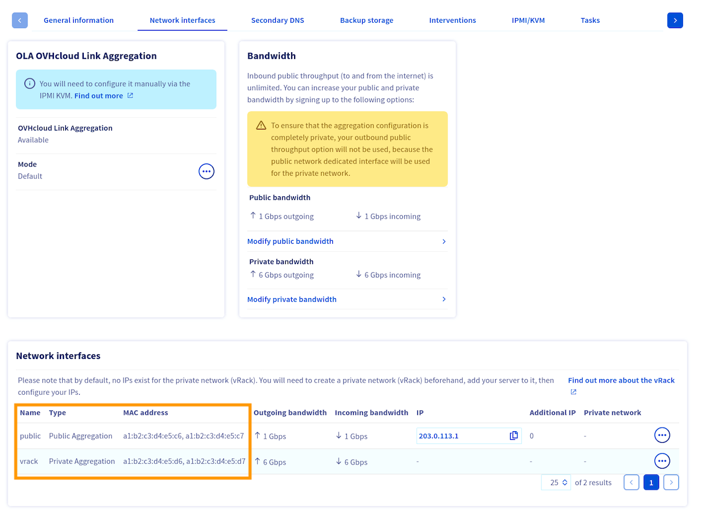

<style>
details>summary {
    color:rgb(33, 153, 232) !important;
    cursor: pointer;
}
details>summary::before {
    content:'\25B6';
    padding-right:1ch;
}
details[open]>summary::before {
    content:'\25BC';
}
</style>

## Objective

Link Aggregation Control Protocol (LACP) technology is designed to increase your server's availability, and boost the efficiency of your network connections. You can aggregate your network cards and make your network links redundant. This means that if one link goes down, traffic is automatically redirected to another available link. The available bandwidth is also doubled thanks to aggregation.

**This guide explains how to bond your interfaces to use them for link aggregation in Debian 12 (*or newer*) / Ubuntu 24.04 (Netplan configuration).**

> [!warning]
> While Debian 12 and newer images provided by OVHcloud utilize Netplan by default, there are two key exceptions where `ifupdown` (/etc/network/interfaces) is used instead:
>
> - **Rescue mode**: Although based on Debian 12, the rescue environment relies on the `ifupdown` utility.
> - **Custom images**: Debian installations performed using your own image may still use `ifupdown` for networking.
>
> If you wish to configure link aggregation in rescue mode, or on a custom OS relying on `ifupdown`, please refer to [this guide](/pages/bare_metal_cloud/dedicated_servers/ola-enable-debian9) instead.
>

## Requirements

<!-- CP-NAV-START:baremetal-dedicated-servers -->
---

### OVHcloud Control Panel Access

- **Direct link:** [Dedicated Servers](/links/control-panel/baremetal-dedicated-servers)
- **Navigation path:** `Bare Metal Cloud`{.action} > `Dedicated servers`{.action} > Select your server

---
<!-- CP-NAV-END:baremetal-dedicated-servers -->

## Instructions

> [!primary]
> The values (MAC addresses, IP addresses, etc.) shown in the configurations and examples below are provided as examples. Of course, you must replace these values with your own.
>

### Retrieving MAC addresses

Switch to the tab `Network Interfaces`{.action} and take note of the MAC addresses for each interface (public/private) which are displayed at the bottom of the menu.

{.thumbnail}

> [!primary]
> Please note that the MAC address of the **main public** interface is the one receiving DHCP offers, both in the server's operating system and in rescue mode. This interface handles public connectivity in the default configuration.
>

Now that you know which MAC addresses are associated to each type (public/private) of interface, you need to retrieve the interfaces names.

### Retrieving interfaces names

> [!primary]
>
> If you lose network connection to your server, follow the "**Open KVM**" steps from [this guide](/pages/bare_metal_cloud/dedicated_servers/using_ipmi_on_dedicated_servers).
>

To retrieve the names of the interfaces, execute the following command:

```bash
ip a
```

> [!primary]
>
> This command will yield numerous interfaces. If you are having trouble determining which ones are your physical interfaces, the first interface will still have the server's public IP address attached to it by default.
>

Here's an output example:

```text
1: lo: <LOOPBACK,UP,LOWER_UP> mtu 65536 qdisc noqueue state UNKNOWN group default qlen 1000
    link/loopback 00:00:00:00:00:00 brd 00:00:00:00:00:00
    inet 127.0.0.1/8 scope host lo
       valid_lft forever preferred_lft forever
    inet6 ::1/128 scope host noprefixroute
       valid_lft forever preferred_lft forever
2: ens22f0np0: <BROADCAST,MULTICAST,UP,LOWER_UP> mtu 1500 qdisc mq state UP group default qlen 1000
    link/ether a1:b2:c3:d4:e5:c6 brd ff:ff:ff:ff:ff:ff
    inet 203.0.113.1/32 metric 100 scope global dynamic ens22f0np0
       valid_lft 71613sec preferred_lft 71613sec
    inet6 2001:db8:1:1b00:203:0:112:0/56 scope global
       valid_lft forever preferred_lft forever
    inet6 fe80::a6b2:c3ff:fed4:e5c6/64 scope link
       valid_lft forever preferred_lft forever
3: ens22f1np1: <BROADCAST,MULTICAST> mtu 1500 qdisc noop state DOWN group default qlen 1000
    link/ether a1:b2:c3:d4:e5:c7 brd ff:ff:ff:ff:ff:ff
4: ens33f0np0: <BROADCAST,MULTICAST> mtu 1500 qdisc noop state DOWN group default qlen 1000
    link/ether a1:b2:c3:d4:e5:d6 brd ff:ff:ff:ff:ff:ff
5: ens33f1np1: <BROADCAST,MULTICAST> mtu 1500 qdisc noop state DOWN group default qlen 1000
    link/ether a1:b2:c3:d4:e5:d7 brd ff:ff:ff:ff:ff:ff
```

Once you have determined the names of your interfaces, you can configure interfaces bonding in the OS.

### Configuring interface bonding

Select the tab below that matches your server configuration:

- **Two interfaces**: Advance servers with two physical NICs.
- **Four interfaces - Double LAG**: Scale and High Grade servers with OLA in **Active - Double LAG** mode (public + private aggregates). This requires [OLA to be enabled](/pages/bare_metal_cloud/dedicated_servers/ola-enable-manager) in the OVHcloud Control Panel.
- **Four interfaces - Fully Private**: Scale and High Grade servers with OLA in **Active - Fully Private** mode (single private aggregate for vRack). This requires [OLA to be enabled](/pages/bare_metal_cloud/dedicated_servers/ola-enable-manager) in the OVHcloud Control Panel.

> [!tabs]
> Two interfaces
>> Replace the content of `/etc/netplan/50-cloud-init.yaml` with the following:
>>
>> **Static IP**
>>
>> ```yaml
>> network:
>>     version: 2
>>     ethernets:
>>         ens22f0np0:
>>             match:
>>                 macaddress: a1:b2:c3:d4:e5:c6
>>         ens22f1np1:
>>             match:
>>                 macaddress: a1:b2:c3:d4:e5:c7
>>     bonds:
>>         bond0:
>>             # MAC address of the server's main public interface
>>             macaddress: a1:b2:c3:d4:e5:c6
>>             accept-ra: false
>>             addresses:
>>                 - 203.0.113.1/32
>>                 - 2001:db8:1:1b00:203:0:112:0/56
>>             routes:
>>                 - on-link: true
>>                   to: default
>>                   via: 100.64.0.1
>>                 - on-link: true
>>                   to: default
>>                   via: fe80::1
>>             nameservers:
>>                 addresses:
>>                 - 213.186.33.99
>>                 - 2001:41d0:3:163::1
>>             interfaces:
>>                 - ens22f0np0
>>                 - ens22f1np1
>>             parameters:
>>                 mode: 802.3ad
>>                 lacp-rate: fast
>>                 transmit-hash-policy: layer3+4
>> ```
>>
>> /// details | DHCP
>>
>> ```yaml
>> network:
>>     version: 2
>>     ethernets:
>>         ens22f0np0:
>>             match:
>>                 macaddress: a1:b2:c3:d4:e5:c6
>>         ens22f1np1:
>>             match:
>>                 macaddress: a1:b2:c3:d4:e5:c7
>>     bonds:
>>         bond0:
>>             # MAC address of the server's main public interface
>>             macaddress: a1:b2:c3:d4:e5:c6
>>             accept-ra: false
>>             dhcp4: true
>>             addresses:
>>                 - 2001:db8:1:1b00:203:0:112:0/56
>>             routes:
>>                 - on-link: true
>>                   to: default
>>                   via: fe80::1
>>             nameservers:
>>                 addresses:
>>                 - 2001:41d0:3:163::1
>>             interfaces:
>>                 - ens22f0np0
>>                 - ens22f1np1
>>             parameters:
>>                 mode: 802.3ad
>>                 lacp-rate: fast
>>                 transmit-hash-policy: layer3+4
>> ```
>>
>> ///
>>
> Four interfaces - Double LAG
>> This configuration bonds public interfaces into `bond0` (with public IP) and private interfaces into `bond1` (for vRack).
>>
>> Replace the content of `/etc/netplan/50-cloud-init.yaml` with the following:
>>
>> **Static IP**
>>
>> ```yaml
>> network:
>>     version: 2
>>     ethernets:
>>         ens22f0np0:
>>             match:
>>                 macaddress: a1:b2:c3:d4:e5:c6
>>         ens22f1np1:
>>             match:
>>                 macaddress: a1:b2:c3:d4:e5:c7
>>         ens33f0np0:
>>             match:
>>                 macaddress: a1:b2:c3:d4:e5:d6
>>         ens33f1np1:
>>             match:
>>                 macaddress: a1:b2:c3:d4:e5:d7
>>     bonds:
>>         bond0:
>>             # MAC address of the server's main public interface
>>             macaddress: a1:b2:c3:d4:e5:c6
>>             accept-ra: false
>>             addresses:
>>                 - 203.0.113.1/32
>>                 - 2001:db8:1:1b00:203:0:112:0/56
>>             routes:
>>                 - on-link: true
>>                   to: default
>>                   via: 100.64.0.1
>>                 - on-link: true
>>                   to: default
>>                   via: fe80::1
>>             nameservers:
>>                 addresses:
>>                 - 213.186.33.99
>>                 - 2001:41d0:3:163::1
>>             interfaces:
>>                 - ens22f0np0
>>                 - ens22f1np1
>>             parameters:
>>                 mode: 802.3ad
>>                 lacp-rate: fast
>>                 transmit-hash-policy: layer3+4
>>         # Optional: private bond configuration
>>         bond1:
>>             # MAC address of the first private interface
>>             macaddress: a1:b2:c3:d4:e5:d6
>>             accept-ra: false
>>             interfaces:
>>                 - ens33f0np0
>>                 - ens33f1np1
>>             parameters:
>>                 mode: 802.3ad
>>                 lacp-rate: fast
>>                 transmit-hash-policy: layer3+4
>> ```
>>
>> /// details | DHCP
>>
>> ```yaml
>> network:
>>     version: 2
>>     ethernets:
>>         ens22f0np0:
>>             match:
>>                 macaddress: a1:b2:c3:d4:e5:c6
>>         ens22f1np1:
>>             match:
>>                 macaddress: a1:b2:c3:d4:e5:c7
>>         ens33f0np0:
>>             match:
>>                 macaddress: a1:b2:c3:d4:e5:d6
>>         ens33f1np1:
>>             match:
>>                 macaddress: a1:b2:c3:d4:e5:d7
>>     bonds:
>>         bond0:
>>             # MAC address of the server's main public interface
>>             macaddress: a1:b2:c3:d4:e5:c6
>>             accept-ra: false
>>             dhcp4: true
>>             addresses:
>>                 - 2001:db8:1:1b00:203:0:112:0/56
>>             routes:
>>                 - on-link: true
>>                   to: default
>>                   via: fe80::1
>>             nameservers:
>>                 addresses:
>>                 - 2001:41d0:3:163::1
>>             interfaces:
>>                 - ens22f0np0
>>                 - ens22f1np1
>>             parameters:
>>                 mode: 802.3ad
>>                 lacp-rate: fast
>>                 transmit-hash-policy: layer3+4
>>         # Optional: private bond configuration
>>         bond1:
>>             # MAC address of the first private interface
>>             macaddress: a1:b2:c3:d4:e5:d6
>>             accept-ra: false
>>             interfaces:
>>                 - ens33f0np0
>>                 - ens33f1np1
>>             parameters:
>>                 mode: 802.3ad
>>                 lacp-rate: fast
>>                 transmit-hash-policy: layer3+4
>> ```
>>
>> ///
>>
> Four interfaces - Fully Private
>> This configuration aggregates all physical interfaces into a single bond for vRack use only. There is no public IP connectivity.
>>
>> > [!warning]
>> >
>> > Following the implementation of OLA in Fully Private mode, the public IP is no longer accessible. Make sure you have an alternative means of access (e.g. through another server in the vRack, or via KVM/IPMI) before applying this configuration.
>> >
>>
>> Replace the content of `/etc/netplan/50-cloud-init.yaml` with the following:
>>
>> ```yaml
>> network:
>>     version: 2
>>     ethernets:
>>         ens22f0np0:
>>             match:
>>                 macaddress: a1:b2:c3:d4:e5:c6
>>         ens22f1np1:
>>             match:
>>                 macaddress: a1:b2:c3:d4:e5:c7
>>         ens33f0np0:
>>             match:
>>                 macaddress: a1:b2:c3:d4:e5:d6
>>         ens33f1np1:
>>             match:
>>                 macaddress: a1:b2:c3:d4:e5:d7
>>     bonds:
>>         bond0:
>>             # MAC address of the server's main private interface
>>             macaddress: a1:b2:c3:d4:e5:d6
>>             accept-ra: false
>>             interfaces:
>>                 - ens22f0np0
>>                 - ens22f1np1
>>                 - ens33f0np0
>>                 - ens33f1np1
>>             parameters:
>>                 mode: 802.3ad
>>                 lacp-rate: fast
>>                 transmit-hash-policy: layer3+4
>> ```
>>
>> > [!primary]
>> >
>> > In Fully Private mode, the bond uses the MAC address of the **main private** interface. To assign an IP address to this bond for vRack communication, add an `addresses` block under `bond0` with your vRack private IP.
>> >

### Applying the configuration

> [!primary]
> The `netplan try` command can't be used when configuring bonds.

Apply the configuration using the following command:

```bash
sudo netplan apply
```

It may take several seconds for the bond interfaces to come up.

## Go further

[Configuring OVHcloud Link Aggregation in the Control Panel](/pages/bare_metal_cloud/dedicated_servers/ola-enable-manager)

Join our [community of users](/links/community).
