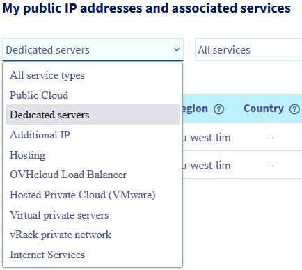
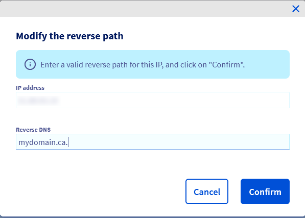

## Objectif

De manière générale, les politiques anti-spam sont strictes. Afin de fluidifier les envois d'e-mails et pour que les destinataires les reçoivent sans subir un blocage des outils de sécurité, des paramétrages sont nécessaires pour authentifier vos messages et leur contenu sur les serveurs destinataires qui les traitent.

**Ce guide vous donne quelques conseils pour optimiser l'envoi de vos e-mails.**

> [!warning]
>
> OVHcloud met à votre disposition des services dont la responsabilité vous revient. En effet, n’ayant aucun accès à ces machines, nous n’en sommes pas les administrateurs. Il vous appartient de ce fait d'en assurer la gestion logicielle et la sécurisation au quotidien. Nous mettons à votre disposition ce guide afin de vous accompagner au mieux dans ces tâches courantes.
>
> Néanmoins, nous vous recommandons de faire appel à un [prestataire spécialisé](https://partner.ovhcloud.com/fr-ca/directory/) et/ou de contacter l'éditeur du service si vous éprouvez des difficultés. Plus d'informations dans la section [Aller plus loin](#aller-plus-loin) de ce guide.
>

## Prérequis

- Être administrateur d'un serveur e-mail configuré.
- Être en mesure de gérer la zone DNS du ou des nom de domaines utilisés pour l'envoi

> [!warning]
>
> L'objectif de ce guide est de vous fournir des astuces pour optimiser l'envoi de vos e-mails. Prenez en considération que chaque service de messagerie a ses propres directives et bonnes pratiques pour garantir la réception des e-mails par les destinataires. Nous vous recommandons vivement de les consulter.
>

## En pratique

### Configurer l'enregistrement SPF 

Dans le cas d'une infrastructure dédiée (serveur dédié, VPS, instance Public Cloud ou Hosted Private Cloud), l'enregistrement SPF (Sender Policy Framework) optimal se présente sous la forme :  `v=spf1 ip4:ipv4_du_serveur ~all`.

> [!primary]
>
> Le symbole devant le *all* a une grande importance :
>
> - `+` : accepter
> - `-` : rejeter
> - `~` : échec (*soft fail*)
> - `?` : neutre
>

Vous pouvez bien entendu aller plus loin, en configurant l'enregistrement SPF pour un nom de domaine spécifique ou en utilisant l'adresse IPv6. Pour bien comprendre l'enregistrement SPF, consultez notre guide sur la [configuration d'un enregistrement SPF](/pages/web_cloud/domains/dns_zone_spf).

### Configurer l'enregistrement DKIM

L'enregistrement DKIM (DomainKeys Identified Mail) permet de signer les e-mails pour éviter l'usurpation de ceux-ci. Cette signature fonctionne sur le principe d'un couple clé privée / clé publique, permettant d'authentifier le domaine expéditeur.

Pour plus d'informations, consultez notre guide sur la [configuration d'un enregistrement DKIM](/pages/web_cloud/domains/dns_zone_dkim).

### Configurer l'enregistrement DMARC

L'enregistrement DMARC (Domain-based Message Authentication, Reporting and Conformance) est une norme de sécurité qui s'appuie sur les 2 méthodes de sécurité e-mail SPF et DKIM. Les arguments inscrits dans l'enregistrement DMARC orientent le destinataire sur la manière de traiter les e-mails, selon le résultat SPF et/ou DKIM. Une adresse e-mail peut être définie dans l'enregistrement DMARC, celle-ci recevra un rapport sur les échecs d'authentification.

Pour plus d'informations, consultez notre guide sur la [configuration d'un enregistrement DMARC](/pages/web_cloud/domains/dns_zone_dmarc).

### Configurer le *reverse IP* 

Toujours dans le but d'optimiser l'envoi et de réduire les risques de blocage de vos e-mails, un *reverse IP* doit être configuré avec votre nom de domaine.

Vous devez tout d'abord créer un enregistrement A dans la zone DNS de votre domaine avec l'adresse IP de votre serveur comme cible.

Si vos serveurs DNS sont gérés par OVHcloud, consultez notre guide sur [l'édition d'une zone DNS OVHcloud via votre espace client](/pages/web_cloud/domains/dns_zone_edit).

Une fois la zone DNS de votre nom de domaine modifiée, un temps de propagation de 24 heures maximum est nécessaire afin que les modifications soient effectives.

Une fois cela fait, ajoutez l'enregistrement PTR (également connu sous le nom de *reverse*) :

Dans votre [espace client OVHcloud](https://ca.ovh.com/auth/?action=gotomanager&from=https://www.ovh.com/ca/fr/&ovhSubsidiary=qc){.external}, rendez-vous dans la section `Bare Metal Cloud`{.action}, puis ouvrez `Network`{.action}. Cliquez ensuite sur `IP`{.action}. 

Si vous souhaitez configurer le reverse DNS sur une adresse Additional IP, cliquez sur l'onglet `Additional IP`{.action}.

Le menu déroulant sous « **Mes adresses IP publiques et services associés** » vous permet de filtrer vos services par catégorie.

{.thumbnail}

Cliquez ensuite sur le bouton `...`{.action} à droite de la ligne correspondante puis sur `Modifier le reverse`{.action} :

{.thumbnail}

Entrez votre nom de domaine dans la section `Reverse DNS` et cliquez sur `Valider`{.action}.

{.thumbnail}

> [!primary]
> Lorsque vous entrez votre nom de domaine dans le *reverse*, il vérifie immédiatement si l'enregistrement A renvoie à la même IP. Ceci est utilisé dans les procédures anti-spam, donc votre enregistrement A doit être valide et propagé. Il y a certaines règles à suivre lors de la saisie du *reverse* :
>
>  - le *reverse* ne peut pas commencer par un `-`
>  - le *reverse* ne peut pas comporter plus de 80 caractères
>  - le *reverse* ne peut pas contenir de caractères majuscules
>  - le *reverse* doit se terminer par un `.`
>
> Exemple : « MyDomain.ca » dans l'enregistrement *reverse* serait **mydomain.ca.**
>

### Cas spécifiques d'envois d'e-mails

#### Vers un serveur Microsoft (Outlook, etc...)
 
Microsoft utilise une politique de liste blanche. Cela signifie qu'initialement tout serveur se trouve sur une liste noire et une procédure spécifique est nécessaire pour faire valider votre serveur e-mail.

Avant de commencer la procédure de whitelist de votre IP, assurez-vous d'avoir bien configuré un [reverse](#reverseip) sur votre adresse IP (et non pas le reverse par défaut d'OVHcloud).

Microsoft vérifie également l'enregistrement SPF, il est donc recommandé de le configurer.

Vous devez ensuite signer les contrats SNDS (Smart Network Data Services) et JMRP (Junk Mail Reporting Partner Program).

Pour souscrire gratuitement au programme, il suffit de créer un compte JMRP/SNDS à l'adresse suivante :
<https://postmaster.live.com/snds/JMRP.aspx?wa=wsignin1.0>

Une fois le compte activé, vous devez compléter le formulaire suivant :

- **Company name** : (nom de votre entreprise)
- **Contact email address** : (une adresse e-mail valide où Microsoft peut vous contacter)
- **Complaint feedback email address** : (une adresse e-mail valide où vous pourrez recevoir les plaintes pour spam, les **best practices** veulent que l'adresse e-mail soit sous la forme : **abuse@mondomaine.com**.)

Ajoutez ensuite vos adresses IP dans la section `IP address or range`.

En cliquant sur `Add new Network`, il vous sera demandé de définir une adresse e-mail de contact valide. Renseignez alors l'adresse du type **abuse@mondomaine.com** destinée à recevoir les plaintes pour spam.

Une fois les informations renseignées, cliquez sur `Begin Setup` pour transmettre la demande. Microsoft enverra alors un e-mail intitulé `SNDS-JMRP Contract`, puis un second e-mail à **mondomaine.com**.

Confirmez les informations et la souscription à JMRP/SNDS sera terminée.

Une fois ces actions effectuées, si votre IP apparaît comme bloquée, vous pourrez alors demander à la débloquer via la [procédure junkmail](https://support.microsoft.com/en-us/getsupport?oaspworkflow=start_1.0.0.0&wfname=capsub&productkey=edfsmsbl3&locale=en-us&ccsid=635857671692853062). La procédure prend généralement 48 heures.

Microsoft peut parfois vous demander la date de la première facturation de votre IP/serveur. Dans ce cas de figure, envoyez à Microsoft une copie de votre facture et mentionnez votre IP/serveur (ex : host nsXXX) dans votre réponse.

Pour plus d'informations, veuillez ouvrir une [demande d'assistance](https://support.microsoft.com/en-us/getsupport?oaspworkflow=start_1.0.0.0&wfname=capsub&productkey=edfsmsbl3&ccsid=6364926882037750656) auprès de Microsoft.

> [!warning]
>
> **Refus de Microsoft**
>
> Il est possible que Microsoft refuse de débloquer votre ou vos adresse(s) IP, auquel cas OVHcloud ne pourra pas intervenir. Il est important de respecter les bonnes pratiques de Microsoft.
>

#### Vers un serveur Gmail

L'ajout d'enregistrements spécifiques, tel qu'un enregistrement DMARC (Domain-based Message Authentication, Reporting, and Conformance) ou DKIM (DomainKeys Identified Mail) peut faciliter la réception des e-mails si votre destinataire est chez Gmail. Consultez nos guides mentionnés [en bas de cette page](#go-further) pour les configurer.

### Vérifier vos informations

Il peut être intéressant d'utiliser un site comme [Mail Tester](http://www.mail-tester.com/) afin de vérifier que tous vos paramétrages sont corrects.

## Aller plus loin 

[Améliorer la sécurité des e-mails via un enregistrement DKIM](/pages/web_cloud/domains/dns_zone_dkim)

[Améliorer la sécurité des e-mails via un enregistrement SPF](/pages/web_cloud/domains/dns_zone_spf)

[Améliorer la sécurité des e-mails via un enregistrement DMARC](/pages/web_cloud/domains/dns_zone_dmarc)

Pour être accompagné sur la mise en place de vos solutions OVHcloud, contactez notre [réseau de partenaires OVHcloud](https://partner.ovhcloud.com/fr-ca/directory/).

Échangez avec notre communauté d'utilisateurs sur <https://community.ovh.com>.
