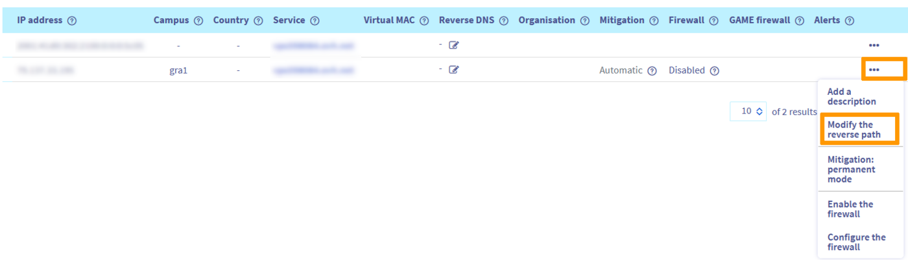
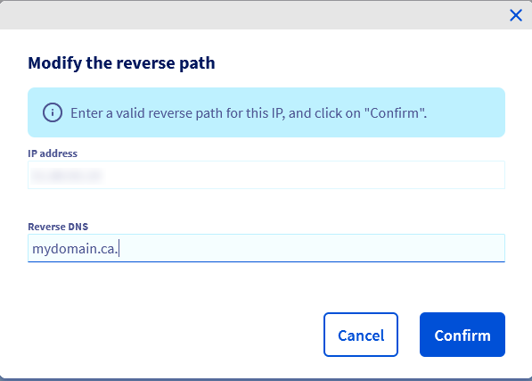

> [!primary]
> Tłumaczenie zostało wygenerowane automatycznie przez system naszego partnera SYSTRAN. W niektórych przypadkach mogą wystąpić nieprecyzyjne sformułowania, na przykład w tłumaczeniu nazw przycisków lub szczegółów technicznych. W przypadku jakichkolwiek wątpliwości zalecamy zapoznanie się z angielską/francuską wersją przewodnika. Jeśli chcesz przyczynić się do ulepszenia tłumaczenia, kliknij przycisk "Współtwórz" na tej stronie.
>

## Wprowadzenie

Ogólnie rzecz biorąc, polityka antyspamowa jest surowa. Aby usprawnić wysyłkę e-maili i zagwarantować, że adresaci będą je otrzymywać bez blokowania narzędzi zabezpieczających, konieczne jest wprowadzenie pewnych ustawień umożliwiających uwierzytelnianie wiadomości i ich zawartości na serwerach odbiorców, które je przetwarzają.

**Niniejszy przewodnik wyjaśnia, jak zoptymalizować wysyłkę e-maili.**

> [!warning]
>
> OVHcloud udostępnia różnorodne usługi, jednak to Ty odpowiadasz za ich konfigurację i zarządzanie nimi. Ponosisz więc odpowiedzialność za ich prawidłowe funkcjonowanie.
> 
> Oddajemy w Twoje ręce niniejszy przewodnik, którego celem jest pomoc w wykonywaniu bieżących zadań. W przypadku trudności lub wątpliwości związanych z administrowaniem, użytkowaniem lub wdrażaniem usług na serwerze zalecamy skorzystanie z pomocy [wyspecjalizowanego usługodawcy](/links/partner).
> 

## Wymagania początkowe

- Pełnienie funkcji administratora skonfigurowanego serwera e-mail.
- Możliwość zarządzania strefą DNS domeny lub domen używanych do wysyłki

> [!warning]
>
> Celem niniejszego przewodnika jest dostarczenie kilku wskazówek dotyczących optymalizacji wysyłki e-maili. Należy pamiętać, że każda usługa poczty elektronicznej posiada własne wytyczne i najlepsze praktyki, aby zagwarantować odbiór wiadomości e-mail przez odbiorców. Zalecamy skorzystanie z nich.
>

## W praktyce

### Konfiguracja rekordu SPF 

W przypadku infrastruktury dedykowanej (serwer dedykowany, VPS, instancja Public Cloud lub Hosted Private Cloud) pole SPF ma postać: `v=spf1 ip4:server_ipv4 ~all`. Pamiętaj, aby zamienić "server_ipv4" na adres IPv4 serwera.

> [!primary]
>
> Symbol przed *all* ma wielkie znaczenie:
>
> - `+`: akceptuj
> - `-`: odrzuć
> - `~`: niepowodzenie (*soft fail*)
> - `?`: neutralny
>

Możesz oczywiście pójść o krok dalej i skonfigurować rekord SPF dla określonej nazwy domeny lub użyć adresu IPv6. Aby lepiej zrozumieć rekord SPF, zapoznaj się z przewodnikiem dotyczącym [konfiguracji rekordu SPF](/pages/web_cloud/domains/dns_zone_spf).

### Konfiguracja rekordu DKIM

Rekord DKIM (DomainKeys Identified Mail) służy do podpisywania e-maili, aby zapobiec ich przywłaszczeniu. Podpis ten działa na zasadzie pary klucz prywatny / klucz publiczny, pozwalając na uwierzytelnienie domeny nadawcy.

Więcej informacji znajdziesz w przewodniku dotyczącym [konfiguracji rekordu DKIM](/pages/web_cloud/domains/dns_zone_dkim).

### Konfiguruj rekord DMARC

Rekord DMARC (Domain-based Message Authentication, Reporting and Conformance) to standard bezpieczeństwa oparty na 2 metodach zabezpieczeń e-mail SPF i DKIM. Argumenty zapisane w rekordzie DMARC kierują odbiorcą w jaki sposób należy przetwarzać e-maile, w zależności od wyniku SPF i/lub DKIM. Adres e-mail może zostać zdefiniowany w rekordzie DMARC, który otrzyma raport dotyczący niepowodzeń uwierzytelnienia.

Więcej informacji zawiera przewodnik dotyczący [konfigurowania rekordu DMARC](/pages/web_cloud/domains/dns_zone_dmarc).

### Konfiguracja rewers (*reverse IP*) 

Aby zoptymalizować wysyłkę i zmniejszyć ryzyko blokady kont e-mail, należy skonfigurować rewers z Twoją domeną.

Najpierw należy utworzyć rekord A w strefie DNS domeny, używając adresu IP Twojego serwera jako celu.

Jeśli Twoje serwery DNS są zarządzane przez OVHcloud, zapoznaj się z naszym przewodnikiem [dotyczącym edycji strefy DNS OVHcloud w Panelu klienta](/pages/web_cloud/domains/dns_zone_edit).

Po zmianie strefy DNS Twojej domeny konieczny jest czas propagacji wynoszący maksymalnie 24 godziny, aby modyfikacje stały się widoczne.

Następnie dodaj rekordu PTR (znany również jako rewers):

W [Panelu klienta OVHcloud](/links/manager){.external} przejdź do sekcji `Bare Metal Cloud`{.action}, a następnie otwórz `Network`{.action}. Następnie kliknij przycisk `IP`{.action}.

Jeśli chcesz skonfigurować Rewers DNS na adresie Additional IP, kliknij zakładkę `Additional IP`{.action}.

W rozwijanym menu pod "**Moje publiczne adresy IP i usługi powiązane**" możesz sortować Twoje usługi według kategorii.

{.thumbnail}

Kliknij przycisk `...`{.action} po prawej stronie odpowiedniej linii, a następnie `Zmień rewers`{.action}:

{.thumbnail}

Wprowadź nazwę Twojej domeny w sekcji `Rewers` i kliknij `Zatwierdź`{.action}.

{.thumbnail}

> [!primary]
> Po wpisaniu domeny do rewers sprawdzi on natychmiast, czy rekordu A odnosi się do tego samego IP. Jest to używane w procedurach antyspamowych, więc rekordu A musi być ważne i propagowane. Podczas wprowadzania rewers obowiązują następujące zasady:
>
>  - rewers nie może się rozpocząć od `-`
>  - rewers nie może zawierać więcej niż 80 znaków
>  - rewers nie może zawierać wielkich liter
>  - rewers musi się kończyć znakiem `.`
>
> Przykład: "MyDomain.ca" w polu rewers byłoby **mydomain.ca.**
>

### Szczególne przypadki wysyłki e-maili

#### Na serwer Microsoft (Outlook, itp...)
 
Microsoft używa białej listy. Oznacza to, że najpierw każdy serwer znajduje się na czarnej liście, a do zatwierdzenia serwera e-mail konieczna jest specjalna procedura.

rzed rozpoczęciem procedury białej listy adresów IP upewnij się, że skonfigurowałeś [rewers](#reverseip) dla Twojego adresu IP (a nie domyślny rewers OVHcloud).

Firma Microsoft sprawdza również rekord SPF, dlatego zaleca się jego skonfigurowanie.

Następnie należy podpisać umowy SNDS (Smart Network Data Services) i JMRP (Junk Mail Reporting Partner Program).

Aby zamówić bezpłatnie program, wystarczy utworzyć konto JMRP/SNDS na stronie:
<https://postmaster.live.com/snds/JMRP.aspx?wa=wsignin1.0>

Po aktywacji konta wypełnij poniższy formularz:

- **Company name**: (nazwa Twojej firmy)
- **Contact email address**: (prawidłowy adres e-mail, z którym Microsoft może się z Tobą skontaktować)
- **Complaint feedback email address**: (prawidłowy adres e-mail, w którym można otrzymywać skargi na spam, *best practices* chcą, aby adres e-mail wyglądał następująco: **abuse@mydomain.com**)

Następnie dodaj adresy IP w sekcji `IP address or range`.

Po kliknięciu `Add new Network` zostaniesz poproszony o zdefiniowanie poprawnego adresu e-mail do kontaktu. Wpisz adres typu **abuse@mydomain.com**, na który należy składać skargi na spam.

Po wpisaniu informacji kliknij `Begin Setup`, aby przesłać wniosek. Firma Microsoft wyśle wówczas e-mail o nazwie `SNDS-JMRP Contract`, a następnie drugi e-mail do **mydomain.com**.

Potwierdź informacje i subskrypcję JMRP/SNDS zostanie zakończona.

Po przeprowadzeniu tych operacji, jeśli Twój adres IP zostanie zablokowany, będziesz mógł zlecić jego odblokowanie przy użyciu [procedury junkmail](https://support.microsoft.com/en-us/getsupport?oaspworkflow=start_1.0.0.0&wfname=capsub&productkey=edfsmsbl3&locale=en-us&ccsid=635857671692853062). Procedura zwykle trwa 48 godziny.

Microsoft może czasem zapytać o datę płatności za pierwszy adres IP/serwer. W takim przypadku wyślij do Microsoft kopię Twojej faktury i wprowadź IP/serwer (np.: host nsXXX) w Twojej odpowiedzi.

Aby uzyskać więcej informacji, prosimy o otwarcie [wniosku o udzielenie pomocy](https://support.microsoft.com/en-us/getsupport?oaspworkflow=start_1.0.0.0&wfname=capsub&productkey=edfsmsbl3&ccsid=6364926882037750656) przez Microsoft.

> [!warning]
>
> **Odmowa Microsoftu**
>
> Możliwe, że Microsoft odmówi odblokowania adresu lub adresów IP. W takim przypadku OVHcloud nie będzie mógł interweniować. Ważne jest przestrzeganie dobrych praktyk Microsoft.
>

#### Na serwer Gmail

Dodanie określonych rekordów, takich jak DMARC (Domain-based Message Authentication, Reporting and Conformance) lub DKIM (DomainKeys Identified Mail) może ułatwić odbieranie wiadomości e-mail, jeśli Twój odbiorca jest w Gmailu. Zapoznaj się z naszymi przewodnikami [na dole tej strony](#go-further), aby je skonfigurować.

### Sprawdź Twoje dane

Może być interesujące, aby korzystać ze strony jak [Mail Tester](http://www.mail-tester.com/), aby sprawdzić, czy wszystkie ustawienia są poprawne.

## Sprawdź również

[Zwiększ bezpieczeństwo e-maili za pomocą rekordu DKIM](/pages/web_cloud/domains/dns_zone_dkim)

[Zwiększ bezpieczeństwo e-maili za pomocą rekordu SPF](/pages/web_cloud/domains/dns_zone_spf)

[Zwiększ bezpieczeństwo e-maili za pomocą rekordu DMARC](/pages/web_cloud/domains/dns_zone_dmarc)

Aby wesprzeć Cię w uruchomieniu Twoich rozwiązań OVHcloud, skontaktuj się z naszą [siecią partnerów OVHcloud](/links/partner).

Dołącz do społeczności naszych użytkowników na stronie <https://community.ovh.com/en/>.