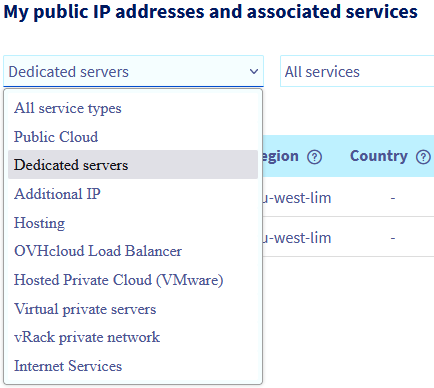

> [!primary]
> Esta tradução foi automaticamente gerada pelo nosso parceiro SYSTRAN. Em certos casos, poderão ocorrer formulações imprecisas, como por exemplo nomes de botões ou detalhes técnicos. Recomendamos que consulte a versão inglesa ou francesa do manual, caso tenha alguma dúvida. Se nos quiser ajudar a melhorar esta tradução, clique em "Contribuir" nesta página.
>

## Objetivo

Em geral, as políticas antisspam são rígidas. De forma a simplificar o envio de mensagens e permitir que os destinatários as recebam sem bloquear as ferramentas de segurança, são necessárias definições para autenticar as suas mensagens e o seu conteúdo nos servidores destinatários que processam essas mensagens.

**Este guia dá-lhe alguns conselhos para otimizar o envio dos seus e-mails.**

> [!warning]
>
> A responsabilidade sobre a configuração e a gestão dos serviços que a OVHcloud disponibiliza recai sobre o utilizador. Assim, deverá certificar-se de que estes funcionam corretamente.
> 
> Este guia fornece as instruções necessárias para realizar as operações mais habituais. No entanto, se encontrar dificuldades ou dúvidas relativamente à administração, utilização ou implementação dos serviços num servidor, recomendamos que recorra a um [prestador de serviços especializado](https://partner.ovhcloud.com/pt/directory/).
> 

## Requisitos

- Ser administrador de um servidor de correio eletrónico configurado.
- Poder gerir a zona DNS do(s) domínio(s) utilizado(s) para o envio

> [!warning]
>
> O objetivo deste guia é fornecer-lhe alguns truques para otimizar o envio dos seus e-mails. Tenha em conta que cada serviço de mensagens tem as suas próprias diretivas e boas práticas para garantir a receção dos e-mails pelos destinatários. Recomendamos vivamente que os consulte.
>

## Instruções

### Configurar o registo SPF 

No caso de uma infraestrutura dedicada (servidor dedicado, VPS, instância Public Cloud ou Hosted Private Cloud), o registo SPF (Sender Policy Framework) ideal apresenta-se sob a forma: `v=spf1 ip4:ipv4_do_servidor ~all`.

> [!primary]
>
> O símbolo em frente ao *all* tem grande importância:
>
> - `+`: aceitar
> - `-`: rejeitar
> - `~`: falha (*soft fail*)
> - `?`: neutro
>

Pode ir mais longe configurando o registo SPF para um domínio específico ou utilizando o endereço IPv6. Para compreender melhor o registo SPF, consulte o nosso manual sobre a [configuração de um registo SPF](/pages/web_cloud/domains/dns_zone_spf).

### Configurar o registo DKIM

O registo DKIM (DomainKeys Identified Mail) permite assinar os e-mails para evitar a sua usurpação. Esta assinatura funciona com base no princípio de um par chave privada/chave pública, que permite autenticar o domínio remetente.

Para mais informações, consulte o nosso guia sobre a [configuração de um registo DKIM](/pages/web_cloud/domains/dns_zone_dkim).

### Configurar o registo DMARC

O registo DMARC (Domain-based Message Authentication, Reporting and Conformance) é uma norma de segurança que se baseia nos 2 métodos de segurança de e-mail SPF e DKIM. Os argumentos no registo DMARC orientam o destinatário na forma como processa os e-mails, em função do resultado SPF e/ou DKIM. É possível definir um endereço de e-mail no registo DMARC, que receberá um relatório sobre as falhas de autenticação.

Para obter mais informações, consulte o nosso manual sobre a [configuração de um registo DMARC](/pages/web_cloud/domains/dns_zone_dmarc).

### Configurar a reverse (*reverse IP*) 

Sempre com o objetivo de otimizar o envio e de reduzir os riscos de bloqueio dos seus e-mails, uma reverse deve ser configurada com o seu nome de domínio.

Em primeiro lugar, deve criar um registo A na zona DNS do seu domínio com o endereço IP do seu servidor como alvo.

Se os seus servidores DNS são geridos pela OVHcloud, consulte o nosso guia sobre [a edição de uma zona DNS da OVHcloud através da Área de Cliente](/pages/web_cloud/domains/dns_zone_edit).

Depois de alterar a zona DNS do domínio, é necessário aguardar 24 horas até que as alterações sejam efetivas.

Depois de fazer isso, adicione o registo PTR (também conhecido como reverse):

Na sua [Área de Cliente OVHcloud](https://www.ovh.com/auth/?action=gotomanager&from=https://www.ovh.pt/&ovhSubsidiary=pt){.external}, aceda à secção `Bare Metal Cloud`{.action} e abra `Network`{.action}. De seguida, clique em `IP`{.action}. 

Se deseja configurar a Reverse DNS num endereço Additional IP, clique no separador `Additional IP`{.action}.

O menu pendente em "**Os meus endereços IP públicos e serviços associados**" permite-lhe filtrar os seus serviços por categoria.

{.thumbnail}

Clique no botão `...`{.action} à direita da linha correspondente e, a seguir, em `Modificar a reverse`{.action}:

{.thumbnail}

Introduza o seu domínio na secção `Reverse` e clique em `Validar`{.action}.

{.thumbnail}

> [!primary]
> Ao introduzir o seu nome de domínio na reverse, este verifica imediatamente se o registo A remete para o mesmo IP. Isto é utilizado nos procedimentos antisspam, pelo que o seu registo A deve ser válido e propagado. Há certas regras a seguir aquando da introdução da reverse:
>
>  - a reverse não pode começar por um `-`
>  - a reverse não pode ter mais de 80 caracteres
>  - a reverse não pode conter caracteres maiúsculos
>  - a reverse deve terminar com um `.`
>
> Por exemplo: "MyDomain.ca" no registo reverse seria **mydomain.ca.**
>

### Casos específicos de envio de e-mails

#### Para um servidor Microsoft (Outlook, etc...)
 
A Microsoft utiliza uma política de lista branca. Isto significa que, de início, todos os servidores estão na lista negra e é necessário um procedimento específico para que o seu servidor de e-mail seja validado.

Antes de iniciar o procedimento de whitelist do seu IP, certifique-se de que configurou corretamente uma [reverse](#reverseip) no seu endereço IP (e não a reverse por defeito da OVHcloud).

A Microsoft também verifica o registo SPF, pelo que é aconselhável configurá-lo.

A seguir, deve assinar os contratos SNDS (Smart Network Data Services) e JMRP (Junk Mail Reporting Partner Program).

Para subscrever gratuitamente o programa, basta criar uma conta JMRP/SNDS no seguinte endereço:
<https://postmaster.live.com/snds/JMRP.aspx?wa=wsignin1.0>

Uma vez a conta ativada, deve preencher o seguinte formulário:

- **Company name**: (nome da sua empresa)
- **Contact email address**: (um endereço de e-mail válido onde a Microsoft pode contactá-lo)
- **Complaint feedback email address**: (um endereço de e-mail válido onde poderá receber as queixas por spam, las *best practices* exigen que o endereço de e-mail seja o seguinte: **abuse@mydomain.com**.)

A seguir, adicione os endereços IP à secção `IP address or range`.

Ao clicar em `Add new Network`, ser-lhe-á pedido que defina um endereço de e-mail de contacto válido. Insira o endereço do tipo **abuse@mydomain.com** para receber queixas por spam.

Depois de inseridas as informações, clique em `Begin Setup` para transmitir o pedido. A Microsoft enviará então um e-mail intitulado `SNDS-JMRP Contract` e um segundo e-mail para **mydomain.com**.

Confirme as informações e a subscrição à JMRP/SNDS estará terminada.

Depois de realizar estas ações, se o seu IP aparecer como bloqueado, poderá pedir que o desbloqueie através do [procedimento junkmail](https://support.microsoft.com/en-us/getsupport?oaspworkflow=start_1.0.0.0&wfname=capsub&productkey=edfsmsbl3&locale=en-us&ccsid=635857671692853062). O procedimento demora normalmente 48 horas.

Por vezes, a Microsoft pode pedir-lhe a data da primeira faturação do seu IP/servidor. Nesse caso, envie à Microsoft uma cópia da sua fatura e indique o seu IP/servidor (ex: host nsXXX) na sua resposta.

Para mais informações queira abrir um [pedido de assistência](https://support.microsoft.com/en-us/getsupport?oaspworkflow=start_1.0.0.0&wfname=capsub&productkey=edfsmsbl3&ccsid=6364926882037750656) junto da Microsoft.

> [!warning]
>
> **Recusa da Microsoft**
>
> É possível que a Microsoft se recuse a desbloquear o(s) seu(s) endereço(s) IP, caso em que a OVHcloud não poderá intervir. É importante respeitar as boas práticas da Microsoft.
>

#### Para um servidor Gmail

A adição de registos específicos, como por exemplo um registo DMARC (Domain-based Message Authentication, Reporting, and Conformance) ou DKIM (DomainKeys Identified Mail), pode facilitar a receção de e-mails se o seu destinatário estiver no Gmail. Consulte os nossos guias mencionados [na parte inferior desta página](#go-further) para os configurar.

### Verificar as suas informações

Pode ser interessante utilizar um site como o [Mail Tester](http://www.mail-tester.com/) para verificar que todas as suas configurações estão corretas.

## Quer saber mais?

[Melhorar a segurança dos e-mails através de um registo DKIM](/pages/web_cloud/domains/dns_zone_dkim)

[Melhorar a segurança dos e-mails através de um registo SPF](/pages/web_cloud/domains/dns_zone_spf)

[Melhorar a segurança dos e-mails através de um registo DMARC](/pages/web_cloud/domains/dns_zone_dmarc)

Para ser acompanhado sobre a implementação das suas soluções OVHcloud, contacte a nossa [rede de parceiros OVHcloud](https://partner.ovhcloud.com/pt/directory/).
 
Fale com a nossa comunidade de utilizadores: <https://community.ovh.com/en/>.