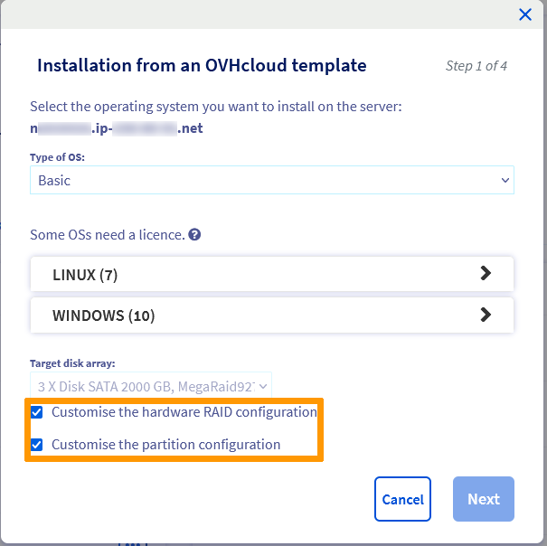
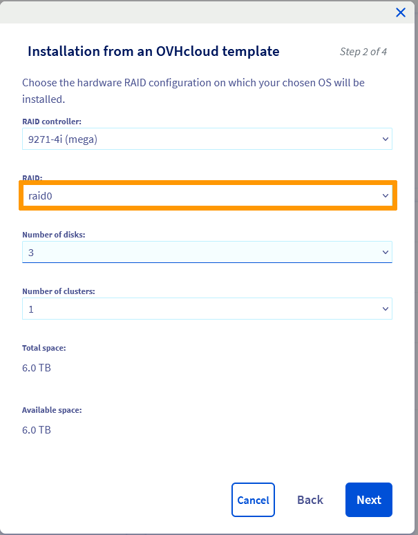
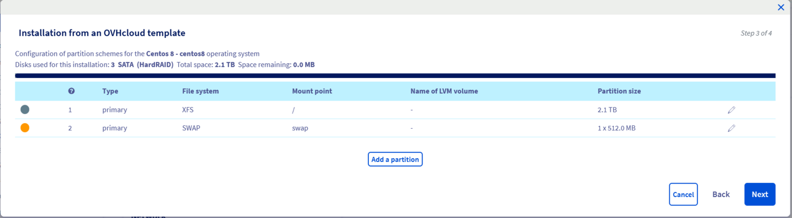
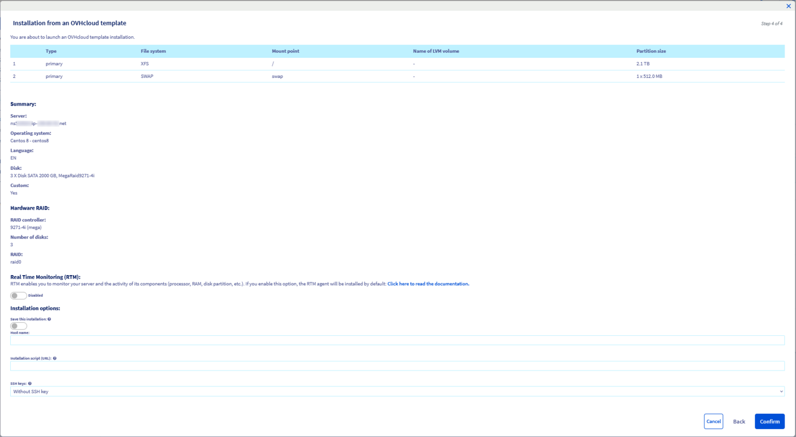
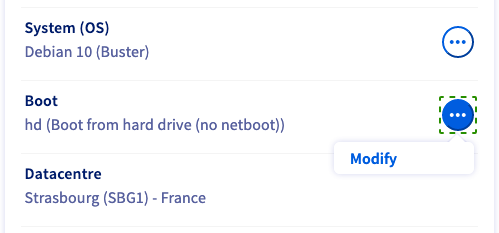
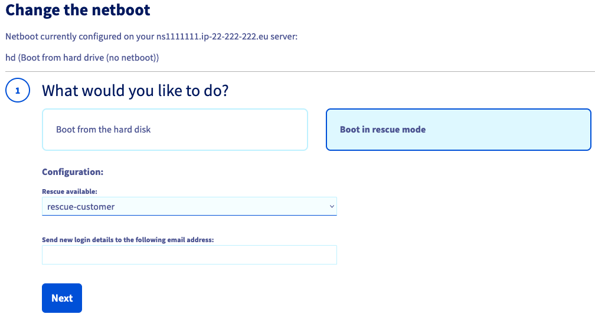
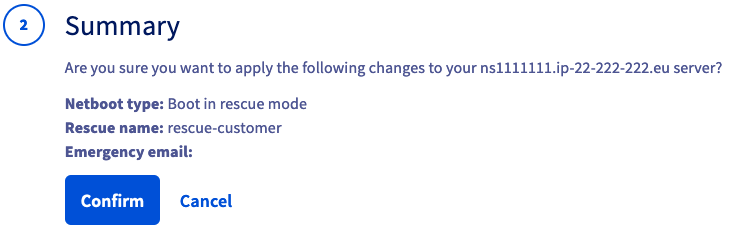
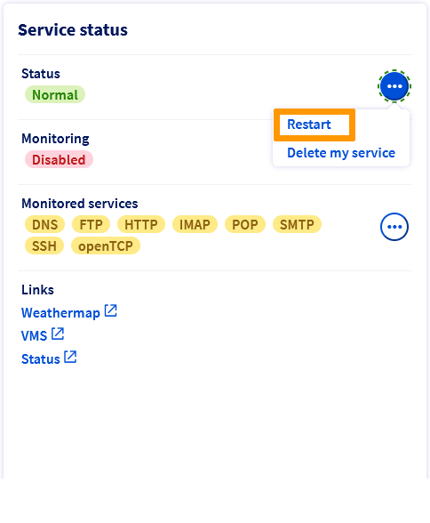

 
## Objective

Redundant Array of Independent Disks (RAID) is a utility that mitigates data loss on a server by replicating data across two or more disks.

The default RAID level for OVHcloud server installations is RAID 1, which doubles the space taken up by your data, effectively halving the usable disk space.

**This guide explains how to configure your server’s disks with RAID 0, which will allow you to use all your disks' usable space.**

> [!warning]
> 
> Please note: RAID 0 provides **NO FAULT TOLERANCE** and **NO DATA REDUNDANCY**, making data loss in the event of disk failure highly likely.
> 

## Requirements

- A [dedicated server](/links/bare-metal/bare-metal) with hardware RAID
- Administrative (sudo) access to the server via SSH

<!-- CP-NAV-START:baremetal-dedicated-servers -->
---

### OVHcloud Control Panel Access

- **Direct link:** [Dedicated Servers](/links/control-panel/baremetal-dedicated-servers)
- **Navigation path:** `Bare Metal Cloud`{.action} > `Dedicated servers`{.action} > Select your server

---
<!-- CP-NAV-END:baremetal-dedicated-servers -->

## Instructions

### Using the OVHcloud Control Panel

From the `General information`{.action} tab, click on `...`{.action} next to the operating system and then click `Install`{.action}.

Select the operating system you want to install and then click `Next`{.action}.

Tick the boxes for **Customise the hardware RAID configuration** and **Customise the partition configuration**, then click `Next`{.action}.

{.thumbnail}

Select `raid0` from the RAID drop-down list and click `Next`{.action}.

{.thumbnail}

Configure the partitions as you see fit and then click `Next`{.action}.

{.thumbnail}

Finally, click `Confirm`{.action}.

{.thumbnail}

After your server has been installed, check the partition sizes by logging on to the server via SSH and running the following command:

```sh
df -h
```

### Using rescue mode

In the **General Information** tab, look for `Boot` and click on `...`{.action}. Then click the `Edit`{.action} button to change the boot system.

{.thumbnail}

Next, select `Boot in rescue mode`{.action} then select `rescue-customer`{.action} from the drop-down list.

In the field "Send new login details to the following email address:", specify an alternative email address if you do not want the login credentials sent to your customer account’s primary address.

{.thumbnail}

Click `Next`{.action} and then Confirm`{.action} in the **Summary**.

{.thumbnail}

Once the change is completed, click on `...`{.action} next to “Status” in the box labelled **Service status**. Select `Restart`{.action} and the server will restart into rescue mode.

{.thumbnail}

When your server reboots, log in to it via SSH using the rescue mode credentials that were emailed to you.

From the command line, type the following commands to delete the existing RAID settings. All data in the RAID will be deleted:

```sh
MegaCli -CfgLdDel -L0 -a0
MegaCli -CfgLdDel -Lall -aAll
```

Type the following command to retrieve the slot device IDs of your disks:

```sh
MegaCli -PdList -aALL | egrep "Slot|Device ID"
```

Type the following commands to configure RAID level 0:

```sh
MegaCli -CfgLDAdd -R0[252:0,252:1] -a0
```

In this example, 252 is the ID of the drive enclosure.

After setting the new RAID level you can check the settings with the following command:

```sh
MegaCli -LDInfo -Lall -a0 | grep -i size
```

## Go further

[Hot Swap – Hardware RAID](/pages/bare_metal_cloud/dedicated_servers/hotswap_raid_hard)

[Hot Swap – Software RAID](/pages/bare_metal_cloud/dedicated_servers/hotswap_raid_soft)

[Hardware RAID](/pages/bare_metal_cloud/dedicated_servers/raid_hard)

Join our [community of users](/links/community).
