> [!primary]
> This article is about moving Additional IPv4, which follows [specific regional limitations](#limitations).
> 
> Configuring Additional IP addresses in a vRack (private network) circumvents those regional restrictions by not being dependent on a single region, while facilitating interconnection over a wide range of OVHcloud services.
>
> Learn how to configure Additional IP addresses in a vRack with our guides for [IPv4](/pages/bare_metal_cloud/dedicated_servers/configuring-an-ip-block-in-a-vrack) and [IPv6](/pages/bare_metal_cloud/dedicated_servers/configure-an-ipv6-in-a-vrack).
>

## Objective

Additional IP addresses can be moved between the services you use. This provides an advantage since you can maintain your IP reputation and SEO, and improve the continuity of service for your applications and systems.

With this technology, you can switch IP addresses from one solution to another in less than a minute, with virtually no interruption to services for your users. It is useful for service migrations (e.g. moving projects from development to production), or when switching to a backup server during a technical issue.

> [!primary]
> You can assign your IP address blocks to any compatible service within a region. IP address blocks in a region can be moved from one datacenter to another within that region but cannot be moved outside of that region. Consult our [Limitations](#limitations) section below.
>
> Except for the 3 regions eu-west-gra, eu-west-rbx, and eu-west-sbg, where IP address blocks can be moved between these three regions.
>
> A region is a geographical area composed of one or more datacenters.
>
> Migration only works for whole blocks, it is not possible to migrate individual IPs within a block.

**This guide explains how to move an Additional IP in your OVHcloud Control Panel or via the OVHcloud API. It also explains how to move an Additional IP from a So you Start account to an OVHcloud account.**

## Requirements

- A [dedicated server](/links/bare-metal/bare-metal) in your OVHcloud account
- An [Additional IP address](/links/network/additional-ip)

<!-- CP-NAV-START:network-public-ip -->
---

### OVHcloud Control Panel Access

- **Direct link:** [Public IP](/links/control-panel/network-public-ip)
- **Navigation path:** `Network`{.action} > `Public IP Addresses`{.action}

---
<!-- CP-NAV-END:network-public-ip -->

> [!warning]
> This feature might be unavailable or limited on servers of the [**Eco** product line](/links/bare-metal/eco-about).
>
> Please visit our [comparison page](/links/bare-metal/eco-compare) for more information.

> [!warning]
> If the Additional IP address or one of the block IP addresses has a virtual MAC attached, the target server must support the vMAC functionality.
> See [this guide](/pages/bare_metal_cloud/dedicated_servers/network_support_virtual_mac) for details.
>
> Otherwise, the virtual MACs must be removed from the Additional IPs before the transfer.

## Instructions

> [!primary]
> When an IP block containing unique virtual MAC addresses is moved between two servers, those addresses are temporarily suspended. They will appear on the new server once the move is complete.
>
> On the other hand, blocks containing duplicate virtual MAC addresses cannot be moved. You must first delete the duplicate virtual MAC address on the block to be moved.
>
> If an IP block is moved/added to the vRack, it is no longer linked to a physical server. In this case, any virtual MAC address will be lost during the transfer.
>

### Geolocalised IP blocks

The geolocation of an IP address is independent of its region of attachment.

If you order an additional IP block on a server but choose a different location (geolocation) for the IP block, this IP block cannot be moved to another server located in the same country as this block. For example, an additional IP block geolocated in Poland (eu-central-war) and ordered on a server located in a French datacentre (eu-west-gra) cannot be moved to a server located in a Polish datacentre (eu-central-war). The IP block can only be moved to an eligible server located in a French datacentre.

### Moving an Additional IP from the OVHcloud Control Panel

> [!warning]
> Only a single size block (/32) can be moved from a dedicated server to a VPS.
>

You can use the drop-down menu underneath **My public IP addresses and associated services** and select `All Additional IPs`{.action} to filter your services accordingly, or directly type the desired IP address in the search bar.

{.thumbnail}

Next, click the `⁝`{.action} button to the right of the Additional IP or block of IP addresses you want to move and select `Move Additional IP`{.action}.

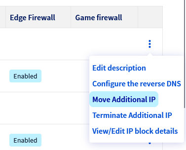{.thumbnail}

In the pop-up window, select the service to move the IP address to from the menu.

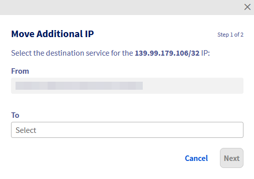{.thumbnail}

Click `Next`{.action}, then `Confirm`{.action}.

> [!warning]
> Please note that for some products, IP addresses (or blocks) have to be moved to an IP Parking first (a temporary storage location), before they can be moved to the desired product.
>
> To move IP blocks to a specific vRack network, please use **the vRack management interface**, which you can access by opening the `Network`{.action} menu in the left-hand sidebar, then selecting `vRack private network`{.action}.
>

### Moving an Additional IP via the API

Log in to the OVHcloud [API webpage](/links/api).

First, check if the IP address can be moved.
 To check if the IP can be moved to one of your dedicated servers, use the following call:

> [!api]
>
> @api {v1} /dedicated/server GET /dedicated/server/{serviceName}/ipCanBeMovedTo
>

- `serviceName`: the destination dedicated server reference
- `ip`: the Additional IP address to move

To move the IP address, use the following call:

> [!api]
>
> @api {v1} /dedicated/server POST /dedicated/server/{serviceName}/ipMove
>

- `serviceName`: the destination dedicated server reference
- `ip`: the Additional IP address to move

### Moving an Additional IP from a So you Start account to an OVHcloud account

To move an Additional IP from a SYS account to an OVHcloud account, there are a few things you need to consider:

- Moving an Additional IP incurs an installation fee. The IP address will not be moved if the invoice remains unpaid.
- It is not possible to move an Additional IP from an OVHcloud account to a So you Start account.
- Ensure that the server to which you are moving the Additional IP is in the same compatible region as the IP. See the ‘Limitations’ section below.

To begin, log into your So you Start account and click on `IP`{.action} in the main dashboard.

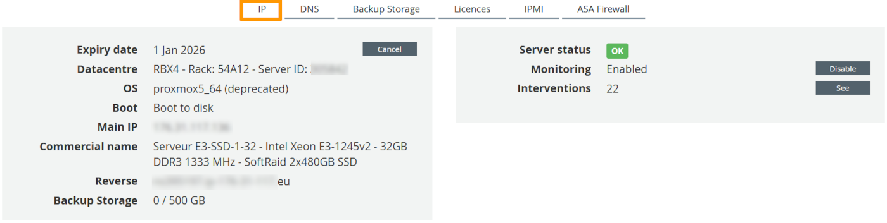{.thumbnail}

Click on the cogwheel next to the corresponding IP and select `Move the failover IP`{.action}.

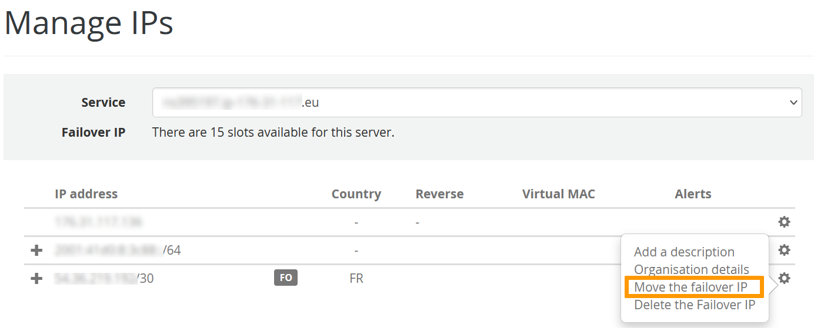{.thumbnail}

Select `Move to an OVH service`{.action}, enter your OVHcloud NIC handle and click on `Next`{.action}.

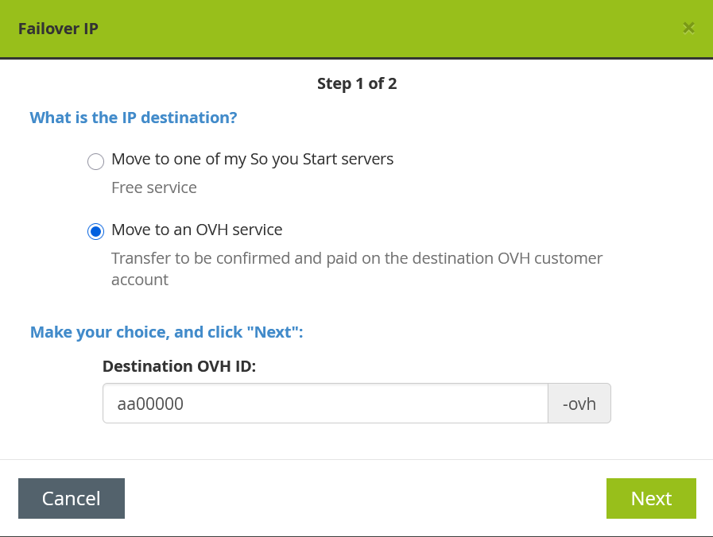{.thumbnail}

This will generate a code (token). Save it.

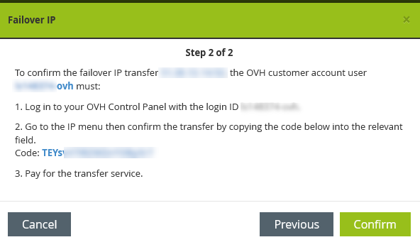{.thumbnail}

Next, [log into your OVHcloud account](/links/manager), open the `Network`{.action} menu in the left-hand sidebar and click `Public IP Addresses`{.action}.

Click on the cogwheel on the right side and select `Import IP addresses from SyS to OVHcloud`{.action}.

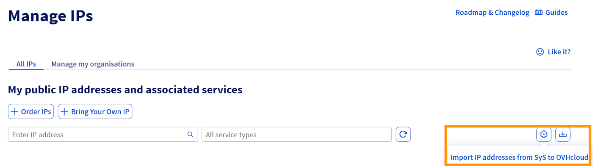{.thumbnail}

In the pop-up window, enter the Additional IP (or block) and the token retrieved from the So you Start account, then click `Next`{.action}.

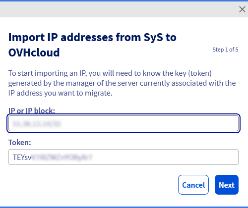{.thumbnail}

Select the destination server and click on `Next`{.action}. If the dedicated server is compatible with the IP, a green message will appear. If it is not, you will receive an error message.

Click on `Next`{.action}.

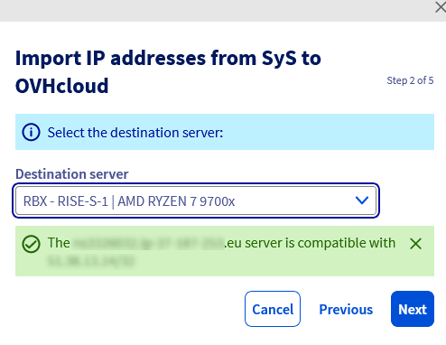{.thumbnail} 
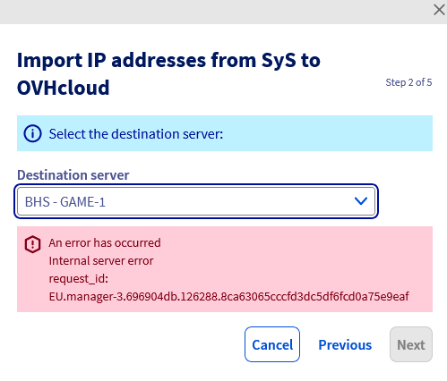{.thumbnail}

In the next window, the duration is automatically selected and the fee is displayed. Click `Next`{.action} to proceed.

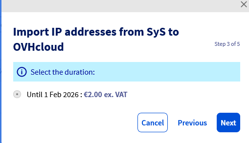{.thumbnail}

Check the box `Accept the contracts`{.action} to agree to the terms of the service once you have read them. Then, click on `Next`{.action}.

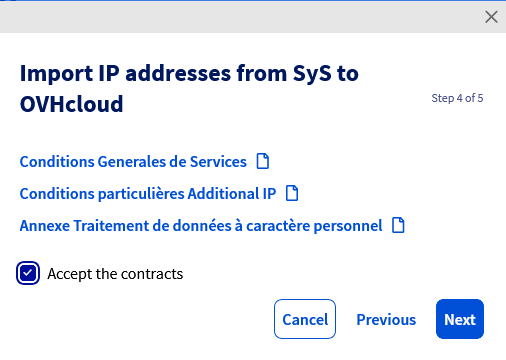{.thumbnail}

Take note of the order summary and click on `Confirm`{.action} to confirm it.

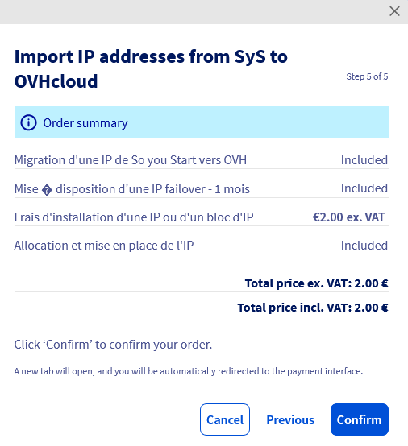{.thumbnail}

You will be redirected to a new page to make the payment.

Once the payment is done, your Additional IP will be transferred to your OVHcloud account and linked to the selected server. This process can take some time.

### Limitations 

Please note that there are certain limitations when moving an additional IP block. The table below shows the compatibility between regions.

For more information, consult our list of [available regions](/links/network/additional-ip).

| Zones  | eu-west-par | eu-west-gra | eu-west-rbx | eu-west-sbg | eu-west-lim | eu-central-war | eu-west-eri | ca-east-bhs | ca-east-tor | ap-southeast-sgp | ap-southeast-syd |
|----------------|-------------|-------------|-------------|-------------|-------------|----------------|-------------|-------------|-------------|-------------|-------------|
| eu-west-par    |      ✅        |      ❌       |     ❌        |     ❌        |      ❌       |      ❌          |       ❌       |       ❌      |     ❌      | ❌      |     ❌      |
| eu-west-gra    |       ❌      |       ✅       |      ✅       |      ✅      |       ❌       |       ❌         |       ❌        |     ❌        |    ❌        | ❌      |     ❌      |
| eu-west-sbg    |       ❌        |      ✅       |      ✅       |      ✅       |      ❌       |      ❌           |      ❌       |      ❌        |    ❌        | ❌      |     ❌      |
| eu-west-rbx |       ❌        |      ✅       |      ✅       |      ✅       |      ❌       |      ❌           |      ❌       |      ❌        |    ❌        | ❌      |     ❌      |
| eu-west-lim    |        ❌       |      ❌       |      ❌       |     ❌        |     ✅       |      ❌         |      ❌        |     ❌        |     ❌       | ❌      |     ❌      |
| eu-central-war |      ❌       |      ❌       |     ❌       |      ❌       |      ❌        |       ✅         |       ❌       |       ❌       |       ❌        | ❌      |     ❌      |
| eu-west-eri    |         ❌      |       ❌      |        ❌     |       ❌     |      ❌       |       ❌         |     ✅        |      ❌         |      ❌       | ❌      |     ❌      |
| ca-east-bhs    |     ❌        |      ❌       |    ❌         |        ❌    |        ❌       |      ❌          |       ❌      |     ✅        |      ❌       | ❌      |     ❌      |
| ca-east-tor    |    ❌         |      ❌       |     ❌        |        ❌       |      ❌       |       ❌         |      ❌       |      ❌       |       ✅     | ❌      |     ❌      |
| ap-southeast-sgp|    ❌         |      ❌       |     ❌        |        ❌       |      ❌       |       ❌         |      ❌       |      ❌       |       ❌       | ✅       |     ❌      |
| ap-southeast-syd|    ❌         |      ❌       |     ❌        |        ❌       |      ❌       |       ❌         |      ❌       |      ❌       |       ❌       | ❌      |     ✅       |

## Go further

[Configuring IP Aliasing on a Dedicated Server](/pages/bare_metal_cloud/dedicated_servers/network_ipaliasing)

[Dedicated Server - Configuring Additional IPs in Bridge Mode](/pages/bare_metal_cloud/dedicated_servers/network_bridging)

Join our [community of users](/links/community).