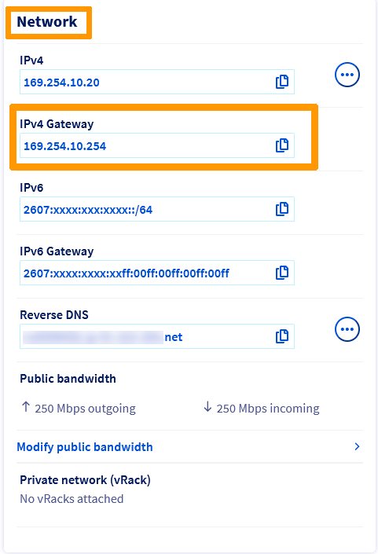
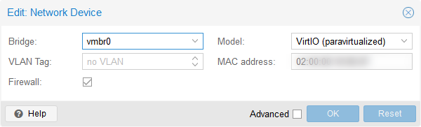
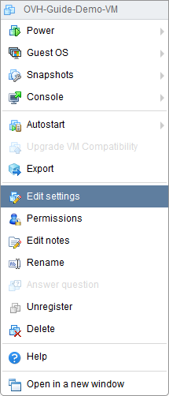
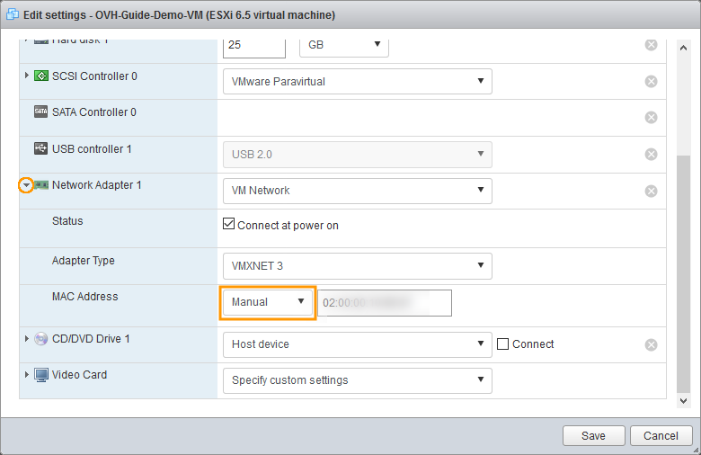
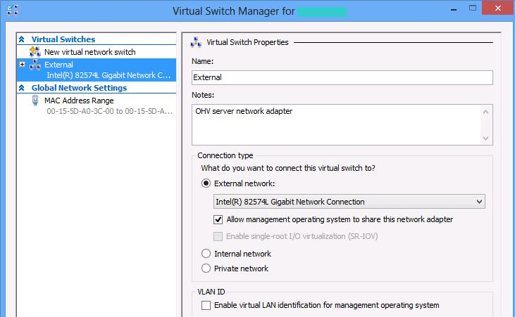
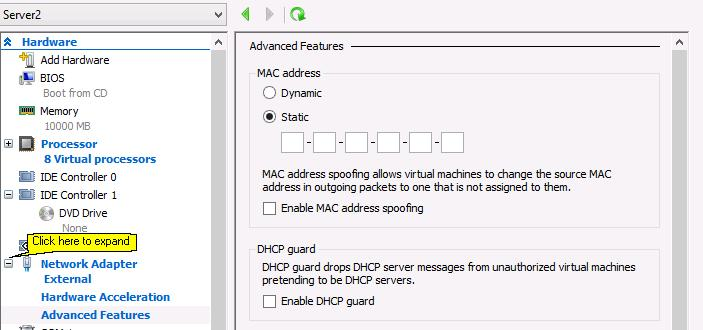
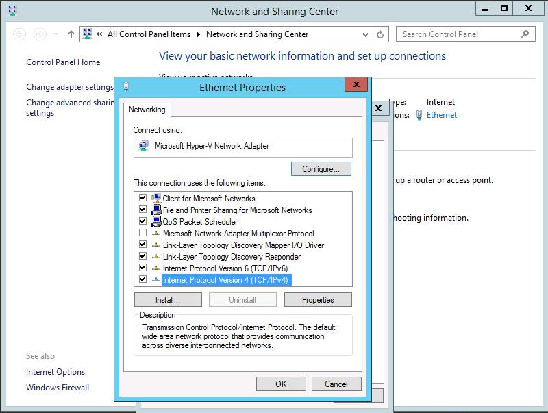

> [!primary]
>
> Depuis le 6 octobre 2022, notre solution "IP Failover" s'appelle désormais [Additional IP](/links/network/additional-ip). Cela n'a pas d'impact sur ses fonctionnalités.
>

## Objectif

La mise en réseau en mode bridge peut être utilisée pour configurer vos machines virtuelles. Quelques modifications sont nécessaires pour que la configuration fonctionne sur notre réseau.

**Ce guide vous montre comment utiliser le mode bridge pour configurer l'accès à Internet pour vos machines virtuelles.**

<iframe class="video" width="560" height="315" src="https://www.youtube.com/embed/TZZbPe9hCOk?rel=0" frameborder="0" allow="autoplay; encrypted-media" allowfullscreen></iframe>

## Prérequis

* Posséder un serveur dédié avec un hyperviseur installé ([VMware ESXi](http://www.vmware.com/products/esxi-and-esx/overview.html){.external}, Citrix Xen Server, Proxmox, par exemple).
* Bénéficier d'au moins une adresse [Additional IP](/links/network/additional-ip) connectée au serveur.
* Être connecté à votre [espace client OVHcloud](/links/manager).

> [!warning]
> Cette fonctionnalité peut être indisponible ou limitée sur les [serveurs dédiés **Eco**](/links/bare-metal/eco-about).
>
> Consultez notre [comparatif](/links/bare-metal/eco-compare) pour plus d’informations.
>
> Ce guide n'est pas applicable aux serveurs des gammes [Scale](https://www.ovhcloud.com/fr-ca/bare-metal/scale/) et [High Grade](https://www.ovhcloud.com/fr-ca/bare-metal/high-grade/). Il en est de même pour la gamme de serveurs Advance disposant des CPU AMD Epyc 4K et 8K lancée depuis juillet 2024.
>
> Reportez-vous plutôt aux guides suivants : [Configurer le réseau sur ESXi sur les gammes High Grade & SCALE](/pages/bare_metal_cloud/dedicated_servers/esxi-network-HG-Scale), [Configurer le réseau sur Proxmox VE sur les gammes High Grade & SCALE](/pages/bare_metal_cloud/dedicated_servers/proxmox-network-HG-Scale) et [Configurer le réseau sur Windows Server avec Hyper-V sur les gammes High Grade & SCALE](/pages/bare_metal_cloud/dedicated_servers/hyperv-network-HG-Scale).

## En pratique

Les étapes de base sont toujours les mêmes, indépendamment des systèmes utilisés :

* création d'une adresse MAC virtuelle pour une adresse IP de basculement ;
* régler l'adresse MAC de la machine virtuelle (VM) sur cette nouvelle adresse ;
* configurer **l'adresse IP**, **le masque réseau**, **la passerelle** et **la route vers la passerelle** à l'intérieur de la machine virtuelle.

Pour cet exemple, nous utiliserons les valeurs suivantes dans nos exemples de code. Celles-ci devront être remplacées par vos propres valeurs :

* « SERVER_IP » : l’adresse IP principale de votre serveur ;
* « ADDITIONAL_IP » : votre adresse Additional IP ;
* « GATEWAY_IP » : l’adresse de votre passerelle par défaut.

### Assigner une adresse MAC virtuelle

Connectez-vous à votre [espace client OVHcloud](/links/manager), cliquez sur le menu `Bare Metal Cloud`{.action} puis sur la section `Network`{.action}. Cliquez ensuite sur `IP`{.action}.

Cliquez sur l'onglet `Additional IP`{.action}.

{.thumbnail}

Cliquez sur le bouton `...`{.action} à côté de l'Additional IP de votre choix puis sur `Ajouter une MAC virtuelle`{.action}.

{.thumbnail}

Sélectionnez « ovh » dans la liste déroulante « Type », tapez un nom dans le champ « Nom de la machine virtuelle », puis cliquez sur `Valider`{.action}.

{.thumbnail}

Après quelques secondes, une adresse MAC virtuelle apparaîtra dans la colonne "MAC virtuelle" de la rangée votre adresse Additional IP. Cette adresse MAC virtuelle sera nécessaire lors de la configuration de votre VM sur l'hôte.

### Déterminer l'adresse de la passerelle (gateway) <a name="determinegateway"></a>

Pour configurer vos machines virtuelles pour l'accès à Internet, vous devez connaître la passerelle de votre machine hôte, c’est-à-dire, votre serveur dédié. L'adresse de la passerelle est constituée des trois premiers octets de l'adresse IP principale de votre serveur, le dernier octet étant de 254. Par exemple, si l’adresse IP principale de votre serveur est :

* 203.0.113.1

Votre adresse de passerelle sera alors :

* 203.0.113.**254**

Vous pouvez également récupérer l'adresse de la passerelle via [votre espace client](#viacontrolpanel) ou l’[API OVHcloud](#viaapi).

#### Via votre espace client <a name="viacontrolpanel"></a>

Connectez-vous à votre [espace client OVHcloud](/links/manager), rendez-vous dans la section `Bare Metal Cloud`{.action} et sélectionnez votre serveur sous la partie `Serveur dédies`{.action}.

La gateway IPv4 assignée à votre serveur est affichée dans la section `Réseau` de l'onglet `Informations générales`{.action}. Une fois copié, poursuivez l'application de la configuration.

{.thumbnail}

#### Via les API OVHcloud <a name="viaapi"></a>

Sur la [page API OVHcloud](https://ca.api.ovh.com/console/), cliquez en haut à droite sur `Login`{.action}. Sur la page suivante, saisissez votre identifiant client OVHcloud.

Exécutez l'appel API suivant, en indiquant le nom interne du serveur (exemple : `ns3956771.ip-169-254-10.eu`) :

> [!api]
>
> @api {v1} /dedicated/server GET /dedicated/server/{serviceName}/specifications/network
>

### Préparer l'hôte

> [!primary]
>
Pour tous les systèmes d'exploitation et distributions, vous devez configurer votre machine virtuelle avec l'adresse MAC virtuelle créée dans votre espace client OVHcloud.
>

#### Proxmox

> [!warning]
>
> Les instructions suivantes s'appliquent à une machine virtuelle créée précédemment avec un système d'exploitation déjà installé. Si vous n'avez pas créé de VM, veuillez consulter les options sur la page [Qemu/KVM Virtual Machine](https://pve.proxmox.com/wiki/Qemu/KVM_Virtual_Machines){.external} (EN) de Proxmox.
>

Après avoir créé la machine virtuelle et lorsque celle-ci est encore éteinte :

1. Sélectionnez la machine virtuelle.
2. Ouvrez la section « Matériel ».
3. Sélectionnez `Périphérique réseau`{.action}.
4. Cliquez sur le bouton `Modifier`{.action}.

{.thumbnail}

Ajoutez ensuite l'adresse MAC que vous avez créée précédemment.
{.thumbnail}

Vous pouvez maintenant démarrer votre machine virtuelle et passer aux étapes suivantes, en fonction du système d'exploitation choisi.

#### VMware ESXi

> [!warning]
>
> Les instructions suivantes s'appliquent à une machine virtuelle créée précédemment avec un système d'exploitation déjà installé. Si vous n'avez pas créé de VM, consultez le guide [Créer une machine virtuelle dans le client hôte VMware](https://docs.vmware.com/en/VMware-vSphere/7.0/com.vmware.vsphere.hostclient.doc/GUID-77AB6625-F968-4983-A230-A020C0A70326.html){.external} (EN) sur la page VMware.
>

Après avoir créé la machine virtuelle et lorsqu'elle est hors tension, effectuez un clic droit sur celle-ci et cliquez sur `Modifier les paramètres`{.action}.

{.thumbnail}

Dépliez `Network Adapter 1`{.action} et changez la valeur dans le menu déroulant `Adresse MAC`{.action} en mode « Manuel » et entrez l'adresse MAC VMware créée précédemment.

{.thumbnail}

Vous pouvez maintenant démarrer votre machine virtuelle et passer aux étapes suivantes, selon votre système d'exploitation.

### Configurer les machines virtuelles <a name="configurationsteps"></a>

> [!warning]
>
> Veuillez noter que les exemples suivants supposent que vous êtes connecté en tant qu'utilisateur avec des privilèges limités, d'où l'utilisation de *sudo* devant chaque commande. Si vous êtes connecté en tant que *root*, vous n'avez pas besoin de le faire.
>

#### Debian

Par défaut, le fichier de configuration réseau de la machine virtuelle est situé dans `/etc/network/interfaces`.

Une fois connecté au shell de votre machine virtuelle, exécutez la commande suivante pour identifier le nom de votre interface :

```bash
ls /sys/class/net
```

Effectuez ensuite une copie du fichier de configuration, afin de pouvoir revenir en arrière à tout moment :

```bash
sudo cp /etc/network/interfaces /etc/network/interfaces.bak
```

En cas d'erreur, vous pourrez revenir en arrière grâce aux commandes ci-dessous :

```bash
sudo rm -f /etc/network/interfaces
sudo cp /etc/network/interfaces.bak /etc/network/interfaces
```

Modifiez le fichier pour qu'il reflète la configuration ci-dessous, remplacez `INTERFACE_NAME`, `ADDITIONAL_IP` et `GATEWAY_IP` par vos propres valeurs.

```bash
sudo nano /etc/network/interfaces
```

```console
auto lo
iface lo inet loopback

# The primary network interface
auto INTERFACE_NAME
iface INTERFACE_NAME inet static
address ADDITIONAL_IP
netmask 255.255.255.255
gateway GATEWAY_IP
```

**Exemple**

```console
auto lo
iface lo inet loopback

# The primary network interface
auto ens192
iface ens192 inet static
address 192.0.2.1
netmask 255.255.255.255
gateway 203.0.113.254
```

Enregistrez et fermez le fichier.<br>
Ensuite, éditez ou créez le fichier `/etc/resolv.conf` :

```bash
sudo nano /etc/resolv.conf
```

Ajoutez la ligne suivante :

```console
nameserver 213.186.33.99
```

Enregistrez et fermez le fichier.<br>
Vous devez maintenant mettre en ligne votre interface réseau. Pour ce faire, entrez la commande suivante (remplacez `ens192` par vos propres valeurs) :

```bash
sudo ip link set ens192 up
```

Enfin, redémarrez votre service réseau à l'aide de la commande suivante :

```bash
sudo systemctl restart networking
```

Pour vérifier que la machine virtuelle est entièrement connectée à Internet, utilisez la commande suivante :

```bash
ping -c 4 example.com
PING example.com (93.184.215.14) 56(84) bytes of data.
64 bytes from 93.184.215.14 (93.184.215.14): icmp_seq=1 ttl=55 time=29.3 ms
64 bytes from 93.184.215.14 (93.184.215.14): icmp_seq=2 ttl=55 time=24.9 ms
64 bytes from 93.184.215.14 (93.184.215.14): icmp_seq=3 ttl=55 time=30.8 ms
64 bytes from 93.184.215.14 (93.184.215.14): icmp_seq=4 ttl=55 time=27.0 ms

--- example.com ping statistics ---
4 packets transmitted, 4 received, 0% packet loss, time 3004ms
rtt min/avg/max/mdev = 24.925/28.028/30.840/2.254 ms
```

Si vous recevez une réponse, cela signifie que l’Additional IP a été correctement configurée. Si ce n'est pas le cas, redémarrez votre machine virtuelle et recommencez la commande ping.

#### Systèmes d'exploitation Red Hat et basés sur Red Hat (CentOS, Rocky Linux 8, Alma Linux 8, etc.)

Par défaut, le fichier de configuration réseau de la machine virtuelle se trouve dans `/etc/sysconfig/network-scripts/`. À titre de démonstration, notre fichier s'appelle `ifcfg-eth0`.

Une fois connecté au shell de votre machine virtuelle, exécutez la commande suivante pour identifier le nom de votre interface :

```bash
ls /sys/class/net
```

Effectuez ensuite une copie du fichier de configuration, afin de pouvoir revenir en arrière à tout moment :

```bash
sudo cp /etc/sysconfig/network-scripts/ifcfg-eth0 /etc/sysconfig/network-scripts/ifcfg-eth0.bak
```

En cas d'erreur, vous pourrez revenir en arrière grâce aux commandes ci-dessous :

```bash
sudo rm -f etc/sysconfig/network-scripts/ifcfg-eth0
sudo cp /etc/sysconfig/network-scripts/ifcfg-eth0.bak etc/sysconfig/network-scripts/ifcfg-eth0
```

Modifiez le fichier pour qu'il reflète la configuration ci-dessous, remplacez `ADDITIONAL_IP`, `GATEWAY_IP` et `MY:VI:RT:UA:LM:AC` par vos propres valeurs. En outre, les paramètres « BOOTPROTO », « ONBOOT » et « DNS » doivent être ajustés (ou ajoutés s'ils sont manquants). Il n'est pas nécessaire d'éditer d'autres lignes.

```bash
sudo vi /etc/sysconfig/network-scripts/ifcfg-eth0
```

```console
PROXY_METHOD=none
BROWSER_ONLY=no
BOOTPROTO=none
DEFROUTE=yes
IPV4_FAILURE_FATAL=no
IPV6INIT=yes
IPV6_AUTOCONF=yes
IPV6_DEFROUTE=yes
IPV6_FAILURE_FATAL=no
IPV6_ADDR_GEN_MODE=stable-privacy
NAME=eth0
UUID=120ae2c6-4aa6-xxxx-xxxx-xxxxxxxxxx
DEVICE=eth0
ONBOOT=yes
NETMASK=255.255.255.255
IPADDR=ADDITIONAL_IP
GATEWAY=GATEWAY_IP
HWADDR=MY:VI:RT:UA:LM:AC
DNS=213.186.33.99
```

Enregistrez et fermez le fichier.<br>
Ensuite, créez un nouveau fichier, `route-(interface_name)`, dans le répertoire `/etc/sysconfig/network-scripts/` et définissez les routes par défaut suivantes pour l'interface à l'aide de la passerelle définie dans l'[étape 2](#determinegateway).

Dans notre exemple, notre fichier s'appelle `route-eth0` (remplacez `eth0` par vos propres valeurs) :

```bash
sudo vi /etc/sysconfig/network-scripts/route-eth0
```

Modifiez le fichier pour qu'il reflète la configuration ci-dessous, remplacez `GATEWAY_IP` par votre propre valeur.

```console
GATEWAY_IP dev eth0
default via GATEWAY_IP dev eth0
```

Enregistrez et fermez le fichier.

Redémarrez votre réseau à l'aide de la commande suivante :

```bash
sudo systemctl restart network
```

Pour vérifier que la machine virtuelle est entièrement connectée à Internet, utilisez la commande suivante :

```bash
ping -c 4 example.com
PING example.com (93.184.215.14) 56(84) bytes of data.
64 bytes from 93.184.215.14 (93.184.215.14): icmp_seq=1 ttl=55 time=29.3 ms
64 bytes from 93.184.215.14 (93.184.215.14): icmp_seq=2 ttl=55 time=24.9 ms
64 bytes from 93.184.215.14 (93.184.215.14): icmp_seq=3 ttl=55 time=30.8 ms
64 bytes from 93.184.215.14 (93.184.215.14): icmp_seq=4 ttl=55 time=27.0 ms

--- example.com ping statistics ---
4 packets transmitted, 4 received, 0% packet loss, time 3004ms
rtt min/avg/max/mdev = 24.925/28.028/30.840/2.254 ms
```

Si vous recevez une réponse, cela signifie que l’Additional IP a été correctement configurée. Si ce n'est pas le cas, redémarrez votre machine virtuelle et recommencez la commande ping.

#### Rocky Linux 9 and Alma Linux 9

Dans les versions précédentes de Rocky Linux et Alma Linux, les profils réseau étaient stockés au format ifcfg dans ce répertoire : `/etc/sysconfig/network-scripts/`. Toutefois, le format ifcfg est désormais déconseillé et a été remplacé par keyfiles. Le fichier de configuration se trouve désormais dans le répertoire : `/etc/NetworkManager/system-connections/`.

Une fois connecté au shell de votre machine virtuelle, exécutez la commande suivante pour identifier le nom de votre interface :

```bash
ls /sys/class/net
```

Effectuez ensuite une copie du fichier de configuration, afin de pouvoir revenir en arrière à tout moment. 

À titre de d'exemple, notre fichier s'appelle `ens18-nmconnection` :

```bash
sudo cp /etc/NetworkManager/system-connections/ens18-nmconnection /etc/NetworkManager/system-connections/ens18-nmconnection.bak
```

En cas d'erreur, vous pourrez revenir en arrière grâce aux commandes ci-dessous :

```bash
sudo rm -f /etc/NetworkManager/system-connections/ens18-nmconnection
sudo cp /etc/NetworkManager/system-connections/ens18-nmconnection.bak /etc/NetworkManager/system-connections/ens18-nmconnection
```

Modifiez le fichier pour qu'il reflète la configuration ci-dessous, remplacez `ADDITIONAL_IP` et `GATEWAY_IP` par vos propres valeurs. Dans cet exemple, le nom de l'interface est `ens18`. Remplacez cette valeur si elle ne s'applique pas.

```console
[ipv4]
method=auto
may-fail=false
address1=ADDITIONAL_IP/32
gateway=GATEWAY_IP
```

Enregistrez et fermez le fichier.<br>
Redémarrez votre interface réseau avec la commande suivante :

```bash
sudo systemctl restart NetworkManager
```

Pour vérifier que la machine virtuelle est entièrement connectée à Internet, utilisez la commande suivante :

```bash
ping -c 4 example.com
PING example.com (93.184.215.14) 56(84) bytes of data.
64 bytes from 93.184.215.14 (93.184.215.14): icmp_seq=1 ttl=55 time=29.3 ms
64 bytes from 93.184.215.14 (93.184.215.14): icmp_seq=2 ttl=55 time=24.9 ms
64 bytes from 93.184.215.14 (93.184.215.14): icmp_seq=3 ttl=55 time=30.8 ms
64 bytes from 93.184.215.14 (93.184.215.14): icmp_seq=4 ttl=55 time=27.0 ms

--- example.com ping statistics ---
4 packets transmitted, 4 received, 0% packet loss, time 3004ms
rtt min/avg/max/mdev = 24.925/28.028/30.840/2.254 ms
```

Si vous recevez une réponse, cela signifie que l’Additional IP a été correctement configurée. Si ce n'est pas le cas, redémarrez votre machine virtuelle et recommencez la commande ping.

#### FreeBSD

Par défaut, le fichier de configuration réseau de la machine virtuelle est situé dans `/etc/rc.conf`.

Une fois connecté au shell de votre machine virtuelle, exécutez la commande suivante pour identifier le nom de votre interface :

```bash
ls /sys/class/net
```

Effectuez ensuite une copie du fichier de configuration, afin de pouvoir revenir en arrière à tout moment :

```bash
sudo cp /etc/rc.conf /etc/rc.conf.bak
```

En cas d'erreur, vous pourrez revenir en arrière grâce aux commandes ci-dessous :

```bash
sudo rm -f /etc/rc.conf
sudo cp /etc/rc.conf.bak /etc/rc.conf
```

Modifiez le fichier pour qu'il reflète la configuration ci-dessous, remplacez `ADDITIONAL_IP` et `GATEWAY_IP` par vos propres valeurs. Dans cet exemple, le nom de l'interface est `em0`. Remplacez cette valeur si elle ne s'applique pas.


```console
ifconfig_em0="inet ADDITIONAL_IP netmask 255.255.255.255 broadcast ADDITIONAL_IP"
static_routes="net1 net2"
route_net1="-net GATEWAY_IP/32 -interface em0"
route_net2="default GATEWAY_IP"
```

Enregistrez et fermez le fichier. Ensuite, éditez le fichier `/etc/resolv.conf`. Créez-le si nécessaire.

```console
nameserver 213.186.33.99
```

Enregistrez et fermez le fichier, puis redémarrez la machine virtuelle.

Pour vérifier que la machine virtuelle est entièrement connectée à Internet, utilisez la commande suivante :

```bash
ping -c 4 example.com
PING example.com (93.184.215.14) 56(84) bytes of data.
64 bytes from 93.184.215.14 (93.184.215.14): icmp_seq=1 ttl=55 time=29.3 ms
64 bytes from 93.184.215.14 (93.184.215.14): icmp_seq=2 ttl=55 time=24.9 ms
64 bytes from 93.184.215.14 (93.184.215.14): icmp_seq=3 ttl=55 time=30.8 ms
64 bytes from 93.184.215.14 (93.184.215.14): icmp_seq=4 ttl=55 time=27.0 ms

--- example.com ping statistics ---
4 packets transmitted, 4 received, 0% packet loss, time 3004ms
rtt min/avg/max/mdev = 24.925/28.028/30.840/2.254 ms
```

Si vous recevez une réponse, cela signifie que l’Additional IP a été correctement configurée. Si ce n'est pas le cas, redémarrez votre machine virtuelle et recommencez la commande ping.

#### Ubuntu 

Par défaut, le fichier de configuration réseau de la machine virtuelle est situé dans `/etc/netplan/`.

Tout d'abord, accédez à la console pour vous connecter à votre machine virtuelle et exécutez la commande suivante pour identifier le nom de votre interface :

```bash
ip addr
```

Ensuite, faites une copie du fichier de configuration, afin de pouvoir revenir en arrière à tout moment. À titre de démonstration, notre fichier s'appelle `00-installer-config.yaml` :

```bash
sudo cp /etc/netplan/00-installer-config.yaml /etc/netplan/00-installer-config.yaml.bak
```

En cas d'erreur, vous pourrez revenir en arrière grâce aux commandes ci-dessous :

```bash
sudo rm -f /etc/netplan/00-installer-config.yaml
sudo cp /etc/netplan/00-installer-config.yaml.bak /etc/netplan/00-installer-config.yaml
```

Ensuite, ouvrez le fichier de configuration réseau situé dans `/etc/netplan/` avec la commande suivante :

```bash
sudo nano /etc/netplan/00-installer-config.yaml
```

Une fois le fichier ouvert pour modification, modifiez-le avec le code suivant, en remplaçant `INTERFACE-NAME`, `ADDITIONAL_IP` et `GATEWAY_IP` par vos propres valeurs.

```yaml
network:
  ethernets:
    INTERFACE-NAME:
      dhcp4: true
      addresses:
          - ADDITIONAL_IP/32
      nameservers:
          addresses:
              - 213.186.33.99   
      routes:
           - to: 0.0.0.0/0
             via: GATEWAY_IP
             on-link: true
  version: 2
```

**Exemple**

```yaml
network:
  ethernets:
    ens18:
      dhcp4: true
      addresses:
          - 192.0.2.1/32
      nameservers:
          addresses:
              - 213.186.33.99
      routes:
           - to: 0.0.0.0/0
             via: 203.0.113.254
             on-link: true
  version: 2
```

Enregistrez et fermez le fichier. Vous pouvez tester la configuration avec la commande suivante :

```bash
sudo netplan try
```

Si elle est correcte, appliquez-la à l'aide de la commande suivante :

```bash
sudo netplan apply
```

Pour vérifier que la machine virtuelle est entièrement connectée à Internet, utilisez la commande suivante :

```bash
ping -c 4 example.com
PING example.com (93.184.215.14) 56(84) bytes of data.
64 bytes from 93.184.215.14 (93.184.215.14): icmp_seq=1 ttl=55 time=29.3 ms
64 bytes from 93.184.215.14 (93.184.215.14): icmp_seq=2 ttl=55 time=24.9 ms
64 bytes from 93.184.215.14 (93.184.215.14): icmp_seq=3 ttl=55 time=30.8 ms
64 bytes from 93.184.215.14 (93.184.215.14): icmp_seq=4 ttl=55 time=27.0 ms

--- example.com ping statistics ---
4 packets transmitted, 4 received, 0% packet loss, time 3004ms
rtt min/avg/max/mdev = 24.925/28.028/30.840/2.254 ms
```

Si vous recevez une réponse, cela signifie que l’Additional IP a été correctement configurée. Si ce n'est pas le cas, redémarrez votre machine virtuelle et recommencez la commande ping.

#### Windows Server/Hyper-V

Avant de configurer votre machine virtuelle, vous devrez créer un commutateur virtuel.

Depuis la ligne de commande de votre serveur dédié, exécutez la commande suivante et notez le nom de la carte réseau qui contient l'adresse IP principale du serveur :

```powershell
ipconfig /all
```

Dans le panneau de configuration Hyper-V, créez un nouveau commutateur virtuel et définissez le type de connexion sur `External`{.action}.

Sélectionnez l'adaptateur avec l'adresse IP du serveur, puis cochez `Autoriser le système d'exploitation à partager cette carte réseau`{.action}.

{.thumbnail}

> [!primary]
> 
> Cette étape n'est requise qu'une seule fois pour un serveur Hyper-V. Pour toutes les machines virtuelles, un commutateur virtuel est nécessaire pour connecter les cartes réseau virtuelles de la machine virtuelle à la carte physique du serveur.
> 

Ensuite, sélectionnez la machine virtuelle à laquelle vous souhaitez ajouter l'Additional IP. Utilisez le panneau de configuration Hyper-V pour modifier les paramètres de la machine virtuelle, puis fermez-le.

Déployez ensuite la carte réseau et cliquez sur `Advanced Features`{.action}, définissez l'adresse MAC sur `Static`{.action} et entrez l'adresse MAC virtuelle pour l'adresse Additional IP. Une fois que vous avez entré ces paramètres, appuyez sur `OK`{.action} pour appliquer les modifications.

{.thumbnail}

Démarrez maintenant la machine virtuelle et connectez-vous en tant qu'administrateur, puis accédez à `Control Panel`{.action} et `Network and Sharing Center`{.action}. Cliquez sur le lien `Connections : Ethernet`{.action}, puis cliquez sur le bouton `Properties`{.action} pour afficher les propriétés Ethernet.

Sélectionnez `Internet Protocol Version 4 (TCP/IPv4)`{.action}, puis cliquez sur le bouton `Properties`{.action} pour afficher les propriétés IPv4.

{.thumbnail}

Dans la fenêtre de propriétés de l’IPv4, sélectionnez `Use the following IP address`{.action}. Entrez l'adresse Additional IP dans le champ d'adresses IP et entrez « 255.255.255.255 » dans le masque de sous-réseau.

Entrez ensuite l’adresse IP de la passerelle de votre serveur dans la passerelle par défaut (par exemple, l’IP de votre serveur se terminant par 254) et entrez « 213.186.33.99 » dans le champ `Preferred DNS Server`{.action}.

Cliquez sur `OK`{.action} et ignorez le message d'avertissement relatif à l'adresse IP de la passerelle et à l'adresse IP attribuée qui ne figurent pas dans le même sous-réseau.

Finalement, redémarrez le serveur. La machine virtuelle doit alors être connectée à Internet à l'aide de l'adresse Additional IP.

{.thumbnail}

#### Résolution des défauts

Si vous ne parvenez pas à établir une connexion entre votre machine virtuelle et le réseau public et que vous soupçonnez un problème de réseau, redémarrez le serveur en mode rescue et configurez l'interface réseau passerelle directement sur l'hôte.

Pour ce faire, une fois que vous avez redémarré votre serveur en mode rescue, entrez les commandes suivantes :

```bash
ip link add name test-bridge link eth0 type macvlan
ip link set dev test-bridge address MAC_ADDRESS
ip link set test-bridge up
ip addr add ADDITIONAL_IP/32 dev test-bridge
```

Remplacez « MAC_ADDRESS » par l'adresse MAC virtuelle générée dans le panneau de configuration et « ADDITIONAL_IP » par l'Additional IP réel.

Ensuite, il vous suffit d'effectuer un ping sur votre Additional IP depuis l'extérieur. Si cela fonctionne, cela signifie probablement qu'il y a une erreur de configuration sur la machine virtuelle ou sur l'hôte qui empêche l'Additional IP de fonctionner en mode normal. Si, au contraire, l'IP ne fonctionne toujours pas, veuillez ouvrir un ticket d'assistance via le [centre d'aide](https://help.ovhcloud.com/csm?id=csm_cases_requests).

## Aller plus loin

Échangez avec notre [communauté d'utilisateurs](/links/community).
