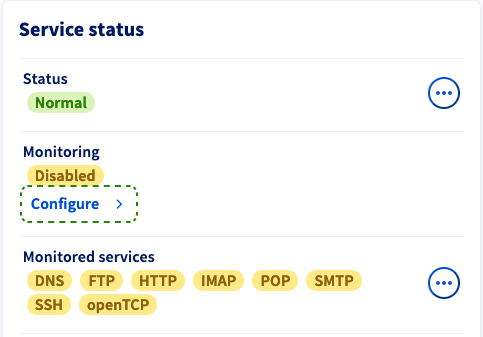

## Objective

The monitoring service allows OVHcloud to monitor the status of your machine and automatically trigger the intervention of a technician in the datacenter.

All the servers of our customers and the entire network are monitored 24/7 by OVHcloud technical teams.

OVHcloud intervenes as soon as an alert (non-response to the pings) is triggered in order to minimize the downtime of the servers and the network.

To implement a restrictive firewall, especially on ICMP, and continue to benefit from OVHcloud monitoring, it is necessary to authorize the IPs that you will find below.

## Requirements

- An OVHcloud service on which you have installed a firewall
- Access to the firewall rules

## Instructions

### IP addresses to be authorised

Reverse|IP|Protocol|
|---|---|---|
|netmon-rbx-probe|92.222.184.0/24|icmp|
|netmon-sbg-probe|92.222.185.0/24|icmp|
|netmon-gra-probe|92.222.186.0/24|icmp|
|netmon-bhs-probe|167.114.37.0/24|icmp|
|netmon-sgp-probe|139.99.1.144/28|icmp|
|---|---|---|
|ping.ovh.net|213.186.33.13|icmp|
||xxx.xxx.xxx.250 (xxx.xxx.xxx.aaa is the server ip)|icmp|
||xxx.xxx.xxx.251 (xxx.xxx.xxx.aaa is the server ip)|icmp + Port monitored by the monitoring service|

**Communication between the RTM service and your server also requires that you allow inbound and outbound connections on UDP ports 6100 through 6200.**

> [!primary]
>
> If your server is located in Roubaix 3, you have to retrieve the last IP via tcpdump:
> <pre class="highlight language-console"><code class="language-console">tcpdump host server_ip | grep ICMP</code></pre>
>

### Server monitoring

Log in to the [OVHcloud Control Panel](/links/manager){.external} and select the `Bare Metal Cloud`{.action} tab. Select the server concerned in the `Dedicated servers`{.action} menu.

You can set the monitoring status for a dedicated server from the `General information`{.action} tab (section **Service status**).

{.thumbnail}

Click on the button `Configure`{.action}. In the popup window, you have three options for the monitoring behaviour:

- **Disabled**: This option stops alert messages and interventions by OVHcloud. Choose this if you are executing pertinent administrative actions on the server which prevent an ICMP response.
- **Enabled with proactive intervention**: If the server stops responding, an alert email is sent to you and the server will be checked by a technician.
- **Enabled without proactive intervention**: You will receive an alert message by email in case the server stops responding. To initiate an intervention, you will need to create a support request.

{.thumbnail}

Click on `Confirm`{.action} to update your monitoring configuration.

## Go further

[Configure the Network Firewall.](/pages/bare_metal_cloud/dedicated_servers/firewall_network)

Join our [community of users](/links/community).
