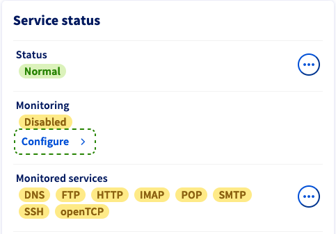
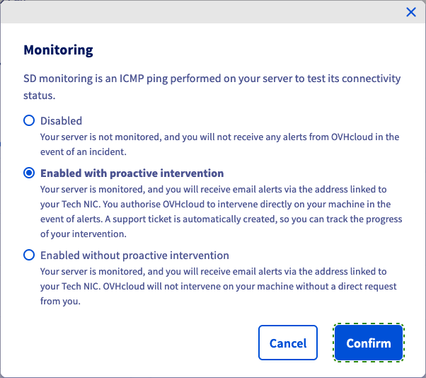

## Wprowadzenie

Usługa monitoringu pozwala na monitorowanie stanu maszyny i na automatyczne poinformowanie o problemie technika w centrum danych.

Wszystkie serwery klientów OVHcloud oraz cała sieć są monitorowane przez zespoły techniczne OVHcloud w godzinach 24/24 i 7/7.

OVHcloud rozpoczyna interwencję, gdy tylko pojawi się alert (brak odpowiedzi na pingi), aby ograniczyć do minimum czas niedostępności serwerów i sieci.

Aby wdrożyć restrykcyjny firewall, zwłaszcza w zakresie ICMP i nadal korzystać z monitoringu OVHcloud, należy zezwolić na poniższe adresy IP.

## Wymagania początkowe

- Produkt OVHcloud, na którym zainstalowałeś Firewall.
- Dostęp do reguł firewalla

<!-- CP-NAV-START:baremetal-dedicated-servers -->
---

### Dostęp do Panelu klienta OVHcloud

- **Link bezpośredni:** [Serwery dedykowane](/links/control-panel/baremetal-dedicated-servers)
- **Ścieżka nawigacji:** `Bare Metal Cloud`{.action} > `Serwery dedykowane`{.action} > Wybierz serwer

---
<!-- CP-NAV-END:baremetal-dedicated-servers -->

## W praktyce

### Adresy IP, które chcesz autoryzować

|Rewers|IP|Protokół|
|---|---|---|
|netmon-rbx-probe|92.222.184.0/24|icmp|
|netmon-sbg-probe|51.38.25.100/32|icmp|
|netmon-gra-probe|92.222.186.0/24|icmp|
|netmon-bhs-probe|167.114.37.0/24|icmp|
|netmon-sgp-probe|139.99.1.144/28|icmp|
|netmon-waw-probe|193.70.125.118/32|icmp|
|netmon-mum-probe|148.113.25.1/32|icmp|
|netmon-syd-probe|139.99.187.247/32|icmp|
|netmon-tor-probe|72.251.7.222/32|icmp|
|netmon-eri-probe|51.195.135.163/32|icmp|
|netmon-lim-probe|51.38.117.56/32|icmp|
|netmon-par-probe|57.130.4.212/32|icmp|
|ping.ovh.net|213.186.33.13|icmp|
|---|---|---|
||xxx.xxx.xxx.xxx.250 (z adresem IP serwera xxx.xxx.xxx.aaa)|icmp|
||xxx.xxx.xxx.xxx.251 (z adresem IP serwera xxx.xxx.xxx.aaa)|icmp + port monitorowany przez dział monitoringu|

**Komunikacja między usługą RTM a Twoim serwerem wymaga również, aby zezwolić na połączenia przychodzące i wychodzące na portach UDP 6100-6200.**

> [!primary]
>
> Jeśli Twój serwer znajduje się w Roubaix 3, pobierz najnowszy adres IP przez tcpdump:
> <pre class="highlight language-console"><code class="language-console">tcpdump host server_ip | grep ICMP</code></pre>

### Włącz lub wyłącz monitoring

Po pierwsze, zaloguj się do [Panelu klienta OVHcloud](/links/manager) i wybierz kartę `Bare Metal Cloud`{.action}. Wybierz odpowiedni serwer z rozwijanego menu `Serwery dedykowane`{.action}.

Możesz włączyć lub wyłączyć monitoring serwera dedykowanego w zakładce `Informacje ogólne`{.action}. Wariant ten znajduje się w sekcji `Status usług`.

{.thumbnail}

Kliknij przycisk `Skonfiguruj`{.action}. W oknie, które się pojawi, masz trzy opcje dotyczące zachowania inwigilacji:

- **Wyłączone**: Ta opcja wyłącza komunikaty ostrzegawcze i interwencje OVHcloud. Wybierz tę opcję, jeśli wykonasz odpowiednie operacje administracyjne na serwerze, które uniemożliwiają odpowiedź ICMP.
- **Aktywny z aktywną interwencją**: Jeśli serwer przestanie odpowiadać, otrzymasz wiadomość e-mail z alertem. Serwer zostanie zweryfikowany przez technika.
- **Aktywny bez aktywnej interwencji**: Otrzymasz e-mail z komunikatem ostrzegawczym, jeśli serwer przestanie odpowiadać. Aby rozpocząć interwencję, należy utworzyć wniosek o pomoc.

{.thumbnail}

Kliknij na `Zatwierdź`{.action}, aby zaktualizować konfigurację monitorowania.

## Sprawdź również

[Konfiguracja zapory sieciowej Network Firewall](/pages/bare_metal_cloud/dedicated_servers/firewall_network).

- [Pierwsze kroki z serwerem dedykowanym OVHcloud](/pages/bare_metal_cloud/dedicated_servers/getting-started-with-dedicated-server)
- [Jak odinstalować RTM v1 na serwerze dedykowanym](/pages/bare_metal_cloud/dedicated_servers/rtm-uninstall)
Dołącz do [grona naszych użytkowników](/links/community).
