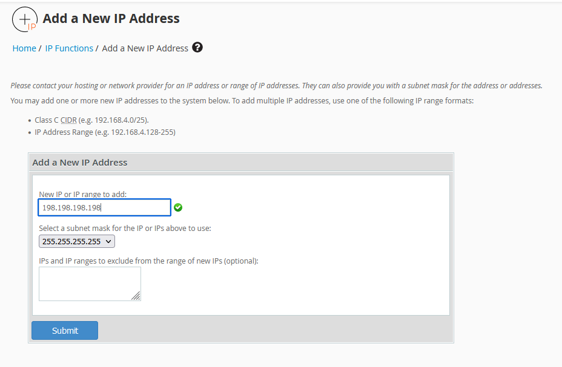
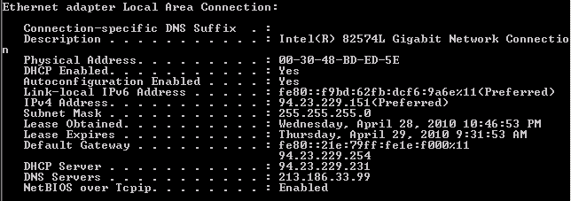
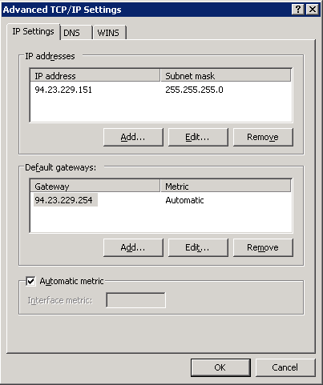
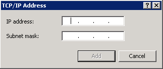
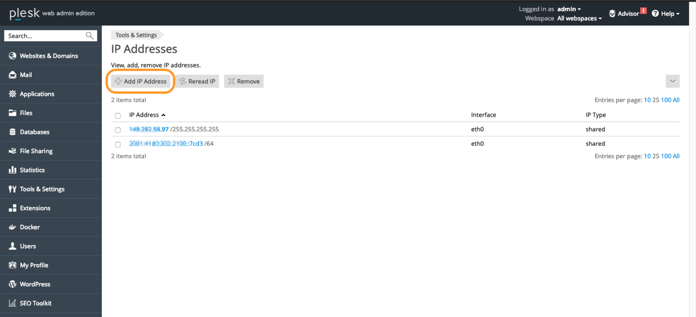
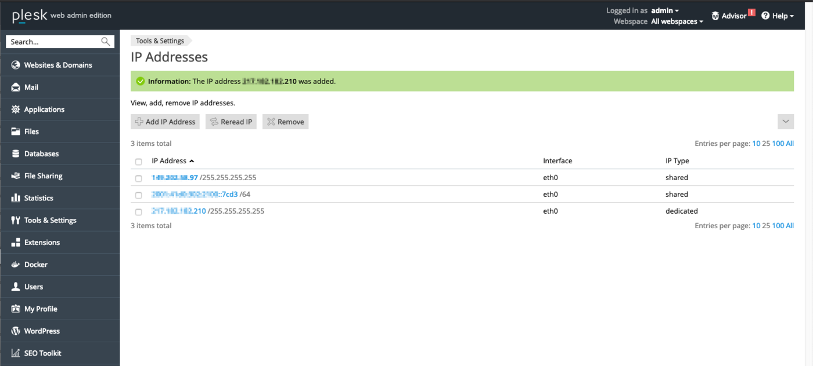

> [!primary]
>
> Since October 6th, 2022 our service "Failover IP" is named [Additional IP](https://www.ovhcloud.com/asia/network/additional-ip/). This renaming has no effect on its technical features.
>

## Objective

IP aliasing is a special network configuration for your OVHcloud dedicated servers, which allows you to associate multiple IP addresses with a single network interface.

**This guide explains how to add Additional IP addresses to your network configuration.**

> [!warning]
> OVHcloud is providing you with services for which you are responsible, with regard to their configuration and management. You are therefore responsible for ensuring they function correctly.
>
> This guide is designed to assist you in common tasks as much as possible. Nevertheless, we recommend that you contact a [specialist service provider](https://partner.ovhcloud.com/asia/directory/) if you have difficulties or doubts concerning the administration, usage or implementation of services on a server.
>

## Requirements

- A [dedicated server](https://www.ovhcloud.com/asia/bare-metal/) in your OVHcloud account
- An [Additional IP address](https://www.ovhcloud.com/asia/bare-metal/ip/) or an Additional IP block (RIPE)
- Administrative access (root) via SSH or GUI to your server
- Basic networking and administration knowledge

> [!warning]
> This feature might be unavailable or limited on servers of the [**Eco** product line](https://eco.ovhcloud.com/asia/about/).
>
> Please visit our [comparison page](https://eco.ovhcloud.com/asia/compare/) for more information.

## Instructions

The following sections contain configurations for the distributions we currently offer and the most commonly used distributions/operating systems. The first step is always to log in to your server via SSH or a GUI login session (RDP for a Windows server). The examples below presume you are logged in as a user with elevated permissions (Administrator/sudo).

> [!primary]
>
Concerning different distribution releases, please note that the proper procedure to configure your network interface as well as the file names may have been subject to change. We recommend to consult the manuals and knowledge resources of the respective OS versions if you experience any issues.
> 

**Please take note of the following terminology that will be used in code examples and instructions of the guide sections below:**

|Term|Description|Examples|
|---|---|---|
|ADDITIONAL_IP|An Additional IP address assigned to your service|169.254.10.254|
|NETWORK_INTERFACE|The name of the network interface|*eth0*, *ens3*|
|ID|ID of the IP alias, starting with *0* (depending on the number of additional IPs there are to configure)|*0*, *1*|

### Debian 10/11

#### Step 1: Create a backup

First, make a copy of the config file, so that you can revert at any time:

```sh
cp /etc/network/interfaces.d/50-cloud-init /etc/network/interfaces.d/50-cloud-init.bak
```

#### Step 2: Edit the config file

> [!primary]
>
Note that the names of the network interfaces in our examples may differ from your own. Please adjust to your appropriate interface names.
>

You can now modify the config file:

```sh
editor /etc/network/interfaces.d/50-cloud-init
```

You then need to add a secondary interface:

```bash
auto eth0:0
iface eth0:0 inet static
address ADDITIONAL_IP
netmask 255.255.255.255
```

To ensure that the secondary interface is enabled or disabled whenever the `eth0` interface is enabled or disabled, you need to add the following line to the eth0 configuration:

```bash
post-up /sbin/ifconfig eth0:0 ADDITIONAL_IP netmask 255.255.255.255 broadcast ADDITIONAL_IP
pre-down /sbin/ifconfig eth0:0 down
```

If you have two Additional IPs to configure, the `/etc/network/interfaces.d/50-cloud-init` file should look like this:

```bash
auto eth0
iface eth0 inet dhcp

auto eth0:0
iface eth0:0 inet static
address ADDITIONAL_IP1
netmask 255.255.255.255

auto eth0:1
iface eth0:1 inet static
address ADDITIONAL_IP2
netmask 255.255.255.255
```
Or like this:

```bash
auto eth0
iface eth0 inet dhcp

# IP 1
post-up /sbin/ifconfig eth0:0 ADDITIONAL_IP1 netmask 255.255.255.255 broadcast ADDITIONAL_IP1
pre-down /sbin/ifconfig eth0:0 down

# IP 2
post-up /sbin/ifconfig eth0:1 ADDITIONAL_IP2 netmask 255.255.255.255 broadcast ADDITIONAL_IP2
pre-down /sbin/ifconfig eth0:1 down
```

#### Step 3: Restart the interface

You now need to restart your interface:

```sh
/etc/init.d/networking restart
```

### Fedora 37 and following

Fedora now uses keyfiles. NetworkManager previously stored network profiles in ifcfg format in this directory: `/etc/sysconfig/network-scripts/`. However, the ifcfg format is now deprecated. By default, NetworkManager no longer creates new profiles in this format. The configuration file is now found in `/etc/NetworkManager/system-connections/`.

#### Step 1: Create a backup

> [!primary]
> 
> Note that the name of the network file in our example may differ from your own. Please adjust to your appropriate name.
>

First, make a copy of the config file, so that you can revert at any time:

```sh
cp -r /etc/NetworkManager/system-connections/cloud-init-eno1.nmconnection /etc/NetworkManager/system-connections/cloud-init-eno1.nmconnection.bak
```

#### Step 2: Edit the config file

To obtain the name of your network interface so you can edit the proper network file, you can run one of the following command: 

```sh
ip a
```

or 

```sh
nmcli connection show
```

Do not modify the existing lines in the configuration file, add your Additional IP to the config file as follows, replacing `ADDITIONAL_IP/32`.

```sh
editor /etc/NetworkManager/system-connections/cloud-init-eno1.nmconnection
```

```sh
[ipv4]
method=auto
may-fail=false
address1=ADDITIONAL_IP/32
```

If you have two Additional IPs to configure, the configuration file should look like this:

```sh
[connection]
id=cloud-init eno1
uuid=xxxxxxx-xxxx-xxxe-ba9c-6f62d69da711
type=ethernet

[user]
org.freedesktop.NetworkManager.origin=cloud-init

[ethernet]
mac-address=MA:CA:DD:RE:SS:XX

[ipv4]
method=auto
may-fail=false
address1=ADDITIONAL_IP1/32
address2=ADDITIONAL_IP2/32
```

#### Step 3: Restart the interface

You now need to restart your interface:

```sh
systemctl restart NetworkManager
```

### Debian 12, Ubuntu 20.04 and following

The configuration file is called "50-cloud-init.yaml" and is located in `/etc/netplan`. 

The best practice approach is to create separate configuration files for Additional IPs and IPv6 addresses. This way, you easily revert the changes in case of an error.

#### Step 1: Determine the interface

```sh
ip a
```

Note the name of the interface (the one on which your server's main IP address is configured) and its MAC address.

#### Step 2: Create the configuration file

Next, create a configuration file with a .yaml extension to configure your additional IPs. As an example, our file is named "51-cloud-init.yaml".

```sh
editor /etc/netplan/51-cloud-init.yaml
```

Next, edit the file with the content below, replacing `INTERFACE_NAME`, `MAC_ADDRESS` and `ADDITIONAL_IP` with your own values:

```
network:
    version: 2
    ethernets:
        INTERFACE_NAME:
            dhcp4: true
            match:
                macaddress: MAC_ADDRESS
            set-name: INTERFACE_NAME
            addresses:
            - ADDITIONAL_IP/32
```

If you have two Additional IPs to configure, the configuration file should look like this:

```
network:
    version: 2
    ethernets:
        INTERFACE_NAME:
            dhcp4: true
            match:
                macaddress: MAC_ADDRESS
            set-name: INTERFACE_NAME
            addresses:
            - ADDITIONAL_IP1/32
            - ADDITIONAL_IP2/32
```

Save and close the file. You can test the configuration with the following command:

```sh
netplan try
```

#### Step 3: Apply the change

Next, run the following commands to apply the configuration:

```sh
netplan apply
```

### CentOS 7, AlmaLinux (8 & 9), Rocky Linux (8 & 9)

The main configuration file is located in `/etc/sysconfig/network-scripts/`. In this example it is called "ifcfg-eth0". Before making changes, verify the actual file name in this folder. 

For each additional IP to be configured, we create a configuration file named "ifcfg-NETWORK_INTERFACE:ID" (replacing NETWORK_INTERFACE with the physical interface and ID with the virtual interface number).

For the virtual interface number, we simply add a consecutive number to the interface name, starting with a value of 0 for the first alias. For example, for network a interface named "eth0" the first alias is "eth0:0", the second alias is "eth0:1", etc...

#### Step 1: Determine the interface

```sh
ifconfig
```

Note the name of the interface (the one on which your server's main IP address is configured).

#### Step 2: Create the config file

First, create the configuration file 

```sh
nano /etc/sysconfig/network-scripts/ifcfg-NETWORK_INTERFACE:ID
```

Next, edit the file with the content below, replacing `NETWORK_INTERFACE:ID`, and `ADDITIONAL_IP` with your own values:

```bash
DEVICE="NETWORK_INTERFACE:ID"
ONBOOT="yes"
BOOTPROTO="none" # For CentOS use "static"
IPADDR="ADDITIONAL_IP"
NETMASK="255.255.255.255"
BROADCAST="ADDITIONAL_IP"
```

Configuration example

```bash
DEVICE="eth0:0"
ONBOOT="yes"
BOOTPROTO="none" # For CentOS use "static"
IPADDR="169.254.10.254"
NETMASK="255.255.255.255"
BROADCAST="169.254.10.254"
```


#### Step 3: Start the alias interface

You now need to start your alias interface:

```sh
ifup eth0:0
```

#### For AlmaLinux and Rocky Linux

You need to restart your interface:

```sh
systemctl restart NetworkManager
```

### cPanel (on CentOS 7)

#### Step 1: Access the WHM IP management section

In the WHM control panel, click on `IP Functions`{.action} and select `Add a New IP Address`{.action} in the left-hand sidebar.

{.thumbnail}

#### Step 2: Add the Additional IP information

Enter your Additional IP in the form `xxx.xxx.xxx.xxx` into the field “New IP or IP range to add”. 

Select `255.255.255.255` as your subnet mask, then click on `Submit`{.action}.

{.thumbnail}

> [!warning]
>
> Please note that if you have more than one IP to configure on the same block and you add them all at once, the WHM system will force you to use the subnet mask `255.255.255.0`. We do not recommend using this configuration. Instead, you need to add each IP individually in order to use the proper subnet mask `255.255.255.255`.
> 

#### Step 3: Check the current IP configuration

Back in the section `IP Functions`{.action}, click on `Show or Delete Current IP Addresses`{.action} to verify that the Additional IP address was added correctly.

{.thumbnail}

### Windows Servers

Windows servers are often DHCP-enabled in the network configuration. If you have already set up an Additional IP or switched your configuration to a fixed IP, go directly to the next step.

Otherwise, you need to first switch from a network-level DHCP configuration to a fixed IP configuration.

Open the command prompt `cmd`{.action} or `powershell`{.action}, then type the following command:

```sh
ipconfig /all
```

This will return a result similar to the following example:

{.thumbnail}

Identify and write down your IPv4, subnet mask, default gateway and the name of the network interface controller (network adapter).

In our example, the server IP is **94.23.229.151**.

You can perform the next steps via either a command-line interface or the graphical user interface.

#### Via a command-line interface (recommended)

In the commands below, you need to replace:

|Command|Value|
|---|---|
|NETWORK_ADAPTER| Name of the network adapter (in our example: Local Area Connection)|
|IP_ADDRESS| Server IP address (in our example: 94.23.229.151)|
|SUBNET_MASK| Subnet mask (in our example: 255.255.255.0)|
|GATEWAY| Default gateway (in our example: 94.23.229.254)|
|ADDITIONAL_IP| Address of Additional IP you want to add|

> [!warning]
>
> Be careful – the server will no longer be accessible if you enter incorrect information. You will then have to make the corrections in Winrescue mode or via the KVM.
> 

In the command prompt:

1. Switch to a fixed IP
```sh
netsh interface ipv4 set address name="NETWORK_ADAPTER" static IP_ADDRESS SUBNET_MASK GATEWAY
```
2. Set the DNS server
```sh
netsh interface ipv4 set dns name="NETWORK_ADAPTER" static 213.186.33.99
```
3. Add an Additional IP
```sh
netsh interface ipv4 add address "NETWORK_ADAPTER" ADDITIONAL_IP 255.255.255.255
```

Your Additional IP is now functional.

#### Via the graphical user interface

1. Go to `Start`{.action}> `Control Panel`{.action}>` Network and Internet`{.action}> `Network and Sharing Centre`{.action}> `Change Adapter Settings `{.action}(in the left-hand menu).
2. Right-click on `Local Area Connection`{.action}.
3. Click on `Properties`{.action}.
4. Select `Internet Protocol Version 4 (TCP/IPv4)`{.action}, then click on `Properties`{.action}.
5. Click on `Use the following IP address`{.action} and type in your server’s primary IP, subnet mask and default gateway information obtained by using the `ipconfig`{.action} command above. In the "Preferred DNS Server" box, type 213.186.33.99.

{.thumbnail}

> [!warning]
>
> Be careful – the server will no longer be accessible if you enter incorrect information. You will then have to make the corrections in Winrescue mode or via the KVM.
> 

Then click on `Advanced`{.action} (still in the `TCP/IP Settings`{.action}).

{.thumbnail}

In the `IP Address`{.action} section, click `Add`{.action}:

{.thumbnail}

Type in your Additional IP and the subnet mask **255.255.255.255**.

{.thumbnail}

Click on `Add`{.action}.

Your Additional IP is now functional.

### Plesk

#### Step 1: Access the Plesk IP management section

In the Plesk control panel, choose `Tools & Settings`{.action} from the left-hand sidebar.

{.thumbnail}

Click on `IP Addresses`{.action} under **Tools & Resources**.

#### Step 2: Add the Additional IP information

In this section, click on the button `Add IP Address`{.action}.

{.thumbnail}

Enter your Additional IP in the form `xxx.xxx.xxx.xxx/32` into the field "IP address and subnet mask", then click on `OK`{.action}.

{.thumbnail}

#### Step 3: Check the current IP configuration

Back in the section "IP Addresses", verify that the Additional IP address was added correctly.

{.thumbnail}


### Troubleshooting

First, restart your server from the command line or its GUI. If you are still unable to establish a connection from the public network to your alias IP and suspect a network problem, you need to reboot the server in [rescue mode](/pages/bare_metal_cloud/dedicated_servers/rescue_mode). Then you can set up the Additional IP address directly on the server.

Once you are connected to your server via SSH, enter the following command:

```bash
ifconfig eth0:0 ADDITIONAL_IP netmask 255.255.255.255 broadcast ADDITIONAL_IP up
```

To test the connection, simply ping your Additional IP from the outside. If it responds in rescue mode, that probably means that there is a configuration error. If, however, the IP is still not working, please inform our support teams by creating a support request in your [OVHcloud Control Panel](https://ca.ovh.com/auth/?action=gotomanager&from=https://www.ovh.com/asia/&ovhSubsidiary=asia) for further investigations.
 
## Go further

[Configuring a network bridge](/pages/bare_metal_cloud/dedicated_servers/network_bridging)

Join our community of users on <https://community.ovh.com/en/>.