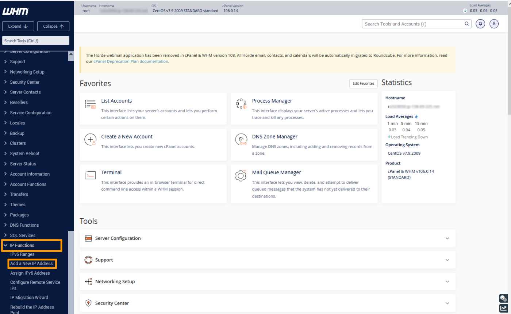
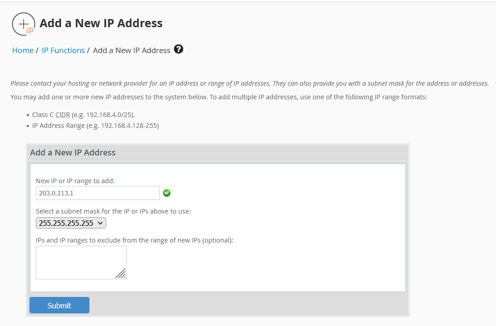
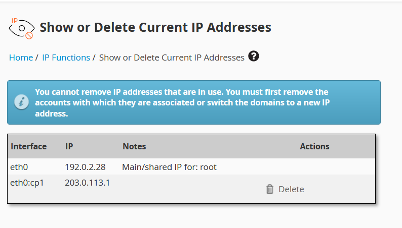
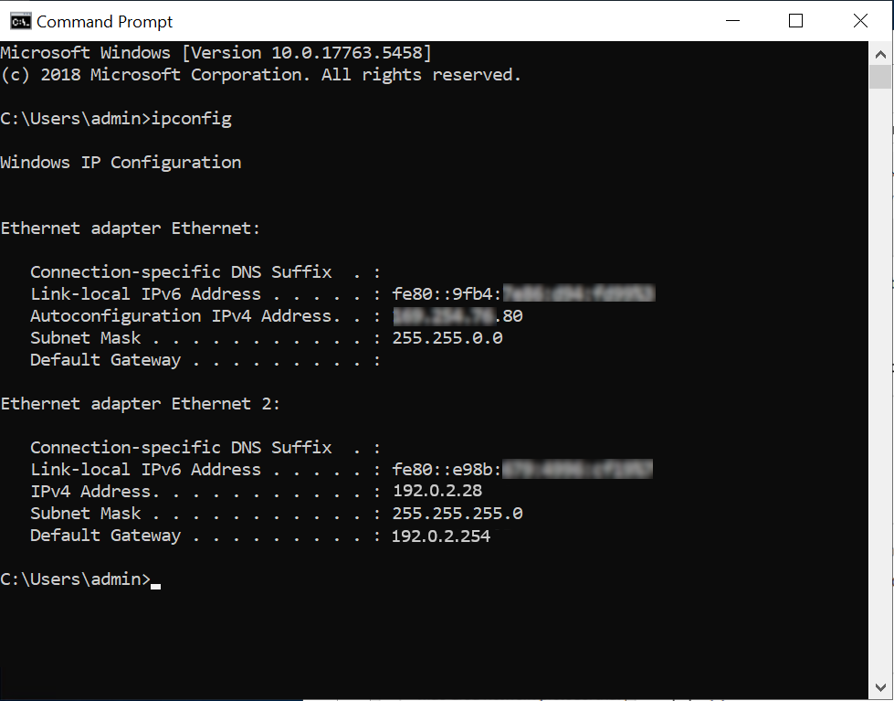
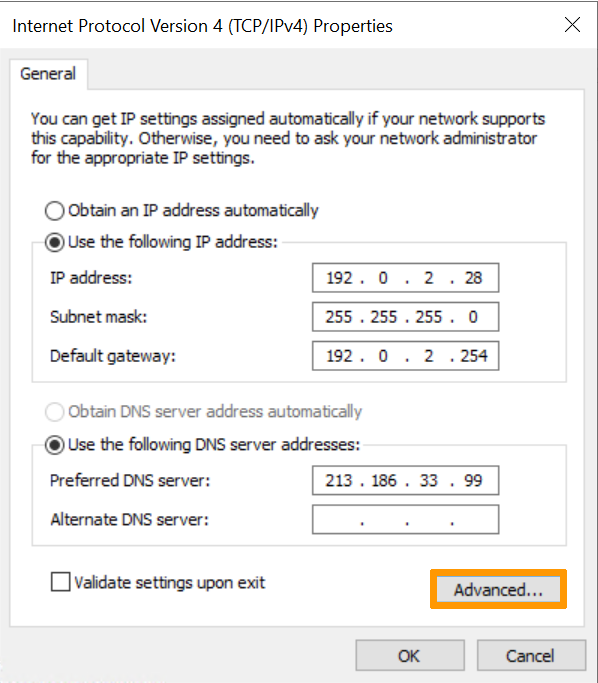
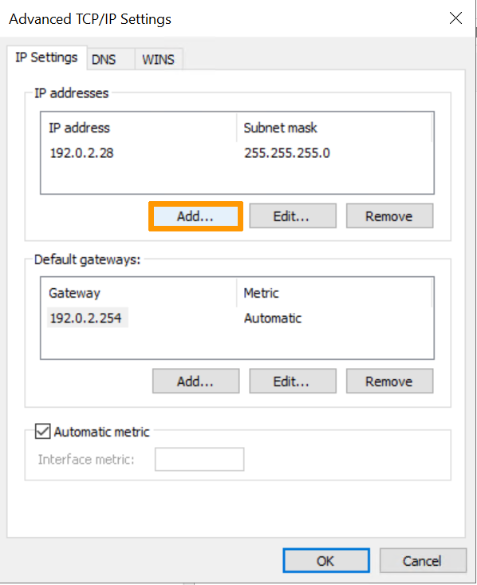
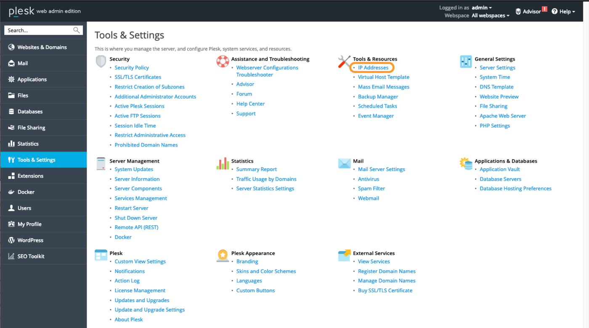
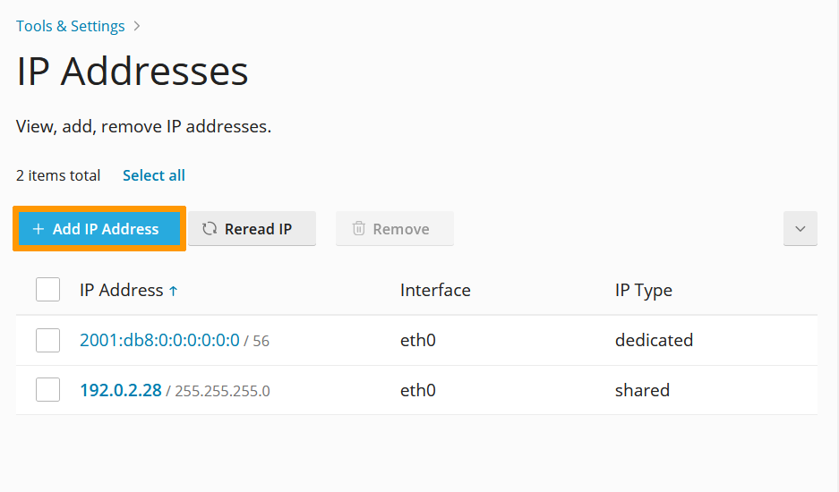
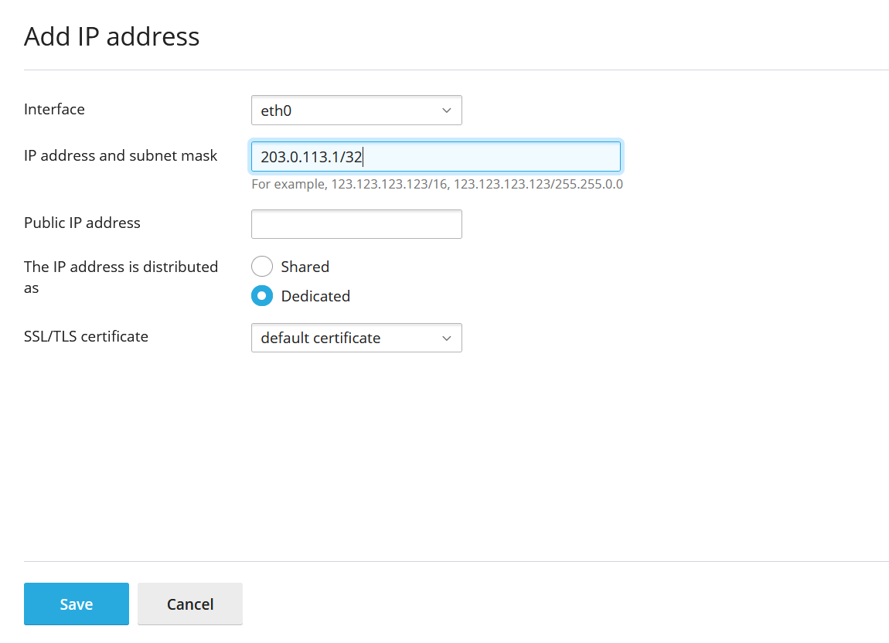
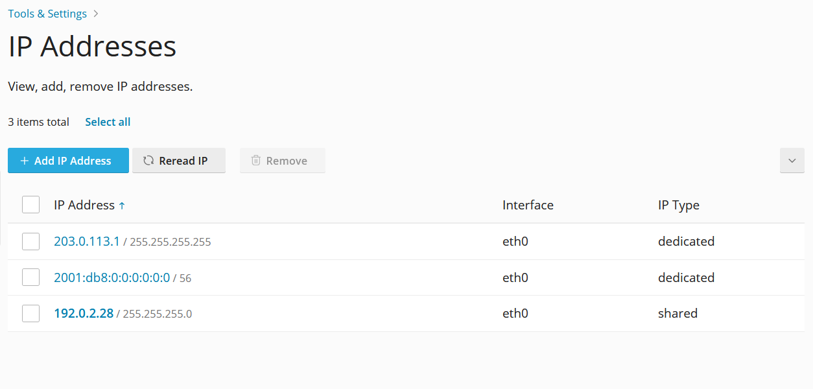

> [!primary]
>
> Since October 6th, 2022 our service "Failover IP" is named [Additional IP](/links/network/additional-ip). This renaming has no effect on its technical features.
>

## Objective

IP aliasing is a special network configuration for your OVHcloud dedicated servers, which allows you to associate multiple IP addresses with a single network interface.

**This guide explains how to add Additional IP addresses to your network configuration.**

> [!warning]
> OVHcloud is providing you with services for which you are responsible, with regard to their configuration and management. You are therefore responsible for ensuring they function correctly.
>
> This guide is designed to assist you in common tasks as much as possible. Nevertheless, we recommend that you contact a [specialist service provider](/links/partner) if you have difficulties or doubts concerning the administration, usage or implementation of services on a server.
>

## Requirements

- A [dedicated server](/links/bare-metal/bare-metal) in your OVHcloud account
- An [Additional IP address](/links/network/additional-ip) or an Additional IP block (RIPE or ARIN)
- Access via SSH or remote desktop connection for Windows
- Basic networking and administration knowledge

> [!warning]
> This feature might be unavailable or limited on servers of the [**Eco** product line](https://eco.ovhcloud.com/en-ca/about/).
>
> Please visit our [comparison page](https://eco.ovhcloud.com/en-ca/compare/) for more information.

## Instructions

The following sections contain configurations for the distributions we currently offer and the most commonly used distributions/operating systems. The first step is always to log in to your server via SSH or a GUI login session (RDP for a Windows server). 

> [!primary]
>
Concerning different distribution releases, please note that the proper procedure to configure your network interface as well as the file names may have been subject to change. We recommend to consult the manuals and knowledge resources of the respective OS versions if you experience any issues.
> 

**Please take note of the following terminology that will be used in code examples and instructions of the guide sections below:**

|Term|Description|Examples|
|---|---|---|
|ADDITIONAL_IP|An Additional IP address assigned to your service|203.0.113.1|
|NETWORK_INTERFACE|The name of the network interface|*eth0*, *ens3*|
|ID|ID of the IP alias, starting with *0* (depending on the number of additional IPs there are to configure)|*0*, *1*|

In the examples below, we will use the `nano` text editor. With some operating systems, you will need to install it first before using it. If this is the case, you will be prompted to do so. You can, of course, use the text editor of your choice.

### Debian 10/11

By default, the configuration files are located in `/etc/network/interfaces.d/`. We recommend that you start by backing up the relevant configuration file. 

#### Step 1: Create a backup

In our example, our file is called `50-cloud-init`, so we make a copy of the `50-cloud-init` file using the following command:

```bash
sudo cp /etc/network/interfaces.d/50-cloud-init /etc/network/interfaces.d/50-cloud-init.bak
```

In case of a mistake, you will be able to revert the changes, using the commands below:

```bash
sudo rm -f /etc/network/interfaces.d/50-cloud-init
sudo cp /etc/network/interfaces.d/50-cloud-init.bak /etc/network/interfaces.d/50-cloud-init
```

#### Step 2: Edit the configuration file

> [!primary]
>
Note that the names of the network interfaces in our examples may differ from your own. Please adjust to your appropriate interface names.
>

You can now modify the configuration file:

```bash
sudo nano /etc/network/interfaces.d/50-cloud-init
```

Next, you need to add a virtual interface or ethernet alias. In our example, our interface is called `eth0`, so our alias is `eth0:0`. Do this for each additional IP you wish to configure.

Do not modify the existing lines in the configuration file, simply add your Additional IP to the file as follows, replacing `ADDITIONAL_IP/32` as well as the virtual interface (if your server is not using **eth0:0**) wih your own values:

```console
auto eth0:0
iface eth0:0 inet static
address ADDITIONAL_IP
netmask 255.255.255.255
```

Alternatively, you can configure your Additional IP by adding the following lines in the configuration file:

```console
post-up /sbin/ifconfig eth0:0 ADDITIONAL_IP netmask 255.255.255.255 broadcast ADDITIONAL_IP
pre-down /sbin/ifconfig eth0:0 down
```

With the configuration above, the virtual interface is enabled or disabled whenever the `eth0` interface is enabled or disabled.

If you have two Additional IPs to configure, the `/etc/network/interfaces.d/50-cloud-init` file should look like this:

```console
auto eth0
iface eth0 inet dhcp

auto eth0:0
iface eth0:0 inet static
address ADDITIONAL_IP1
netmask 255.255.255.255

auto eth0:1
iface eth0:1 inet static
address ADDITIONAL_IP2
netmask 255.255.255.255
```

Or like this:

```console
auto eth0
iface eth0 inet dhcp

# IP 1
post-up /sbin/ifconfig eth0:0 ADDITIONAL_IP1 netmask 255.255.255.255 broadcast ADDITIONAL_IP1
pre-down /sbin/ifconfig eth0:0 down

# IP 2
post-up /sbin/ifconfig eth0:1 ADDITIONAL_IP2 netmask 255.255.255.255 broadcast ADDITIONAL_IP2
pre-down /sbin/ifconfig eth0:1 down
```

Configuration example:

```console
auto eth0
iface eth0 inet dhcp

auto eth0:0
iface eth0:0 inet static
address 203.0.113.1
netmask 255.255.255.255
```

Or :

```console
auto eth0
iface eth0 inet dhcp

# IP 1
post-up /sbin/ifconfig eth0:0 203.0.113.1 netmask 255.255.255.255 broadcast 203.0.113.1
pre-down /sbin/ifconfig eth0:0 down
```

#### Step 3: Restart the interface

To restart the interface, use the following command:

```bash
sudo /etc/init.d/networking restart
```

### Fedora 37 and following

Fedora now uses keyfiles. NetworkManager previously stored network profiles in ifcfg format in this directory: `/etc/sysconfig/network-scripts/`. However, the ifcfg format is now deprecated. By default, NetworkManager no longer creates new profiles in this format. The configuration file is now found in `/etc/NetworkManager/system-connections/`.

#### Step 1: Create a backup

> [!primary]
> 
> Note that the name of the network file in our example may differ from your own. Please adjust to your appropriate name.
>

First, make a copy of the configuration file, so that you can revert at any time. In our example, our configuration file is called `cloud-init-eno1.nmconnection`.

```bash
sudo cp -r /etc/NetworkManager/system-connections/cloud-init-eno1.nmconnection /etc/NetworkManager/system-connections/cloud-init-eno1.nmconnection.bak
```

#### Step 2: Edit the config file

> [!primary]
> Please note that the name of the network file in our example may differ from yours. Please adapt the commands to your file name.
> 

To obtain the name of your network interface in order to edit the appropriate network file, you can run one of the following commands:

```bash
ip a
```

```bash
nmcli connection show
```

Do not modify the existing lines in the configuration file, add your Additional IP to the file as follows, replacing `ADDITIONAL_IP/32` wih your own values:

```bash
sudo nano /etc/NetworkManager/system-connections/cloud-init-eno1.nmconnection
```

```console
[ipv4]
method=auto
may-fail=false
address1=ADDITIONAL_IP/32
```

If you have two Additional IPs to configure, the configuration should look like this:

```console
[ipv4]
method=auto
may-fail=false
address1=ADDITIONAL_IP1/32
address2=ADDITIONAL_IP2/32
```

Configuration example:

```console
[ipv4]
method=auto
may-fail=false
address1=203.0.113.1/32
```

#### Step 3: Restart the interface

You now need to restart your interface:

```bash
sudo systemctl restart NetworkManager
```

### Debian 12, Ubuntu 20.04 and following

By default, the configuration files are located in the `/etc/netplan` directory. 

The best practice approach is to create a separate configuration file to set up Additional IP addresses. This way, you can easily revert the changes in case of an error.

#### Step 1: Determine the interface

```bash
ip a
```

Note the name of the interface (the one on which your server's main IP address is configured).

#### Step 2: Create and edit the configuration file

Next, create a configuration file with a `.yaml` extension. In our example, our file is called `51-cloud-init.yaml`.

```bash
sudo nano /etc/netplan/51-cloud-init.yaml
```

Edit the file with the content below, replacing `INTERFACE_NAME` and `ADDITIONAL_IP` with your own values:

```yaml
network:
  version: 2
  renderer: networkd
  ethernets:
    INTERFACE_NAME:
      dhcp4: true
      addresses:
        - ADDITIONAL_IP/32
```

If you have two Additional IPs to configure, the configuration file should look like this:

```yaml
network:
  version: 2
  renderer: networkd
  ethernets:
    INTERFACE_NAME:
      dhcp4: true
      addresses:
        - ADDITIONAL_IP1/32
        - ADDITIONAL_IP2/32
```

> [!warning]
> It is important to respect the alignment of each element in this file as represented in the example above. Do not use the tab key to create your spacing. Only the space key is needed.
>

Configuration example:

```yaml
network:
  version: 2
  renderer: networkd
  ethernets:
    eth0:
      dhcp4: true
      addresses:
        - 203.0.113.1/32
```

Save and close the file. You can test the configuration with the following command:

```bash
sudo netplan try
```

#### Step 3: Apply the change

If it is correct, apply it using the following command:

```bash
sudo netplan apply
```

> [!primary]
> When using the `netplan try` command, it is possible that the system returns a warning message such as `Permissions for /etc/netplan/xx-cloud-init.yaml are too open. Netplan configuration should NOT be accessible by others`. This simply means that the file does not have restrictive permissions. This does not affect the configuration of your Additional IP. For more information about file permissions, consult the [official documentation of ubuntu](https://help.ubuntu.com/community/FilePermissions){.external}.
>

### CentOS 7, AlmaLinux (8 & 9), Rocky Linux (8 & 9)

The main configuration file is located in `/etc/sysconfig/network-scripts/`. In this example it is called `ifcfg-eth0`. Before making changes, verify the actual file name in this folder.

For each Additional IP to be configured, we create a seperate configuration file with the following parameters: `ifcfg-NETWORK_INTERFACE:ID`. Where `NETWORK_INTERFACE` is the physical interface and `ID` is the virtual network interface or ethernet alias starting with a value of 0. For example, for our interface named `eth0` the first alias is `eth0:0`, the second alias is `eth0:1`, etc...

#### Step 1: Determine the interface

```bash
ip a
```

Note the name of the interface (the one on which your server's main IP address is configured).

#### Step 2: Create the configuration file

First, create the configuration file. Replace `NETWORK_INTERFACE:ID` with your own values.

```bash
sudo nano /etc/sysconfig/network-scripts/ifcfg-NETWORK_INTERFACE:ID
```

Next, edit the file with the content below, replacing `NETWORK_INTERFACE:ID`, and `ADDITIONAL_IP` with your own values:

```console
DEVICE=NETWORK_INTERFACE:ID
ONBOOT=yes
BOOTPROTO=none # For CentOS use "static"
IPADDR=ADDITIONAL_IP
NETMASK=255.255.255.255
BROADCAST=ADDITIONAL_IP
```

Configuration example:

```console
DEVICE=eth0:0
ONBOOT=yes
BOOTPROTO=none # For CentOS use "static"
IPADDR=203.0.113.1
NETMASK=255.255.255.255
BROADCAST=203.0.113.1
```

#### Step 3: Restart the interface

Next, restart your alias interface, replace `eth0:0` with your own values:

```bash
ifup eth0:0
```

#### For AlmaLinux and Rocky Linux

```bash
sudo systemctl restart NetworkManager
```

### cPanel

#### Step 1: Access the WHM IP management section

In the WHM control panel, click on `IP Functions`{.action} and select `Add a New IP Address`{.action} in the left-hand sidebar.

{.thumbnail}

#### Step 2: Add the Additional IP information

Enter your Additional IP in the form `xxx.xxx.xxx.xxx` into the field “New IP or IP range to add”. 

Select `255.255.255.255` as your subnet mask, then click on `Submit`{.action}.

{.thumbnail}

> [!warning]
>
> Please note that if you have more than one IP to configure on the same block and you add them all at once, the WHM system will force you to use the subnet mask `255.255.255.0`. We do not recommend using this configuration. Instead, you need to add each IP individually in order to use the proper subnet mask `255.255.255.255`.
> 

#### Step 3: Check the current IP configuration

Back in the section `IP Functions`{.action}, click on `Show or Delete Current IP Addresses`{.action} to verify that the Additional IP address was added correctly.

{.thumbnail}

### Windows Servers

Windows servers are often DHCP-enabled in the network configuration. If you have already set up an Additional IP or switched your configuration to a fixed IP, go directly to the next step.

Otherwise, you need to first switch from a network-level DHCP configuration to a fixed IP configuration.

Open the command prompt `cmd`{.action} or `powershell`{.action}, then type the following command:

```powershell
ipconfig
```

This will return a result similar to the following example:

{.thumbnail}

Identify and write down your IPv4, subnet mask, default gateway and the name of the network interface controller (network adapter).

In our example, the server IP is **192.0.2.28**.

You can perform the next steps via either a command-line interface or the graphical user interface.

#### Via a command-line interface (recommended)

In the commands below, you need to replace:

|Command|Value|
|---|---|
|NETWORK_ADAPTER| Name of the network adapter (in our example: Ethernet 2)|
|IP_ADDRESS| Server IP address (in our example: 192.0.2.28)|
|SUBNET_MASK| Subnet mask (in our example: 255.255.255.0)|
|GATEWAY| Default gateway (in our example: 192.0.2.254)|
|ADDITIONAL_IP| Address of Additional IP you want to add (in our example 203.0.113.1)|

> [!warning]
>
> Be careful – the server will no longer be accessible if you enter incorrect information. You will then have to make the corrections in [Winrescue mode](/pages/bare_metal_cloud/dedicated_servers/rescue_mode#windows) or via the [IPMI](/pages/bare_metal_cloud/dedicated_servers/using_ipmi_on_dedicated_servers).
> 

In the command prompt:

1\. Switch to a fixed IP

```powershell
netsh interface ipv4 set address name="NETWORK_ADAPTER" static IP_ADDRESS SUBNET_MASK GATEWAY
```

2\. Set the DNS server

```powershell
netsh interface ipv4 set dns name="NETWORK_ADAPTER" static 213.186.33.99
```

3\. Add an Additional IP

```powershell
netsh interface ipv4 add address "NETWORK_ADAPTER" ADDITIONAL_IP 255.255.255.255
```

Your Additional IP is now functional.

#### Via the graphical user interface

1. Go to `Start`{.action}> `Control Panel`{.action}>` Network and Internet`{.action}> `Network and Sharing Centre`{.action}> `Change Adapter Settings `{.action}(in the left-hand menu).
2. Right-click on your network connection, in our example `Ethernet 2`{.action}.
3. Click on `Properties`{.action}.
4. Select `Internet Protocol Version 4 (TCP/IPv4)`{.action}, then click on `Properties`{.action}.
5. Click on `Use the following IP address`{.action} and type in your server’s primary IP, subnet mask and default gateway information obtained by using the `ipconfig`{.action} command above. In the "Preferred DNS Server" box, type 213.186.33.99.

{.thumbnail}

> [!warning]
>
> Be careful – the server will no longer be accessible if you enter incorrect information. You will then have to make the corrections in [Winrescue mode](/pages/bare_metal_cloud/dedicated_servers/rescue_mode#windows) or via the [IPMI](/pages/bare_metal_cloud/dedicated_servers/using_ipmi_on_dedicated_servers).
> 

Then click on `Advanced`{.action} (still in the `TCP/IP Settings`{.action}).

{.thumbnail}

In the `IP Address`{.action} section, click `Add`{.action}:

{.thumbnail}

Type in your Additional IP and the subnet mask **255.255.255.255**. Then click on `Add`{.action}

{.thumbnail}


Click on `OK`{.action} to apply your configuration.

Your Additional IP is now functional, you can verify the configuration with the following command:

```powershell
ipconfig
```

This will return a result similar to the following example:

{.thumbnail}

### Plesk

#### Step 1: Access the Plesk IP management section

In the Plesk control panel, choose `Tools & Settings`{.action} from the left-hand sidebar.

{.thumbnail}

Click on `IP Addresses`{.action} under **Tools & Resources**.

#### Step 2: Add the Additional IP information

In this section, click on the button `Add IP Address`{.action}.

{.thumbnail}

Enter your Additional IP in the form `xxx.xxx.xxx.xxx/32` into the field "IP address and subnet mask", then click on `OK`{.action}.

{.thumbnail}

#### Step 3: Check the current IP configuration

Back in the section "IP Addresses", verify that the Additional IP address was added correctly.

{.thumbnail}

### Troubleshooting

In some cases, you need to reboot your server if restarting the interface does not work. Restart your server from the command line or its GUI. If you are still unable to establish a connection from the public network to your Additional IP and suspect a network problem, you need to reboot the server in [rescue mode](/pages/bare_metal_cloud/dedicated_servers/rescue_mode). Then you can set up the Additional IP address directly on the server.

Once you are connected to your server via SSH, enter the following command:

```bash
ifconfig eth0:0 ADDITIONAL_IP netmask 255.255.255.255 broadcast ADDITIONAL_IP up
```

To test the connection, simply ping your Additional IP from the outside. If it responds in rescue mode, that probably means that there is a configuration error. If, however, the IP is still not working, please open a ticket with the support team via the [OVHcloud Help Center](https://help.ovhcloud.com/csm?id=csm_get_help){.external} with the following information:

It is necessary to provide:

- The operating system name and version you are using on your server.
- The name and directory of the network configuration file.
- The content of that file.

 
## Go further

[Configuring a network bridge](/pages/bare_metal_cloud/dedicated_servers/network_bridging)

Join our [community of users](/links/community).