> [!primary]
> Questa traduzione è stata generata automaticamente dal nostro partner SYSTRAN. I contenuti potrebbero presentare imprecisioni, ad esempio la nomenclatura dei pulsanti o alcuni dettagli tecnici. In caso di dubbi consigliamo di fare riferimento alla versione inglese o francese della guida. Per aiutarci a migliorare questa traduzione, utilizza il pulsante "Contribuisci" di questa pagina.
>

> [!primary]
>
> Dal 6 ottobre 2022, la nostra soluzione "Failover IP" si chiama [Additional IP](https://www.ovhcloud.com/it/network/additional-ip/). Questo non ha alcun impatto sulla sua funzionalità.
>

## Obiettivo

L'alias IP (o IP aliasing) è un tipo di configurazione del tuo server dedicato che permette di associare più indirizzi IP a un'interfaccia di rete. 

**Questa guida ti mostra la procedura da seguire per effettuare l’operazione.**

## Prerequisiti

- Disporre di un server dedicato [server dedicati](https://www.ovhcloud.com/it/bare-metal/){.external}
- Disporre di uno o più [Additional IP](https://www.ovhcloud.com/it/bare-metal/ip/){.external}
- Avere accesso amministrativo (sudo) al server tramite SSH o GUI.

> [!warning]
> Questa funzionalità può non essere disponibile o limitata sui [server dedicati **Eco**](https://eco.ovhcloud.com/it/about/).
>
> Per maggiori informazioni, consulta la nostra [a confronto](https://eco.ovhcloud.com/it/compare/).

## Procedura

Nelle sezioni seguenti vengono illustrate le configurazioni delle distribuzioni attualmente disponibili e le distribuzioni/sistemi operativi più comunemente utilizzati. Il primo step consiste sempre nel connetterti al tuo server in SSH o tramite una sessione di connessione GUI (RDP per un server Windows).

**Nota la seguente terminologia che verrà utilizzata negli esempi di codice e nelle istruzioni riportate nelle sezioni della guida:**

|Termine|Descrizione|Esempi|
|---|---|---|
|ADDITIONAL_IP|Indirizzo IP aggiuntivo assegnato al servizio|169.254.10.254|
|NETWORK_INTERFACE|Nome interfaccia di rete|*eth0*, *ens3*|
|ID|ID dell'alias IP, che inizia per *0* (a seconda del numero di IP aggiuntivi da configurare)|*0*, *1*|

Negli esempi che seguono, utilizzeremo l’editor di testo `nano`. Con alcuni sistemi operativi, sarà necessario installarlo prima di utilizzarlo. In tal caso, verrà richiesto di farlo. È ovviamente possibile utilizzare qualsiasi editor di testo.

### Debian 10/11

#### Step 1: crea un backup

Nel nostro esempio, il nostro file si chiama `50-cloud-init`, quindi copiamo il file `50-cloud-init` utilizzando il seguente comando:

```sh
sudo cp /etc/network/interfaces.d/50-cloud-init /etc/network/interfaces.d/50-cloud-init.bak
```

In caso di errore, è possibile annullare l’operazione eseguendo questi comandi:

```sh
sudo rm -f /etc/network/interfaces.d/50-cloud-init
sudo cp /etc/network/interfaces.d/50-cloud-init.bak /etc/network/interfaces.d/50-cloud-init
```

#### Step 2: modifica il file di configurazione

> [!primary]
>
> I nomi forniti alle interfacce di rete in questa guida potrebbero essere diversi dai tuoi. Adattare le operazioni di conseguenza.

Ora è possibile modificare il file di configurazione:

```sh
sudo nano /etc/network/interfaces.d/50-cloud-init
```

È quindi necessario aggiungere un'interfaccia virtuale o un alias ethernet. Nel nostro esempio, la nostra interfaccia si chiama `eth0`, quindi il nostro alias è `eth0:0`. Per ogni indirizzo Additional IP che vuoi configurare.

Non modificare le linee esistenti nel file di configurazione, è sufficiente aggiungere l’Additional IP al file come indicato qui di seguito, sostituendo `ADDITIONAL_IP/32` e l’interfaccia virtuale (se il server non utilizza **eth0:0**) con i tuoi valori:

```console
auto eth0:0
iface eth0:0 inet static
indirizzo ADDITIONAL_IP
netmask 255.255.255.255
```

È inoltre possibile configurare l’Additional IP aggiungendo le righe seguenti al file di configurazione:

```bash
post-up /sbin/ifconfig eth0:0 ADDITIONAL_IP netmask 255.255.255.255 broadcast ADDITIONAL_IP
pre-down /sbin/ifconfig eth0:0 down
```

Con la configurazione di cui sopra, l’interfaccia virtuale viene attivata o disattivata ogni volta che l’interfaccia `eth0` viene attivata o disattivata.

Per configurare due Additional IP, il file `/etc/network/interfaces.d/50-cloud-init` deve essere di questo tipo:

```console
auto eth0
iface eth0 inet dhcp

auto eth0:0
iface eth0:0 inet static
address ADDITIONAL_IP1
netmask 255.255.255.255

auto eth0:1
iface eth0:1 inet static
address ADDITIONAL_IP2
netmask 255.255.255.255
```
O così:

```console
auto eth0
iface eth0 inet dhcp

# IP 1
post-up /sbin/ifconfig eth0:0 ADDITIONAL_IP1 netmask 255.255.255.255 broadcast ADDITIONAL_IP1
pre-down /sbin/ifconfig eth0:0 down

# IP 2
post-up /sbin/ifconfig eth0:1 ADDITIONAL_IP2 netmask 255.255.255.255 broadcast ADDITIONAL_IP2
pre-down /sbin/ifconfig eth0:1 down
```

Esempio di configurazione:

```console
auto eth0
iface eth0 inet dhcp

auto eth0:0
iface eth0:0 inet static
address 169.254.10.254
netmask 255.255.255.255
```

Oppure:

```console
auto eth0
iface eth0 inet dhcp

# IP 1
post-up /sbin/ifconfig eth0:0 169.254.10.254 netmask 255.255.255.255 broadcast 169.254.10.254
pre-down /sbin/ifconfig eth0:0 down
```

#### Step 3: riavvia l’interfaccia

Per riavviare l’interfaccia esegui il comando:

```sh
sudo /etc/init.d/networking restart
```

### Fedora 36 e versioni successive

Fedora ora utilizza i file chiave (*keyfiles*).
In precedenza Fedora utilizzava i profili di rete archiviati da NetworkManager in formato ifcfg nella directory `/etc/sysconfig/network-scripts/`.<br>
A causa della riduzione di valore del ifcfg, NetworkManager non crea più i nuovi profili in questo formato per impostazione predefinita. Il file di configurazione è ora disponibile in `/etc/NetworkManager/system-connections/`.

#### Step 1: crea un backup

> [!primary]
>
> Tieni presente che il nome del file di rete nel nostro esempio potrebbe essere diverso dal tuo. Adattare gli esempi con il nome appropriato.
>

È consigliabile iniziare effettuando il backup del file di configurazione corrispondente. Nel nostro esempio, il file di configurazione si chiama `cloud-init-eno1.nmconnection`:

```sh
sudo cp -r /etc/NetworkManager/system-connections/cloud-init-eno1.nmconnection /etc/NetworkManager/system-connections/cloud-init-eno1.nmconnection.bak
```

In caso di errore, è possibile annullare l’operazione eseguendo questi comandi:

```sh
sudo rm -f /etc/NetworkManager/system-connections/cloud-init-eno1.nmconnection
sudo cp /etc/NetworkManager/system-connections/cloud-init-eno1.nmconnection.bak /etc/NetworkManager/system-connections/cloud-init-eno1.nmconnection
```

#### Step 2: modifica il file di configurazione

> [!primary]
> Ti ricordiamo che il nome del file di rete nel nostro esempio potrebbe essere diverso dal tuo. Adatta i comandi al tuo nome di file.
>

Per ottenere il nome dell'interfaccia di rete per modificare il file di rete appropriato, eseguire uno dei comandi seguenti:

```sh
ip a
```

```sh
nmcli connection show
```

Non modificare le righe esistenti nel file di configurazione, aggiungi l’Additional IP nel file come segue, sostituendo `ADDITIONAL_IP/32` con i tuoi valori:

```sh
sudo nano /etc/NetworkManager/system-connections/cloud-init-eno1.nmconnection
```

```console
[ipv4]
method=auto
may-fail=false
address1=ADDITIONAL_IP/32
```

Per configurare due indirizzi Additional IP, la configurazione dovrebbe essere simile alla seguente:

```console
[ipv4]
method=auto
may-fail=false
address1=ADDITIONAL_IP1/32
address2=ADDITIONAL_IP2/32
```

Esempio di configurazione:

```console
[ipv4]
method=auto
may-fail=false
address1=169.254.10.254/32
```

#### Step 3: riavvia l’interfaccia

```sh
sudo systemctl restart NetworkManager
```

### Debian 12, Ubuntu 20.04 e versioni successive

Per impostazione predefinita, i file di configurazione si trovano nella directory `/etc/netplan`.

L’approccio migliore consiste nel creare un file di configurazione separato per configurare gli indirizzi Additional IP. Questo permette di tornare facilmente indietro in caso di errore.

#### Step 1: determina l’interfaccia

```sh
ip a
```

Annota il nome dell’interfaccia (quella su cui è configurato l’indirizzo IP principale del tuo server).

#### Step 2: crea il file di configurazione

Creare quindi un file di configurazione con l'estensione `.yaml`. Nel nostro esempio, il nome del nostro file è `51-cloud-init.yaml`.

```sh
sudo nano /etc/netplan/51-cloud-init.yaml
```

Successivamente, modifica il file con il contenuto seguente, sostituendo `INTERFACE_NAME` e `ADDITIONAL_IP` con i tuoi valori:

```yaml
network:
   version: 2
   renderer: networkd
   ethernets:
       INTERFACE_NAME:
           dhcp4: true
           addresses:
           - ADDITIONAL_IP1/32
```

Se è necessario configurare due indirizzi Additional IP, il file di configurazione dovrebbe essere simile al seguente:

```yaml
network:
   version: 2
   renderer: networkd
   ethernets:
       INTERFACE_NAME:
           dhcp4: true
           addresses:
           - ADDITIONAL_IP1/32
           - ADDITIONAL_IP1/32
```

> [!warning]
>
> È importante allineare ogni elemento del file, come illustrato nell'esempio precedente. Non utilizzare il tasto Tab per creare la spaziatura. È necessario solo il tasto spazio.
>

Esempio di configurazione:

```yaml
network:
   version: 2
   renderer: networkd
   ethernets:
       eth0:
           dhcp4: true
           addresses:
           - 169.254.10.254/32         
```

Salvare e chiudere il file. Per testare la configurazione esegui questo comando:

```sh
sudo netplan try
```

#### Step 3: applica la configurazione

Se è corretta, applicala utilizzando il comando seguente:

```sh
sudo netplan apply
```

> [!primary]
> Quando si utilizza il comando `netplan try`, è possibile che il sistema restituisca un messaggio di avviso, ad esempio `Permissions for /etc/netplan/xx-cloud-init.yaml are too open. Netplan configuration should NOT be accessible by others`. Significa semplicemente che il file non dispone di autorizzazioni restrittive. e la configurazione dell’Additional IP resta invariata. Per maggiori informazioni sui permessi dei file, consulta la [documentazione ufficiale di ubuntu](https://help.ubuntu.com/community/FilePermissions){.external}.


### CentOS, Alma Linux (8 & 9), Rocky Linux (8 & 9)

Il file di configurazione principale si trova in `/etc/sysconfig/network-scripts/`. Nel nostro esempio, si chiama `ifcfg-eth0`. Prima di apportare modifiche, verificare il nome file effettivo nella cartella.

Per ogni Additional IP da configurare, creiamo un file di configurazione separato con i seguenti parametri: `ifcfg-NETWORK_INTERFACE:ID`. Dove `NETWORK_INTERFACE` rappresenta l’interfaccia fisica e `ID` è l’interfaccia di rete virtuale o l’alias ethernet che inizia con un valore di 0. Ad esempio, per la nostra interfaccia chiamata `eth0`, il primo alias è `eth0:0`, il secondo alias è `eth0:1`, ecc...

#### Step 1: determina l’interfaccia

```sh
ip a
```

Annota il nome dell’interfaccia (quella su cui è configurato l’indirizzo IP principale del tuo server).

#### Step 2: crea il file di configurazione

Iniziare creando il file di configurazione. Sostituisci `NETWORK_INTERFACE:ID` con i tuoi valori.


```sh
sudo nano /etc/sysconfig/network-scripts/ifcfg-NETWORK_INTERFACE:ID
```

Successivamente, modifica il file con il contenuto seguente, sostituendo `NETWORK_INTERFACE:ID` e `ADDITIONAL_IP` con i tuoi valori:

```console
DEVICE=NETWORK_INTERFACE:ID
ONBOOT=yes
BOOTPROTO=none # Per CentOS utilizza "static"
IPADDR=ADDITIONAL_IP
NETMASK=255.255.255.255
BROADCAST=ADDITIONAL_IP
```

Esempio di configurazione:

``` console
DEVICE=eth0:0
ONBOOT=yes
BOOTPROTO=none # Per CentOS utilizza "static"
IPADDR=169.254.10.254
NETMASK=255.255.255.255
BROADCAST=169.254.10.254
```

#### Step 3: riavvia l’interfaccia alias

Riavvia l’interfaccia alias. Sostituisci `eth0:0` con i tuoi valori:

```sh
ifup eth0:0
```

#### Per Alma Linux e Rocky Linux

```sh
sudo systemctl restart NetworkManager
```

### cPanel (su CentOS 7)

#### Step 1: accedi alla gestione IP di WHM

Nello Spazio Cliente WHM, clicca su `IP Functions`{.action} e seleziona `Add a New IP Address`{.action} nel menu a sinistra.

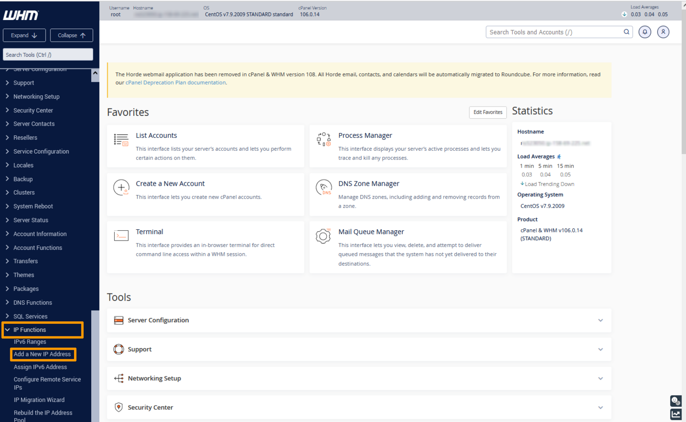{.thumbnail}

#### Step 2: aggiungi le informazioni degli Additional IP

Inserisci il tuo indirizzo Additional IP nella forma `xxx.xxx.xxx.xxx` nel campo "New IP or IP range to add".

Seleziona `255.255.255.255` come subnet mask e clicca su `Submit`{.action}.

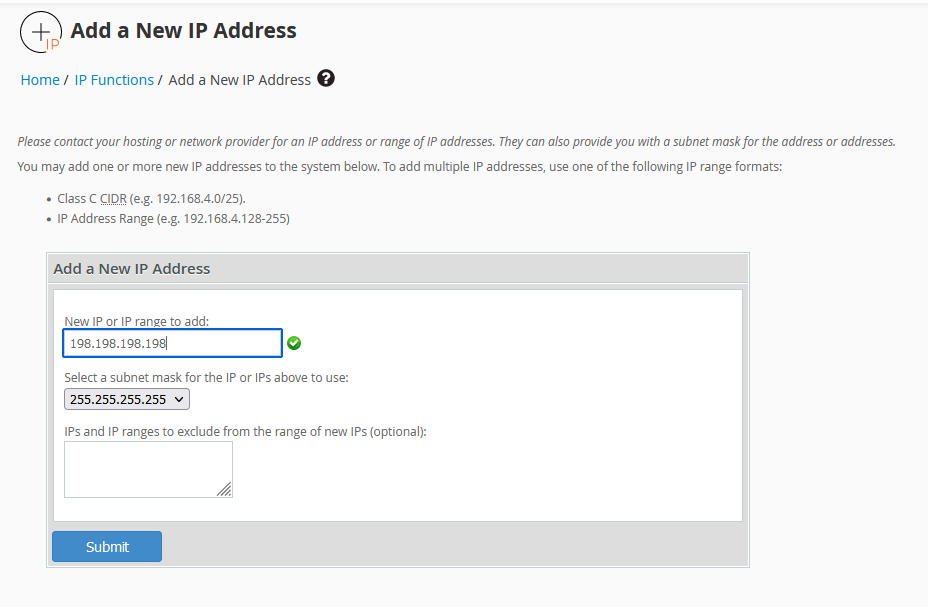{.thumbnail}

> [!warning]
>
> Attenzione: se si hanno più IP da configurare sullo stesso blocco e li si aggiunge tutti insieme, il sistema WHM obbliga a utilizzare la subnet mask `255.255.255.0`. Non si consiglia di utilizzare questa configurazione; è necessario aggiungere ogni IP singolarmente per utilizzare la subnet mask `255.255.255.255` appropriata.
>

#### Step 3: verifica la configurazione IP corrente

Di ritorno alla sezione `IP Functions`{.action}, clicca su `Show or Delete Current IP Addresses`{.action} per verificare che l'indirizzo Additional IP sia stato aggiunto correttamente.

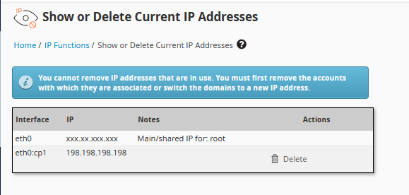{.thumbnail}

### Windows Server

I server Windows vengono forniti solitamente con una configurazione di rete con DHCP abilitato di default. Se hai già aggiunto un Additional IP o modificato la tua configurazione per utilizzare un IP statico, passa direttamente allo step successivo.

In caso contrario sarà necessario modificare la configurazione di rete per impostare IP statico al posto del DHCP.

Apri il prompt dei comandi `cmd`{.action} o `powershell`{.action} e digita il comando:

```powershell
ipconfig /all
```

Il risultato restituito sarà, ad esempio:

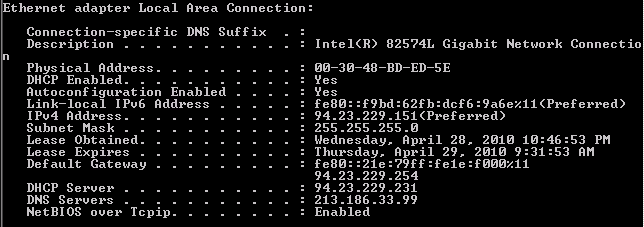{.thumbnail}

Recupera il tuo IPv4, la subnet mask, il gateway predefinito e il nome della scheda di rete.

Nel nostro esempio, l’IP del server è: **94.23.229.151**

Per continuare, è possibile effettuare le operazioni sia da riga di comando che tramite interfaccia grafica:

#### Da riga di comando (consigliato)

Nei comandi seguenti, è necessario sostituire:

|Comando|Valore|
|---|---|
|NETWORK_ADAPTER|Nome della scheda di rete (nel nostro esempio, Local Area Connection)|
|IP_ADDRESS|Indirizzo IP del server (nel nostro esempio, 94.23.229.151)|
|SUBNET_MASK| Maschera di sottorete (nel nostro esempio, 255.255.255.0)|
|GATEWAY| Gateway predefinito (nel nostro esempio, 94.23.229.254)|
|ADDITIONAL_IP|Indirizzo Additional IP da aggiungere|

> [!warning]
>
> Attenzione: se le informazioni inserite non sono corrette, il server non sarà più raggiungibile e sarà necessario effettuare le correzioni accedendo in modalità Winrescue o tramite KVM. 
> 

Nel prompt dei comandi:

* Passare a un IP statico

```powershell
netsh interface ipv4 set address name="NETWORK_ADAPTER" static IP_ADDRESS SUBNET_MASK GATEWAY
```
 
* Definire il server DNS

```powershell
netsh interface ipv4 set dns name="NETWORK_ADAPTER" static 213.186.33.99
``` 

* Aggiungere un Additional IP

```powershell
netsh interface ipv4 add address "NETWORK_ADAPTER" ADDITIONAL_IP 255.255.255.255
```

Da questo momento, il tuo Additional IP è attivo.

#### Da interfaccia grafica

1. Accedi al menu `Start`{.action} > `Pannello di controllo`{.action} > `Rete e Internet`{.action} > `Centro connessioni di rete e condivisione`{.action} > `Modifica impostazioni scheda`{.action} (nel menu a sinistra)
2. Clicca con il tasto destro su `Connessione alla rete locale`{.action}
3. Clicca su `Proprietà`{.action}
4. Seleziona `Protocollo Internet Version 4 (TCP/IPv4)`{.action} e clicca su `Proprietà`{.action}
5. Clicca su `Utilizza il seguente indirizzo IP`{.action} e inserisci l'IP principale del tuo server, la subnet mask e il gateway predefinito ottenuto precedentemente con il comando `ipconfig`{.action} . In `Server DNS preferito`, inserisci 213.186.33.99.

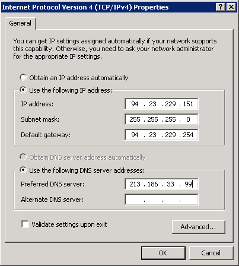{.thumbnail}

> [!warning]
>
> Attenzione: se le informazioni inserite non sono corrette, il server non sarà più raggiungibile e sarà necessario effettuare le correzioni accedendo in modalità Winrescue o tramite KVM. 
> 

In seguito, clicca su `Avanzate`{.action} (sempre nelle `Impostazioni TCP/IP`{.action}).

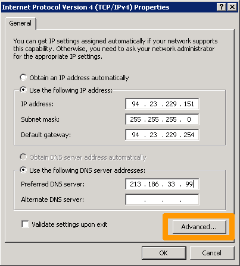{.thumbnail}

Nella parte `indirizzo IP`{.action}, clicca su `Aggiungi...`{.action}:

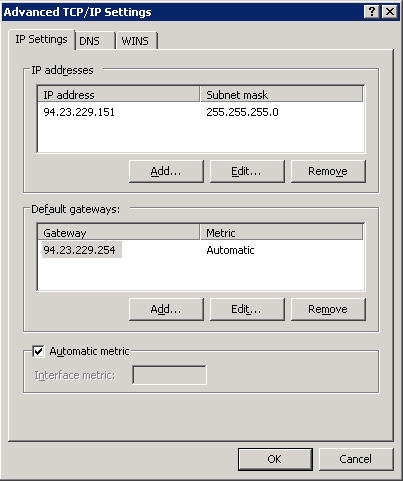{.thumbnail}

Inserisci il tuo Additional IP e la subnet mask **255.255.255.255**.

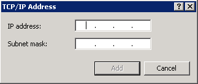{.thumbnail}

Clicca su `Aggiungi`{.action}.

Da questo momento, il tuo Additional IP è attivo.

### Plesk

#### Step 1: accedere alla gestione IP di Plesk

Nel pannello di configurazione Plesk, seleziona `Tools & Settings`{.action} nella barra laterale sinistra.

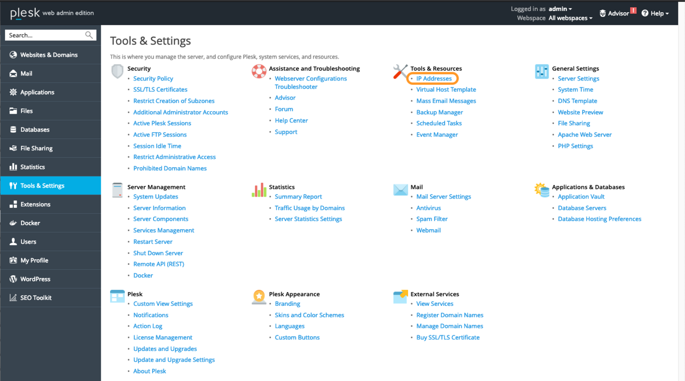{.thumbnail}

Clicca su `IP Indirizzi`{.action} con **Tools & Settings**.

#### Step 2: aggiungi le informazioni IP supplementari

In questa sezione, clicca sul pulsante `Add IP Address`{.action}.

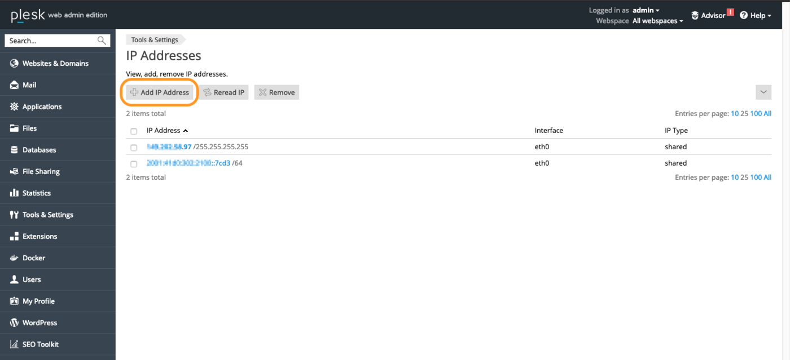{.thumbnail}

Inserisci il tuo indirizzo Additional IP nella forma `xxx.xxx.xxx.xxx/32` nel campo "IP address and subnet mask" e clicca su `OK`{.action}.

{.thumbnail}

#### Step 3: verifica la configurazione IP corrente

Per verificare che l'indirizzo Additional IP sia stato aggiunto correttamente, accedi alla sezione "Indirizzi IP".

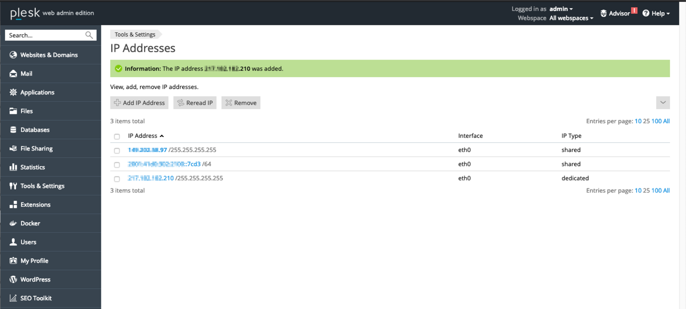{.thumbnail}


#### Risoluzione dei difetti

Se non riesci a stabilire una connessione tra la rete pubblica e il tuo alias IP e riscontri un problema di rete, riavvia il server in [modalità Rescue](/pages/bare_metal_cloud/dedicated_servers/rescue_mode) e configura l'alias direttamente sul server.

Una volta riavviato il server in Rescue mode, esegui questo comando:

```bash
ifconfig eth0:0 ADDITIONAL_IP netmask 255.255.255.255 broadcast ADDITIONAL_IP up
```

In cui sostituirai "ADDITIONAL_IP" con il vero Additional IP.

Sarà sufficiente effettuare un ping dal vostro Additional IP verso l'esterno. Se funziona, probabilmente significa che è necessario correggere un errore di configurazione. Se, al contrario, l’indirizzo IP continua a non funzionare, apri un ticket presso il team di assistenza tramite il [Help Center di OVHcloud](https://help.ovhcloud.com/csm?id=csm_get_help){.external}, precisando le informazioni seguenti:

- nome e versione del sistema operativo utilizzato sul server.
- nome e directory del file di configurazione di rete.
- il contenuto del file.

## Per saperne di più

[Modalità bridge IP](/pages/bare_metal_cloud/dedicated_servers/network_bridging)

Contatta la nostra Community di utenti all’indirizzo <https://community.ovh.com/en/>.