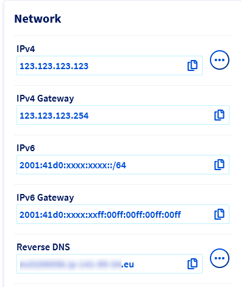
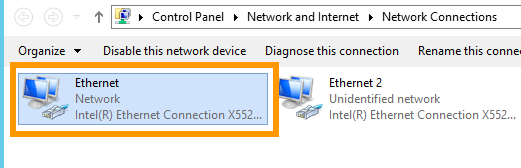
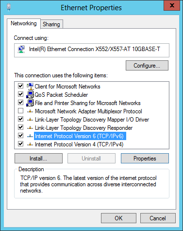

## Objective

Internet Protocol version 6 (IPv6) is the latest version of the Internet Protocol (IP). It is designed to address the long-anticipated address exhaustion of its predecessor, IPv4, by using 128-bit addresses instead of 32-bit addresses. Most OVHcloud dedicated servers are delivered with a /64 IPv6 block, with the exception of High Grade and Scale servers, which are delivered with a /56 IPv6 block. This represents over 18 quintillion IP addresses that you can use at your convenience.

**This guide explains how to configure IPv6 addresses on your server using various examples.**

> [!warning]
> OVHcloud is providing you with services for which you are responsible, with regard to their configuration and management. You are therefore responsible for ensuring they function correctly.
>
> This guide is designed to assist you in common tasks as much as possible. Nevertheless, we recommend that you contact a [specialist service provider](https://partner.ovhcloud.com/en/directory/) and/or discuss the issue with [our community](https://community.ovh.com/en/) if you face difficulties or doubts concerning the administration, usage or implementation of services on a server.
>

## Requirements

- A [dedicated server](https://www.ovhcloud.com/en/bare-metal/) in your OVHcloud account
- All your IPv6 information (prefix, gateway etc.)
- Basic knowledge of [SSH](/pages/bare_metal_cloud/dedicated_servers/ssh_introduction) and networking

> [!warning]
> Please note that Kimsufi servers are only provided with a single IPV6 block (/128). IPv6 will be configured automatically when installing the OS.
>

## Instructions

The following sections contain configurations for the distributions we currently offer and the most commonly used distributions/operating systems. The first step is always to log in to your server via SSH or a GUI login session (RDP for a Windows server).

On dedicated servers, the first IPv6 is declared as 2607:5300:xxxx:xxxx::. For example, if we've assigned your server the IPv6 range: `2607:5300:abcd:efgh::/64`, your server's first IPv6 is: `2607:5300:abcd:efgh::/64`.

By default, the first IPv6 is configured on most of the recent Linux distributions we offer for installation, so the gateway is already included in the configuration file. In most cases, you won't need to add it manually.

Please take note of the following terminology that will be used in code examples and instructions of the guide sections below:

|Term|Description|Example|
|---|---|---|
|YOUR_IPV6|An IPv6 address from the IPv6 block assigned to your server|2607:5300:xxxx:xxxx::1|
|IPv6_PREFIX|The prefix (or *netmask*) of your IPv6 block, usually 64|2607:5300:xxxx:xxxx::/64|
|IPv6_GATEWAY|The gateway of your IPv6 block|2607:5300:xxxx:ff:ff:ff:ff:ff or fe80::1|

In our examples, we'll use the `nano` text editor. Feel free to use the text editor of your choice.

### Default Gateway

The first step is to identify the IPv6 block and gateway assigned to your server. There are two ways of doing this:

  - [retrieving the network information via the OVHcloud Control Panel](#viacontrolpanel)
  - [retrieving the network information via the OVHcloud API](#viaapi)

#### Via the OVHcloud Control Panel <a name="viacontrolpanel"></a>

Log in to the [OVHcloud Control Panel](/links/manager), go to the `Bare Metal Cloud`{.action} section and select your server from `Dedicated servers`{.action}.

The IPv6 block and gateway assigned to your server will appear in the `Network` section of the `General Information`{.action} tab. Once you have copied them, continue with applying the IPv6 configuration.

{.thumbnail}

#### Via the OVHcloud API <a name="viaapi"></a>

Another way to retrieve the networking information for your server is to [use the OVHcloud API](/pages/manage_and_operate/api/first-steps).

Execute the following API call, indicating the internal server name (example: `ns3956771.ip-169-254-10.eu`):

> [!api]
>
> @api {v1} /dedicated/server GET /dedicated/server/{serviceName}/specifications/network
>

Please note that the leading "0's" can be removed in an IPv6 gateway. For example, The IPv6 gateway `2607:5300:60:62ff:00ff:00ff:00ff:00ff` can also been written as `2607:5300:60:62ff:ff:ff:ff:ff`.

> [!warning]
>
> Before modifying a configuration file, always create a backup of the original.
>

With some operating systems, the addition of static IPv6 routes in the original configuration file is necessary and is done by default. If that is the case, simply add your configuration for IPv6 as instructed in the guide, do not modify any lines in the original file.

### Debian and Debian-based operating systems (excluding Debian 12)

The configuration example below is based on Debian 11 (Bullseye).

> [!warning]
>
> Before following the steps below, we strongly suggest that you disable IPv6 autoconf and router advertising to prevent known issues. You can do so by adding the following lines to your `sysctl.conf` file, which is located in /etc/sysctl.conf:
> 
> `net.ipv6.conf.all.autoconf=0`
> 
> `net.ipv6.conf.all.accept_ra=0`
> 
> Once this has been done, you can apply those rules by executing the following command: `sudo sysctl -p`.
> 

#### Step 1: Connect to your server via SSH

```sh
ssh user@serverIP
```

#### Step 2: Create a backup

Your server's network configuration file is located in `/etc/network/interfaces.d`. In our example, it is called `50-cloud-init`. Before proceeding, create a backup of your file using one of the following commands:

```sh
sudo cp /etc/network/interfaces.d/50-cloud-init /etc/network/interfaces.d/50-cloud-init.bak
```

#### Step 3: Amend the network configuration file

Do not modify the existing lines in the configuration file. Add the lines for your IPv6 configuration, replacing `YOUR_IPv6` and `IPv6_PREFIX` with your own values. In this example, the network interface is called `eth0`. The interface on your server may differ.

```console
auto eth0
iface eth0 inet dhcp
    accept_ra 0

iface eth0 inet6 static
    address YOUR_IPv6
    netmask IPv6_PREFIX

# control-alias eth0
iface eth0 inet6 static
    address 2607:5300:xxxx:xxxx::/xx
    dns-nameservers 2001:41d0:3:163::1
    gateway 2607:5300:xxxx:xxff:ff:ff:ff:ff
```

**Debian 10**

```console
iface eth0 inet6 static 
    address YOUR_IPv6 
    netmask 64

post-up /sbin/ip -f inet6 route add IPv6_GATEWAY dev eth0 
post-up /sbin/ip -f inet6 route add default via IPv6_GATEWAY 
pre-down /sbin/ip -f inet6 route del IPv6_GATEWAY dev eth0
pre-down /sbin/ip -f inet6 route del default via IPv6_GATEWAY
```

Additional IPv6 addresses can be added with the following lines in the configuration file: `up ip -6 addr add ADDITIONAL_IPV6_1/IPv6_PREFIX dev eth0`, `up ip -6 addr add ADDITIONAL_IPV6_2/IPv6_PREFIX dev eth0` etc...

To ensure that the IPv6 is enabled or disabled whenever the eth0 interface is enabled or disabled, you need to add the following line to the configuration:

`down ip -6 addr del ADDITIONAL_IPV6_1/IPv6_PREFIX dev eth0`<br>
`down ip -6 addr del ADDITIONAL_IPV6_2/IPv6_PREFIX dev eth0`

**Configuration example:**

```console
auto eth0
iface eth0 inet dhcp
    accept_ra 0

iface eth0 inet6 static
    address 2607:5300:adce:f2cd::1
    netmask 64

# control-alias eth0
iface eth0 inet6 static
    address 2607:5300:xxxx:xxxx::/xx
    dns-nameservers 2001:41d0:3:163::1
    gateway 2607:5300:xxxx:xxff:ff:ff:ff:ff
```

Adding additional IPv6 addresses:

```console
auto eth0
iface eth0 inet dhcp
    accept_ra 0

iface eth0 inet6 static
    address 2607:5300:adce:f2cd::1
    netmask 64
    up ip -6 addr add 2607:5300:adce:f2cd::2/64 dev eth0
    up ip -6 addr add 2607:5300:adce:f2cd::3/64 dev eth0
    down ip -6 addr del 2607:5300:adce:f2cd::2/64 dev eth0
    down ip -6 addr del 2607:5300:adce:f2cd::3/64 dev eth0

# control-alias eth0
iface eth0 inet6 static
    address 2607:5300:xxxx:xxxx::/xx
    dns-nameservers 2001:41d0:3:163::1
    gateway 2607:5300:xxxx:xxff:ff:ff:ff:ff
```

#### Step 4: Save the file and apply the changes

Save your changes to the file and then restart the network or reboot your server to apply the changes.

```sh
sudo /etc/init.d/networking restart
```

#### Step 5: Test the IPv6 connectivity

You can test the IPv6 connectivity by running the commands shown below:

```sh
ping6 -c 4 2001:4860:4860::8888

PING 2001:4860:4860::8888(2001:4860:4860::8888) 56 data bytes
64 bytes from 2001:4860:4860::8888: icmp_seq=1 ttl=57 time=4.07 ms
64 bytes from 2001:4860:4860::8888: icmp_seq=2 ttl=57 time=4.08 ms
64 bytes from 2001:4860:4860::8888: icmp_seq=3 ttl=57 time=4.08 ms
64 bytes from 2001:4860:4860::8888: icmp_seq=4 ttl=57 time=4.07 ms

--- 2001:4860:4860::8888 ping statistics ---
4 packets transmitted, 4 received, 0% packet loss, time 3003ms
rtt min/avg/max/mdev = 4.075/4.079/4.083/0.045 ms
```

If you are not able to ping this IPv6 address, check your configuration and try again. Also ensure that the machine you are testing from is connected with IPv6. If it still does not work, please test your configuration in [Rescue mode](/pages/bare_metal_cloud/dedicated_servers/rescue_mode).

### Fedora 38 and later

The configuration example below is based on Fedora 39.

Fedora now uses keyfiles. NetworkManager previously stored network profiles in ifcfg format in this directory: `/etc/sysconfig/network-scripts/`. However, the ifcfg format is now deprecated. By default, NetworkManager no longer creates new profiles in this format. The configuration file is now found in `/etc/NetworkManager/system-connections/`. 

In this example, our file is called `cloud-init-eno1.nmconnection`.

#### Step 1: Use SSH to connect to your server

```sh
ssh user@serverIP
```

#### Step 2: Create a backup

> [!primary]
> 
> Note that the name of the network file in our example may differ from your own. Please adjust to your appropriate name.
>

First, make a copy of the configuration file, so that you can revert at any time:

```sh
sudo cp -r /etc/NetworkManager/system-connections/cloud-init-eno1.nmconnection /etc/NetworkManager/system-connections/cloud-init-eno1.nmconnection.bak
```

#### Step 3: Amend the network configuration file

Amend the file by adding the necessarylines to it, do not modify any thing in the original file. Replace the generic elements (i.e. `YOUR_IPV6` and `IPv6_PREFIX`) with your specific values. Also, we have omitted the IPv4 configuration to avoid confusion, but the IPv6 configuration is made in the same configuration file.

```console
[ipv6]
method=auto
may-fail=true
address1=2607:5300:xxxx:xxxx::/xx
address2=YOUR_IPV6/IPv6_PREFIX
gateway=2607:5300:xxxx:xxff:ff:ff:ff:ff
```

If you need to configure more IPv6 addresses, your configuration should look like this:

```console
[ipv6]
method=auto
may-fail=true
address1=2607:5300:xxxx:xxxx::/xx
address2=ADDITIONAL_IPV6_1/IPv6_PREFIX
address3=ADDITIONAL_IPV6_2/IPv6_PREFIX
gateway=2607:5300:xxxx:xxff:ff:ff:ff:ff
```

**Configuration example:**

```sh
sudo nano /etc/NetworkManager/system-connections/cloud-init-eno1.nmconnection
```

Next, we amend the configuration file:

```console
[ipv6]
method=auto
may-fail=true
address1=2607:5300:xxxx:xxxx::/xx
address2=2607:5300:adce:f2cd::1/64
gateway=2607:5300:xxxx:xxff:ff:ff:ff:ff
```

For multiple IPV6 addresses:

```console
[ipv6]
method=auto
may-fail=true
address1=2607:5300:xxxx:xxxx::/xx
address2=2607:5300:adce:f2cd::1/64
address3=2607:5300:adce:f2cd::2/64
gateway=2607:5300:xxxx:xxff:ff:ff:ff:ff
```

#### Step 4: Save the file and apply the changes

Save your changes to the file and then restart the network or reboot your server to apply the changes.

```sh
sudo systemctl restart NetworkManager
```

#### Step 5: Test the IPv6 connectivity

You can test the IPv6 connectivity by running the commands shown below:

```sh
ping6 -c 4 2001:4860:4860::8888

PING 2001:4860:4860::8888(2001:4860:4860::8888) 56 data bytes
64 bytes from 2001:4860:4860::8888: icmp_seq=1 ttl=57 time=4.07 ms
64 bytes from 2001:4860:4860::8888: icmp_seq=2 ttl=57 time=4.08 ms
64 bytes from 2001:4860:4860::8888: icmp_seq=3 ttl=57 time=4.08 ms
64 bytes from 2001:4860:4860::8888: icmp_seq=4 ttl=57 time=4.07 ms

--- 2001:4860:4860::8888 ping statistics ---
4 packets transmitted, 4 received, 0% packet loss, time 3003ms
rtt min/avg/max/mdev = 4.075/4.079/4.083/0.045 ms
```

If you are not able to ping this IPv6 address, check your configuration and try again. Also ensure that the machine you are testing from is connected with IPv6. If it still does not work, please test your configuration in [Rescue mode](/pages/bare_metal_cloud/dedicated_servers/rescue_mode).

### Debian 12, Ubuntu 20.04 and following

The configuration example below is based on Ubuntu 22.04 (Jammy Jellyfish).

The network configuration files are located in the directory `/etc/netplan/`. By default, the main configuration file is called `50-cloud-init.yaml`.

#### Step 1: Use SSH to connect to your server

```sh
ssh user@serverIP
```

#### Step 2: Create the network configuration file

The best approach is to create a separate configuration file with a .yaml extension for configuring IPv6 addresses in the `/etc/netplan/` directory. This way, you can easily revert the changes in the event of an error.

In our example, our file is named `51-cloud-init-ipv6.yaml`:

```sh
sudo touch /etc/netplan/51-cloud-init-ipv6.yaml
```

#### Step 3: Amend the network configuration file

Using a text editor, amend the `51-cloud-init-ipv6.yaml` file by adding the following lines to the file as shown in the example below.

Replace the generic elements (i.e. `YOUR_IPV6` and `IPV6_PREFIX`) as well as the network interface (if your server is not using **eno3**) with your specific values.

```yaml
network:
    version: 2
    ethernets:
         eno3:
            dhcp6: no
            match:
              name: eno3
            addresses:
              - YOUR_IPV6/IPV6_PREFIX
```

If you need to configure more IPv6 addresses, your configuration should look like this:


```yaml
network:
    version: 2
    ethernets:
        eno3:
            dhcp6: no
            match:
              name: eno3
            addresses:
              - YOUR_IPV6/IPv6_PREFIX
              - ADDITIONAL_IPV6_1/IPv6_PREFIX
              - ADDITIONAL_IPV6_2/IPv6_PREFIX
```

> [!warning]
> It is important to respect the alignment of each element in this file as represented in the example above. Do not use the tab key to create your spacing. Only the space key is needed.
>

**Configuration example:**

```sh
sudo nano /etc/netplan/51-cloud-init-ipv6.yaml
```

Next, we amend the configuration file:

```yaml
network:
    version: 2
    ethernets:
          eno3:
            dhcp6: no
            match:
              name: eno3
            addresses:
              - 2607:5300:adce:f2cd::1/64
```

For multiple IPV6 addresses:

```yaml
network:
    version: 2
    ethernets:
        eno3:
            dhcp6: no
            match:
              name: eno3
            addresses:
              - 2607:5300:adce:f2cd::1/64
              - 2607:5300:adce:f2cd::2/64
              - 2607:5300:adce:f2cd::3/64
```

#### Step 4: Test and apply the configuration

You can test your configuration using this command:

```sh
sudo netplan try
```

If it is correct, apply it using the following command:

```sh
sudo netplan apply
```

#### Step 5: Test the IPv6 connectivity

You can test the IPv6 connectivity by running the command shown below:

```sh
ping6 -c 4 2001:4860:4860::8888

PING 2001:4860:4860::8888(2001:4860:4860::8888) 56 data bytes
64 bytes from 2001:4860:4860::8888: icmp_seq=1 ttl=57 time=4.07 ms
64 bytes from 2001:4860:4860::8888: icmp_seq=2 ttl=57 time=4.08 ms
64 bytes from 2001:4860:4860::8888: icmp_seq=3 ttl=57 time=4.08 ms
64 bytes from 2001:4860:4860::8888: icmp_seq=4 ttl=57 time=4.07 ms

--- 2001:4860:4860::8888 ping statistics ---
4 packets transmitted, 4 received, 0% packet loss, time 3003ms
rtt min/avg/max/mdev = 4.075/4.079/4.083/0.045 ms
```

### CentOS 7, Alma Linux (8 & 9) and Rocky Linux (8 & 9)

The configuration example below is based on CentOS 7.

The network configuration file is located in the directory `/etc/sysconfig/network-scripts`. In our example, it is called `ifcfg-eth0`.

#### Step 1: Use SSH to connect to your server

```sh
ssh user@serverIP
```

#### Step 2: Create a backup

> [!primary]
> 
> Note that the name of the network file in our example may differ from your own. Please adjust to your appropriate name.
>

First, make a copy of the configuration file, so that you can revert at any time:

```sh
sudo cp -r /etc/sysconfig/network-scripts/ifcfg-eth0 /etc/sysconfig/network-scripts/ifcfg-eth0.bak
```

#### Step 3: Amend the network configuration file

In the open configuration file, add the following lines if they are missing. Replace the generic element (i.e. `YOUR_IPv6`, `IPV6_GATEWAY` and `IPV6_PREFIX`) with your specific values. Also, we have omitted the IPv4 configuration to avoid confusion, but the IPv6 configuration is made in the same configuration file. 

```console
IPV6INIT=yes
IPV6ADDR=YOUR_IPV6/IPV6_PREFIX
IPV6_DEFAULTGW=IPV6_GATEWAY
```

For Alma Linux and Rocky linux, the contents of the configuration file may differ from that shown above, in which case simply add the missing items. Do not replace anything in the original file.

If you need to configure multiple IPv6 addresses, add the following line:

```console
IPV6ADDR_SECONDARIES="ADDITIONAL_IPV6_1/IPV6_PREFIX ADDITIONAL_IPV6_2/IPV6_PREFIX etc..."
```

**Configuration example:**

```sh
sudo nano /etc/sysconfig/network-scripts/ifcfg-eth0
```

Next, we amend the configuration file:

```console
IPV6INIT=yes
IPV6ADDR=2607:5300:adce:f2cd::/64
IPV6_DEFAULTGW=2607:5300:adce:f2ff:ff:ff:ff:ff
```

For multiple IPV6 addresses:

```console
IPV6INIT=yes
IPV6ADDR=2607:5300:adce:f2cd::
IPV6_DEFAULTGW=2607:5300:adce:f2ff:ff:ff:ff:ff
IPV6ADDR_SECONDARIES="2607:5300:adce:f2cd::1/64 2607:5300:adce:f2cd::2/64"
```

#### Step 4: Save the file and apply the changes

Save your changes to the file and then restart the network with one of the following commands:

```sh
sudo systemctl restart network
```

**For Alma Linux and Rocky Linux**

```sh
sudo systemctl restart NetworkManager
```

You can also reboot your server to apply the changes.

#### Step 5: Test the IPv6 connectivity

You can test the IPv6 connectivity by running the command shown below:

```sh
ping6 -c 4 2001:4860:4860::8888

PING 2001:4860:4860::8888(2001:4860:4860::8888) 56 data bytes
64 bytes from 2001:4860:4860::8888: icmp_seq=1 ttl=57 time=4.07 ms
64 bytes from 2001:4860:4860::8888: icmp_seq=2 ttl=57 time=4.08 ms
64 bytes from 2001:4860:4860::8888: icmp_seq=3 ttl=57 time=4.08 ms
64 bytes from 2001:4860:4860::8888: icmp_seq=4 ttl=57 time=4.07 ms

--- 2001:4860:4860::8888 ping statistics ---
4 packets transmitted, 4 received, 0% packet loss, time 3003ms
rtt min/avg/max/mdev = 4.075/4.079/4.083/0.045 ms
```

### Windows Server 2016 and later

#### Step 1: Use RDP to connect to your server

Find more information in [this guide](/pages/bare_metal_cloud/dedicated_servers/getting-started-with-dedicated-server#logging-on-to-your-server).

#### Step 2: Open your server's network configuration

First, right-click on the network icon in the notification area to go to the `Network and Sharing Center`{.action}.

{.thumbnail}

Click `Change adapter settings`{.action}.

{.thumbnail}

Right-click your network adapter, then click `Properties`{.action}.

{.thumbnail}

Select `Internet Protocol Version 6`{.action}, then click `Properties`{.action}.

{.thumbnail}

#### Step 3: Amend the network configuration 

Enter your IPv6 configuration (`IPv6 address` and `Default Gateway`), check the `Validate settings upon exit` box and click the `OK`{.action} button to validate your changes.

{.thumbnail}

### Diagnostic

Have you configured your IPv6, but found that nothing works? 

There is a simple operation to determine whether the error is in your configuration, or on the OVHcloud network.

First, [put your server into rescue mode](/pages/bare_metal_cloud/dedicated_servers/rescue_mode).

Next, use the template commands below to configure your IPv6 non-persistently, replacing ‘YOUR_IPV6’, ‘IPV6_PREFIX’ and 'IPV6_GATEWAY' with your own details:

```sh
ip addr add YOUR_IPV6/IPV6_PREFIX dev eth0
ip -6 route add IPV6_GATEWAY dev eth0
ip -6 route add default via IPV6_GATEWAY dev eth0
```

Test your network again via a ping6, for example:

```sh
ping6 ipv6.google.com
```
If your server responds, it is likely that there is an error in one of the steps taken for your initial configuration.

In any case, feel free to [contact our support team](https://help.ovhcloud.com/csm?id=csm_get_help) and ask to review your configurations. You will need to provide:

- The operating system name and version you are using on your server.
- The name and directory of the network configuration file.
- The content of that file.

## Go further

Join our community of users on <https://community.ovh.com/en/>.