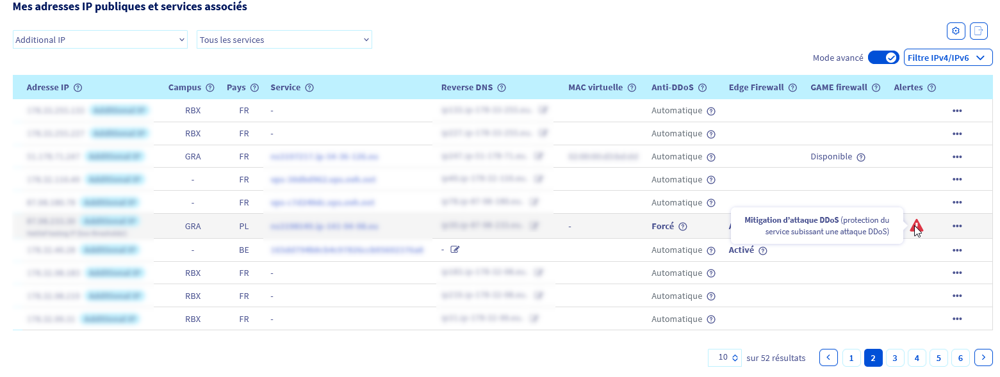
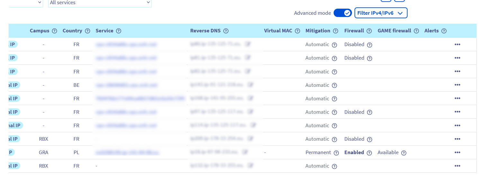
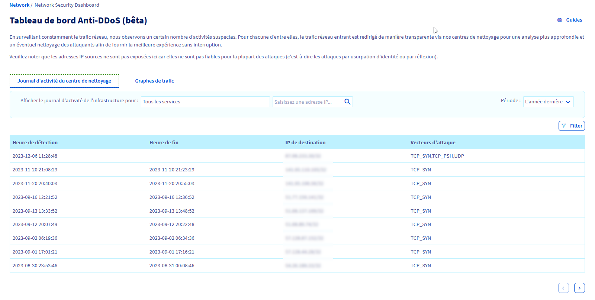
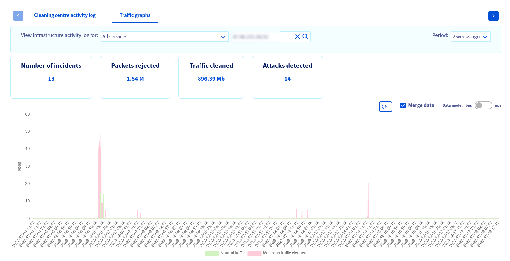

## Objective

This guide explains the Network Security Dashboard and provides an overview of counter measures triggered by our DDoS protection infrastructure when malicious network activity is detected. You can find details on which additional protections should be implemented to keep your services up and running. Moreover, traffic charts are available on the dashboard for scrubbing centre activity periods to better visualize the situation.

## Requirements

- An OVHcloud service exposed on a dedicated public IP address ([Dedicated Server](/links/bare-metal/bare-metal/), [VPS](https://www.ovhcloud.com/en-au/vps/), [Public Cloud instance](https://www.ovhcloud.com/en-au/public-cloud/), [Hosted Private Cloud](https://www.ovhcloud.com/en-au/enterprise/products/hosted-private-cloud/), [Additional IP](https://www.ovhcloud.com/en-au/network/additional-ip/), etc.)
- Access to the [OVHcloud Control Panel](/links/manager)

## Instructions

### Network security 

OVHcloud's Anti-DDoS infrastructure is a multi-layered, distributed defense system to fight against cyber attacks. It consists of multiple edge locations and scrubbing centres that can analyse and clean up malicious traffic. Together with the [Edge Network Firewall](/pages/bare_metal_cloud/dedicated_servers/firewall_network) and the [GAME DDoS protection](/pages/bare_metal_cloud/dedicated_servers/firewall_game_ddos), it offers quality protection services for various cases.

The Anti-DDoS infrastructure is constantly analysing incoming traffic (detection mechanism) and eventually redirects such traffic via our scrubbing centres (also known as “mitigation”) located in data centres around the world. Incoming traffic is then deeply analysed and eventually filtered out from malicious packets before reaching your server or service.

#### What happens when an attack reaches my service's IP?

Every time an attack is detected towards any IP of your service, you are notified via email that traffic has been rerouted through the Anti-DDoS infrastructure. You can also monitor these periods on the Network Security Dashboard with additional details.

During an attack, an active mitigation action will be indicated by a warning icon on the IP listing page (in the `Manage IPs`{.action} section of your Control Panel).

{.thumbnail}

> [!primary]
>
> Find more information on how DDoS mitigation is achieved at OVHcloud [here](https://www.ovhcloud.com/en-au/security/anti-ddos/ddos-attack-mitigation/).
>

> [!warning]
>
> Please note that the protection logic is based on public IP addresses associated with a server (or service). As a result, statistics and charts are displayed or calculated on a per-IP basis.
> 

### Network security notifications

{.thumbnail}

In the OVHcloud Control Panel, access the `Bare Metal Cloud`{.action} section. Then go to `Network`{.action} in the left-hand sidebar and click `Manage IPs`{.action}. Ensure that `Advanced mode` is enabled to see the Anti-DDoS infrastructure status and its components configuration.

The columns correspond to the Anti-DDoS scrubbing (**Mitigation**) status, the Edge Network **Firewall** and **GAME firewall** features availability and their statuses.

- The **Mitigation** state can be:
    - **Automatic** - The scrubbing centre is in **automatic** mode. It is the recommended mode to use, it reroutes traffic for deeper analysis when needed.
    - **Permanent** - The scrubbing centre is **permanently enabled**. We do not recommend it to be enabled permanently, unless latency jitter is noted due to rerouting traffic back and forth.
    - **Forced** - This indicates the scrubbing centre is **taking action** right now.

- The **Firewall** column indicates the state of the Edge Network Firewall which can be:
    - **Enabled** - Firewall is **enabled** for this IP.
    - **Disabled** -  Firewall is **disabled** for this IP.
    - **(no status)** - Firewall configuration is not created. To configure rules, click on the `...`{.action} button then select `Create Firewall`{.action}.

- The **GAME firewall** (only available for [OVHcloud **Game** dedicated servers](/links/bare-metal/bare-metal/prices/#filterType=range_element&filterValue=game)) state can be:
    - **On** - The GAME DDoS protection is **enabled** on this IP.
    - **Off** - The GAME firewall is **available** but **disabled** on this IP.
    - **(no status)** - The GAME firewall is not available for this IP. This means the listed IP is not configured on a supported product range.

- The **Alerts** column may indicate an active scrubbing centre with a warning icon and appropriate hint.

### Network Security Dashboard

In the OVHcloud Control Panel, accessing the dashboard can be done either from the IP listing page (for a particular IP) or going directly to the Network Security Dashboard in the `Network`{.action} menu.

Go to the `Bare Metal Cloud`{.action} tab, then to `Network`{.action} and select `Network Security Dashboard`{.action}.

Alternatively, from the IP listing (this option is only available when the scrubbing centre is in action): Access the `Bare Metal Cloud`{.action} tab then go to `Network`{.action} and click `Public IP Addresses`{.action}. Click the `...`{.action} button and access `Network Security Dashboard`{.action}.

In the **scrubbing centre log** tab, you can retrieve all the information about attacks that were detected in the past (or that are ongoing).



In the table, the following columns are present: 

- **Detection time** - Timestamp of the first attack detection
- **End time** - Timestamp of when the scrubbing centre finished mitigating
- **Destination IP** - The IP that was the target of the attack
- **Attack vectors** - Provides information about detected types of attacks, such as UDP or TCP attack, etc.

> [!warning]
>
> Please note that source IP addresses for detected events are not displayed because they are usually spoofed (DDoS attacks may point to other sources than the ones really comes from) and such information would be misleading or not usable.
> 

In the **Traffic chart** tab, you can see a graph showing traffic to your IP address (bps or pps).



It presents malicious traffic that was dropped (**in red**) and clean traffic delivered to your IP address (**in green**). There are also basic mitigation statistics displayed, i.e.: how many attacks were detected for a selected IP, how much traffic (or packets) was cleaned during attacks or how many times scrubbing centres took an action to inspect your traffic (number of events) in a selected period of time.

## FAQ

### Why do I see not all of the attacks on the Network Security Dashboard?

Depending on the nature of the attack, different actions may be taken to best eliminate the threat. In both cases attacks are best mitigated as close to the origin as possible:

- In case of an attack coming into the OVHcloud network (**external**), traffic is redirected to the Anti-DDoS scrubbing centres for cleaning (thus visible on the Dashboard).
- Please note that attacks originating from inside the OVHcloud network (**internal**) are managed by our security teams. Mitigation focuses on blocking the origin of the attack and will not be reported by Anti-DDoS infrastructure systems.

### No data is displayed in scrubbing centre logs, is this normal?

Yes, it means that no suspected attacks have targeted your public IP addresses.

### No traffic chart or data is shown for an IP address I enter.

Such data is available only for public IP addresses during automatic Anti-DDoS infrastructure detection events (when traffc is redirected via scrubbing centre).

### The traffic chart for some positions in the scrubbing centre logs is not available.

Traffic chart data is available only for the past two weeks, while log entries can be reviewed for the past year.

### An attack on my service is persisting, how can I better protect my server?

Some types of attacks may be so specific that our Anti-DDoS infrastructure will not be able to detect and clean it automatically. In such cases, the firewall configured on your server is your best option. We also recommend offloading some of the server firewall rules to the edge of our network - using the Edge network Firewall.

For more information how to configure Edge Network Firewall rules, please see our [Edge Network Firewall](/pages/bare_metal_cloud/dedicated_servers/firewall_network) guide.

### My service is attacked and I experience problems on my server. What more can I do?

Anti-DDoS infrastructure is a solution designed for best efficiency and wide ranges of services to protect. In some specific cases, it may need additional tuning (e.g. for application specificity or size). To request this, please visit our [Help Centre](https://help.ovhcloud.com/csm?id=csm_get_help) and search for the appropriate action inside the "network attack and/or Anti-DDoS related" category.

To let us better understand your case and to be able to help you, please provide us with some more details:

#### Step 1 - Capture traffic

In order to deliver the best solution for you, first we will need to analyse a traffic sample.

To provide us with such a capture, run this command on Linux:

```bash
tcpdump -w capture-ovh -c 100000 port not ssh
```

>[!primary]
>
> If you are using Windows, use [Wireshark](https://www.wireshark.org/) and capture 100000 packets.
>

Once the command finishes running, the capture file is created. You can either attach the created file to your support ticket or upload it to our file sharing solution using [this guide](/pages/account_and_service_management/account_information/use-plik).

Make sure to share the uploaded file's link with the support team in your ticket.

#### Step 2 - Provide OVHcloud with information

In any case where adjustments to our Anti-DDoS system will be necessary, it is mandatory to provide us the following specific details:

- Service hosted on the server that is affected
- Date and time of when the attack started
- Date and time of when the attack finished
- IP(s) affected
- Service, protocol and port used by the affected service
- Size of service (XS: 1-10, S: 10-100, M: 100-1k, L: 1-10k, XL: 10-100k, XXL: 100k+ clients connected)
- Other services hosted on the server
- Other ports being used on the server
- Are there other services on separate IPs: Yes/No
- If yes, which IPs
- Is legitimate traffic being dropped: YES/NO
- Was connection to the server lost: YES/NO
- Which type of legitimate traffic is being dropped

## Go further

[Enabling and configuring the Edge Network Firewall](/pages/bare_metal_cloud/dedicated_servers/firewall_network)

[Protecting a game server with the application firewall](/pages/bare_metal_cloud/dedicated_servers/firewall_game_ddos)

Join our [community of users](/links/community).