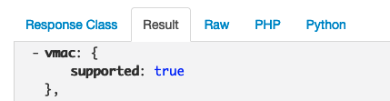

## Objectif

Afin d'utiliser la fonctionnalité des MAC virtuelles (VMAC) sur un serveur dédié, vous devez tout d'abord déterminer si ce serveur support cette fonctionnalité.

Le support de cette fonctionalité est un pré-requis de toutes les actions concernant les MAC virtuelles.

**Découvrez comment vérifier si votre serveur dédié supporte la fonctionnalité des MAC virtuelles.**

## Prérequis

* Posséder [un serveur dédié](https://www.ovh.com/fr/serveurs_dedies/){.external}.
* Être connecté à l'[API OVHcloud](https://api.ovh.com/){.external}.

> [!primary]
> Si vous n'êtes pas familier avec l'utilisation de l'API OVHcloud, consultez notre guide « [Premiers pas avec les API OVHcloud](/pages/manage_and_operate/api/first-steps)».

## En pratique

### Obtenir l'information

Utilisez l'appel API suivant :

> [!api]
>
> @api {v1} /dedicated/server GET /dedicated/server/{serviceName}/specifications/network
>

Saisissez le nom de votre serveur dans le champ `serviceName`, puis cliquez sur `Execute`{.action}.

{.thumbnail}

Vous obtenez alors une liste avec une entrée « vmac / supported » qui sera à « true » ou « false » (valeur booléenne).

{.thumbnail}

> [!primary]
> **Interprétation du résultat**
>
> - **false** : vous ne pouvez pas utiliser les fonctionnalités liées aux MAC virtuelles sur ce serveur.
>
> - **true** : vous pouvez utiliser les fonctionnalités liées aux MAC virtuelles sur ce serveur.
>

## Aller plus loin

[Premiers pas avec les API OVHcloud](/pages/manage_and_operate/api/first-steps)

Échangez avec notre communauté d'utilisateurs sur <https://community.ovh.com/>.