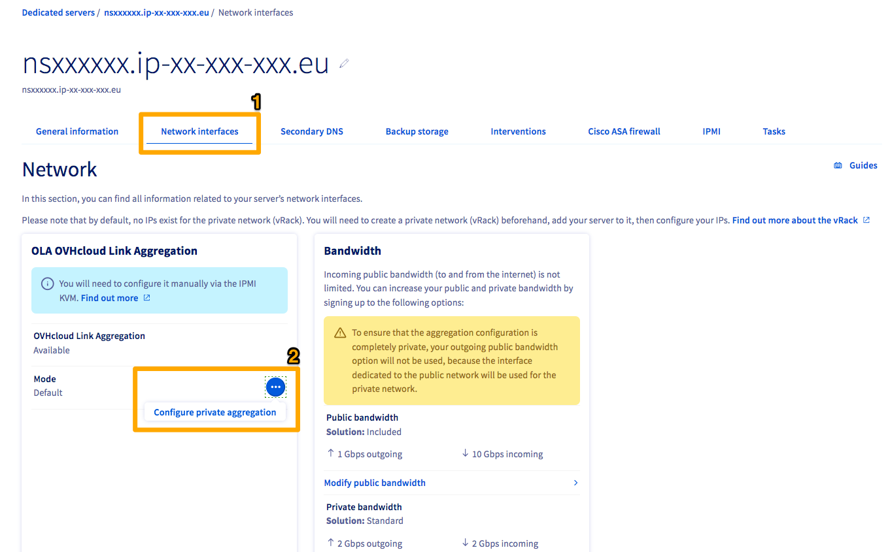
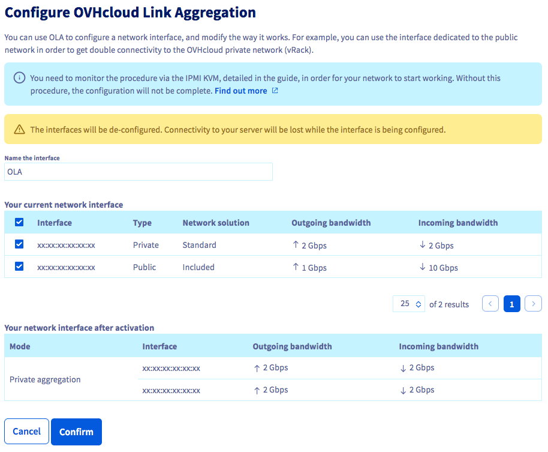
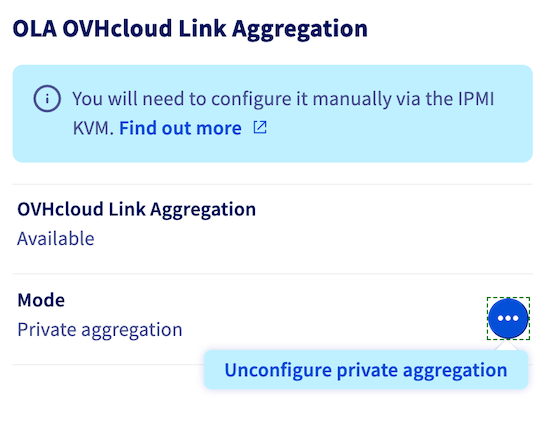

## Obiettivo

La tecnologia OVHcloud Link Aggregation (OLA) è stata progettata dai team OVHcloud per aumentare la disponibilità dei server e potenziare le connessioni di rete. L’attivazione dell’opzione permette di aggregare in pochi click le schede di rete e rendere i collegamenti ridondati in modo che, in caso di malfunzionamenti, il traffico venga reindirizzato automaticamente verso il collegamento disponibile. 
L'aggregazione si basa sulla tecnologia IEEE 802.3ad o Link Aggregation Control Protocol (LACP).

**Questa guida ti mostra come configurare il servizio OLA nello Spazio Cliente di OVHcloud.**

## Prerequisiti

- Disporre di un [server dedicato OVHcloud](/links/bare-metal/bare-metal) di gamma Advance, Scale o High Grade
- Disporre di un sistema operativo / Hypervisor che supporta il protocollo di aggregazione 802.3ad (LACP)

<!-- CP-NAV-START:baremetal-dedicated-servers -->
---

### Accesso allo Spazio Cliente OVHcloud

- **Link diretto:** [Server dedicati](/links/control-panel/baremetal-dedicated-servers)
- **Percorso di navigazione:** `Bare Metal Cloud`{.action} > `Server dedicati`{.action} > Seleziona il tuo server

---
<!-- CP-NAV-END:baremetal-dedicated-servers -->

## Procedura

> [!warning]
>
> La configurazione OLA viene eseguita su tutte le interfacce di rete. Esse formeranno un aggregato del tipo "aggregazione privata".
>
> Con l'implementazione di OLA, l'IP pubblico non sarà più accessibile.
>

### Configurare OLA nel tuo Spazio Cliente OVHcloud

Clicca su `Server dedicati`{.action} e seleziona il tuo server nella lista.

{.thumbnail}

Nella scheda `Interfacce di rete`{.action} (1), clicca sul pulsante `...`{.action} (2) a destra di "Modo" nell'ambito **OLA: OVHcloud Link Aggregation**. Clicca su `Configura l'aggregazione privata`{.action} (2).

{.thumbnail}

Verifica che le tue due interfacce, o gruppi di interfacce, siano selezionate correttamente e assegna un nome all'interfaccia OLA. Clicca su `Conferma`{.action} una volta completata la verifica.

Questa operazione potrebbe richiedere qualche minuto. Lo step successivo consisterà nella configurazione delle interfacce del sistema operativo come NIC bond o NIC team. Per conoscere la procedura da seguire, consulta la nostra documentazione disponibile relativa ai sistemi operativi più diffusi:

[Configurare un NIC per il servizio OVHcloud Link Aggregation in Debian 9 tramite ifupdown](/pages/bare_metal_cloud/dedicated_servers/ola-enable-debian9)

[Configurare un NIC per il servizio OVHcloud Link Aggregation in Windows Server 2019](/pages/bare_metal_cloud/dedicated_servers/ola-enable-w2k19)

[Configurare un NIC per il servizio OVHcloud Link Aggregation in SLES 15](/pages/bare_metal_cloud/dedicated_servers/ola-enable-sles15).

[How to configure your NIC for OVHcloud Link Aggregation in Debian 12 or Ubuntu 24.04 using Netplan](/pages/bare_metal_cloud/dedicated_servers/lacp-enable-netplan).

### Ripristina OLA ai valori predefiniti

Per ripristinare OLA ai valori predefiniti, clicca sul pulsante `...`{.action} a destra di "Modo" nell'ambito **OLA: OVHcloud Link Aggregation**. Clicca su `Deconfigurare l'aggregazione privata`{.action}. Clicca su `Conferma`{.action} nel menu contestuale.

{.thumbnail}

L'operazione potrebbe richiedere alcuni minuti.

## Per saperne di più

[Configurare un NIC per il servizio OVHcloud Link Aggregation in Debian 9 tramite ifupdown](/pages/bare_metal_cloud/dedicated_servers/ola-enable-debian9)

[Configurare un NIC per il servizio OVHcloud Link Aggregation in Windows Server 2019](/pages/bare_metal_cloud/dedicated_servers/ola-enable-w2k19)

[Configurare un NIC per il servizio OVHcloud Link Aggregation in SLES 15](/pages/bare_metal_cloud/dedicated_servers/ola-enable-sles15)

[How to configure your NIC for OVHcloud Link Aggregation in Debian 12 or Ubuntu 24.04 using Netplan](/pages/bare_metal_cloud/dedicated_servers/lacp-enable-netplan).

Contatta la nostra [Community di utenti](/links/community).
