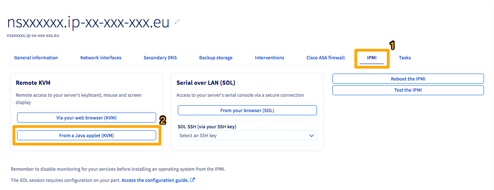

<style>
details>summary {
    color:rgb(33, 153, 232) !important;
    cursor: pointer;
}
details>summary::before {
    content:'\25B6';
    padding-right:1ch;
}
details[open]>summary::before {
    content:'\25BC';
}
</style>

## Ziel

Die OVHcloud Link Aggregation (OLA) wurde von unseren Teams entwickelt, um die Verfügbarkeit Ihres Servers zu erhöhen und die Effizienz Ihrer Netzwerkverbindungen zu steigern. Mit nur wenigen Klicks können Sie Ihre Netzwerkkarten aggregieren und Ihre Netzwerkverbindungen redundant machen. Wenn also eine Verbindung ausfällt, wird der Datenverkehr automatisch auf eine andere verfügbare Verbindung umgeleitet. Die verfügbare Bandbreite wird durch Aggregation ebenfalls verdoppelt.
Die Aggregation basiert auf dem Standard IEEE 802.3ad, Link Aggregation Control Protocol (LACP).

**Diese Anleitung erklärt, wie Sie Ihre Schnittstellen zur Verwendung mit OLA in SLES 15 zusammenfassen.**

## Voraussetzungen

- [OVHcloud Link Aggregation im OVHcloud Kundencenter konfigurieren](/pages/bare_metal_cloud/dedicated_servers/ola-enable-manager)

<!-- CP-NAV-START:baremetal-dedicated-servers -->
---

### Zugriff auf das OVHcloud Kundencenter

- **Direktlink:** [Dedicated Server](/links/control-panel/baremetal-dedicated-servers)
- **Navigationspfad:** `Bare Metal Cloud`{.action} > `Dedicated Server`{.action} > Wählen Sie Ihren Server aus

---
<!-- CP-NAV-END:baremetal-dedicated-servers -->

## In der praktischen Anwendung

Da wir für unsere NICs in OLA eine privat-private Konfiguration haben, können wir keine SSH-Verbindung zum Server herstellen. Daher müssen wir das IPMI-Tool nutzen, um auf den Server zuzugreifen.

Klicken Sie anschließend auf den Tab `IPMI`{.action} (1) und dann auf den Button `Mit einem Java-Applet (KVM)`{.action} (2).

{.thumbnail}

Ein JNLP-Applet wird heruntergeladen. Öffnen Sie es, um auf IPMI zuzugreifen. Melden Sie sich mit den dem Server zugeordneten Zugangsdaten an.

Standardmäßig werden die NICs bei Verwendung einer OVHcloud Vorlage als *eth0* und *eth1* bezeichnet. Wenn Sie keine OVHcloud Vorlage verwenden, können Sie die Namen Ihrer Schnittstellen mit folgendem Befehl ermitteln:

```bash
ip a
```

> [!primary]
> Die in den Konfigurationen und Beispielen unten angezeigten Werte (MAC-Adressen, IP-Adressen usw.) dienen nur als Beispiele. Sie müssen diese Werte natürlich durch Ihre eigenen ersetzen.
>

### Ermittlung der MAC-Adressen

Wechseln Sie zum Tab `Netzwerkinterfaces`{.action} und notieren Sie die MAC-Adressen für jede Schnittstelle (öffentlich/privat), die am unteren Ende des Menüs angezeigt werden.

{.thumbnail}

> [!primary]
> Bitte beachten Sie, dass die MAC-Adresse der **öffentlichen Hauptschnittstelle** diejenige ist, die DHCP-Angebote empfängt, sowohl im Betriebssystem des Servers als auch im Rescue-Modus. Diese Schnittstelle verwaltet die öffentliche Konnektivität in der Standardkonfiguration.
>
> Außerdem ist die MAC-Adresse der **privaten Hauptschnittstelle** diejenige mit dem niedrigsten Wert. Im obigen Beispielbild ist dies die Adresse `a1:b2:c3:d4:e5:d6`.
>

Nun, da Sie wissen, welche MAC-Adressen den einzelnen Schnittstellentypen (öffentlich/privat) zugeordnet sind, müssen Sie die Interface-Namen ermitteln.

### Ermittlung der Interface-Namen

> [!primary]
>
> Wenn Sie die Netzwerkverbindung zu Ihrem Server verlieren, folgen Sie den Schritten unter "**KVM öffnen**" in [dieser Anleitung](/pages/bare_metal_cloud/dedicated_servers/using_ipmi_on_dedicated_servers).
>

Führen Sie den folgenden Befehl aus, um die Interface-Namen abzurufen:

```bash
ip a
```

> [!primary]
>
> Dieser Befehl zeigt mehrere Interfaces an. Wenn Sie Schwierigkeiten haben, Ihre physischen Interfaces zu identifizieren, ist an der ersten Schnittstelle standardmäßig die öffentliche IP-Adresse des Servers angehängt.
>

Hier ein Beispiel der Ausgabe:

```text
1: lo: <LOOPBACK,UP,LOWER_UP> mtu 65536 qdisc noqueue state UNKNOWN group default qlen 1000
    link/loopback 00:00:00:00:00:00 brd 00:00:00:00:00:00
    inet 127.0.0.1/8 scope host lo
       valid_lft forever preferred_lft forever
    inet6 ::1/128 scope host noprefixroute
       valid_lft forever preferred_lft forever
2: ens22f0np0: <BROADCAST,MULTICAST,UP,LOWER_UP> mtu 1500 qdisc mq state UP group default qlen 1000
    link/ether a1:b2:c3:d4:e5:c6 brd ff:ff:ff:ff:ff:ff
    inet 203.0.113.1/32 metric 100 scope global dynamic ens22f0np0
       valid_lft 71613sec preferred_lft 71613sec
    inet6 2001:db8:1:1b00:203:0:112:0/56 scope global
       valid_lft forever preferred_lft forever
    inet6 fe80::a6b2:c3ff:fed4:e5c6/64 scope link
       valid_lft forever preferred_lft forever
3: ens22f1np1: <BROADCAST,MULTICAST> mtu 1500 qdisc noop state DOWN group default qlen 1000
    link/ether a1:b2:c3:d4:e5:c7 brd ff:ff:ff:ff:ff:ff
4: ens33f0np0: <BROADCAST,MULTICAST> mtu 1500 qdisc noop state DOWN group default qlen 1000
    link/ether a1:b2:c3:d4:e5:d6 brd ff:ff:ff:ff:ff:ff
5: ens33f1np1: <BROADCAST,MULTICAST> mtu 1500 qdisc noop state DOWN group default qlen 1000
    link/ether a1:b2:c3:d4:e5:d7 brd ff:ff:ff:ff:ff:ff
```

Sobald Sie die Namen Ihrer Interfaces ermittelt haben, können Sie die Interface-Aggregation im Betriebssystem konfigurieren.

### Konfiguration der Interface-Aggregation

Wählen Sie den unten stehenden Tab entsprechend Ihrer Server-Konfiguration:

- **Zwei Interfaces**: Advance-Server mit zwei physischen NICs.
- **Vier Interfaces - Double LAG**: Scale- und High-Grade-Server mit OLA im Modus **Active - Double LAG** (öffentliche + private Aggregate). Dies erfordert die [Aktivierung von OLA](/pages/bare_metal_cloud/dedicated_servers/ola-enable-manager) im OVHcloud Kundencenter.
- **Vier Interfaces - Fully Private**: Scale- und High-Grade-Server mit OLA im Modus **Active - Fully Private** (einzelnes privates Aggregat für vRack). Dies erfordert die [Aktivierung von OLA](/pages/bare_metal_cloud/dedicated_servers/ola-enable-manager) im OVHcloud Kundencenter.

> [!tabs]
> Zwei Interfaces
>> Erstellen Sie die Konfigurationsdatei des Aggregats `/etc/sysconfig/network/ifcfg-bond0`:
>>
>> **Statische IP**
>>
>> ```bash
>> STARTMODE='onboot'
>> BOOTPROTO='static'
>> IPADDR='203.0.113.1/32'
>> BONDING_MASTER='yes'
>> BONDING_SLAVE_0='ens22f0np0'
>> BONDING_SLAVE_1='ens22f1np1'
>> BONDING_MODULE_OPTS='mode=802.3ad xmit_hash_policy=layer3+4 lacp_rate=fast'
>> ```
>>
>> Konfigurieren Sie dann jede physische Schnittstelle. Bearbeiten Sie `/etc/sysconfig/network/ifcfg-ens22f0np0`:
>>
>> ```bash
>> BOOTPROTO='none'
>> STARTMODE='hotplug'
>> LLADDR=a1:b2:c3:d4:e5:c6
>> ```
>>
>> Erstellen Sie `/etc/sysconfig/network/ifcfg-ens22f1np1`:
>>
>> ```bash
>> BOOTPROTO='none'
>> STARTMODE='hotplug'
>> LLADDR=a1:b2:c3:d4:e5:c7
>> ```
>>
>> /// details | DHCP
>>
>> ```bash
>> STARTMODE='onboot'
>> BOOTPROTO='dhcp4'
>> BONDING_MASTER='yes'
>> BONDING_SLAVE_0='ens22f0np0'
>> BONDING_SLAVE_1='ens22f1np1'
>> BONDING_MODULE_OPTS='mode=802.3ad xmit_hash_policy=layer3+4 lacp_rate=fast'
>> ```
>>
>> Die Konfigurationsdateien der physischen Schnittstellen bleiben wie oben angegeben.
>>
>> ///
>>
> Vier Interfaces - Double LAG
>> Diese Konfiguration aggregiert öffentliche Interfaces in `bond0` (mit öffentlicher IP) und private Interfaces in `bond1` (für vRack).
>>
>> Erstellen Sie die Konfigurationsdatei des öffentlichen Aggregats `/etc/sysconfig/network/ifcfg-bond0`:
>>
>> **Statische IP**
>>
>> ```bash
>> STARTMODE='onboot'
>> BOOTPROTO='static'
>> IPADDR='203.0.113.1/32'
>> BONDING_MASTER='yes'
>> BONDING_SLAVE_0='ens22f0np0'
>> BONDING_SLAVE_1='ens22f1np1'
>> BONDING_MODULE_OPTS='mode=802.3ad xmit_hash_policy=layer3+4 lacp_rate=fast'
>> ```
>>
>> Erstellen Sie die Konfigurationsdatei des privaten Aggregats `/etc/sysconfig/network/ifcfg-bond1`:
>>
>> ```bash
>> STARTMODE='onboot'
>> BOOTPROTO='static'
>> IPADDR='10.0.0.1/24'
>> BONDING_MASTER='yes'
>> BONDING_SLAVE_0='ens33f0np0'
>> BONDING_SLAVE_1='ens33f1np1'
>> BONDING_MODULE_OPTS='mode=802.3ad xmit_hash_policy=layer3+4 lacp_rate=fast'
>> ```
>>
>> Konfigurieren Sie dann jede physische Schnittstelle. Bearbeiten Sie `/etc/sysconfig/network/ifcfg-ens22f0np0`:
>>
>> ```bash
>> BOOTPROTO='none'
>> STARTMODE='hotplug'
>> LLADDR=a1:b2:c3:d4:e5:c6
>> ```
>>
>> Erstellen Sie `/etc/sysconfig/network/ifcfg-ens22f1np1`:
>>
>> ```bash
>> BOOTPROTO='none'
>> STARTMODE='hotplug'
>> LLADDR=a1:b2:c3:d4:e5:c7
>> ```
>>
>> Erstellen Sie `/etc/sysconfig/network/ifcfg-ens33f0np0`:
>>
>> ```bash
>> BOOTPROTO='none'
>> STARTMODE='hotplug'
>> LLADDR=a1:b2:c3:d4:e5:d6
>> ```
>>
>> Erstellen Sie `/etc/sysconfig/network/ifcfg-ens33f1np1`:
>>
>> ```bash
>> BOOTPROTO='none'
>> STARTMODE='hotplug'
>> LLADDR=a1:b2:c3:d4:e5:d7
>> ```
>>
>> /// details | DHCP (nur bond0)
>>
>> Verwenden Sie DHCP für das öffentliche Aggregat:
>>
>> ```bash
>> STARTMODE='onboot'
>> BOOTPROTO='dhcp4'
>> BONDING_MASTER='yes'
>> BONDING_SLAVE_0='ens22f0np0'
>> BONDING_SLAVE_1='ens22f1np1'
>> BONDING_MODULE_OPTS='mode=802.3ad xmit_hash_policy=layer3+4 lacp_rate=fast'
>> ```
>>
>> Das private Aggregat (`ifcfg-bond1`) und alle Konfigurationsdateien der physischen Schnittstellen bleiben wie oben angegeben.
>>
>> ///
>>
> Vier Interfaces - Fully Private
>> Diese Konfiguration aggregiert alle physischen Interfaces in einem einzigen Aggregat ausschließlich für den vRack-Einsatz. Es gibt keine öffentliche IP-Konnektivität.
>>
>> > [!warning]
>> >
>> > Nach der Implementierung von OLA im Fully-Private-Modus ist die öffentliche IP nicht mehr erreichbar. Stellen Sie sicher, dass Sie über einen alternativen Zugangsweg verfügen (z. B. über einen anderen Server im vRack oder via KVM/IPMI), bevor Sie diese Konfiguration anwenden.
>> >
>>
>> Erstellen Sie die Konfigurationsdatei des Aggregats `/etc/sysconfig/network/ifcfg-bond0`:
>>
>> ```bash
>> STARTMODE='onboot'
>> BOOTPROTO='static'
>> IPADDR='10.0.0.1/24'
>> BONDING_MASTER='yes'
>> BONDING_SLAVE_0='ens22f0np0'
>> BONDING_SLAVE_1='ens22f1np1'
>> BONDING_SLAVE_2='ens33f0np0'
>> BONDING_SLAVE_3='ens33f1np1'
>> BONDING_MODULE_OPTS='mode=802.3ad xmit_hash_policy=layer3+4 lacp_rate=fast'
>> ```
>>
>> Konfigurieren Sie dann jede physische Schnittstelle. Bearbeiten Sie `/etc/sysconfig/network/ifcfg-ens22f0np0`:
>>
>> ```bash
>> BOOTPROTO='none'
>> STARTMODE='hotplug'
>> LLADDR=a1:b2:c3:d4:e5:c6
>> ```
>>
>> Erstellen Sie `/etc/sysconfig/network/ifcfg-ens22f1np1`:
>>
>> ```bash
>> BOOTPROTO='none'
>> STARTMODE='hotplug'
>> LLADDR=a1:b2:c3:d4:e5:c7
>> ```
>>
>> Erstellen Sie `/etc/sysconfig/network/ifcfg-ens33f0np0`:
>>
>> ```bash
>> BOOTPROTO='none'
>> STARTMODE='hotplug'
>> LLADDR=a1:b2:c3:d4:e5:d6
>> ```
>>
>> Erstellen Sie `/etc/sysconfig/network/ifcfg-ens33f1np1`:
>>
>> ```bash
>> BOOTPROTO='none'
>> STARTMODE='hotplug'
>> LLADDR=a1:b2:c3:d4:e5:d7
>> ```
>>
>> > [!primary]
>> >
>> > Im Fully-Private-Modus verwendet das Aggregat die MAC-Adresse der **privaten Hauptschnittstelle**. Das Feld `IPADDR` sollte auf Ihre private vRack-IP gesetzt werden.
>> >

### Anwenden der Konfiguration

Wenden Sie die Konfiguration an, indem Sie alle Interfaces mit wicked neu laden:

```bash
wicked ifreload all
```

Dieser Vorgang kann einige Sekunden dauern, da die Bond-Schnittstelle erstellt wird. Um zu testen, ob das Aggregat funktioniert, senden Sie einen Ping an einen anderen Server im selben vRack. Wenn es funktioniert, sind Sie fertig. Wenn nicht, überprüfen Sie Ihre Konfigurationen oder versuchen Sie, den Server neu zu starten.

Sie können die Aggregat-Einstellungen auch mit folgendem Befehl überprüfen:

```bash
cat /proc/net/bonding/bond0
```

## Weiterführende Informationen

[OVHcloud Link Aggregation im OVHcloud Kundencenter konfigurieren](/pages/bare_metal_cloud/dedicated_servers/ola-enable-manager)

[Konfigurieren Ihrer Netzwerkkarte für die OVHcloud Link Aggregation in Debian 12 oder Ubuntu 24.04 mit Netplan](/pages/bare_metal_cloud/dedicated_servers/lacp-enable-netplan)

[Konfigurieren Ihrer Netzwerkkarte für die OVHcloud Link Aggregation in Debian 9 bis 11](/pages/bare_metal_cloud/dedicated_servers/ola-enable-debian9)

[Konfigurieren Ihrer Netzwerkkarte für die OVHcloud Link Aggregation in Windows Server 2019](/pages/bare_metal_cloud/dedicated_servers/ola-enable-w2k19)

Treten Sie unserer [User Community](/links/community) bei.
