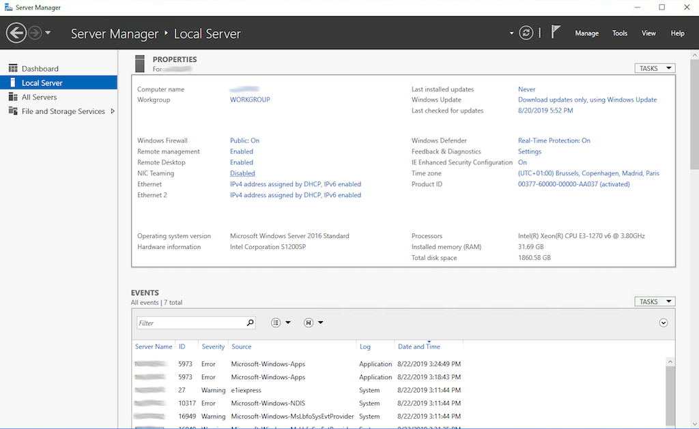
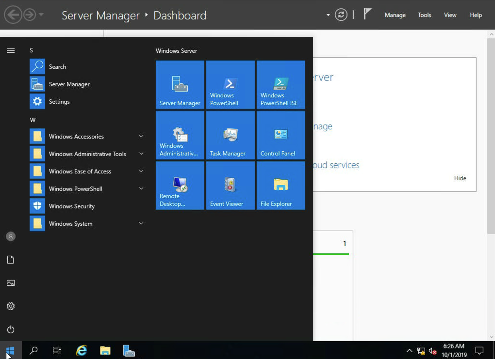
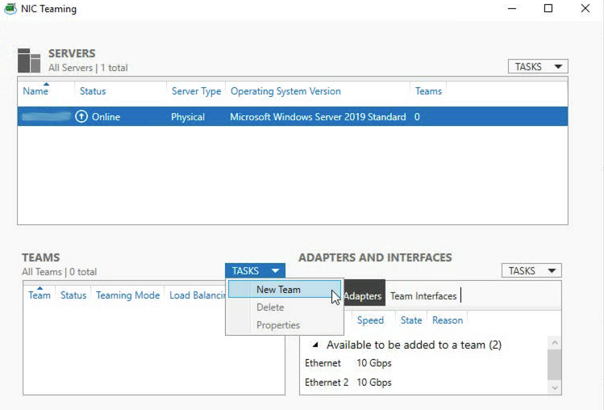
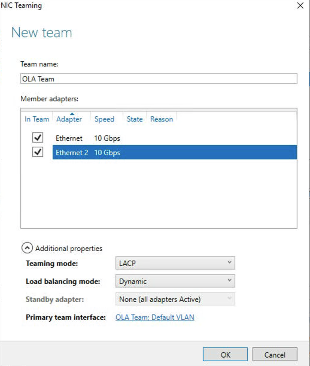
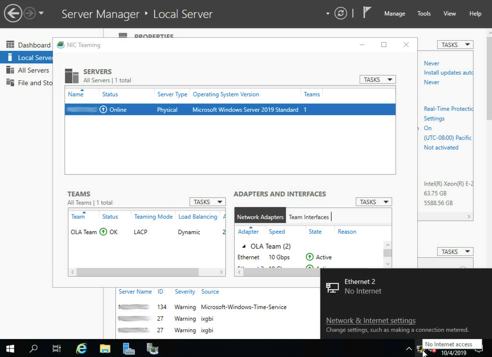
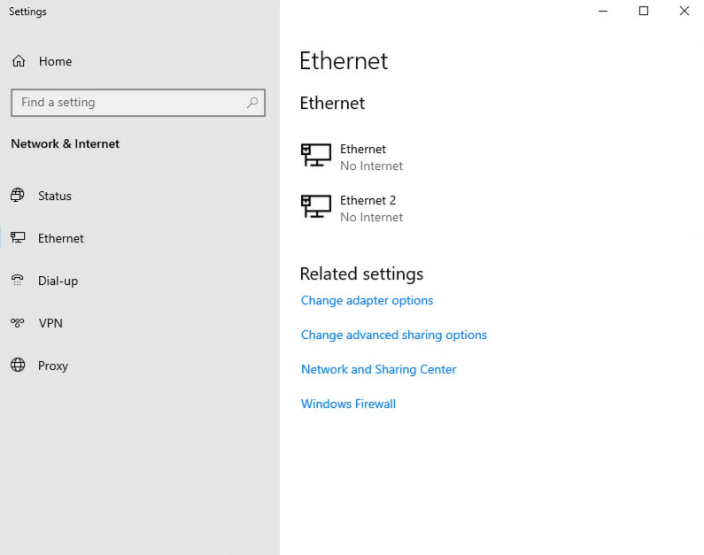
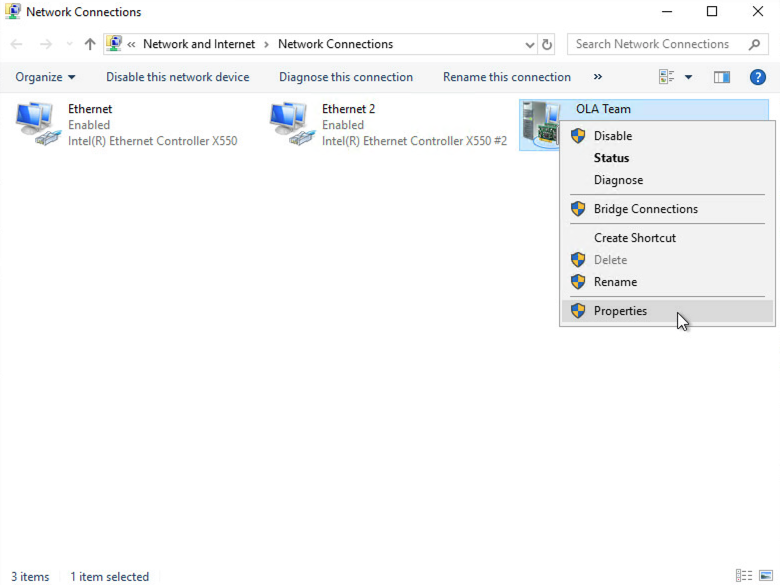
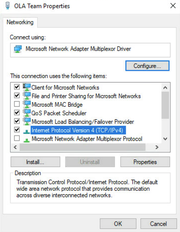
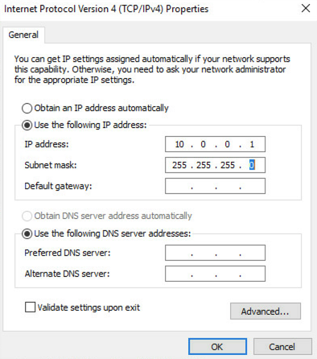

## Obiettivo

La tecnologia OVHcloud Link Aggregation (OLA) è stata progettata dai team OVHcloud per aumentare la disponibilità dei server e potenziare le connessioni di rete. L'attivazione dell'opzione permette di aggregare in pochi click le schede di rete e rendere i collegamenti ridondati in modo che, in caso di malfunzionamenti, il traffico venga reindirizzato automaticamente verso il collegamento disponibile. La larghezza di banda disponibile viene anche raddoppiata grazie all'aggregazione.
L'aggregazione si basa sulla tecnologia IEEE 802.3ad, Link Aggregation Control Protocol (LACP).

**Questa guida spiega come configurare NIC Teaming per OLA in Windows Server 2019.**

## Prerequisiti

- [Configurare OVHcloud Link Aggregation nello Spazio Cliente OVHcloud](/pages/bare_metal_cloud/dedicated_servers/ola-enable-manager)

<!-- CP-NAV-START:baremetal-dedicated-servers -->
---

### Accesso allo Spazio Cliente OVHcloud

- **Link diretto:** [Server dedicati](/links/control-panel/baremetal-dedicated-servers)
- **Percorso di navigazione:** `Bare Metal Cloud`{.action} > `Server dedicati`{.action} > Seleziona il tuo server

---
<!-- CP-NAV-END:baremetal-dedicated-servers -->

## Procedura

Poiché la configurazione dei NIC in OLA è di tipo privato-privato, non sarà possibile accedere al server in SSH. Sarà quindi necessario utilizzare lo strumento IPMI per accedere al server.
 Per farlo, clicca sulla scheda `IPMI`{.action} (1).

Clicca poi sul pulsante `Da una applet Java (KVM)`{.action} (2).

{.thumbnail}

Verrà scaricato un software JNLP. Avvialo per accedere all'IPMI. Accedi utilizzando le informazioni di identificazione associate al server.

Una volta effettuato il login alla macchina, apri Server Manager (se non si apre di default, è disponibile nel menu **Start**).

{.thumbnail}

A questo punto clicca sulla scheda `Local Server`{.action} a sinistra e clicca sul pulsante `Disabled`{.action} vicino a **NIC Teaming**.

{.thumbnail}

Si apre una nuova finestra: nella sezione **TEAMS**, clicca su `TASKS`{.action} e seleziona **New Team** dal menu a tendina.

{.thumbnail}

Assegna un nome al team e spunta i NIC da utilizzare con OLA. Clicca sulla freccia verso il basso in corrispondenza di **Additional properties** e modifica il `Teaming mode` in LACP. Una volta verificata la correttezza delle informazioni inserite, clicca su `OK`{.action}.

{.thumbnail}

Potrebbero essere necessari un paio di minuti prima che il team NIC risulti online. Una volta terminato, clicca sull'icona della connessione di rete in basso a destra e poi sul pulsante `Network & Internet settings`{.action}. Seleziona **Ethernet** nella barra laterale sinistra.

{.thumbnail}

Clicca su `Change adapter options`{.action}.

{.thumbnail}

A questo punto clicca con il tasto destro sul team NIC e seleziona **Properties** nel menu a tendina.

{.thumbnail}

Nella nuova finestra, clicca due volte su `Internet Protocol Version 4 (TCP/IPv4)`{.action}.

{.thumbnail}

Seleziona `Use the following IP address`{.action} e aggiungi l'IP privato e la sottorete scelta. Una volta verificata la correttezza delle impostazioni, clicca su `OK`{.action}.

{.thumbnail}

Per testare il corretto funzionamento del nuovo NIC team creato, effettua il ping di un altro server presente nella stessa vRack. Se funziona, la procedura è conclusa. In caso contrario, verifica nuovamente la configurazione o prova a riavviare il server.

## Per saperne di più

[Configurare OVHcloud Link Aggregation nello Spazio Cliente OVHcloud](/pages/bare_metal_cloud/dedicated_servers/ola-enable-manager)

[Come configurare la NIC per OVHcloud Link Aggregation in Debian 12 o Ubuntu 24.04 con Netplan](/pages/bare_metal_cloud/dedicated_servers/lacp-enable-netplan)

[Configurare un NIC per il servizio OVHcloud Link Aggregation in Debian 9 a 11](/pages/bare_metal_cloud/dedicated_servers/ola-enable-debian9)

[Configurare un NIC per il servizio OVHcloud Link Aggregation in SLES 15](/pages/bare_metal_cloud/dedicated_servers/ola-enable-sles15)

Contatta la nostra [Community di utenti](/links/community).
