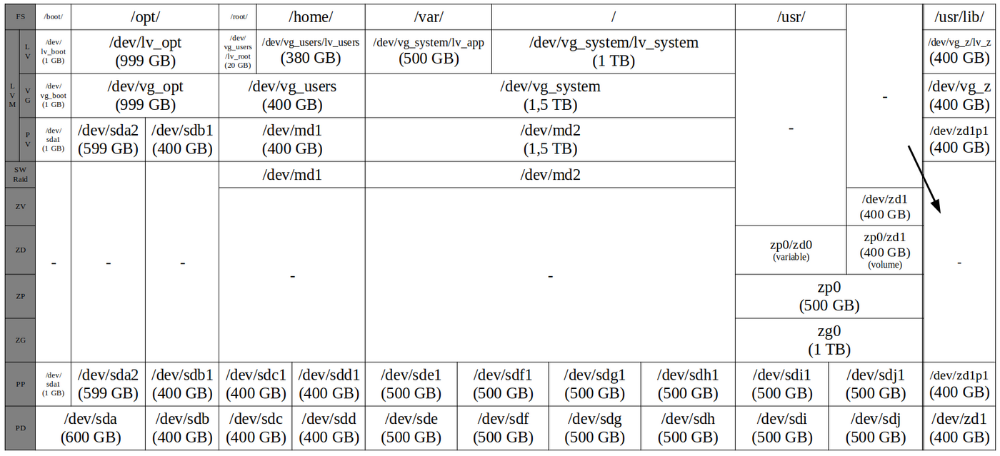

## Objectif

> [!warning]
>
> Cet article est destiné aux utilisateurs expérimentés qui ont au minimum des connaissances de base sur Linux, mais surtout des connaissances plus approfondies sur le stockage et en particulier sur les RAID logiciels, RAID matériels ainsi que sur la gestion logique des volumes (LVM).
>

Les [serveurs dédiés](/links/bare-metal/bare-metal) OVHcloud vous permettent de configurer les disques, le [RAID matériel](/pages/bare_metal_cloud/dedicated_servers/raid_hard), le [RAID logiciel](/pages/bare_metal_cloud/dedicated_servers/raid_soft), LVM, ZFS, etc. pendant [l’installation](/pages/bare_metal_cloud/dedicated_servers/getting-started-with-dedicated-server) de votre système d'exploitation depuis l’[API OVHcloud](https://api.ovh.com/) ou depuis votre [espace client OVHcloud](https://www.ovh.com/manager/#/dedicated/configuration). Dans cet article, nous allons nous concentrer sur l'[API OVHcloud](https://api.ovh.com/).<br>
Cela vous donnera plus de détails sur le moteur qui s'exécute en arrière-plan, afin de créer le personnalisation du stockage sur le serveur dédié à partir des données d'entrée transmises à l'API OVHcloud.

Fournir des détails avancés sur la configuration du stockage peut vous aider à comprendre pourquoi :

- votre personnalisation du stockage n'a pu être appliquée sur votre serveur dédié.
- la personnalisation du stockage réelle sur votre serveur dédié est légèrement différente de ce que vous aviez demandé.

## Prérequis

* Un [serveur dédié](/links/bare-metal/bare-metal) **prêt à être installé/réinstallé** sur votre compte OVHcloud.
* Avoir accès à l'[API OVHcloud](https://api.ovh.com/).

> [!warning]
>
> La réinstallation d'un serveur dédié supprime toutes les données qui y sont actuellement stockées.
>

## En pratique

Lors de l'installation du système d'exploitation par défaut, l'installateur du système d'exploitation (fourni par l'éditeur du logiciel) invite l'utilisateur à spécifier les disques sur lesquels le système d'exploitation sera installé, la configuration du partitionnement, etc. Une fois l’OS installé, il est possible de modifier la disposition du partitionnement mais cela peut s’avérer très délicat et risqué, notamment pour les partitions qui sont actuellement utilisées par le système. Pour cette raison, la configuration du stockage est un sujet très important qui doit être pris en compte **avant** d'installer un système d'exploitation.

Outre la simplicité de l'API, le principal avantage est la possibilité de personnaliser totalement les disques et partitions sur lesquels sera installé l’OS.

Dans cette page, nous nous focaliserons seulement sur la sous-hash `storage` du call API utilisé pour réinstaller un OS sur un serveur dédié. Pour les personnalisations d'installation OS non liées au stockage, veuillez vous référer à la page [API OVHcloud et installation d'un OS](/pages/bare_metal_cloud/dedicated_servers/api-os-installation) pour plus de détails.

> [!api]
>
> @api {v1} /dedicated/server POST /dedicated/server/{serviceName}/reinstall
>

```json
{
    "operatingSystem": "debian12_64",
    "storage": [
        {
            "diskGroupId": 2,
            "hardwareRaid": [
                {
                    "raidLevel": null,
                    "disks": 2
                }
            ],
            "partitioning": {
                "disks": 2,
                "layout": [
                    {
                        "fileSystem": "ext4",
                        "mountPoint": "/boot",
                        "size": 1000,
                        "raidLevel": 1
                    },
                    {
                        "fileSystem": "ext4",
                        "mountPoint": "/",
                        "size": 0
                    }
                ]
            }
        }
    ]
}
```

### Grappes de disques <a name="disk-group"></a>

Certains [serveurs dédiés](/links/bare-metal/bare-metal) possèdent plusieurs grappes ou groupes de disques. Par exemple, une grappe avec des disques SATA et une grappe avec des disques SSD. Nous appelons ces types de serveurs des **serveurs hybrides**.

Pour lister les grappes et leurs disques, vous pouvez utiliser l'appel suivant afin de déterminer le groupe de disques sur lequel vous souhaitez effectuer votre installation OS :

> [!api]
>
> @api {v1} /dedicated/server GET /dedicated/server/{serviceName}/specifications/hardware
>

Exemple de retour :

```json
{
  "bootMode": "uefi",
  "defaultHardwareRaidSize": null,
  "description": "SCALE-7 - AMD Epyc 7763",
  "expansionCards": null,
  "threadsPerProcessor": 128,
  "memorySize": {
    "unit": "MB",
    "value": 524288
  },
  "defaultHardwareRaidType": null,
  "diskGroups": [
    {
      "defaultHardwareRaidType": null,
      "numberOfDisks": 2,
      "diskGroupId": 1,
      "diskType": "SSD",
      "defaultHardwareRaidSize": null,
      "diskSize": {
        "unit": "GB",
        "value": 480
      },
      "description": "2 X Disk SSD 480 GB, JBOD",
      "raidController": null
    },
    {
      "defaultHardwareRaidType": null,
      "numberOfDisks": 2,
      "diskGroupId": 2,
      "diskType": "NVME",
      "defaultHardwareRaidSize": null,
      "diskSize": {
        "unit": "GB",
        "value": 1920
      },
      "raidController": null,
      "description": "2 X Disk NVME 1920 GB, JBOD"
    }
  ],
  "processorArchitecture": "x86_64",
  "coresPerProcessor": 64,
  "processorName": "Epyc7763",
  "formFactor": "1u",
  "motherboard": "S8036-M",
  "numberOfProcessors": 1,
  "usbKeys": null
}
```

Dans cet exemple, vous avez 2 grappes :

- la première (diskGroupId=1) contient 2 disques de 480 Go chacun,
- la seconde (diskGroupId=2) contient 2 disques de 1,9 To chacun.

Example avec une installation OS de Debian 12 (Bookworm) sur le diskGroupId 2:

> [!api]
>
> @api {v1} /dedicated/server POST /dedicated/server/{serviceName}/reinstall
>

```json
{
    "operatingSystem": "debian12_64",
    "storage": [
        {
            "diskGroupId": 2
        }
    ]
}
```

> [!primary]
>
> Par défaut, le système d’exploitation est installé sur le diskGroupId 1.
>

<br />

> [!warning]
>
> Pour l'instant, l'API ne supporte que l'installation OS et la personnalisation du stockage sur 1 seule grappe de disque. Vous pouvez impliquer de 1 à tous les disques de la grappe choisie dans la personnalisation du stockage. Cependant, tous les autres disques seront effacés mais seront visibles par l'OS installé, et peuvent être utilisés/configurés ultérieurement pour stocker des données.
>

### RAID Hardware <a name="hard-raid"></a>

Cette section est seulement applicable pour les serveurs qui ont au moins un contrôleur RAID matériel dans l'une de leurs [grappes de disques](#disk-group).

#### Serveur & Compatibilité du RAID matériel

Vous pouvez utiliser le call API suivant afin de savoir si votre serveur dédié est compatible :

> [!api]
>
> @api {v1} /dedicated/server GET /dedicated/server/{serviceName}/install/hardwareRaidProfile
>

Si votre serveur dédié n'a pas de contrôleur RAID matériel, l'appel répond avec une erreur HTTP 403 (Forbidden) et le message suivant :

```json
{
  "message": "Hardware RAID is not supported by this server"
}
```

Exemple de réponse pour un serveur qui possède un RAID matériel :

```json
{
  "controllers": [
    {
      "type": "mega",
      "disks": [
        {
          "names": [
            "c0:d0",
            "c0:d1",
            "c0:d2"
          ],
          "type": "SSD",
          "capacity": {
            "unit": "GB",
            "value": 960
          },
          "speed": {
            "value": "6g",
            "unit": "GB/s"
          }
        }
      ],
      "model": "9361-8i-2G"
    }
  ]
}
```

> [!primary]
>
> Vous pouvez aussi obtenir cette information à la valeur de l'attribut `raidController` du call API décrit dans la section [Grappes de disques](#disk-group).
>

#### API & RAID Matériel

> [!warning]
>
> Pour l'instant, l'API ne supporte que la personnalisation du RAID matériel pour 1 seul contrôleur de RAID matériel. Si votre serveur possède plusieurs contrôleurs de RAID matériel sur lesquels vous souhaitez personnaliser leurs configurations, vous pouvez configurer le(s) autre(s) contrôleur(s) que celui de la grappe de disques choisie pour l'installation OS **avant** la réinstallation OS (vous pouvez aussi le faire une fois la réinstallation OS terminée, mais nous vous recommandons de le faire **avant**, afin d'éviter tout risque de mauvaise manipulation qui aurait pour conséquence une perte de données).
>

Exemple d'une installation OS avec un RAID 1 matériel entre les 2 premiers disques de la grappe de disques :

> [!api]
>
> @api {v1} /dedicated/server POST /dedicated/server/{serviceName}/reinstall
>

```json
{
    "operatingSystem": "debian12_64",
    "storage": [
        {
            "hardwareRaid": [
                {
                    "raidLevel": 1,
                    "disks": 2
                }
            ]
        }
    ]
}
```

> [!primary]
>
> Si `disks` n'est pas spécifié, alors **tous** les disques de la grappe de disques seront impliqués dans le RAID matériel.
>

Maintenant supposons que vous avez un serveur dédié avec 1 grappe de disques attachée au contrôleur RAID matériel et 12 disques dans cette grappe. Exemple avec un RAID hardware 10 :

```json
{
    "operatingSystem": "debian12_64",
    "storage": [
        {
            "hardwareRaid": [
                {
                    "raidLevel": 10,
                    "arrays": 4
                }
            ]
        }
    ]
}
```

Dans cet exemple : tous les 12 disques seront impliqués dans le RAID matériel de niveau 10. Il y aura 4 groupes de 3 disques, ce qui signifie 4 RAID 1 entre 3 disques et les 4 groupes seront en RAID 0.

> [!primary]
>
> Le RAID matériel est à une couche qui n'est pas visible par l'OS. Ainsi, tous les OS sont « compatibles » avec le RAID matériel.
>

Tous les disques impliqués dans la configuration du RAID matériel seront vus comme 1 seul disque virtuel par l'OS.

Par conséquent, si vous avez impliqué tous les disques de la grappe de disques cible dans une configuration de RAID matériel, configurer un RAID logiciel par dessus ne sera pas applicable, puisque l'OS ne voit qu'1 seul disque virtuel.

### Partitionnement <a name="partitioning"></a>

Lorsque l’on parle de schéma de partitionnement, on évoque l’organisation de vos données sur les disques, c’est-à-dire tout ce qui arrive sur votre disque physique (ou disque virtuel, si vous avez configuré un RAID matériel), jusqu’au système de fichiers monté et visible sur l’OS, des couches les plus basses aux plus hautes :

- Disque (disque physique/virtuel, PD)
- Partition (partition physique, PP)
- ZFS : vdev (zgroup, ZG), zpool (ZP), dataset ZFS (ZD), volume ZFS (ZV)
- [RAID logiciel](/pages/bare_metal_cloud/dedicated_servers/raid_soft) (SR)
- LVM : volume physique (VP), groupe de volumes (VG), volume logique (LV)
- Système de fichiers avec point de montage (FS)

Le tableau suivant donne une vue d'ensemble des différents composants de partitionnement et de la manière dont ces couches interagissent :

{.thumbnail}

> [!primary]
>
> Dans le tableau ci-dessus, `/dev/zd1` représente un volume ZFS (aussi appelé `zvol`). Il s'agit d'un disque virtuel situé au-dessus d'un ensemble de données ZFS (ZD) et d'un zpool (ZP), qui est considéré comme un disque physique normal (PD) par le système d'exploitation. Cette fonctionnalité n'est pas disponible sur l'API OVHcloud et nous ne prévoyons pas de l'implémenter.
>

#### OS & Compatibilité du partitionnement <a name="os-partitioning-compatibility"></a>

Puisque la configuration du partitionnement sera visible par l'OS, l'OS choisi pour l'installation a un impact sur les possibilités de personnalisation de votre partitionnement.

Dans la section `/dedicated/installationTemplate`{.action}, vous pouvez obtenir les détails tels que la compatibilité LVM, la disponibilité du système de fichiers pour un OS en particulier :

> [!api]
>
> @api {v1} /dedicated/installationTemplate GET /dedicated/installationTemplate/{templateName}
>

Par exemple :

```json
{
    "templateName": "debian11_64",
    "filesystems": [
        "ext3",
        "ext4",
        "swap",
        "xfs"
    ],
    ...
    "lvmReady": true,
    "noPartitioning": false,
    "softRaidOnlyMirroring": false
}
```

|Attribute|Description|
|---|---|
|filesystems|Systèmes de fichiers compatibles avec ce système d'exploitation|
|lvmReady|Indique si ce système d'exploitation supporte LVM ou pas|
|noPartitioning|Si vrai, ce système d'exploitation ne supporte pas la personnalisation du partitionnement|
|softRaidOnlyMirroring|Si vrai, ce système d'exploitation ne supporte que partiellement la personnalisation du partitionnement (seulement les raids logiciels de niveaux 0 et 1 peuvent être configurés et assignés aux 2 premiers disques de la grappe de disques)|

Le call API suivant peut être utilisé pour lister les différents schémas de partitionnement d'un système d'exploitation en particulier. La plupart des systèmes d'exploitation supportent la personnalisation du partitionnement et ont par conséquent un seul schéma appelé « default ». Seuls certains d'entre-eux ne supportent pas la personnalisation du partitionnement (`noPartitioning` vaut `true`) et **peuvent** par conséquent avoir plusieurs schémas de partitionnement.

> [!api]
>
> @api {v1} /dedicated/installationTemplate GET  /dedicated/installationTemplate/{templateName}/partitionScheme
>

Les calls API suivants peuvent être utilisés pour savoir quel partitionnement sera appliqué par défaut si aucune personnalisation du partitionnement n'est spécifiée ou si elle n'est pas supportée par l'OS.

> [!api]
>
> @api {v1} /dedicated/installationTemplate GET /dedicated/installationTemplate/{templateName}/partitionScheme/{schemeName}/partition
>

<br />

> [!api]
> @api {v1} /dedicated/installationTemplate GET /dedicated/installationTemplate/{templateName}/partitionScheme/{schemeName}/partition/{mountpoint}
>

#### LVM, niveaux de RAID & compatibilité des systèmes de fichiers <a name="lvm-raid-levels-filesystems-compatibility"></a>

Le tableau suivant donne une vue d'ensemble de la compatibilité des systèmes de fichiers avec les niveaux RAID et LVM dans le contexte OVHcloud :

|Système de fichiers|LVM|RAID 0|RAID 1|RAID 5|RAID 6|RAID 7|RAID 10|
|---|---|---|---|---|---|---|---|
|Btrfs, ext4, XFS|✅|✅|✅|✅|✅|❌|✅|
|ZFS¹|❌|✅|✅|✅|✅|✅|❌|
|swap|❌|⚠️²|❌|❌|❌|❌|❌|
|NTFS|❌|❌|✅³|❌|❌|❌|❌|
|UFS, VMFS5, VMFS6, VMFS-L⁴|❌|❌|❌|❌|❌|❌|❌|

¹ Pour plus d'informations, reportez-vous au tableau [vdevs ZFS vs standard RAID](#raidz2RAID).<br />
² Le niveau de RAID pour swap ne peut être que égal à 1 au sein de l’[API OVHcloud](https://api.ovh.com/). En réalité, les partitions swap n'utiliseront pas de RAID. Lorsqu'une partition swap de taille `s` est définie sur un serveur avec un nombre `n` de disques, cela créera `n` partitions de taille `s` sur chaque disque sans aucun périphérique RAID logiciel en dessous.<br />
³ Le RAID natif Windows (celui configuré par l'installateur OVHcloud) prend en charge le RAID 1 mais uniquement entre deux disques, alors que les autres implémentations en autorisent plus de deux.<br />
⁴ L'installateur ESXi ne prend pas en charge les schémas de partitionnement personnalisés. Le partitionnement est défini par l'éditeur du logiciel. Néanmoins, l’[API OVHcloud](https://api.ovh.com/) peut vous donner une idée de ce à quoi ressemble le partitionnement : pour plus d'informations, consultez [OS & Compatibilité du partitionnement](#os-partitioning-compatibility).<br />

> [!warning]
>
> Ce tableau est fourni uniquement à titre d'information. À noter que la compatibilité LVM et surtout le système de fichiers dépendent également de l’OS (template OVHcloud) installé. Consultez la section [OS & Compatibilité du partitionnement](#os-partitioning-compatibility) pour plus de détails.
>

#### Vdevs ZFS vs RAID standard <a name="raidz2RAID"></a>

ZFS ne supporte pas les niveaux RAID standards. Il s'agit de périphériques virtuels (vdevs) pour décrire la tolérance aux pannes au sein d'un groupe de périphériques. Consultez la [documentation officielle d'OpenZFS](https://openzfs.github.io/openzfs-docs/man/7/zpoolconcepts.7.html) en anglais pour plus de détails sur les vdevs.

Afin de rendre l'API OVHcloud la plus simple possible, il est nécessaire que vous définissiez un RAID standard au sein de l'API pour les systèmes de fichiers ZFS. Le niveau RAID standard sera alors traduit par une définition équivalente de vdev. Le tableau suivant illustre la traduction des différents niveaux RAID proposés par l'API OVHcloud ainsi qu'un rappel de leurs caractéristiques respectives.

|RAID Standard|Type vdev équivalent|Nombre minimal de disques de données|Nombre de disques de parité|Nombre minimal total de disques requis|
|---|---|---|---|---|
|RAID 0|striped vdev|1|0|1|
|RAID 1|mirror|2|0|2|
|RAID 5|raidz1|2|1|3|
|RAID 6|raidz2|3|2|5|
|RAID 7|raidz3|4|3|7|
|RAID 10|❌|4|0|4|

#### API & Partitionnement

Exemple d'installation d'OS avec un partitionnement personnalisé :

> [!api]
>
> @api {v1} /dedicated/server POST /dedicated/server/{serviceName}/reinstall
>

```json
{
    "operatingSystem": "debian12_64",
    "storage": [
        {
            "partitioning": {
                "disks": 2,
                "layout": [
                    {
                        "fileSystem": "ext4",
                        "mountPoint": "/boot",
                        "size": 1000,
                        "raidLevel": 0
                    },
                    {
                        "fileSystem": "ext4",
                        "mountPoint": "/",
                        "size": 0
                    }
                ]
            }
        }
    ]
}
```

`size` 0 signifie que la partition va remplir tout l'espace restant sur les disques concernés.

> [!primary]
>
> Au maximum 1 partition peut être configurée pour remplir l'espace restant (taille 0).
>

<br />

> [!primary]
>
> Si non spécifié, `raidLevel` aura pour valeur 1.
>

Dans cet exemple, seuls les 2 premiers disques de la grappe sont impliqués dans le partitionnement (c'est à dire dans le RAID logiciel).

> [!primary]
>
> Le paramètre `disks` peut être omis si vous souhaitez impliquer tous les disques de la grappe de disques dans le RAID logiciel.
>

Comme vous pouvez le voir, un schéma de partitionnement est une liste de partitions. Voici un exemple de structure d'une partition :

```json
{
    "mountPoint": "/var/lib/vz",
    "fileSystem": "ext4",
    "size": 0,
    "raidLevel": "1",
    "extras": {
        "lv": {
            "name": "data"
        }
    }
}
```

La sous-hash `extras` est optionnelle. Pour l'instant, cette dernière peut être utilisée pour spécifier que la partition sera un volume logique (LVM) et préciser le nom de son volume logique. La sous-hash peut aussi être utilisée pour le ZFS :

```json
{
    "mountPoint": "/",
    "fileSystem": "zfs",
    "size": 0,
    "raidLevel": "5",
    "extras": {
        "zp": {
            "name": "poule"
        }
    }
}
```

Dans cet exemple, le point de montage `/` concerne un dataset ZFS dans un zpool nommé "poule" de type raidz1. Veuillez vérifier afin d'obtenir la correspondance entre les raidz et les niveaux de RAID standards.

> [!primary]
>
> Si aucun nom de zpool n'est spécifié, celui-ci sera généré automatiquement.
>

<br />

> [!primary]
>
> Utiliser un nom de zpool personnalisé peut être utile dans les cas suivants:
>
> - grouper des datasets avec les mêmes niveaux de RAID : utiliser le même nom de zpool,
> - forcer des datasets avec les mêmes niveaux de RAID à être dans des zpools distincts : utiliser des noms différents.
>

### Gestion des erreurs

Les erreurs basiques de données d'entrée client sont directement traitées par l'API OVHcloud. Il s'agit de la situation la plus courante et la plus simple car les clients peuvent voir l'erreur de manière synchrone et réessayer immédiatement.

Les données d'entrée client liées au partitionnement peuvent être trop spécifiques pour être vérifiées par l'API OVHcloud et nécessiter par conséquent un temps de traitement. L'inconvénient est que les clients sont avertis plus tard pendant le processus d'installation du système d'exploitation.

Celui-ci est visible via la barre de progression depuis [l'espace client OVHcloud](https://www.ovh.com/manager/#/dedicated/configuration).
Depuis l'[API OVHcloud](https://api.ovh.com/), cet état peut être obtenu avec l'appel API suivant :

> [!api]
>
> @api {v1} /dedicated/server GET /dedicated/server/{serviceName}/install/status
>

Il y a 2 types d'erreurs :

- **erreurs ovh** : vous n'êtes pas responsable de l'erreur, vous pouvez réinstaller avec une autre disposition de partitionnement mais OVHcloud devra corriger le défaut.
- **erreurs clients**: vous avez demandé un schéma de partitionnement qui ne peut pas être réalisé ou qui empêcherait le serveur de démarrer correctement.

Dans la section suivante, nous allons nous concentrer uniquement sur les types d'**erreurs client** dans l'étape du partitionnement, car cela n'est utile qu'aux clients.

#### Les erreurs clients fréquentes <a name="errors"></a>

Le tableau suivant donne un aperçu des erreurs clients les plus connues et de la manière de les corriger.

|Message d'erreur|Détails|Solution(s)|
|---|---|---|
|Some Linux distributions such as RHEL family OSes don't support those mountpoints / mountpoint reserved/managed by OVHcloud (`list forbidden mountpoints`). Please remove those mountpoints and restart an installation|- Vous avez choisi `/boot/efi` comme point de montage. OVHcloud créera cette partition automatiquement pour vous si votre serveur en a besoin.<br />- Vous avez choisi un point de montage qui est un *lien symbolique* sur certains OS. Voir [Filesystem Hierarchy Standard](https://refspecs.linuxfoundation.org/fhs.shtml) (en anglais) pour plus de détails.|- Choisissez un autre point de montage pour la partition ou supprimez cette partition de votre schéma de partitionnement.|
|Partition of type `t` with mountpoint `m` cannot fill the disk.|- Vous avez choisi la partition `swap` pour remplir le disque (ou partition de taille zéro si définie via l'[API OVHcloud](https://api.ovh.com/)), nous interdisons cela pour éviter de créer des partitions `swap` inutilement trop grandes.|- Définissez une taille fixe pour la partition de `swap`.|
|Missing `/` partition. Please add a `/` partition in your partition scheme!|- Tout système d'exploitation Linux nécessite au moins une partition `/`.|- Ajoutez une partition `/` dans votre schéma de partitionnement.|
|`message`. Please adjust partitions so that the `p` partition fits on `n` disk(s)|- Vous avez choisi une partition avec un RAID nécessitant un nombre de disques que votre serveur peut fournir, mais certains disques sont déjà pleins à cause d'autres partitions et/ou de cette partition actuelle.|- Si ce n'est pas déjà fait sur une autre partition, définissez la taille de la partition comme remplissant le disque (ou partition de taille zéro si définie via l'[API OVHcloud](https://api.ovh.com/).<br />- Réduisez la taille de cette partition pour qu'elle s'adapte aux disques.<br />- Réduisez la taille des autres partitions pour que cette partition s'adapte aux disques.|
|Error with MBR partition table: Partition `p` is larger than 2TiB and this server does not support GPT|- Vous avez défini une partition dont la taille excède 2TiB et vous appliquez ce partitionnement sur un serveur qui ne supporte pas le GPT|- Réduisez la taille de cette partition à 2TiB.<br />- Appliquez ce partitionnement à un autre serveur similaire qui supporte GPT|
|Error with MBR partition table: partition `p` cannot end after 2 TiB (`interval stop`) and this server does not support GPT! OVHcloud also needs to add a `cloud-init size` cloud-init partition at the very end of the disk. Therefore all customer partitions must end before (2TiB - `cloud-init size`).|- Nous ajoutons systématiquement une partition config-drive à la fin d'un disque sur votre serveur dédié. La dernière partition de votre partitionnement va se terminer après la position 2TiB sur le disque. Donc si nous ajoutons une partition config-drive après la dernière partition, celle-ci devra commencer après la position 2TiB sur le disque d'un serveur qui ne supporte pas GPT|- Réduisez la taille de cette partition de telle sorte que la somme totale de toutes les partitions du disque soit inférieure à 2TiB<br />- Ne définissez jamais de partition comme remplissant un disque (ou partition de taille zéro si définie via l'[API OVHcloud](https://api.ovh.com/)) sur un [template personnalisé](#customertemplates) que vous souhaitez utiliser pour des serveurs ayant des disques plus grands que 2TiB et qui ne supportent pas le GPT|
|`/boot` (or `/` if no `/boot` defined) partition cannot be larger than 2097151 MiB on this hardware|- La partition qui contient GRUB ne doit pas dépasser 2TiB sur ce type de contrôleur RAID|- Créez une partition `/boot` séparée avec une taille inférieure à 2TiB (1GiB devrait suffire)|
|`/boot` (or `/` if no `/boot` defined) partition type cannot be `XFS`|- La partition qui contient GRUB ne supporte pas le système de fichiers `XFS` sur ce système d'exploitation. C'est généralement le cas pour les systèmes d'exploitation de la famille debian (debian, proxmox, ubuntu)|- Créez une partition `/boot` séparée avec un système de fichiers autre que `XFS`<br />- Ne créez pas de partition `/boot` séparée, mais choisissez un système de fichier autre que `XFS` pour la partition `/`|
|`ZFS` partition already exists with zpool name `n`. Either choose another name for the `m` partition or set the same RAID level for all partitions within zpool `n`|Il est possible de définir plusieurs partitions `ZFS` avec un même nom de zpool afin que chaque dataset fasse partie du même zpool. Cela est possible uniquement dans le cas où tous les datasets (et donc les partitions définies dans l'API) ont le même niveau de RAID|- Choisissez le même niveau de RAID que les partitions `ZFS` existantes du zpool concerné<br />- Choisissez un autre nom de zpool: cette partition ne fera pas partie du même zpool<br />- Ne définissez pas de nom de zpool: un nom sera défini automatiquement et cette partition ne fera pas partie du même zpool|
|`Debian` does not provide a precompiled `ZFS` module and this server does not have enough memory to compile it. Please use a different file system|Nous essayons de toujours trouver le meilleur équilibre entre intégration dans l'écosystème OVHcloud, compatibilité matérielle et taille réduite de l'image, tout en fournissant une image la plus proche de l'image "cloud-ready" officielle fournie par l'éditeur. Le module `ZFS` n'étant pas fourni par l'éditeur, nous ne souhaitons pas alourdir l'image avec ce module pour les clients qui n'utilisent pas `ZFS` et nous souhaitons offrir un OS avec `ZFS` clé en main pour les clients qui en font la demande. Pour cette raison, le module `ZFS` est compilé et installé lors de l'installation et seulement pour les clients qui le demandent. La compilation nécessitant de la mémoire vive en plus de celle déjà utilisée pour faire fonctionner l'OS du rescue en `RAM`, nous avons fixé le seuil à 8GiB pour garantir un bon fonctionnement et une bonne expérience client|- Supprimez toutes les partitions `ZFS` ou changez pour un type de système de fichiers autre que `ZFS`<br />- Choisissez un OS qui supporte `ZFS` nativement tel que Proxmox<br />- Utilisez un serveur avec au moins 8GiB de mémoire vive|

#### Auto-correction des données d'entrée client

Afin d'améliorer l'expérience client, de réduire la charge de travail du support OVHcloud et d'éviter les changements brutaux qui pourraient avoir un impact pour le client, certaines saisies effectuées par le client sont automatiquement corrigées ou modifiées par le backend. Le tableau suivant donne une vue d'ensemble de ce qui est actuellement auto-corrigé / changé :

|Sujet|Description|
|---|---|
|Regroupement ZP|Toutes les partitions ZFS de même niveau RAID seront regroupées au sein d’un même zpool (ZP) si possible en fonction de la taille des disques et si aucun nom de zpool n'est spécifié ou que le même nom de zpool est spécifié pour toutes ces partitions.|
|Regroupement LV|Toutes les partitions de type `lv` ayant le même niveau de RAID seront regroupées au sein d'un même VG (si possible en fonction de la taille des disques).|
|Expansion VG|Dans le cas de partitions lv de niveau RAID 0, le VG s’étendra sur plusieurs PP (donc PD) et aucun périphérique SR ne sera créé.|
|VG Remplissage de disque|L'espace disque restant sera comblé par un VG (si un LV existe). La taille des LV contenus dans ce VG n'est pas affectée.|
|Réduction du niveau RAID|Dans le cas où vous choisissez une partition avec un niveau RAID nécessitant plus de disques que le serveur n’en a, le niveau RAID sera automatiquement réduit dans l’ordre suivant : 6, 10, 5, 1, 0 (ou raidz3, raidz2, raidz, mirror, striped vdev pour ZFS).|
|Réduction de la taille du PP|Dans le cas où vous avez choisi un PP qui nécessite plus d'espace que le serveur a, la taille de ce PP sera réduite afin qu'il s'adapte au disque. Notez que dans le cas où plusieurs PP nécessitent plus d'espace que celui dont dispose le système, le script n'agira que sur la première partition, en remontant une erreur plus tard dans le script pour la seconde partition surdimensionnée. Notez également qu’une erreur sera générée si vous avez paramétré une autre partition pour remplir le disque via l’API OVHcloud.|

## Aller plus loin <a name="gofurther"></a>

[API OVHcloud et installation d'un OS](/pages/bare_metal_cloud/dedicated_servers/api-os-installation)

[Gestion du RAID logiciel](/pages/bare_metal_cloud/dedicated_servers/raid_soft)

[Remplacement à chaud - RAID logiciel](/pages/bare_metal_cloud/dedicated_servers/hotswap_raid_soft)

[Gestion du RAID matériel](/pages/bare_metal_cloud/dedicated_servers/raid_hard)

[Configurer votre MegaRAID en RAID 0](/pages/bare_metal_cloud/dedicated_servers/megaraid_config)

Échangez avec notre [communauté d'utilisateurs](/links/community).
